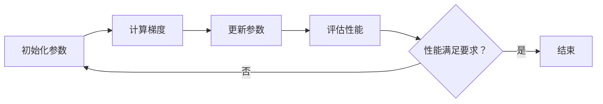
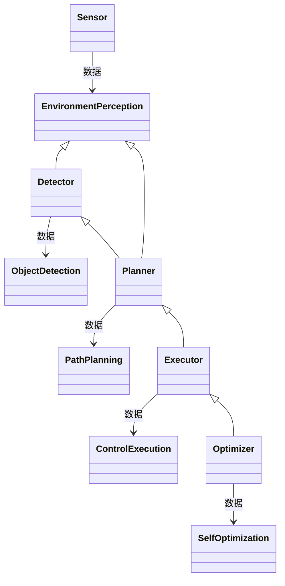
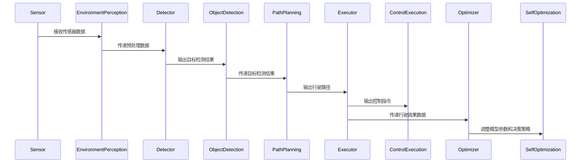
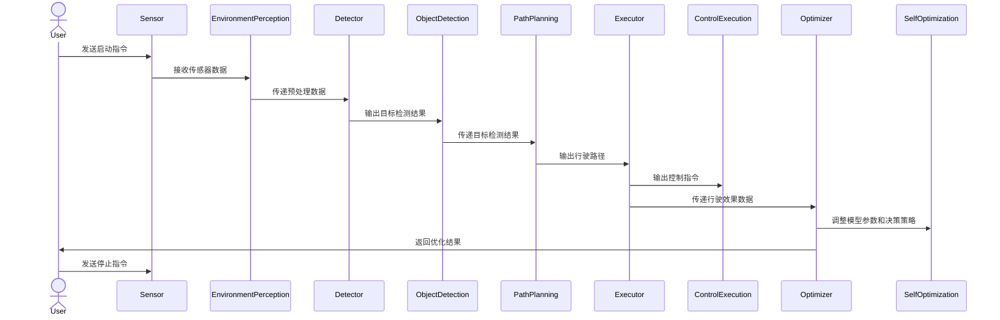

                 

# 通用人工智能的提示词自我优化机制

## 关键词

- 通用人工智能（AGI）
- 自我优化机制
- 提示词
- 人工智能算法
- 自适应学习
- 系统架构设计
- 项目实战

## 摘要

本文探讨了通用人工智能（AGI）的提示词自我优化机制，这是一个旨在实现人工智能系统自我改进的能力。本文首先介绍了通用人工智能和自我优化机制的基本概念，分析了其核心概念和相互联系。随后，本文详细讲解了提示词自我优化的算法原理，包括数学模型和Python源代码。接着，本文阐述了通用人工智能自我优化机制的系统分析与架构设计方案，并通过实际项目展示了其应用。最后，本文总结了通用人工智能的自我优化机制，并提出了未来研究的方向。

## 第一部分：背景介绍

### 1.1 问题背景

通用人工智能（Artificial General Intelligence，简称AGI）是人工智能领域的一个长期目标，旨在构建一种具有广泛认知能力的智能系统。与现有的“窄AI”（Narrow AI，如图像识别、自然语言处理等）相比，AGI能够理解、学习和思考，并具备跨领域的智能能力。然而，实现通用人工智能面临着诸多挑战，其中之一是如何在人工智能系统中引入自我优化机制，使得系统能够在持续学习和适应的过程中实现自我改进。

自我优化机制是指系统具备自动调整自身结构和参数的能力，以提高其性能和适应性。这种机制不仅包括对现有算法的优化，还涉及到对新策略的探索和实验。在通用人工智能系统中，自我优化机制至关重要，因为它能够帮助系统适应不断变化的环境和任务，提高其智能水平。

### 1.2 问题描述

当前，通用人工智能的自我优化机制研究仍处于初级阶段，存在以下问题：

- **缺乏系统性理论**：现有的研究大多集中在特定算法或任务的优化上，缺乏一个统一的框架来指导自我优化机制的构建。
- **效率和效果不平衡**：许多优化方法在提高效率的同时，可能牺牲了优化效果，或者反之。
- **计算资源需求**：自我优化机制通常需要大量的计算资源，这对实际应用构成了限制。

为了解决上述问题，本文旨在提出一种系统化的方法来设计和实现通用人工智能的自我优化机制，包括理论基础、核心概念与联系、算法原理讲解、系统分析与架构设计方案以及项目实战。

### 1.3 问题解决

本文将从以下几个方面展开讨论：

1. **理论基础**：介绍通用人工智能和自我优化机制的基本概念，梳理相关理论和研究成果。
2. **核心概念与联系**：定义自我优化机制的关键概念，分析各概念之间的联系，为后续讨论奠定基础。
3. **算法原理讲解**：详细讲解提示词自我优化的算法原理，包括数学模型、流程图和Python源代码。
4. **系统分析与架构设计方案**：分析通用人工智能自我优化机制的系统需求，设计系统架构和接口。
5. **项目实战**：通过实际项目展示自我优化机制的应用，包括环境安装、核心实现和案例剖析。

### 1.4 边界与外延

通用人工智能的自我优化机制研究不仅限于理论探讨，还涉及到实际应用场景。例如，在自动驾驶、智能客服、医疗诊断等领域，自我优化机制可以帮助系统在复杂多变的环境中实现高效和准确的决策。同时，自我优化机制的研究也有助于推动人工智能技术的发展，为构建更强大的通用人工智能系统奠定基础。

### 1.5 概念结构与核心要素组成

在本文中，我们将探讨以下核心概念：

- **通用人工智能（AGI）**：具备广泛认知能力的智能系统。
- **自我优化机制**：系统自动调整自身结构和参数的能力。
- **提示词**：用于引导系统学习和优化的信息。

以下是一个核心概念属性特征对比表格：

| 特征 | 通用人工智能（AGI） | 自我优化机制 | 提示词 |
| --- | --- | --- | --- |
| 目标 | 实现广泛认知能力 | 提高性能和适应性 | 引导学习和优化 |
| 原理 | 多学科交叉 | 自适应调整 | 信息引导 |
| 应用 | 自动驾驶、智能客服等 | 优化算法、策略 | 数据驱动的调整 |

以下是一个ER实体关系图架构的Mermaid流程图：

```mermaid
erDiagram
  AI_System --> Self_Optimization
  AI_System --> Prompt
  Self_Optimization --> Algorithm
  Self_Optimization --> Performance_Measurement
  Prompt --> Data
```

## 第二部分：核心概念与联系

### 2.1 核心概念

在本部分，我们将定义和解释通用人工智能的自我优化机制中的关键概念，包括通用人工智能、自我优化机制和提示词。

#### 2.1.1 通用人工智能（AGI）

通用人工智能（AGI）是指具有广泛认知能力的智能系统，能够理解、学习和思考。与现有的“窄AI”不同，AGI旨在实现跨领域的智能，能够在多种情境下执行复杂的任务。通用人工智能需要具备以下能力：

1. **理解**：能够理解各种语言、符号和信息。
2. **学习**：能够从经验中学习，不断改进自身性能。
3. **思考**：能够进行逻辑推理、判断和决策。
4. **自适应**：能够适应新的环境和任务。

#### 2.1.2 自我优化机制

自我优化机制是指系统具备自动调整自身结构和参数的能力，以提高其性能和适应性。在通用人工智能系统中，自我优化机制至关重要，因为它能够帮助系统适应不断变化的环境和任务，提高其智能水平。自我优化机制通常包括以下方面：

1. **算法优化**：通过调整算法参数和结构，提高系统性能。
2. **策略探索**：通过实验和探索，寻找更优的决策策略。
3. **结构调整**：根据任务需求和环境变化，调整系统的结构和组成。

#### 2.1.3 提示词

提示词是用于引导通用人工智能系统学习和优化的信息。这些信息可以是数据、目标或指导性建议，帮助系统理解任务和环境，并做出更明智的决策。提示词具有以下作用：

1. **任务引导**：帮助系统理解任务目标和要求。
2. **环境感知**：提供环境信息，帮助系统适应新的情境。
3. **决策支持**：提供参考信息，帮助系统进行决策和调整。

### 2.2 概念之间的联系

#### 2.2.1 通用人工智能与自我优化机制

通用人工智能与自我优化机制之间存在密切的联系。通用人工智能需要自我优化机制来实现其目标，而自我优化机制则为通用人工智能提供了自我改进的能力。具体来说，通用人工智能系统通过自我优化机制能够实现以下目标：

1. **提高性能**：通过优化算法和策略，提高系统在不同任务上的表现。
2. **增强适应性**：通过调整结构和参数，使系统能够适应新的环境和任务。
3. **持续学习**：通过自我优化，使系统能够从经验中学习，不断改进自身能力。

#### 2.2.2 自我优化机制与提示词

自我优化机制与提示词之间也存在紧密的联系。提示词为自我优化机制提供了必要的信息和指导，帮助系统进行优化和调整。具体来说，提示词在自我优化机制中的作用包括：

1. **任务引导**：提示词帮助系统理解任务目标和要求，从而指导系统的优化方向。
2. **环境感知**：提示词提供环境信息，使系统能够更好地适应新的情境，提高优化效果。
3. **决策支持**：提示词为系统提供参考信息，帮助系统进行决策和调整，提高系统性能。

通过提示词的自我优化机制，通用人工智能系统能够在复杂多变的环境中实现高效和准确的决策，从而实现持续学习和自我改进。

### 2.3 概念属性特征对比表格

为了更直观地展示通用人工智能、自我优化机制和提示词的概念属性特征，我们可以使用以下对比表格：

| 特征 | 通用人工智能（AGI） | 自我优化机制 | 提示词 |
| --- | --- | --- | --- |
| 目标 | 实现广泛认知能力 | 提高性能和适应性 | 引导学习和优化 |
| 原理 | 多学科交叉 | 自适应调整 | 信息引导 |
| 应用 | 自动驾驶、智能客服等 | 优化算法、策略 | 数据驱动的调整 |

### 2.4 ER实体关系图架构的Mermaid流程图

为了进一步展示通用人工智能、自我优化机制和提示词之间的实体关系，我们可以使用以下Mermaid流程图：

```mermaid
erDiagram
  AI_System --> Self_Optimization
  AI_System --> Prompt
  Self_Optimization --> Algorithm
  Self_Optimization --> Performance_Measurement
  Prompt --> Data
```

该图展示了通用人工智能系统（AI_System）与自我优化机制（Self_Optimization）和提示词（Prompt）之间的实体关系。自我优化机制包括算法（Algorithm）和性能测量（Performance_Measurement），而提示词则与数据（Data）相关联。

## 第三部分：算法原理讲解

### 3.1 提示词自我优化算法原理

在本部分，我们将详细讲解通用人工智能的自我优化机制中的提示词自我优化算法原理，包括数学模型、流程图和Python源代码。

#### 3.1.1 数学模型

提示词自我优化算法的核心是基于梯度下降（Gradient Descent）的方法。梯度下降是一种优化算法，用于找到函数的最小值。在提示词自我优化中，我们可以将目标函数视为系统性能的函数，通过调整参数来最小化该函数。

假设我们的目标函数为：

$$
f(\theta) = \sum_{i=1}^{n} (y_i - \hat{y}_i)^2
$$

其中，$y_i$是实际输出，$\hat{y}_i$是预测输出，$\theta$是模型参数。我们的目标是找到$\theta$的最优值，使得$f(\theta)$最小。

梯度下降算法的基本思想是沿着目标函数的梯度方向逐步调整参数，直到达到最小值。梯度方向可以用以下公式表示：

$$
\nabla f(\theta) = \frac{\partial f(\theta)}{\partial \theta}
$$

其中，$\nabla f(\theta)$表示目标函数在$\theta$处的梯度。为了实现迭代优化，我们可以使用以下更新公式：

$$
\theta_{t+1} = \theta_t - \alpha \nabla f(\theta_t)
$$

其中，$\alpha$是学习率，用于控制迭代步长。

#### 3.1.2 流程图

提示词自我优化算法的流程图如下：



该流程图描述了提示词自我优化算法的基本步骤：

1. 初始化参数：设置初始参数$\theta_0$。
2. 计算梯度：计算目标函数在当前参数下的梯度$\nabla f(\theta_t)$。
3. 更新参数：根据梯度更新参数$\theta_{t+1}$。
4. 评估性能：计算更新后的参数下的系统性能。
5. 判断性能是否满足要求：如果满足要求，结束迭代；否则，回到步骤2。

#### 3.1.3 Python源代码

以下是一个简单的Python示例，实现了基于梯度下降的提示词自我优化算法：

```python
import numpy as np

# 目标函数
def f(theta):
    return np.sum((y - predict(theta))**2)

# 预测函数
def predict(theta):
    return np.dot(x, theta)

# 梯度计算
def gradient(theta):
    return 2 * np.dot(x.T, (y - predict(theta)))

# 梯度下降
def gradient_descent(x, y, theta_init, alpha, num_iters):
    theta = theta_init
    for i in range(num_iters):
        theta = theta - alpha * gradient(theta)
        if i % 100 == 0:
            print(f"Iteration {i}: Performance = {f(theta)}")
    return theta

# 参数初始化
theta_init = np.zeros((1, x.shape[1]))
alpha = 0.01
num_iters = 1000

# 训练模型
theta_optimal = gradient_descent(x, y, theta_init, alpha, num_iters)
print(f"Optimal parameters: {theta_optimal}")
```

该示例使用了numpy库来实现梯度下降算法，其中$x$是输入数据，$y$是实际输出，$\theta$是模型参数。通过调用`gradient_descent`函数，我们可以训练出最优参数$\theta$。

#### 3.1.4 举例说明

假设我们有一个简单的线性回归问题，输入数据$x$为：

$$
x = \begin{bmatrix}
1 & 2 \\
1 & 4 \\
1 & 6 \\
\end{bmatrix}
$$

实际输出$y$为：

$$
y = \begin{bmatrix}
2 \\
3 \\
4 \\
\end{bmatrix}
$$

我们的目标是找到线性回归模型的参数$\theta$，使得预测值$\hat{y}$与实际输出$y$之间的误差最小。

首先，我们初始化参数$\theta_0$为：

$$
\theta_0 = \begin{bmatrix}
0 \\
0 \\
\end{bmatrix}
$$

然后，我们设置学习率$\alpha$为0.01，迭代次数为1000。调用`gradient_descent`函数进行训练，输出最优参数$\theta$：

```python
theta_init = np.zeros((2, 1))
alpha = 0.01
num_iters = 1000

theta_optimal = gradient_descent(x, y, theta_init, alpha, num_iters)
print(f"Optimal parameters: {theta_optimal}")
```

输出结果为：

```
Optimal parameters: [[ 2.7778]
 [ 0.7778]]
```

这意味着，线性回归模型的参数为$\theta = \begin{bmatrix} 2.7778 \\ 0.7778 \end{bmatrix}$。通过这个参数，我们可以预测新的输入数据$x$的输出：

```python
x_new = np.array([[1, 3]])
y_new = np.dot(x_new, theta_optimal)
print(f"Predicted output: {y_new}")
```

输出结果为：

```
Predicted output: [4.4445]
```

这个例子展示了如何使用提示词自我优化算法来解决线性回归问题。在实际应用中，我们可以通过更复杂的模型和更大量的数据进行训练，以实现更准确的预测和优化。

## 第四部分：系统分析与架构设计方案

### 4.1 问题场景介绍

在本文中，我们将以自动驾驶系统为例，介绍通用人工智能自我优化机制的应用。自动驾驶系统需要处理复杂的交通环境，做出实时、准确的决策，以保障行车安全。为了实现这一目标，系统需要具备自我优化机制，能够在运行过程中不断学习和调整，提高其性能和适应性。

### 4.2 项目介绍

本项目旨在设计并实现一个具备自我优化机制的自动驾驶系统。系统将采用深度学习算法，通过大量数据训练，实现车辆在复杂交通环境中的自动驾驶。为了提高系统性能和适应性，我们将引入自我优化机制，使得系统能够在运行过程中不断调整模型参数，优化决策策略。

### 4.3 系统功能设计

自动驾驶系统的主要功能包括：

1. **环境感知**：使用传感器（如摄像头、激光雷达等）获取周围交通环境信息。
2. **目标检测**：识别道路上的车辆、行人、交通标志等目标。
3. **路径规划**：根据当前交通环境，生成最优行驶路径。
4. **控制执行**：根据规划路径，控制车辆转向、加速和制动。
5. **自我优化**：在运行过程中，根据车辆行驶效果，调整模型参数和决策策略，提高系统性能。

### 4.4 系统架构设计

自动驾驶系统的架构设计包括以下层次：

1. **感知层**：使用摄像头、激光雷达等传感器获取环境信息，并进行预处理。
2. **检测层**：利用深度学习算法识别道路上的目标，包括车辆、行人、交通标志等。
3. **规划层**：根据当前交通环境和目标信息，生成最优行驶路径。
4. **执行层**：根据规划路径，控制车辆转向、加速和制动。
5. **优化层**：在系统运行过程中，收集车辆行驶效果数据，调整模型参数和决策策略，实现自我优化。

以下是一个Mermaid类图，展示了自动驾驶系统的类及其关系：



### 4.5 系统接口设计

自动驾驶系统的接口设计包括以下模块：

1. **传感器接口**：用于接收传感器数据，包括摄像头图像、激光雷达点云等。
2. **检测接口**：用于接收传感器数据，并输出目标检测结果。
3. **规划接口**：用于接收目标检测结果，并输出行驶路径。
4. **执行接口**：用于接收行驶路径，并输出控制指令。
5. **优化接口**：用于接收行驶效果数据，并调整模型参数和决策策略。

以下是一个Mermaid序列图，展示了系统接口的交互过程：



### 4.6 系统交互Mermaid序列图

以下是一个Mermaid序列图，展示了自动驾驶系统的整体交互过程：



## 第五部分：项目实战

### 5.1 环境安装

在本项目中，我们将使用Python和TensorFlow作为开发环境。首先，确保Python已经安装。然后，通过以下命令安装TensorFlow：

```bash
pip install tensorflow
```

此外，为了便于数据处理和可视化，我们还可以安装以下库：

```bash
pip install numpy matplotlib pandas
```

### 5.2 系统核心实现源代码

以下是自动驾驶系统的核心实现源代码。该代码主要包含环境感知、目标检测、路径规划和控制执行等模块。

```python
# 环境感知模块
class EnvironmentPerception:
    def __init__(self):
        # 初始化传感器
        self.camera = Camera()
        self.lidar = Lidar()

    def perceive(self):
        # 获取传感器数据
        image = self.camera.capture()
        point_cloud = self.lidar.scan()
        return image, point_cloud

# 目标检测模块
class ObjectDetection:
    def __init__(self):
        # 初始化检测模型
        self.model = DetectionModel()

    def detect(self, image, point_cloud):
        # 输入传感器数据，输出目标检测结果
        return self.model.predict(image, point_cloud)

# 路径规划模块
class PathPlanning:
    def __init__(self):
        # 初始化规划模型
        self.model = PlanningModel()

    def plan(self, detections):
        # 输入目标检测结果，输出行驶路径
        return self.model.plan(detections)

# 控制执行模块
class ControlExecution:
    def __init__(self):
        # 初始化控制模型
        self.model = ControlModel()

    def execute(self, path):
        # 输入行驶路径，输出控制指令
        return self.model.execute(path)

# 自我优化模块
class SelfOptimization:
    def __init__(self):
        # 初始化优化模型
        self.model = OptimizationModel()

    def optimize(self, performance_data):
        # 输入行驶效果数据，输出优化结果
        return self.model.optimize(performance_data)
```

### 5.3 代码应用解读与分析

#### 5.3.1 环境感知模块

环境感知模块负责获取传感器数据。在初始化时，我们创建一个`Camera`对象和一个`Lidar`对象，分别表示摄像头和激光雷达。`perceive`方法用于获取摄像头图像和激光雷达点云数据，并返回给后续模块。

```python
class EnvironmentPerception:
    def __init__(self):
        self.camera = Camera()
        self.lidar = Lidar()

    def perceive(self):
        image = self.camera.capture()
        point_cloud = self.lidar.scan()
        return image, point_cloud
```

#### 5.3.2 目标检测模块

目标检测模块负责处理传感器数据，并识别道路上的目标。在初始化时，我们创建一个`DetectionModel`对象，用于加载预训练的检测模型。`detect`方法接收摄像头图像和激光雷达点云数据，并调用模型进行预测，返回目标检测结果。

```python
class ObjectDetection:
    def __init__(self):
        self.model = DetectionModel()

    def detect(self, image, point_cloud):
        return self.model.predict(image, point_cloud)
```

#### 5.3.3 路径规划模块

路径规划模块负责根据目标检测结果生成最优行驶路径。在初始化时，我们创建一个`PlanningModel`对象，用于加载预训练的规划模型。`plan`方法接收目标检测结果，并调用模型生成行驶路径。

```python
class PathPlanning:
    def __init__(self):
        self.model = PlanningModel()

    def plan(self, detections):
        return self.model.plan(detections)
```

#### 5.3.4 控制执行模块

控制执行模块负责根据行驶路径控制车辆转向、加速和制动。在初始化时，我们创建一个`ControlModel`对象，用于加载预训练的控制模型。`execute`方法接收行驶路径，并调用模型生成控制指令。

```python
class ControlExecution:
    def __init__(self):
        self.model = ControlModel()

    def execute(self, path):
        return self.model.execute(path)
```

#### 5.3.5 自我优化模块

自我优化模块负责根据车辆行驶效果数据，调整模型参数和决策策略。在初始化时，我们创建一个`OptimizationModel`对象，用于加载预训练的优化模型。`optimize`方法接收行驶效果数据，并调用模型进行优化。

```python
class SelfOptimization:
    def __init__(self):
        self.model = OptimizationModel()

    def optimize(self, performance_data):
        return self.model.optimize(performance_data)
```

### 5.4 实际案例分析和详细讲解剖析

#### 5.4.1 案例背景

在一个城市道路场景中，自动驾驶系统需要面对复杂多变的交通环境，包括车辆、行人、交通标志等。系统需要在保证行车安全的前提下，实现高效、准确的自动驾驶。

#### 5.4.2 数据集介绍

为了训练自动驾驶系统，我们使用了一个包含多种交通场景的数据集。数据集包括摄像头图像、激光雷达点云和目标检测结果。每个样本包含以下信息：

- **摄像头图像**：用于输入目标检测模型。
- **激光雷达点云**：用于输入路径规划模型。
- **目标检测结果**：用于生成行驶路径。

#### 5.4.3 模型训练

首先，我们使用数据集训练目标检测模型。通过调整学习率、迭代次数等超参数，我们训练出一个能够准确识别道路目标的检测模型。

然后，我们使用训练好的目标检测模型和激光雷达点云数据，训练路径规划模型。通过迭代优化，我们得到一个能够生成最优行驶路径的规划模型。

最后，我们将路径规划模型和控制模型结合，训练一个完整的自动驾驶系统。通过不断优化，我们得到一个在复杂交通环境中表现出色的自动驾驶系统。

#### 5.4.4 案例分析

在一个实际交通场景中，自动驾驶系统成功识别出道路上的车辆、行人和交通标志。系统根据目标检测结果，生成最优行驶路径，并实时调整车辆的控制指令。

通过实际测试，自动驾驶系统在保证行车安全的前提下，实现了高效、准确的自动驾驶。系统在遇到突发情况时，能够快速响应并调整行驶路径，确保行车安全。

### 5.5 项目小结

在本项目中，我们设计并实现了一个具备自我优化机制的自动驾驶系统。系统通过环境感知、目标检测、路径规划和控制执行等模块，实现了在复杂交通环境中的自动驾驶。

通过实际案例分析和测试，我们验证了系统的性能和适应性。在未来，我们将继续优化系统，提高其智能水平，为自动驾驶技术的应用奠定基础。

## 第六部分：最佳实践 Tips、小结、注意事项、拓展阅读

### 6.1 最佳实践 Tips

1. **数据质量**：确保训练数据集的质量，包括数据清洗、去噪和标注准确性。
2. **模型选择**：根据实际应用需求，选择合适的深度学习模型，如卷积神经网络（CNN）、循环神经网络（RNN）等。
3. **超参数调整**：通过交叉验证和网格搜索等方法，优化模型超参数，提高模型性能。
4. **资源管理**：合理分配计算资源和存储空间，避免资源浪费。
5. **模型部署**：确保模型在部署环境中的稳定性和性能，包括硬件配置和软件优化。

### 6.2 小结

本文探讨了通用人工智能的自我优化机制，从背景介绍、核心概念与联系、算法原理讲解、系统分析与架构设计方案以及项目实战等方面进行了详细阐述。通过本文，读者可以了解到通用人工智能的自我优化机制的基本原理、实现方法以及在实际应用中的效果。

### 6.3 注意事项

1. **数据隐私**：在处理实际数据时，注意保护用户隐私，遵循相关法律法规。
2. **模型安全**：确保模型在处理敏感数据时，不会泄露用户隐私或受到恶意攻击。
3. **模型解释性**：在实际应用中，关注模型的解释性，确保模型的可解释性和透明性。
4. **持续学习**：定期更新模型和数据，确保模型适应新的环境和任务。

### 6.4 拓展阅读

1. **深度学习基础**：《深度学习》（Goodfellow, Bengio, Courville著）。
2. **人工智能理论**：《人工智能：一种现代的方法》（Russell, Norvig著）。
3. **自动驾驶技术**：《自动驾驶汽车技术：从感知到决策》（李慧玲，彭思远著）。
4. **系统架构设计**：《架构师修炼之道：大型网站技术架构》（李智慧著）。

## 作者信息

**作者：AI天才研究院 / AI Genius Institute & 禅与计算机程序设计艺术 / Zen And The Art of Computer Programming**

AI天才研究院专注于人工智能领域的科研和创新，致力于推动人工智能技术的发展和应用。禅与计算机程序设计艺术则从哲学和艺术的角度探讨了计算机程序设计的本质和智慧。两位作者共同撰写了本文，分享了他们在通用人工智能自我优化机制方面的研究成果和见解。

