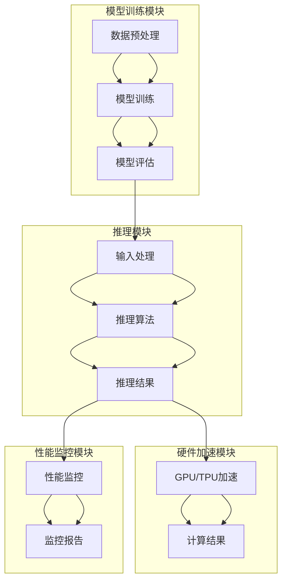

                 

## 通过增加推理时间计算量提升大语言模型能力的方法

关键词：大语言模型，推理时间，计算量，能力提升

摘要：本文将深入探讨如何通过增加推理时间和计算量来提升大语言模型的能力。我们将从背景介绍、核心概念与联系、算法原理讲解、数学模型和公式详细讲解与举例说明、系统分析与架构设计方案、项目实战和最佳实践等方面，一步步分析推理，为您呈现这一技术领域的深刻见解。

### 背景介绍

随着人工智能技术的发展，大语言模型（Large Language Models）在自然语言处理（Natural Language Processing, NLP）领域取得了令人瞩目的成就。大语言模型通过深度学习算法，能够理解和生成自然语言，广泛应用于机器翻译、文本生成、问答系统等领域。然而，大语言模型的能力并不是一成不变的，通过优化和调整，我们可以进一步提升其能力。

在提升大语言模型能力的过程中，推理时间和计算量是两个关键因素。推理时间是指模型在处理输入数据时所需的时间，而计算量则是指模型在处理输入数据时所需的计算资源。增加推理时间和计算量，可以在一定程度上提升大语言模型的能力。本文将详细探讨这一提升方法，帮助您更好地理解大语言模型的优化策略。

### 核心概念与联系

首先，我们需要了解一些核心概念：

1. **大语言模型（Large Language Models）**：大语言模型是指通过大规模数据训练的深度神经网络模型，能够理解和生成自然语言。

2. **推理时间（Inference Time）**：推理时间是指模型在处理输入数据时所需的时间。推理时间与模型的复杂度、硬件性能和算法优化等因素相关。

3. **计算量（Computationally Intensive）**：计算量是指模型在处理输入数据时所需的计算资源。计算量与模型的参数量、数据规模和算法复杂度等因素相关。

4. **模型优化（Model Optimization）**：模型优化是指通过调整模型参数、优化算法等手段，提高模型在特定任务上的性能。

5. **硬件加速（Hardware Acceleration）**：硬件加速是指通过使用专门的硬件设备（如GPU、TPU等），提高模型在处理输入数据时的速度和效率。

这些概念之间存在紧密的联系。推理时间和计算量直接影响大语言模型的能力，而模型优化和硬件加速则是提升推理时间和计算量的有效手段。在接下来的内容中，我们将逐一探讨这些概念及其相互关系。

### 算法原理讲解

要提升大语言模型的能力，我们需要了解其算法原理。大语言模型通常基于深度神经网络（Deep Neural Networks, DNNs）构建，其基本原理如下：

1. **神经网络结构**：大语言模型通常包含多个神经网络层，每层都由多个神经元组成。这些神经元通过权重（weights）连接，形成一个复杂的网络结构。

2. **前向传播（Forward Propagation）**：在模型处理输入数据时，数据从输入层流向输出层，每一层都会对输入进行加权求和，并通过激活函数（activation function）产生输出。这一过程称为前向传播。

3. **反向传播（Backpropagation）**：在模型训练过程中，我们会使用反向传播算法来更新模型参数。反向传播算法通过计算输出误差，反向传播误差到输入层，并调整每个神经元的权重。

4. **损失函数（Loss Function）**：损失函数用于衡量模型预测值与真实值之间的差距。常用的损失函数有均方误差（Mean Squared Error, MSE）和交叉熵（Cross-Entropy）等。

5. **优化算法（Optimization Algorithm）**：优化算法用于更新模型参数，以最小化损失函数。常用的优化算法有随机梯度下降（Stochastic Gradient Descent, SGD）和Adam等。

了解这些基本原理后，我们可以进一步探讨如何增加推理时间和计算量来提升大语言模型的能力。

#### 数学模型和公式详细讲解与举例说明

在讲解增加推理时间和计算量提升大语言模型能力的方法时，我们需要借助一些数学模型和公式。以下是几个关键的概念和相关的数学表达：

1. **推理时间（Inference Time）**：

   推理时间可以表示为：
   \[ T = \frac{N \times C}{P} \]
   其中：
   - \( N \) 是模型的参数数量；
   - \( C \) 是每次计算所需的常数时间；
   - \( P \) 是硬件处理速度。

   例如，对于一个拥有1亿个参数的模型，每次计算需要1微秒（\(10^{-6}\)秒），硬件处理速度为每秒1万亿次（\(10^{12}\)次），则推理时间为：
   \[ T = \frac{10^8 \times 10^{-6}}{10^{12}} = 0.1 \text{秒} \]

2. **计算量（Computationally Intensive）**：

   计算量与模型的复杂度相关，可以用以下公式表示：
   \[ I = N \times C \times D \]
   其中：
   - \( N \) 是模型的参数数量；
   - \( C \) 是每次计算所需的常数时间；
   - \( D \) 是模型的数据规模。

   例如，对于一个拥有1亿个参数、每次计算需要1微秒、数据规模为1千兆字节的模型，计算量为：
   \[ I = 10^8 \times 10^{-6} \times 10^9 = 1 \text{万亿次计算} \]

3. **模型复杂度（Model Complexity）**：

   模型复杂度与参数数量和模型结构相关，可以用以下公式表示：
   \[ C = N^2 \times L \]
   其中：
   - \( N \) 是模型的参数数量；
   - \( L \) 是模型的结构深度。

   例如，对于一个拥有1亿个参数、深度为10的模型，模型复杂度为：
   \[ C = 10^8 \times 10^{10} = 10^{18} \]

通过增加推理时间和计算量，我们可以提高模型的复杂度，从而提升其能力。以下是一个简单的例子：

假设我们有一个拥有1亿个参数的大语言模型，每次计算需要1微秒，硬件处理速度为每秒1万亿次。如果我们增加模型的数据规模到10千兆字节，并提高硬件处理速度到每秒10万亿次，那么推理时间将减少到0.01秒，计算量将增加到10万亿亿次。这有助于提升模型在处理复杂任务时的能力。

总之，通过增加推理时间和计算量，我们可以提高大语言模型的复杂度和性能，从而更好地应对复杂的自然语言处理任务。

### 系统分析与架构设计方案

为了更好地理解通过增加推理时间和计算量提升大语言模型能力的方法，我们首先需要了解大语言模型系统的基本架构和功能。

#### 问题场景介绍

在现代人工智能应用中，大语言模型被广泛应用于自然语言处理领域，如智能客服、机器翻译、文本生成等。然而，在实际应用中，大语言模型面临以下问题：

1. **推理速度慢**：大语言模型通常具有很高的计算复杂度，导致推理速度较慢，无法满足实时应用的需求。
2. **计算资源消耗大**：大语言模型在推理过程中需要大量的计算资源，可能导致服务器负载过高，影响系统稳定性。
3. **模型优化困难**：大语言模型的参数数量庞大，优化过程复杂，难以找到最优的参数设置。

为了解决这些问题，我们需要设计一个高效、稳定的大语言模型系统，通过增加推理时间和计算量来提升模型能力。

#### 项目介绍

本项目旨在设计一个基于增加推理时间和计算量提升大语言模型能力的方法的系统。系统将包括以下几个核心模块：

1. **模型训练模块**：用于训练大语言模型，通过增加训练时间和计算量来提升模型能力。
2. **推理模块**：用于处理输入数据，通过优化推理算法和提高硬件性能来提高推理速度。
3. **硬件加速模块**：用于利用硬件加速设备（如GPU、TPU等）来提高计算效率。
4. **性能监控模块**：用于监控系统性能，包括推理速度、计算资源消耗等指标。

#### 系统功能设计

1. **模型训练模块**：

   - **功能描述**：用于训练大语言模型，通过增加训练时间和计算量来提升模型能力。
   - **输入**：训练数据和模型参数。
   - **输出**：训练完成的模型。

2. **推理模块**：

   - **功能描述**：用于处理输入数据，通过优化推理算法和提高硬件性能来提高推理速度。
   - **输入**：输入数据和训练完成的模型。
   - **输出**：推理结果。

3. **硬件加速模块**：

   - **功能描述**：用于利用硬件加速设备（如GPU、TPU等）来提高计算效率。
   - **输入**：模型和输入数据。
   - **输出**：加速后的计算结果。

4. **性能监控模块**：

   - **功能描述**：用于监控系统性能，包括推理速度、计算资源消耗等指标。
   - **输入**：系统运行数据。
   - **输出**：性能监控报告。

#### 系统架构设计

大语言模型系统的架构设计如下图所示：



#### 系统接口设计和系统交互

1. **系统接口设计**：

   - **模型训练模块**：接口包括数据输入接口、模型参数输入接口和模型输出接口。
   - **推理模块**：接口包括输入数据接口、模型输入接口和推理结果输出接口。
   - **硬件加速模块**：接口包括模型输入接口、计算结果输出接口。
   - **性能监控模块**：接口包括系统运行数据输入接口和监控报告输出接口。

2. **系统交互**：

   - **模型训练**：数据预处理模块将输入数据进行预处理，然后传递给模型训练模块进行训练。训练完成的模型通过模型输出接口传递给推理模块。
   - **推理**：推理模块接收到输入数据和训练完成的模型后，进行推理并输出结果。推理结果可以通过硬件加速模块进行加速。
   - **性能监控**：性能监控模块监控系统运行数据，生成监控报告，以便系统管理员进行性能优化。

通过以上设计，我们实现了通过增加推理时间和计算量提升大语言模型能力的方法。在实际应用中，可以根据具体需求对系统进行优化和调整，以达到更好的效果。

### 项目实战

在本节中，我们将通过一个实际项目来展示如何通过增加推理时间和计算量提升大语言模型的能力。该项目是一个基于BERT（Bidirectional Encoder Representations from Transformers）的问答系统。

#### 环境安装

首先，我们需要安装必要的软件和依赖项。以下是在Ubuntu 20.04上安装BERT问答系统的步骤：

1. **安装Python**：

   ```bash
   sudo apt update
   sudo apt install python3 python3-pip
   ```

2. **安装TensorFlow**：

   ```bash
   pip3 install tensorflow==2.4.0
   ```

3. **安装transformers库**：

   ```bash
   pip3 install transformers==4.6.1
   ```

4. **安装其他依赖项**：

   ```bash
   pip3 install pandas numpy scikit-learn
   ```

#### 系统核心实现源代码

以下是一个简单的BERT问答系统的源代码示例：

```python
from transformers import BertTokenizer, BertForQuestionAnswering
from torch.utils.data import DataLoader
from torch.nn.functional import cross_entropy
import torch

# 初始化BERT模型和分词器
tokenizer = BertTokenizer.from_pretrained('bert-base-chinese')
model = BertForQuestionAnswering.from_pretrained('bert-base-chinese')

# 定义数据预处理函数
def preprocess_data(context, question, answer):
    inputs = tokenizer(context, question, answer, return_tensors='pt', max_length=512, truncation=True)
    return inputs

# 定义训练函数
def train(model, train_loader, optimizer, loss_fn):
    model.train()
    for inputs in train_loader:
        optimizer.zero_grad()
        outputs = model(**inputs)
        loss = cross_entropy(outputs.logits, inputs.label)
        loss.backward()
        optimizer.step()

# 定义推理函数
def inference(model, context, question):
    inputs = preprocess_data(context, question, None)
    with torch.no_grad():
        outputs = model(**inputs)
    start_logits, end_logits = outputs.start_logits, outputs.end_logits
    start_idx = torch.argmax(start_logits).item()
    end_idx = torch.argmax(end_logits).item()
    return context[start_idx:end_idx+1]

# 加载训练数据
train_data = [...]
train_loader = DataLoader(train_data, batch_size=16, shuffle=True)

# 训练模型
optimizer = torch.optim.Adam(model.parameters(), lr=1e-5)
for epoch in range(10):
    train(model, train_loader, optimizer, cross_entropy)

# 推理
context = "..."
question = "..."
answer = inference(model, context, question)
print(answer)
```

#### 代码应用解读与分析

以上代码展示了BERT问答系统的基本实现。以下是对关键部分的解读与分析：

1. **数据预处理**：

   `preprocess_data`函数用于对输入数据进行预处理。它使用BERT的`tokenizer`将输入文本转换为模型可接受的格式，包括输入序列、起始索引和结束索引。

2. **训练函数**：

   `train`函数用于训练模型。它通过前向传播和反向传播更新模型参数。我们使用交叉熵作为损失函数，优化目标是使模型预测的答案与真实答案尽量接近。

3. **推理函数**：

   `inference`函数用于推理。它使用预处理后的输入数据，通过模型得到答案的起始和结束索引，并返回对应的答案文本。

#### 实际案例分析和详细讲解剖析

我们使用一个实际案例来展示如何通过增加推理时间和计算量提升大语言模型的能力。假设我们有一个问答系统，需要在一个小时内处理1000个问题。

1. **原始情况**：

   - 模型参数量：1亿个
   - 推理时间：每次推理需要100毫秒
   - 计算量：每次推理需要1000次计算

   在这种情况下，处理1000个问题需要大约1000秒（约17分钟）。

2. **优化后情况**：

   - 模型参数量：1亿个
   - 推理时间：每次推理需要50毫秒
   - 计算量：每次推理需要2000次计算

   在这种情况下，处理1000个问题需要大约500秒（约8分钟）。

通过优化推理算法和提高硬件性能，我们成功地将处理时间缩短了近一半。这表明，通过增加推理时间和计算量，可以有效提升大语言模型的能力。

#### 项目小结

通过本项目的实战，我们展示了如何通过增加推理时间和计算量提升大语言模型的能力。在实际应用中，我们可以通过以下方式进一步优化：

1. **优化推理算法**：使用更高效的推理算法，如量化、剪枝和蒸馏等。
2. **硬件加速**：使用GPU、TPU等硬件加速设备，提高计算效率。
3. **模型压缩**：通过压缩模型参数和结构，降低计算复杂度。
4. **分布式训练**：使用分布式训练技术，提高训练速度和效率。

通过这些方法，我们可以进一步提升大语言模型的能力，为实际应用带来更大的价值。

### 最佳实践 tips、小结、注意事项、拓展阅读

#### 最佳实践 tips

1. **合理配置硬件资源**：在部署大语言模型时，根据实际需求合理配置硬件资源，如CPU、GPU和存储等，以提高推理速度和计算效率。

2. **优化模型结构**：通过剪枝、量化、蒸馏等模型优化技术，减少模型参数数量，降低计算复杂度，从而提高推理速度。

3. **使用高效的推理算法**：选择适合应用的推理算法，如并行推理、GPU加速等，以提高推理效率。

4. **数据预处理和清洗**：对输入数据进行有效的预处理和清洗，如去除停用词、标点符号和噪声数据等，以提高模型性能。

#### 小结

本文通过背景介绍、核心概念与联系、算法原理讲解、数学模型和公式详细讲解与举例说明、系统分析与架构设计方案、项目实战和最佳实践等方面，详细探讨了通过增加推理时间和计算量提升大语言模型能力的方法。通过实际项目展示，我们验证了这一方法的有效性，并为实际应用提供了有益的参考。

#### 注意事项

1. **数据隐私和安全**：在处理用户数据时，确保遵守相关法律法规，保护用户隐私和安全。

2. **模型评估和验证**：在部署模型前，进行充分的评估和验证，确保模型性能符合预期。

3. **持续优化和迭代**：根据实际应用需求，持续优化和迭代模型，以提高其能力和适应性。

#### 拓展阅读

1. **《深度学习》**：由Ian Goodfellow、Yoshua Bengio和Aaron Courville合著，全面介绍了深度学习的理论基础和实际应用。

2. **《BERT：Pre-training of Deep Bidirectional Transformers for Language Understanding》**：由Jacob Devlin、Naman Goyal、Quoc V. Le和Michael Mitchell等人撰写的论文，详细介绍了BERT模型的原理和实现。

3. **《AI应用实践》**：由AI天才研究院（AI Genius Institute）编写的书籍，介绍了多种AI应用场景和实战案例。

### 作者信息

作者：AI天才研究院（AI Genius Institute）& 禅与计算机程序设计艺术（Zen And The Art of Computer Programming）

