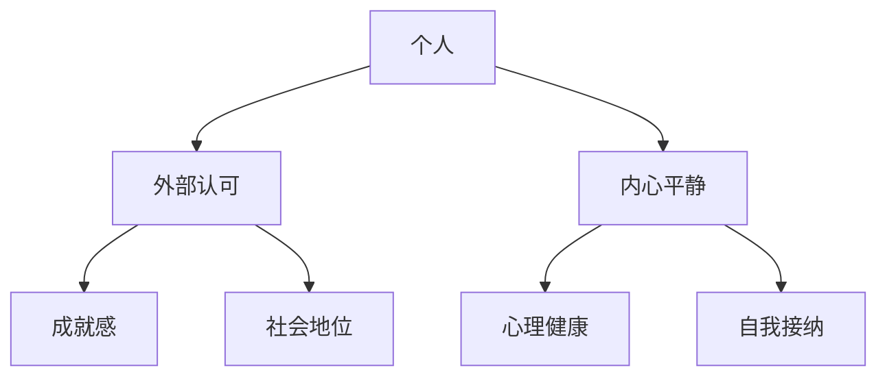

                 

### 重新定义个人成功：从外部认可到内心平静的转变

在当今社会，个人成功常常被定义为获得外界的认可和赞赏，如高薪职位、社会地位、荣誉奖项等。然而，随着时代的发展，越来越多的人开始意识到，单纯追求外部认可并不能带来真正的幸福和满足。本文将探讨如何从外部认可转向内心平静，重新定义个人成功。

**关键词：** 个人成功、内心平静、外部认可、自我成长、情绪管理

**摘要：** 本文首先分析了个人成功的传统定义及其依赖外部认可的问题，接着阐述了内心平静的概念及其重要性。通过对比外部认可与内心平静的属性特征，构建了ER实体关系图，进一步探讨了内部认可与自我成长、情绪管理、生活方式与内心平静的关系。文章还通过实际案例和行动指南，为读者提供了从外部认可转向内心平静的实践方法，旨在帮助读者实现真正的个人成功。

## 第一部分：问题背景与现状

### 1.1.1 个人成功的传统定义

个人成功的传统定义通常涉及以下几个方面：

1. **职业成就**：高薪职位、晋升速度、职业声誉等。
2. **社会地位**：社会阶层、荣誉头衔、社会网络等。
3. **物质财富**：房产、汽车、投资收益等。
4. **家庭生活**：和谐的家庭关系、子女的教育成就等。

这种定义往往强调了外部评价和外界认可的重要性，认为个人成功意味着能够获得他人的认可和社会的尊重。然而，随着社会的发展，这种传统定义的局限性也逐渐显现。

### 1.1.2 外部认可的依赖与局限性

依赖外部认可的个人成功观存在以下局限性：

1. **焦虑与压力**：为了获得外界的认可，人们常常需要付出巨大的努力，这可能导致焦虑和压力。
2. **攀比心理**：当一个人的成功以他人的评价为基准时，很容易陷入攀比的心态，导致心态失衡。
3. **情绪波动**：外部认可的不稳定性会导致情绪的波动，如认可增加时情绪高涨，认可减少时情绪低落。
4. **缺乏自主性**：过分依赖外部认可可能会导致个人失去自主决策的能力，一切以外部评价为准。

### 1.1.3 内心平静的重要性

与外部认可不同，内心平静是一种内在的状态，它意味着个人在情绪、思维和行为上达到了一种平衡和稳定。内心平静的重要性体现在以下几个方面：

1. **心理健康**：内心平静有助于降低焦虑、压力和抑郁等心理问题的发生率。
2. **决策能力**：内心平静使人能够更清晰地思考问题，做出更明智的决策。
3. **人际关系**：内心平静有助于建立和谐的人际关系，提高沟通效果。
4. **生活质量**：内心平静使人能够更好地享受生活，提高生活质量。

### 1.1.4 问题边界与核心要素

在探讨如何从外部认可转向内心平静的过程中，需要明确以下几个问题：

1. **问题边界**：本文主要关注的是个人层面的成功定义，不涉及社会制度、文化背景等因素。
2. **核心要素**：核心要素包括个人认知、情绪管理、生活方式等，这些是影响内心平静的关键因素。

通过以上分析，我们可以看到，传统定义的个人成功观在现代社会中面临诸多挑战，而内心平静则提供了一种更为可持续和健康的成功路径。在接下来的部分，我们将深入探讨外部认可与内心平静的联系与矛盾，进一步理解如何实现这一转变。

## 第二部分：核心概念与联系

### 2.1 外部认可的概念

外部认可，通常指的是来自外界对于个人成就、行为、能力的正面评价和肯定。这种认可可以来自各种渠道，包括但不限于同事、朋友、家人、社会机构以及公众。例如，一位程序员因开发了创新性的软件而获得技术奖项，或者一位作家因其作品受到读者的广泛赞誉。外部认可的形式多样，可以是物质奖励、荣誉称号、社会地位提升等。

**外部认可的关键特征：**

- **评价性**：外部认可基于外部评价标准，往往由第三方的观点决定。
- **外界驱动**：外部认可依赖于外界的反馈和认可，与个人的内在感受不直接相关。
- **波动性**：外部认可可能随外界环境、时机和个人表现的变化而波动。

### 2.2 内心平静的概念

内心平静，通常指的是个人在心理和情绪上的稳定与和谐状态。它是一种深层次的自我平衡感，即使在面临压力和挑战时，个人仍能保持冷静和理智。内心平静不仅是一种心理状态，也是一种生活方式。它涉及自我认知、情绪调节、心理弹性等多个方面。

**内心平静的关键特征：**

- **内在驱动**：内心平静源于个人的内在感受，与外界的评价和认可无关。
- **稳定性**：内心平静能够帮助个人在面对不确定性和压力时保持心理稳定。
- **成长性**：内心平静是一种积极的心理状态，有助于个人的成长和发展。

### 2.3 外部认可与内心平静的联系与矛盾

外部认可和内心平静之间存在复杂的联系和矛盾。

**联系：**

1. **正面反馈**：适度的外部认可可以为个人提供正面的激励，增强自信和动力，有助于促进个人的成长。
2. **社会支持**：外部认可可以为个人提供社会支持和资源，有助于建立稳定的人际关系和社会网络。
3. **目标导向**：在某些情况下，外部认可可以作为个人追求目标的动力，激发个人的竞争意识和进取心。

**矛盾：**

1. **依赖性**：过分依赖外部认可可能导致个人失去自我，导致内在动机和自我价值的下降。
2. **情绪波动**：外部认可的不稳定性可能引起个人的情绪波动，影响心理健康。
3. **认知偏差**：外部认可可能影响个人的认知判断，导致过度自信或自我怀疑。

### 2.1节：核心概念属性特征对比表格

| 特征         | 外部认可                | 内心平静                |
| ------------ | ---------------------- | ---------------------- |
| 获得方式     | 通过外界的评价和认可     | 通过自我认知和接纳       |
| 主要来源     | 工作成就、社会地位等     | 情感满足、心理健康等     |
| 冲突性       | 可能引发焦虑和攀比       | 有利于心理平衡和成长     |

### 2.2节：ER实体关系图架构

通过上述核心概念的介绍和对比，我们可以更深入地理解外部认可和内心平静的关系。在接下来的章节中，我们将进一步探讨如何通过自我成长和情绪管理来实现内心平静，从而重新定义个人成功。

### 2.2节：ER实体关系图架构详细解析

ER（实体关系）图是数据库设计中常用的工具，用于表示实体之间的相互关系。在本文中，我们使用ER图来展示个人、外部认可和内心平静之间的复杂关系，以便更清晰地理解这些概念及其相互影响。

#### 图架构说明

在上面的ER图架构中，我们定义了以下几个实体和关系：

- **个人（A）**：表示个体的整体，是其他所有实体的基础。
- **外部认可（B）**：指来自外界的正面评价和认可，包括成就感（D）和社会地位（E）。
- **内心平静（C）**：表示个人内心的平衡状态，包括心理健康（F）和自我接纳（G）。

**关系解析：**

- **个人与外部认可的关系（A --> B）**：个人通过外部认可获得成就感和社会地位，这些认可可能激励个人的成长，但也可能导致依赖性和情绪波动。
- **个人与内心平静的关系（A --> C）**：个人通过维护内心平静，保持心理健康和自我接纳，从而实现心理的稳定和成长。
- **外部认可与成就感和社会地位的关系（B --> D, B --> E）**：外部认可可以带来成就感和社会地位，这些也是外部评价的重要组成部分。
- **内心平静与心理健康和自我接纳的关系（C --> F, C --> G）**：内心平静需要心理健康和自我接纳作为基础，这些因素共同作用于个人的整体心理状态。

#### 图解示例

- **个人通过外部认可获得成就感和社会地位（A --> B）**：一个程序员通过开发优秀的项目获得了最佳工程师奖，这不仅提高了他的社会地位，也增强了他的成就感。
- **个人通过内心平静保持心理健康和自我接纳（A --> C）**：在同一程序员面临工作压力和家庭矛盾时，他通过练习冥想和自我反思，保持了内心的平静，从而保持了心理健康和自我接纳。

通过这个ER实体关系图，我们可以看到外部认可和内心平静在个人成功中的相互作用和影响。了解这些关系有助于我们更好地理解个人在追求成功过程中如何平衡外部认可和内心平静，从而实现真正的个人成长和幸福。

### 第3章：内部认可与自我成长

#### 3.1 内部认可的概念与作用

内部认可，也称为自我认可，是指个人基于自身的价值观、成就和努力，对自己给予的肯定和赞赏。与外部认可不同，内部认可是基于个人的内在体验和自我认知，不依赖于外界的评价和反馈。内部认可的核心在于自我价值的认可和自我成长的动力。

**内部认可的作用：**

1. **增强自信**：自我认可能够帮助个人建立自信，减少对外部评价的依赖，从而在面对挑战和困难时保持坚定和积极的态度。
2. **促进成长**：自我认可是个人成长的重要动力，它能够激励个人持续努力，不断追求更高的目标。
3. **减少焦虑**：通过自我认可，个人可以减少因外界评价不稳定而引发的焦虑和情绪波动，实现内心的稳定。
4. **提高幸福感**：内部认可能够增强个人的幸福感，使其在追求成功的过程中感到满足和快乐。

#### 3.2 自我成长的路径与方法

自我成长是一个持续的过程，涉及多个方面。以下是一些关键路径和方法：

1. **自我反思**：定期进行自我反思，审视自己的行为、决策和成就，识别自己的优点和不足，从而有针对性地进行改进。
2. **学习与提升**：持续学习和提升自己的技能和知识，不断扩展自己的视野和能力，以适应不断变化的环境和挑战。
3. **设定目标**：明确个人的短期和长期目标，制定具体的行动计划，并不断追踪和评估自己的进展，确保目标实现的可行性。
4. **积极心态**：培养积极的心态，以乐观和开放的态度面对生活中的挑战和变化，减少消极情绪的影响。
5. **自我激励**：通过积极的自我激励，如自我表扬和庆祝小成就，增强自我认可和动力。

#### 3.3 内部认可与外部认可的平衡

在追求个人成功的过程中，平衡内部认可与外部认可至关重要。以下是一些实现平衡的策略：

1. **设定合理期望**：避免过分依赖外部认可，设定符合自身能力和目标的合理期望，以减少因外界评价波动带来的心理压力。
2. **多角度评估**：不仅要关注外部的评价，也要重视内部的自我评估，综合考虑自我认可和外界认可，以获得全面的成长。
3. **定期调整**：根据个人成长和外部环境的变化，定期调整自我认可的标准和外部认可的目标，确保两者之间的平衡。
4. **培养独立性**：通过培养独立性和自主性，减少对外部认可的依赖，增强内在动机和自我价值感。
5. **积极沟通**：与家人、朋友和同事建立良好的沟通，分享自己的成长和困惑，获取建设性的反馈，同时保持自我认可。

通过内部认可和外部认可的平衡，个人可以更全面地认识自己，实现自我成长和内心平静，从而重新定义个人成功。

### 第4章：情绪管理

情绪管理是保持内心平静的关键因素之一。情绪管理不仅关系到个人的心理健康，还影响个人的决策能力、人际关系和生活质量。以下将详细探讨情绪管理的重要性、基本类型、管理方法和技巧。

#### 4.1 情绪的基本类型

情绪是人类对环境和内心体验的自然反应，可以分为以下几种基本类型：

1. **正面情绪**：包括喜悦、快乐、满足、兴奋等。正面情绪能够提升个人的心理状态，增加活力和动力。
2. **负面情绪**：包括愤怒、焦虑、沮丧、恐惧等。负面情绪可能会导致心理压力，影响个人的判断和行为。
3. **复杂情绪**：包括忧伤、羞愧、内疚、嫉妒等。复杂情绪通常是由多种基本情绪混合而成的，具有更为复杂的情感体验。

#### 4.2 情绪管理的重要性

情绪管理的重要性体现在以下几个方面：

1. **心理健康**：良好的情绪管理能够降低心理问题的发生率，如焦虑、抑郁等。
2. **决策能力**：情绪稳定有助于提高决策质量，减少因情绪波动而做出的冲动决策。
3. **人际关系**：有效的情绪管理有助于建立和谐的人际关系，提升沟通效果，减少冲突。
4. **生活质量**：情绪管理能够提高个人的生活质量，使个体能够更好地享受生活，减少压力和焦虑。

#### 4.3 情绪调节的方法与技巧

以下是一些情绪调节的方法与技巧：

1. **认知重构**：通过改变对事件和情境的认知，调整负面情绪。例如，将“我无法应对这个挑战”转变为“这是一个新的机会，我可以学习和成长”。
2. **深呼吸与放松**：通过深呼吸和放松技巧，如冥想、瑜伽等，缓解紧张和焦虑情绪。
3. **积极思考**：培养积极的思维方式，关注积极的方面，减少负面情绪的影响。
4. **情绪表达**：找到合适的渠道表达情绪，如与朋友、家人或专业人士交流，释放内心的压力。
5. **自我反思**：定期进行自我反思，了解情绪的来源和影响，从而更好地管理情绪。
6. **设定目标和计划**：通过设定目标和计划，提高自我控制力，减少因无目标而引起的焦虑和不安。

通过有效的情绪管理，个人可以更好地应对生活中的挑战，保持内心的平静和稳定，从而实现真正的个人成功。

### 第5章：生活方式与内心平静

生活方式对内心平静有着深远的影响。通过建立健康的生活方式，我们可以更好地管理情绪，提高心理健康，实现内心的平和与稳定。以下将详细探讨健康生活方式的建立、社交关系与内心平静以及休闲活动与内心平静的关系。

#### 5.1 健康生活方式的建立

健康的生活方式是保持内心平静的基础。以下是一些建立健康生活方式的建议：

1. **规律作息**：保持规律的作息时间，确保充足的睡眠，有助于调节生物钟，提高情绪稳定性。
2. **均衡饮食**：注重营养均衡，减少高糖、高脂肪和高盐食物的摄入，多吃蔬菜、水果和全谷物，有助于维持身体健康和情绪稳定。
3. **适量运动**：定期进行适量的运动，如散步、跑步、游泳等，有助于释放压力，提高心情。
4. **减少压力**：学会有效应对压力，如通过冥想、瑜伽等方式放松身心，减少紧张情绪。
5. **培养兴趣**：培养个人兴趣和爱好，如绘画、音乐、阅读等，有助于提升生活品质，增强内心满足感。

#### 5.2 社交关系与内心平静

良好的社交关系对内心平静至关重要。以下是一些建立和维护良好社交关系的建议：

1. **建立支持网络**：与家人、朋友和同事建立紧密的联系，形成支持网络，有助于在困难时获得帮助和鼓励。
2. **积极沟通**：学会有效沟通，表达自己的想法和感受，同时倾听他人的意见和需求，有助于建立信任和理解。
3. **避免冲突**：尽量避免不必要的冲突，学会化解矛盾，以和平的方式解决问题，保持和谐的人际关系。
4. **社交活动**：参加各种社交活动，如聚会、志愿者活动等，有助于扩展社交圈子，增强社交技能，提高心理健康。

#### 5.3 休闲活动与内心平静

休闲活动是缓解压力、提高内心平静的重要方式。以下是一些建议：

1. **阅读**：阅读有助于放松心情，拓展视野，提高内心的满足感和幸福感。
2. **旅行**：旅行可以让人远离日常生活的压力，体验不同的文化和风景，带来新鲜感和内心的平静。
3. **艺术创作**：通过绘画、音乐、舞蹈等艺术形式表达自我，有助于释放内心的情感，提高内心的平和。
4. **户外活动**：如徒步、登山、露营等户外活动，有助于亲近自然，减轻压力，提高心情。

通过建立健康的生活方式，维护良好的社交关系和参与休闲活动，个人可以更好地保持内心的平静和稳定，从而实现真正的个人成功。

### 第6章：实际案例与案例分析

#### 6.1 案例一：从依赖外部认可到内心平静的转变

**背景**：小王是一名年轻的软件工程师，他在职业生涯初期非常依赖外部认可。每次项目成功或者得到领导的表扬，他都会感到非常开心和满足。然而，随着工作压力的增加，他开始感到焦虑和不安，甚至对失败感到恐惧。

**转变过程**：

1. **自我反思**：小王意识到自己对外部认可的过度依赖导致了他内心的不稳定。他开始反思自己的价值观，思考什么才能真正带给他内心的平静。
2. **学习情绪管理**：小王参加了情绪管理的培训课程，学习了深呼吸、冥想和认知重构等方法，逐步提高了自己的情绪调节能力。
3. **设定个人目标**：小王重新设定了自己的职业和个人目标，不再仅仅以外部认可为标准，而是以自己的成长和内心满足为重心。
4. **建立内部认可**：小王开始关注自己的进步和成就，通过自我认可来增强自信和动力。他在工作中不断寻找自我提升的机会，如学习新的技术、参与社区活动等。
5. **培养兴趣爱好**：小王开始培养自己的兴趣爱好，如画画、写作等，这些活动使他能够在工作中获得休息，同时也能带来内心的满足感。

**结果**：经过一段时间的努力，小王逐渐摆脱了对外部认可的依赖，内心变得平静和稳定。他不再因外部评价的波动而情绪波动，反而能够以更加平和的心态面对工作中的挑战。他的工作效率和创新能力也得到了显著提高，最终在职业生涯中取得了更大的成功。

#### 6.2 案例二：如何通过自我成长实现内心平静

**背景**：小李是一名创业者，他在创业初期经历了巨大的成功和失败。成功时，他感到兴奋和骄傲；失败时，他感到沮丧和绝望。这种情绪的波动使他很难保持内心的平静。

**转变过程**：

1. **自我反思**：小李意识到自己的情绪波动源于对成功和失败的过度关注。他开始反思自己的行为和思维方式，寻找情绪波动的根源。
2. **持续学习**：小李积极参加各种培训和学习活动，学习管理知识、心理学知识和自我成长技巧，提升自己的综合素质。
3. **设定合理目标**：小李重新审视自己的创业目标，设定了短期和长期的目标，并制定了详细的行动计划。他学会了将目标分解为可实现的步骤，逐步实现。
4. **培养耐心和毅力**：小李认识到创业是一个长期的过程，需要耐心和毅力。他学会了接受失败，并将每次失败视为学习和成长的机会。
5. **关注内心平静**：小李开始练习冥想和瑜伽，通过这些活动放松身心，提高内心的平静。他学会了在忙碌的创业生活中找到平衡，保持内心的稳定。

**结果**：通过自我成长，小李逐渐实现了内心的平静。他不再因成功和失败而情绪波动，而是能够以更加平和和理智的心态面对生活中的挑战。他的创业事业也取得了更为稳健的发展，最终实现了长期的愿景。

#### 6.3 案例三：情绪管理在生活中的应用

**背景**：张女士是一名家庭主妇，她在家庭生活中承担了大量的责任，如照顾孩子、处理家务等。然而，随着孩子的长大和家务的繁重，她感到压力巨大，情绪波动明显。

**转变过程**：

1. **情绪表达**：张女士学会了与家人和朋友分享自己的情绪，不再把情绪压抑在心里。她发现，通过表达情绪，她能够更好地理解自己和他人的感受。
2. **运动减压**：张女士开始定期进行运动，如快走、跳绳等。运动不仅帮助她释放压力，还提高了她的身体素质和心情。
3. **培养兴趣**：张女士开始培养自己的兴趣爱好，如绘画、阅读等。这些活动使她能够在繁忙的家庭生活中找到放松和乐趣。
4. **时间管理**：张女士学会了合理规划时间，将家务和照顾孩子的时间进行合理分配，确保自己有足够的休息和自由时间。
5. **积极心态**：张女士学会了以积极的心态面对生活中的挑战，将困难视为成长的机会，而不是负担。

**结果**：通过情绪管理，张女士逐渐恢复了内心的平静。她不再因家庭压力而情绪波动，反而能够以更加平和和乐观的心态面对生活。她的家庭关系也得到了改善，家人之间的关系更加和谐。

通过以上案例，我们可以看到，从依赖外部认可到内心平静的转变需要自我反思、学习、设定合理目标和培养良好的情绪管理技巧。这些方法不仅适用于职业生涯，也适用于日常生活中，帮助个人实现真正的内心平静。

### 第7章：行动指南与反思

#### 7.1 行动指南：如何从外部认可转向内心平静

为了实现从外部认可到内心平静的转变，以下是一些具体的行动指南：

1. **自我反思**：定期进行自我反思，思考自己的价值观和目标，了解自己真正追求的是什么。通过反思，识别自己对外部认可的过度依赖，并逐步减少这种依赖。

2. **情绪管理**：学习情绪管理技巧，如深呼吸、冥想和认知重构等。这些技巧有助于在情绪波动时保持冷静和理智，减少因外部评价波动带来的情绪波动。

3. **设定个人目标**：明确个人的短期和长期目标，并制定具体的行动计划。设定目标时，不仅要考虑外部评价，更要关注个人的内在成长和满足感。

4. **培养内部认可**：关注自己的进步和成就，通过自我认可来增强自信和动力。在日常工作和生活中，积极寻找自我提升的机会，如学习新技能、参与社区活动等。

5. **调整生活方式**：建立健康的生活方式，如规律作息、均衡饮食、适量运动等。通过健康的生活方式，提高身体的抵抗力，减少压力和焦虑。

6. **社交支持**：与家人、朋友和同事建立良好的社交关系，形成支持网络。在困难时，寻求他人的帮助和鼓励，同时分享自己的成长和困惑。

7. **持续学习**：不断学习和提升自己的知识和技能，以适应不断变化的环境和挑战。通过学习，增强自己的内在动力和自信心。

#### 7.2 反思与总结：如何持续保持内心平静

为了持续保持内心平静，以下是一些反思和总结：

1. **定期反思**：定期对自己的生活方式、情绪管理和目标设定进行反思，检查是否有所偏离，并做出相应的调整。

2. **持续学习**：保持对新的知识和技能的学习，以适应不断变化的环境。通过学习，增强自我成长的能力，提高内心的稳定感。

3. **情绪调节**：在面对压力和挑战时，学会情绪调节，保持冷静和理智。通过情绪调节，减少因外界评价波动带来的情绪波动。

4. **生活平衡**：保持生活平衡，合理安排工作和休闲时间，确保身心得到充分的休息和恢复。通过生活平衡，提高整体的生活质量。

5. **积极心态**：培养积极的心态，以乐观和开放的态度面对生活中的挑战和变化。通过积极心态，增强内心的力量和韧性。

6. **目标导向**：持续关注自己的目标，并制定详细的行动计划。通过目标导向，保持内心的动力和方向感。

#### 7.3 注意事项：转变过程中的常见问题和解决方案

在从外部认可转向内心平静的过程中，可能会遇到以下问题和挑战：

1. **依赖性**：对外部认可的依赖性难以一时改变，可能需要长期的努力和自我提醒。
   - **解决方案**：逐步减少对外部认可的期望，关注内在成长和自我认可。

2. **情绪波动**：在过渡期，情绪波动可能加剧，需要有效的情绪管理技巧。
   - **解决方案**：学习和实践情绪调节技巧，如深呼吸、冥想等。

3. **自我怀疑**：在追求内心平静的过程中，可能会出现自我怀疑，需要坚定的信念和目标。
   - **解决方案**：设定明确的目标，并通过自我反思和成就记录来增强自信心。

4. **生活压力**：生活中的压力可能影响内心的平静，需要合理规划时间和资源。
   - **解决方案**：建立健康的生活方式，合理安排工作和休闲时间。

通过以上行动指南和注意事项，我们可以更好地实现从外部认可到内心平静的转变，从而实现真正的个人成功。

### 第8章：拓展阅读与思考

#### 8.1 相关书籍推荐

为了更深入地了解个人成功、内心平静和情绪管理，以下是几本推荐的书籍：

1. **《平静：如何培养内心的宁静》（Peace Is a Skill: The Art of Finding Joy in the Present Moment）** - Tim McCreight
   - 这本书详细介绍了如何在日常生活中培养内心的平静，通过练习和技巧来实现心灵的宁静。

2. **《情绪勒索：识别和应对情感操纵策略》（The Emotional Survival Guide for Entrepreneurs: Protect Yourself and Succeed in Business）** - Linda Sapadin 和 Peter Balik
   - 本书提供了应对情绪勒索和情绪波动的实用技巧，帮助个人在高压环境下保持情绪稳定。

3. **《正念：此刻是一颗苹果》（The Mindful Path to Self-Compassion: Freeing Yourself from Destructive Thoughts and Emotions）** - Kristin Neff 和 Christopher Germer
   - 这本书介绍了如何通过正念练习培养自我同情，从而改善情绪状态，提升生活质量。

4. **《自控力：和自己在无聊、压力、冲动中较量》（The Willpower Instinct: How Self-Control Works, Why It Matters, and What You Can Do to Get More of It）** - Kelly McGonigal
   - 本书通过科学研究和实例，深入探讨了自控力的原理和实践方法，帮助读者提高自我管理能力。

#### 8.2 学术论文精选

以下是几篇关于个人成功、内心平静和情绪管理的学术论文，供进一步阅读和思考：

1. **“Internal and External Locus of Control: Theories, Research, and Application”** - Robert J. Merritt and Michael H. Jones (1979)
   - 这篇文章详细探讨了内部和外部控制点的理论，以及它们对个人行为和心理状态的影响。

2. **“Self-Determination Theory and the Facilitation of Interiority”** - Richard M. Ryan and Edward L. Deci (2001)
   - 本论文介绍了自我决定理论，探讨了如何通过满足基本心理需求促进个人的内心平静和自我成长。

3. **“Emotion Regulation as a Health Protective Process”** - Laura K. King and Richard S. Lazarus (2005)
   - 这篇文章讨论了情绪调节作为维护心理健康的重要机制，并提出了情绪调节策略的实证研究。

4. **“The Relationship Between Mindfulness and Psychological Well-Being: A Meta-Analytic Review”** - Mattie Hu and Ulrich Orth (2017)
   - 本元分析文章总结了正念与心理健康之间的关联，提供了大量实证支持。

#### 8.3 深入思考：个人成功的未来趋势

随着社会的发展和技术的进步，个人成功的定义和实现方式也在不断演变。以下是一些关于个人成功未来趋势的深入思考：

1. **数字化时代的自我认知**：在数字化时代，个人可以通过社交媒体、在线课程和虚拟现实等技术手段，更方便地获取知识和技能，实现自我认知和自我成长。

2. **可持续发展与内心平静**：随着人们对环境问题的关注增加，可持续发展成为了一个重要的议题。如何在追求个人成功的同时，关注环境保护和社会责任，将成为未来个人成功的重要方向。

3. **个性化和定制化**：未来，随着个性化技术和数据分析的普及，个人将能够更精准地了解自己的需求和兴趣，实现个性化的发展路径。

4. **心理健康的重要性**：随着对心理健康重视程度的提升，个人在追求成功的过程中，将更加关注内心的平静和幸福感，而不仅仅是物质财富和社会地位。

5. **跨界合作与多元化**：未来，跨界合作和多元化将成为个人成功的重要特点。个人将通过跨界合作，结合不同领域的知识和技能，实现更为全面和创新的成就。

通过深入阅读这些书籍、学术论文，以及思考个人成功的未来趋势，我们可以更好地理解如何在快速变化的世界中实现真正的个人成功，并保持内心的平静和幸福。

