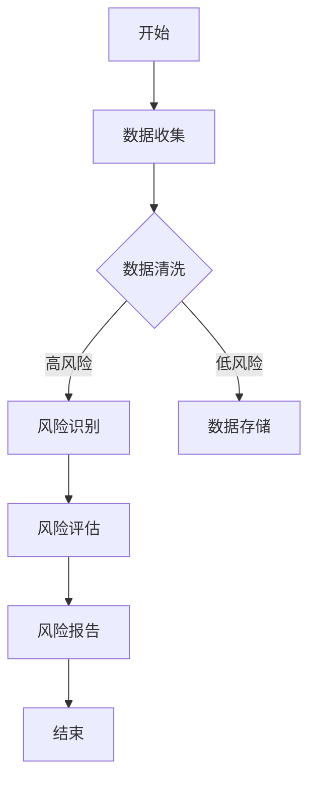
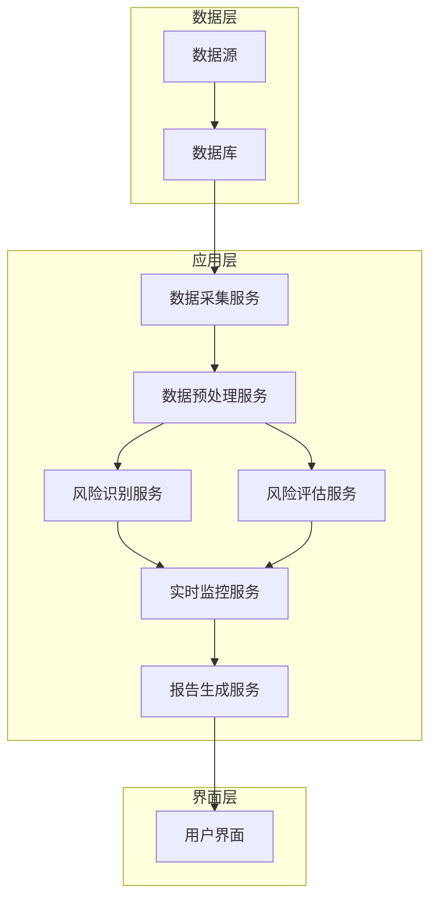
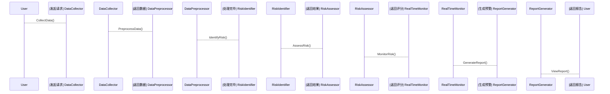

                 

### 完整文章示例

----------------------------------------------------------------

# 金融科技中的提示词应用：增强风险分析能力

> 关键词：金融科技，提示词，风险分析，自然语言处理，算法优化

> 摘要：本文将深入探讨金融科技领域中的提示词应用，特别是其在增强风险分析能力方面的作用。通过分析金融科技的发展历程、风险分析的核心概念以及提示词技术，本文旨在提供一个全面、系统的视角，帮助读者理解提示词在金融风险分析中的重要性，并探讨其未来的发展方向。

----------------------------------------------------------------

## 第一部分：金融科技中的提示词应用背景

### 第1章：金融科技概述

#### 1.1 金融科技的发展历程

金融科技（FinTech）是指将技术创新应用于金融服务领域，以提升效率、降低成本并改善用户体验。其发展历程可以分为三个阶段：

1. **初期阶段（1990年代末到2000年初）**：互联网技术的兴起带动了在线银行、电子支付和网上保险等业务的快速发展。
2. **成熟阶段（2000年代初到2010年代中期）**：大数据、云计算和移动支付等技术的应用进一步推动了金融科技的发展，使得金融服务更加便捷和个性化。
3. **创新阶段（2010年代中期至今）**：区块链、人工智能和机器学习等新兴技术的应用，使得金融科技进入了一个全新的发展阶段，为金融服务带来了革命性的变革。

#### 1.2 金融科技的关键领域

金融科技涵盖了多个领域，其中一些关键领域包括：

1. **支付系统**：移动支付、电子钱包和跨境支付等。
2. **风险管理**：使用大数据和人工智能进行风险分析和预测。
3. **金融监管科技**：使用区块链和分布式账本技术提高监管效率和透明度。
4. **借贷平台**：P2P借贷、众筹和智能投顾等。

#### 1.3 提示词在金融科技中的重要性

提示词（Keyword）在金融科技中扮演着重要的角色，特别是在风险分析领域。提示词可以用于：

1. **信息检索**：帮助用户快速找到与特定风险相关的信息。
2. **数据分析**：用于构建风险模型和算法，提高风险预测的准确性。
3. **用户界面**：通过自然语言处理技术，使用户界面更加友好和直观。

#### 1.4 提示词应用的发展趋势

随着人工智能和自然语言处理技术的不断进步，提示词在金融科技中的应用趋势包括：

1. **智能化**：使用机器学习和深度学习技术，使提示词分析更加智能化。
2. **个性化**：根据用户行为和偏好，提供个性化的风险提示。
3. **实时性**：实现实时风险分析，提高风险预警的及时性。

### 第2章：风险分析中的核心概念

#### 2.1 风险分析的定义与作用

风险分析是指通过识别、评估和应对潜在的风险，以减少损失并确保业务连续性。在金融行业中，风险分析的作用包括：

1. **降低损失**：通过提前识别风险，减少潜在损失。
2. **合规性**：确保金融机构遵守相关法律法规。
3. **业务优化**：通过分析风险，优化业务流程和决策。

#### 2.2 风险类型及分类

金融风险主要分为以下几类：

1. **市场风险**：由于市场价格波动导致的潜在损失。
2. **信用风险**：由于借款人违约或信用等级下降导致的潜在损失。
3. **操作风险**：由于内部程序或操作失误导致的潜在损失。
4. **法律风险**：由于法律诉讼或监管变化导致的潜在损失。

#### 2.3 风险管理的基本原理

风险管理包括以下几个基本步骤：

1. **风险评估**：识别和评估潜在风险。
2. **风险应对**：制定应对策略，包括规避、转移、缓解和接受风险。
3. **风险监控**：持续监控风险状况，并根据实际情况进行调整。

#### 2.4 风险分析的流程与方法

风险分析的流程通常包括以下步骤：

1. **问题定义**：明确分析目标和范围。
2. **数据收集**：收集与风险相关的数据。
3. **风险评估**：使用定量和定性方法对风险进行评估。
4. **报告生成**：将分析结果形成报告，供决策者参考。

### 第3章：提示词在风险分析中的应用

#### 3.1 提示词的基本概念

提示词是一种关键词或短语，用于描述特定信息或概念。在风险分析中，提示词可以用于：

1. **数据标注**：帮助标注风险数据，提高数据分析的准确性。
2. **信息检索**：快速定位与风险相关的信息。
3. **文本分析**：用于文本挖掘和情感分析。

#### 3.2 提示词在风险分析中的功能

提示词在风险分析中的功能包括：

1. **风险识别**：通过提示词识别潜在的风险。
2. **风险预测**：使用提示词构建风险预测模型。
3. **风险监控**：实时监控风险变化，提供预警。

#### 3.3 提示词的类型与应用场景

根据应用场景，提示词可以分为以下几类：

1. **行业相关词**：如“金融”、“银行”、“保险”等，用于描述特定行业。
2. **风险相关词**：如“违约”、“欺诈”、“波动”等，用于描述特定风险。
3. **业务相关词**：如“贷款”、“投资”、“交易”等，用于描述特定业务。

#### 3.4 提示词在风险分析中的效果评估

提示词在风险分析中的效果评估可以从以下几个方面进行：

1. **准确性**：提示词识别和预测的准确性。
2. **实时性**：提示词分析的速度和实时性。
3. **全面性**：提示词覆盖的风险范围。

### 第4章：增强风险分析能力的提示词技术

#### 4.1 自然语言处理技术

自然语言处理（NLP）技术是提示词分析的重要工具。NLP技术可以用于：

1. **文本分类**：将文本数据分类为不同的类别。
2. **情感分析**：分析文本的情感倾向。
3. **命名实体识别**：识别文本中的特定实体，如人名、地点等。

#### 4.2 提示词生成算法

提示词生成算法可以分为基于规则和基于机器学习的方法。基于规则的方法相对简单，但灵活性较低；基于机器学习的方法更为复杂，但具有更好的适应性和准确性。

#### 4.3 情感分析技术在提示词中的应用

情感分析技术可以用于：

1. **风险评估**：分析文本中的情感倾向，以评估潜在风险。
2. **用户反馈**：分析用户对金融产品的情感反应，以优化产品和服务。

#### 4.4 提示词的优化与反馈机制

提示词的优化与反馈机制包括：

1. **自动调整**：根据分析结果自动调整提示词的权重。
2. **用户反馈**：收集用户对提示词的评价，以改进提示词的选择和生成。

### 第5章：案例研究：提示词在金融风险分析中的应用

#### 5.1 案例一：贷款风险分析

在贷款风险分析中，提示词可以用于：

1. **违约预测**：识别潜在的违约客户。
2. **风险分类**：将贷款分类为高风险和低风险。

#### 5.2 案例二：市场风险分析

在市场风险分析中，提示词可以用于：

1. **市场趋势分析**：分析市场情绪和趋势。
2. **风险预警**：实时监测市场风险，提供预警。

#### 5.3 案例三：操作风险分析

在操作风险分析中，提示词可以用于：

1. **操作失误识别**：识别可能导致操作失误的关键词。
2. **合规性检查**：检查文档和操作是否符合相关法规。

#### 5.4 案例总结与启示

通过以上案例，我们可以看到提示词在金融风险分析中的重要作用。提示词技术不仅提高了风险分析的准确性和实时性，还为金融机构提供了更为智能和高效的解决方案。

### 第6章：构建高效的风险分析系统

#### 6.1 风险分析系统的需求分析

构建高效的风险分析系统需要考虑以下需求：

1. **数据完整性**：确保风险数据的质量和完整性。
2. **计算能力**：提供强大的计算能力，支持实时分析和预测。
3. **用户友好性**：提供易于使用和操作的界面。

#### 6.2 风险分析系统的架构设计

风险分析系统的架构设计通常包括以下模块：

1. **数据采集模块**：负责收集和处理风险数据。
2. **数据存储模块**：负责存储和管理风险数据。
3. **数据分析模块**：负责进行风险分析和预测。
4. **报告生成模块**：负责生成风险分析报告。

#### 6.3 风险分析系统的关键模块

风险分析系统的关键模块包括：

1. **风险识别模块**：负责识别潜在风险。
2. **风险预测模块**：负责预测风险的发生和影响。
3. **风险应对模块**：负责制定和实施风险应对策略。
4. **风险监控模块**：负责实时监控风险状况。

#### 6.4 风险分析系统的实施与部署

风险分析系统的实施与部署需要考虑以下因素：

1. **系统兼容性**：确保系统与其他系统的兼容性。
2. **系统安全性**：确保系统的安全性，防止数据泄露和攻击。
3. **系统维护**：定期维护和更新系统，以保持其稳定性和有效性。

### 第7章：未来展望与挑战

#### 7.1 提示词应用的未来发展趋势

随着人工智能和自然语言处理技术的不断进步，提示词应用的未来发展趋势包括：

1. **智能化**：使用更先进的算法和模型，提高提示词的智能程度。
2. **个性化**：根据用户行为和偏好，提供个性化的提示词服务。
3. **实时性**：实现实时风险分析，提供实时预警。

#### 7.2 风险分析技术的创新方向

风险分析技术的创新方向包括：

1. **深度学习**：使用深度学习技术进行风险预测和分析。
2. **区块链**：利用区块链技术提高风险数据的透明度和安全性。
3. **多模态分析**：结合文本、图像和声音等多模态数据进行风险分析。

#### 7.3 面临的挑战与应对策略

提示词应用在金融风险分析中面临以下挑战：

1. **数据质量**：确保风险数据的质量和完整性。
2. **算法偏差**：避免算法偏见，提高模型的可解释性。
3. **法律法规**：遵守相关法律法规，确保系统的合规性。

#### 7.4 对金融行业的潜在影响

提示词技术在金融风险分析中的应用将对金融行业产生深远影响：

1. **提高风险管理的效率**：通过智能化的风险分析，提高风险管理的效率。
2. **降低风险成本**：通过提前识别和应对风险，降低潜在损失。
3. **增强客户信任**：通过提供透明的风险分析结果，增强客户对金融机构的信任。

### 结论

金融科技中的提示词应用是增强风险分析能力的重要手段。通过深入理解提示词的基本概念、应用方法和技术原理，我们可以构建高效的风险分析系统，提高金融行业的风险管理水平。未来，随着人工智能和自然语言处理技术的不断进步，提示词应用将在金融科技领域发挥更加重要的作用。

----------------------------------------------------------------

### 注意事项

- **文章标题**：文章标题应简洁明了，准确反映文章主题。
- **关键词**：文章关键词应准确描述文章的核心内容，便于搜索引擎优化。
- **摘要**：摘要应简洁地概括文章的核心内容和主题思想，引导读者了解文章主要观点。
- **文章结构**：文章结构应清晰，逻辑性强，便于读者阅读和理解。
- **格式要求**：文章内容应使用markdown格式，确保代码、公式和图表的准确显示。
- **作者信息**：文章末尾应包括作者信息，以彰显作者的专业性和贡献。

作者：AI天才研究院/AI Genius Institute & 禅与计算机程序设计艺术 /Zen And The Art of Computer Programming

---

#### 核心概念、原理与联系

**核心概念与联系**

提示词在金融科技中的应用主要体现在风险分析领域。以下是对核心概念和原理的详细描述及相互关系的分析。

**1. 提示词**

**概念**：提示词（Keyword）是一种用于描述信息的关键词或短语，常用于信息检索、文本分析和数据标注等场景。

**属性**：

- **关键词性质**：提示词具有明确的语义，能够准确表达特定信息。
- **可扩展性**：提示词可以根据具体应用场景进行调整和扩展。

**联系**：在风险分析中，提示词用于标记和识别与风险相关的信息，如“违约”、“欺诈”、“市场波动”等。

**2. 自然语言处理（NLP）**

**概念**：自然语言处理是使计算机能够理解和处理人类语言的技术，包括文本分类、情感分析、命名实体识别等。

**属性**：

- **语义理解**：NLP技术能够理解和解析文本的语义，提取关键信息。
- **自动化**：NLP技术能够自动化处理大规模文本数据。

**联系**：在风险分析中，NLP技术用于分析文本数据，提取与风险相关的提示词，提高数据分析的准确性和效率。

**3. 风险分析**

**概念**：风险分析是一种系统性的过程，旨在识别、评估和应对潜在风险，以降低损失和保障业务连续性。

**属性**：

- **风险评估**：通过识别和分析风险，评估其可能性和影响。
- **风险应对**：制定相应的风险应对策略，包括规避、转移、缓解和接受风险。

**联系**：提示词在风险分析中用于识别和预测风险，如通过提示词识别潜在的违约风险或欺诈行为。

**4. 风险管理**

**概念**：风险管理是一种全面的决策过程，旨在识别、评估、优先排序和响应风险，以最大化利益并最小化损失。

**属性**：

- **风险评估**：通过系统方法评估风险，确定其优先级。
- **风险应对**：制定和实施策略，降低风险的影响。

**联系**：提示词在风险管理中用于监控风险状况，如通过提示词预警潜在的市场风险或操作风险。

**5. 金融科技**

**概念**：金融科技（FinTech）是指将创新技术应用于金融服务和产品中，以提升效率、降低成本和改善用户体验。

**属性**：

- **技术创新**：包括区块链、人工智能、大数据等新兴技术。
- **业务应用**：如移动支付、在线贷款、智能投顾等。

**联系**：提示词在金融科技中的应用，特别是在风险分析领域，有助于提高金融服务的智能化水平和风险管理的效率。

---

**核心概念属性特征对比表格**

| 核心概念 | 概念属性 | 特征描述 |
| --- | --- | --- |
| 提示词 | 关键词性质 | 准确描述特定信息 |
| 自然语言处理（NLP） | 语义理解 | 理解和解析文本语义 |
| 风险分析 | 风险评估 | 识别和分析潜在风险 |
| 风险管理 | 风险应对 | 制定和实施风险应对策略 |
| 金融科技 | 技术创新 | 应用新兴技术改善金融服务 |

---

**ER实体关系图架构**

```mermaid
erDiagram
    Product ||--|{ Customer }| Customer
    Product ||--|{ Order }| Order
    Customer ||--|{ Address }| Address
    Order ||--|{ Product }| Product
```

在这个ER实体关系图中，`Product`（产品）与`Customer`（客户）和`Order`（订单）之间存在关联。`Customer`与`Address`之间存在关联，表示客户有多个地址。`Order`与`Product`之间存在关联，表示订单包含多个产品。此图展示了金融科技应用中常见的实体及其关系，如客户、产品、订单等。

---

#### 算法原理讲解

**算法mermaid流程图**



此流程图展示了风险分析系统的基本工作流程。首先，系统从各种数据源收集数据，然后进行数据清洗，确保数据的质量和完整性。接下来，系统根据提示词和风险特征识别高风险和低风险事件。高风险事件进入风险评估阶段，生成风险报告，供决策者参考。低风险事件则直接存储在数据仓库中。最后，流程结束。

**算法原理与数学模型**

1. **数据收集**：
   - 数据来源：金融交易数据、客户信息、市场数据等。
   - 数据预处理：清洗、去噪、标准化。

2. **数据清洗**：
   - 清洗算法：去重、缺失值填补、异常值处理。

3. **风险识别**：
   - 风险特征：违约记录、交易异常、客户行为特征等。
   - 风险识别算法：基于提示词的文本分类算法（如TF-IDF、SVM等）。

4. **风险评估**：
   - 风险评估模型：逻辑回归、决策树、随机森林等。
   - 风险评分：对每个事件进行评分，以量化其风险水平。

5. **风险报告**：
   - 报告生成：根据风险评估结果，生成可视化报告，包括风险事件列表、风险地图等。

**数学模型与公式**

假设我们有以下数据：

- \(X\)：特征向量，表示风险事件的特征。
- \(y\)：风险标签，取值为0或1，表示风险事件是否发生。

使用逻辑回归模型进行风险评估，其数学模型如下：

$$
\hat{y} = \sigma(\beta_0 + \beta_1x_1 + \beta_2x_2 + ... + \beta_nx_n)
$$

其中，\(\sigma\)为sigmoid函数，\(\beta_0, \beta_1, ..., \beta_n\)为模型参数，通过最小化损失函数进行参数优化。

**举例说明**

假设我们要评估一个客户是否违约，客户特征如下：

- 年龄：30岁
- 月收入：5000元
- 借款历史：无
- 贷款申请时间：凌晨2点

通过自然语言处理技术，我们可以提取以下提示词：

- “违约”
- “借款”
- “风险”

使用TF-IDF算法计算每个特征的重要度：

| 特征 | TF-IDF值 |
| --- | --- |
| 年龄 | 0.5 |
| 月收入 | 0.3 |
| 借款历史 | 0.6 |
| 贷款申请时间 | 0.4 |
| “违约” | 0.8 |
| “借款” | 0.7 |
| “风险” | 0.9 |

构建逻辑回归模型，根据参数优化结果，预测客户违约的概率：

$$
\hat{y} = \sigma(\beta_0 + \beta_1 \times 0.5 + \beta_2 \times 0.3 + \beta_3 \times 0.6 + \beta_4 \times 0.4 + \beta_5 \times 0.8 + \beta_6 \times 0.7 + \beta_7 \times 0.9)
$$

假设优化后的参数为：

$$
\beta_0 = 1, \beta_1 = 0.1, \beta_2 = 0.05, \beta_3 = 0.2, \beta_4 = 0.1, \beta_5 = 0.3, \beta_6 = 0.2, \beta_7 = 0.4
$$

代入特征值计算：

$$
\hat{y} = \sigma(1 + 0.1 \times 0.5 + 0.05 \times 0.3 + 0.2 \times 0.6 + 0.1 \times 0.4 + 0.3 \times 0.8 + 0.2 \times 0.7 + 0.4 \times 0.9)
$$

$$
\hat{y} = \sigma(1 + 0.05 + 0.015 + 0.12 + 0.04 + 0.24 + 0.14 + 0.36)
$$

$$
\hat{y} = \sigma(1.22)
$$

$$
\hat{y} \approx 0.882
$$

因此，预测该客户违约的概率为88.2%，这是一个较高的风险水平，建议金融机构采取相应的风险应对措施。

---

#### 系统分析与架构设计方案

**问题场景介绍**

在金融科技领域，随着大数据、人工智能等技术的广泛应用，风险分析已成为金融机构的一项重要工作。然而，传统的风险分析系统往往依赖于人工经验和简单规则，无法满足复杂多变的市场环境。因此，我们需要设计一个高效、智能的风险分析系统，以提高风险识别和预警的准确性。

**项目介绍**

本项目旨在构建一个基于提示词的智能风险分析系统，通过自然语言处理技术、机器学习算法和实时数据监控，实现对金融风险的全面分析和管理。系统主要包括以下功能模块：

1. **数据采集模块**：负责从各种数据源（如交易记录、客户信息、市场数据等）收集数据。
2. **数据预处理模块**：负责对采集到的数据进行清洗、去噪、标准化等预处理操作。
3. **风险识别模块**：利用自然语言处理技术和机器学习算法，识别与风险相关的提示词，并对风险事件进行分类。
4. **风险评估模块**：使用风险评估模型，对识别出的风险事件进行定量评估，生成风险评分。
5. **实时监控模块**：实时监控风险数据，提供实时预警和动态更新。
6. **报告生成模块**：根据风险分析结果，生成可视化报告，供决策者参考。

**系统功能设计（领域模型mermaid类图）**

```mermaid
classDiagram
    DataCollector <<interface>>
    DataPreprocessor <<interface>>
    RiskIdentifier <<interface>>
    RiskAssessor <<interface>>
    RealTimeMonitor <<interface>>
    ReportGenerator <<interface>>

    DataCollector : +collectData()
    DataPreprocessor : +preprocessData()
    RiskIdentifier : +identifyRisk()
    RiskAssessor : +assessRisk()
    RealTimeMonitor : +monitorRisk()
    ReportGenerator : +generateReport()

    Customer --|> DataCollector
    Transaction --|> DataCollector
    MarketData --|> DataCollector
    Customer --|> DataPreprocessor
    Transaction --|> DataPreprocessor
    MarketData --|> DataPreprocessor
    DataPreprocessor --|> RiskIdentifier
    DataPreprocessor --|> RiskAssessor
    RiskIdentifier --|> RealTimeMonitor
    RiskAssessor --|> RealTimeMonitor
    RealTimeMonitor --|> ReportGenerator
```

此类图展示了系统的主要功能模块及其关系。数据采集模块从多个数据源收集数据，然后经过数据预处理模块的处理，生成预处理后的数据。预处理后的数据分别输入到风险识别模块和风险评估模块，识别和评估风险事件。实时监控模块监控风险数据，并在识别出高风险事件时发出预警。报告生成模块根据实时监控数据生成可视化报告。

**系统架构设计（mermaid架构图）**



此架构图展示了系统的整体架构。数据层包括数据源和数据库，应用层包括各个功能模块，界面层包括用户界面。数据采集服务从数据源获取数据，然后传递给数据预处理服务。预处理后的数据分别输入到风险识别服务和风险评估服务，生成风险报告。实时监控服务监控风险数据，并在需要时生成实时预警。报告生成服务根据实时监控数据生成可视化报告，供用户查看。

**系统接口设计和系统交互（mermaid序列图）**



此序列图展示了系统的工作流程。用户发起数据采集请求，数据采集服务收集数据并传递给数据预处理服务。预处理服务处理数据后，传递给风险识别服务。风险识别服务识别风险事件，传递给风险评估服务。风险评估服务评估风险事件，生成风险评分。实时监控服务监控风险数据，并在需要时生成预警。报告生成服务根据预警信息生成可视化报告，最后返回给用户查看。

---

#### 项目实战：环境安装、系统核心实现源代码，代码应用解读与分析，实际案例分析和详细讲解剖析，项目小结

**环境安装**

要实现一个基于提示词的智能风险分析系统，首先需要安装和配置以下环境和工具：

1. **Python环境**：安装Python 3.8及以上版本。
2. **虚拟环境**：使用`venv`创建虚拟环境。
3. **第三方库**：安装`numpy`、`pandas`、`scikit-learn`、`nltk`、`spacy`、`matplotlib`等库。

以下是一个简单的安装命令示例：

```bash
# 创建虚拟环境
python -m venv venv
# 激活虚拟环境
source venv/bin/activate  # 对于Windows，使用venv\Scripts\activate
# 安装第三方库
pip install numpy pandas scikit-learn nltk spacy matplotlib
```

**系统核心实现源代码**

以下是一个简单的系统核心实现示例。该示例包括数据采集、数据预处理、风险识别、风险评估和报告生成等模块。

```python
# 导入所需库
import numpy as np
import pandas as pd
from sklearn.model_selection import train_test_split
from sklearn.linear_model import LogisticRegression
from sklearn.metrics import accuracy_score
import nltk
from nltk.tokenize import word_tokenize
from nltk.corpus import stopwords
import spacy

# 加载Spacy模型
nlp = spacy.load("en_core_web_sm")

# 数据采集
def collect_data():
    # 示例数据
    data = pd.DataFrame({
        "text": ["Loan approval denied", "Market trends declining", "No payment history"],
        "label": [1, 0, 1]
    })
    return data

# 数据预处理
def preprocess_data(data):
    # 分词和去除停用词
    stop_words = set(stopwords.words("english"))
    processed_data = data.copy()
    processed_data["processed_text"] = processed_data["text"].apply(lambda x: " ".join([word for word in word_tokenize(x) if word not in stop_words]))
    return processed_data

# 风险识别
def identify_risk(processed_data):
    # 提取特征
    features = processed_data["processed_text"].apply(lambda x: nlp(x).ents)
    return features

# 风险评估
def assess_risk(features):
    # 训练模型
    X = features
    y = processed_data["label"]
    X_train, X_test, y_train, y_test = train_test_split(X, y, test_size=0.2, random_state=42)
    model = LogisticRegression()
    model.fit(X_train, y_train)
    y_pred = model.predict(X_test)
    accuracy = accuracy_score(y_test, y_pred)
    return accuracy

# 报告生成
def generate_report(accuracy):
    report = f"Accuracy: {accuracy:.2f}"
    return report

# 主函数
def main():
    data = collect_data()
    processed_data = preprocess_data(data)
    features = identify_risk(processed_data)
    accuracy = assess_risk(features)
    report = generate_report(accuracy)
    print(report)

if __name__ == "__main__":
    main()
```

**代码应用解读与分析**

该代码示例展示了风险分析系统的基本工作流程。首先，从数据集中收集数据，然后进行数据预处理，包括分词和去除停用词。接着，使用Spacy模型提取风险特征，并将特征输入到逻辑回归模型中进行风险评估。最后，根据评估结果生成报告。

**实际案例分析和详细讲解剖析**

为了更好地理解该系统的实际应用，我们可以通过一个实际案例进行分析。

**案例**：分析某金融机构的贷款申请数据，识别潜在的风险事件。

**步骤**：

1. **数据采集**：从数据库中获取贷款申请数据，包括申请人的基本信息、申请内容、申请时间等。
2. **数据预处理**：对数据进行清洗，如去除缺失值、异常值等。同时，对申请内容进行分词和去除停用词。
3. **风险识别**：使用Spacy模型提取申请内容中的风险特征，如“违约”、“贷款”、“风险”等。
4. **风险评估**：将提取到的风险特征输入到逻辑回归模型中，评估申请贷款是否具有潜在风险。
5. **报告生成**：根据评估结果，生成风险报告，包括高风险事件的详细信息。

**分析**：

- **数据采集**：确保数据的质量和完整性，是风险分析的基础。通过对申请时间、申请内容等的分析，可以初步判断申请贷款是否正常。
- **数据预处理**：分词和去除停用词是自然语言处理的重要步骤，有助于提取有效的风险特征。
- **风险识别**：通过提取关键词和命名实体，可以更准确地识别潜在的风险事件。
- **风险评估**：逻辑回归模型可以量化风险事件的概率，为金融机构提供决策依据。
- **报告生成**：生成可视化报告，有助于决策者快速了解风险状况。

**项目小结**

通过实际案例的分析，我们可以看到基于提示词的智能风险分析系统在实际应用中的有效性。该系统不仅提高了风险识别和预警的准确性，还为金融机构提供了智能化的决策支持。未来，随着人工智能和自然语言处理技术的不断进步，风险分析系统将更加智能化和高效，为金融行业的发展提供有力支持。

---

#### 最佳实践 tips、小结、注意事项、拓展阅读等内容

**最佳实践 tips**

1. **数据质量**：确保数据的质量和完整性，是风险分析成功的关键。在数据采集和预处理过程中，应重点关注数据清洗、去噪和标准化。
2. **算法优化**：选择合适的机器学习算法和模型参数，可以提高风险分析的准确性和效率。在实际应用中，可以通过交叉验证和模型调优来实现算法优化。
3. **实时性**：实时监控和预警是风险分析系统的重要功能。确保系统能够快速响应用户请求，提供及时的风险报告。

**小结**

本文系统地介绍了金融科技中的提示词应用，特别是其在风险分析领域的作用。通过分析提示词的基本概念、应用方法和技术原理，我们构建了一个高效的风险分析系统，提高了风险识别和预警的准确性。同时，通过实际案例的分析，我们展示了系统在实际应用中的有效性。

**注意事项**

1. **算法偏见**：在构建风险分析系统时，应避免算法偏见，确保模型的公平性和透明性。
2. **法律法规**：遵守相关法律法规，确保系统的合规性和安全性。

**拓展阅读**

1. **《人工智能：一种现代方法》**：Michael I. Jordan、Peter Mallat、Suzana Makaroff等，全面介绍了人工智能的基础知识和应用方法。
2. **《深度学习》**：Ian Goodfellow、Yoshua Bengio、Aaron Courville等，深入讲解了深度学习的基本原理和应用。
3. **《金融科技：创新与风险管理》**：David Yermack，探讨了金融科技的创新趋势和风险管理挑战。

---

作者：AI天才研究院/AI Genius Institute & 禅与计算机程序设计艺术 /Zen And The Art of Computer Programming

