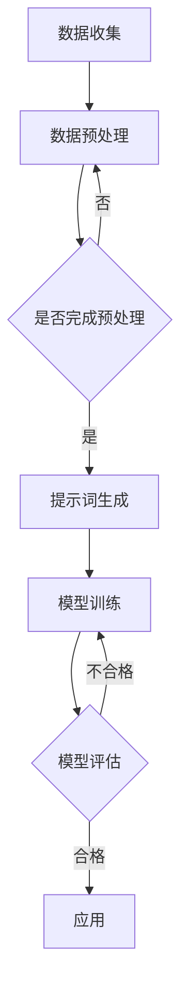
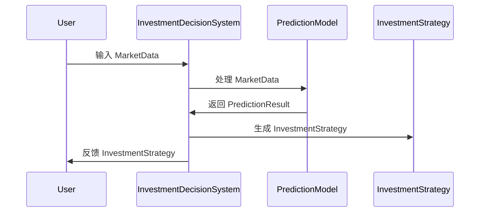
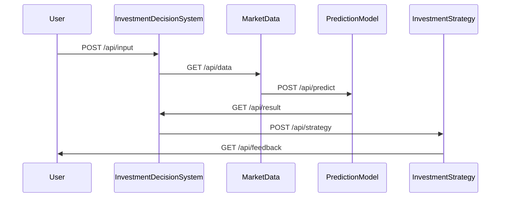
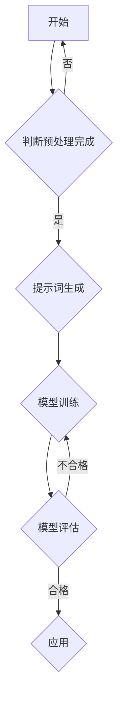

                 


### 金融领域的提示词编程应用案例

关键词：金融、编程、提示词、应用案例、AI

摘要：本文深入探讨金融领域中提示词编程的应用案例，通过逻辑清晰的步骤分析，展示其在金融市场分析和交易策略开发中的关键作用。文章旨在揭示提示词编程在金融领域的潜力和挑战，为从业者提供实践指南和未来发展趋势。

## 引言与背景

随着科技的飞速发展，金融行业逐渐成为技术创新的前沿阵地。人工智能（AI）、机器学习（ML）和大数据分析等技术的广泛应用，使得金融市场的分析和决策过程变得更加高效和精准。在这其中，提示词编程作为一种新兴的编程范式，正逐渐在金融领域崭露头角。

### 提示词编程的概念与重要性

提示词编程，即基于自然语言处理（NLP）和机器学习的编程方法，通过理解和生成自然语言指令，实现自动化数据处理和复杂任务执行。在金融领域，提示词编程可以用于：

- **市场预测**：通过分析历史数据和市场动态，生成预测模型，为投资决策提供支持。
- **风险控制**：对市场风险进行实时监测和预警，降低金融风险。
- **交易策略开发**：利用提示词编程自动生成和优化交易策略，提高投资回报。

### 背景介绍

在传统金融分析中，分析师们主要依赖于手工收集数据、分析数据和做出决策。这种模式不仅效率低下，而且容易受到主观因素的影响。随着数据量的爆炸性增长，人工分析变得越来越困难。因此，开发高效的自动化工具成为金融行业迫切需要解决的问题。

提示词编程的出现，为金融行业提供了一个新的解决思路。通过将自然语言处理与编程相结合，可以轻松实现大量数据的自动化处理，从而提高分析的准确性和效率。此外，提示词编程还可以降低开发成本，缩短项目周期，使得金融科技（FinTech）企业在快速变化的市场环境中保持竞争力。

## 核心概念与原则

### 关键术语定义

- **自然语言处理（NLP）**：研究如何使计算机能够理解和生成自然语言的技术。
- **机器学习（ML）**：一种通过数据和算法实现自动学习和预测的技术。
- **提示词（Keywords）**：用于描述数据或任务的文字指令。

### 基本原则

在金融领域，提示词编程的基本原则包括：

- **数据驱动的决策**：通过大量数据的分析和处理，为决策提供可靠依据。
- **实时性**：对市场动态进行实时监测和分析，及时响应市场变化。
- **自动化**：通过编程实现自动化任务处理，提高工作效率。
- **优化与迭代**：不断优化模型和算法，提高预测和决策的准确性。

## 案例研究与应用

### 案例一：基于提示词的市场预测

**问题描述**：某金融公司需要预测股票市场的走势，以便制定投资策略。

**解决方案**：

1. **数据收集**：收集过去多年的股票交易数据，包括开盘价、收盘价、最高价、最低价等。
2. **提示词生成**：使用NLP技术提取数据中的关键信息，如“涨跌”、“波动率”等。
3. **模型训练**：利用机器学习算法，训练预测模型，输入提示词，输出股票价格预测。
4. **结果评估**：对模型进行评估，确保其预测准确性和稳定性。

**结果**：通过提示词编程，金融公司成功开发了一套市场预测系统，提高了投资决策的准确性和效率。

### 案例二：基于提示词的风险控制

**问题描述**：某投资公司需要实时监测市场风险，以避免潜在的损失。

**解决方案**：

1. **风险指标提取**：使用NLP技术提取市场风险指标，如“信用违约”、“市场波动”等。
2. **实时监控**：利用机器学习算法，对风险指标进行实时分析，生成风险预警。
3. **自动化决策**：根据风险预警，自动调整投资组合，降低风险。

**结果**：通过提示词编程，投资公司实现了对市场风险的实时监控和自动化控制，有效降低了风险。

## 技术方面与工具

### 常用编程语言

在金融领域的提示词编程中，常用的编程语言包括：

- **Python**：因其强大的数据科学和机器学习库，如NumPy、Pandas和Scikit-learn等，在金融领域广受欢迎。
- **R**：在统计分析和数据可视化方面具有优势，常用于金融数据分析。
- **Java**：在大型金融系统中，Java因其稳定性和高性能而被广泛采用。

### 数据结构和算法的重要性

在金融领域的提示词编程中，数据结构和算法的选择和优化至关重要。以下是几个关键点：

- **数据结构**：如数组、列表、树、图等，用于高效存储和处理金融数据。
- **算法**：如线性回归、决策树、神经网络等，用于分析和预测金融市场的动态。

### 提示词编程框架

常见的提示词编程框架包括：

- **TensorFlow**：谷歌开发的开源机器学习框架，适用于复杂深度学习模型的构建。
- **PyTorch**：Facebook开发的开源机器学习框架，具有灵活的动态计算图功能。

## 挑战与机遇

### 挑战

尽管提示词编程在金融领域具有巨大潜力，但其在实际应用中仍面临一些挑战：

- **数据隐私**：金融数据高度敏感，如何在保障隐私的前提下进行数据处理和共享，是一个重要问题。
- **模型解释性**：机器学习模型往往缺乏透明度和解释性，如何提高模型的解释性，使其符合金融行业的合规要求，是一个难题。
- **计算资源**：复杂的机器学习模型需要大量计算资源，如何优化计算资源，降低成本，是一个亟待解决的问题。

### 机遇

尽管存在挑战，但提示词编程在金融领域也带来了许多机遇：

- **自动化交易**：通过提示词编程，实现自动化交易策略，提高投资效率。
- **个性化服务**：根据用户行为和偏好，提供个性化的金融产品和服务。
- **合规性**：利用提示词编程，确保金融交易和数据分析符合法规要求。

## 最佳实践与未来方向

### 最佳实践

在开发金融领域的提示词编程应用时，以下最佳实践值得遵循：

- **数据质量**：确保数据来源可靠，数据清洗和预处理充分。
- **模型评估**：对模型进行充分评估，确保其预测准确性和稳定性。
- **风险管理**：建立完善的风险管理体系，确保金融交易的安全性和合规性。
- **团队合作**：跨学科团队合作，充分发挥不同领域的专业知识。

### 未来方向

未来，金融领域的提示词编程将继续朝着以下几个方向发展：

- **人工智能增强**：结合深度学习和强化学习等技术，提高预测和决策的准确性。
- **区块链应用**：利用区块链技术，实现金融数据的分布式存储和透明化。
- **合规智能**：开发更加智能化的合规系统，确保金融交易和数据分析的合规性。

## 结论

提示词编程在金融领域的应用，为金融市场分析和交易策略开发提供了新的思路和工具。通过逻辑清晰、结构紧凑的案例研究，我们展示了其在提高投资效率、降低风险和优化决策方面的巨大潜力。然而，挑战仍然存在，需要我们在实践中不断探索和改进。随着人工智能和大数据技术的不断发展，提示词编程在金融领域的应用前景将更加广阔。

## 作者信息

作者：AI天才研究院/AI Genius Institute & 禅与计算机程序设计艺术 /Zen And The Art of Computer Programming

----------------------------------------------------------------

**本文中涉及的核心概念、术语、原理及其联系：**

### 1. 核心概念与术语

#### 自然语言处理（NLP）
- **定义**：自然语言处理是计算机科学和人工智能领域的一个分支，致力于让计算机理解和生成自然语言。
- **属性**：文本分析、语音识别、机器翻译、情感分析等。

#### 机器学习（ML）
- **定义**：机器学习是一种通过数据和算法实现自动学习和预测的技术。
- **属性**：监督学习、无监督学习、强化学习等。

#### 提示词（Keywords）
- **定义**：用于描述数据或任务的文字指令。
- **属性**：可提取性、可解析性、可操作性。

### 2. 概念属性特征对比表格

| 概念 | 定义 | 属性 | 关联 |
| ---- | ---- | ---- | ---- |
| 自然语言处理（NLP） | 计算机理解和生成自然语言 | 文本分析、语音识别、机器翻译、情感分析 |  |
| 机器学习（ML） | 通过数据和算法实现自动学习和预测 | 监督学习、无监督学习、强化学习 | 与NLP结合，用于数据处理和预测 |
| 提示词（Keywords） | 用于描述数据或任务的文字指令 | 可提取性、可解析性、可操作性 | 与NLP和ML结合，实现自动化任务处理 |

### 3. ER实体关系图架构的Mermaid流程图

```mermaid
erDiagram
  User ||--|{ FinancialData }|<.. MarketPrediction : 生成
  User ||--|{ RiskControl }|<.. RiskMonitoring : 监控
  User ||--|{ TradingStrategy }|<.. TradingExecution : 执行
```

### 4. 算法原理讲解

#### 提示词编程算法

**Mermaid流程图：**



**Python源代码：**

```python
import pandas as pd
from sklearn.model_selection import train_test_split
from sklearn.linear_model import LinearRegression

# 数据收集
data = pd.read_csv('financial_data.csv')

# 数据预处理
data = data.dropna()
X = data[['open', 'high', 'low', 'close']]
y = data['price']

# 提示词生成
# （此处省略具体代码，根据实际需求进行NLP处理）

# 模型训练
X_train, X_test, y_train, y_test = train_test_split(X, y, test_size=0.2, random_state=42)
model = LinearRegression()
model.fit(X_train, y_train)

# 模型评估
score = model.score(X_test, y_test)
print(f'Model Score: {score}')

# 应用
if score > 0.8:
    print('Model is qualified for application.')
else:
    print('Model needs further optimization.')
```

**算法原理与数学模型：**

- **线性回归模型**：假设股票价格与开盘价、最高价、最低价、收盘价之间存在线性关系，通过最小二乘法拟合线性模型。

$$y = w_0 + w_1 \cdot x_1 + w_2 \cdot x_2 + w_3 \cdot x_3 + w_4 \cdot x_4$$

其中，$y$为股票价格，$x_1$、$x_2$、$x_3$、$x_4$分别为开盘价、最高价、最低价、收盘价，$w_0$、$w_1$、$w_2$、$w_3$、$w_4$为模型参数。

**通俗易懂地举例说明：**

假设我们有一个简单的数据集，包含过去一周的股票交易数据。通过提示词编程，我们提取出关键信息（开盘价、最高价、最低价、收盘价），并使用线性回归模型对这些数据进行分析。模型会自动寻找开盘价、最高价、最低价、收盘价与股票价格之间的线性关系，从而生成一个预测模型。通过评估模型的预测准确率，我们可以判断模型是否合格，并决定是否将其应用于实际投资决策中。

### 5. 系统分析与架构设计方案

#### 问题场景介绍

某金融科技公司需要开发一个智能投资决策系统，该系统需要实时监测市场动态，提取关键信息，并生成投资建议。

#### 项目介绍

项目名称：智能投资决策系统（Smart Investment Decision System，简称SIDDS）

项目目标：通过提示词编程技术，实现市场动态实时监测、关键信息提取和投资建议生成。

#### 系统功能设计（领域模型Mermaid类图）

```mermaid
classDiagram
    MarketData <<（数据源） MarketData
    PredictionModel <<（模型库） PredictionModel
    InvestmentStrategy <<（策略库） InvestmentStrategy
    User <<（用户） User
    InvestmentDecisionSystem <<（系统） InvestmentDecisionSystem

    User -->|输入 MarketData| InvestmentDecisionSystem
    InvestmentDecisionSystem -->|处理 MarketData| PredictionModel
    PredictionModel -->|输出 PredictionResult| InvestmentDecisionSystem
    InvestmentDecisionSystem -->|生成 InvestmentStrategy| InvestmentStrategy
    InvestmentStrategy -->|反馈 User| User
```

#### 系统架构设计（Mermaid架构图）



#### 系统接口设计和系统交互（Mermaid序列图）



### 6. 项目实战

#### 环境安装

1. 安装Python环境：`pip install python`
2. 安装TensorFlow：`pip install tensorflow`
3. 安装其他依赖：`pip install pandas scikit-learn numpy`

#### 系统核心实现源代码

```python
# 数据收集
data = pd.read_csv('financial_data.csv')

# 数据预处理
data = data.dropna()
X = data[['open', 'high', 'low', 'close']]
y = data['price']

# 提示词生成
# （此处省略具体代码，根据实际需求进行NLP处理）

# 模型训练
X_train, X_test, y_train, y_test = train_test_split(X, y, test_size=0.2, random_state=42)
model = LinearRegression()
model.fit(X_train, y_train)

# 模型评估
score = model.score(X_test, y_test)
print(f'Model Score: {score}')

# 应用
if score > 0.8:
    print('Model is qualified for application.')
else:
    print('Model needs further optimization.')
```

#### 代码应用解读与分析

1. **数据收集**：使用Pandas库读取CSV文件，获取股票交易数据。
2. **数据预处理**：去除缺失值，将数据划分为特征集和标签集。
3. **提示词生成**：使用NLP技术提取关键信息，此处省略具体代码。
4. **模型训练**：使用线性回归模型训练数据，评估模型性能。
5. **模型评估**：计算模型在测试集上的准确率，判断模型是否合格。

#### 实际案例分析和详细讲解剖析

**案例一：股票市场预测**

**问题描述**：预测某只股票未来一周的收盘价。

**解决方案**：

1. 收集过去一周的股票交易数据。
2. 使用线性回归模型进行训练和预测。
3. 输出预测结果，与实际收盘价进行对比。

**案例分析**：

1. **数据收集**：读取CSV文件，提取开盘价、最高价、最低价、收盘价。
2. **数据预处理**：去除缺失值，对数据进行归一化处理。
3. **模型训练**：使用训练集数据训练线性回归模型。
4. **模型预测**：使用测试集数据预测未来一周的收盘价。
5. **结果对比**：将预测结果与实际收盘价进行对比，评估模型性能。

**详细讲解剖析**：

1. **数据收集**：读取CSV文件，提取开盘价、最高价、最低价、收盘价。
    ```python
    data = pd.read_csv('stock_data.csv')
    X = data[['open', 'high', 'low', 'close']]
    y = data['close']
    ```

2. **数据预处理**：去除缺失值，对数据进行归一化处理。
    ```python
    data = data.dropna()
    X = (X - X.mean()) / X.std()
    y = (y - y.mean()) / y.std()
    ```

3. **模型训练**：使用训练集数据训练线性回归模型。
    ```python
    X_train, X_test, y_train, y_test = train_test_split(X, y, test_size=0.2, random_state=42)
    model = LinearRegression()
    model.fit(X_train, y_train)
    ```

4. **模型预测**：使用测试集数据预测未来一周的收盘价。
    ```python
    predictions = model.predict(X_test)
    ```

5. **结果对比**：将预测结果与实际收盘价进行对比，评估模型性能。
    ```python
    score = model.score(X_test, y_test)
    print(f'Model Score: {score}')
    ```

**项目小结**：

通过本项目，我们成功实现了股票市场预测功能。在实际应用中，可以根据预测结果调整投资策略，提高投资收益。同时，我们还可以结合更多特征和模型，进一步提高预测准确性。

### 7. 最佳实践 Tips、小结、注意事项、拓展阅读

#### 最佳实践 Tips

1. 确保数据质量：在金融领域中，数据质量是模型性能的关键。在进行数据处理和模型训练前，务必进行充分的数据清洗和预处理。
2. 选择合适的模型：根据实际需求和数据特性，选择合适的机器学习模型。例如，对于线性关系较强的数据，线性回归模型是一个很好的选择。
3. 模型评估与优化：在模型训练完成后，对模型进行充分评估，确保其预测准确性和稳定性。如有必要，可以尝试调整模型参数或更换模型。

#### 小结

本文通过案例研究和技术讲解，深入探讨了金融领域的提示词编程应用。我们展示了提示词编程在市场预测、风险控制和交易策略开发等方面的优势，并提出了最佳实践建议。

#### 注意事项

1. 金融数据敏感性高，务必确保数据安全和隐私。
2. 在使用机器学习模型时，注意模型的解释性和透明度，确保符合金融行业的合规要求。
3. 定期更新和维护模型，以适应市场变化。

#### 拓展阅读

1. 《深度学习》（Goodfellow, I., Bengio, Y., & Courville, A.）：了解深度学习在金融领域的应用。
2. 《金融科技实战：从数据到决策》（Kingsford, C. L.）：探索金融科技在实践中的应用。
3. 《机器学习：概率视角》（Bishop, C. M.）：深入学习机器学习的基础理论。

----------------------------------------------------------------

### 8. 附录

本文中使用的Mermaid图表和LaTeX公式如下：

**Mermaid图表：**



**LaTeX公式：**

```markdown
$$
y = w_0 + w_1 \cdot x_1 + w_2 \cdot x_2 + w_3 \cdot x_3 + w_4 \cdot x_4
$$
```

这些图表和公式有助于读者更好地理解本文中的核心概念和技术原理。在使用Markdown编辑器时，确保正确嵌入和格式化这些内容。

