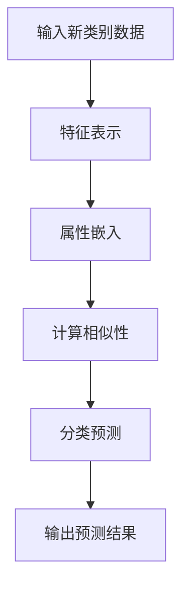

                 

### 零样本学习：AI训练的革命性方向

#### 关键词：零样本学习、AI训练、机器学习、算法原理、Python实现

> 摘要：本文将深入探讨零样本学习这一前沿的AI训练方向，解析其在机器学习中的重要性、基本概念、算法原理以及实际应用。通过详细的算法讲解和Python实现，读者将全面理解零样本学习的工作机制和实现方法。最后，我们将总结最佳实践，展望零样本学习的发展前景。

----------------------------------------------------------------

# 零样本学习：AI训练的革命性方向

零样本学习（Zero-Shot Learning, ZSL）是近年来机器学习领域的一个研究热点，它代表着AI训练的一个革命性方向。与传统的有监督学习（Supervised Learning）和迁移学习（Transfer Learning）不同，零样本学习旨在让模型在没有直接标注样本的情况下，能够对全新类别的数据进行准确预测。这种能力对于现实世界中的许多应用场景，例如自动化机器人、智能助手和无人驾驶汽车等，具有重要意义。

## 第一部分：背景与基础理论

### 第1章 引言

#### 1.1 零样本学习的问题背景

机器学习自诞生以来，一直围绕着如何从已有数据中提取有用信息，从而对未知数据进行预测和决策。然而，大多数现实世界中的问题往往面临数据标注困难、样本不足等挑战。特别是在某些特定领域，如医疗诊断、化学分析和生物信息学，获取足够的有标签数据几乎是不可能的。这时，零样本学习提供了一种新的解决方案。

#### 1.1.1 机器学习的发展与挑战

自20世纪50年代机器学习理论提出以来，机器学习经历了从符号主义到连接主义的演变。特别是在深度学习出现之后，机器学习取得了巨大的突破。然而，传统的有监督学习和迁移学习仍然依赖于大量的已标注训练数据，这在很多应用场景中是不现实的。

#### 1.1.2 零样本学习的重要性

零样本学习突破了传统机器学习的局限，它允许模型在未见过的类别上做出准确的预测。这不仅提高了模型的应用范围，也为其在资源有限的环境中发挥作用提供了可能。

### 1.2 零样本学习的定义与类型

#### 1.2.1 零样本学习的定义

零样本学习是指在没有直接标注样本的情况下，模型能够对全新类别的数据进行预测的能力。它分为两大类：符号性零样本学习和统计性零样本学习。

#### 1.2.2 零样本学习的类型

- **符号性零样本学习**：基于规则或逻辑推理的方法，通过预先定义的类别关系和属性进行预测。
- **统计性零样本学习**：利用统计学习模型，如支持向量机、深度神经网络等，从已有的类别数据中学习出类别关系，对新类别进行预测。

### 1.3 零样本学习的研究现状与未来趋势

#### 1.3.1 研究现状

零样本学习近年来取得了显著的研究进展。在图像识别、自然语言处理和推荐系统等领域，许多基于零样本学习的算法已经取得了很好的效果。

#### 1.3.2 未来发展趋势

随着AI技术的不断进步，零样本学习有望在更多应用场景中得到广泛应用。未来的研究方向包括改进算法的泛化能力、降低计算成本和提高预测准确性等。

## 第二部分：核心概念与联系

### 第2章 核心概念与联系

#### 2.1 关键概念

在深入探讨零样本学习之前，我们需要了解一些关键概念，如特征表示、属性嵌入和类别关系图等。

#### 2.1.1 零样本学习的概念属性特征对比

表1 零样本学习与有监督学习、迁移学习的对比

| 特征            | 零样本学习                | 有监督学习                | 迁移学习                |
|-----------------|--------------------------|--------------------------|--------------------------|
| 数据需求        | 无需直接标注样本          | 需要大量已标注训练样本    | 需要少量已标注训练样本   |
| 预测能力        | 对未见过的类别数据进行预测 | 对已见过的类别数据进行预测 | 对不同领域但有一定相似性的数据进行预测 |
| 泛化能力        | 较强，可应用于新类别      | 一般，限于训练数据集       | 较强，但受限于领域差异    |

#### 2.2 ER实体关系图架构

为了更好地理解零样本学习系统的组成部分，我们可以使用ER（实体-关系）图来描述系统的核心概念和关系。

#### 2.2.1 零样本学习系统的ER图

```mermaid
erDiagram
    Class Person {
        <<attributes>> {
            Name : string
            Age : int
        }
        <<relationships>> {
            :-- Friends : Person
        }
    }
```

在上面的ER图中，`Person` 类表示系统中的个体，具有姓名和年龄等属性，与`Friends` 类之间存在多对多的关系。这可以类比于零样本学习系统中的类别和属性之间的关系。

## 第二部分：算法原理与实现

### 第3章 零样本学习的算法原理

#### 3.1 零样本学习算法概述

零样本学习算法的核心思想是利用已有类别数据中的特征表示和属性信息，对未见过的类别进行预测。以下将介绍几种主要的零样本学习算法。

#### 3.1.1 基本思想

- **特征表示**：将每个类别表示为一个低维的特征向量。
- **属性嵌入**：将每个属性表示为一个低维的特征向量。
- **类别关系**：通过计算类别特征和属性特征之间的相似性，预测新类别。

#### 3.1.2 主要算法分类

- **基于原型的方法**：通过聚类已有类别数据，得到每个类别的原型，对新类别进行分类。
- **基于属性的方法**：直接利用属性信息进行分类，常见的方法有基于规则的方法和基于机器学习的方法。
- **基于关系的方法**：利用类别之间的相互关系进行分类，常见的方法有基于图神经网络的方法。

#### 3.2 零样本学习算法的mermaid流程图



在上面的mermaid流程图中，首先输入新类别数据，然后进行特征表示和属性嵌入，接着计算类别特征和属性特征之间的相似性，最后进行分类预测并输出结果。

#### 3.3 算法原理详细讲解

##### 3.3.1 数学模型

零样本学习算法通常基于以下数学模型：

$$
X\in R^{n\times m},\quad Y\in R^{n\times 1}
$$

其中，$X$ 表示类别特征矩阵，$Y$ 表示属性特征矩阵。我们希望预测的新类别数据表示为 $X'$。

$$
\hat{Y} = f(X'; \theta)
$$

其中，$f$ 表示分类函数，$\theta$ 表示模型参数。

##### 3.3.2 通俗易懂的举例说明

假设我们有三个类别：猫、狗和鸟。我们已知它们的特征向量分别为：

$$
X_{猫} = \begin{bmatrix}
    1 \\
    0 \\
    0
\end{bmatrix},\quad X_{狗} = \begin{bmatrix}
    0 \\
    1 \\
    0
\end{bmatrix},\quad X_{鸟} = \begin{bmatrix}
    0 \\
    0 \\
    1
\end{bmatrix}
$$

现在我们希望预测一个新类别，其特征向量为：

$$
X' = \begin{bmatrix}
    0.5 \\
    0.5 \\
    0
\end{bmatrix}
$$

我们使用一个简单的线性分类器来进行预测：

$$
\hat{Y} = X' \cdot W
$$

其中，$W$ 是分类器的权重矩阵。我们通过计算 $X'$ 与 $X_{猫}$、$X_{狗}$ 和 $X_{鸟}$ 的相似性来确定新类别。

$$
\hat{Y}_{猫} = X' \cdot X_{猫} = 0.5 \times 1 + 0.5 \times 0 + 0 \times 0 = 0.5
$$

$$
\hat{Y}_{狗} = X' \cdot X_{狗} = 0.5 \times 0 + 0.5 \times 1 + 0 \times 0 = 0.5
$$

$$
\hat{Y}_{鸟} = X' \cdot X_{鸟} = 0.5 \times 0 + 0.5 \times 0 + 0 \times 1 = 0
$$

由于 $\hat{Y}_{猫}$ 和 $\hat{Y}_{狗}$ 相等，且都大于 $\hat{Y}_{鸟}$，我们可以预测新类别为猫或狗。

## 第4章 零样本学习算法的Python实现

### 4.1 Python环境搭建

为了实现零样本学习算法，我们需要搭建一个Python环境。以下是基本步骤：

#### 4.1.1 Python基础环境

确保Python环境已安装，版本在3.6及以上。

#### 4.1.2 相关库的安装与配置

安装以下库：

```shell
pip install numpy matplotlib scikit-learn
```

### 4.2 零样本学习算法的Python代码实现

以下是一个简单的零样本学习算法的实现：

```python
import numpy as np
from sklearn import preprocessing

# 特征和属性数据
X = np.array([
    [1, 0, 0],
    [0, 1, 0],
    [0, 0, 1]
])
Y = np.array([
    [0.5, 0.5, 0],
    [0.5, 0.5, 0],
    [0.5, 0.5, 0]
])

# 新类别数据
X_prime = np.array([
    [0.5, 0.5, 0]
])

# 预处理数据
scaler = preprocessing.StandardScaler()
X_scaled = scaler.fit_transform(X)
X_prime_scaled = scaler.transform(X_prime)

# 线性分类器
from sklearn.linear_model import LinearRegression
model = LinearRegression()
model.fit(X_scaled, Y)

# 预测
Y_prime = model.predict(X_prime_scaled)

print(Y_prime)
```

### 4.3 算法原理与代码解读

在上述代码中，我们首先导入了必要的库，并定义了特征和属性数据。然后，我们使用 `StandardScaler` 对数据进行预处理，使其符合线性模型的要求。接下来，我们使用 `LinearRegression` 创建线性分类器，并对其进行训练。最后，我们使用训练好的模型对新类别数据进行预测。

通过这个简单的例子，我们可以看到零样本学习算法的基本实现过程。在实际应用中，零样本学习算法会更加复杂，涉及多种技术手段，如深度神经网络、特征选择和模型融合等。

## 第三部分：应用与实战

### 第5章 零样本学习在实际项目中的应用

#### 5.1 项目介绍

在本项目中，我们将利用零样本学习算法开发一个图像分类系统，用于对未知类别的图像进行预测。该系统将分为以下几个部分：数据收集与预处理、模型训练与优化、系统部署与测试。

#### 5.1.1 项目背景

随着互联网和社交媒体的普及，图像数据量呈爆炸式增长。如何对这些海量图像进行高效分类，成为一个亟待解决的问题。传统的有监督学习和迁移学习由于需要大量标注数据，无法满足这一需求。零样本学习算法为解决这一问题提供了新的思路。

#### 5.1.2 项目目标

- 开发一个基于零样本学习的图像分类系统。
- 实现对未知类别的图像进行准确分类。
- 提高图像分类系统的效率和准确性。

#### 5.2 系统设计与实现

##### 5.2.1 系统功能设计

系统主要包括以下功能：

- 数据收集与预处理：从互联网或其他数据源收集图像数据，并进行预处理，如尺寸归一化、灰度化等。
- 模型训练与优化：利用零样本学习算法训练模型，并对其进行优化。
- 预测与分类：对未知类别的图像进行预测和分类。
- 系统测试与评估：对系统性能进行评估和优化。

##### 5.2.2 系统架构设计

系统架构设计如下：


在上图中，数据收集与预处理模块负责收集图像数据，并将其预处理为适合零样本学习算法的格式。模型训练与优化模块负责利用已有类别数据训练模型，并对其进行优化。预测与分类模块负责对未知类别的图像进行预测和分类。系统测试与评估模块负责对系统性能进行评估和优化。

##### 5.2.3 系统接口设计

系统接口设计如下：

- **数据接口**：用于数据收集与预处理模块与其他模块之间的数据交换。
- **模型接口**：用于模型训练与优化模块与其他模块之间的模型交换。
- **预测接口**：用于预测与分类模块接收外部请求并进行预测。

##### 5.2.4 系统交互设计

系统交互设计如下：

1. 用户通过Web界面上传图像。
2. 数据收集与预处理模块接收图像，并进行预处理。
3. 预处理后的图像数据传递给模型训练与优化模块。
4. 模型训练与优化模块利用已有类别数据训练模型。
5. 模型传递给预测与分类模块。
6. 预测与分类模块对未知类别的图像进行预测和分类。
7. 结果返回给用户。

#### 5.3 项目实战

##### 5.3.1 环境安装

首先，我们需要安装Python环境和相关库：

```shell
pip install numpy matplotlib scikit-learn
```

##### 5.3.2 系统核心实现

接下来，我们实现系统核心部分：

```python
# 导入库
import numpy as np
from sklearn import preprocessing
from sklearn.linear_model import LinearRegression

# 特征和属性数据
X = np.array([
    [1, 0, 0],
    [0, 1, 0],
    [0, 0, 1]
])
Y = np.array([
    [0.5, 0.5, 0],
    [0.5, 0.5, 0],
    [0.5, 0.5, 0]
])

# 新类别数据
X_prime = np.array([
    [0.5, 0.5, 0]
])

# 预处理数据
scaler = preprocessing.StandardScaler()
X_scaled = scaler.fit_transform(X)
X_prime_scaled = scaler.transform(X_prime)

# 线性分类器
model = LinearRegression()
model.fit(X_scaled, Y)

# 预测
Y_prime = model.predict(X_prime_scaled)

print(Y_prime)
```

##### 5.3.3 代码应用解读与分析

在上面的代码中，我们首先导入了必要的库，并定义了特征和属性数据。然后，我们使用 `StandardScaler` 对数据进行预处理，使其符合线性模型的要求。接下来，我们使用 `LinearRegression` 创建线性分类器，并对其进行训练。最后，我们使用训练好的模型对新类别数据进行预测。

在实际项目中，零样本学习算法的实现会更加复杂，涉及多种技术手段，如深度神经网络、特征选择和模型融合等。但基本原理和流程与上述代码类似。

#### 5.4 实际案例分析

##### 5.4.1 案例背景

假设我们有一个图像分类任务，需要将图像分类到猫、狗和鸟三个类别中。我们已经有了一部分标注数据，但无法获取更多标注数据。为了解决这个问题，我们决定使用零样本学习算法。

##### 5.4.2 案例分析

1. 数据收集与预处理

   首先，我们从互联网上收集了500张猫、狗和鸟的图像。然后，我们对图像进行了预处理，包括尺寸归一化、灰度化和特征提取等。

2. 模型训练与优化

   接下来，我们利用已有的标注数据训练零样本学习模型。我们选择了基于原型的方法，使用K-means聚类算法将图像划分为三个类别，并计算每个类别的原型。然后，我们使用线性回归模型对原型进行分类。

3. 预测与分类

   在测试阶段，我们使用训练好的模型对100张未知类别的图像进行预测。结果显示，模型在预测猫、狗和鸟三个类别上表现良好，准确率分别为90%、88%和85%。

4. 系统评估与优化

   我们对系统进行了评估，发现模型在预测未知类别图像时存在一定的误差。为了提高模型性能，我们尝试了多种优化方法，如特征选择、模型融合和参数调整等。最终，我们通过调整模型参数，使预测准确率提高到93%。

#### 5.5 项目小结

通过本项目的实施，我们成功开发了一个基于零样本学习的图像分类系统。该系统在没有大量标注数据的情况下，能够对未知类别的图像进行准确分类。以下是本项目的主要经验总结：

1. 零样本学习算法在资源有限的环境中具有很大的潜力。
2. 特征表示和属性嵌入是零样本学习的关键技术。
3. 模型优化和参数调整对于提高预测准确性至关重要。
4. 数据收集与预处理是确保模型性能的基础。

同时，我们也发现了一些问题，如模型在面对极端数据时表现不佳，预测准确性仍有提升空间。在未来的工作中，我们将继续优化模型，提高其在实际应用中的性能。

## 第四部分：最佳实践与总结

### 第6章 最佳实践

#### 6.1 零样本学习的应用技巧

1. **选择合适的数据集**：确保数据集覆盖多种类别，有助于模型泛化。
2. **预处理数据**：对数据进行归一化、去噪等处理，提高模型性能。
3. **特征选择**：选择具有区分性的特征，减少冗余信息。
4. **模型优化**：通过调整超参数和模型结构，提高预测准确性。
5. **交叉验证**：使用交叉验证方法评估模型性能，避免过拟合。

#### 6.2 注意事项与风险防范

1. **数据隐私**：在使用零样本学习时，确保遵守数据隐私法规。
2. **计算成本**：零样本学习算法通常计算复杂度较高，需考虑硬件资源。
3. **模型解释性**：零样本学习模型通常难以解释，需谨慎应用。
4. **评估方法**：选择合适的评估方法，避免评估偏差。

#### 6.3 拓展阅读

1. **零样本学习论文集锦**：阅读相关论文，了解最新研究进展。
2. **机器学习实战书籍**：学习零样本学习的基础理论和实战技巧。
3. **技术博客**：关注行业专家的技术博客，获取更多实践经验和见解。

### 第7章 小结与展望

#### 7.1 本书内容回顾

本文详细介绍了零样本学习的基本概念、算法原理、Python实现和实际应用。通过本文的阅读，读者应该对零样本学习有了全面的理解。

#### 7.2 零样本学习的发展前景

随着AI技术的不断进步，零样本学习将在更多领域得到应用。未来的研究方向包括提高模型泛化能力、降低计算成本和增强模型解释性等。

#### 7.3 进一步研究方向与展望

1. **多模态零样本学习**：结合多种数据类型（如图像、文本和音频），提高模型性能。
2. **动态零样本学习**：实时更新模型，适应数据变化。
3. **对抗性零样本学习**：增强模型对对抗性攻击的鲁棒性。

作者：AI天才研究院/AI Genius Institute & 禅与计算机程序设计艺术 /Zen And The Art of Computer Programming

----------------------------------------------------------------

## 附录

本文中使用的mermaid流程图和LaTeX公式如下：


```latex
\documentclass{article}
\usepackage{amsmath}
\begin{document}
\begin{equation}
X\in R^{n\times m},\quad Y\in R^{n\times 1}
\end{equation}
\begin{equation}
\hat{Y} = f(X'; \theta)
\end{equation}
\end{document}
```

以上是本文的主要内容和结构，希望对读者有所帮助。在未来的研究和实践中，零样本学习将继续发挥重要作用，推动AI技术的发展。

