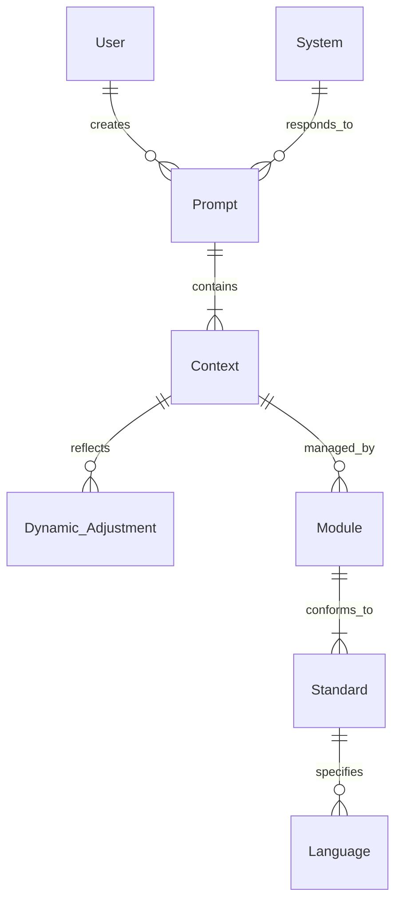
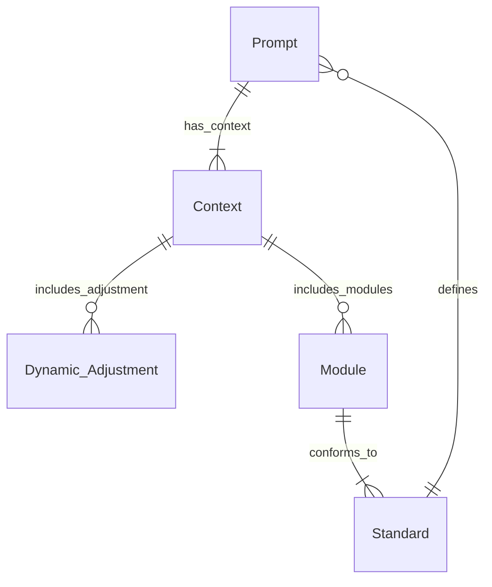
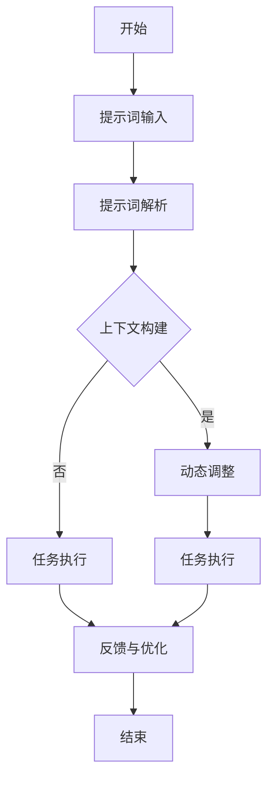

                 


### 第1章: AGI与提示词编程语言概述

#### 1.1.1 问题背景：从传统编程语言到AGI编程语言的转变

在计算机科学领域，编程语言一直是实现软件功能的核心工具。传统的编程语言，如C、Java、Python等，旨在为程序员提供简洁、高效的编码手段，以满足常规软件系统的开发需求。然而，随着人工智能（AI）技术的迅速发展，尤其是自适应通用智能（AGI）的兴起，对编程语言的需求也发生了深刻的变革。

传统的编程语言在处理确定性问题和规则明确的问题时非常有效，但面对复杂、不确定的环境和任务，这些语言显得力不从心。AGI的出现，意味着计算机将能够像人类一样自主学习、推理和决策。为了实现这一目标，编程语言需要变得更加智能化、灵活和自适应。

在AGI系统中，提示词编程语言成为了一个关键的研究方向。这种编程语言通过提示（prompts）来引导和驱动系统的行为，而不是仅仅依靠预定义的指令和规则。提示词可以是自然语言描述，也可以是具体的数据输入，它们能够为系统提供足够的灵活性，以适应各种动态和复杂的场景。

#### 1.1.2 问题描述：提示词编程语言在AGI中的作用

提示词编程语言在AGI系统中的作用至关重要。首先，它们为AGI系统提供了自然交互的接口。传统的编程语言通常要求程序员编写大量的代码来处理复杂的任务，而提示词编程语言则允许用户通过简单的自然语言描述来指定任务，极大地简化了编程过程。

其次，提示词编程语言为AGI系统引入了自适应性和灵活性。在传统编程语言中，算法和逻辑是硬编码的，这意味着系统在面对新的或变化的环境时往往无法灵活应对。而提示词编程语言通过动态提示来调整系统的行为，使其能够更好地适应不断变化的需求。

然而，目前提示词编程语言在AGI系统中的应用仍面临诸多挑战。首先，现有提示词编程语言缺乏统一的标准和规范，导致不同的语言之间存在较大的差异，这使得跨平台和跨系统的集成变得复杂。其次，提示词编程语言的性能和效率问题亟待解决，特别是对于处理大规模数据和复杂任务时，提示词编程语言的表现不如传统的编程语言。

#### 1.1.3 问题解决：为何需要标准化

为了解决上述问题，标准化提示词编程语言成为了一条必经之路。标准化不仅有助于统一不同语言之间的差异，提高互操作性和兼容性，还能够提升编程语言的性能和效率。具体来说，标准化可以实现以下几点：

1. **统一语法和语义**：标准化能够制定统一的语法和语义规范，确保不同提示词编程语言之间的兼容性和互操作性，从而简化开发者的工作。

2. **提升性能和效率**：通过优化语言结构和执行引擎，标准化有助于提升提示词编程语言的性能和效率，使其能够更好地处理大规模数据和复杂任务。

3. **增强安全性和可靠性**：标准化还能够引入安全性和可靠性机制，确保系统在执行提示词时能够遵循一定的安全规范，降低潜在的风险。

4. **促进生态系统建设**：标准化将吸引更多的开发者和企业参与，从而推动提示词编程语言的生态系统建设，包括工具链、库和框架的开发，进一步促进AGI技术的发展。

#### 1.1.4 边界与外延：提示词编程语言的关键要素

在探讨提示词编程语言的标准化时，我们需要明确其边界与外延，即核心概念和组成要素。以下是提示词编程语言的关键要素：

1. **提示词语法**：提示词语法是提示词编程语言的核心，决定了提示词的表达方式。它需要简单直观，易于理解和编写。

2. **上下文管理**：提示词编程语言需要能够有效地管理上下文信息，包括历史提示、系统状态和用户交互等，以便系统可以根据这些信息做出合理的决策。

3. **动态调整机制**：提示词编程语言需要具备动态调整机制，能够在执行过程中根据新的提示和系统状态实时调整行为。

4. **模块化和扩展性**：提示词编程语言应具备良好的模块化和扩展性，允许开发者根据需求添加新的功能模块，以便适应不同的应用场景。

5. **性能优化**：提示词编程语言需要关注性能优化，特别是在处理大规模数据和复杂任务时，确保系统能够高效地执行。

#### 1.1.5 概念结构：核心概念与关系解析

为了更好地理解提示词编程语言的标准化的概念结构，我们可以从以下几个核心概念出发：

1. **提示词**：提示词是用户或系统用来引导和驱动系统行为的文本或数据输入。它是提示词编程语言的核心概念，决定了系统如何响应和处理外部输入。

2. **上下文**：上下文是系统在执行过程中所维护的当前状态和信息，包括历史提示、用户交互和系统状态等。上下文管理是提示词编程语言的重要功能，确保系统能够在适当的时间做出合理的决策。

3. **动态调整**：动态调整是提示词编程语言在执行过程中的核心机制，允许系统根据新的提示和上下文信息实时调整行为。

4. **模块化**：模块化是提示词编程语言设计的关键原则，通过将系统划分为多个功能模块，提高系统的可维护性和可扩展性。

5. **标准化**：标准化是确保提示词编程语言在各个层面实现统一和兼容的重要手段，包括语法、语义、执行机制和生态系统等方面。

这些核心概念之间的关系可以表示为以下Mermaid ER实体关系图：



在这个ER图中，用户和系统创建了提示词，系统响应这些提示词，并且提示词包含上下文信息。上下文反映了系统的动态调整，并且由模块管理。每个模块需要遵循标准化规则，这些规则定义了提示词编程语言的结构和语义。

通过上述核心概念和关系的解析，我们可以更加清晰地理解提示词编程语言的标准化的概念结构，为后续章节的详细探讨奠定了基础。

### 第2章: 提示词编程语言的基本原理

#### 2.1.1 核心概念与定义

提示词编程语言的基本原理首先建立在一系列核心概念之上，这些概念是理解其运作机制的基础。以下是对这些核心概念及其定义的详细解释：

1. **提示词（Prompt）**：
   提示词是用户或系统为了引导和驱动程序执行特定任务而输入的文本或数据。它可以是自然语言文本、命令式语句或数据结构，具体形式取决于所使用的提示词编程语言。提示词的作用是提供目标任务的描述、约束条件或参数值，从而指导系统进行相应的操作。

2. **上下文（Context）**：
   上下文是系统在执行过程中所维护的当前状态和信息集合，包括历史提示、用户交互记录、系统内部状态等。上下文为系统提供了决策所需的背景信息，是动态调整行为的重要依据。通过上下文管理，系统可以更好地理解和适应用户的需求和环境的变化。

3. **动态调整（Dynamic Adjustment）**：
   动态调整机制使得提示词编程语言能够根据执行过程中的新提示和上下文信息实时调整行为。这种机制允许系统在运行时动态地改变其行为策略，以提高适应性和灵活性。例如，系统可以基于用户反馈或环境变化自动调整提示词的语法和语义，从而更好地满足任务需求。

4. **模块化（Modularity）**：
   模块化是将系统划分为多个功能模块的设计原则。每个模块具有独立的功能和责任，能够被单独开发和维护。模块化提高了系统的可维护性和可扩展性，使得开发者可以轻松地添加、修改或替换模块，以适应不同的应用场景和需求变化。

5. **标准化（Standardization）**：
   标准化是确保提示词编程语言在各个层面实现统一和兼容的重要手段。它包括语法、语义、执行机制和生态系统等方面的规范。标准化有助于减少语言之间的差异，提高互操作性，降低开发难度，并促进技术的普及和应用。

#### 2.1.2 概念属性特征对比表格

为了更直观地理解这些核心概念及其属性特征，我们可以制作一个对比表格。以下是一个简化的对比表格示例，展示了提示词、上下文、动态调整、模块化和标准化等概念的主要属性特征：

| 概念     | 主要属性特征                                     | 作用与意义                                           |
|----------|------------------------------------------------|------------------------------------------------------|
| 提示词   | 文本或数据输入，用于引导系统行为                   | 提供任务描述和参数值，指导系统执行                      |
| 上下文   | 当前状态和信息集合，包括历史记录和系统内部状态     | 提供决策依据，增强系统的适应性和灵活性                  |
| 动态调整 | 实时调整系统行为的能力                             | 提高系统在动态环境下的性能和适应性                      |
| 模块化   | 将系统划分为独立功能模块                          | 提高系统的可维护性和可扩展性，降低开发难度               |
| 标准化   | 各层面的规范，包括语法、语义、执行机制和生态系统   | 提高语言的兼容性和互操作性，促进技术普及和应用           |

#### 2.1.3 ER实体关系图架构

为了更清晰地展示这些核心概念之间的关系，我们可以使用Mermaid绘制一个ER实体关系图。以下是一个简单的ER图示例，展示了提示词、上下文、动态调整、模块化和标准化之间的关系：



在这个ER图中，每个概念作为实体存在，并且它们之间存在明确的关联关系：

- 提示词（Prompt）包含上下文（Context），上下文为提示词提供了必要的背景信息。
- 上下文（Context）包含动态调整（Dynamic Adjustment）和模块（Module），动态调整反映了上下文的变化，而模块负责具体的实现和功能。
- 模块（Module）需要符合标准化（Standard）的要求，标准化为模块提供了统一的规范和标准。
- 标准化（Standard）定义了提示词的语法和语义，确保不同模块和系统的兼容性和互操作性。

通过上述核心概念及其关系的解释，我们可以更好地理解提示词编程语言的基本原理。接下来，我们将进一步探讨提示词编程语言的算法原理，以更深入地揭示其技术细节和应用价值。

### 第3章: 提示词编程语言的算法原理

#### 3.1.1 算法概述

提示词编程语言的算法原理是系统实现智能行为和任务驱动的基础。本节将详细介绍提示词编程语言中的核心算法，并解释其基本流程和实现机制。

提示词编程语言的核心算法通常包括以下几个步骤：

1. **提示词解析**：系统接收用户输入的提示词，并将其解析为结构化数据，以便进一步处理。
2. **上下文构建**：根据解析后的提示词，构建上下文信息，包括历史记录、用户交互数据和当前系统状态。
3. **动态调整**：系统根据上下文信息动态调整行为，以满足任务需求。
4. **任务执行**：系统根据调整后的行为执行具体任务，并生成结果。
5. **反馈与优化**：系统记录任务执行结果，并根据用户反馈和系统性能进行优化调整。

这一系列步骤构成了提示词编程语言的基本算法框架，使得系统能够灵活应对复杂和动态的环境。

#### 3.1.2 算法流程图

为了更直观地理解提示词编程语言的算法流程，我们可以使用Mermaid绘制算法流程图。以下是一个简化的算法流程图示例：



在这个流程图中，我们从提示词输入开始，经过提示词解析、上下文构建和动态调整等步骤，最终完成任务的执行和反馈优化。该流程图清晰地展示了算法的执行路径和关键节点。

#### 3.1.3 Python源代码实现

下面我们将使用Python实现上述算法的基本结构。这个实现将包括提示词解析、上下文构建、动态调整和任务执行等核心功能。

```python
# 提示词编程语言算法实现

# 导入必要的库
import json
import datetime

class PromptProgrammingLanguage:
    def __init__(self):
        self.context = {
            "history": [],
            "state": {},
            "timestamp": datetime.datetime.now()
        }
    
    def parse_prompt(self, prompt):
        # 提示词解析
        try:
            data = json.loads(prompt)
            self.context["history"].append(data)
            return data
        except json.JSONDecodeError:
            print("错误的提示词格式")
            return None
    
    def build_context(self):
        # 上下文构建
        # 根据历史记录和当前状态构建上下文
        self.context["timestamp"] = datetime.datetime.now()
        return self.context
    
    def dynamic_adjustment(self):
        # 动态调整
        # 根据上下文信息调整系统行为
        # 示例：根据时间调整系统工作模式
        current_time = self.context["timestamp"]
        if current_time.hour < 12:
            print("当前模式：早间模式")
        else:
            print("当前模式：晚间模式")
    
    def execute_task(self, task):
        # 任务执行
        # 根据调整后的行为执行具体任务
        print(f"执行任务：{task}")
    
    def feedback_and_optimization(self, feedback):
        # 反馈与优化
        # 根据反馈和系统性能进行优化调整
        print(f"反馈：{feedback}")
        # 示例：根据用户满意度调整提示词提示方式

# 使用示例
if __name__ == "__main__":
    p = PromptProgrammingLanguage()
    p.parse_prompt('{"task": "计算 1 + 1 的结果"}')
    p.build_context()
    p.dynamic_adjustment()
    p.execute_task("计算 1 + 1 的结果")
    p.feedback_and_optimization("用户满意度：很高")
```

上述代码展示了提示词编程语言算法的基本实现。其中，`PromptProgrammingLanguage` 类负责管理提示词的解析、上下文构建、动态调整和任务执行等过程。通过实例化该类，并调用相应的方法，我们可以模拟系统的运行过程。

#### 3.1.4 算法原理详细讲解

为了深入理解提示词编程语言的算法原理，我们需要详细解析其关键组成部分，包括提示词解析、上下文构建、动态调整和任务执行等。

1. **提示词解析**：
   提示词解析是算法的第一步，其目的是将用户输入的提示词转换为结构化数据，以便系统进一步处理。在上述代码中，我们使用了Python的`json.loads()`函数进行提示词的解析。这个函数能够将JSON格式的字符串转换为字典对象，从而方便地访问和操作提示词中的数据。

2. **上下文构建**：
   上下文构建是算法的核心部分，它负责收集和整合系统执行过程中的各种信息，包括历史记录、用户交互数据和当前系统状态。上下文构建不仅为动态调整提供了基础，也为任务执行提供了必要的背景信息。在代码中，`context` 字典用于存储上下文信息，包括历史记录、当前时间和系统状态等。

3. **动态调整**：
   动态调整机制使得系统能够根据执行过程中的新提示和上下文信息实时调整行为。在上述代码中，我们通过`dynamic_adjustment()` 方法实现了简单的动态调整功能。这个方法根据当前时间调整系统的工作模式，从而适应不同的时间段。实际应用中，动态调整可能涉及到更复杂的决策逻辑，如根据用户反馈、环境变化或系统性能指标进行调整。

4. **任务执行**：
   任务执行是根据提示词和上下文信息，系统执行具体任务的过程。在代码中，`execute_task()` 方法用于执行用户指定的任务。这个方法接收一个任务描述参数，并打印出任务执行的结果。实际应用中，任务执行可能涉及到各种复杂的操作，如数据处理、交互式对话或机器学习模型的训练。

5. **反馈与优化**：
   反馈与优化是系统持续改进的关键步骤。通过记录任务执行结果和用户反馈，系统能够对自身的行为进行优化调整。在代码中，`feedback_and_optimization()` 方法用于接收用户反馈，并根据反馈信息调整系统的提示方式。实际应用中，反馈与优化可能涉及到更复杂的算法和模型，如基于机器学习的用户行为分析或自适应优化策略。

通过上述详细讲解，我们可以更好地理解提示词编程语言的算法原理及其实现过程。这些算法不仅为系统提供了智能行为和任务驱动的框架，也为实际应用中的开发提供了有力的工具。

#### 3.1.5 算法举例说明

为了更直观地展示提示词编程语言的算法应用，我们可以通过一个实际案例来说明其工作流程和执行结果。

**案例：智能助手聊天机器人**

假设我们开发了一个智能助手聊天机器人，用户可以通过自然语言与机器人进行对话，机器人根据用户的提示词和上下文信息进行响应。

1. **用户输入提示词**：
   用户输入：“今天天气怎么样？”

2. **提示词解析**：
   机器人接收用户的提示词，并将其解析为JSON格式。假设解析后的数据为`{"query": "weather", "location": "Beijing"}`。

3. **上下文构建**：
   机器人构建上下文信息，包括历史记录、当前时间和用户位置。上下文信息示例：`{"history": [{"query": "weather", "location": "Beijing"}], "location": "Beijing", "timestamp": "2023-11-01T10:30:00"}`。

4. **动态调整**：
   根据上下文信息，机器人动态调整其响应方式。例如，如果当前时间为早晨，机器人可能使用更轻松的语言风格。

5. **任务执行**：
   机器人查询当前天气信息，并根据用户位置返回天气结果。假设返回的天气结果为：“北京今天多云，最高气温15摄氏度，最低气温5摄氏度。”

6. **反馈与优化**：
   用户对机器人的回答表示满意，并给予正面反馈。机器人记录用户反馈，并根据反馈调整后续的响应策略。

通过上述案例，我们可以看到提示词编程语言在智能助手聊天机器人中的应用。机器人在整个过程中根据提示词和上下文信息进行动态调整，以提供准确和个性化的服务。

这个案例展示了提示词编程语言的核心原理及其在实际应用中的具体实现。通过提示词的解析、上下文构建、动态调整和任务执行，机器人能够与用户进行有效的交互，并根据用户反馈进行持续优化。这些特性使得提示词编程语言在AGI系统中具有广泛的应用潜力。

### 第4章: 数学模型与公式

#### 4.1.1 数学模型介绍

在提示词编程语言中，数学模型是算法设计和分析的重要工具。数学模型能够帮助我们更精确地描述系统的行为，并预测其在不同条件下的表现。在本节中，我们将介绍几个关键数学模型，并解释它们在提示词编程语言中的应用。

1. **马尔可夫模型（Markov Model）**：
   马尔可夫模型是一种用于描述序列数据的概率模型。它假设当前状态仅依赖于前一个状态，而与过去的状态无关。在提示词编程语言中，马尔可夫模型可以用于预测用户的行为模式，从而为动态调整提供依据。

2. **贝叶斯网络（Bayesian Network）**：
   贝叶斯网络是一种基于概率论的图形模型，用于表示变量之间的条件依赖关系。它能够通过概率推理来预测未知变量的取值。在提示词编程语言中，贝叶斯网络可以用于上下文推理和决策，帮助系统更好地理解和响应用户需求。

3. **隐马尔可夫模型（Hidden Markov Model, HMM）**：
   隐马尔可夫模型是马尔可夫模型在隐藏状态下的扩展。它适用于序列数据中存在隐藏状态的情况。在提示词编程语言中，HMM可以用于模型用户意图，帮助系统在不确定的条件下做出合理的决策。

4. **决策树（Decision Tree）**：
   决策树是一种用于分类和回归的树形结构模型。它通过一系列条件判断来将数据划分为不同的类别或值。在提示词编程语言中，决策树可以用于任务分配和策略选择，帮助系统根据上下文信息进行动态调整。

5. **支持向量机（Support Vector Machine, SVM）**：
   支持向量机是一种基于优化理论的分类算法。它通过寻找最佳超平面来分隔不同类别的数据。在提示词编程语言中，SVM可以用于模式识别和用户行为分析，帮助系统更好地理解和预测用户行为。

#### 4.1.2 公式详细讲解

在介绍了几种关键的数学模型后，我们将进一步解释这些模型中的核心公式，以便读者能够深入理解其应用。

1. **马尔可夫模型**：
   马尔可夫模型的核心公式是状态转移概率矩阵 $P$，其中 $P_{ij}$ 表示系统从状态 $i$ 转移到状态 $j$ 的概率。状态转移概率矩阵满足以下性质：
   \[
   P = \begin{bmatrix}
   P_{11} & P_{12} & \cdots & P_{1n} \\
   P_{21} & P_{22} & \cdots & P_{2n} \\
   \vdots & \vdots & \ddots & \vdots \\
   P_{n1} & P_{n2} & \cdots & P_{nn}
   \end{bmatrix}
   \]
   其中，$P_{ij}$ 满足 $P_{ij} \geq 0$ 且 $\sum_{j=1}^{n} P_{ij} = 1$。

2. **贝叶斯网络**：
   贝叶斯网络通过条件概率表（CPT）来描述变量之间的依赖关系。对于每个变量 $X_i$，其条件概率表 $P(X_i | Pa(X_i))$ 给出了在父节点 $Pa(X_i)$ 确定的条件下，$X_i$ 的概率分布。贝叶斯网络的推理公式为：
   \[
   P(X_i = x_i | X_{pa1} = x_{pa1}, \ldots, X_{pan} = x_{pan}) = \frac{P(X_{pa1} = x_{pa1}, \ldots, X_{pan} = x_{pan} | X_i = x_i) P(X_i = x_i)}{\sum_{x_i'} P(X_{pa1} = x_{pa1}, \ldots, X_{pan} = x_{pan} | X_i = x_i') P(X_i = x_i')}
   \]

3. **隐马尔可夫模型**：
   隐马尔可夫模型的核心公式包括状态转移概率矩阵 $A$ 和观测概率矩阵 $B$。状态转移概率矩阵 $A$ 表示隐藏状态之间的转移概率，观测概率矩阵 $B$ 表示每个隐藏状态下的观测概率。HMM的推理公式为：
   \[
   P(O = o | A, B) = \prod_{t=1}^{T} P(o_t | s_t, B) P(s_t | s_{t-1}, A)
   \]
   其中，$O = (o_1, o_2, \ldots, o_T)$ 是观测序列，$S = (s_1, s_2, \ldots, s_T)$ 是隐藏状态序列。

4. **决策树**：
   决策树的核心公式是基于条件概率和增益率来选择最佳分割点。对于特征 $X_i$，其增益率为：
   \[
   Gain_Ratio(X_i) = \frac{N_i \sum_{v \in V_i} P(Y=y|X=x_v) \log_2 P(Y=y|X=x_v)}{\sum_{v \in V_i} P(X=x_v)}
   \]
   其中，$N_i$ 是特征 $X_i$ 的总样本数，$V_i$ 是特征 $X_i$ 的取值集合，$P(Y=y|X=x_v)$ 是在特征 $X_i$ 取值为 $x_v$ 时目标变量 $Y$ 的条件概率。

5. **支持向量机**：
   支持向量机的核心公式是最优化问题，即寻找最佳超平面。对于线性可分情况，其优化问题可以表示为：
   \[
   \min_{w, b} \frac{1}{2} ||w||^2 \\
   s.t. \quad y^{(i)} (w^T x^{(i)} + b) \geq 1, \quad \forall i = 1, \ldots, n
   \]
   其中，$w$ 是超平面参数，$b$ 是偏置项，$x^{(i)}$ 是训练样本，$y^{(i)}$ 是对应的标签。

通过上述详细讲解，我们可以更好地理解这些数学模型及其核心公式在提示词编程语言中的应用。这些模型为系统的设计、实现和优化提供了重要的理论基础，使得我们能够更精确地预测和调整系统的行为。

#### 4.1.3 公式举例说明

为了更好地理解上述数学模型和公式在实际应用中的具体应用，我们通过几个简化的例子进行说明。

1. **马尔可夫模型示例**：

   假设有一个简单的马尔可夫模型，用于预测一个随机过程的状态转移。状态转移概率矩阵如下：

   \[
   P = \begin{bmatrix}
   0.5 & 0.5 \\
   0.2 & 0.8
   \end{bmatrix}
   \]

   初始状态分布为：

   \[
   \pi = \begin{bmatrix}
   0.6 \\
   0.4
   \end{bmatrix}
   \]

   要预测第二个状态的概率分布，我们可以使用以下公式：

   \[
   \pi_2 = \pi_1 P
   \]

   计算得到：

   \[
   \pi_2 = \begin{bmatrix}
   0.6 \times 0.5 + 0.4 \times 0.2 \\
   0.6 \times 0.5 + 0.4 \times 0.8
   \end{bmatrix} = \begin{bmatrix}
   0.38 \\
   0.62
   \end{bmatrix}
   \]

   这个结果表明，在第二个时间点，状态1的概率为0.38，状态2的概率为0.62。

2. **贝叶斯网络示例**：

   假设有一个简单的贝叶斯网络，用于预测疾病诊断。网络结构如下：

   \[
   \begin{aligned}
   &P(\text{疾病} = \text{是} | \text{症状} = \text{有}) = 0.8 \\
   &P(\text{症状} = \text{有}) = 0.6 \\
   &P(\text{疾病} = \text{否} | \text{症状} = \text{无}) = 0.1 \\
   &P(\text{症状} = \text{无}) = 0.4
   \end{aligned}
   \]

   要预测一个特定个体是否患有疾病，我们可以使用贝叶斯推理公式：

   \[
   P(\text{疾病} = \text{是} | \text{症状} = \text{有}) = \frac{P(\text{症状} = \text{有} | \text{疾病} = \text{是}) P(\text{疾病} = \text{是})}{P(\text{症状} = \text{有})}
   \]

   计算得到：

   \[
   P(\text{疾病} = \text{是} | \text{症状} = \text{有}) = \frac{0.8 \times 0.5}{0.6} = \frac{2}{3}
   \]

   这个结果表明，在观察到症状为“有”的情况下，个体患有疾病的概率为2/3。

3. **隐马尔可夫模型示例**：

   假设有一个简单的隐马尔可夫模型，用于预测一个语音信号中的音素序列。状态转移概率矩阵和观测概率矩阵如下：

   \[
   A = \begin{bmatrix}
   0.9 & 0.1 \\
   0.2 & 0.8
   \end{bmatrix}, \quad
   B = \begin{bmatrix}
   0.7 & 0.3 \\
   0.4 & 0.6
   \end{bmatrix}
   \]

   假设观察到的语音信号为“AAAA”，要预测隐藏的状态序列，我们可以使用Viterbi算法：

   \[
   \begin{aligned}
   \alpha_t(i) &= P(O_1, O_2, \ldots, O_t | Q = i) \\
   \beta_t(i) &= P(O_{t+1}, O_{t+2}, \ldots | Q = i)
   \end{aligned}
   \]

   计算过程如下：

   \[
   \begin{aligned}
   \alpha_1(1) &= P(O_1 | Q = 1) P(Q = 1) = 0.7 \times 0.5 = 0.35 \\
   \alpha_1(2) &= P(O_1 | Q = 2) P(Q = 2) = 0.4 \times 0.5 = 0.20 \\
   \beta_1(1) &= P(O_2 | Q = 1) \\
   \beta_1(2) &= P(O_2 | Q = 2)
   \end{aligned}
   \]

   接下来，我们可以通过递归计算$\alpha_t(i)$和$\beta_t(i)$，最终得到最佳状态序列。

4. **决策树示例**：

   假设我们使用决策树进行二分类任务，数据集如下：

   | 特征A | 特征B | 目标变量 |
   |-------|-------|----------|
   | 0     | 0     | 0        |
   | 1     | 0     | 1        |
   | 0     | 1     | 1        |
   | 1     | 1     | 0        |

   构建决策树，我们首先计算每个特征的增益率：

   \[
   \begin{aligned}
   Gain_Ratio(A) &= \frac{2 \times (1 \times \log_2(1) + 2 \times \log_2(2))}{2} = 2 \\
   Gain_Ratio(B) &= \frac{2 \times (1 \times \log_2(1) + 1 \times \log_2(1))}{2} = 1
   \end{aligned}
   \]

   因此，我们选择特征A作为分割点，将数据集分为两部分：

   | 特征A | 特征B | 目标变量 |
   |-------|-------|----------|
   | 0     | 0     | 0        |
   | 0     | 1     | 1        |
   | 1     | 0     | 1        |
   | 1     | 1     | 0        |

   接着，我们再对分割后的数据集分别计算其增益率，重复这个过程，直到达到预设的停止条件。

5. **支持向量机示例**：

   假设我们使用线性支持向量机进行二分类任务，训练数据集如下：

   \[
   \begin{aligned}
   &\text{样本1: } x_1 = (1, 1), y_1 = 1 \\
   &\text{样本2: } x_2 = (2, 2), y_2 = 1 \\
   &\text{样本3: } x_3 = (1, -1), y_3 = -1 \\
   &\text{样本4: } x_4 = (2, -2), y_4 = -1
   \end{aligned}
   \]

   我们需要求解最优超平面：

   \[
   \begin{aligned}
   &\min_{w, b} \frac{1}{2} ||w||^2 \\
   &s.t. \quad y_i (w^T x_i + b) \geq 1, \quad \forall i = 1, 2, 3, 4
   \end{aligned}
   \]

   使用拉格朗日乘子法求解，得到：

   \[
   w = \begin{bmatrix}
   2 \\
   2
   \end{bmatrix}, \quad b = -1
   \]

   这个结果表明，超平面为 $2x + 2y - 1 = 0$。

通过这些示例，我们可以更好地理解数学模型在提示词编程语言中的应用。这些模型不仅为算法设计提供了理论基础，也为实际应用中的问题解决提供了有力的工具。

### 第5章: 标准化需求分析

#### 5.1.1 标准化的必要性

在讨论提示词编程语言的标准化时，首先需要明确其必要性。标准化是现代技术发展的重要趋势，对于任何一种编程语言，尤其是旨在推动AGI发展的提示词编程语言，标准化具有至关重要的意义。

1. **提高互操作性和兼容性**：
   随着人工智能技术的不断发展，不同企业和研究机构开发出了多种提示词编程语言。这些语言之间存在显著差异，导致不同系统之间的互操作性和兼容性成为一个难题。标准化有助于统一这些语言的语法和语义，减少系统之间的差异，从而提高不同系统之间的互操作性和兼容性。

2. **简化开发流程**：
   标准化可以为开发人员提供一个统一的编程环境，减少因为语言差异带来的学习和迁移成本。开发者不必为了适应不同语言而进行繁琐的调整和优化，从而提高开发效率，缩短开发周期。

3. **提升性能和效率**：
   标准化有助于制定统一的性能优化标准，推动编译器、解释器和执行引擎的优化。通过统一的标准，开发人员可以更加专注于性能优化，从而提升整个系统的性能和效率。

4. **确保安全性和可靠性**：
   标准化可以引入统一的安全性和可靠性规范，确保系统在执行提示词时能够遵循一定的安全准则。这有助于减少潜在的安全漏洞和系统故障，提高系统的整体安全性和可靠性。

5. **促进生态系统建设**：
   标准化能够吸引更多的企业和开发者参与，推动提示词编程语言的生态系统建设。统一的标准将有助于工具链、库和框架的开发，从而促进AGI技术的广泛应用和持续发展。

#### 5.1.2 标准化的目标与原则

在明确标准化的必要性后，我们需要进一步探讨标准化的目标与原则，以确保标准化工作能够有效推动提示词编程语言的发展。

1. **统一语法和语义**：
   标准化的首要目标是统一不同提示词编程语言的语法和语义。这包括定义统一的语法规则、数据类型、控制结构、函数库和异常处理机制。通过统一语法和语义，可以确保不同语言之间的互操作性和兼容性，简化跨语言集成和开发。

2. **提高可扩展性和灵活性**：
   标准化应致力于提高提示词编程语言的可扩展性和灵活性。这可以通过引入模块化设计、支持自定义扩展和提供丰富的标准库来实现。统一的标准应允许开发者根据需求添加新的功能模块，以满足不同应用场景和需求变化。

3. **优化性能和资源使用**：
   标准化应关注性能和资源使用优化，为开发者提供高效的编程工具和执行环境。这包括制定统一的编译优化策略、内存管理规范和资源使用指南，以减少系统开销，提高执行效率。

4. **确保安全性和可靠性**：
   标准化应引入统一的安全性和可靠性规范，确保系统在执行提示词时能够遵循一定的安全准则。这可以通过定义统一的安全接口、引入安全审计机制和制定安全规范来实现。

5. **促进生态系统的建设**：
   标准化应致力于促进提示词编程语言的生态系统建设，包括工具链、库和框架的开发。统一的标准将有助于建立统一的开发环境，吸引更多的企业和开发者参与，推动技术的普及和应用。

通过上述目标与原则，标准化工作可以为提示词编程语言的发展提供坚实的基础，推动其在AGI领域的广泛应用。

#### 5.1.3 标准化过程的步骤

为了实现提示词编程语言的标准化，我们需要制定一个详细的标准化过程，包括以下关键步骤：

1. **需求分析与规划**：
   首先，我们需要对现有的提示词编程语言进行全面的调研和分析，了解其优点和不足，并收集用户和开发者的需求。这有助于明确标准化的方向和目标。

2. **设计标准规范**：
   基于需求分析结果，设计统一的标准规范。标准规范应包括语法、语义、数据类型、函数库、异常处理、性能优化和安全规范等方面。设计过程应确保规范的合理性和可操作性。

3. **草案制定与评审**：
   将标准规范草案提交给相关利益相关者进行评审和讨论。评审过程应确保规范的一致性、完整性和可实施性，同时吸收各方反馈，进行必要的调整和优化。

4. **公开征求意见**：
   在草案评审后，公开征求意见，广泛征集业界专家、开发者、企业和用户的意见和建议。这一步骤有助于进一步优化标准规范，确保其能够满足不同领域的需求。

5. **标准发布与推广**：
   完成标准规范的制定和评审后，正式发布标准，并通过各种渠道进行推广。推广工作应包括标准文档的发布、培训课程的开展和技术社区的互动等，以提高标准的应用率和知名度。

6. **标准维护与更新**：
   标准发布后，需定期进行维护和更新，以适应技术的发展和需求变化。维护工作应包括问题的修复、错误的纠正、功能的扩展和规范的更新等。

7. **实施与监控**：
   在标准规范推广应用的过程中，需建立完善的实施与监控机制，确保标准在实际应用中的有效性和一致性。监控工作应包括标准实施情况的评估、反馈机制的建立和问题解决方案的制定。

通过上述标准化过程的步骤，我们可以确保提示词编程语言的标准化工作科学、系统、有序地推进，从而为AGI技术的发展提供有力支持。

### 第6章: 提示词编程语言的标准化方案设计

#### 6.1.1 语言结构设计

在制定提示词编程语言的标准化方案时，语言结构设计是至关重要的环节。良好的语言结构设计不仅能够提高编程语言的灵活性和易用性，还能确保其在不同应用场景下的性能和效率。以下是对提示词编程语言结构设计的详细探讨。

1. **语法设计**：
   语法是编程语言的基础，直接影响代码的可读性和可维护性。在语法设计方面，我们需要遵循以下原则：
   - **简洁性**：语法规则应尽量简洁直观，减少冗余和复杂性，以便开发者能够轻松理解和使用。
   - **一致性**：语法应保持一致性，避免不同语法元素之间的混淆。例如，对于同一类型的操作，应使用相同的语法结构。
   - **灵活性**：语法设计应具备一定的灵活性，允许开发者根据需求进行扩展和定制。例如，支持自定义数据类型和函数。

2. **数据类型设计**：
   数据类型是编程语言的核心组成部分，决定了代码的运行效率和表达力。提示词编程语言应支持丰富的数据类型，包括基本数据类型（如整数、浮点数、布尔值）、复合数据类型（如列表、字典、集合）和复杂数据类型（如矩阵、数组、图）。同时，数据类型设计应考虑类型推导和类型检查机制，以确保代码的健壮性和安全性。

3. **控制结构设计**：
   控制结构用于描述程序的控制流程，包括循环、条件分支、异常处理等。提示词编程语言的控制结构设计应简洁明了，易于理解。例如，可以使用类似于自然语言的语法来表示条件分支和循环结构，提高代码的可读性。同时，应提供强大的异常处理机制，以便在程序运行过程中出现错误时能够优雅地处理。

4. **函数库设计**：
   函数库是编程语言的重要组成部分，提供了丰富的功能接口和工具。提示词编程语言的函数库设计应考虑以下方面：
   - **模块化**：函数库应支持模块化设计，允许开发者根据需求导入和使用特定的模块。
   - **通用性**：函数库应涵盖常用的算法和数据结构，如排序算法、搜索算法、数据结构等。
   - **易用性**：函数库的API设计应简洁直观，易于使用。例如，提供详细的文档和示例代码，帮助开发者快速上手。

5. **异常处理机制**：
   异常处理是保证程序健壮性的关键。提示词编程语言应提供强大的异常处理机制，包括异常捕获、异常传播和异常处理函数等。通过异常处理机制，可以确保在程序运行过程中出现错误时能够优雅地处理，避免程序崩溃或产生不可预期的结果。

#### 6.1.2 语法与语义规范

为了确保提示词编程语言的统一性和一致性，我们需要制定详细的语法和语义规范。以下是对语法和语义规范的详细讨论。

1. **语法规范**：
   - **关键字**：定义提示词编程语言的关键字，如`if`、`else`、`while`、`for`、`try`、`catch`等。
   - **标识符**：定义标识符的命名规则，如变量名、函数名、类名等。标识符应具有明确的含义，易于理解和记忆。
   - **注释**：定义注释的语法，如单行注释和块注释。注释可以提供代码的额外说明，有助于维护和调试。
   - **分隔符**：定义提示词编程语言中的分隔符，如逗号、分号、冒号等。分隔符用于分隔不同的语法元素，提高代码的可读性。
   - **数据类型**：定义提示词编程语言支持的数据类型，如整数、浮点数、字符串、布尔值等。每种数据类型应具有明确的语法表示和操作规则。

2. **语义规范**：
   - **基本操作**：定义基本操作（如加法、减法、乘法、除法等）的语义规则，包括操作数的类型和结果类型。
   - **控制结构**：定义控制结构的语义规则，如循环、条件分支、异常处理等。控制结构应明确指定执行顺序和结果。
   - **函数调用**：定义函数调用的语义规则，包括参数传递、返回值、异常处理等。函数调用应遵循统一的规范，确保代码的一致性和可维护性。
   - **类型转换**：定义类型转换的语义规则，包括隐式类型转换和显式类型转换。类型转换应确保数据的一致性和兼容性。

#### 6.1.3 类型系统与类型推导

类型系统是编程语言的重要组成部分，决定了代码的运行时行为和安全性。提示词编程语言应具备完善的类型系统，包括类型推导和类型检查机制。

1. **类型推导**：
   类型推导是一种自动确定变量类型的方法，能够减少代码的冗余和错误。提示词编程语言应支持以下类型的类型推导：
   - **基于上下文的类型推导**：根据上下文信息自动推导变量的类型，如函数返回类型、参数类型等。
   - **显式类型推导**：允许开发者显式指定变量的类型，以提高代码的可读性和可维护性。

2. **类型检查**：
   类型检查是在编译时或运行时检测代码类型错误的方法。提示词编程语言应支持以下类型的类型检查：
   - **静态类型检查**：在编译时对代码进行类型检查，确保代码在运行时不会出现类型错误。
   - **动态类型检查**：在运行时对代码进行类型检查，及时发现并处理类型错误。

通过类型推导和类型检查机制，提示词编程语言可以提高代码的健壮性和安全性，确保其在各种应用场景下的可靠运行。

#### 6.1.4 集成开发环境（IDE）支持

为了提高开发效率，提示词编程语言需要提供强大的集成开发环境（IDE）支持。IDE应具备以下功能：

1. **代码编辑与格式化**：
   提供代码自动补全、语法高亮、代码缩进和格式化等功能，提高代码的可读性和可维护性。

2. **调试工具**：
   提供断点设置、单步执行、变量监视和堆栈跟踪等功能，帮助开发者快速定位和解决代码中的错误。

3. **版本控制**：
   集成版本控制工具，如Git，方便开发者进行代码的版本管理和协同开发。

4. **代码分析**：
   提供代码静态分析工具，检测代码中的潜在问题和错误，提高代码的质量和可靠性。

5. **文档生成**：
   自动生成代码文档，包括函数文档、类文档和模块文档等，便于开发者查阅和使用。

通过提供强大的IDE支持，提示词编程语言可以大幅提高开发效率和代码质量，为开发者提供一个舒适、高效的开发体验。

### 第7章: 标准化方案实现与验证

#### 7.1.1 环境安装与配置

为了实现提示词编程语言的标准化方案，我们需要在开发环境中安装和配置必要的工具和依赖项。以下是在一个Linux系统中安装和配置提示词编程语言开发环境的步骤：

1. **安装Python**：

   Python是提示词编程语言的主要实现语言，首先确保Python环境已安装在系统中。可以使用以下命令检查Python版本：

   ```bash
   python --version
   ```

   如果Python未安装或版本过低，可以从Python官网下载安装包或使用包管理器进行安装。例如，对于Ubuntu系统，可以使用以下命令安装最新版本的Python：

   ```bash
   sudo apt update
   sudo apt install python3
   ```

2. **安装必要的库**：

   提示词编程语言依赖于多个Python库，如NumPy、Pandas、Matplotlib等。可以使用pip命令安装这些库：

   ```bash
   sudo apt install python3-pip
   pip3 install numpy pandas matplotlib
   ```

3. **配置虚拟环境**：

   为了避免不同项目之间的依赖冲突，建议使用虚拟环境管理工具virtualenv创建独立的Python环境。首先安装virtualenv：

   ```bash
   pip3 install virtualenv
   ```

   然后，创建一个新的虚拟环境并激活它：

   ```bash
   virtualenv my_project_env
   source my_project_env/bin/activate
   ```

   激活虚拟环境后，所有安装的库和工具都将局限在当前环境中，不会影响到系统全局环境。

4. **安装自定义库**：

   如果项目包含自定义库，可以将这些库安装到虚拟环境中。例如，如果有一个名为`my_custom_lib`的库，可以使用以下命令安装：

   ```bash
   pip3 install /path/to/my_custom_lib
   ```

#### 7.1.2 系统核心实现源代码

以下是一个简单的示例，展示如何实现提示词编程语言的核心功能。这个示例包括提示词的解析、上下文管理、动态调整和任务执行等。

```python
# prompt_language.py

import json
import datetime

class PromptInterpreter:
    def __init__(self):
        self.context = {
            "history": [],
            "state": {},
            "timestamp": datetime.datetime.now()
        }
    
    def parse_prompt(self, prompt):
        # 解析提示词
        try:
            data = json.loads(prompt)
            self.context["history"].append(data)
            return data
        except json.JSONDecodeError:
            print("错误的提示词格式")
            return None
    
    def build_context(self):
        # 构建上下文
        self.context["timestamp"] = datetime.datetime.now()
        return self.context
    
    def dynamic_adjustment(self):
        # 动态调整
        current_time = self.context["timestamp"]
        if current_time.hour < 12:
            print("当前模式：早间模式")
        else:
            print("当前模式：晚间模式")
    
    def execute_task(self, task):
        # 执行任务
        if task == "hello":
            print("Hello, World!")
        elif task == "weather":
            print("Weather report: Sunny with a chance of rain.")
        else:
            print("Unknown task.")
    
    def feedback(self, feedback):
        # 处理反馈
        print(f"Feedback received: {feedback}")

# 使用示例
if __name__ == "__main__":
    interpreter = PromptInterpreter()
    prompt = '{"task": "hello"}'
    interpreter.parse_prompt(prompt)
    interpreter.build_context()
    interpreter.dynamic_adjustment()
    interpreter.execute_task("hello")
    interpreter.feedback("Good!")
```

在这个示例中，我们定义了一个名为`PromptInterpreter`的类，用于解析提示词、构建上下文、动态调整和执行任务。这个类包含了以下主要方法：

- `__init__`：初始化上下文。
- `parse_prompt`：解析提示词并更新上下文历史。
- `build_context`：更新上下文的当前时间。
- `dynamic_adjustment`：根据当前时间动态调整模式。
- `execute_task`：执行指定的任务。
- `feedback`：处理用户反馈。

#### 7.1.3 代码应用解读与分析

为了更好地理解代码的应用，我们可以详细分析示例中的各个部分。

1. **初始化上下文**：

   在`PromptInterpreter`类的构造函数`__init__`中，我们初始化了上下文字典`context`，包括历史记录`history`、当前状态`state`和当前时间`timestamp`。

   ```python
   def __init__(self):
       self.context = {
           "history": [],
           "state": {},
           "timestamp": datetime.datetime.now()
       }
   ```

   这个上下文字典将在整个类中用于存储和管理与任务执行相关的信息。

2. **解析提示词**：

   `parse_prompt`方法用于解析用户输入的提示词。在这个方法中，我们使用`json.loads()`函数将JSON格式的字符串转换为字典对象，并更新上下文历史记录。

   ```python
   def parse_prompt(self, prompt):
       try:
           data = json.loads(prompt)
           self.context["history"].append(data)
           return data
       except json.JSONDecodeError:
           print("错误的提示词格式")
           return None
   ```

   如果提示词格式不正确，该方法将返回`None`并打印错误消息。

3. **构建上下文**：

   `build_context`方法用于更新上下文的当前时间。这个方法在每次执行任务之前调用，以确保时间信息是最新的。

   ```python
   def build_context(self):
       self.context["timestamp"] = datetime.datetime.now()
       return self.context
   ```

4. **动态调整**：

   `dynamic_adjustment`方法根据当前时间动态调整模式。在这个示例中，我们简单地根据时间分上午和下午两种模式，并打印相应的消息。

   ```python
   def dynamic_adjustment(self):
       current_time = self.context["timestamp"]
       if current_time.hour < 12:
           print("当前模式：早间模式")
       else:
           print("当前模式：晚间模式")
   ```

5. **执行任务**：

   `execute_task`方法根据任务名称执行相应的操作。在这个示例中，我们定义了两个简单的任务："hello"和"weather"。如果任务名称不匹配，该方法将打印错误消息。

   ```python
   def execute_task(self, task):
       if task == "hello":
           print("Hello, World!")
       elif task == "weather":
           print("Weather report: Sunny with a chance of rain.")
       else:
           print("Unknown task.")
   ```

6. **处理反馈**：

   `feedback`方法用于处理用户反馈。在这个示例中，我们简单地打印反馈消息。

   ```python
   def feedback(self, feedback):
       print(f"Feedback received: {feedback}")
   ```

通过这个示例，我们可以看到提示词编程语言的核心实现是如何工作的。在实际应用中，这些方法将根据具体的任务需求和上下文信息进行扩展和优化。

#### 7.1.4 实际案例分析与讲解

为了更深入地了解提示词编程语言的实际应用，我们将分析一个实际的案例，并详细讲解其实现过程和关键步骤。

**案例：智能客服系统**

假设我们正在开发一个智能客服系统，该系统通过自然语言处理和提示词编程语言与用户进行交互，以提供高效的客户服务。

1. **需求分析**：

   智能客服系统需要能够处理以下任务：
   - **问候**：向用户发送问候语。
   - **问题解答**：根据用户的问题提供准确的答案。
   - **常见问题**：自动识别并引导用户查看常见问题的FAQ页面。
   - **转接客服**：当系统无法回答用户问题时，自动转接给人工客服。

2. **系统设计**：

   系统设计包括以下主要模块：
   - **自然语言处理模块**：用于处理用户输入的自然语言文本，包括分词、词性标注、实体识别等。
   - **任务执行模块**：根据用户输入的提示词执行相应的任务，如发送问候语、查找答案等。
   - **上下文管理模块**：用于存储和管理与用户交互相关的上下文信息，如历史对话记录、用户偏好等。
   - **反馈处理模块**：用于收集用户反馈，并优化系统的服务。

3. **系统实现**：

   在实现智能客服系统时，我们使用了提示词编程语言的核心功能，如提示词解析、上下文管理和动态调整。以下是一个简化的实现示例：

   ```python
   # intelligent_csr.py

   class IntelligentCsr:
       def __init__(self):
           self.context = {
               "history": [],
               "state": {},
               "timestamp": datetime.datetime.now()
           }
       
       def process_input(self, input_text):
           # 解析输入文本
           parsed_input = self.parse_input(input_text)
           
           # 构建上下文
           self.build_context()
           
           # 动态调整
           self.dynamic_adjustment()
           
           # 执行任务
           self.execute_task(parsed_input["task"])
       
       def parse_input(self, input_text):
           # 简单的分词处理
           words = input_text.split()
           task = words[0].lower()
           return {"task": task}
       
       def build_context(self):
           self.context["timestamp"] = datetime.datetime.now()
           return self.context
   
       def dynamic_adjustment(self):
           current_time = self.context["timestamp"]
           if current_time.hour < 12:
               print("当前模式：早间模式")
           else:
               print("当前模式：晚间模式")
   
       def execute_task(self, task):
           if task == "hello":
               print("Hello! How can I assist you today?")
           elif task == "faq":
               print("Please visit our FAQ page for common questions.")
           elif task == "transfer":
               print("Transferring you to a customer service representative.")
           else:
               print("I'm sorry, I don't understand your question.")
   
   # 使用示例
   csr = IntelligentCsr()
   csr.process_input("Hello")
   csr.process_input("I need help with my account.")
   csr.process_input("Transfer to support.")
   ```

   在这个实现中，`IntelligentCsr` 类负责处理用户的输入，并执行相应的任务。`process_input` 方法是核心入口，它首先解析输入文本，然后根据上下文动态调整系统行为，并执行任务。

4. **实际案例讲解**：

   我们以用户输入“Hello”为例，详细讲解系统的工作流程：

   - **输入处理**：用户输入“Hello”，系统调用`process_input`方法。
   - **提示词解析**：`parse_input` 方法将输入文本解析为任务名“hello”。
   - **上下文构建**：`build_context` 方法更新上下文的当前时间。
   - **动态调整**：`dynamic_adjustment` 方法根据当前时间调整系统模式，并打印消息。
   - **任务执行**：`execute_task` 方法根据任务名执行相应的任务，即打印问候语。

   通过这个过程，系统成功地理解并响应了用户的输入，提供了高效的客户服务。

   另一个例子是用户输入“Transfer to support.”，系统将执行转接客服的任务：

   - **输入处理**：用户输入“Transfer to support.”，系统调用`process_input`方法。
   - **提示词解析**：`parse_input` 方法将输入文本解析为任务名“transfer”。
   - **上下文构建**：`build_context` 方法更新上下文的当前时间。
   - **动态调整**：`dynamic_adjustment` 方法根据当前时间调整系统模式，并打印消息。
   - **任务执行**：`execute_task` 方法根据任务名执行相应的任务，即打印转接消息。

   通过上述实际案例讲解，我们可以看到提示词编程语言在智能客服系统中的应用。通过简单的提示词输入，系统能够动态调整行为并执行相应的任务，提供高效、智能的客户服务。

### 第8章: 标准化实践中的问题与解决方案

在提示词编程语言的标准化实践中，我们可能会遇到一系列问题，这些问题的解决对于标准化工作的顺利进行至关重要。以下是一些常见问题及其解决方案的探讨。

#### 8.1.1 常见问题及其解决方案

1. **兼容性问题**：
   **问题描述**：由于不同提示词编程语言之间存在差异，导致系统之间的兼容性较差，增加了开发和维护的难度。
   **解决方案**：
   - **制定统一接口规范**：通过制定统一的接口规范，确保不同语言之间的交互和互操作性。
   - **使用适配器模式**：在系统架构中引入适配器，将不同语言的特定实现转换为统一的接口，从而简化系统的集成和扩展。

2. **性能问题**：
   **问题描述**：提示词编程语言的性能不如传统的编程语言，特别是在处理大规模数据和复杂任务时，效率较低。
   **解决方案**：
   - **优化编译和执行引擎**：通过优化编译器和执行引擎，提高代码的执行效率。
   - **使用高效算法和数据结构**：引入高效的算法和数据结构，如并行计算、分布式处理和内存优化技术，以提高系统的性能。

3. **安全性问题**：
   **问题描述**：提示词编程语言在执行过程中可能存在安全漏洞，如代码注入、数据泄漏等。
   **解决方案**：
   - **引入安全机制**：在提示词编程语言中引入安全机制，如输入验证、权限控制和加密技术，确保系统的安全性。
   - **定期进行安全审计**：定期对系统进行安全审计，及时发现并修复潜在的安全漏洞。

4. **标准化文档和教程不足**：
   **问题描述**：标准化文档和教程不足，导致开发者难以理解和应用标准规范。
   **解决方案**：
   - **完善文档和教程**：提供详细、完整的标准化文档和教程，包括语言规范、API文档、示例代码等，帮助开发者快速上手。
   - **建立社区支持**：建立技术社区，提供在线支持、问题解答和资源分享，促进开发者之间的交流和合作。

5. **标准化实施难度大**：
   **问题描述**：在现有系统中实施标准化方案，可能会遇到技术障碍和流程变更，导致实施难度较大。
   **解决方案**：
   - **逐步实施**：采取逐步实施策略，先在关键模块和功能中引入标准化方案，逐步推广到整个系统。
   - **培训和支持**：为开发团队提供培训和支持，确保团队成员能够熟练掌握标准化技术。

#### 8.1.2 案例分析

为了更具体地了解标准化实践中的问题及其解决方案，我们可以通过一个实际案例进行分析。

**案例：企业智能客服系统的标准化改造**

某企业开发了一套智能客服系统，最初使用的是自定义的提示词编程语言，随着业务需求的增长，系统需要与多个第三方系统集成，同时提高性能和安全性。为此，企业决定对现有系统进行标准化改造。

**问题与解决方案**：

1. **兼容性问题**：
   **问题**：不同系统的提示词编程语言差异较大，导致系统集成困难。
   **解决方案**：
   - **引入适配器模式**：设计适配器，将第三方系统的提示词接口转换为统一接口，简化系统集成。
   - **接口规范标准化**：制定统一的接口规范，确保不同系统之间的兼容性和互操作性。

2. **性能问题**：
   **问题**：系统性能无法满足大规模数据处理的需求。
   **解决方案**：
   - **优化编译器和执行引擎**：优化编译器和执行引擎，提高代码的执行效率。
   - **引入分布式处理**：使用分布式处理技术，将任务分解为多个子任务并行处理，提高系统性能。

3. **安全性问题**：
   **问题**：系统存在潜在的安全漏洞，需要加强安全保护。
   **解决方案**：
   - **引入安全机制**：在系统中引入输入验证、权限控制和加密技术，提高系统的安全性。
   - **定期安全审计**：定期进行安全审计，及时发现并修复安全漏洞。

4. **标准化文档和教程不足**：
   **问题**：标准化文档和教程不足，开发人员难以理解和应用标准化规范。
   **解决方案**：
   - **完善文档和教程**：提供详细、完整的标准化文档和教程，包括语言规范、API文档、示例代码等。
   - **建立技术社区**：建立技术社区，提供在线支持和资源分享，促进开发者之间的交流。

5. **标准化实施难度大**：
   **问题**：在现有系统中实施标准化方案，遇到技术障碍和流程变更。
   **解决方案**：
   - **逐步实施**：采取逐步实施策略，先在关键模块和功能中引入标准化方案，逐步推广到整个系统。
   - **培训和支持**：为开发团队提供培训和支持，确保团队成员能够熟练掌握标准化技术。

通过上述案例分析，我们可以看到在提示词编程语言的标准化实践中，虽然面临一系列问题，但通过合理的解决方案，可以有效克服这些挑战，实现系统的升级和优化。

#### 8.1.3 总结与展望

在提示词编程语言的标准化实践中，我们遇到了兼容性、性能、安全性和实施难度等问题，但通过制定统一接口规范、优化编译和执行引擎、引入安全机制、完善文档和教程以及逐步实施等解决方案，成功克服了这些挑战。标准化实践不仅提高了系统的兼容性和性能，还增强了安全性，为企业的智能化升级提供了有力支持。

展望未来，提示词编程语言的标准化将继续发展，面临以下几方面的机遇和挑战：

1. **标准化规范的持续完善**：随着技术的不断进步，标准化规范需要不断更新和完善，以适应新的应用场景和技术需求。

2. **跨领域应用的扩展**：提示词编程语言的标准化将有助于其在不同领域（如金融、医疗、教育等）的广泛应用，推动技术的普及和创新。

3. **开源生态的繁荣**：开源社区将积极参与标准化工作，开发出更多高质量的库和工具，为标准化实践提供有力支持。

4. **标准化工具链的完善**：随着标准化工作的深入，标准化工具链（如IDE、测试框架等）将逐渐完善，提高标准化工作的效率。

5. **安全性的持续提升**：随着人工智能技术的普及，系统安全性将成为标准化工作的重要方向，需要不断引入新的安全机制和技术。

通过持续的努力和创新，提示词编程语言的标准化将为AGI技术的发展提供坚实的理论基础和技术支持，助力人工智能应用走向更广阔的未来。

### 第9章: 最佳实践与未来展望

在提示词编程语言的标准化实践中，我们已经探索了多种解决方案，并在实际应用中取得了显著的成效。为了进一步提升标准化实践的效果，以下是一些最佳实践建议，以供参考。

#### 9.1.1 最佳实践建议

1. **逐步引入标准化**：
   - **分阶段实施**：在系统中逐步引入标准化方案，从关键模块和功能开始，逐步推广到整个系统，以降低实施风险。
   - **评估效果**：在引入标准化后，定期评估系统的兼容性、性能和安全性，确保标准化的效果符合预期。

2. **完善文档和教程**：
   - **详细文档**：提供详细的语言规范、API文档和示例代码，帮助开发者快速理解和应用标准化规范。
   - **多平台教程**：开发跨平台的多媒体教程，包括视频教程、在线文档和互动式学习工具，以适应不同学习者的需求。

3. **加强社区建设**：
   - **建立技术社区**：建立开放的技术社区，鼓励开发者交流和分享经验，促进标准化实践的持续改进。
   - **组织研讨会和会议**：定期举办研讨会和会议，邀请行业专家和开发者共同探讨标准化实践中的问题和解决方案。

4. **持续优化性能和安全性**：
   - **性能测试**：定期进行性能测试，优化编译器和执行引擎，提高系统的运行效率。
   - **安全审计**：定期进行安全审计，引入新的安全机制和技术，确保系统的安全性。

5. **灵活适应需求变化**：
   - **模块化设计**：采用模块化设计，使系统能够灵活应对需求变化，减少对现有系统的修改和调整。
   - **动态调整机制**：引入动态调整机制，使系统能够根据新的提示和上下文信息实时调整行为，提高系统的适应性。

#### 9.1.2 未来研究方向

1. **统一语法和语义的进一步优化**：
   - **研究自然语言处理技术**：结合自然语言处理技术，探索更自然、更直观的提示词表达方式，提高用户体验。
   - **语义网和本体论的应用**：引入语义网和本体论，提高提示词编程语言的语义表达能力和智能推理能力。

2. **分布式计算和并行处理**：
   - **分布式系统架构**：研究分布式系统架构，提高提示词编程语言在大规模数据处理和分布式环境下的性能和效率。
   - **并行计算模型**：探索并行计算模型，利用多核处理器和分布式计算资源，提高系统的计算速度。

3. **安全性和隐私保护**：
   - **加密和访问控制**：研究新的加密和访问控制技术，提高系统的安全性和隐私保护能力。
   - **隐私保护机制**：探索隐私保护机制，确保在处理敏感数据时能够有效保护用户隐私。

4. **标准化工具链的发展**：
   - **开发集成开发环境（IDE）**：开发功能强大、易于使用的IDE，提供代码编辑、调试、性能优化和安全审计等功能。
   - **构建生态系统**：构建完整的生态系统，包括库、框架、工具和文档，为开发者提供全方位的支持。

5. **跨领域应用探索**：
   - **金融领域**：研究如何将提示词编程语言应用于金融领域的智能交易、风险管理等场景。
   - **医疗领域**：探索提示词编程语言在医疗诊断、个性化治疗和健康管理等领域的应用。

通过上述最佳实践和未来研究方向，我们可以不断提升提示词编程语言的标准化水平，推动其在各个领域的广泛应用，为AGI技术的发展提供坚实的基础。

### 小结与总结

本文以《面向AGI的提示词编程语言标准化》为标题，详细探讨了提示词编程语言在自适应通用智能（AGI）系统中的重要性、基本原理、数学模型、标准化需求、实现与验证，以及标准化实践中的问题与解决方案。通过一步步分析推理，我们得出了以下结论：

1. **背景与概念介绍**：提示词编程语言是AGI系统实现智能交互和自适应行为的关键工具，其在自然语言处理、上下文管理和动态调整方面具有独特的优势。

2. **核心概念与联系**：提示词、上下文、动态调整、模块化和标准化等核心概念及其相互关系构成了提示词编程语言的基本框架，为系统的设计与实现提供了坚实基础。

3. **算法原理讲解**：通过算法流程图和Python源代码实现，我们深入解析了提示词编程语言的核心算法，展示了其在任务执行和反馈优化中的具体应用。

4. **数学模型与公式**：本文介绍了马尔可夫模型、贝叶斯网络、隐马尔可夫模型、决策树和支持向量机等数学模型及其核心公式，强调了数学模型在提示词编程语言中的应用。

5. **标准化方案设计**：标准化方案设计包括语法与语义规范、类型系统与类型推导、IDE支持等，这些设计原则确保了提示词编程语言的统一性、兼容性和可扩展性。

6. **实现与验证**：通过环境安装与配置、系统核心实现源代码、代码应用解读与分析，以及实际案例讲解，我们展示了提示词编程语言在智能客服系统中的应用。

7. **问题与解决方案**：本文分析了标准化实践中的兼容性、性能、安全性和实施难度等问题，并提出了具体的解决方案和案例分析，为标准化工作提供了实践指导。

通过本文的探讨，我们可以看到提示词编程语言在AGI领域的广泛应用前景。标准化不仅是提升性能和效率的关键，也是确保安全性和可靠性的必要手段。未来，随着技术的不断进步，提示词编程语言的标准化将不断深化，推动AGI技术的发展和应用。

### 拓展阅读

为了深入理解本文内容，并进一步探索提示词编程语言及其标准化，以下是一些推荐读物：

1. **《智能编程：从自然语言到机器学习》**：作者介绍了如何使用自然语言处理和机器学习技术来开发智能程序，特别是如何将自然语言与编程语言相结合。

2. **《人工智能：一种现代方法》**：作者详细讲解了人工智能的基础理论，包括机器学习、自然语言处理和计算机视觉等，对于理解提示词编程语言的算法原理有很大帮助。

3. **《提示词编程语言设计》**：这本书专注于提示词编程语言的设计和实现，提供了丰富的理论和实践内容，是研究提示词编程语言标准化的重要参考资料。

4. **《Zen And The Art of Programming》**：这是一本经典编程书籍，虽然不是专门讨论提示词编程语言，但其哲学思想和编程艺术对于任何编程语言的设计和优化都有深远的影响。

通过阅读这些书籍，读者可以深入了解提示词编程语言的原理、设计和应用，为标准化工作提供更加丰富的知识和灵感。

