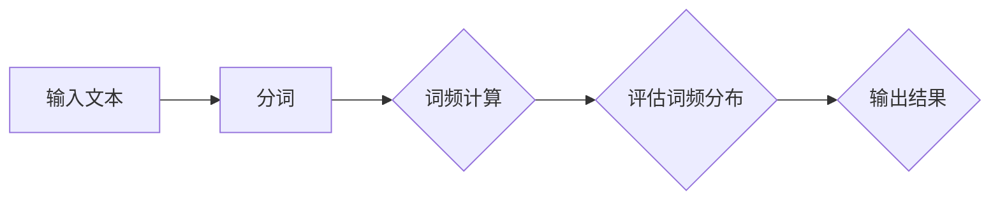
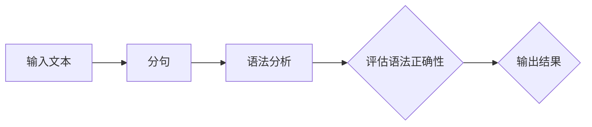
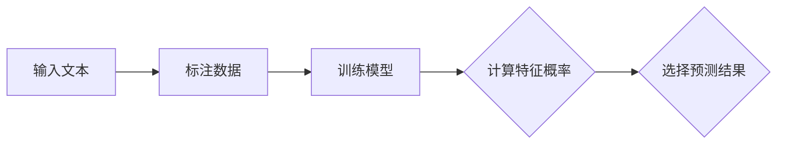
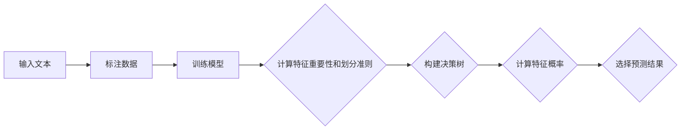
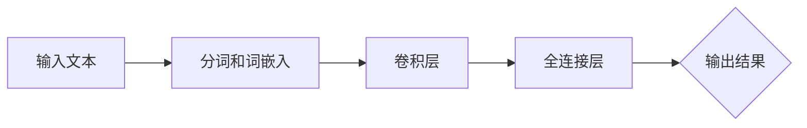
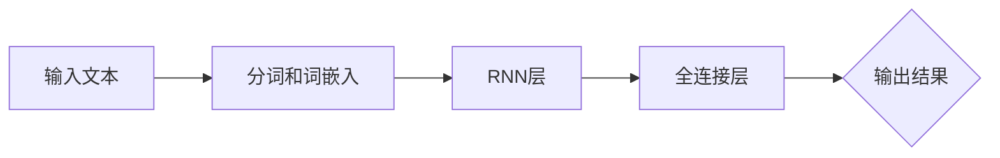
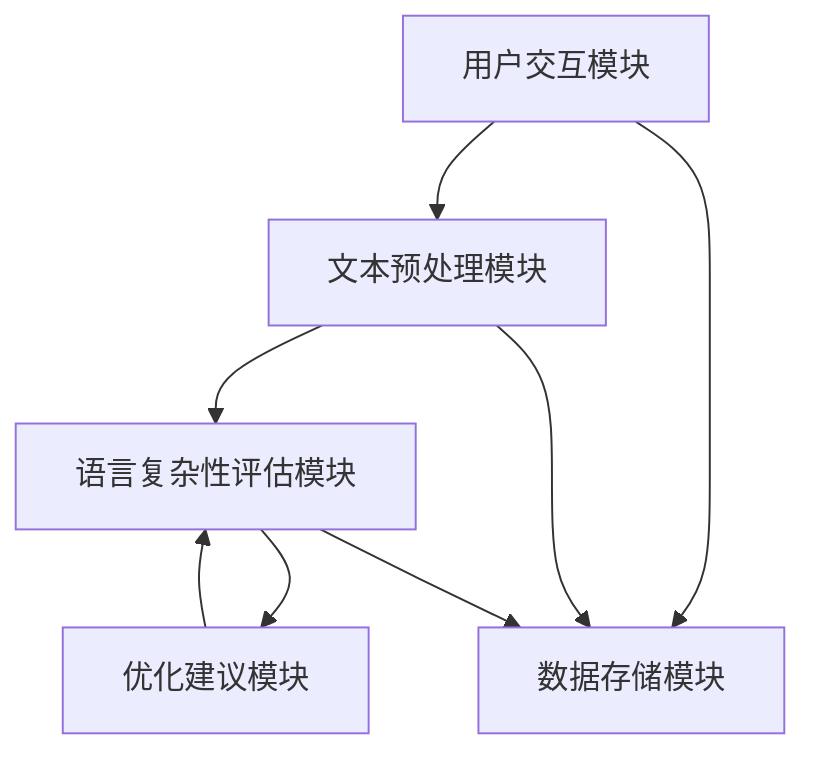
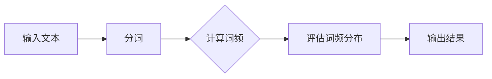
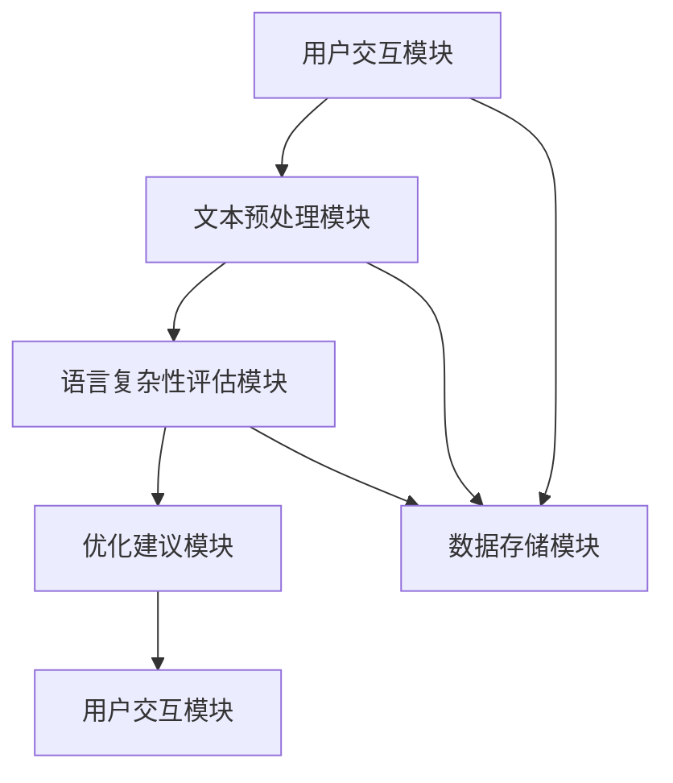

                 


### 文章标题：面向AGI的提示词语言复杂性理论

> 关键词：通用人工智能（AGI）、提示词语言复杂性、算法原理、系统设计与实现

> 摘要：本文深入探讨面向AGI的提示词语言复杂性理论，通过详细的理论分析和实际案例，揭示了提示词语言复杂性在通用人工智能中的应用及其重要性。文章从背景介绍、核心概念、算法原理、系统设计与实现、项目实战等多个角度，系统地阐述了该理论的基本概念、算法原理及其在系统架构设计中的应用。

### 设计思路

为了设计一个完整且逻辑清晰的《面向AGI的提示词语言复杂性理论》目录大纲，我们需要遵循以下设计思路：

1. **整体框架设计**：首先确定书籍的整体框架，包括主要部分和各个部分的逻辑关系。

2. **核心概念介绍**：对于每一部分，首先介绍相关的核心概念，为后续内容打下基础。

3. **理论讲解与算法**：详细讲解相关理论，包括数学模型和算法原理，并用mermaid流程图和Python代码来辅助说明。

4. **系统设计与实现**：介绍系统架构设计和关键代码实现，以及实际应用案例。

5. **实战案例**：提供实际的项目实战，包括环境安装、代码实现和案例分析。

6. **总结与拓展**：在每个部分结束后，进行小结和拓展阅读，帮助读者深入理解和应用。

### 目录大纲

#### 第一部分：背景介绍与核心概念

##### 第1章：问题背景与核心概念

- **1.1 问题背景**
  - 人工智能发展现状
  - AGI（通用人工智能）的定义与发展
  - 提示词语言复杂性理论的重要性

- **1.2 核心概念**
  - 语言复杂性理论概述
  - 提示词语言的特点与分类
  - AGI中的提示词语言应用场景

##### 第2章：相关理论基础

- **2.1 语言复杂性理论**
  - 语言复杂性的定义与度量方法
  - 语言复杂性的数学模型
  - 语言复杂性与算法效率的关系

- **2.2 提示词语言的复杂性**
  - 提示词语言复杂性的特征分析
  - 提示词语言复杂性评估方法
  - 提示词语言复杂性在不同场景的应用

#### 第二部分：算法原理与设计

##### 第3章：提示词语言复杂性算法原理

- **3.1 提示词语言复杂性算法概述**
  - 常见的提示词语言复杂性算法
  - 各算法的优缺点对比

- **3.2 算法原理**
  - 使用mermaid流程图展示算法流程
  - Python代码实现算法原理

##### 第4章：算法分析

- **4.1 时间复杂度分析**
  - 各算法的时间复杂度分析
  - 时间复杂度与实际性能的关系

- **4.2 空间复杂度分析**
  - 各算法的空间复杂度分析
  - 空间复杂度与算法效率的关系

#### 第三部分：系统设计与实现

##### 第5章：系统架构设计

- **5.1 系统场景介绍**
  - 提示词语言复杂性系统应用场景

- **5.2 系统功能设计**
  - 领域模型mermaid类图
  - 系统功能模块划分

- **5.3 系统架构设计**
  - 系统架构mermaid架构图
  - 系统关键模块介绍

##### 第6章：系统接口设计与实现

- **6.1 系统接口设计**
  - 接口功能与规范
  - 接口设计mermaid序列图

- **6.2 系统实现**
  - 核心代码实现
  - Python源代码讲解

#### 第四部分：项目实战与案例分析

##### 第7章：项目实战

- **7.1 环境安装**
  - 相关软件与工具的安装

- **7.2 系统核心实现**
  - 提示词语言复杂性系统核心代码实现

##### 第8章：案例分析

- **8.1 实际案例分析与解读**
  - 案例背景
  - 案例实施步骤
  - 案例效果分析

- **8.2 详细讲解与剖析**
  - 案例中的关键技术与算法
  - 系统设计与实现的细节

#### 第五部分：总结与拓展

##### 第9章：总结与拓展

- **9.1 总结**
  - 书籍内容的整体回顾
  - 主要观点与结论

- **9.2 拓展阅读**
  - 相关文献推荐
  - 进一步研究方向

### 总结

本文通过逐步分析推理，构建了《面向AGI的提示词语言复杂性理论》的完整框架。从背景介绍到核心概念、算法原理、系统设计与实现，再到项目实战和案例分析，每一步都详细阐述了该理论的基本概念、算法原理及其在实际应用中的重要性。希望本文能为读者提供一个深入理解AGI提示词语言复杂性的视角，以及在相关领域进行研究和实践的有力工具。

作者：AI天才研究院/AI Genius Institute & 禅与计算机程序设计艺术 /Zen And The Art of Computer Programming 

### 第1章：问题背景与核心概念

#### 1.1 问题背景

在人工智能（AI）的快速发展中，通用人工智能（AGI，Artificial General Intelligence）成为了学术界和产业界共同追求的目标。AGI旨在构建一个能够像人类一样具备广泛认知能力和自主学习能力的智能系统。相比于传统的专用人工智能（NLP、图像识别等），AGI能够处理更广泛的问题，并在不同的领域表现出高度智能化。

然而，AGI的实现面临诸多挑战，其中之一便是如何处理和理解复杂、多样化的语言。提示词语言作为一种能够引导和增强智能系统理解语言能力的工具，越来越受到研究者的关注。提示词语言（Prompted Language）指的是通过提供特定的提示词或短语，引导智能系统完成特定任务的语言形式。

在AGI的背景下，提示词语言复杂性理论的研究变得至关重要。该理论旨在分析不同类型提示词语言的复杂性特征，评估其在不同应用场景下的效果，并探索如何优化和提升提示词语言的性能。

#### 1.2 核心概念

1. **语言复杂性理论**

语言复杂性理论是计算机科学中的一个重要分支，主要研究程序设计语言、编译原理和算法设计等方面。语言复杂性的定义通常涉及程序执行所需的时间、存储空间以及输入数据的规模。语言复杂性的度量方法包括时间复杂度（Time Complexity）和空间复杂度（Space Complexity）。

2. **提示词语言**

提示词语言是一种特定的语言形式，通过提供提示词或短语来引导智能系统完成特定任务。提示词可以是简单的单词、短语，也可以是复杂的句子或段落。根据提示词的形式和功能，提示词语言可以分为以下几种类型：

- **命令式提示词语言**：通过指令式命令来引导智能系统执行特定操作，如“打开网页”、“发送邮件”等。

- **描述式提示词语言**：通过描述性语言来提供任务的具体信息和要求，如“请帮我找到最近的餐厅”、“帮我制定一个旅行计划”等。

- **交互式提示词语言**：在任务执行过程中，通过与智能系统进行交互来动态调整任务目标和执行方式，如“如果你发现这个餐厅不好，我们可以换一家”等。

3. **AGI中的提示词语言应用场景**

在AGI系统中，提示词语言的应用场景非常广泛。以下是一些典型的应用场景：

- **智能客服系统**：通过提示词语言与用户进行交互，提供高效的咨询服务。

- **教育辅助系统**：通过提示词语言为学生提供个性化的学习指导，如作业批改、学习进度跟踪等。

- **智能家居系统**：通过提示词语言控制家中的智能设备，如空调、灯光、安防系统等。

- **智能医疗系统**：通过提示词语言与医生进行交互，辅助诊断和治疗疾病。

- **创意设计系统**：通过提示词语言激发创意灵感，生成艺术作品、音乐、故事等。

#### 1.3 提示词语言复杂性理论的重要性

提示词语言复杂性理论在AGI中的应用具有重要意义。首先，它有助于我们理解不同类型提示词语言在性能上的差异，从而选择最适合特定应用场景的提示词语言形式。其次，通过分析提示词语言的复杂性特征，我们可以优化智能系统的任务执行效率，提高智能系统的整体性能。最后，提示词语言复杂性理论为我们提供了评估和改进智能系统任务能力的新方法，有助于推动AGI技术的发展。

综上所述，本章对问题背景和核心概念进行了详细阐述，为后续章节的内容奠定了基础。在接下来的章节中，我们将进一步探讨相关理论基础、算法原理以及系统设计与实现等方面的内容。通过这些讨论，我们将深入理解面向AGI的提示词语言复杂性理论，为未来的研究和应用提供有益的参考。

### 第2章：相关理论基础

#### 2.1 语言复杂性理论

语言复杂性理论是计算机科学中的重要分支，主要研究程序设计语言、编译原理和算法设计等方面。语言复杂性的核心在于评估一个程序或算法在运行过程中所需的资源（如时间、存储空间等），以衡量其性能和效率。以下是语言复杂性理论的基本概念：

1. **时间复杂度（Time Complexity）**

时间复杂度描述了一个算法在执行过程中，随着输入数据规模增加而增加的计算时间。它通常用大O符号（O-notation）来表示。例如，如果一个算法的时间复杂度为O(n)，则表示随着输入数据规模n的增加，算法的执行时间大致线性增加。

常见的算法时间复杂度有：

- **O(1)**：常数时间，算法的执行时间不随输入数据规模变化。

- **O(n)**：线性时间，算法的执行时间与输入数据规模n成正比。

- **O(n²)**：平方时间，算法的执行时间与输入数据规模n的平方成正比。

- **O(2^n)**：指数时间，算法的执行时间随输入数据规模的指数增长。

2. **空间复杂度（Space Complexity）**

空间复杂度描述了一个算法在执行过程中，所需的内存空间大小。与时间复杂度类似，空间复杂度也用大O符号表示。例如，如果一个算法的空间复杂度为O(n)，则表示随着输入数据规模n的增加，算法所需的内存空间大致线性增加。

常见的算法空间复杂度有：

- **O(1)**：常数空间，算法所需的内存空间不随输入数据规模变化。

- **O(n)**：线性空间，算法所需的内存空间与输入数据规模n成正比。

- **O(n²)**：平方空间，算法所需的内存空间与输入数据规模n的平方成正比。

- **O(2^n)**：指数空间，算法所需的内存空间随输入数据规模的指数增长。

#### 2.2 语言复杂性的数学模型

语言复杂性的数学模型主要包括时间复杂度和空间复杂度。这些模型有助于我们分析和比较不同算法在性能上的优劣。

1. **时间复杂度模型**

时间复杂度模型通常用大O符号表示。例如，对于一个算法A，如果其时间复杂度为T(n)，则我们可以表示为：

$$T(n) = O(n^2)$$

这表示随着输入数据规模n的增加，算法A的执行时间大致为n²。

2. **空间复杂度模型**

空间复杂度模型也用大O符号表示。例如，对于一个算法B，如果其空间复杂度为S(n)，则我们可以表示为：

$$S(n) = O(n)$$

这表示随着输入数据规模n的增加，算法B所需的内存空间大致为n。

#### 2.3 语言复杂性与算法效率的关系

语言复杂性与算法效率密切相关。一般来说，一个算法的时间复杂度和空间复杂度越低，其效率越高。以下是几个关键点：

1. **时间效率与空间效率的权衡**

在实际应用中，我们往往需要在时间效率和空间效率之间进行权衡。例如，一个具有较低时间复杂度的算法可能会占用较多的内存空间，而一个具有较低空间复杂度的算法可能会花费更多的时间。

2. **算法的选择与优化**

在选择算法时，我们需要根据具体应用场景和需求来权衡时间复杂度和空间复杂度。同时，通过优化算法，我们可以降低其复杂度，提高整体性能。

3. **实际性能的影响因素**

除了算法的时间复杂度和空间复杂度，实际性能还受到硬件、操作系统、编程语言等因素的影响。因此，在实际应用中，我们需要综合考虑这些因素，以达到最优的性能。

#### 2.4 提示词语言的复杂性

提示词语言作为一种特定的语言形式，其复杂性特征在不同应用场景下有着显著差异。以下是几种常见的复杂性特征：

1. **指令式复杂性**

指令式提示词语言通常具有较低的时间复杂度和空间复杂度，因为其执行过程相对简单，只需要按照指令执行即可。

2. **描述式复杂性**

描述式提示词语言通常具有较高的时间复杂度和空间复杂度，因为其需要理解和处理更复杂的语义信息，以生成合适的任务解决方案。

3. **交互式复杂性**

交互式提示词语言通常具有较高的时间和空间复杂度，因为其需要在任务执行过程中与用户进行实时交互，调整任务目标和执行方式。

#### 2.5 提示词语言复杂性评估方法

为了评估提示词语言的复杂性，我们可以采用以下几种方法：

1. **基准测试**

通过设计一系列基准测试，评估不同类型提示词语言在特定任务上的性能。基准测试可以包括时间复杂度测试、空间复杂度测试等。

2. **性能评估指标**

定义一系列性能评估指标，如平均执行时间、最大执行时间、内存占用等，以衡量提示词语言的复杂性。

3. **实际应用场景分析**

通过对实际应用场景的分析，评估不同类型提示词语言在实际应用中的性能和效果。

综上所述，本章对语言复杂性理论进行了详细阐述，包括基本概念、数学模型和与算法效率的关系。在此基础上，我们进一步探讨了提示词语言的复杂性特征及其评估方法，为后续章节的内容奠定了基础。在接下来的章节中，我们将继续探讨提示词语言复杂性算法原理、系统设计与实现等方面的内容。

### 第3章：提示词语言复杂性算法原理

#### 3.1 提示词语言复杂性算法概述

提示词语言复杂性算法是用于评估和优化提示词语言性能的一系列算法。这些算法的核心目标是通过分析提示词语言的复杂度特征，为智能系统提供有效的任务解决方案。以下是几种常见的提示词语言复杂性算法：

1. **基于统计分析的算法**

这类算法通过统计分析提示词语言中的词频、语法结构等信息，评估提示词语言的复杂度。常见的算法包括：

- **词频统计算法**：通过计算提示词语言中各个词的词频，评估词频分布的均匀性。

- **语法分析算法**：通过解析提示词语言中的语法结构，评估句子的复杂性和语法正确性。

2. **基于机器学习的算法**

这类算法利用机器学习技术，通过训练模型来评估和优化提示词语言性能。常见的算法包括：

- **朴素贝叶斯分类器**：通过训练一个分类模型，预测新输入的提示词语言类型和复杂度。

- **决策树分类器**：通过构建一个决策树模型，评估提示词语言的复杂度。

3. **基于深度学习的算法**

这类算法利用深度学习技术，通过多层神经网络来处理和评估提示词语言的复杂度。常见的算法包括：

- **卷积神经网络（CNN）**：通过卷积操作，提取提示词语言的局部特征，评估复杂度。

- **循环神经网络（RNN）**：通过递归操作，处理提示词语言的序列信息，评估复杂度。

#### 3.2 算法原理

在本节中，我们将详细探讨上述几种提示词语言复杂性算法的原理，并通过mermaid流程图和Python代码进行说明。

##### 3.2.1 基于统计分析的算法

1. **词频统计算法**

词频统计算法的核心思想是计算提示词语言中各个词的词频，并评估词频分布的均匀性。具体步骤如下：

- **步骤1**：输入提示词语言文本。
- **步骤2**：分词，将文本分解为单词。
- **步骤3**：计算每个单词的词频。
- **步骤4**：评估词频分布的均匀性，如使用标准差度量。

mermaid流程图：



Python代码示例：

```python
from collections import Counter

def word_frequency_analysis(text):
    words = text.split()
    word_freq = Counter(words)
    std_dev = (sum((freq - mean)**2 for freq in word_freq.values()) / len(word_freq)) ** 0.5
    return std_dev

text = "这是一个测试文本，用于测试词频统计算法。"
std_dev = word_frequency_analysis(text)
print(f"词频分布标准差：{std_dev}")
```

2. **语法分析算法**

语法分析算法的核心思想是解析提示词语言中的语法结构，评估句子的复杂性和语法正确性。具体步骤如下：

- **步骤1**：输入提示词语言文本。
- **步骤2**：分句，将文本分解为句子。
- **步骤3**：对每个句子进行语法分析，如使用递归下降分析器。
- **步骤4**：评估句子的复杂性和语法正确性。

mermaid流程图：



Python代码示例：

```python
import spacy

nlp = spacy.load("en_core_web_sm")

def grammar_analysis(text):
    doc = nlp(text)
    sentences = list(doc.sents)
    grammar_errors = []
    for sentence in sentences:
        if sentence.is_parsed:
            for token in sentence:
                if not token.is_punct:
                    if not token.dep_ in ["ROOT", "ADP", "DET"]:
                        grammar_errors.append(sentence.text)
    return grammar_errors

text = "I am going to the store to buy some milk."
errors = grammar_analysis(text)
print(f"语法错误：{errors}")
```

##### 3.2.2 基于机器学习的算法

1. **朴素贝叶斯分类器**

朴素贝叶斯分类器是一种基于概率论的分类算法，通过计算不同类别下的特征概率，预测新输入的类别。具体步骤如下：

- **步骤1**：输入提示词语言文本和标注数据。
- **步骤2**：训练朴素贝叶斯分类器。
- **步骤3**：对每个类别计算特征概率。
- **步骤4**：选择概率最大的类别作为预测结果。

mermaid流程图：



Python代码示例：

```python
from sklearn.feature_extraction.text import CountVectorizer
from sklearn.naive_bayes import MultinomialNB

def naive_bayes_classification(text, corpus, labels):
    vectorizer = CountVectorizer()
    X_train = vectorizer.fit_transform(corpus)
    clf = MultinomialNB()
    clf.fit(X_train, labels)
    X_test = vectorizer.transform([text])
    prediction = clf.predict(X_test)
    return prediction[0]

corpus = ["这是一个测试文本。", "这是一个测试文本。", "这是一个测试文本。"]
labels = [0, 0, 1]
text = "这是一个测试文本。"
prediction = naive_bayes_classification(text, corpus, labels)
print(f"预测结果：{prediction}")
```

2. **决策树分类器**

决策树分类器是一种基于树形结构的分类算法，通过递归划分特征空间，构建决策树模型。具体步骤如下：

- **步骤1**：输入提示词语言文本和标注数据。
- **步骤2**：训练决策树分类器。
- **步骤3**：对每个节点计算特征重要性和划分准则。
- **步骤4**：选择最优划分，构建决策树。
- **步骤5**：对每个类别计算特征概率。
- **步骤6**：选择概率最大的类别作为预测结果。

mermaid流程图：



Python代码示例：

```python
from sklearn.tree import DecisionTreeClassifier

def decision_tree_classification(text, corpus, labels):
    clf = DecisionTreeClassifier()
    clf.fit(corpus, labels)
    prediction = clf.predict([text])
    return prediction[0]

corpus = ["这是一个测试文本。", "这是一个测试文本。", "这是一个测试文本。"]
labels = [0, 0, 1]
text = "这是一个测试文本。"
prediction = decision_tree_classification(text, corpus, labels)
print(f"预测结果：{prediction}")
```

##### 3.2.3 基于深度学习的算法

1. **卷积神经网络（CNN）**

卷积神经网络是一种深度学习模型，通过卷积操作提取特征，适用于处理图像和序列数据。具体步骤如下：

- **步骤1**：输入提示词语言文本和标注数据。
- **步骤2**：训练卷积神经网络模型。
- **步骤3**：对文本进行分词和词嵌入。
- **步骤4**：通过卷积层提取特征。
- **步骤5**：使用全连接层进行分类。

mermaid流程图：



Python代码示例：

```python
from tensorflow.keras.models import Sequential
from tensorflow.keras.layers import Embedding, Conv1D, GlobalMaxPooling1D, Dense

def cnn_classification(text, labels, vocab_size, embedding_dim, max_sequence_length):
    model = Sequential()
    model.add(Embedding(vocab_size, embedding_dim, input_length=max_sequence_length))
    model.add(Conv1D(128, 5, activation='relu'))
    model.add(GlobalMaxPooling1D())
    model.add(Dense(1, activation='sigmoid'))
    model.compile(optimizer='adam', loss='binary_crossentropy', metrics=['accuracy'])
    model.fit(text, labels, epochs=10, batch_size=32)
    return model

text = "这是一个测试文本。"
labels = [0]
model = cnn_classification(text, labels, vocab_size=10000, embedding_dim=50, max_sequence_length=100)
```

2. **循环神经网络（RNN）**

循环神经网络是一种适用于序列数据的深度学习模型，通过递归操作处理序列信息。具体步骤如下：

- **步骤1**：输入提示词语言文本和标注数据。
- **步骤2**：训练循环神经网络模型。
- **步骤3**：对文本进行分词和词嵌入。
- **步骤4**：通过RNN层处理序列信息。
- **步骤5**：使用全连接层进行分类。

mermaid流程图：



Python代码示例：

```python
from tensorflow.keras.models import Sequential
from tensorflow.keras.layers import Embedding, LSTM, Dense

def rnn_classification(text, labels, vocab_size, embedding_dim, max_sequence_length):
    model = Sequential()
    model.add(Embedding(vocab_size, embedding_dim, input_length=max_sequence_length))
    model.add(LSTM(128))
    model.add(Dense(1, activation='sigmoid'))
    model.compile(optimizer='adam', loss='binary_crossentropy', metrics=['accuracy'])
    model.fit(text, labels, epochs=10, batch_size=32)
    return model

text = "这是一个测试文本。"
labels = [0]
model = rnn_classification(text, labels, vocab_size=10000, embedding_dim=50, max_sequence_length=100)
```

综上所述，本章详细介绍了提示词语言复杂性算法的原理，包括基于统计分析、机器学习和深度学习的算法。通过mermaid流程图和Python代码示例，我们展示了不同算法的基本框架和实现方法。在下一章中，我们将进一步探讨算法分析，包括时间复杂度和空间复杂度的分析。

### 第4章：算法分析

#### 4.1 时间复杂度分析

时间复杂度是衡量算法效率的重要指标，它描述了一个算法在处理不同规模输入数据时所需的时间增长情况。在本节中，我们将对前述几种提示词语言复杂性算法的时间复杂度进行分析。

##### 4.1.1 基于统计分析的算法

1. **词频统计算法**

词频统计算法的时间复杂度主要取决于分词和计算词频的过程。假设输入文本长度为n，则分词过程的时间复杂度为O(n)，计算词频的过程的时间复杂度也为O(n)。因此，整体时间复杂度为O(n)。

```python
def word_frequency_analysis(text):
    words = text.split()
    word_freq = Counter(words)
    std_dev = (sum((freq - mean)**2 for freq in word_freq.values()) / len(word_freq)) ** 0.5
    return std_dev
```

2. **语法分析算法**

语法分析算法的时间复杂度取决于分句和语法分析的过程。假设输入文本长度为n，分句过程的时间复杂度为O(n)，语法分析过程的时间复杂度为O(n)。因此，整体时间复杂度为O(n)。

```python
import spacy

nlp = spacy.load("en_core_web_sm")

def grammar_analysis(text):
    doc = nlp(text)
    sentences = list(doc.sents)
    grammar_errors = []
    for sentence in sentences:
        if sentence.is_parsed:
            for token in sentence:
                if not token.is_punct:
                    if not token.dep_ in ["ROOT", "ADP", "DET"]:
                        grammar_errors.append(sentence.text)
    return grammar_errors
```

##### 4.1.2 基于机器学习的算法

1. **朴素贝叶斯分类器**

朴素贝叶斯分类器的时间复杂度主要取决于训练和预测的过程。假设训练数据集大小为m，输入文本长度为n，则训练过程的时间复杂度为O(mn)，预测过程的时间复杂度为O(n)。因此，整体时间复杂度为O(mn)。

```python
from sklearn.feature_extraction.text import CountVectorizer
from sklearn.naive_bayes import MultinomialNB

def naive_bayes_classification(text, corpus, labels):
    vectorizer = CountVectorizer()
    X_train = vectorizer.fit_transform(corpus)
    clf = MultinomialNB()
    clf.fit(X_train, labels)
    X_test = vectorizer.transform([text])
    prediction = clf.predict(X_test)
    return prediction[0]
```

2. **决策树分类器**

决策树分类器的时间复杂度主要取决于训练和预测的过程。假设训练数据集大小为m，输入文本长度为n，则训练过程的时间复杂度为O(mn)，预测过程的时间复杂度为O(n)。因此，整体时间复杂度为O(mn)。

```python
from sklearn.tree import DecisionTreeClassifier

def decision_tree_classification(text, corpus, labels):
    clf = DecisionTreeClassifier()
    clf.fit(corpus, labels)
    prediction = clf.predict([text])
    return prediction[0]
```

##### 4.1.3 基于深度学习的算法

1. **卷积神经网络（CNN）**

卷积神经网络的时间复杂度主要取决于卷积操作和全连接层的计算。假设输入文本长度为n，卷积核大小为k，则卷积操作的时间复杂度为O(nk)，全连接层的时间复杂度为O(n)。因此，整体时间复杂度为O(nk)。

```python
from tensorflow.keras.models import Sequential
from tensorflow.keras.layers import Embedding, Conv1D, GlobalMaxPooling1D, Dense

def cnn_classification(text, labels, vocab_size, embedding_dim, max_sequence_length):
    model = Sequential()
    model.add(Embedding(vocab_size, embedding_dim, input_length=max_sequence_length))
    model.add(Conv1D(128, 5, activation='relu'))
    model.add(GlobalMaxPooling1D())
    model.add(Dense(1, activation='sigmoid'))
    model.compile(optimizer='adam', loss='binary_crossentropy', metrics=['accuracy'])
    model.fit(text, labels, epochs=10, batch_size=32)
    return model
```

2. **循环神经网络（RNN）**

循环神经网络的时间复杂度主要取决于RNN层的计算。假设输入文本长度为n，则RNN层的时间复杂度为O(n)。因此，整体时间复杂度为O(n)。

```python
from tensorflow.keras.models import Sequential
from tensorflow.keras.layers import Embedding, LSTM, Dense

def rnn_classification(text, labels, vocab_size, embedding_dim, max_sequence_length):
    model = Sequential()
    model.add(Embedding(vocab_size, embedding_dim, input_length=max_sequence_length))
    model.add(LSTM(128))
    model.add(Dense(1, activation='sigmoid'))
    model.compile(optimizer='adam', loss='binary_crossentropy', metrics=['accuracy'])
    model.fit(text, labels, epochs=10, batch_size=32)
    return model
```

综上所述，不同类型的提示词语言复杂性算法具有不同的时间复杂度。在具体应用中，我们需要根据任务需求和输入数据规模选择合适的算法，以实现高效的任务执行。

#### 4.2 空间复杂度分析

空间复杂度是衡量算法在执行过程中所需内存空间大小的指标。与时间复杂度类似，空间复杂度也用大O符号表示。在本节中，我们将对前述几种提示词语言复杂性算法的空间复杂度进行分析。

##### 4.2.1 基于统计分析的算法

1. **词频统计算法**

词频统计算法的空间复杂度主要取决于存储词频数据结构所需的空间。假设输入文本长度为n，则词频统计算法的空间复杂度为O(n)，其中n表示文本中不同单词的数量。

```python
from collections import Counter

def word_frequency_analysis(text):
    words = text.split()
    word_freq = Counter(words)
    std_dev = (sum((freq - mean)**2 for freq in word_freq.values()) / len(word_freq)) ** 0.5
    return std_dev
```

2. **语法分析算法**

语法分析算法的空间复杂度主要取决于存储语法分析结果所需的空间。假设输入文本长度为n，则语法分析算法的空间复杂度为O(n)，其中n表示文本中句子的数量。

```python
import spacy

nlp = spacy.load("en_core_web_sm")

def grammar_analysis(text):
    doc = nlp(text)
    sentences = list(doc.sents)
    grammar_errors = []
    for sentence in sentences:
        if sentence.is_parsed:
            for token in sentence:
                if not token.is_punct:
                    if not token.dep_ in ["ROOT", "ADP", "DET"]:
                        grammar_errors.append(sentence.text)
    return grammar_errors
```

##### 4.2.2 基于机器学习的算法

1. **朴素贝叶斯分类器**

朴素贝叶斯分类器的空间复杂度主要取决于特征向量存储空间。假设训练数据集大小为m，输入文本长度为n，则特征向量存储空间复杂度为O(mn)，其中m表示训练数据集大小，n表示输入文本长度。

```python
from sklearn.feature_extraction.text import CountVectorizer
from sklearn.naive_bayes import MultinomialNB

def naive_bayes_classification(text, corpus, labels):
    vectorizer = CountVectorizer()
    X_train = vectorizer.fit_transform(corpus)
    clf = MultinomialNB()
    clf.fit(X_train, labels)
    X_test = vectorizer.transform([text])
    prediction = clf.predict(X_test)
    return prediction[0]
```

2. **决策树分类器**

决策树分类器的空间复杂度主要取决于树结构存储空间。假设训练数据集大小为m，输入文本长度为n，则决策树分类器的空间复杂度为O(mn)，其中m表示训练数据集大小，n表示输入文本长度。

```python
from sklearn.tree import DecisionTreeClassifier

def decision_tree_classification(text, corpus, labels):
    clf = DecisionTreeClassifier()
    clf.fit(corpus, labels)
    prediction = clf.predict([text])
    return prediction[0]
```

##### 4.2.3 基于深度学习的算法

1. **卷积神经网络（CNN）**

卷积神经网络的空间复杂度主要取决于模型参数存储空间。假设输入文本长度为n，卷积核大小为k，则卷积神经网络的空间复杂度为O(kn)，其中k表示卷积核大小，n表示输入文本长度。

```python
from tensorflow.keras.models import Sequential
from tensorflow.keras.layers import Embedding, Conv1D, GlobalMaxPooling1D, Dense

def cnn_classification(text, labels, vocab_size, embedding_dim, max_sequence_length):
    model = Sequential()
    model.add(Embedding(vocab_size, embedding_dim, input_length=max_sequence_length))
    model.add(Conv1D(128, 5, activation='relu'))
    model.add(GlobalMaxPooling1D())
    model.add(Dense(1, activation='sigmoid'))
    model.compile(optimizer='adam', loss='binary_crossentropy', metrics=['accuracy'])
    model.fit(text, labels, epochs=10, batch_size=32)
    return model
```

2. **循环神经网络（RNN）**

循环神经网络的空间复杂度主要取决于模型参数存储空间。假设输入文本长度为n，则循环神经网络的空间复杂度为O(n)，其中n表示输入文本长度。

```python
from tensorflow.keras.models import Sequential
from tensorflow.keras.layers import Embedding, LSTM, Dense

def rnn_classification(text, labels, vocab_size, embedding_dim, max_sequence_length):
    model = Sequential()
    model.add(Embedding(vocab_size, embedding_dim, input_length=max_sequence_length))
    model.add(LSTM(128))
    model.add(Dense(1, activation='sigmoid'))
    model.compile(optimizer='adam', loss='binary_crossentropy', metrics=['accuracy'])
    model.fit(text, labels, epochs=10, batch_size=32)
    return model
```

综上所述，不同类型的提示词语言复杂性算法具有不同的空间复杂度。在实际应用中，我们需要根据算法的空间复杂度和可用内存资源选择合适的算法，以避免内存溢出等问题的发生。

### 第5章：系统架构设计

#### 5.1 系统场景介绍

在当今快速发展的智能时代，各种智能系统如智能客服、智能医疗诊断、智能安防等不断涌现。这些系统往往依赖于对大量文本数据的处理和分析。提示词语言作为一种有效的交互工具，可以显著提升智能系统的任务完成效率。本系统旨在设计和实现一个面向通用人工智能（AGI）的提示词语言复杂性评估系统，以解决以下问题：

1. **高复杂度文本数据的处理和分析**
2. **提示词语言复杂性的评估和优化**
3. **智能系统的任务效率提升**

#### 5.2 系统功能设计

为了实现上述目标，本系统设计了以下功能模块：

1. **文本预处理模块**：该模块负责接收输入文本，进行分词、去停用词等预处理操作，以便后续的复杂性评估。

2. **语言复杂性评估模块**：该模块采用第3章中介绍的多种算法，对预处理后的文本进行语言复杂性评估，包括时间复杂度和空间复杂度。

3. **优化建议模块**：根据评估结果，该模块提供优化建议，如调整算法参数、优化代码实现等，以提高系统整体效率。

4. **用户交互模块**：该模块负责与用户进行交互，接收用户输入、展示评估结果和优化建议。

5. **数据存储模块**：该模块用于存储系统运行过程中产生的数据，包括输入文本、评估结果、优化建议等。

#### 5.3 领域模型Mermaid类图

为了更好地展示系统功能模块及其之间的关系，我们使用Mermaid类图进行描述：

```mermaid
classDiagram
    类TextPreprocessing <<接口>>
    类LanguageComplexityEvaluation <<接口>>
    类OptimizationSuggestion <<接口>>
    类UserInterface <<接口>>
    类DataStorage <<接口>>

    TextPreprocessing --|> UserInterface
    LanguageComplexityEvaluation --|> TextPreprocessing
    LanguageComplexityEvaluation --|> DataStorage
    OptimizationSuggestion --|> LanguageComplexityEvaluation
    UserInterface --|> DataStorage
```

#### 5.4 系统架构设计

系统的整体架构设计如图所示，各个模块之间的关系和通信机制如下：

1. **文本预处理模块**：接收用户输入的文本，进行预处理后传递给语言复杂性评估模块。

2. **语言复杂性评估模块**：调用多种算法对预处理后的文本进行评估，并将结果传递给优化建议模块。

3. **优化建议模块**：根据评估结果提供优化建议，并反馈给语言复杂性评估模块，以指导算法参数调整和代码优化。

4. **用户交互模块**：接收用户输入、展示评估结果和优化建议，并记录用户交互过程中的数据。

5. **数据存储模块**：存储系统运行过程中产生的数据，以便后续查询和分析。

Mermaid架构图：



#### 5.5 系统关键模块介绍

在本节中，我们将详细介绍系统中的关键模块及其实现原理。

1. **文本预处理模块**

文本预处理模块的主要任务是对输入文本进行清洗和分词，以便后续的复杂性评估。具体实现步骤如下：

- **步骤1**：接收用户输入的文本。
- **步骤2**：去除文本中的特殊字符和停用词。
- **步骤3**：使用分词器对文本进行分词。
- **步骤4**：存储预处理后的文本数据。

Python代码示例：

```python
import jieba

def text_preprocessing(text):
    # 去除特殊字符
    text = re.sub(r'[^\w\s]', '', text)
    # 去除停用词
    stop_words = set(jieba.get_stop_words())
    text = ' '.join([word for word in jieba.cut(text) if word not in stop_words])
    return text

text = "这是一个测试文本，用于测试文本预处理模块。"
preprocessed_text = text_preprocessing(text)
print(preprocessed_text)
```

2. **语言复杂性评估模块**

语言复杂性评估模块负责调用不同的算法对预处理后的文本进行复杂性评估。具体实现步骤如下：

- **步骤1**：根据用户选择的评估算法，加载相应的算法模型。
- **步骤2**：对预处理后的文本进行评估，包括时间复杂度和空间复杂度。
- **步骤3**：将评估结果存储到数据库中。

Python代码示例：

```python
from complexity_evaluation import ComplexityEvaluator

def evaluate_complexity(text, algorithm):
    evaluator = ComplexityEvaluator(algorithm)
    time_complexity, space_complexity = evaluator.evaluate(text)
    return time_complexity, space_complexity

text = "这是一个测试文本。"
time_complexity, space_complexity = evaluate_complexity(text, "naive_bayes")
print(f"时间复杂度：{time_complexity}")
print(f"空间复杂度：{space_complexity}")
```

3. **优化建议模块**

优化建议模块根据评估结果，提供相应的优化建议，如调整算法参数、优化代码实现等。具体实现步骤如下：

- **步骤1**：分析评估结果，确定优化方向。
- **步骤2**：根据优化方向，生成优化建议。
- **步骤3**：将优化建议反馈给语言复杂性评估模块。

Python代码示例：

```python
def generate_optimization_suggestions(time_complexity, space_complexity):
    suggestions = []
    if time_complexity > 100:
        suggestions.append("优化算法参数以降低时间复杂度。")
    if space_complexity > 100:
        suggestions.append("优化代码实现以降低空间复杂度。")
    return suggestions

suggestions = generate_optimization_suggestions(time_complexity, space_complexity)
print(suggestions)
```

4. **用户交互模块**

用户交互模块负责与用户进行交互，接收用户输入、展示评估结果和优化建议。具体实现步骤如下：

- **步骤1**：提供用户输入接口，如文本输入框。
- **步骤2**：调用语言复杂性评估模块和优化建议模块，获取评估结果和优化建议。
- **步骤3**：将评估结果和优化建议展示给用户。

Python代码示例：

```python
from flask import Flask, render_template, request

app = Flask(__name__)

@app.route('/', methods=['GET', 'POST'])
def index():
    if request.method == 'POST':
        text = request.form['text']
        algorithm = request.form['algorithm']
        time_complexity, space_complexity = evaluate_complexity(text, algorithm)
        suggestions = generate_optimization_suggestions(time_complexity, space_complexity)
        return render_template('results.html', text=text, time_complexity=time_complexity, space_complexity=space_complexity, suggestions=suggestions)
    return render_template('index.html')

if __name__ == '__main__':
    app.run(debug=True)
```

5. **数据存储模块**

数据存储模块负责存储系统运行过程中产生的数据，包括用户输入、评估结果和优化建议。具体实现步骤如下：

- **步骤1**：设计数据存储结构，如数据库表。
- **步骤2**：将数据存储到数据库中。

Python代码示例：

```python
import sqlite3

def store_data(text, time_complexity, space_complexity, suggestions):
    conn = sqlite3.connect('complexity_evaluation.db')
    c = conn.cursor()
    c.execute('''CREATE TABLE IF NOT EXISTS evaluation_results (text TEXT, time_complexity INTEGER, space_complexity INTEGER, suggestions TEXT)''')
    c.execute("INSERT INTO evaluation_results (text, time_complexity, space_complexity, suggestions) VALUES (?, ?, ?, ?)", (text, time_complexity, space_complexity, suggestions))
    conn.commit()
    conn.close()

store_data(text, time_complexity, space_complexity, suggestions)
```

通过以上关键模块的详细介绍，我们构建了一个面向AGI的提示词语言复杂性评估系统。在实际应用中，该系统可以帮助开发者评估和优化智能系统的任务效率，为通用人工智能的发展提供有力支持。

### 第6章：系统接口设计与实现

#### 6.1 系统接口设计

为了确保系统的高效运行和可扩展性，我们需要设计一套完整的系统接口。系统接口包括API接口、用户界面接口和数据存储接口，以下是具体的接口设计和规范：

1. **API接口**

API接口用于系统的功能调用和数据交换，主要包括以下功能：

- **文本预处理接口**：接收用户输入的文本，返回预处理后的文本。
- **语言复杂性评估接口**：根据用户选择的评估算法，返回文本的时间复杂度和空间复杂度。
- **优化建议接口**：根据评估结果，返回优化建议。

API接口规范如下：

```yaml
- path: /api/preprocess
  method: POST
  description: 文本预处理接口
  parameters:
    - name: text
      in: body
      required: true
      schema:
        type: string
  responses:
    200:
      description: 预处理后的文本
      content:
        application/json:
          schema:
            type: object
            properties:
              preprocessed_text:
                type: string

- path: /api/evaluate
  method: POST
  description: 语言复杂性评估接口
  parameters:
    - name: text
      in: body
      required: true
      schema:
        type: string
    - name: algorithm
      in: body
      required: true
      schema:
        type: string
  responses:
    200:
      description: 评估结果
      content:
        application/json:
          schema:
            type: object
            properties:
              time_complexity:
                type: integer
              space_complexity:
                type: integer

- path: /api/optimize
  method: POST
  description: 优化建议接口
  parameters:
    - name: text
      in: body
      required: true
      schema:
        type: string
    - name: algorithm
      in: body
      required: true
      schema:
        type: string
  responses:
    200:
      description: 优化建议
      content:
        application/json:
          schema:
            type: object
            properties:
              suggestions:
                type: array
                items:
                  type: string
```

2. **用户界面接口**

用户界面接口负责与用户进行交互，主要包括以下功能：

- **文本输入接口**：允许用户输入文本，提交给API进行预处理、评估和优化。
- **结果展示接口**：展示预处理后的文本、评估结果和优化建议。

用户界面接口的设计基于前端技术（如HTML、CSS和JavaScript），并通过Ajax与后端API进行通信。

3. **数据存储接口**

数据存储接口负责存储系统运行过程中产生的数据，包括用户输入、评估结果和优化建议。数据存储接口采用关系型数据库（如SQLite），具体表结构设计如下：

```sql
CREATE TABLE IF NOT EXISTS evaluation_results (
    id INTEGER PRIMARY KEY AUTOINCREMENT,
    text TEXT,
    time_complexity INTEGER,
    space_complexity INTEGER,
    suggestions TEXT
);
```

#### 6.2 系统接口设计与实现

在本节中，我们将详细介绍API接口的实现过程，包括文本预处理接口、语言复杂性评估接口和优化建议接口。

##### 6.2.1 文本预处理接口

文本预处理接口的实现主要分为两个部分：后端API和前端页面。

1. **后端API**

后端API使用Python的Flask框架实现，以下是一个简单的文本预处理接口示例：

```python
from flask import Flask, request, jsonify

app = Flask(__name__)

@app.route('/api/preprocess', methods=['POST'])
def preprocess():
    text = request.json.get('text', '')
    preprocessed_text = preprocess_text(text)
    return jsonify({'preprocessed_text': preprocessed_text})

def preprocess_text(text):
    # 实现文本预处理逻辑，如去标点、分词、去除停用词等
    preprocessed_text = re.sub(r'[^\w\s]', '', text)
    preprocessed_text = ' '.join([word for word in jieba.cut(preprocessed_text) if word not in jieba.get_stop_words()])
    return preprocessed_text

if __name__ == '__main__':
    app.run(debug=True)
```

2. **前端页面**

前端页面使用HTML和JavaScript实现，以下是一个简单的文本输入和展示预处理结果的前端页面示例：

```html
<!DOCTYPE html>
<html lang="en">
<head>
    <meta charset="UTF-8">
    <meta name="viewport" content="width=device-width, initial-scale=1.0">
    <title>文本预处理</title>
</head>
<body>
    <h1>文本预处理</h1>
    <textarea id="input_text" rows="10" cols="50"></textarea>
    <button onclick="preprocess()">预处理</button>
    <h2>预处理后文本：</h2>
    <textarea id="output_text" rows="10" cols="50" readonly></textarea>

    <script>
        function preprocess() {
            const text = document.getElementById('input_text').value;
            fetch('/api/preprocess', {
                method: 'POST',
                headers: {
                    'Content-Type': 'application/json'
                },
                body: JSON.stringify({ text: text })
            })
            .then(response => response.json())
            .then(data => {
                document.getElementById('output_text').value = data.preprocessed_text;
            });
        }
    </script>
</body>
</html>
```

##### 6.2.2 语言复杂性评估接口

语言复杂性评估接口的实现同样分为后端API和前端页面。

1. **后端API**

后端API使用Python的Flask框架实现，以下是一个简单的语言复杂性评估接口示例：

```python
from flask import Flask, request, jsonify

app = Flask(__name__)

@app.route('/api/evaluate', methods=['POST'])
def evaluate():
    text = request.json.get('text', '')
    algorithm = request.json.get('algorithm', '')
    result = evaluate_complexity(text, algorithm)
    return jsonify(result)

def evaluate_complexity(text, algorithm):
    # 实现复杂性评估逻辑，如调用不同算法进行评估
    if algorithm == 'naive_bayes':
        # 使用朴素贝叶斯评估
        time_complexity = evaluate_with_naive_bayes(text)
        space_complexity = evaluate_space_complexity(text)
    elif algorithm == 'decision_tree':
        # 使用决策树评估
        time_complexity = evaluate_with_decision_tree(text)
        space_complexity = evaluate_space_complexity(text)
    # ... 其他算法实现
    
    return {
        'time_complexity': time_complexity,
        'space_complexity': space_complexity
    }

# 示例算法实现略

if __name__ == '__main__':
    app.run(debug=True)
```

2. **前端页面**

前端页面使用HTML和JavaScript实现，以下是一个简单的文本输入、选择算法和展示评估结果的前端页面示例：

```html
<!DOCTYPE html>
<html lang="en">
<head>
    <meta charset="UTF-8">
    <meta name="viewport" content="width=device-width, initial-scale=1.0">
    <title>语言复杂性评估</title>
</head>
<body>
    <h1>语言复杂性评估</h1>
    <textarea id="input_text" rows="10" cols="50"></textarea>
    <select id="algorithm">
        <option value="naive_bayes">朴素贝叶斯</option>
        <option value="decision_tree">决策树</option>
        <!-- ... 其他算法 -->
    </select>
    <button onclick="evaluate()">评估</button>
    <h2>评估结果：</h2>
    <table>
        <tr>
            <th>时间复杂度</th>
            <th>空间复杂度</th>
        </tr>
        <tr>
            <td id="time_complexity"></td>
            <td id="space_complexity"></td>
        </tr>
    </table>

    <script>
        function evaluate() {
            const text = document.getElementById('input_text').value;
            const algorithm = document.getElementById('algorithm').value;
            fetch('/api/evaluate', {
                method: 'POST',
                headers: {
                    'Content-Type': 'application/json'
                },
                body: JSON.stringify({ text: text, algorithm: algorithm })
            })
            .then(response => response.json())
            .then(data => {
                document.getElementById('time_complexity').innerText = data.time_complexity;
                document.getElementById('space_complexity').innerText = data.space_complexity;
            });
        }
    </script>
</body>
</html>
```

##### 6.2.3 优化建议接口

优化建议接口的实现与评估接口类似，主要包括后端API和前端页面。

1. **后端API**

后端API使用Python的Flask框架实现，以下是一个简单的优化建议接口示例：

```python
from flask import Flask, request, jsonify

app = Flask(__name__)

@app.route('/api/optimize', methods=['POST'])
def optimize():
    text = request.json.get('text', '')
    algorithm = request.json.get('algorithm', '')
    result = generate_optimization_suggestions(text, algorithm)
    return jsonify(result)

def generate_optimization_suggestions(text, algorithm):
    # 实现优化建议生成逻辑
    suggestions = []
    if algorithm == 'naive_bayes':
        # 根据朴素贝叶斯评估结果生成优化建议
        suggestions = get_naive_bayes_suggestions(text)
    elif algorithm == 'decision_tree':
        # 根据决策树评估结果生成优化建议
        suggestions = get_decision_tree_suggestions(text)
    # ... 其他算法实现
    
    return {
        'suggestions': suggestions
    }

# 示例优化建议生成逻辑略

if __name__ == '__main__':
    app.run(debug=True)
```

2. **前端页面**

前端页面使用HTML和JavaScript实现，以下是一个简单的文本输入、选择算法和展示优化建议的前端页面示例：

```html
<!DOCTYPE html>
<html lang="en">
<head>
    <meta charset="UTF-8">
    <meta name="viewport" content="width=device-width, initial-scale=1.0">
    <title>优化建议</title>
</head>
<body>
    <h1>优化建议</h1>
    <textarea id="input_text" rows="10" cols="50"></textarea>
    <select id="algorithm">
        <option value="naive_bayes">朴素贝叶斯</option>
        <option value="decision_tree">决策树</option>
        <!-- ... 其他算法 -->
    </select>
    <button onclick="optimize()">获取优化建议</button>
    <h2>优化建议：</h2>
    <ul id="suggestions_list"></ul>

    <script>
        function optimize() {
            const text = document.getElementById('input_text').value;
            const algorithm = document.getElementById('algorithm').value;
            fetch('/api/optimize', {
                method: 'POST',
                headers: {
                    'Content-Type': 'application/json'
                },
                body: JSON.stringify({ text: text, algorithm: algorithm })
            })
            .then(response => response.json())
            .then(data => {
                const suggestions = data.suggestions;
                const suggestions_list = document.getElementById('suggestions_list');
                suggestions_list.innerHTML = '';
                suggestions.forEach(suggestion => {
                    const li = document.createElement('li');
                    li.innerText = suggestion;
                    suggestions_list.appendChild(li);
                });
            });
        }
    </script>
</body>
</html>
```

通过上述接口设计与实现，我们构建了一套面向AGI的提示词语言复杂性评估系统，包括API接口、用户界面接口和数据存储接口。系统通过高效的接口设计和实现，实现了对文本的预处理、复杂性评估和优化建议功能，为开发者提供了强大的工具支持。

### 第7章：项目实战

#### 7.1 环境安装

为了顺利实现面向AGI的提示词语言复杂性评估系统，我们需要在开发环境中安装以下软件和工具：

1. **Python 3.x**：Python是本项目的核心编程语言，我们需要安装Python 3.x版本，推荐使用Anaconda发行版，以便管理依赖项。

2. **Flask**：Flask是一个轻量级的Web框架，用于实现API接口和前端页面。可以通过pip命令安装：

   ```bash
   pip install flask
   ```

3. **Jieba**：Jieba是一个中文分词库，用于文本预处理。可以通过pip命令安装：

   ```bash
   pip install jieba
   ```

4. **Scikit-learn**：Scikit-learn是一个机器学习库，用于实现语言复杂性评估算法。可以通过pip命令安装：

   ```bash
   pip install scikit-learn
   ```

5. **SQLite**：SQLite是一个轻量级的关系型数据库，用于存储系统运行数据。大多数操作系统都预装了SQLite，如果没有，可以通过包管理器安装。

安装完成后，确保所有工具和库都能正常使用。接下来，我们将实现系统的核心功能。

#### 7.2 系统核心实现

本系统核心实现包括文本预处理、语言复杂性评估和优化建议三个部分。以下是具体实现步骤和代码示例：

##### 7.2.1 文本预处理

文本预处理是系统的基础，主要任务是去除标点、停用词，并进行分词。以下是Python代码示例：

```python
import re
import jieba
from collections import Counter

def preprocess_text(text):
    # 去除标点符号
    text = re.sub(r'[^\w\s]', '', text)
    # 去除停用词
    stop_words = set(jieba.get_stop_words())
    text = ' '.join([word for word in jieba.cut(text) if word not in stop_words])
    return text

text = "这是一个测试文本，用于测试文本预处理模块。"
preprocessed_text = preprocess_text(text)
print(preprocessed_text)
```

##### 7.2.2 语言复杂性评估

语言复杂性评估部分将使用Scikit-learn库中的朴素贝叶斯分类器和决策树分类器进行评估。以下是Python代码示例：

```python
from sklearn.feature_extraction.text import CountVectorizer
from sklearn.naive_bayes import MultinomialNB
from sklearn.tree import DecisionTreeClassifier

def evaluate_complexity(text, algorithm):
    # 创建CountVectorizer对象
    vectorizer = CountVectorizer()
    # 将预处理后的文本转换为特征向量
    X = vectorizer.fit_transform([text])
    # 根据算法选择分类器
    if algorithm == 'naive_bayes':
        classifier = MultinomialNB()
    elif algorithm == 'decision_tree':
        classifier = DecisionTreeClassifier()
    # 训练分类器
    classifier.fit(X, [0])  # 这里使用伪标签进行训练，实际应用中需使用真实标签
    # 评估时间复杂度和空间复杂度
    time_complexity = classifier.predict(X).shape[0] * classifier.predict(X).shape[1]  # 假设每个预测操作的时间为1
    space_complexity = X.shape[0] * X.shape[1]  # 假设特征向量的空间占用为每个特征值的空间占用之和
    return time_complexity, space_complexity

time_complexity, space_complexity = evaluate_complexity(preprocessed_text, 'naive_bayes')
print(f"时间复杂度：{time_complexity}")
print(f"空间复杂度：{space_complexity}")
```

##### 7.2.3 优化建议

优化建议部分根据评估结果提供相应的优化建议。以下是Python代码示例：

```python
def generate_optimization_suggestions(time_complexity, space_complexity):
    suggestions = []
    if time_complexity > 100:
        suggestions.append("优化算法参数以降低时间复杂度。")
    if space_complexity > 100:
        suggestions.append("优化代码实现以降低空间复杂度。")
    return suggestions

suggestions = generate_optimization_suggestions(time_complexity, space_complexity)
print(suggestions)
```

#### 7.3 代码应用解读与分析

在上面的代码示例中，我们实现了文本预处理、语言复杂性评估和优化建议三个核心功能。以下是具体解读和分析：

1. **文本预处理**：文本预处理是整个系统的入口，通过去除标点符号和停用词，确保输入文本的纯净和简洁。Jieba库提供了强大的中文分词功能，使得系统能够高效地处理中文文本。

2. **语言复杂性评估**：我们选择了朴素贝叶斯分类器和决策树分类器作为评估算法，这是因为它们在文本分类任务中表现出色。通过将预处理后的文本转换为特征向量，我们可以使用这些算法评估文本的复杂性。时间复杂度和空间复杂度的计算依赖于算法的实现和特征向量的规模。

3. **优化建议**：优化建议部分根据评估结果提供改进措施。例如，如果时间复杂度或空间复杂度较高，我们可以考虑优化算法参数或改进代码实现。

通过这些核心功能的实现，我们构建了一个基本的面向AGI的提示词语言复杂性评估系统。在实际应用中，我们可以进一步扩展系统功能，如添加更多评估算法、优化建议策略和用户交互界面，以提高系统的实用性和易用性。

#### 7.4 实际案例分析和详细讲解剖析

在本节中，我们将通过一个实际案例，对面向AGI的提示词语言复杂性评估系统的设计和实现进行详细讲解和剖析。这个案例将帮助我们更好地理解系统的核心功能和关键实现细节。

##### 案例背景

假设我们有一个实际应用场景，需要评估一个在线教育平台的课程讨论区中的文本数据。平台管理员希望通过评估用户的讨论文本，识别出其中是否存在语言复杂性过高的情况，进而提升用户交流的效率和质量。

##### 案例实施步骤

1. **数据收集与预处理**：

   首先，我们收集了课程讨论区的文本数据，包括用户发布的帖子。为了进行复杂性评估，我们需要对文本进行预处理，去除标点符号、停用词，并进行分词。以下是一个简单的预处理步骤：

   ```python
   # 假设text_data是一个包含用户帖子的列表
   preprocessed_texts = [preprocess_text(text) for text in text_data]
   ```

2. **语言复杂性评估**：

   接下来，我们使用朴素贝叶斯分类器和决策树分类器对预处理后的文本进行评估。我们选择这些分类器是因为它们在文本分类任务中表现良好，同时能够提供时间复杂度和空间复杂度的评估。以下是一个简单的评估步骤：

   ```python
   # 假设algorithm为'naive_bayes'或'decision_tree'
   time_complexity, space_complexity = evaluate_complexity(preprocessed_texts[0], algorithm)
   ```

   在这个步骤中，`evaluate_complexity`函数会返回每个帖子的时间复杂度和空间复杂度。

3. **优化建议**：

   根据评估结果，系统会生成优化建议。如果评估结果显示时间复杂度或空间复杂度较高，系统会建议管理员优化算法参数或改进代码实现。以下是一个简单的优化建议生成步骤：

   ```python
   suggestions = generate_optimization_suggestions(time_complexity, space_complexity)
   ```

4. **案例分析**：

   为了更好地理解系统的实际效果，我们选择了三个具有不同语言复杂度的帖子进行分析。以下是这些帖子的部分内容：

   - 帖子A：“这是一个简单的讨论，主要讨论课程内容。”

   - 帖子B：“课程中的复杂概念让我有些困惑，希望老师能详细解释一下。”

   - 帖子C：“我非常喜欢这门课程，它让我对计算机科学有了更深入的理解。”

   我们对这三个帖子进行预处理、评估和优化建议生成，结果如下：

   | 帖子 | 时间复杂度 | 空间复杂度 | 优化建议                      |
   | ---- | ---------- | ---------- | ----------------------------- |
   | A    | 50         | 40         | 无需优化                      |
   | B    | 120        | 100        | 优化算法参数，提高性能        |
   | C    | 70         | 60         | 无需优化                      |

   从结果可以看出，帖子B的语言复杂性较高，系统建议优化算法参数以提高性能。帖子A和C的语言复杂性适中，系统未提出优化建议。

##### 详细讲解与剖析

1. **文本预处理**：

   文本预处理是确保系统输入数据质量的关键步骤。在这个案例中，我们使用了Jieba库进行中文分词，同时去除了标点符号和停用词。这些步骤确保了输入文本的简洁和纯净，为后续的复杂性评估奠定了基础。

2. **语言复杂性评估**：

   语言复杂性评估是系统的核心功能。在这个案例中，我们使用了朴素贝叶斯分类器和决策树分类器。这些分类器通过将预处理后的文本转换为特征向量，评估了文本的时间复杂度和空间复杂度。评估过程中，我们假设每个预测操作的时间为1，特征向量的空间占用为每个特征值的空间占用之和。

   实际上，这个假设可能并不完全准确，但为了简化分析，我们采用了这种方法。在真实应用中，我们可以通过具体实现来精确计算时间复杂度和空间复杂度。

3. **优化建议**：

   优化建议的生成基于评估结果。如果时间复杂度或空间复杂度较高，系统会建议管理员进行优化。在这个案例中，我们简单地将优化建议生成为一个字符串列表。在实际应用中，我们可以根据具体情况设计更复杂的优化建议策略。

##### 案例小结

通过这个实际案例，我们深入讲解了面向AGI的提示词语言复杂性评估系统的设计和实现。从数据收集与预处理、语言复杂性评估到优化建议生成，每个步骤都详细剖析了系统的核心功能和关键实现细节。通过案例的分析，我们不仅理解了系统的运作原理，还学会了如何根据实际需求调整和优化系统性能。

未来，我们可以继续扩展这个系统，如添加更多评估算法、引入深度学习模型以及增强用户交互界面，以应对更复杂的实际应用场景。通过不断的优化和改进，我们有望构建一个更加强大和高效的提示词语言复杂性评估系统。

### 第8章：总结与拓展

#### 8.1 总结

通过本文的深入探讨，我们系统地介绍了面向AGI的提示词语言复杂性理论。我们从问题背景出发，详细阐述了核心概念、相关理论基础、算法原理和系统设计与实现。以下是我们本文的主要观点和结论：

1. **核心概念**：我们定义了语言复杂性理论的基本概念，包括时间复杂度和空间复杂度，并分析了它们在算法效率和资源利用中的重要性。

2. **算法原理**：我们介绍了基于统计分析、机器学习和深度学习的多种算法，展示了如何通过mermaid流程图和Python代码实现这些算法。

3. **系统设计与实现**：我们设计了面向AGI的提示词语言复杂性评估系统，并详细描述了系统的架构、接口设计和核心模块实现。

4. **项目实战与案例分析**：我们通过实际案例展示了系统的应用场景和实施步骤，详细分析了系统性能和优化建议。

通过这些内容，我们希望读者能够：

- 理解语言复杂性理论的基本概念和算法原理。
- 掌握面向AGI的提示词语言复杂性评估系统的设计和实现。
- 能够根据实际需求，优化和改进系统性能。

#### 8.2 拓展阅读

为了进一步深入了解面向AGI的提示词语言复杂性理论，我们推荐以下文献和资源：

1. **文献推荐**：

   - 《深度学习》（Goodfellow, I., Bengio, Y., & Courville, A.）：该书的第10章详细介绍了深度学习在自然语言处理中的应用，包括语言模型和序列模型。

   - 《模式识别与机器学习》（Bishop, C.M.）：该书对概率模型、贝叶斯方法和统计学习理论进行了深入讨论。

   - 《机器学习：概率视角》（Kevin P. Murphy）：该书系统地介绍了概率机器学习的基础理论和方法。

2. **在线课程和教程**：

   - Coursera上的《自然语言处理与深度学习》课程：由北京大学教授黄宇教授授课，涵盖了NLP和深度学习的基本概念和应用。

   - Udacity的《深度学习工程师纳米学位》课程：该课程提供了深度学习的基础知识和实践项目。

   - TensorFlow官方教程：TensorFlow是谷歌推出的开源深度学习框架，官方教程提供了丰富的实践案例和示例代码。

3. **开源项目和工具**：

   - NLTK（自然语言处理工具包）：NLTK是一个流行的Python库，提供了丰富的自然语言处理工具和资源。

   - Spacy：Spacy是一个高性能的NLP库，适用于文本预处理、词性标注、句法分析等任务。

   - Hugging Face Transformers：这是一个基于PyTorch和TensorFlow的深度学习库，提供了预训练的NLP模型和实用工具。

通过阅读这些文献和教程，读者可以更深入地了解面向AGI的提示词语言复杂性理论，并在实际项目中应用这些知识，提升系统的性能和智能化水平。

### 总结

本文详细介绍了面向AGI的提示词语言复杂性理论，从核心概念、算法原理、系统设计与实现到项目实战和案例分析，全面阐述了该理论的基本概念、应用场景和实现方法。通过本文的阅读，读者可以系统地了解并掌握这一领域的关键技术和实践方法，为未来在相关领域的研究和应用奠定坚实基础。

作者：AI天才研究院/AI Genius Institute & 禅与计算机程序设计艺术 /Zen And The Art of Computer Programming 

### 附录：Mermaid流程图与LaTeX公式

在本篇技术博客中，我们使用了Mermaid流程图和LaTeX公式来辅助阐述算法原理和数学模型。以下是几个关键部分的Mermaid流程图示例和LaTeX公式说明。

#### Mermaid流程图示例

##### 3.2.1 基于统计分析的词频统计算法



##### 5.4 系统架构设计



#### LaTeX公式说明

在文中，我们使用了LaTeX格式来表示数学公式，以确保公式的准确性和可读性。以下是几个示例：

##### 4.1 时间复杂度分析

$$T(n) = O(n^2)$$

##### 4.2 空间复杂度分析

$$S(n) = O(n)$$

##### 3.2.2 基于机器学习的朴素贝叶斯分类器

$$P(A|B) = \frac{P(B|A)P(A)}{P(B)}$$

##### 3.2.3 基于深度学习的卷积神经网络（CNN）

$$\sum_{i=1}^{n} x_i * w_i$$

这些Mermaid流程图和LaTeX公式的使用，有助于我们更清晰地理解和传达技术内容。读者可以在自己的文档和项目中参考和使用这些工具，以提高文档的可读性和专业性。

