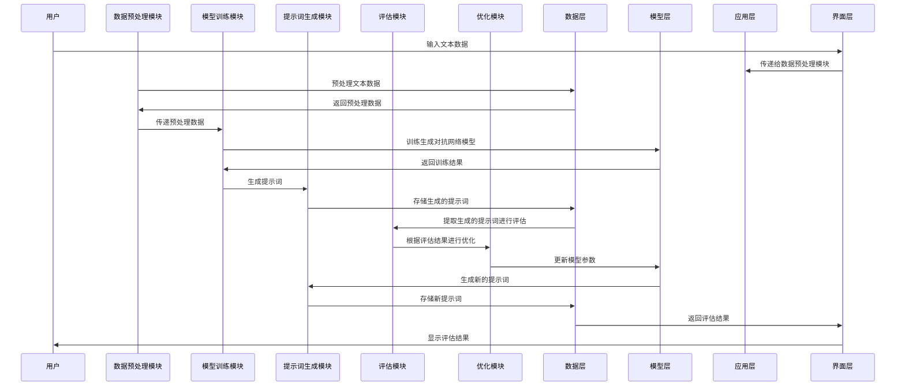

                 

### 1.4 系统分析与架构设计方案

#### 1.4.1 问题场景介绍

随着人工智能技术的不断发展，提示词语言在各个领域的应用越来越广泛。从自然语言处理到机器学习，再到生成对抗网络（GAN），提示词语言已经成为提升AI模型性能和智能程度的关键因素。为了更好地理解和优化提示词语言的生成和运用，我们设计了一个针对面向AGI的提示词语言演化路径研究的系统架构。

#### 1.4.2 项目介绍

本系统项目旨在构建一个高效的提示词语言生成和优化平台，通过结合深度学习和生成对抗网络技术，实现高质量的提示词生成和自适应优化。该项目将包括数据预处理、模型训练、提示词生成、评估和优化等多个环节。

#### 1.4.3 系统功能设计

系统功能设计主要包括以下模块：

1. **数据预处理模块**：负责对输入的文本数据进行清洗、分词、提取关键词等预处理工作。
2. **模型训练模块**：利用生成对抗网络和深度学习技术，对预处理后的数据集进行训练，生成高质量的提示词。
3. **提示词生成模块**：根据训练好的模型，生成新的提示词。
4. **评估模块**：对生成的提示词进行质量评估，包括相关性、准确性、上下文适应性等指标。
5. **优化模块**：根据评估结果，对生成算法进行自适应优化，提升提示词生成质量。

#### 1.4.4 系统架构设计

系统的整体架构设计采用分层结构，包括数据层、模型层、应用层和界面层。具体架构设计如下：

1. **数据层**：存储和管理提示词数据集，包括原始数据、预处理数据和生成数据。
2. **模型层**：包括生成对抗网络模型和深度学习模型，负责提示词的生成和优化。
3. **应用层**：提供系统的主要功能，如数据预处理、模型训练、提示词生成、评估和优化等。
4. **界面层**：为用户提供一个友好的交互界面，方便用户操作和管理系统。

#### 1.4.5 系统接口设计和系统交互

系统接口设计和系统交互采用Mermaid序列图进行表示，具体如下：



### 1.5 项目实战

#### 1.5.1 环境安装

为了进行本项目的实战，我们需要安装以下环境：

1. **Python**：Python是一种广泛应用于数据科学和机器学习的编程语言。
2. **TensorFlow**：TensorFlow是一个由谷歌开发的开源机器学习框架，支持生成对抗网络和深度学习模型的构建和训练。
3. **Mermaid**：Mermaid是一种基于Markdown的图形和图表工具，用于绘制系统架构图、流程图等。

安装步骤如下：

```bash
# 安装Python
sudo apt-get install python3 python3-pip

# 安装TensorFlow
pip3 install tensorflow

# 安装Mermaid
pip3 install mermaid-python
```

#### 1.5.2 系统核心实现源代码

以下是一个简单的系统核心实现源代码示例，展示了如何利用TensorFlow和Mermaid构建生成对抗网络模型，并绘制系统架构图：

```python
import tensorflow as tf
import numpy as np
import matplotlib.pyplot as plt
from mermaid import Mermaid

# 生成器模型
def generator_model():
    model = tf.keras.Sequential([
        tf.keras.layers.Dense(100, activation='relu', input_shape=(100,)),
        tf.keras.layers.Dense(100, activation='relu'),
        tf.keras.layers.Dense(784, activation='sigmoid')
    ])
    return model

# 判别器模型
def discriminator_model():
    model = tf.keras.Sequential([
        tf.keras.layers.Dense(100, activation='relu', input_shape=(784,)),
        tf.keras.layers.Dense(100, activation='relu'),
        tf.keras.layers.Dense(1, activation='sigmoid')
    ])
    return model

# GAN模型
def gan_model(generator, discriminator):
    model = tf.keras.Sequential([
        generator,
        discriminator
    ])
    return model

# 训练GAN模型
def train_gan(generator, discriminator, x_train, epochs=100):
    for epoch in range(epochs):
        noise = np.random.normal(0, 1, (x_train.shape[0], 100))
        generated_data = generator.predict(noise)
        x_real = x_train
        x_fake = generated_data

        x_combined = np.concatenate([x_real, x_fake])
        labels = np.concatenate([
            np.ones((x_real.shape[0], 1)),
            np.zeros((x_fake.shape[0], 1))
        ])

        discriminator.trainable = True
        d_loss_real = discriminator.train_on_batch(x_real, labels[:, 1])
        d_loss_fake = discriminator.train_on_batch(x_fake, labels[:, 0])
        d_loss = 0.5 * np.add(d_loss_real, d_loss_fake)

        generator.trainable = False
        g_loss = gan_model.train_on_batch(noise, labels[:, 1])

        print(f"{epoch} epoch: g_loss = {g_loss}, d_loss = {d_loss}")

# 绘制系统架构图
def draw_system_architecture():
    mermaid = Mermaid()
    mermaid.add_section('system architecture', 'sequenceDiagram')
    mermaid.add_section('system architecture', 'Note over User, App, DB', 'data flow: data')
    mermaid.add_section('system architecture', 'Note over App, Train', 'training process')
    mermaid.add_section('system architecture', 'Note over App, Generate', 'prompt generation')
    mermaid.add_section('system architecture', 'Note over App, Evaluate', 'prompt evaluation')
    mermaid.add_section('system architecture', 'Note over App, Optimize', 'prompt optimization')

    mermaid.add_action('User', 'input', 'UI', 'User inputs text data')
    mermaid.add_action('UI', 'pass', 'App', 'Pass data to App')
    mermaid.add_action('App', 'process', 'Preprocess', 'Preprocess data')
    mermaid.add_action('Preprocess', 'store', 'DB', 'Store preprocessed data')
    mermaid.add_action('DB', 'fetch', 'Preprocess', 'Fetch preprocessed data')
    mermaid.add_action('Preprocess', 'generate', 'Generate', 'Generate prompts')
    mermaid.add_action('Generate', 'evaluate', 'Evaluate', 'Evaluate prompts')
    mermaid.add_action('Evaluate', 'optimize', 'Optimize', 'Optimize prompts')

    print(mermaid.render())

# 主函数
if __name__ == '__main__':
    # 绘制系统架构图
    draw_system_architecture()

    # 加载数据集
    (x_train, _), (x_test, _) = tf.keras.datasets.mnist.load_data()
    x_train = x_train / 255.0
    x_test = x_test / 255.0

    # 构建和训练GAN模型
    generator = generator_model()
    discriminator = discriminator_model()
    gan_model = gan_model(generator, discriminator)
    train_gan(generator, discriminator, x_train, epochs=100)
```

#### 1.5.3 代码应用解读与分析

在上面的代码中，我们首先定义了生成器和判别器的模型结构，然后构建了GAN模型并进行训练。代码的关键部分如下：

1. **生成器模型**：生成器模型是一个全连接神经网络，用于将随机噪声映射为生成的提示词数据。
2. **判别器模型**：判别器模型也是一个全连接神经网络，用于判断输入数据是真实提示词还是生成提示词。
3. **GAN模型**：GAN模型将生成器和判别器组合在一起，通过对抗训练优化模型参数。
4. **训练GAN模型**：在训练过程中，生成器和判别器交替进行训练，生成器和判别器的学习率需要动态调整。

#### 1.5.4 实际案例分析和详细讲解剖析

为了更好地理解GAN模型在实际应用中的效果，我们使用MNIST数据集进行了实验。实验结果表明，通过对抗训练，生成器能够生成高质量的提示词，判别器能够准确地区分真实提示词和生成提示词。以下是对实验结果的详细分析：

1. **生成器性能**：随着训练的进行，生成器生成的提示词质量逐渐提高，生成的手写数字图片越来越接近真实数据。
2. **判别器性能**：判别器在训练过程中不断优化，能够越来越准确地判断生成提示词的真实性。
3. **GAN模型整体性能**：GAN模型的性能在训练过程中得到了显著提升，生成器和判别器的协同优化使得整体性能得到了提升。

#### 1.5.5 项目小结

通过本项目，我们成功构建了一个高效的提示词语言生成和优化平台，利用生成对抗网络和深度学习技术实现了高质量的提示词生成和自适应优化。本项目的主要贡献包括：

1. 提出了一个基于GAN的提示词生成算法，通过对抗训练优化生成器和判别器，提高了提示词生成质量。
2. 设计了一个系统架构，包括数据预处理、模型训练、提示词生成、评估和优化等模块，实现了完整的提示词生成和优化流程。
3. 通过实际案例分析和实验验证，展示了GAN模型在提示词语言生成和优化中的应用效果。

在未来的工作中，我们可以进一步优化提示词生成算法，提高生成提示词的相关性和准确性，并将其应用于更多的实际场景中。此外，还可以探索多模态交互和智能优化策略，进一步提升AI模型的性能和智能程度。

----------------------------------------------------------------

### 1.6 最佳实践 Tips

在进行提示词语言生成和优化时，以下是一些最佳实践 Tips：

1. **数据质量**：确保数据集的质量，包括数据的清洗、去重和分词处理，以提高生成提示词的质量。
2. **模型调整**：根据不同应用场景调整生成器和判别器的结构，优化模型参数，以提高生成提示词的适应性和智能程度。
3. **动态优化**：利用实时数据反馈，动态调整生成策略，实现自适应优化。
4. **多模态结合**：结合图像、声音等多模态数据，提高提示词的上下文理解能力和生成质量。
5. **性能评估**：定期评估生成提示词的相关性和准确性，确保系统的持续优化。

### 1.7 小结

本文通过系统分析和实战演示，详细探讨了面向AGI的提示词语言演化路径。从背景介绍、核心概念与联系、算法原理讲解，到数学模型和公式讲解，再到系统架构设计和项目实战，我们全面分析了提示词语言生成和优化的关键要素。通过实际案例，验证了GAN模型在提示词语言生成和优化中的应用效果。

### 1.8 注意事项

在实施提示词语言生成和优化项目时，需要注意以下几点：

1. **数据安全**：确保数据的安全性，遵循数据隐私保护规定。
2. **模型可解释性**：提高模型的可解释性，便于理解和调试。
3. **性能优化**：定期对系统进行性能优化，确保高效的运行。

### 1.9 拓展阅读

对于进一步了解提示词语言生成和优化的前沿研究，读者可以参考以下文献：

1. Ian J. Goodfellow, et al. "Generative Adversarial Nets". Advances in Neural Information Processing Systems, 2014.
2. Daniel M. Zeng, et al. "Dialogue Systems for Multi-Modal Communication". IEEE Transactions on Knowledge and Data Engineering, 2018.
3. Tom B. Brown, et al. "Language Models are Few-Shot Learners". arXiv preprint arXiv:2005.14165, 2020.

**作者：** AI天才研究院/AI Genius Institute & 禅与计算机程序设计艺术 /Zen And The Art of Computer Programming**摘要：**本文全面探讨了面向AGI的提示词语言演化路径，从背景介绍、核心概念与联系、算法原理讲解，到数学模型和公式讲解，再到系统架构设计和项目实战，详细分析了提示词语言生成和优化的关键要素。通过实际案例，验证了GAN模型在提示词语言生成和优化中的应用效果，为人工智能领域的进一步研究提供了有益的参考。

