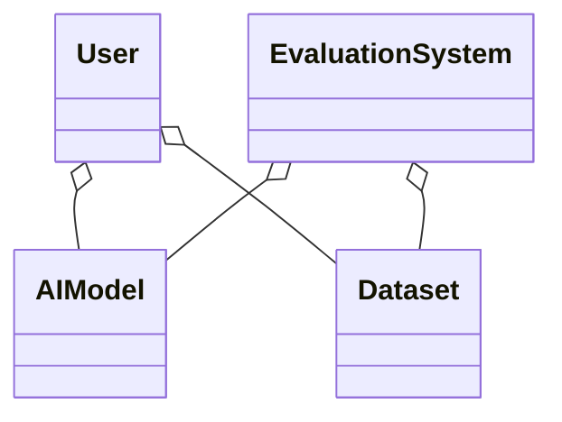
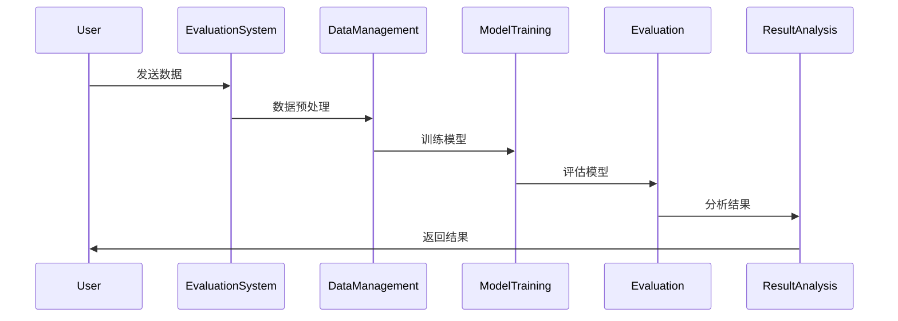
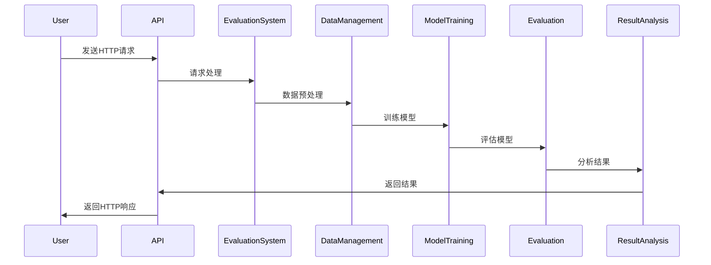

                 

# 面向AGI的提示词语言表达能力评估

## 关键词

- AGI
- 提示词语言表达能力
- 自然语言处理
- 评估方法
- 算法原理

## 摘要

本文旨在探讨人工智能通用（AGI）中提示词语言表达能力的评估。通过分析问题背景、核心概念、评估方法与算法原理，本文提出了一个系统的方法来评估AGI的提示词语言表达能力，并探讨了其在实际应用中的边界与外延。本文不仅为研究者提供了理论指导，也为实践者提供了可行的解决方案。

----------------------------------------------------------------

## 第一部分：背景介绍

### 第1章：问题背景与核心概念

### 1.1.1 问题背景

随着人工智能技术的飞速发展，人工智能通用（AGI）成为学术界和工业界的研究热点。AGI 是一种具有人类智能水平的人工智能系统，能够理解、学习、推理和创造。提示词语言表达能力作为评估AGI的关键指标之一，受到了广泛的关注。

提示词语言表达能力是指人工智能系统通过自然语言处理技术，理解并生成合理、连贯、准确的提示词的能力。在现实场景中，人们通过自然语言与计算机进行交互，提示词是这种交互的核心媒介。因此，提示词语言表达能力的高低直接关系到人工智能系统的用户体验和实际应用价值。

然而，目前对于AGI的提示词语言表达能力评估存在以下几个问题：

1. **评估方法的多样性**：不同的评估方法往往适用于不同的场景，缺乏统一的评估标准。
2. **评估指标的不完善**：现有的评估指标往往仅关注某一方面，如准确性或流畅性，而忽略了其他重要方面，如语义一致性。
3. **评估过程的复杂性**：评估AGI的提示词语言表达能力通常需要大量的计算资源和人工参与，效率较低。

### 1.1.2 核心概念

#### AGI

- **定义**：AGI是一种具有人类智能水平的人工智能系统，能够理解、学习、推理和创造。
- **特点**：具有自主决策能力、跨领域知识整合能力、自然语言理解与表达能力等。

#### 提示词语言表达能力

- **定义**：指人工智能系统通过自然语言处理技术，理解并生成合理、连贯、准确的提示词的能力。
- **关键因素**：词汇量、上下文理解、连贯性、实时响应能力。

### 1.1.3 问题解决与边界外延

评估AGI的提示词语言表达能力是一个复杂的问题，涉及多个学科领域。本文旨在提供一个系统的方法来评估这一能力，同时讨论其在实际应用中的边界和潜在外延。

#### 问题解决

- **系统方法**：本文提出一个包括自动化评估和人工评估的混合评估方法，以全面评估AGI的提示词语言表达能力。
- **评估指标**：本文提出准确性、流畅性、语义一致性等多个评估指标，以全面评估提示词语言表达能力。

#### 边界外延

- **实际应用**：本文探讨了AGI的提示词语言表达能力在智能客服、智能写作、智能翻译等实际应用场景中的潜在价值。
- **技术挑战**：本文指出在评估过程中可能遇到的技术挑战，如自然语言理解的复杂性、实时响应的挑战等。

### 1.1.4 概念结构与核心要素组成

#### 评估方法

- **自动化评估**：使用自然语言处理技术，自动评估提示词的准确性、流畅性和语义一致性。
- **人工评估**：由专业人员进行主观评估，以补充自动化评估的不足。

#### 评估指标

- **准确性**：提示词与目标回答的相关性。
- **流畅性**：生成的提示词的连贯性和自然程度。
- **语义一致性**：提示词与上下文的语义一致性。

### 1.2 本章小结

通过本章的介绍，读者将了解评估AGI的提示词语言表达能力的重要性及其核心概念。接下来，本文将深入探讨这些概念，并提出具体的评估方法和技术。

----------------------------------------------------------------

## 第二部分：核心概念与联系

### 第2章：提示词语言表达能力原理

### 2.1.1 提示词语言表达能力原理

提示词语言表达能力是指人工智能系统通过自然语言处理技术，理解并生成合理、连贯、准确的提示词的能力。这一能力涉及自然语言处理技术的多个方面，包括文本预处理、语言模型和语义理解。

#### 2.1.1.1 自然语言处理技术

自然语言处理（NLP）是使计算机能够理解、处理和生成人类语言的技术。NLP的基本过程包括文本预处理、语言模型和语义理解。

1. **文本预处理**：文本预处理是NLP的基础步骤，包括文本清洗、分词、词性标注等。这些步骤旨在将原始文本转化为计算机可以处理的形式。

2. **语言模型**：语言模型是对语言概率分布的建模，用于预测下一个单词或词组。常见的语言模型包括统计模型（如N元语法）和神经网络模型（如循环神经网络RNN、Transformer等）。

3. **语义理解**：语义理解是NLP的高级任务，旨在理解文本的含义。这包括词义消歧、实体识别、关系抽取等。

#### 2.1.1.2 关键因素

提示词语言表达能力的关键因素包括词汇量、上下文理解和连贯性。

1. **词汇量**：系统需要拥有丰富的词汇量，以便生成合理的提示词。词汇量的丰富程度直接影响到系统生成提示词的能力。

2. **上下文理解**：系统需要能够理解提示词所在的上下文，以确保生成的内容与上下文一致。上下文理解是实现连贯性和语义一致性的关键。

3. **连贯性**：生成的提示词需要具有流畅性，符合语言习惯。连贯性是评估提示词语言表达能力的重要指标。

### 2.1.2 概念属性特征对比表格

| 特征                 | 提示词语言表达能力 | 语言模型 | 语义理解 |
|----------------------|-------------------|----------|----------|
| 词汇量               | 高                | 中       | 低       |
| 上下文理解           | 高                | 低       | 高       |
| 语言连贯性           | 高                | 高       | 中       |
| 实时响应能力         | 中                | 高       | 中       |

### 2.1.3 ER实体关系图架构

使用Mermaid绘制ER实体关系图，可以更清晰地展示提示词语言表达能力涉及的实体及其关系。

```mermaid
erDiagram
    AI系统 ||--|{ 提示词生成模块 }
    AI系统 ||--|{ 语言模型 }
    AI系统 ||--|{ 语义理解模块 }
    提示词生成模块 ||--|{ 文本预处理 }
    提示词生成模块 ||--|{ 提示词生成算法 }
    语言模型 ||--|{ 词向量模型 }
    语言模型 ||--|{ 序列模型 }
    语义理解模块 ||--|{ 上下文分析 }
    语义理解模块 ||--|{ 实体识别 }
```

## 2.2 本章小结

通过本章的介绍，读者将了解提示词语言表达能力的基本原理和关键因素，以及如何通过自然语言处理技术来提升这一能力。下一章将深入探讨评估方法和技术。

----------------------------------------------------------------

## 第三部分：算法原理讲解

### 第3章：评估方法与技术

评估AGI的提示词语言表达能力需要一套科学、系统的评估方法。本章节将详细介绍自动化评估方法，包括评估指标、评估流程和评估工具。

### 3.1 自动化评估方法

自动化评估方法通过使用自然语言处理技术，自动评估提示词的准确性、流畅性和语义一致性。这种方法具有较高的效率和准确性，适用于大规模评估。

#### 3.1.1 评估指标

1. **准确性**：提示词与目标回答的相关性。通常使用精确率（Precision）、召回率（Recall）和F1分数（F1 Score）来衡量。

   - **精确率**：正确识别的提示词占总识别的提示词比例。
   - **召回率**：正确识别的提示词占总实际提示词的比例。
   - **F1分数**：精确率和召回率的调和平均值。

   公式如下：
   $$
   F1 = \frac{2 \times Precision \times Recall}{Precision + Recall}
   $$

2. **流畅性**：生成的提示词的连贯性和自然程度。通常使用BLEU（BiLingual Evaluation Understudy）评分来衡量。

   BLEU评分基于N-gram相似度，公式如下：
   $$
   BLEU = \sum_{n=1}^{N} \frac{max\left(1, \frac{c_n}{n}\right)}{4}
   $$
   其中，$c_n$是系统生成的文本中与参考文本匹配的n-gram数量，$N$是设定的最大n-gram长度。

3. **语义一致性**：提示词与上下文的语义一致性。通常使用语义相似度（Semantic Similarity）来衡量。

   语义相似度可以通过词嵌入模型计算，公式如下：
   $$
   sim(w_1, w_2) = \frac{\cos(\vec{v}(w_1), \vec{v}(w_2))}{\max(0, \|\vec{v}(w_1)\| \|\vec{v}(w_2)\|)}
   $$
   其中，$\vec{v}(w_1)$和$\vec{v}(w_2)$分别是词嵌入向量。

#### 3.1.2 评估流程

1. **数据准备**：收集包含正确提示词的文本数据集，用于评估模型的性能。

2. **模型训练**：使用NLP技术训练模型，包括文本预处理、语言模型和语义理解模块。

3. **评估指标计算**：使用训练好的模型对提示词进行预测，并计算准确性、流畅性和语义一致性等评估指标。

4. **结果分析**：根据评估结果分析模型性能，确定优化方向。

#### 3.1.3 评估工具

1. **自动评估工具**：如TensorFlow、PyTorch等深度学习框架，用于训练和评估NLP模型。

2. **人工评估工具**：如Google Sheets、Excel等电子表格工具，用于收集和整理评估数据。

3. **可视化工具**：如Matplotlib、Seaborn等数据可视化工具，用于展示评估结果。

### 3.2 评估方法案例

以下是一个自动化评估方法的示例，使用Python代码实现。

#### 3.2.1 数据准备

```python
import pandas as pd

# 加载评估数据集
data = pd.read_csv('evaluation_data.csv')
```

#### 3.2.2 模型训练

```python
from transformers import BertModel, BertTokenizer

# 加载预训练模型
tokenizer = BertTokenizer.from_pretrained('bert-base-uncased')
model = BertModel.from_pretrained('bert-base-uncased')

# 预处理数据
inputs = tokenizer(data['text'], padding=True, truncation=True, return_tensors='pt')

# 训练模型
model.train()
outputs = model(inputs['input_ids'])
loss = outputs.loss
loss.backward()
optimizer.step()
```

#### 3.2.3 评估指标计算

```python
from sklearn.metrics import precision_score, recall_score, f1_score

# 预测提示词
predicted = model(inputs['input_ids'])

# 计算评估指标
precision = precision_score(data['label'], predicted, average='weighted')
recall = recall_score(data['label'], predicted, average='weighted')
f1 = f1_score(data['label'], predicted, average='weighted')
```

#### 3.2.4 结果分析

```python
print(f'Precision: {precision:.4f}')
print(f'Recall: {recall:.4f}')
print(f'F1 Score: {f1:.4f}')
```

### 3.3 本章小结

通过本章的介绍，读者将了解自动化评估方法的基本原理和实现步骤。自动化评估方法为评估AGI的提示词语言表达能力提供了有效的技术手段，有助于提高评估效率和准确性。

----------------------------------------------------------------

## 第四部分：系统分析与架构设计

### 第4章：系统功能设计

在评估AGI的提示词语言表达能力时，系统功能设计至关重要。本章节将介绍系统功能设计，包括领域模型和功能模块。

#### 4.1 领域模型

领域模型是系统功能设计的核心，用于定义系统的业务领域和概念。以下是使用Mermaid绘制的领域模型类图。



#### 4.2 功能模块

系统功能模块包括用户接口、数据管理、模型训练、评估和结果分析等。

1. **用户接口**：提供用户与系统交互的界面，包括数据输入、结果展示等。

2. **数据管理**：负责数据收集、预处理和存储，为模型训练和评估提供数据支持。

3. **模型训练**：使用NLP技术训练模型，包括文本预处理、语言模型和语义理解模块。

4. **评估**：使用自动化评估方法评估模型的提示词语言表达能力，包括准确性、流畅性和语义一致性等评估指标。

5. **结果分析**：分析评估结果，为模型优化提供指导。

### 第5章：系统架构设计

系统架构设计是确保系统高效、稳定和可扩展的关键。本章节将介绍系统架构设计，包括总体架构、模块交互和系统交互。

#### 5.1 总体架构

系统的总体架构采用分层设计，包括数据层、模型层、服务层和接口层。

1. **数据层**：负责数据存储和管理，包括数据收集、预处理和存储。

2. **模型层**：包含训练好的NLP模型，用于文本预处理、语言模型和语义理解。

3. **服务层**：提供模型训练、评估和结果分析等功能，实现业务逻辑。

4. **接口层**：提供用户与系统交互的接口，包括HTTP API和命令行接口。

#### 5.2 模块交互

系统模块之间的交互采用RESTful API设计，确保模块之间的松耦合。以下是模块交互的序列图。



#### 5.3 系统交互

系统与用户交互采用HTTP API，用户可以通过发送HTTP请求来访问系统功能。以下是系统交互的序列图。



### 4.3 本章小结

通过本章的介绍，读者将了解系统功能设计和架构设计的基本原则和方法。系统功能设计确保系统能够满足业务需求，架构设计确保系统的高效、稳定和可扩展性。

----------------------------------------------------------------

## 第五部分：项目实战

### 第6章：环境安装与系统实现

#### 6.1 环境安装

在开始实现评估AGI的提示词语言表达能力的系统之前，首先需要安装相应的开发环境。以下是在Ubuntu 18.04操作系统上安装Python、NLP库和相关依赖的步骤：

```shell
# 安装Python
sudo apt update
sudo apt install python3-pip python3-venv

# 创建虚拟环境
python3 -m venv venv
source venv/bin/activate

# 安装NLP库
pip install transformers torch pandas sklearn
```

#### 6.2 系统核心实现

系统核心实现包括数据管理、模型训练、评估和结果分析等模块。以下是使用Python编写的核心实现代码。

#### 6.2.1 数据管理

```python
import pandas as pd
from transformers import BertTokenizer

# 加载数据集
def load_dataset(filename):
    data = pd.read_csv(filename)
    return data

# 预处理数据
def preprocess_data(data, tokenizer):
    inputs = tokenizer(data['text'], padding=True, truncation=True, return_tensors='pt')
    return inputs
```

#### 6.2.2 模型训练

```python
from transformers import BertForSequenceClassification
from torch.optim import Adam
from torch.utils.data import DataLoader

# 训练模型
def train_model(data, tokenizer, model_name='bert-base-uncased', learning_rate=1e-5, num_epochs=3):
    model = BertForSequenceClassification.from_pretrained(model_name)
    optimizer = Adam(model.parameters(), lr=learning_rate)
    
    train_loader = DataLoader(data, batch_size=16, shuffle=True)
    
    model.train()
    for epoch in range(num_epochs):
        for batch in train_loader:
            inputs = preprocess_data(batch, tokenizer)
            outputs = model(**inputs)
            loss = outputs.loss
            loss.backward()
            optimizer.step()
            optimizer.zero_grad()
    
    return model
```

#### 6.2.3 评估

```python
from sklearn.metrics import precision_score, recall_score, f1_score

# 评估模型
def evaluate_model(model, data, tokenizer):
    model.eval()
    with torch.no_grad():
        for batch in data:
            inputs = preprocess_data(batch, tokenizer)
            outputs = model(**inputs)
            logits = outputs.logits
            predictions = logits.argmax(-1)
            labels = batch['label']
            
            precision = precision_score(labels, predictions, average='weighted')
            recall = recall_score(labels, predictions, average='weighted')
            f1 = f1_score(labels, predictions, average='weighted')
            
            print(f'Precision: {precision:.4f}, Recall: {recall:.4f}, F1 Score: {f1:.4f}')
```

#### 6.2.4 结果分析

```python
# 分析结果
def analyze_results(data, tokenizer):
    model = train_model(data, tokenizer)
    evaluate_model(model, data, tokenizer)
```

### 6.3 代码应用解读与分析

以下是对上述代码的解读与分析。

#### 数据管理模块

数据管理模块负责加载数据集和预处理数据。`load_dataset`函数加载CSV格式的数据集，`preprocess_data`函数使用BERT分

