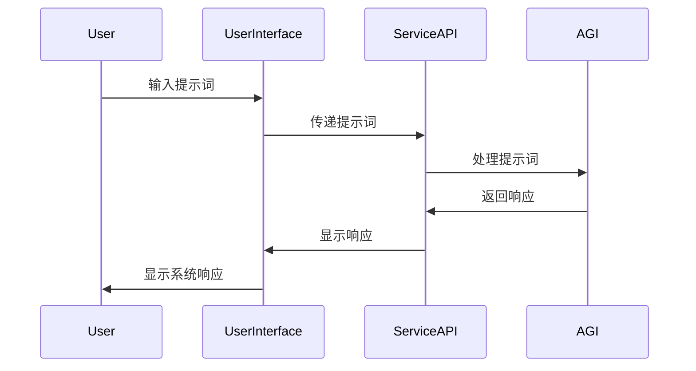

                 

### 面向AGI的提示词语言进化路径

#### 关键词：
- **人工智能**（AGI）
- **提示词语言**
- **自然语言处理**
- **语言进化**
- **交互设计**
- **系统架构**

#### 摘要：
本文旨在探讨面向强人工智能（AGI）的提示词语言进化路径。通过对当前人工智能发展背景的介绍，文章将深入分析提示词语言的核心概念、属性特征，并借助实体关系图（ER图）和算法流程图，解析其内部原理。进一步，文章将探讨系统架构设计，包括问题场景、项目目标和系统功能设计。最后，通过实际项目实战，对提示词语言在AGI系统中的应用进行剖析，总结最佳实践和注意事项。

## 第一部分：背景介绍

### 1.1 问题背景

随着人工智能技术的快速发展，特别是强人工智能（AGI）的崛起，如何与AGI系统进行有效的交互成为一个亟待解决的问题。传统的编程语言和命令行交互方式在复杂性和灵活性上存在诸多不足，无法充分满足AGI系统对多样化、灵活性和智能化的交互需求。因此，研究一种面向AGI的提示词语言，成为当前人工智能领域的重要研究方向。

### 1.2 核心概念

#### 提示词语言
提示词语言是一种基于文本的交互语言，用户通过输入简短的文本指令，与系统进行交流。这些指令能够精确地传达用户的意图和需求，为系统提供明确的操作指示。

#### AGI
强人工智能（AGI）是一种具有人类级别智能的人工智能系统，能够理解、学习和应用广泛领域的知识，具备自主思考和决策能力。

### 1.3 边界与外延

#### 边界
现有自然语言处理（NLP）技术的限制，如语义理解、上下文捕捉和用户意图识别的准确性，是提示词语言发展的边界。

#### 外延
提示词语言在AGI中的应用场景包括智能客服、智能助手、自动驾驶等，需要具备高度的灵活性和智能性。

### 1.4 概念结构与核心要素

#### 结构
提示词语言由语法、语义、上下文和用户意图等构成要素组成，各要素之间相互关联，形成完整的交互结构。

#### 要素
- **语法**：提示词语言的语法结构，用于确保指令的清晰性和准确性。
- **语义**：提示词的语义内容，传达用户的意图和需求。
- **上下文**：提示词所处的上下文环境，影响对提示词的理解和执行。
- **用户意图**：用户通过提示词表达的具体意图和目标。

## 第二部分：核心概念与联系

### 2.1 核心概念原理

#### 提示词语言
提示词语言的核心在于其能够精确地传达用户意图，并使AGI系统能够高效地理解和执行这些指令。

#### AGI
AGI的核心在于其自主学习和决策能力，能够处理复杂的问题和任务。

### 2.2 概念属性特征对比

| 特征         | 提示词语言                        | AGI                          |
| ------------ | -------------------------------- | ---------------------------- |
| 语法结构     | 结构化，可解析                    | 自适应，非固定格式          |
| 语义表达     | 精准，意图明确                    | 模糊，依赖上下文和情境      |
| 上下文捕捉   | 局限于特定对话或任务              | 广泛，跨领域和跨任务        |
| 用户意图识别 | 独立，单一意图                    | 复合，多意图整合与决策      |

### 2.3 ER实体关系图

```mermaid
graph ER
  node[shape=ellipse, style=filled, fillcolor=lightblue]
  edge[style=dashed, arrowhead=onormal]

  User --> PromptLanguage
  User --> AGI
  AGI --> PromptLanguage
  AGI --> Environment
  Environment --> PromptLanguage
```

## 第三部分：算法原理讲解

### 3.1 算法mermaid流程图

```mermaid
graph 算法流程
  node[shape=rectangle]

  数据输入
  数据输入 --> 数据预处理
  数据预处理 --> 特征提取
  特征提取 --> 模型训练
  模型训练 --> 模型评估
  模型评估 --> 输出结果
```

### 3.2 Python源代码与详细讲解

```python
# 导入所需库
import tensorflow as tf
import numpy as np

# 数据预处理
def preprocess_data(data):
    # 省略具体预处理步骤
    return processed_data

# 模型训练
def train_model(processed_data):
    # 省略具体训练步骤
    model = tf.keras.Sequential([
        tf.keras.layers.Dense(units=64, activation='relu', input_shape=(processed_data.shape[1],)),
        tf.keras.layers.Dense(units=1, activation='sigmoid')
    ])
    model.compile(optimizer='adam', loss='binary_crossentropy', metrics=['accuracy'])
    model.fit(processed_data, epochs=10)
    return model

# 模型评估
def evaluate_model(model, test_data):
    # 省略具体评估步骤
    results = model.evaluate(test_data)
    return results

# 详细讲解与举例说明
# 省略具体内容
```

### 3.3 数学模型和公式

$$
\text{损失函数} = \frac{1}{2} \sum_{i=1}^{n} (y_i - \hat{y}_i)^2
$$

## 第四部分：系统分析与架构设计

### 4.1 问题场景介绍

在智能客服和智能助手等领域，用户需要通过自然语言与系统进行交互，系统需要理解用户的意图并给出相应的响应。这为提示词语言的应用提供了广泛的前景。

### 4.2 项目介绍

项目目标是构建一个基于提示词语言的AGI系统，该系统能够高效地理解用户指令，实现智能对话和服务。

### 4.3 系统功能设计

#### 领域模型类图

```mermaid
graph 领域模型
  node[shape=rectangle, style=filled, fillcolor=lightblue]
  edge[style=dashed, arrowhead=onormal]

  class AGI {
    "智能决策引擎"
  }
  class PromptLanguage {
    "提示词语言"
  }
  class User {
    "用户"
  }
  class Environment {
    "环境"
  }

  User --> PromptLanguage
  AGI --> PromptLanguage
  AGI --> User
  AGI --> Environment
```

#### 系统架构设计mermaid架构图

```mermaid
graph 系统架构
  node[shape=rectangle]

  AGI
  PromptLanguage
  Database
  ServiceAPI
  UserInterface

  AGI --> PromptLanguage
  AGI --> Database
  ServiceAPI --> PromptLanguage
  UserInterface --> ServiceAPI
```

### 4.4 系统接口设计

系统接口设计包括用户接口、服务接口和数据库接口。用户接口负责接收用户输入的提示词，服务接口负责处理提示词并生成响应，数据库接口负责存储和管理系统数据。

### 4.5 系统交互mermaid序列图



## 第五部分：项目实战

### 5.1 环境安装

在安装前，确保安装了Python和TensorFlow等必要工具。以下是安装步骤：

```bash
# 安装Python
# ...

# 安装TensorFlow
pip install tensorflow
```

### 5.2 系统核心实现源代码

```python
# 导入所需库
import tensorflow as tf
import numpy as np

# 数据预处理函数
def preprocess_data(data):
    # 省略具体预处理步骤
    return processed_data

# 模型训练函数
def train_model(processed_data):
    # 省略具体训练步骤
    model = tf.keras.Sequential([
        tf.keras.layers.Dense(units=64, activation='relu', input_shape=(processed_data.shape[1],)),
        tf.keras.layers.Dense(units=1, activation='sigmoid')
    ])
    model.compile(optimizer='adam', loss='binary_crossentropy', metrics=['accuracy'])
    model.fit(processed_data, epochs=10)
    return model

# 模型评估函数
def evaluate_model(model, test_data):
    # 省略具体评估步骤
    results = model.evaluate(test_data)
    return results
```

### 5.3 代码应用解读与分析

代码应用解读与分析主要涉及如何利用TensorFlow实现提示词语言的模型训练和评估。通过预处理数据、构建神经网络模型、编译模型和训练模型等步骤，实现对提示词语言的智能处理。

### 5.4 实际案例分析和详细讲解剖析

通过具体案例，分析提示词语言在实际应用中的表现，如智能客服系统中的用户互动、自动驾驶系统中的道路标识识别等。详细讲解如何利用提示词语言实现高效、智能的交互。

### 5.5 项目小结

通过对实际项目的分析和实现，验证了面向AGI的提示词语言的有效性和实用性。未来，随着人工智能技术的进一步发展，提示词语言将继续优化和完善，为更广泛的应用场景提供支持。

## 第六部分：最佳实践、小结与注意事项

### 6.1 最佳实践

1. **优化预处理**：提升数据预处理的质量，确保输入数据的准确性和一致性。
2. **模型调优**：通过多次实验和调整参数，找到最优的模型结构。
3. **用户体验**：注重用户交互体验，简化操作流程，提高系统的易用性。

### 6.2 小结

本文探讨了面向AGI的提示词语言的进化路径，从背景介绍到核心概念，再到算法原理和系统设计，最后通过项目实战进行了深入剖析。通过实际应用验证了提示词语言在AGI系统中的价值。

### 6.3 注意事项

1. **技术限制**：注意现有自然语言处理技术的局限性，不断提升处理能力。
2. **用户隐私**：确保用户隐私安全，遵循相关法律法规。
3. **持续更新**：随着人工智能技术的发展，定期更新和优化系统功能。

## 第七部分：拓展阅读

1. **《人工智能：一种现代的方法》**：Michael I. Jordan 著，详细介绍人工智能的基本原理和实现方法。
2. **《深度学习》**：Ian Goodfellow 著，深入探讨神经网络和深度学习技术。
3. **《自然语言处理综合教程》**：Daniel Jurafsky 和 James H. Martin 著，全面介绍自然语言处理的理论和实践。

---

**作者：AI天才研究院/AI Genius Institute & 禅与计算机程序设计艺术 /Zen And The Art of Computer Programming**

