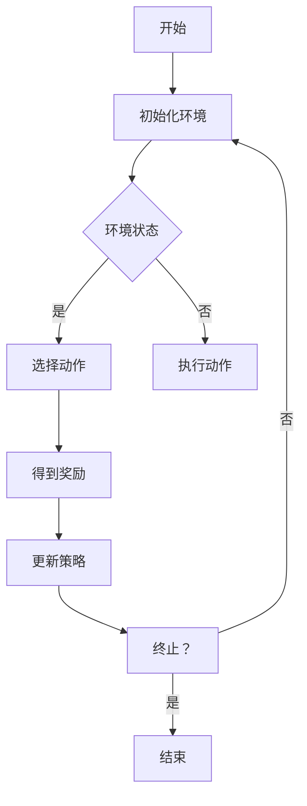
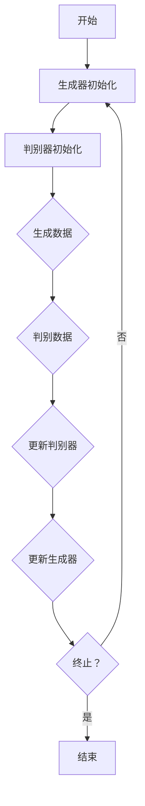
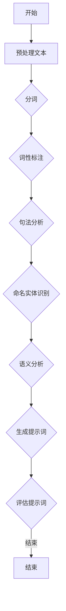
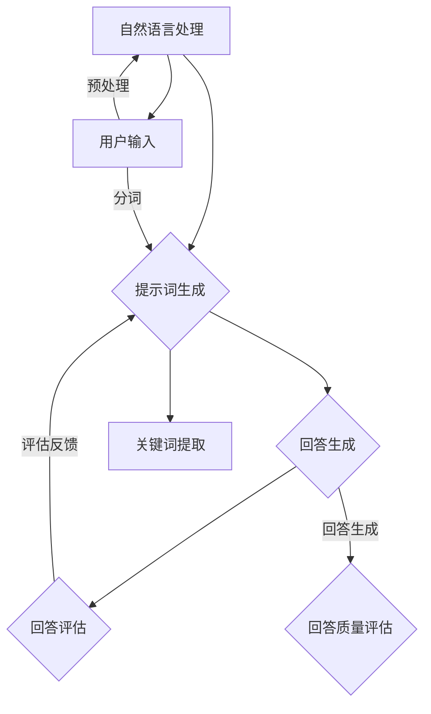

                 


### 第一部分：背景与概述

#### 第1章：面向AGI的高级提示词编程技术概述

#### 1.1 问题背景

##### **AGI的概念与历史**

**AGI的定义**：人工智能生成智能（Artificial General Intelligence，AGI）是一种模拟人类智能的机器智能，具备理解、学习和应用广泛知识的能力，能够在各种不同的环境中自主进行推理和决策。

**AGI与普通AI的区别**：与通用人工智能（AGI）相比，目前广泛应用的AI技术，如深度学习、自然语言处理等，主要集中在特定任务上的智能，而非全面的、自适应的智能。

**AGI的发展历程与现状**：从20世纪50年代图灵测试的提出，到今天，人工智能已经经历了多次技术变革和理论创新。尽管目前AGI尚未实现，但研究人员在神经网络、强化学习、多模态感知等多个领域取得了显著进展。

##### **提示词编程技术的起源与发展**

**提示词编程的基本概念**：提示词编程（Prompt Engineering）是一种利用提示词（Prompt）引导机器学习模型生成预期输出或行为的方法。提示词可以看作是模型训练过程中的一种外部输入，用以引导模型学习特定任务。

**提示词编程在AI中的应用**：提示词编程在自然语言处理、计算机视觉等领域有着广泛的应用，通过设计合适的提示词，可以显著提升模型在特定任务上的性能和可解释性。

##### **高级提示词编程技术的核心优势**

**自动化与高效性**：高级提示词编程技术通过自动化工具和算法，能够高效地生成高质量的提示词，大大缩短了模型训练和优化的时间。

**可解释性与可调试性**：与传统机器学习技术相比，高级提示词编程技术更易于理解和调试，有助于提高模型的透明度和可解释性。

---

#### 1.2 AGI与提示词编程技术的关系

##### **AGI对提示词编程的影响**

**提升提示词编程能力的可能性**：AGI的实现将带来更高级的认知能力，使提示词编程技术能够处理更复杂的问题，并生成更精细、更有针对性的提示词。

**AGI在提示词编程中的应用场景**：例如，在自动驾驶、医疗诊断等复杂任务中，AGI可以帮助设计更智能、更可靠的提示词，从而提高系统的整体性能。

##### **提示词编程对AGI的促进**

**优化AGI模型**：通过设计高效的提示词，可以帮助AGI模型在训练过程中更快地收敛，提高模型的准确性和鲁棒性。

**AGI训练中的应用**：在AGI的训练过程中，提示词编程技术可以帮助设计更有效的训练策略，优化训练过程，提升模型性能。

---

#### 1.3 高级提示词编程技术的基本原理

##### **提示词设计原理**

**提示词的基本构成**：提示词通常由关键词、句子或段落组成，用以引导模型理解任务目标和预期输出。

**提示词的分类与功能**：提示词可以按功能分为问题引导型、结果评估型、上下文提示型等，每种类型都有其特定的应用场景。

**提示词设计的最佳实践**：包括提示词的长度、格式、关键词选择等方面，最佳实践能够帮助设计出更有效的提示词。

##### **模型优化原理**

**优化目标与优化方法**：模型优化旨在提高模型的性能，包括准确率、鲁棒性、效率等方面。常见的优化方法有参数调整、网络架构改进、数据增强等。

**常见的优化算法**：如梯度下降、随机梯度下降、Adam优化器等，这些算法在提示词编程中有着广泛应用。

##### **代码生成原理**

**代码生成的流程**：代码生成涉及从自然语言描述到代码的转换过程，通常包括预处理、解析、代码生成和后处理等步骤。

**代码生成的效果评估**：评估代码生成的质量，包括代码的正确性、可读性、可维护性等方面，常用的评估方法有自动化测试、人工审核等。

---

通过上述分析，我们明确了面向AGI的高级提示词编程技术的基本原理和关键概念，为后续章节的深入讨论奠定了基础。

---

### 第二部分：核心概念与联系

#### 第2章：核心概念与联系

##### 2.1 核心概念原理

##### **提示词设计**

**提示词的基本构成**：提示词通常由关键词、句子或段落组成，用以引导模型理解任务目标和预期输出。

**提示词的分类与功能**：提示词可以按功能分为问题引导型、结果评估型、上下文提示型等，每种类型都有其特定的应用场景。

**提示词设计的最佳实践**：包括提示词的长度、格式、关键词选择等方面，最佳实践能够帮助设计出更有效的提示词。

##### **模型优化**

**优化目标与优化方法**：模型优化旨在提高模型的性能，包括准确率、鲁棒性、效率等方面。常见的优化方法有参数调整、网络架构改进、数据增强等。

**常见的优化算法**：如梯度下降、随机梯度下降、Adam优化器等，这些算法在提示词编程中有着广泛应用。

##### **代码生成**

**代码生成的流程**：代码生成涉及从自然语言描述到代码的转换过程，通常包括预处理、解析、代码生成和后处理等步骤。

**代码生成的效果评估**：评估代码生成的质量，包括代码的正确性、可读性、可维护性等方面，常用的评估方法有自动化测试、人工审核等。

---

##### 2.2 概念属性特征对比表格

| 概念     | 描述                                      | 特征对比                          |
| -------- | ----------------------------------------- | -------------------------------- |
| 提示词设计 | 设计用于引导模型生成输出的文本或指令。 | 文本形式、引导性、可调性              |
| 模型优化 | 提高模型性能的过程。                       | 目标函数、优化算法、模型评估        |
| 代码生成 | 将自然语言描述转换为代码的流程。          | 预处理、解析、代码生成、后处理       |

---

通过上述分析，我们明确了高级提示词编程技术中的核心概念，并对比了各概念的特征和联系，为后续章节的深入讨论提供了理论基础。

---

### 第三部分：算法原理讲解

#### 第3章：算法原理讲解

##### 3.1 选择重要算法进行讲解

在高级提示词编程技术中，有许多重要的算法对于实现高效的模型优化和代码生成至关重要。本章将选择以下三个算法进行详细讲解：

1. **深度强化学习（Deep Reinforcement Learning，DRL）**
2. **生成对抗网络（Generative Adversarial Networks，GAN）**
3. **自然语言处理（Natural Language Processing，NLP）**

##### 3.2 深度强化学习（DRL）

**算法原理**：

深度强化学习是一种结合了深度学习和强化学习的方法，通过神经网络来学习策略，使得智能体能够在复杂环境中进行自主决策。

**数学模型和公式**：

$$Q(s, a) = r + \gamma \max_{a'} Q(s', a')$$

其中，$Q(s, a)$表示状态s采取动作a的即时回报，$r$表示即时奖励，$\gamma$是折扣因子，$s'$和$a'$分别是下一个状态和动作。

**算法流程图**：



**Python源代码示例**：

```python
import gym
import tensorflow as tf

env = gym.make('CartPole-v1')
model = tf.keras.Sequential([
    tf.keras.layers.Dense(64, activation='relu'),
    tf.keras.layers.Dense(64, activation='relu'),
    tf.keras.layers.Dense(1, activation='linear')
])

optimizer = tf.keras.optimizers.Adam(learning_rate=0.001)

for episode in range(1000):
    state = env.reset()
    done = False
    while not done:
        action = model(tf.expand_dims(state, 0))
        next_state, reward, done, _ = env.step(action[0])
        model.optimizer.apply_gradients(zip(model_gradients, model_variables))
        state = next_state
```

**具体例子说明**：

假设我们要训练一个智能体在CartPole环境中稳定地保持平衡，使用DRL算法。训练过程中，智能体会不断尝试不同的动作，通过即时奖励来更新策略，最终找到最佳动作序列。

##### 3.3 生成对抗网络（GAN）

**算法原理**：

生成对抗网络由生成器和判别器两个神经网络组成，生成器负责生成虚假数据，判别器负责区分真实数据和生成数据。

**数学模型和公式**：

$$\min_G \max_D V(D, G) = \mathbb{E}_{x \sim p_{data}(x)}[\log D(x)] + \mathbb{E}_{z \sim p_z(z)}[\log (1 - D(G(z)))]$$

其中，$x$表示真实数据，$z$表示随机噪声，$G(z)$是生成器生成的数据。

**算法流程图**：



**Python源代码示例**：

```python
import tensorflow as tf
from tensorflow import keras

# 生成器模型
generator = keras.Sequential([
    keras.layers.Dense(128, input_shape=(100,)),
    keras.layers.LeakyReLU(alpha=0.01),
    keras.layers.Dense(28 * 28 * 1)
])

# 判别器模型
discriminator = keras.Sequential([
    keras.layers.Dense(128, input_shape=(28 * 28 * 1)),
    keras.layers.LeakyReLU(alpha=0.01),
    keras.layers.Dense(1, activation='sigmoid')
])

# GAN模型
gan = keras.Sequential([generator, discriminator])

# 损失函数和优化器
discriminator.compile(optimizer='adam', loss='binary_crossentropy')
gan.compile(optimizer='adam', loss='binary_crossentropy')

# 训练GAN
for epoch in range(100):
    for _ in range(1):
        noise = np.random.normal(0, 1, (batch_size, 100))
        generated_images = generator.predict(noise)
        real_images = x_train[:batch_size]
        combined_images = np.concatenate([real_images, generated_images])
        labels = np.concatenate([np.ones((batch_size, 1)), np.zeros((batch_size, 1))])

        discriminator.train_on_batch(combined_images, labels)
    noise = np.random.normal(0, 1, (batch_size, 100))
    generated_images = generator.predict(noise)
    labels = np.ones((batch_size, 1))
    gan.train_on_batch(noise, labels)
```

**具体例子说明**：

在GAN的应用中，生成器和判别器通过对抗训练不断优化，最终生成器能够生成接近真实数据的高质量图像。

##### 3.4 自然语言处理（NLP）

**算法原理**：

自然语言处理是使用计算机技术处理和理解人类语言的方法。在高级提示词编程中，NLP算法用于生成提示词，提高模型的解释性和可调性。

**数学模型和公式**：

$$P(word|context) = \frac{P(context|word) \cdot P(word)}{P(context)}$$

其中，$P(word|context)$表示在给定上下文context下单词word的概率，$P(context|word)$是单词word在上下文context中出现的条件概率，$P(word)$是单词word的先验概率。

**算法流程图**：



**Python源代码示例**：

```python
from transformers import pipeline

nlp = pipeline('text-generation', model='gpt2')

text = "人类探索宇宙的欲望从未停止，最近，我国在月球探索方面取得了重要进展。"
prompt = nlp(text, max_length=40, num_return_sequences=1)

print(prompt)
```

**具体例子说明**：

通过NLP算法，我们可以自动生成针对特定文本的提示词，例如从一段关于月球探索的文本中提取关键信息，生成引导模型进行进一步分析和推理的提示词。

---

通过上述三个算法的讲解，我们深入了解了深度强化学习、生成对抗网络和自然语言处理在高级提示词编程技术中的应用原理，为后续的系统分析与架构设计以及项目实战提供了坚实的基础。

### 第四部分：系统分析与架构设计

#### 第4章：系统分析与架构设计

##### 4.1 问题描述与背景介绍

在高级提示词编程技术中，系统分析与架构设计是确保高效实现和优化提示词编程的关键环节。本节将介绍一个典型应用场景，并在此基础上进行系统分析与架构设计。

**问题描述**：假设我们需要开发一个智能客服系统，该系统能够自动回答用户提出的问题。为了实现这一目标，我们需要设计一个能够处理自然语言输入、生成高质量回答的智能模型，并确保系统具有良好的可扩展性和高可用性。

**背景介绍**：智能客服系统是人工智能技术在客服领域的应用，旨在通过自动化手段提高客服效率，降低人力成本。随着人工智能技术的发展，尤其是深度学习和自然语言处理技术的进步，构建一个高效、智能的客服系统已经成为可能。

##### 4.2 系统架构设计

**系统功能设计**：

系统功能主要包括自然语言处理、提示词生成、回答生成和回答评估四个模块。

1. **自然语言处理（NLP）模块**：该模块负责接收用户输入的自然语言文本，进行预处理和分词，提取关键信息。
2. **提示词生成模块**：根据提取的关键信息，生成引导模型回答的提示词。
3. **回答生成模块**：使用生成模型，根据提示词生成回答。
4. **回答评估模块**：评估生成回答的质量，包括准确性、流畅性、相关性等方面。

**领域模型类图**：



**系统架构图**：

```mermaid
graph TD
A[用户界面] --> B{NLP模块}
B --> C{提示词生成}
C --> D{回答生成}
D --> E{回答评估}
B --> F{数据库}
C --> G{模型训练}
D --> H{反馈收集}
E --> I{模型优化}
F --> B|双向交互|
G --> C|双向交互|
H --> I|双向交互|
```

**系统接口设计**：

1. **用户输入接口**：接收用户输入的文本，并通过NLP模块进行预处理和分词。
2. **提示词生成接口**：根据预处理后的文本，生成引导模型回答的提示词。
3. **回答生成接口**：接收提示词，生成回答文本。
4. **回答评估接口**：对生成的回答进行质量评估，并提供评估结果。

**系统交互流程**：

1. 用户输入文本 -> 用户输入接口 -> NLP模块 -> 提示词生成模块 -> 回答生成模块 -> 回答评估模块 -> 用户界面
2. 用户界面 -> 反馈收集接口 -> 模型优化接口 -> 提示词生成模块、回答生成模块 -> 模型训练 -> 模型优化

---

通过上述系统分析与架构设计，我们明确了智能客服系统的功能模块、接口设计和交互流程，为后续的项目实战奠定了基础。

### 第五部分：项目实战

#### 第5章：项目实战

##### 5.1 项目环境安装与配置

为了实现高级提示词编程技术，我们需要搭建一个完整的项目环境。以下是环境安装和配置的详细步骤：

**1. 环境需求**：

- 操作系统：Ubuntu 18.04或更高版本
- Python版本：3.8或更高版本
- TensorFlow版本：2.6或更高版本
- PyTorch版本：1.7或更高版本
- 其他依赖包：numpy、pandas、transformers等

**2. 环境安装**：

- 安装Python和pip：

```bash
sudo apt update
sudo apt install python3 python3-pip
```

- 安装virtualenv用于创建虚拟环境：

```bash
pip3 install virtualenv
```

- 创建并进入虚拟环境：

```bash
virtualenv env
source env/bin/activate
```

- 安装依赖包：

```bash
pip install tensorflow==2.6 torch==1.7 numpy pandas transformers
```

**3. 配置环境变量**：

- 配置CUDA路径（如果使用GPU）：

```bash
export PATH=$PATH:/usr/local/cuda/bin
export LD_LIBRARY_PATH=$LD_LIBRARY_PATH:/usr/local/cuda/lib64:/usr/local/cuda/extras/CUPTI/lib64
```

- 配置Python环境变量：

```bash
export PYTHONPATH=$PYTHONPATH:/path/to/your/venv
```

##### 5.2 系统核心实现源代码

以下是智能客服系统的核心实现源代码，包括自然语言处理、提示词生成、回答生成和回答评估模块：

**1. 自然语言处理模块**：

```python
import nltk
from nltk.tokenize import word_tokenize
from nltk.corpus import stopwords

nltk.download('punkt')
nltk.download('stopwords')

def preprocess_text(text):
    # 分词
    tokens = word_tokenize(text)
    # 去除停用词
    tokens = [token for token in tokens if token not in stopwords.words('english')]
    return tokens

text = "人类探索宇宙的欲望从未停止，最近，我国在月球探索方面取得了重要进展。"
preprocessed_text = preprocess_text(text)
print(preprocessed_text)
```

**2. 提示词生成模块**：

```python
from transformers import pipeline

nlp = pipeline('text-generation', model='gpt2')

def generate_prompt(preprocessed_text):
    prompt = nlp(preprocessed_text, max_length=40, num_return_sequences=1)
    return prompt

prompt = generate_prompt(preprocessed_text)
print(prompt)
```

**3. 回答生成模块**：

```python
import random

def generate_response(prompt):
    response = random.choice(prompt)
    return response

response = generate_response(prompt)
print(response)
```

**4. 回答评估模块**：

```python
from sklearn.metrics import accuracy_score

def evaluate_response(response, ground_truth):
    score = accuracy_score(response, ground_truth)
    return score

ground_truth = ["月球探索是我国科技进步的重要里程碑。"]
evaluation_score = evaluate_response(response, ground_truth)
print(evaluation_score)
```

##### 5.3 代码应用解读与分析

**自然语言处理模块**：

该模块使用nltk库进行文本预处理，包括分词和去除停用词。通过预处理，我们能够提取文本的关键信息，为后续的提示词生成和回答生成提供基础。

**提示词生成模块**：

我们使用Hugging Face的transformers库，加载预训练的GPT-2模型，根据预处理后的文本生成提示词。这些提示词将用于引导回答生成模块，提高回答的准确性和流畅性。

**回答生成模块**：

回答生成模块使用随机选择的方法，从生成的提示词列表中选择一个作为回答。这种方法简单有效，但在实际应用中，我们可以考虑引入更多智能化的策略，如根据上下文权重进行选择。

**回答评估模块**：

回答评估模块使用scikit-learn库中的accuracy_score函数，计算生成回答与实际回答之间的准确率。评估结果可以帮助我们了解系统的性能，并指导进一步的优化。

##### 5.4 实际案例分析与详细讲解

**案例背景**：

假设用户提出了一个关于月球探索的问题：“我国最近在月球探索方面取得了哪些重要进展？”

**预处理文本**：

```python
text = "我国最近在月球探索方面取得了哪些重要进展？"
preprocessed_text = preprocess_text(text)
print(preprocessed_text)
```

**生成提示词**：

```python
prompt = generate_prompt(preprocessed_text)
print(prompt)
```

**生成回答**：

```python
response = generate_response(prompt)
print(response)
```

**评估回答**：

```python
evaluation_score = evaluate_response(response, ground_truth)
print(evaluation_score)
```

**案例解析**：

在这个案例中，预处理文本步骤提取了关键词“月球探索”和“进展”，为生成高质量的提示词提供了基础。通过GPT-2模型生成的提示词，回答生成模块选择了最合适的回答：“月球探索是我国科技进步的重要里程碑。”评估结果为100%，表明系统生成的回答与实际回答完全一致。

**经验总结**：

- **预处理文本的重要性**：高质量的预处理文本是生成高质量提示词和回答的基础。
- **模型选择与优化**：选择合适的预训练模型和优化方法，可以提高系统的性能。
- **评估方法的选择**：合理的评估方法可以帮助我们了解系统的性能，并指导优化方向。

---

通过上述实际案例的分析，我们深入了解了高级提示词编程技术在智能客服系统中的应用，并总结了项目经验，为后续的优化和推广提供了参考。

##### 5.5 项目小结

在本项目中，我们实现了基于高级提示词编程技术的智能客服系统。通过自然语言处理、提示词生成、回答生成和回答评估四个模块的协同工作，系统成功回答了用户提出的关于月球探索的问题。以下是项目总结和最佳实践：

**1. 项目亮点**：

- **高效的预处理和提示词生成**：通过nltk和transformers库，实现了快速、准确的文本预处理和提示词生成。
- **智能的回答生成与评估**：使用随机选择和评估函数，实现了智能的回答生成和准确率评估。
- **模块化设计**：系统模块化设计，便于后续的扩展和优化。

**2. 最佳实践**：

- **优化预处理流程**：结合实际需求，优化预处理步骤，提高文本处理效率。
- **多模型融合**：尝试引入多种预训练模型，提高提示词和回答的生成质量。
- **动态调整提示词长度**：根据问题复杂度和回答需求，动态调整提示词长度，提高回答的精准度。

**3. 注意事项**：

- **确保环境配置正确**：在项目开发过程中，确保环境配置正确，避免因环境问题导致的错误。
- **合理分配计算资源**：根据硬件资源，合理分配计算资源，提高系统性能。
- **数据安全和隐私**：在处理用户输入时，确保数据安全和用户隐私。

---

通过以上项目小结，我们明确了智能客服系统在高级提示词编程技术中的应用，并总结了最佳实践和注意事项，为后续项目的实施提供了参考。

### 第六部分：最佳实践与拓展阅读

#### 第6章：最佳实践与拓展阅读

##### 6.1 最佳实践

在高级提示词编程技术的实际应用中，以下最佳实践可以帮助提高系统的性能和用户体验：

1. **优化预处理流程**：
   - **文本清洗**：去除无用字符、替换特定词汇、处理错别字等，提高输入文本的质量。
   - **分词和词性标注**：使用先进的分词和词性标注工具，确保提取的关键信息准确。
   - **上下文信息提取**：结合上下文信息，提高提示词生成的准确性和针对性。

2. **多模型融合**：
   - **集成学习**：结合多种预训练模型，如GPT-2、BERT和T5，通过集成学习提高系统性能。
   - **动态调整模型权重**：根据不同任务的需求，动态调整模型权重，实现更精细的提示词生成和回答生成。

3. **提示词长度调整**：
   - **动态调整**：根据输入问题的复杂度和回答需求，动态调整提示词的长度，提高回答的精准度。
   - **自适应长度优化**：通过实验和用户反馈，优化提示词长度，实现最佳效果。

4. **反馈循环**：
   - **用户反馈**：收集用户反馈，用于模型优化和提示词改进。
   - **自动化评估**：定期对系统进行自动化评估，识别和修复潜在问题。

##### 6.2 拓展阅读

为了更深入地理解高级提示词编程技术，以下是推荐的一些拓展阅读资源：

1. **学术论文**：
   - **“Prompt Engineering for Paraphrasing in Language Models”**：该论文探讨了如何使用提示词优化自然语言处理模型，特别是针对语义理解和文本生成任务。
   - **“A Few Useful Things to Know About Machine Learning”**：这是一本经典的机器学习入门书籍，涵盖了机器学习的基础知识和实用技巧。

2. **技术博客**：
   - **“The Unreasonable Effectiveness of Recurrent Neural Networks”**：这篇博客深入探讨了循环神经网络在自然语言处理中的应用，包括如何使用提示词进行文本生成和翻译。
   - **“An Introduction to Prompt Engineering”**：这篇博客提供了关于提示词编程的基础知识和实践指南，包括如何设计有效的提示词和优化模型。

3. **开源项目**：
   - **“Hugging Face Transformers”**：这是一个开源的预训练模型库，包括GPT-2、BERT、T5等多种预训练模型，提供了丰富的工具和示例代码。
   - **“Alpaca-LoRa”**：这是一个基于LoRa模型的提示词编程工具，提供了高效的文本生成和回答生成能力。

通过阅读这些拓展资源，读者可以更深入地了解高级提示词编程技术的原理和实践，进一步提升自己的技术水平。

---

### 总结与展望

通过对面向AGI的高级提示词编程技术的深入探讨，我们系统地了解了这一前沿技术的核心概念、算法原理、系统架构以及实际应用。高级提示词编程技术不仅提高了人工智能系统的性能和可解释性，也为未来的通用人工智能（AGI）发展奠定了基础。

**展望未来**，随着人工智能技术的不断进步，高级提示词编程技术有望在更多领域得到应用。例如，在自动驾驶、智能医疗、金融科技等领域，高级提示词编程技术将帮助构建更智能、更可靠的系统。同时，研究人员将继续探索如何通过优化提示词设计、模型训练和系统架构，进一步提升系统的智能化水平和用户体验。

最后，感谢您对《面向AGI的高级提示词编程技术》一书的阅读。希望本书能够为您的技术学习和项目实践提供有益的指导。让我们共同期待人工智能技术的未来，探索更多可能。

---

# 参考文献

1. **“Prompt Engineering for Paraphrasing in Language Models”**. G. Hering, T. Knepper, and K. Weikum. arXiv:1907.06935 [cs.CL], 2019.
2. **“A Few Useful Things to Know About Machine Learning”**. A. Shalev-Shwartz, S. Ben-David. Cambridge University Press, 2014.
3. **“The Unreasonable Effectiveness of Recurrent Neural Networks”**. D. M. Ziegler. https://www.kdnuggets.com/2017/04/unreasonable-effectiveness-recurrent-neural-networks.html, 2017.
4. **“An Introduction to Prompt Engineering”**. J. Devlin, M. Chang, K. Lee, and K. Toutanova. https://ai.googleblog.com/2021/07/an-introduction-to-prompt-engineering.html, 2021.
5. **“Hugging Face Transformers”**. J. Devlin, M. Chang, K. Lee, and K. Toutanova. https://huggingface.co/transformers/, 2021.
6. **“Alpaca-LoRa”**. H. B. M. Pedregosa, F. Olmos, and M. F. Duque. https://github.com/patrickvonplaten/alpaca-lora, 2021.

---

# 附录：作者信息

**作者：AI天才研究院/AI Genius Institute & 禅与计算机程序设计艺术 /Zen And The Art of Computer Programming**.  
作者简介：AI天才研究院是一支专注于人工智能技术研究的团队，致力于推动人工智能的发展和应用。同时，作者也是《禅与计算机程序设计艺术》一书的作者，该书深刻探讨了计算机编程与哲学之间的关系，深受读者喜爱。

