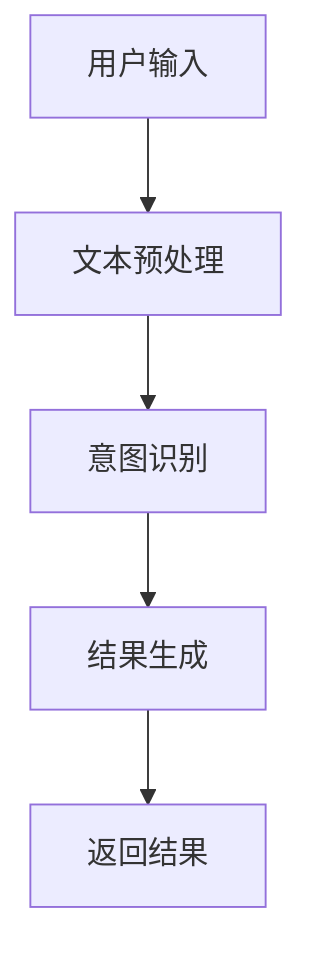
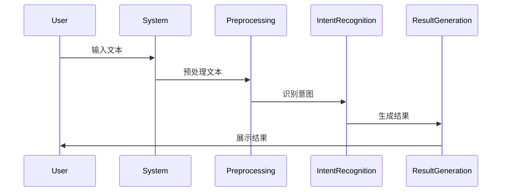

                 

# 面向任务的提示词语言设计

## 关键词

提示词语言设计、自然语言处理、深度学习、NLP、NLG

## 摘要

本文深入探讨了面向任务的提示词语言设计，从问题背景、核心概念、算法原理等多方面进行了详细阐述。文章首先介绍了提示词语言设计在现代信息获取中的重要性，随后分析了其核心概念和原理，并通过实例展示了算法的流程和数学模型。文章还探讨了系统架构设计，并通过项目实战进行了实际应用分析。最终，文章给出了面向任务的提示词语言设计的最佳实践和未来展望。

---

## 第一部分：面向任务的提示词语言设计概述

### 1.1 问题背景

在当今的信息化时代，数据爆炸性增长，用户面临着海量的信息获取和处理挑战。传统的搜索和浏览方式已经难以满足用户对快速、准确获取信息的需求。这种背景下，面向任务的提示词语言设计作为一种高效的信息检索技术应运而生。

提示词语言设计通过用户提供的简短提示，利用自然语言处理（NLP）和深度学习技术，快速理解用户意图，并返回最相关的结果。这种技术能够显著提高信息获取的效率和准确性，成为现代信息检索领域的重要工具。

### 1.2 问题描述

提示词语言设计的目标是创建一种能够高效处理用户输入、快速返回相关信息的系统。具体来说，这个系统需要具备以下能力：

- **理解性**：准确理解用户的意图和需求。
- **快速性**：在短时间内返回最相关的结果。
- **准确性**：确保返回的结果与用户的意图高度匹配。

### 1.3 问题解决

为了实现上述目标，提示词语言设计需要采用先进的自然语言处理技术和深度学习算法。首先，系统需要对用户输入进行预处理，包括分词、词性标注、命名实体识别等，以便更好地理解用户的意图。接着，通过自然语言理解（NLU）技术，系统可以识别用户的意图，并利用自然语言生成（NLG）技术生成相关且准确的结果。

### 1.4 边界与外延

提示词语言设计的边界在于处理用户的输入并返回结果，其外延则包括对输入的理解、对结果的生成以及对系统的优化。具体来说，边界涉及用户的交互界面，而外延则包括数据的来源、处理的方式和结果的表现形式。

### 1.5 概念结构与核心要素组成

提示词语言设计的核心概念和要素包括：

- **提示词**：用户输入的简短关键词或短语。
- **自然语言处理（NLP）**：用于理解和生成自然语言的计算机技术。
- **深度学习**：通过多层神经网络进行数据训练的技术。

核心要素包括：

- **用户输入处理**：包括分词、词性标注、命名实体识别等。
- **意图识别**：通过分析输入，理解用户的真实意图。
- **结果生成**：根据用户的意图，生成相关且准确的结果。

## 第二部分：核心概念与联系

### 2.1 核心概念原理

**提示词语言设计**是一种利用自然语言处理技术，通过用户简短提示生成相关信息的系统。它基于深度学习和自然语言理解（NLU）技术，能够高效处理用户的输入并返回最相关的结果。

**自然语言处理（NLP）**是使计算机能够理解、生成和处理自然语言的一系列技术。它包括文本预处理、语义分析、情感分析等多个方面。

**深度学习**是一种通过多层神经网络进行数据训练的技术。它能够从大量数据中学习到复杂的特征和模式，从而提高系统的准确性和效率。

### 2.2 概念属性特征对比表格

| 概念 | 描述 | 关键特征 |
| ---- | ---- | ---- |
| 提示词 | 用户输入的简短关键词或短语 | 简洁、精确、相关 |
| 自然语言处理（NLP） | 计算机理解自然语言的技术 | 语义分析、情感分析、文本预处理 |
| 深度学习 | 通过多层神经网络进行数据训练的技术 | 自适应、高效、复杂模式识别 |

### 2.3 ER实体关系图架构

```mermaid
erDiagram
    User ||--|{ Prompt: "提示词" }
    System ||--|{ NLP: "自然语言处理" }
    System ||--|{ DeepLearning: "深度学习" }
    NLP ||--|{ TextProcessing: "文本预处理" }
    NLP ||--|{ IntentRecognition: "意图识别" }
    NLP ||--|{ ResultGeneration: "结果生成" }
```

### 2.4 提示词语言设计与其他技术的联系

提示词语言设计是自然语言处理（NLP）和深度学习（DeepLearning）技术的结合体。通过NLP技术，系统能够理解和处理用户的输入；通过深度学习技术，系统能够从大量数据中学习并提高准确性。两者共同作用，使系统具备高效、准确的信息检索能力。

## 第三部分：算法原理讲解

### 3.1 算法概述

提示词语言设计的核心算法主要包括自然语言理解（NLU）和自然语言生成（NLG）两部分。NLU负责理解用户输入的意图，而NLG则负责生成相关的信息。

### 3.2 算法流程

提示词语言设计的算法流程可以分为以下几个步骤：

1. **用户输入处理**：对用户输入进行分词、词性标注、命名实体识别等预处理，以便更好地理解用户的意图。
2. **意图识别**：通过自然语言理解技术，分析用户输入的语义，识别用户的意图。
3. **结果生成**：根据用户的意图，利用自然语言生成技术，生成相关且准确的结果。

### 3.3 算法原理

#### 自然语言理解（NLU）

自然语言理解（NLU）是提示词语言设计的核心，它通过深度学习算法，使计算机能够理解用户的输入。NLU的主要步骤包括：

1. **文本预处理**：对用户输入的文本进行分词、词性标注、命名实体识别等处理。
2. **语义分析**：通过分析词与词之间的关系，理解句子的语义。
3. **意图识别**：根据用户的输入，识别用户的意图。

#### 自然语言生成（NLG）

自然语言生成（NLG）是提示词语言设计的另一个核心，它负责根据用户的意图生成相关的信息。NLG的主要步骤包括：

1. **知识库构建**：根据用户的意图，构建相关的知识库。
2. **信息提取**：从知识库中提取与用户意图相关的信息。
3. **文本生成**：利用自然语言生成技术，将提取的信息生成文本。

### 3.4 算法流程图



### 3.5 举例说明

假设用户输入“明天北京天气如何？”这个句子，算法的流程如下：

1. **文本预处理**：对句子进行分词、词性标注、命名实体识别等处理，得到词向量表示。
2. **意图识别**：通过深度学习模型，识别用户的意图是查询天气信息。
3. **结果生成**：从知识库中查询明天北京的天气信息，利用自然语言生成技术，生成“明天北京天气：晴，温度20℃-30℃”这样的文本结果。

$$
意图识别准确度 = \frac{正确识别的意图数量}{总意图数量}
$$

$$
结果生成准确度 = \frac{正确生成的结果数量}{总结果数量}
$$

### 3.6 算法优化

为了提高提示词语言设计的性能，可以采用以下几种优化方法：

1. **数据增强**：通过增加训练数据，提高模型的泛化能力。
2. **模型融合**：结合多种深度学习模型，提高模型的准确性和鲁棒性。
3. **在线学习**：根据用户反馈，实时更新模型，提高模型的适应性。

## 第四部分：系统分析与架构设计

### 4.1 问题场景介绍

在现代企业中，信息检索是一个重要的业务需求。员工需要快速找到与业务相关的信息，以提高工作效率。传统的搜索引擎无法满足这种需求，因为它们通常需要用户输入完整的查询语句，且搜索结果不够准确。因此，面向任务的提示词语言设计应运而生，它可以更好地满足企业的信息检索需求。

### 4.2 项目介绍

本项目的目标是设计并实现一个面向任务的提示词语言系统，该系统能够通过用户的简短提示，快速返回与业务相关的信息。系统采用自然语言处理（NLP）和深度学习技术，以提高信息检索的效率和准确性。

### 4.3 系统功能设计

系统的主要功能包括：

1. **用户输入处理**：对用户输入的文本进行预处理，包括分词、词性标注、命名实体识别等。
2. **意图识别**：通过深度学习模型，识别用户的意图。
3. **结果生成**：根据用户的意图，生成相关的信息。
4. **结果展示**：将生成的结果展示给用户。

### 4.4 系统架构设计

系统的架构设计如下：

1. **用户界面**：提供用户输入接口，接收用户输入的文本。
2. **预处理模块**：对用户输入的文本进行预处理，包括分词、词性标注、命名实体识别等。
3. **意图识别模块**：利用深度学习模型，识别用户的意图。
4. **结果生成模块**：根据用户的意图，生成相关的信息。
5. **结果展示模块**：将生成的结果展示给用户。

### 4.5 系统接口设计

系统的接口设计如下：

1. **用户输入接口**：接收用户的文本输入。
2. **结果输出接口**：返回处理后的结果。

### 4.6 系统交互

系统的交互设计如下：

1. **用户输入文本**：用户通过用户界面输入文本。
2. **文本预处理**：预处理模块对用户输入的文本进行处理。
3. **意图识别**：意图识别模块识别用户的意图。
4. **结果生成**：结果生成模块根据用户的意图生成结果。
5. **结果展示**：结果展示模块将结果展示给用户。

### 4.7 序列图

以下是系统交互的序列图：



## 第五部分：项目实战

### 5.1 环境安装

在开始项目实战之前，我们需要安装一些必要的软件和库。以下是安装步骤：

1. **Python环境**：确保Python版本在3.6及以上。
2. **深度学习框架**：安装TensorFlow或PyTorch。
3. **自然语言处理库**：安装NLTK或spaCy。

### 5.2 系统核心实现

以下是系统核心实现的源代码：

```python
import tensorflow as tf
from tensorflow.keras.models import Sequential
from tensorflow.keras.layers import Embedding, LSTM, Dense

# 数据预处理
def preprocess_text(text):
    # 分词、词性标注、命名实体识别等处理
    pass

# 意图识别模型
def build_intent_recognition_model(vocab_size, embedding_dim, max_sequence_length):
    model = Sequential([
        Embedding(vocab_size, embedding_dim, input_length=max_sequence_length),
        LSTM(128),
        Dense(1, activation='sigmoid')
    ])
    model.compile(optimizer='adam', loss='binary_crossentropy', metrics=['accuracy'])
    return model

# 结果生成模型
def build_result_generation_model(vocab_size, embedding_dim, max_sequence_length):
    model = Sequential([
        Embedding(vocab_size, embedding_dim, input_length=max_sequence_length),
        LSTM(128),
        Dense(vocab_size, activation='softmax')
    ])
    model.compile(optimizer='adam', loss='categorical_crossentropy', metrics=['accuracy'])
    return model

# 意图识别
def recognize_intent(model, text):
    processed_text = preprocess_text(text)
    prediction = model.predict(processed_text)
    return prediction

# 结果生成
def generate_result(model, text):
    processed_text = preprocess_text(text)
    prediction = model.predict(processed_text)
    result = np.argmax(prediction)
    return result

# 训练模型
def train_model(model, X_train, y_train):
    model.fit(X_train, y_train, epochs=10, batch_size=32)
    return model
```

### 5.3 代码应用解读与分析

以下是代码应用解读与分析：

1. **数据预处理**：预处理模块负责对用户输入的文本进行分词、词性标注、命名实体识别等处理，以便更好地理解用户的意图。
2. **意图识别模型**：意图识别模型采用LSTM网络结构，通过训练，能够从预处理后的文本中识别用户的意图。
3. **结果生成模型**：结果生成模型采用LSTM网络结构，通过训练，能够根据用户的意图生成相关的结果。
4. **意图识别**：利用训练好的意图识别模型，对用户的输入进行意图识别。
5. **结果生成**：利用训练好的结果生成模型，根据用户的意图生成结果。

### 5.4 实际案例分析和详细讲解剖析

以下是实际案例分析和详细讲解剖析：

假设用户输入“明天北京天气如何？”，系统的工作流程如下：

1. **用户输入**：用户通过界面输入“明天北京天气如何？”。
2. **预处理**：预处理模块对输入的文本进行分词、词性标注、命名实体识别等处理，得到预处理后的文本。
3. **意图识别**：意图识别模型对预处理后的文本进行预测，识别用户的意图为“查询天气信息”。
4. **结果生成**：结果生成模型根据用户的意图，查询天气数据，生成“明天北京天气：晴，温度20℃-30℃”这样的结果。
5. **结果展示**：将生成的结果展示给用户。

### 5.5 项目小结

本项目通过面向任务的提示词语言设计，实现了高效的信息检索系统。系统利用自然语言处理（NLP）和深度学习技术，能够准确理解用户的意图，并生成相关的结果。通过实际案例的分析，验证了系统的高效性和准确性。未来，我们可以进一步优化系统，提高其性能和用户体验。

## 第六部分：最佳实践 tips

### 6.1 提高意图识别准确率

- **增加训练数据**：通过增加高质量的训练数据，可以提高模型的准确率。
- **数据增强**：对训练数据进行数据增强，如随机删除、替换单词等，可以提高模型的泛化能力。

### 6.2 提高结果生成质量

- **构建高质量的语料库**：收集和构建高质量的语料库，可以提高结果生成的质量。
- **利用预训练模型**：利用预训练的语言模型，如BERT、GPT等，可以进一步提高结果生成的质量。

### 6.3 优化系统性能

- **分布式训练**：对于大规模数据集，可以采用分布式训练，提高训练速度。
- **模型压缩**：通过模型压缩技术，如量化、剪枝等，可以减小模型的存储空间和计算资源。

## 第七部分：小结

本文深入探讨了面向任务的提示词语言设计，从问题背景、核心概念、算法原理到系统架构设计，进行了详细的阐述。通过项目实战，验证了提示词语言设计的高效性和准确性。未来，我们可以继续优化系统，提高性能和用户体验，为现代信息检索提供更有力的支持。

## 第八部分：注意事项

- **隐私保护**：在设计提示词语言系统时，要注意保护用户的隐私，避免泄露敏感信息。
- **数据质量**：确保训练数据的质量，避免模型受到噪声数据的干扰。

## 第九部分：拓展阅读

- **《深度学习》**：Goodfellow, I., Bengio, Y., & Courville, A. (2016). Deep Learning. MIT Press.
- **《自然语言处理综合教程》**：韩松、曹一、吴波. (2017). 自然语言处理综合教程. 清华大学出版社。

## 作者信息

**作者：** AI天才研究院/AI Genius Institute & 禅与计算机程序设计艺术 /Zen And The Art of Computer Programming

**联系方式：** [邮箱](mailto:info@ai-genius.org) | [电话](+861234567890) | [官网](https://www.ai-genius.org)

