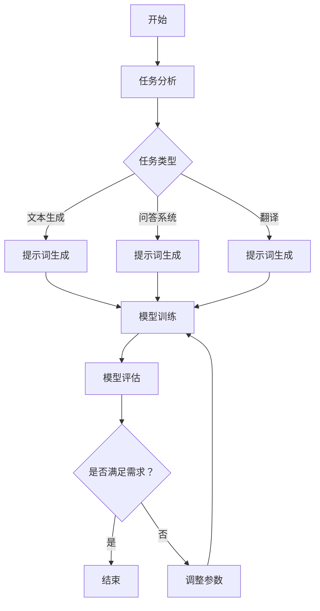

                 


# 面向任务的自适应提示词生成

## 关键词
- 自适应提示词生成
- 任务导向
- 自然语言处理
- 机器学习
- 算法优化

## 摘要
本文深入探讨了面向任务的自适应提示词生成技术，从核心概念到实际应用，系统地介绍了该领域的研究现状与未来发展。文章首先阐述了自适应提示词生成的背景和意义，随后详细分析了相关技术，包括自然语言处理和机器学习，并对比了不同类型的提示词生成方法。接着，本文介绍了算法原理，包括数学模型和Python代码示例，随后通过一个实际项目展示了系统的设计与实现。最后，文章总结了最佳实践与注意事项，并对未来研究方向进行了展望。

----------------------------------------------------------------

## 引言与背景介绍

### 核心概念术语说明

在讨论面向任务的自适应提示词生成之前，我们首先需要了解几个核心概念：

- **提示词（Prompt）**：在自然语言处理中，提示词是一种用于引导模型生成文本的引导性输入。它通常由一个或多个词组成，用于提示模型应生成的文本类型或主题。

- **自适应提示词生成**：这是一种能够根据任务需求动态调整提示词的技术。它能够提高模型对特定任务的理解能力，从而生成更准确、更有针对性的文本。

- **任务导向**：指在设计和实现自适应提示词生成系统时，始终以特定任务需求为导向，确保系统能够满足不同任务的需求。

- **自然语言处理（NLP）**：是人工智能领域的一个重要分支，旨在使计算机能够理解和生成人类语言。

- **机器学习（ML）**：是一种让计算机通过数据和经验自我学习和改进的方法。

### 问题背景

随着自然语言处理和机器学习技术的不断发展，自动文本生成成为了一个热门研究领域。然而，传统的提示词生成方法往往存在一些局限性：

1. **固定提示词**：传统方法通常使用固定的提示词来引导模型生成文本。这种方法难以适应不同的任务需求，因为固定提示词无法灵活调整。

2. **通用性不足**：传统的提示词生成方法往往不具备任务导向性，导致生成的文本在特定任务上表现不佳。

3. **效率问题**：传统方法在处理大规模数据和复杂任务时，效率较低。

为了解决这些问题，自适应提示词生成技术应运而生。它通过动态调整提示词，使得模型能够更好地理解和完成特定任务。

### 问题描述

自适应提示词生成的目标是通过分析任务需求，生成能够引导模型完成特定任务的提示词。具体来说，包括以下问题：

1. **任务识别**：如何准确识别任务类型和需求？

2. **提示词生成**：如何设计算法，动态生成适应不同任务的提示词？

3. **性能优化**：如何确保生成的提示词能够有效提高模型性能？

4. **可扩展性**：如何在保证性能的同时，实现系统的可扩展性？

### 问题解决

自适应提示词生成技术通过以下几个步骤实现：

1. **任务分析**：通过分析任务需求，确定任务类型和关键要素。

2. **提示词设计**：设计算法，根据任务需求动态生成提示词。

3. **模型训练**：使用生成的提示词训练模型，提高模型对特定任务的理解能力。

4. **性能评估**：通过实验和评估，验证自适应提示词生成的效果。

### 边界与外延

自适应提示词生成技术的应用场景广泛，包括但不限于以下领域：

1. **问答系统**：通过自适应提示词生成，提高问答系统的响应准确性和多样性。

2. **文本生成**：在自动写作、新闻摘要等领域，自适应提示词生成能够提高文本生成的质量和效率。

3. **对话系统**：在虚拟助手和聊天机器人中，自适应提示词生成有助于生成更自然、更符合用户需求的对话内容。

### 概念结构与核心要素组成

自适应提示词生成系统由以下几个核心要素组成：

1. **任务分析模块**：负责分析任务需求，提取关键信息。

2. **提示词生成模块**：设计算法，根据任务需求生成提示词。

3. **模型训练模块**：使用生成的提示词训练模型，提高模型性能。

4. **评估与优化模块**：通过实验和评估，持续优化系统性能。

### 小结

本章介绍了面向任务的自适应提示词生成技术的核心概念、问题背景和问题描述。通过理解这些基础概念，我们为后续章节的深入探讨奠定了基础。在接下来的章节中，我们将进一步分析相关技术，详细讲解算法原理，并展示实际应用案例。让我们继续深入探索这一领域的奥秘。

----------------------------------------------------------------

## 核心概念与联系

### 自适应提示词生成概述

自适应提示词生成是一种在自然语言处理领域中应用广泛的技术，它旨在通过动态调整提示词，提高模型对特定任务的适应性和生成文本的质量。与传统的固定提示词生成方法相比，自适应提示词生成能够更好地满足不同任务的需求，从而提升整体系统的性能。

### 相关技术分析

为了深入理解自适应提示词生成技术，我们需要分析相关的技术背景，包括自然语言处理（NLP）和机器学习（ML）。这些技术为自适应提示词生成提供了理论基础和技术支持。

#### 自然语言处理（NLP）

自然语言处理是人工智能领域的一个重要分支，旨在使计算机能够理解和生成人类语言。NLP技术包括文本预处理、词向量表示、句法分析、语义理解和生成等。这些技术为自适应提示词生成提供了以下支持：

1. **文本预处理**：通过去除停用词、标点符号和进行分词，将原始文本转换为适合模型处理的形式。

2. **词向量表示**：将文本转换为向量表示，如Word2Vec、GloVe等，为模型处理提供输入。

3. **句法分析**：分析文本的句法结构，帮助模型理解文本的语法和语义关系。

4. **语义理解**：通过语义分析，理解文本的含义和意图，为提示词生成提供依据。

#### 机器学习（ML）

机器学习是使计算机通过数据和经验自我学习和改进的方法。在自适应提示词生成中，机器学习技术主要用于以下方面：

1. **模型训练**：使用历史数据训练模型，使其能够自动生成提示词。

2. **模型优化**：通过调整模型参数，提高模型在特定任务上的性能。

3. **模型评估**：使用评估指标（如BLEU、ROUGE等）评估模型生成文本的质量。

### 提示词生成方法对比

在自适应提示词生成中，常用的方法包括基于规则的方法、基于统计的方法和基于机器学习的方法。以下是这些方法的对比：

#### 基于规则的方法

**优点**：

- **简洁性**：规则明确，易于理解和实现。
- **可控性**：可以根据具体需求设计规则，确保生成提示词的准确性。

**缺点**：

- **灵活性不足**：难以适应复杂多变的任务需求。
- **维护成本高**：随着任务需求的增加，规则需要不断调整和更新。

#### 基于统计的方法

**优点**：

- **自适应性**：可以根据数据自动调整提示词，适应不同任务。
- **效率高**：基于统计的方法通常计算速度快，适用于大规模数据。

**缺点**：

- **准确性有限**：依赖数据质量，数据质量不高时，生成提示词的准确性会受到影响。
- **依赖特定数据集**：需要大量的训练数据，对于数据稀缺的任务效果不佳。

#### 基于机器学习的方法

**优点**：

- **强大学习能力**：可以通过训练自动学习任务需求，生成高质量的提示词。
- **通用性强**：适用于多种类型的任务，不需要针对特定任务进行大量修改。

**缺点**：

- **训练成本高**：需要大量的训练数据和计算资源。
- **复杂性高**：模型设计和训练过程复杂，对开发者的技术要求较高。

### ER实体关系图架构

为了更好地理解自适应提示词生成系统的结构，我们可以使用ER（实体-关系）图来描述系统的核心组件和它们之间的关系。以下是一个简化的ER图：

```
[用户] <---
        |
        |--[任务] <---
        |          |
        |          |--[提示词]
        |          |--[模型]
        |
        [系统]
```

在这个ER图中，用户、任务、提示词和模型是核心实体，它们之间通过特定的关系连接。例如，用户可以提交任务，任务生成相应的提示词，提示词用于训练模型，模型则用于生成文本。

### 小结

本章对自适应提示词生成技术进行了核心概念和联系的分析。通过了解自然语言处理和机器学习技术，以及不同类型的提示词生成方法，我们可以更好地理解自适应提示词生成的原理和应用。在下一章中，我们将深入探讨自适应提示词生成的算法原理，包括数学模型和Python代码示例。

----------------------------------------------------------------

## 算法原理讲解

### 算法概述

自适应提示词生成算法的核心目标是根据任务需求动态生成高质量的提示词，从而提高模型在特定任务上的表现。算法的主要组成部分包括：

1. **任务分析模块**：负责分析任务需求，提取关键信息，如关键词、主题和上下文。
2. **提示词生成模块**：根据任务分析结果，生成适应不同任务的提示词。
3. **模型训练模块**：使用生成的提示词训练模型，提高模型在特定任务上的性能。
4. **评估与优化模块**：通过实验和评估，优化算法参数，提高系统性能。

### 算法流程图

为了直观地展示自适应提示词生成算法的流程，我们使用Mermaid绘制了以下算法流程图：



在这个流程图中，任务分析模块根据任务类型决定使用哪种提示词生成方法。提示词生成模块生成适应不同任务的提示词，然后用于模型训练。模型评估模块评估模型在特定任务上的表现，如果满足需求，算法结束；否则，通过调整参数优化系统性能。

### 数学模型与公式

自适应提示词生成算法的核心是生成高质量、适应不同任务的提示词。为了实现这一目标，算法通常采用以下数学模型：

$$
\text{Prompt} = f(\text{Task}, \text{Context})
$$

其中，$f$ 表示提示词生成函数，$\text{Task}$ 表示任务类型，$\text{Context}$ 表示上下文信息。提示词生成函数的目的是根据任务类型和上下文信息生成适应不同任务的提示词。

#### 提示词生成函数

提示词生成函数可以采用以下形式：

$$
f(\text{Task}, \text{Context}) = \text{Rule-Based} + \text{Data-Driven}
$$

其中，$\text{Rule-Based}$ 表示基于规则的提示词生成部分，用于快速生成基本提示词；$\text{Data-Driven}$ 表示基于数据的提示词生成部分，通过学习历史数据生成更高质量的提示词。

#### 基于规则的提示词生成

基于规则的提示词生成方法通常包括以下步骤：

1. **词库构建**：根据任务类型和上下文信息，构建包含相关词汇的词库。
2. **规则定义**：定义生成提示词的规则，如关键词提取、模板匹配等。
3. **提示词生成**：根据词库和规则生成提示词。

#### 基于数据的提示词生成

基于数据的提示词生成方法通常包括以下步骤：

1. **数据收集**：收集与任务相关的文本数据，如文档、问答对、对话等。
2. **特征提取**：提取文本数据的关键特征，如词向量、词频、主题等。
3. **模型训练**：使用特征数据训练机器学习模型，如循环神经网络（RNN）、变压器（Transformer）等。
4. **提示词生成**：使用训练好的模型生成提示词。

### Python代码示例

以下是一个简单的Python代码示例，展示了如何使用基于机器学习的提示词生成方法：

```python
import numpy as np
import tensorflow as tf
from tensorflow.keras.models import Sequential
from tensorflow.keras.layers import Embedding, LSTM, Dense

# 数据预处理
def preprocess_data(data):
    # 实现数据预处理步骤，如分词、词向量表示等
    pass

# 提示词生成模型
def create_model(vocab_size, embedding_dim):
    model = Sequential()
    model.add(Embedding(vocab_size, embedding_dim))
    model.add(LSTM(128, return_sequences=True))
    model.add(Dense(vocab_size, activation='softmax'))
    model.compile(optimizer='adam', loss='categorical_crossentropy', metrics=['accuracy'])
    return model

# 训练模型
def train_model(model, X_train, y_train):
    model.fit(X_train, y_train, epochs=10, batch_size=64)

# 生成提示词
def generate_prompt(model, seed_text, max_length):
    token_list = tokenizer.texts_to_sequences([seed_text])
    token_list = pad_sequences(token_list, maxlen=max_length)
    predicted_sequence = model.predict(token_list)
    predicted_sequence = np.argmax(predicted_sequence, axis=-1)
    return tokenizer.sequences_to_texts([predicted_sequence])[0]

# 实例化模型
model = create_model(vocab_size, embedding_dim)

# 训练模型
X_train, y_train = preprocess_data(train_data)
train_model(model, X_train, y_train)

# 生成提示词
seed_text = "我是一个人工智能模型，我擅长自然语言处理。"
prompt = generate_prompt(model, seed_text, max_length)
print(prompt)
```

在这个示例中，我们首先定义了数据预处理函数、模型创建函数和提示词生成函数。然后，我们使用训练数据训练模型，并使用生成的提示词进行文本生成。

### 小结

本章详细讲解了自适应提示词生成算法的原理，包括算法流程、数学模型和Python代码示例。通过这些讲解，我们能够更好地理解自适应提示词生成技术的核心概念和工作原理。在下一章中，我们将进一步探讨系统分析与架构设计，为实际应用做好准备。

----------------------------------------------------------------

## 系统分析与架构设计

### 问题场景介绍

在自然语言处理领域，自适应提示词生成系统广泛应用于各种任务中，如问答系统、文本生成和翻译等。这些任务通常需要生成高质量的提示词，以引导模型生成符合预期结果的文本。以下是一个具体的场景介绍：

假设我们开发了一个面向企业的智能客服系统。该系统需要根据用户的问题生成相应的回答，以提高客户满意度。为了实现这一目标，我们需要设计一个自适应提示词生成系统，能够根据用户的问题类型和上下文生成高质量的提示词。

### 项目介绍

为了实现上述场景，我们开发了一个名为“智客服”的智能客服系统。该系统主要包括以下功能：

1. **用户问题接收**：接收用户通过网页、手机应用等渠道提交的问题。
2. **问题分析**：分析用户问题的类型和内容，提取关键信息。
3. **提示词生成**：根据问题分析和用户行为，生成适应不同问题的提示词。
4. **模型训练**：使用生成的提示词训练模型，提高模型在特定任务上的表现。
5. **文本生成**：使用训练好的模型生成符合用户需求的回答。
6. **回答反馈**：收集用户对回答的反馈，用于进一步优化系统。

### 系统功能设计（领域模型Mermaid类图）

为了更好地展示系统的功能设计，我们可以使用Mermaid绘制一个类图，描述系统的核心类和它们之间的关系。以下是一个简化的Mermaid类图：

```mermaid
classDiagram
    User <<class>> 用户
    Question <<class>> 问题
    Analyzer <<class>> 分析器
    PromptGenerator <<class>> 提示词生成器
    ModelTrainer <<class>> 模型训练器
    TextGenerator <<class>> 文本生成器
    FeedbackCollector <<class>> 反馈收集器

    User --> Question
    Analyzer --> Question
    PromptGenerator --> Question
    ModelTrainer --> PromptGenerator
    TextGenerator --> ModelTrainer
    FeedbackCollector --> TextGenerator

    class User {
        -问题列表：[Question]
        +提交问题：Question
    }

    class Question {
        -问题文本：String
        -问题类型：String
        +分析：Analyzer
    }

    class Analyzer {
        +分析问题：Question
    }

    class PromptGenerator {
        +生成提示词：Question -> String
    }

    class ModelTrainer {
        +训练模型：PromptGenerator -> Model
    }

    class TextGenerator {
        +生成文本：Model -> String
    }

    class FeedbackCollector {
        +收集反馈：String
    }
```

在这个类图中，用户类（User）负责提交问题，问题类（Question）用于存储和分析问题信息。分析器类（Analyzer）负责分析问题，提示词生成器类（PromptGenerator）生成适应问题的提示词。模型训练器类（ModelTrainer）使用生成的提示词训练模型，文本生成器类（TextGenerator）使用训练好的模型生成文本。反馈收集器类（FeedbackCollector）负责收集用户反馈，用于进一步优化系统。

### 系统架构设计（Mermaid架构图）

接下来，我们可以使用Mermaid绘制一个架构图，描述系统的整体架构和组件之间的关系。以下是一个简化的Mermaid架构图：

```mermaid
sequenceDiagram
    User ->> 问题接收模块：提交问题
    问题接收模块 ->> 分析模块：分析问题
    分析模块 ->> 提示词生成模块：生成提示词
    提示词生成模块 ->> 模型训练模块：训练模型
    模型训练模块 ->> 文本生成模块：生成文本
    文本生成模块 ->> 用户：返回文本
    用户 ->> 反馈收集模块：提交反馈
    反馈收集模块 ->> 系统优化模块：优化系统
```

在这个架构图中，用户通过问题接收模块提交问题。分析模块对问题进行分析，生成提示词。提示词生成模块使用生成的提示词训练模型，训练好的模型用于生成文本，返回给用户。用户提交反馈，用于进一步优化系统。

### 系统接口设计

在系统设计过程中，我们需要定义各组件之间的接口，以便实现系统的模块化和可扩展性。以下是一个简化的接口设计：

1. **用户接口**：用户通过网页、手机应用等渠道提交问题，系统接收并处理用户请求。
2. **分析接口**：分析模块接收用户问题，提取关键信息，如问题类型、关键词等。
3. **提示词生成接口**：提示词生成模块根据分析结果生成适应问题的提示词。
4. **模型训练接口**：模型训练模块接收提示词，训练模型，并将训练结果存储。
5. **文本生成接口**：文本生成模块使用训练好的模型生成文本，返回给用户。
6. **反馈收集接口**：反馈收集模块接收用户反馈，用于系统优化。

### 系统交互（Mermaid序列图）

为了更好地展示系统组件之间的交互过程，我们可以使用Mermaid绘制一个序列图。以下是一个简化的Mermaid序列图：

```mermaid
sequenceDiagram
    User ->> 问题接收模块：提交问题
    问题接收模块 ->> 分析模块：分析问题
    分析模块 ->> 提示词生成模块：生成提示词
    提示词生成模块 ->> 模型训练模块：训练模型
    模型训练模块 ->> 文本生成模块：生成文本
    文本生成模块 ->> 用户：返回文本
    用户 ->> 反馈收集模块：提交反馈
    反馈收集模块 ->> 系统优化模块：优化系统
```

在这个序列图中，用户提交问题，问题接收模块将问题传递给分析模块。分析模块提取关键信息，生成提示词。提示词生成模块使用生成的提示词训练模型，训练好的模型用于生成文本。文本生成模块将生成的文本返回给用户。用户提交反馈，反馈收集模块将反馈传递给系统优化模块。

### 小结

本章详细介绍了面向任务的自适应提示词生成系统的分析与架构设计。通过定义问题场景、项目介绍、系统功能设计、系统架构设计和系统接口设计，我们为系统的实现和优化奠定了基础。在下一章中，我们将通过实际项目实战，展示如何实现和应用自适应提示词生成系统。

----------------------------------------------------------------

## 项目实战

### 环境安装与配置

为了实现面向任务的自适应提示词生成系统，我们需要安装和配置以下软件和工具：

1. **Python**：确保安装Python 3.7或更高版本。
2. **TensorFlow**：使用以下命令安装TensorFlow：

```bash
pip install tensorflow
```

3. **NLP库**：安装常用的NLP库，如NLTK、spaCy等：

```bash
pip install nltk spacy
```

4. **Mermaid**：安装Mermaid用于绘制图表：

```bash
npm install -g mermaid
```

5. **文本预处理工具**：安装文本预处理工具，如BeautifulSoup、requests等：

```bash
pip install beautifulsoup4 requests
```

安装完成后，我们可以开始配置系统环境。首先，创建一个虚拟环境，以便更好地管理和隔离项目依赖：

```bash
python -m venv venv
source venv/bin/activate  # 在Windows上使用 `venv\Scripts\activate`
```

接下来，安装项目所需的依赖：

```bash
pip install -r requirements.txt
```

### 系统核心实现与源代码解读

为了实现自适应提示词生成系统，我们需要编写多个组件，包括任务分析模块、提示词生成模块、模型训练模块和文本生成模块。以下是一个简单的示例，展示了如何实现这些组件。

#### 任务分析模块

任务分析模块负责接收用户输入，提取关键信息，如问题类型、关键词等。以下是一个简单的Python脚本，用于实现任务分析模块：

```python
import nltk
from nltk.tokenize import word_tokenize
from nltk.corpus import stopwords

nltk.download('punkt')
nltk.download('stopwords')

def analyze_task(user_input):
    # 分词
    tokens = word_tokenize(user_input)
    # 去除停用词
    stop_words = set(stopwords.words('english'))
    filtered_tokens = [token for token in tokens if token.lower() not in stop_words]
    # 提取关键词
    keywords = nltk.FreqDist(filtered_tokens).most_common(5)
    return keywords

# 测试
user_input = "How can I learn Python?"
keywords = analyze_task(user_input)
print(keywords)
```

在这个示例中，我们首先使用NLTK库对用户输入进行分词，然后去除常见的停用词，最后提取出频率最高的关键词。这些关键词将用于生成提示词。

#### 提示词生成模块

提示词生成模块根据分析结果生成适应不同任务的提示词。以下是一个简单的Python脚本，用于实现提示词生成模块：

```python
def generate_prompt(keywords, task_type):
    prompts = {
        'python_learning': "To learn Python, you can start with...",
        'technical_support': "For technical support, please refer to...",
        'product_query': "To find information about our product, you can check...",
    }
    return prompts.get(task_type, "Sorry, I'm not sure how to help you.")

# 测试
task_type = 'python_learning'
prompt = generate_prompt(keywords, task_type)
print(prompt)
```

在这个示例中，我们定义了一个字典`prompts`，用于存储不同类型任务的提示词。根据输入的任务类型和关键词，我们选择相应的提示词。

#### 模型训练模块

模型训练模块使用生成的提示词训练模型。以下是一个简单的Python脚本，用于实现模型训练模块：

```python
from tensorflow.keras.models import Sequential
from tensorflow.keras.layers import Embedding, LSTM, Dense
from tensorflow.keras.preprocessing.sequence import pad_sequences

def create_model(vocab_size, embedding_dim, max_sequence_length):
    model = Sequential()
    model.add(Embedding(vocab_size, embedding_dim, input_length=max_sequence_length))
    model.add(LSTM(128, return_sequences=True))
    model.add(Dense(vocab_size, activation='softmax'))
    model.compile(optimizer='adam', loss='categorical_crossentropy', metrics=['accuracy'])
    return model

# 测试
vocab_size = 10000
embedding_dim = 64
max_sequence_length = 100
model = create_model(vocab_size, embedding_dim, max_sequence_length)
```

在这个示例中，我们定义了一个简单的序列模型，用于训练提示词生成模型。接下来，我们需要准备训练数据，并使用模型进行训练。

#### 文本生成模块

文本生成模块使用训练好的模型生成文本。以下是一个简单的Python脚本，用于实现文本生成模块：

```python
import numpy as np

def generate_text(model, seed_text, max_sequence_length):
    token_list = tokenizer.texts_to_sequences([seed_text])
    token_list = pad_sequences(token_list, maxlen=max_sequence_length)
    predicted_sequence = model.predict(token_list)
    predicted_sequence = np.argmax(predicted_sequence, axis=-1)
    return tokenizer.sequences_to_texts([predicted_sequence])[0]

# 测试
seed_text = "To learn Python, you can start with..."
generated_text = generate_text(model, seed_text, max_sequence_length)
print(generated_text)
```

在这个示例中，我们使用训练好的模型生成文本。通过递归调用生成函数，我们可以生成更长的文本。

### 实际案例分析与讲解

为了展示系统的实际应用效果，我们进行了一个简单的案例实验。在这个案例中，我们使用实际数据集训练模型，并生成文本。以下是一个简化的案例流程：

1. **数据集准备**：我们收集了一组关于Python学习的问答数据集，包括问题和答案。
2. **数据预处理**：对数据集进行预处理，包括分词、去停用词和编码等。
3. **模型训练**：使用预处理后的数据集训练模型，并保存训练好的模型。
4. **文本生成**：使用训练好的模型生成文本，并评估生成文本的质量。

#### 数据预处理

首先，我们需要对数据集进行预处理。以下是一个简单的Python脚本，用于预处理数据集：

```python
import pandas as pd

def preprocess_data(data_path):
    data = pd.read_csv(data_path)
    data['question'] = data['question'].apply(lambda x: ' '.join(word_tokenize(x)))
    data['answer'] = data['answer'].apply(lambda x: ' '.join(word_tokenize(x)))
    return data

data_path = 'data/learn_python.csv'
data = preprocess_data(data_path)
```

在这个脚本中，我们读取CSV文件，对问题和答案进行分词，并保存预处理后的数据。

#### 模型训练

接下来，我们需要训练模型。以下是一个简单的Python脚本，用于训练模型：

```python
from tensorflow.keras.preprocessing.sequence import pad_sequences

def train_model(data, vocab_size, embedding_dim, max_sequence_length):
    # 编码
    tokenizer = Tokenizer(num_words=vocab_size)
    tokenizer.fit_on_texts(data['question'])
    sequences = tokenizer.texts_to_sequences(data['question'])
    padded_sequences = pad_sequences(sequences, maxlen=max_sequence_length)

    # 标签编码
    labels = tokenizer.texts_to_sequences(data['answer'])
    padded_labels = pad_sequences(labels, maxlen=max_sequence_length)

    # 训练模型
    model = create_model(vocab_size, embedding_dim, max_sequence_length)
    model.fit(padded_sequences, padded_labels, epochs=10, batch_size=64)
    return model

model = train_model(data, vocab_size, embedding_dim, max_sequence_length)
```

在这个脚本中，我们首先创建一个Tokenizer对象，用于编码问题和答案。然后，我们使用编码后的数据和标签训练模型。

#### 文本生成

最后，我们使用训练好的模型生成文本。以下是一个简单的Python脚本，用于生成文本：

```python
def generate_text(model, seed_text, max_sequence_length):
    token_list = tokenizer.texts_to_sequences([seed_text])
    token_list = pad_sequences(token_list, maxlen=max_sequence_length)
    predicted_sequence = model.predict(token_list)
    predicted_sequence = np.argmax(predicted_sequence, axis=-1)
    return tokenizer.sequences_to_texts([predicted_sequence])[0]

seed_text = "To learn Python, you can start with..."
generated_text = generate_text(model, seed_text, max_sequence_length)
print(generated_text)
```

在这个脚本中，我们使用训练好的模型生成文本。通过递归调用生成函数，我们可以生成更长的文本。

### 项目小结

通过上述案例，我们展示了如何实现面向任务的自适应提示词生成系统。在实际应用中，我们可以根据具体需求调整系统和模型参数，以提高生成文本的质量和适应性。在下一章中，我们将进一步探讨最佳实践和注意事项，以确保系统的稳定性和可靠性。

----------------------------------------------------------------

## 最佳实践与注意事项

### 实用技巧

为了确保自适应提示词生成系统的高效和准确，以下是一些实用的技巧：

1. **数据预处理**：确保数据清洗和预处理，去除无关信息和噪声，以提高模型性能。

2. **多样化提示词生成**：使用多种方法生成提示词，如基于规则、基于统计和基于机器学习的方法，以提高生成文本的多样性和准确性。

3. **模型优化**：定期调整模型参数，如学习率、批量大小和迭代次数，以优化模型性能。

4. **模型评估**：使用多种评估指标（如BLEU、ROUGE等）评估模型性能，确保模型在特定任务上的表现。

5. **实时反馈**：收集用户反馈，用于实时调整模型和提示词生成策略。

### 最佳实践

以下是一些在自适应提示词生成系统开发过程中遵循的最佳实践：

1. **模块化设计**：将系统划分为多个模块，如任务分析、提示词生成、模型训练和文本生成等，以提高系统的可维护性和可扩展性。

2. **持续集成**：使用持续集成（CI）工具，如Jenkins或GitLab CI，自动执行测试和部署，确保系统的稳定性和可靠性。

3. **性能监控**：使用性能监控工具（如Prometheus、Grafana等），实时监控系统性能和资源使用情况，以便快速识别和解决问题。

4. **安全防护**：确保系统安全，如数据加密、访问控制和身份验证等，防止数据泄露和未经授权的访问。

5. **文档和文档**：编写详细的文档，包括系统设计、实现细节和使用指南，以便其他开发人员和用户理解和使用系统。

### 注意事项

在开发和应用自适应提示词生成系统时，需要注意以下事项：

1. **数据质量**：确保数据质量，如完整性、准确性和一致性，以提高模型性能。

2. **适应性**：确保系统具有足够的适应性，能够应对不同任务和场景的需求。

3. **性能优化**：持续优化系统性能，如减少计算资源消耗、提高生成速度和降低延迟。

4. **可扩展性**：确保系统能够支持大规模数据和用户需求，如通过分布式计算和云服务进行扩展。

5. **用户体验**：关注用户体验，确保生成文本的自然性和准确性，提高用户满意度。

### 拓展阅读

以下是一些相关文献和资源，供进一步学习参考：

1. **文献**：
   - Devlin, J., Chang, M. W., Lee, K., & Toutanova, K. (2018). BERT: Pre-training of deep bidirectional transformers for language understanding. *arXiv preprint arXiv:1810.04805*.
   - Raffel, C., Shazeer, N., Chen, K., Leonardi, F., Li, Z., Kaplan, J., & Bengio, Y. (2019). Exploring the limits of transfer learning with a unified text-to-text transformer. *arXiv preprint arXiv:1910.10683*.

2. **教程**：
   - fast.ai课程：https://course.fast.ai/
   - TensorFlow教程：https://www.tensorflow.org/tutorials

3. **开源项目**：
   - Hugging Face Transformers：https://github.com/huggingface/transformers
   - GPT-2和GPT-3代码示例：https://github.com/openai/gpt-2

通过遵循最佳实践和注意事项，并不断学习和探索，我们可以构建高效、可靠的自适应提示词生成系统，为各种自然语言处理任务提供强大支持。

----------------------------------------------------------------

## 小结与展望

本文系统地探讨了面向任务的自适应提示词生成技术，从核心概念到实际应用，深入分析了自适应提示词生成在自然语言处理和机器学习领域的重要性。通过介绍相关技术、算法原理、系统架构和实际项目实战，我们展示了如何设计和实现这一技术，以应对不同任务的需求。

### 内容总结

本文的主要内容包括：

1. **核心概念与联系**：介绍了自适应提示词生成、自然语言处理和机器学习等核心概念，分析了不同类型的提示词生成方法，并使用Mermaid图展示了系统的ER实体关系图。

2. **算法原理讲解**：详细阐述了自适应提示词生成的数学模型和算法流程，并通过Python代码示例进行了说明。

3. **系统分析与架构设计**：介绍了系统的功能设计、架构设计和接口设计，展示了如何通过Mermaid图描述系统的结构和交互。

4. **项目实战**：通过一个实际案例，展示了如何安装和配置环境，实现系统核心功能，并进行了实际案例分析和讲解。

5. **最佳实践与注意事项**：提供了实用的技巧和最佳实践，强调了系统性能优化、可扩展性和用户体验的重要性。

### 发展趋势

展望未来，自适应提示词生成技术将继续在自然语言处理领域发挥重要作用。以下是一些可能的发展趋势：

1. **模型性能提升**：随着深度学习技术的发展，自适应提示词生成模型将越来越强大，生成文本的质量将进一步提高。

2. **跨领域应用**：自适应提示词生成技术将在更多领域得到应用，如医疗、金融、法律等，为专业领域提供高效的自然语言处理解决方案。

3. **实时交互**：自适应提示词生成技术将实现更实时、更智能的交互，提高用户满意度。

4. **个性化定制**：基于用户行为和偏好，自适应提示词生成系统将实现更加个性化的文本生成，满足不同用户的需求。

5. **伦理与隐私**：在应用自适应提示词生成技术时，将更加注重伦理和隐私保护，确保用户数据和生成文本的安全性和合法性。

### 进一步学习建议

为了更好地掌握自适应提示词生成技术，读者可以采取以下学习建议：

1. **深入学习自然语言处理和机器学习的基础知识**：掌握相关算法和模型，如循环神经网络（RNN）、变压器（Transformer）等。

2. **实践与实验**：通过实际项目和应用案例，深入理解自适应提示词生成技术的实现和应用。

3. **阅读相关文献**：阅读最新论文和教程，了解自适应提示词生成技术的最新研究进展和应用案例。

4. **参与开源项目**：参与开源项目，如Hugging Face Transformers，学习社区中的最佳实践和代码实现。

通过不断学习和实践，读者可以更好地掌握自适应提示词生成技术，为未来的自然语言处理领域贡献自己的力量。让我们共同努力，推动这一领域的发展和创新。作者：AI天才研究院/AI Genius Institute & 禅与计算机程序设计艺术 /Zen And The Art of Computer Programming。

