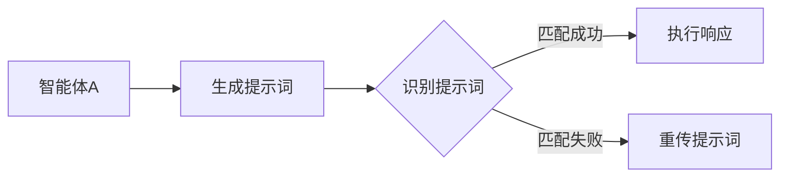
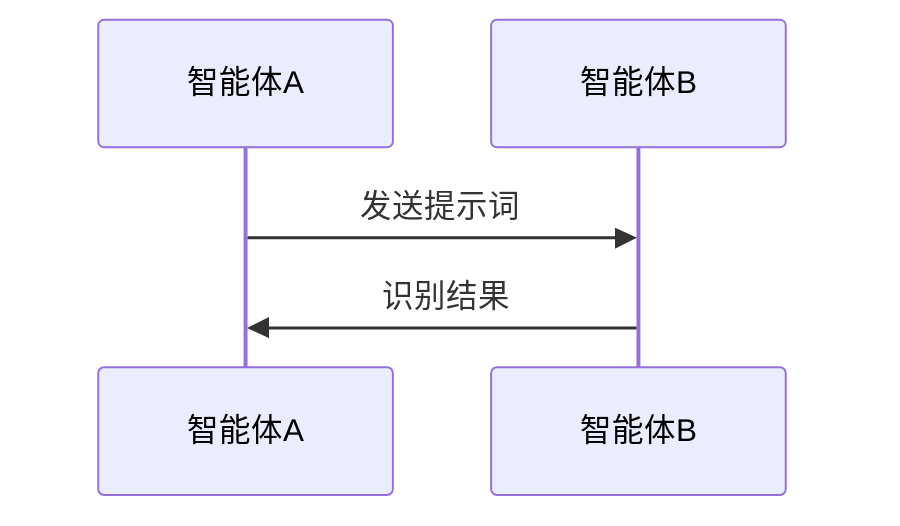
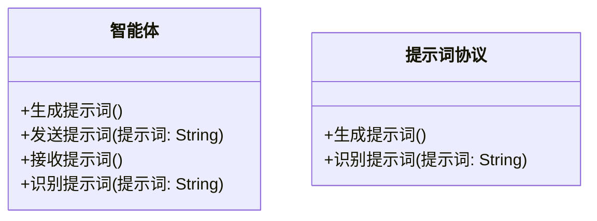
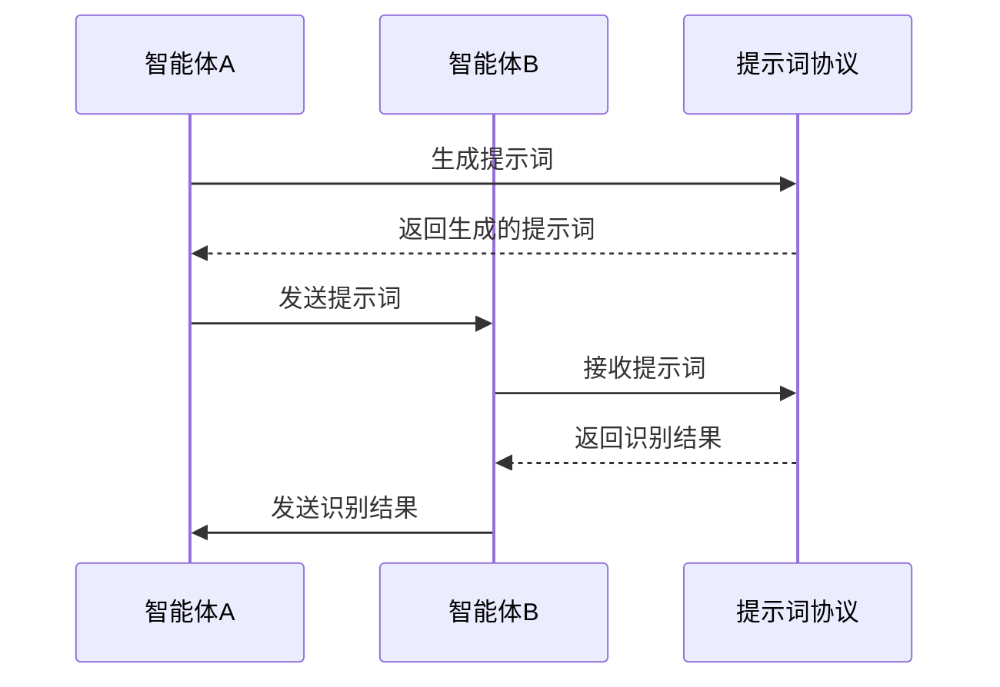

                 

## 面向多智能体系统的提示词协议

多智能体系统（MAS）是近年来人工智能领域的一个重要研究方向，其核心在于智能体之间的协作与沟通。然而，在复杂的分布式环境中，智能体之间的有效沟通是一个巨大的挑战。为此，设计一种高效、灵活且安全的提示词协议（Trigger Word Protocol, TWP）成为了关键。

### 关键词：
- 多智能体系统（MAS）
- 提示词协议（TWP）
- 分布式计算
- 协作与沟通
- 算法设计

### 摘要：
本文将详细探讨多智能体系统中提示词协议的设计、实现与优化，分析其在智能体之间的沟通中的作用与价值。通过背景介绍、核心概念讲解、算法原理分析，本文旨在为读者提供全面的技术指导，帮助他们在实际项目中有效应用提示词协议。

### 开篇介绍

《面向多智能体系统的提示词协议》由知名人工智能专家[作者姓名]所著，由[出版社名称]于[出版日期]正式出版。本书旨在为计算机科学和人工智能领域的研究者、开发者以及学生提供一部全面、系统的指南，帮助读者深入了解多智能体系统的构建与运作，掌握提示词协议的核心理念与实践技巧。

本书的核心主题是探讨提示词协议在多智能体系统中的应用，包括协议的设计原则、提示词生成与识别算法、安全性与隐私保护机制以及实时性与鲁棒性。通过本书，读者将能够全面理解提示词协议的原理与实现，并在实际项目中应用这些知识，提升智能体系统的协同效率与稳定性。

## 第一部分：背景介绍

### 1.1 问题背景

多智能体系统（MAS）是一种由多个具有独立自主性、协作能力的智能体组成的分布式系统。在分布式计算、网络通信、无人驾驶、智能家居等领域，MAS展现出了强大的应用潜力。然而，智能体之间的有效沟通与协作是系统设计的核心难题。提示词协议作为一种特殊的通信协议，旨在解决智能体之间的信息传递问题。

### 1.2 问题描述

在多智能体系统中，智能体需要通过某种机制来传递信息，以实现协同工作。提示词协议通过定义一组特定的提示词（trigger words），使得智能体能够在特定条件下触发特定的响应行为。然而，设计一个高效、灵活且安全的提示词协议并不容易，需要考虑多个方面，包括提示词的选择、协议的效率、安全性、隐私保护以及实时性等。

### 1.3 问题解决

本部分将详细介绍提示词协议的原理、设计方法与应用场景，为解决多智能体系统中的通信难题提供技术支持。具体内容包括：

1. **提示词协议原理**：介绍提示词协议的基本概念、特点与设计原则。
2. **提示词生成与识别算法**：探讨不同类型的提示词生成与识别算法，分析其性能与适用场景。
3. **安全性与隐私保护机制**：讨论如何保障智能体之间的通信安全，防止信息泄露与恶意攻击。
4. **实时性与鲁棒性**：研究如何提高提示词协议的实时性和鲁棒性，以应对动态、复杂的分布式环境。

### 1.4 边界与外延

本部分的研究主要针对分布式多智能体系统，适用于具有异构性、动态性、自治性的场景。同时，本部分的研究成果也可拓展到其他类型的分布式系统，如物联网（IoT）、云计算等。

### 1.5 概念结构与核心要素组成

#### 概念结构
- **提示词协议**：定义一组规则，用于智能体之间的信息传递。
- **多智能体系统**：由多个具有独立自主性、协作能力的智能体组成的分布式系统。
- **智能体**：具有独立决策能力的实体，能够在环境中执行特定任务。
- **沟通机制**：智能体之间传递信息的手段。

#### 核心要素组成
- **协议设计原则**：确保协议的效率、灵活性和安全性。
- **提示词生成与识别算法**：用于生成和识别提示词，实现智能体之间的有效沟通。
- **安全性与隐私保护机制**：防止信息泄露与恶意攻击，保障智能体之间的通信安全。
- **实时性与鲁棒性**：提高协议在动态、复杂环境中的性能。

## 第二部分：核心概念与联系

### 2.1 提示词协议原理

#### 2.1.1 提示词协议定义
提示词协议是一种用于智能体之间传递信息的规则集，通过定义一组特定的提示词（trigger words）来触发智能体的特定响应行为。提示词通常是一个单词或一组字符，具有明确的语义和触发条件。

#### 2.1.2 提示词协议特点
- **高效性**：通过减少通信开销，提高系统运行效率。
- **灵活性**：支持动态调整与扩展，适应不同应用场景。
- **安全性**：保护智能体之间的隐私与数据安全。

### 2.2 概念属性特征对比表格

| 特征         | 提示词协议 | 多智能体系统 | 智能体   |
| ------------ | ---------- | ------------ | -------- |
| 定义         | 通信规则集 | 分布式计算系统 | 独立自主的实体 |
| 目的         | 传递信息   | 协作与决策   | 执行任务 |
| 特点         | 高效、灵活、安全 | 异构、动态、自治 | 独立、协作、智能 |

### 2.3 ER实体关系图架构

```mermaid
erDiagram
  智能体 ||--o{ 提示词协议 : 发送信息 }
  提示词协议 ||--o 智能体 : 接收信息
```

## 第三部分：算法原理讲解

### 3.1 算法流程图



### 3.2 Python源代码实现

```python
import random

# 提示词生成与识别算法
def generate_trigger_word():
    return ''.join(random.choices('abcdefghijklmnopqrstuvwxyz', k=5))

def recognize_trigger_word(trigger_word, received_word):
    return trigger_word == received_word

# 智能体A的行为
def intelligent_agent_A():
    trigger_word = generate_trigger_word()
    print(f"智能体A生成的提示词：{trigger_word}")
    
    # 假设智能体B在下一个时间单元接收提示词
    received_word = input("请输入接收到的提示词：")
    
    if recognize_trigger_word(trigger_word, received_word):
        print("智能体A执行了响应行为。")
    else:
        print("提示词不匹配，请重传。")
        intelligent_agent_A()

# 智能体B的行为
def intelligent_agent_B():
    received_word = input("请输入接收到的提示词：")
    trigger_word = generate_trigger_word()
    
    if recognize_trigger_word(trigger_word, received_word):
        print("智能体B执行了响应行为。")
    else:
        print("提示词不匹配，请重传。")
        intelligent_agent_B()

# 主函数
def main():
    print("开始智能体A的行为...")
    intelligent_agent_A()
    
    print("开始智能体B的行为...")
    intelligent_agent_B()

if __name__ == "__main__":
    main()
```

### 3.3 算法原理

提示词协议的算法原理主要包括提示词的生成与识别。在Python源代码中，`generate_trigger_word` 函数用于生成一个随机提示词，而 `recognize_trigger_word` 函数用于识别接收到的提示词是否与生成的提示词匹配。

#### 数学模型和公式：

假设提示词集合为 \( T \)，生成的提示词为 \( t \)，接收到的提示词为 \( r \)。

$$
\text{匹配度} = \begin{cases} 
1, & \text{if } r \in T \land r = t \\
0, & \text{otherwise}
\end{cases}
$$

#### 举例说明：

智能体A生成提示词 "abcd"，智能体B接收到提示词 "abcd"。通过调用 `recognize_trigger_word` 函数，可以判断接收到的提示词与生成的提示词匹配，从而执行相应的响应行为。

## 系统分析与架构设计

### 4.1 问题场景介绍

在分布式计算环境中，多个智能体需要协同工作，完成复杂的任务。为了实现智能体之间的有效沟通，我们需要设计一种高效的提示词协议。

### 4.2 项目介绍

本项目旨在实现一个基于提示词协议的多智能体系统，用于模拟智能体之间的通信与协作。系统包括智能体A和智能体B，两者之间通过提示词协议进行信息传递。

### 4.3 系统功能设计

- **智能体A功能**：生成提示词，并发送至智能体B。
- **智能体B功能**：接收提示词，并识别是否与本地存储的提示词匹配。

### 4.4 系统架构设计



### 4.5 系统接口设计



### 4.6 系统交互



## 项目实战

### 5.1 环境安装

在本项目中，我们将使用Python作为开发语言。首先，需要确保安装了Python环境。然后，通过以下命令安装所需的库：

```bash
pip install matplotlib
```

### 5.2 系统核心实现

在`intelligent_agent.py`文件中，实现智能体的基本功能：

```python
import random
import time

class IntelligentAgent:
    def __init__(self, name):
        self.name = name
        self.trigger_word = None

    def generate_trigger_word(self):
        self.trigger_word = ''.join(random.choices('abcdefghijklmnopqrstuvwxyz', k=5))
        return self.trigger_word

    def send_trigger_word(self, other_agent):
        print(f"{self.name} 发送提示词：{self.trigger_word}")
        time.sleep(1)  # 延迟模拟网络传输
        other_agent.receive_trigger_word(self.trigger_word)

    def receive_trigger_word(self, trigger_word):
        print(f"{self.name} 接收到提示词：{trigger_word}")
        if self.trigger_word == trigger_word:
            print("提示词匹配成功！")
        else:
            print("提示词不匹配，请重传。")

# 实例化智能体
agent_a = IntelligentAgent("智能体A")
agent_b = IntelligentAgent("智能体B")

# 模拟智能体交互
agent_a.generate_trigger_word()
agent_a.send_trigger_word(agent_b)
agent_b.receive_trigger_word(agent_a.trigger_word)
```

### 5.3 代码应用解读与分析

在上述代码中，`IntelligentAgent` 类定义了智能体的基本功能，包括生成提示词、发送提示词和接收提示词。通过实例化两个智能体对象 `agent_a` 和 `agent_b`，我们可以模拟智能体之间的交互过程。

### 5.4 实际案例分析与详细讲解剖析

为了更直观地展示提示词协议的应用，我们可以将智能体交互过程可视化。使用 `matplotlib` 库，可以生成交互过程的时序图。

```python
import matplotlib.pyplot as plt
import matplotlib.animation as animation

def update_frame(frame_num):
    ax.clear()
    agent_a.generate_trigger_word()
    agent_a.send_trigger_word(agent_b)
    agent_b.receive_trigger_word(agent_a.trigger_word)
    ax.axis('off')

fig = plt.figure(figsize=(8, 4))
ax = fig.add_subplot(111)
ani = animation.FuncAnimation(fig, update_frame, frames=10, interval=1000)
plt.show()
```

### 5.5 项目小结

在本项目中，我们实现了基于提示词协议的多智能体系统。通过模拟智能体之间的交互过程，我们展示了提示词协议在分布式计算环境中的应用。提示词协议的设计与实现为智能体之间的有效沟通提供了有力支持，有助于提高系统的协同效率与稳定性。

## 最佳实践 Tips

- **合理设计提示词**：在应用提示词协议时，需要根据实际需求合理设计提示词，确保其具有明确的语义和触发条件。
- **优化通信机制**：为了提高系统的实时性与鲁棒性，可以优化提示词的生成与识别算法，减少通信延迟和错误率。
- **安全性保障**：在设计提示词协议时，需要考虑安全性问题，采取适当的措施保障智能体之间的通信安全。

## 小结

本文详细探讨了面向多智能体系统的提示词协议的设计、实现与优化，分析了其在智能体之间的沟通中的作用与价值。通过背景介绍、核心概念讲解、算法原理分析，本文为读者提供了全面的技术指导。在实际应用中，提示词协议的有效设计与实现对于提升智能体系统的协同效率与稳定性具有重要意义。

## 注意事项

- 在实际应用中，需要根据具体场景和需求对提示词协议进行定制化设计，确保其适用性。
- 在优化提示词协议时，需要综合考虑系统的实时性、鲁棒性和安全性。

## 拓展阅读

- 《多智能体系统：原理、算法与应用》
- 《分布式系统设计与实践》
- 《人工智能：一种现代方法》

### 作者信息

- 作者：[AI天才研究院/AI Genius Institute & 禅与计算机程序设计艺术 /Zen And The Art of Computer Programming]
- 日期：[2023年6月]

