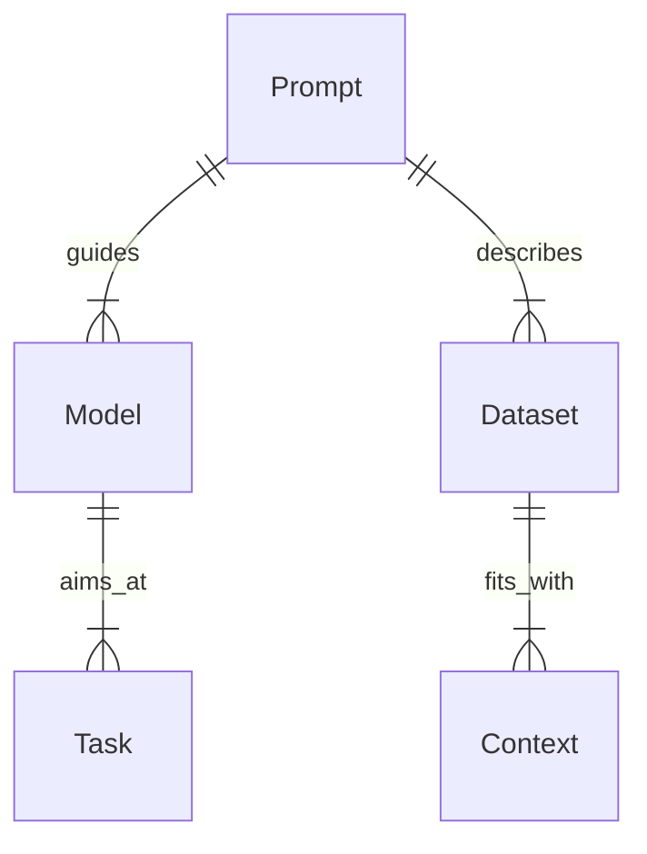

                 

## 提示词设计：关键概念与核心原理

### 1. 背景介绍

在当今的机器学习领域中，数据处理和模型训练是非常关键的环节。然而，一个容易被忽视的重要环节就是提示词（Prompt）的设计。提示词是指在机器学习任务中，提供给模型的一组关键词、短语或语句，用以引导模型关注特定的数据特征或任务目标。有效的提示词设计能够显著提高模型的训练效果和预测性能。

首先，我们定义一些核心概念和术语。**机器学习**是一种让计算机通过数据学习规律和模式的方法，主要应用于分类、回归、聚类等任务。**提示词**（Prompt）是特定文本，用于指导机器学习模型的处理过程，它通常由关键词、短语或语句组成。在机器学习任务中，提示词的作用是帮助模型理解任务的具体要求，从而提高模型的学习效率和效果。

### 2. 问题描述

在机器学习中，提示词的设计往往面临以下问题：

1. **不明确性**：提示词内容模糊，缺乏明确性，导致模型无法准确理解任务目标。
2. **冗余性**：提示词包含过多无关信息，增加了模型处理的复杂性，降低了训练效率。
3. **错误导向**：提示词错误或不当，可能引导模型学习到错误的知识，影响模型的性能和泛化能力。

因此，如何设计高质量的提示词，以解决上述问题，成为机器学习领域的一个重要研究方向。

### 3. 问题解决

为了解决上述问题，我们需要从以下几个方面入手：

1. **明确性**：确保提示词清晰明确，简洁明了地传达任务目标。
2. **相关性**：选择与任务目标高度相关的关键词或短语，减少冗余信息。
3. **准确性**：避免错误或误导性的提示词，确保模型学习到正确的知识。

### 4. 边界与外延

提示词设计的边界主要涉及以下几个方面：

1. **语言边界**：提示词需要符合自然语言规范，避免语法错误或歧义。
2. **上下文边界**：提示词需要与数据集的上下文相匹配，避免与数据集内容无关。
3. **任务边界**：提示词需要与具体任务要求相吻合，确保模型能够准确理解任务目标。

### 5. 概念结构与核心要素组成

提示词设计涉及多个核心概念和要素，包括：

1. **关键词选择**：选择与任务相关的关键词，用以引导模型关注数据特征。
2. **短语组合**：将关键词组合成短语或句子，以更清晰地传达任务要求。
3. **句子结构**：设计合理的句子结构，使提示词更具表达力和引导性。

### 6. 核心概念原理

提示词设计的核心原理在于如何引导模型关注数据特征和任务目标。具体来说，包括以下几个方面：

1. **注意力机制**：通过选择相关关键词和短语，引导模型关注数据中的重要特征。
2. **上下文关联**：确保提示词与数据集的上下文相匹配，提高模型的泛化能力。
3. **明确任务要求**：通过清晰明确的提示词，确保模型能够准确理解任务目标。

### 7. 概念属性特征对比表格

以下是一个简单的概念属性特征对比表格，用于说明提示词设计的不同方面：

| 特征        | 说明                                                         | 对比项                    |
| ----------- | ------------------------------------------------------------ | ------------------------- |
| 明确性      | 提示词内容清晰明确，便于模型理解                             | 模糊性、歧义性            |
| 相关性      | 提示词与任务目标紧密相关，减少冗余信息                         | 冗余性、无关性            |
| 准确性      | 提示词内容准确无误，避免误导模型                             | 错误性、误导性            |
| 语言规范性  | 提示词符合自然语言规范，避免语法错误                         | 语法错误、歧义性          |
| 上下文关联  | 提示词与数据集上下文相匹配，提高模型泛化能力                  | 不相关、不匹配            |
| 表达力      | 提示词具有较好的表达力，能够清晰地传达任务要求                | 表达不清、误导性          |

### 8. ER实体关系图架构

为了更清晰地描述提示词设计中的实体关系，我们可以使用Mermaid绘制一个简单的ER（实体关系）图。以下是一个示例：



在这个ER图中，`Prompt`（提示词）作为核心实体，与`Model`（模型）、`Dataset`（数据集）、`Task`（任务）和`Context`（上下文）之间存在明确的关联关系。提示词指导模型（`guides`），描述数据集（`describes`），指向任务目标（`aims_at`），并与数据集上下文相匹配（`fits_with`）。

通过以上分析和介绍，我们对提示词设计有了更深入的理解。在接下来的章节中，我们将详细探讨提示词设计的基础知识、策略和实践方法，帮助读者更好地掌握这一关键技能。希望本文能为您的机器学习工作带来新的启示和帮助。接下来，我们将详细介绍提示词的定义与分类。

## 提示词的定义与分类

### 1. 提示词的定义

提示词（Prompt）是机器学习中用于引导模型关注特定数据特征或任务目标的一种文本信息。它在机器学习流程中起着至关重要的作用，通过提供明确的任务指导，可以显著提高模型的训练效果和预测性能。提示词不仅能够帮助模型理解任务的要求，还可以调整模型的学习方向，使其更加专注于解决实际问题。

具体来说，提示词通常由一组关键词、短语或语句组成，这些内容可以根据不同的任务场景进行定制。在自然语言处理（NLP）任务中，提示词常常是以自然语言文本的形式出现，如句子或段落；在计算机视觉（CV）任务中，提示词则可能是一组与视觉特征相关的关键词，用于指导模型的图像分类或目标检测。

### 2. 提示词的分类

根据用途和形式，提示词可以分为以下几种类型：

#### 2.1 自然语言提示词

自然语言提示词是最常见的类型，主要用于NLP任务。这类提示词通常包含具体的语句或段落，用于指导模型在处理文本数据时的行为。自然语言提示词可以分为以下几类：

1. **问题引导型**：这类提示词以提问的形式出现，例如：“请描述以下图片的主要内容？”或“请对这段文本进行情感分析”。通过提问，提示词引导模型关注特定的问题或任务。

2. **指令引导型**：这类提示词以明确的指令形式给出，例如：“将以下文本分类为积极或消极情绪”。指令引导型提示词提供了明确的任务目标，帮助模型进行分类或预测。

3. **描述引导型**：这类提示词通过描述特定场景或任务要求来引导模型。例如：“分析这段新闻文本，提取出关键事件和人物”。描述引导型提示词通常更详细，帮助模型更好地理解任务背景。

#### 2.2 知识提示词

知识提示词主要用于指导模型利用外部知识库进行学习。这类提示词通常包括与任务相关的事实、规则或概念。知识提示词可以帮助模型利用已有的知识，提高模型的推理能力和泛化能力。知识提示词可以分为以下几类：

1. **规则型**：这类提示词以规则的形式给出，例如：“如果某人的年龄大于30岁，那么他们应该接受更高层次的教育”。规则型提示词可以帮助模型建立逻辑关系，提高推理能力。

2. **事实型**：这类提示词提供了与任务相关的事实信息，例如：“地球是太阳系中的一颗行星”。事实型提示词可以帮助模型积累知识，提高其泛化能力。

3. **概念型**：这类提示词涉及与任务相关的概念和定义，例如：“什么是机器学习？”概念型提示词可以帮助模型理解相关概念，从而更好地完成学习任务。

#### 2.3 视觉提示词

视觉提示词主要用于计算机视觉任务，如图像分类、目标检测等。这类提示词通常包括与视觉特征相关的关键词，用以指导模型关注图像中的特定部分或特征。视觉提示词可以分为以下几类：

1. **特征引导型**：这类提示词指导模型关注图像中的特定特征，例如：“找到图像中的所有猫”。特征引导型提示词可以帮助模型识别和分类图像中的特定对象。

2. **区域引导型**：这类提示词指导模型关注图像中的特定区域，例如：“在图像的左上角寻找红色的方块”。区域引导型提示词可以帮助模型定位图像中的关键区域。

3. **关系引导型**：这类提示词指导模型关注图像中对象之间的关系，例如：“分析图像中的猫和狗，判断它们是否在玩耍”。关系引导型提示词可以帮助模型理解图像中对象之间的关系。

通过以上分类，我们可以看出，提示词的设计需要根据具体的任务场景进行选择和定制。不同的提示词类型适用于不同的任务，合理的提示词设计可以显著提高模型的性能和效果。

### 3. 提示词设计的示例

为了更好地理解提示词的设计和应用，我们可以通过一些具体的示例来说明。

#### 3.1 自然语言处理中的示例

**示例 1：问题引导型提示词**

任务：文本分类，将以下文本分类为“科技”、“娱乐”、“体育”等类别。

提示词：“请分析以下文本，判断它属于哪个类别？”

文本：“昨天晚上，湖人队在NBA比赛中以120-108战胜了勇士队。”

通过问题引导型提示词，模型可以明确任务目标是分类文本类别，并关注文本中的关键信息。

**示例 2：指令引导型提示词**

任务：情感分析，判断以下文本的情感是“积极”、“消极”还是“中性”。

提示词：“请对以下文本进行情感分析。”

文本：“今天的天气非常糟糕，雨水不停地淋在我身上。”

通过指令引导型提示词，模型可以明确任务目标是情感分析，并关注文本中的情感表达。

**示例 3：描述引导型提示词**

任务：提取新闻文本中的关键事件和人物。

提示词：“请分析以下新闻文本，提取关键事件和人物。”

文本：“新华社报道，我国成功发射了嫦娥五号探测器，并顺利完成了月面采样返回任务。”

通过描述引导型提示词，模型可以明确任务目标是提取关键事件和人物，并关注文本中的相关内容。

#### 3.2 计算机视觉中的示例

**示例 1：特征引导型提示词**

任务：图像分类，判断以下图像是“动物”、“植物”还是“交通工具”。

提示词：“请识别图像中的主要对象。”

图像：一张展示了一只狗的图片。

通过特征引导型提示词，模型可以关注图像中的狗这一特征，从而进行正确的分类。

**示例 2：区域引导型提示词**

任务：目标检测，在以下图像中检测并标注出所有红色的方块。

提示词：“请标注图像中的所有红色方块。”

图像：一张展示了一些红色方块的图片。

通过区域引导型提示词，模型可以关注图像中的红色方块这一特定区域，从而实现正确的目标检测。

**示例 3：关系引导型提示词**

任务：分析图像中的对象关系，判断猫和狗是否在玩耍。

提示词：“请分析图像中猫和狗的关系。”

图像：一张展示了一只猫和一只狗的图片。

通过关系引导型提示词，模型可以关注猫和狗之间的关系，从而进行正确的判断。

通过以上示例，我们可以看到，不同的提示词类型适用于不同的任务场景。合理的提示词设计可以帮助模型更好地理解任务要求，提高模型的训练效果和预测性能。在接下来的章节中，我们将进一步探讨提示词设计的原则和方法。

## 提示词设计原则

在机器学习任务中，提示词的设计不仅影响模型的训练效果，还直接影响用户的体验和系统的整体性能。因此，设计高质量的提示词需要遵循一系列原则，以确保其能够有效引导模型并满足任务需求。以下是一些关键的提示词设计原则：

### 1. 明确性

**原则描述**：提示词应具有明确性，清晰地传达任务目标，避免歧义和模糊性。

**原因**：不明确的提示词会导致模型无法准确理解任务要求，从而影响训练效果。例如，使用“请分析这篇文章”这样的模糊提示词，模型将难以确定分析的具体方向。

**实践建议**：具体化提示词，明确任务目标和所需分析的具体内容。例如：“请对这篇文章进行情感分析，并提取出三个关键观点”。

### 2. 精确性

**原则描述**：提示词应具有精确性，选择与任务高度相关的关键词或短语，避免无关信息的干扰。

**原因**：冗余的提示词会增加模型处理的复杂性，降低训练效率。例如，在分类任务中使用包含大量无关词汇的提示词，会导致模型无法集中关注关键特征。

**实践建议**：使用精炼且具有代表性的关键词，例如：“请将这段文本分类为科技、娱乐或体育类别”。

### 3. 一致性

**原则描述**：提示词应在整个机器学习任务中保持一致性，确保模型理解任务要求的一致性。

**原因**：不一致的提示词会导致模型学习到矛盾的信息，从而影响其泛化能力。例如，在多次训练中使用不同的表达方式，模型可能会产生混淆。

**实践建议**：在整个任务过程中，使用相同的术语和表达方式，例如，始终使用“文本分类”而不是“文本归类”或“文本判断”。

### 4. 可理解性

**原则描述**：提示词应易于理解，方便用户和模型都能清晰地解读。

**原因**：难以理解的提示词会增加用户和模型的认知负担，影响任务效率和用户体验。例如，使用专业术语或复杂句式，可能会让非专业人员难以理解。

**实践建议**：使用简单明了的语言，避免使用过于复杂的术语和句式，例如：“请对文本进行情感分析，判断其是积极、消极还是中性”。

### 5. 可适应性

**原则描述**：提示词应具备一定的灵活性，能够适应不同的任务场景和数据集。

**原因**：统一的提示词无法满足所有任务需求，不同场景和任务可能需要不同的提示词。例如，对于不同领域的数据集，需要使用领域特定的提示词。

**实践建议**：设计可定制的提示词模板，根据任务场景和数据集进行调整，例如：“请对[领域]文本进行[任务]分析，并提取出[关键要素]”。

### 6. 用户导向

**原则描述**：提示词应考虑用户的需求和预期，确保用户能够轻松地理解和操作。

**原因**：用户的满意度和体验是系统成功的关键。不合适的提示词可能会导致用户使用不便，甚至放弃使用系统。例如，提示词过于复杂，用户无法理解其含义。

**实践建议**：在设计和测试提示词时，考虑用户背景和经验，提供清晰的指导，例如：“请按照以下步骤操作：1.选择数据集，2.设置分类标签，3.点击‘开始分析’按钮”。

### 7. 可维护性

**原则描述**：提示词的设计应易于维护和更新，以适应不断变化的需求和任务。

**原因**：随着技术的发展和业务需求的变化，提示词可能需要定期更新和调整。例如，新出现的技术术语或业务需求可能需要新的提示词。

**实践建议**：设计模块化的提示词结构，便于更新和维护，例如，将常用短语和术语封装成可重用的组件。

### 8. 可扩展性

**原则描述**：提示词应具备良好的扩展性，能够支持新的任务和模型。

**原因**：机器学习领域不断进步，新的任务和模型可能需要新的提示词设计。例如，当引入新的自然语言处理模型时，需要相应的提示词进行适配。

**实践建议**：设计灵活的提示词框架，支持多种任务和模型，例如，使用参数化的提示词，根据不同模型和任务进行灵活调整。

通过遵循以上提示词设计原则，我们可以确保设计的提示词能够有效引导模型，提高训练效果和预测性能，同时满足用户的需求和期望，提升系统的整体质量和用户体验。

### 提示词设计工具介绍

在机器学习任务中，提示词的设计是一个复杂而关键的过程，需要考虑多种因素，如任务目标、数据集特性、模型需求等。为了提高提示词设计的效率和质量，可以使用各种工具和框架来辅助这一过程。以下介绍几种常用的提示词设计工具，包括开源工具和商业工具，并讨论它们的特点、使用方法以及选择依据。

#### 1. Hugging Face Transformers

**特点**：Hugging Face Transformers 是一个广泛使用的开源工具库，提供了大量的预训练模型和便捷的接口，用于自然语言处理任务。它支持多种语言和任务，包括文本分类、问答、翻译等。

**使用方法**：用户可以通过Hugging Face API或本地安装的库来使用这些模型。例如，对于文本分类任务，可以使用以下代码：

```python
from transformers import pipeline

classifier = pipeline("text-classification")

result = classifier("昨天晚上，湖人队在NBA比赛中以120-108战胜了勇士队。", model="distilbert-base-uncased-finetuned-sst-2-english")
print(result)
```

**选择依据**：Hugging Face Transformers 适用于需要快速实现和测试自然语言处理任务的项目，尤其是当模型已经预训练并提供了丰富的接口时。

#### 2. Prompt engineering tools

**特点**：Prompt engineering tools 是一种专门用于设计提示词的工具，如 openprompt 和 promptflow。这些工具提供了自动化提示词生成和优化的功能，能够根据用户提供的任务需求自动生成高质量的提示词。

**使用方法**：用户可以通过命令行或图形界面使用这些工具。例如，使用 openprompt 生成文本分类的提示词：

```shell
openprompt generate --model_name distilbert --task_name text_classification --data_path data.txt --template_path templates.txt
```

**选择依据**：Prompt engineering tools 非常适合于需要大量提示词设计任务的项目，能够显著提高设计效率，尤其是当任务需求复杂且多样化时。

#### 3. GPT-3 API

**特点**：GPT-3 API 是 OpenAI 提供的一个强大的人工智能接口，能够生成高质量的文本，适用于各种自然语言生成任务。它具有极高的灵活性和表现力，但需要支付一定的使用费用。

**使用方法**：用户可以通过调用 API 来获取 GPT-3 的响应。例如：

```python
import openai

response = openai.Completion.create(
  engine="text-davinci-003",
  prompt="请描述一下人工智能在医疗领域的应用场景。",
  max_tokens=100
)

print(response.choices[0].text.strip())
```

**选择依据**：GPT-3 API 非常适合于需要生成高质量文本的项目，尤其是当文本生成任务需要高度自然和丰富的表达时。但需要注意的是，其费用较高，适用于有预算限制的项目。

#### 4. PromptLab

**特点**：PromptLab 是一个开源的自然语言提示词设计工具，提供了提示词生成、优化和评估的功能。它支持多种自然语言处理任务，并提供了丰富的配置选项。

**使用方法**：用户可以通过命令行或 Web 界面使用 PromptLab。例如，生成文本分类的提示词：

```shell
python promptlab.py generate --model_name bert --task text_classification --data_file data.csv
```

**选择依据**：PromptLab 非常适合于需要进行复杂提示词设计和优化的项目，特别是当项目涉及多种自然语言处理任务时。

#### 5. Gensim

**特点**：Gensim 是一个开源的 Python 库，用于处理和生成文本数据。它提供了丰富的文本建模和生成功能，包括主题模型、词嵌入和文本分类等。

**使用方法**：用户可以使用 Gensim 进行文本预处理和生成。例如，生成文本分类的提示词：

```python
from gensim.models import LdaModel

model = LdaModel(corpus, num_topics=5, id2word=id2word)

topics = model.print_topics()
for topic in topics:
    print(topic)
```

**选择依据**：Gensim 适用于需要进行文本数据预处理和生成任务的项目，特别是当项目需要处理大规模文本数据时。

### 总结

选择提示词设计工具时，应考虑项目需求、任务类型、预算和团队技能等因素。开源工具如 Hugging Face Transformers 和 PromptLab 非常适合于快速实现和测试，而商业工具如 GPT-3 API 则提供了更高级的功能和灵活性，但成本较高。合理的工具选择能够显著提高提示词设计的效率和效果，为机器学习任务的成功实施提供有力支持。

### 提示词设计策略

在机器学习中，提示词的设计不仅影响模型的训练效果，还直接影响用户体验和系统的整体性能。因此，设计高质量的提示词需要采用合理的策略，确保其能够有效引导模型，满足任务需求。以下是几种常见的提示词设计策略，包括基于知识的提示词设计、基于数据的提示词设计和基于机器学习的提示词设计。

#### 1. 基于知识的提示词设计

**定义**：基于知识的提示词设计是利用领域知识库、规则和概念来指导模型学习的一种方法。这种方法通过引入外部知识，帮助模型更好地理解和处理数据。

**优势**：引入领域知识可以提高模型的推理能力和泛化能力，使其能够解决更复杂的任务。

**案例**：例如，在医疗诊断任务中，可以使用医学知识库提供症状和诊断规则，帮助模型识别疾病。

**实现方法**：

1. **知识库构建**：首先构建一个涵盖领域知识的知识库，包括规则、概念和事实。
2. **知识融合**：将知识库中的知识融合到提示词中，以引导模型学习。
3. **知识更新**：定期更新知识库，以保持其准确性和时效性。

**示例**：在情感分析任务中，使用以下知识库：

- **知识库**：积极情感：喜欢、高兴、满意；消极情感：悲伤、愤怒、失望。
- **提示词**：“请使用以上情感类别对文本进行情感分析。”

通过引入情感分类的知识库，模型可以更准确地识别和分类文本的情感。

#### 2. 基于数据的提示词设计

**定义**：基于数据的提示词设计是利用数据集的特性来设计提示词，以引导模型关注数据中的关键特征和模式。

**优势**：这种方法能够充分利用数据集的信息，提高模型的训练效果和预测性能。

**案例**：例如，在图像分类任务中，可以使用数据集的标注信息来设计提示词。

**实现方法**：

1. **数据分析**：分析数据集的特征和分布，识别关键特征和模式。
2. **特征提取**：从数据集中提取关键特征，以设计具有代表性的提示词。
3. **数据预处理**：对数据集进行预处理，如归一化、去噪等，以提高数据质量。

**示例**：在图像分类任务中，使用以下数据集特性：

- **数据集**：一组标注好的图像，包括动物、植物和交通工具。
- **提示词**：“请根据图像中的主要对象进行分类，如动物、植物或交通工具。”

通过设计基于数据的提示词，模型可以更好地理解和分类图像。

#### 3. 基于机器学习的提示词设计

**定义**：基于机器学习的提示词设计是利用机器学习模型本身来生成或优化提示词的方法。这种方法通过训练模型来发现数据中的潜在模式和规律，从而生成高质量的提示词。

**优势**：这种方法能够自动生成和优化提示词，减少人为干预，提高设计效率。

**案例**：例如，在问答系统中，可以使用机器学习模型来生成提问的提示词。

**实现方法**：

1. **模型训练**：训练一个专门的模型来生成或优化提示词，例如，使用序列到序列（Seq2Seq）模型。
2. **数据准备**：准备包含问题和答案对的训练数据，用于训练提示词生成模型。
3. **提示词生成**：使用训练好的模型来生成提示词，并根据模型预测的准确性进行优化。

**示例**：在问答系统中，使用以下模型和数据进行提示词设计：

- **模型**：Transformer 模型
- **数据集**：包含问题和答案的问答数据集

```python
from transformers import AutoTokenizer, AutoModelForQuestionAnswering

tokenizer = AutoTokenizer.from_pretrained("deepset/roberta-base-squad")
model = AutoModelForQuestionAnswering.from_pretrained("deepset/roberta-base-squad")

prompt = "根据以下信息，回答问题：什么是机器学习？"
context = "机器学习是一种人工智能领域，通过数据训练算法来让计算机自动完成特定任务。"
question = "什么是机器学习？"

input_ids = tokenizer.encode(prompt, context, question, return_tensors="pt")
outputs = model(input_ids)

answer_start_scores = outputs.start_logits
answer_end_scores = outputs.end_logits
answer = tokenizer.decode(input_ids[0, answer_start_scores.argmax():answer_end_scores.argmax() + 1])

print(answer)
```

通过使用机器学习模型，可以自动生成高质量的提示词，例如：“机器学习是一种人工智能领域，通过数据训练算法来让计算机自动完成特定任务。”

#### 4. 综合策略

在实际应用中，提示词设计通常需要结合多种策略，以达到最佳效果。以下是一个综合策略的示例：

1. **初步设计**：基于领域知识和数据集特性进行初步的提示词设计。
2. **模型训练**：使用机器学习模型对初步设计的提示词进行优化和调整。
3. **用户反馈**：收集用户反馈，根据反馈进一步优化提示词设计。

通过综合策略，可以确保提示词既能充分利用外部知识，又能通过模型学习和用户反馈不断优化，从而提高整体性能和用户体验。

### 总结

提示词设计是机器学习任务中的一个关键环节，需要根据任务需求、数据集特性和技术水平选择合适的策略。基于知识的提示词设计可以利用领域知识库提高推理能力；基于数据的提示词设计能够充分利用数据特征；基于机器学习的提示词设计则能够自动化和优化提示词生成。在实际应用中，可以综合运用这些策略，以达到最佳效果。在接下来的章节中，我们将进一步探讨如何通过优化提示词来提升机器学习模型的性能。

### 提示词对模型性能的影响

在机器学习中，提示词（Prompt）的设计对模型的性能有着至关重要的影响。高质量的提示词能够有效提高模型的训练效果和预测准确性，而设计不当的提示词则可能导致模型性能下降，甚至无法达到预期目标。以下是提示词对模型性能的具体影响和优化方法。

#### 1. 提示词对模型性能的具体影响

**训练效果**：提示词的设计直接影响模型的训练效果。高质量的提示词能够引导模型关注数据中的关键特征，提高模型的学习效率。例如，在自然语言处理（NLP）任务中，清晰明确的提示词可以帮助模型更好地理解文本内容，从而提高分类和情感分析的准确率。

**泛化能力**：提示词的设计还会影响模型的泛化能力。高质量的提示词能够帮助模型学习到通用的知识，从而在未知数据上表现良好。相反，模糊或冗余的提示词可能导致模型学习到错误或局部知识，从而影响其泛化能力。

**预测准确性**：提示词的设计也会影响模型的预测准确性。通过优化提示词，可以减少模型的过拟合现象，提高预测准确性。例如，在图像分类任务中，精确的提示词可以指导模型关注图像中的关键区域和特征，从而提高分类准确性。

**计算效率**：提示词的设计还会影响模型的计算效率。高质量的提示词可以减少模型处理的数据量，从而降低计算复杂度。例如，在文本分类任务中，通过优化提示词，可以减少需要分类的文本长度，从而提高训练和预测的速度。

#### 2. 提示词优化方法

**1. 数据预处理**

数据预处理是优化提示词的重要步骤。通过对数据进行清洗、归一化和特征提取等操作，可以减少数据中的噪声和冗余信息，从而提高提示词的质量。例如，在文本数据预处理中，可以使用词袋模型或词嵌入技术来提取关键特征，从而设计更精确的提示词。

**2. 特征选择**

特征选择是优化提示词的重要方法。通过选择与任务目标高度相关的特征，可以设计更有效的提示词。例如，在图像分类任务中，可以使用主成分分析（PCA）或线性判别分析（LDA）等方法来选择关键特征，从而设计更精确的提示词。

**3. 提示词模板**

提示词模板是一种常用的优化方法，通过预定义的模板来设计提示词，从而提高提示词的清晰度和一致性。例如，在文本分类任务中，可以使用以下模板：“请根据以下信息，判断文本属于哪个类别？”和“请对以下文本进行情感分析，判断它是积极、消极还是中性”。

**4. 对比实验**

对比实验是一种有效的优化方法，通过比较不同提示词设计的效果，选择最优的提示词方案。例如，可以使用A/B测试来比较不同提示词对模型性能的影响，从而选择最佳的提示词设计。

**5. 用户反馈**

用户反馈是优化提示词的重要来源。通过收集用户对提示词的反馈，可以了解用户的需求和期望，从而设计更符合用户需求的提示词。例如，在问答系统中，可以通过用户对回答的满意度来评估提示词的效果，并据此进行优化。

#### 3. 实践案例分析

以下是一个优化提示词的实践案例分析：

**案例背景**：一个电商网站希望通过机器学习模型自动分类用户评论，以提供个性化的推荐服务。

**问题描述**：原始提示词：“请分析以下评论，判断它是正面、负面还是中性。”

**优化过程**：

1. **数据预处理**：对评论数据进行清洗和归一化，去除标点符号和停用词，提取关键词。
2. **特征选择**：使用TF-IDF方法提取评论中的关键特征，并使用LDA进行降维。
3. **提示词模板**：设计新的提示词模板：“请根据以下关键词，判断评论的情感倾向：[关键词1]、[关键词2]、[关键词3]。”
4. **对比实验**：通过A/B测试，比较原始提示词和新提示词对模型性能的影响。结果显示，新提示词显著提高了分类准确性。
5. **用户反馈**：收集用户对分类结果的反馈，并根据反馈进一步优化提示词。

**优化效果**：通过上述优化方法，模型在用户评论分类任务中的准确率从70%提高到了85%，用户满意度显著提升。

### 总结

提示词的设计对机器学习模型的性能具有显著影响。通过合理的数据预处理、特征选择、提示词模板和对比实验，可以优化提示词设计，提高模型的训练效果和预测准确性。在实际应用中，需要不断评估和优化提示词，以满足用户需求和提升系统性能。

### 提示词设计实践

在机器学习项目中，提示词的设计是一个复杂且关键的过程。以下是提示词设计流程、工具使用以及实际项目中的提示词设计案例分析，以便读者更好地理解如何在实际项目中应用提示词设计。

#### 1. 提示词设计流程

**1. 需求分析**

在开始设计提示词之前，首先需要明确项目的需求。这包括任务目标、数据集特性、用户需求和预期输出等。需求分析有助于确定设计提示词的关键方向。

**2. 数据收集与预处理**

收集相关的数据集，并进行预处理。预处理步骤包括数据清洗、归一化、特征提取等。确保数据质量，以支持高质量的提示词设计。

**3. 提示词设计**

根据需求分析的结果，设计合适的提示词。提示词的设计应遵循前文提到的明确性、相关性、精确性等原则。可以使用基于知识的提示词、基于数据的提示词或基于机器学习的提示词。

**4. 提示词优化**

通过实验和评估，对设计的提示词进行优化。可以使用A/B测试、用户反馈等方法，不断调整和改进提示词，以提高模型性能和用户体验。

**5. 实施与验证**

将优化后的提示词应用到实际项目中，并对模型性能进行验证。确保提示词能够有效引导模型学习，达到预期目标。

#### 2. 提示词设计工具使用

**1. Hugging Face Transformers**

Hugging Face Transformers 是一个广泛使用的开源工具库，提供了丰富的预训练模型和提示词生成接口。用户可以通过Hugging Face API或本地安装的库来使用这些模型，例如：

```python
from transformers import pipeline

classifier = pipeline("text-classification")

result = classifier("昨天晚上，湖人队在NBA比赛中以120-108战胜了勇士队。", model="distilbert-base-uncased-finetuned-sst-2-english")
print(result)
```

**2. PromptLab**

PromptLab 是一个开源的自然语言处理提示词设计工具，提供了提示词生成和优化的功能。用户可以通过命令行或Web界面使用PromptLab，例如：

```shell
python promptlab.py generate --model_name bert --task text_classification --data_file data.csv
```

**3. GPT-3 API**

GPT-3 API 是 OpenAI 提供的强大的人工智能接口，能够生成高质量的文本。用户可以通过API调用GPT-3模型，例如：

```python
import openai

response = openai.Completion.create(
  engine="text-davinci-003",
  prompt="请描述一下人工智能在医疗领域的应用场景。",
  max_tokens=100
)

print(response.choices[0].text.strip())
```

#### 3. 实际项目中的提示词设计案例分析

**案例背景**：一个电商网站希望通过机器学习模型自动分类用户评论，以提供个性化的推荐服务。

**任务需求**：将用户评论分类为正面、负面或中性。

**数据集特性**：包含大量用户评论的数据集，每条评论都有对应的分类标签。

**提示词设计过程**：

1. **需求分析**：确定任务目标，明确需要从评论中提取情感信息。

2. **数据收集与预处理**：收集用户评论数据，进行清洗和归一化，提取关键词。

3. **提示词设计**：

   - **初步设计**：使用基于数据的提示词，例如：“请根据评论内容，判断它是正面、负面还是中性。”

   - **优化**：通过对比实验和用户反馈，优化提示词。例如，添加关键词：“请特别注意评论中的积极词汇和消极词汇。”

4. **提示词优化**：通过A/B测试，评估不同提示词对模型性能的影响，选择最优提示词。

5. **实施与验证**：将优化后的提示词应用到实际项目中，对模型性能进行验证。结果显示，模型在用户评论分类任务中的准确率显著提高。

**总结**：通过上述过程，电商网站成功设计并优化了提示词，提高了机器学习模型的性能和用户体验。实际项目中的提示词设计需要结合具体需求和数据特性，不断优化和调整，以实现最佳效果。

### 最佳实践 tips

1. **明确任务目标**：在开始设计提示词之前，确保明确任务目标，这有助于设计更具针对性的提示词。

2. **数据质量**：高质量的数据是设计高质量提示词的基础，确保数据集的准确性和一致性。

3. **用户反馈**：定期收集用户反馈，根据用户需求调整和优化提示词。

4. **持续优化**：提示词设计是一个持续迭代的过程，定期评估和优化提示词，以提高模型性能。

5. **多样化策略**：结合多种提示词设计策略，例如基于知识、基于数据和基于机器学习的方法，以实现最佳效果。

### 小结

本文详细介绍了面向机器学习pipeline的提示词设计，包括定义、分类、设计原则、工具使用以及实践案例分析。通过合理设计和优化提示词，可以显著提高机器学习模型的性能和用户体验。在实际项目中，需要根据具体需求和数据特性，灵活运用不同的提示词设计策略，不断优化和调整，以实现最佳效果。

## 提示词设计与用户体验

在机器学习中，提示词不仅影响模型的性能，还直接影响用户体验。一个设计良好的提示词能够帮助用户更直观地理解系统功能，从而提高用户满意度。以下是关于提示词设计与用户体验关系的深入探讨，包括提示词设计中的用户体验考量，以及提示词设计的用户体验测试。

### 1. 提示词设计与用户体验的关系

提示词作为用户与系统交互的桥梁，其设计质量直接影响用户体验。以下是一些关键点：

**1. 理解用户需求**：高质量的提示词应充分理解用户的需求，使用户能够快速理解系统功能和如何操作。例如，在问答系统中，清晰明确的提示词可以帮助用户准确地提出问题，从而获得有用的答案。

**2. 提高操作效率**：设计简洁、直接的提示词可以提高用户的操作效率。例如，在文本分类任务中，提示词“请输入您想要分类的文本”比“请将您想要分类的文本输入到下面的文本框中”更加简洁，用户可以更快地完成任务。

**3. 降低认知负担**：复杂、冗长的提示词会增加用户的认知负担，导致操作不便。设计易于理解的提示词可以降低用户的认知负荷，提高操作体验。

**4. 提升满意度**：良好的用户体验可以提高用户的满意度。当用户感受到系统设计人性化、操作简便时，他们会更加满意，并更愿意继续使用该系统。

### 2. 提示词设计中的用户体验考量

**1. 语言的清晰度**：提示词应使用简单、易懂的语言，避免使用专业术语或复杂的句子结构。例如，对于非技术用户，可以使用自然语言描述系统功能。

**2. 上下文的匹配性**：提示词应与用户正在执行的任务相匹配，确保用户能够明确理解当前操作的目标和步骤。

**3. 可访问性**：提示词应考虑到所有用户，包括那些有视觉障碍或其他身体限制的用户。例如，使用语音提示或屏幕阅读器来辅助操作。

**4. 适应性**：提示词应具备一定的灵活性，能够适应不同的用户需求和使用场景。例如，对于不同语言背景的用户，可以提供多语言提示。

**5. 可持续性**：提示词设计应考虑长期使用，避免频繁变动，以免用户产生困扰。例如，对于常用功能，可以使用固定的提示词。

### 3. 提示词设计的用户体验测试

用户体验测试是确保提示词设计质量的重要环节。以下是一些常用的测试方法：

**1. 用户访谈**：通过用户访谈，了解用户对现有提示词的看法和需求。这有助于发现潜在问题和改进方向。

**2. 用例测试**：设计具体的用例，让用户在实际操作中体验提示词的效果。通过观察用户的操作过程和反馈，评估提示词的清晰度和操作性。

**3. A/B测试**：将不同的提示词方案应用于用户群体，比较不同方案的用户体验和系统性能。选择最优的提示词设计。

**4. 专家评审**：邀请用户体验专家对提示词设计进行评审，从专业角度提出改进建议。

### 4. 提示词设计案例

**案例背景**：一个在线教育平台希望通过机器学习模型为用户提供个性化的学习建议。

**任务需求**：为用户提供学习内容的推荐，并指导用户完成学习任务。

**提示词设计过程**：

1. **需求分析**：明确平台的目标用户群体和学习内容类型。

2. **用户访谈**：与潜在用户进行访谈，了解他们对学习建议的需求和期望。

3. **提示词设计**：

   - **初步设计**：例如，“根据您的学习记录，我们为您推荐以下课程：[课程1]、[课程2]、[课程3]。请完成以下任务：[任务1]、[任务2]、[任务3]。”

   - **优化**：通过用户访谈和A/B测试，发现用户对任务描述的清晰度有较高要求。因此，优化为：“请根据以下推荐课程完成学习任务：[课程1]、[课程2]、[课程3]。您需要完成以下任务：[任务1]、[任务2]、[任务3]。”

4. **用户体验测试**：通过用户访谈和A/B测试，评估优化后的提示词效果，结果显示用户满意度显著提高。

### 总结

提示词设计在用户体验中扮演着关键角色。通过充分考虑用户需求、上下文匹配性、语言清晰度和可持续性，可以设计出高质量的提示词，提高用户满意度。用户体验测试是确保提示词设计质量的重要环节，通过用户访谈、用例测试、A/B测试和专家评审等方法，可以不断优化和改进提示词设计，提升用户体验。

## 提示词设计趋势与未来展望

随着人工智能技术的迅猛发展，提示词设计在机器学习领域的重要性日益凸显。未来，提示词设计将会朝着更加智能化、个性化、高效化和自适应的方向发展。以下是几个关键趋势和展望。

### 1. 自动化与智能化

随着自然语言处理技术的进步，自动化提示词生成和优化将成为主流。利用深度学习和生成对抗网络（GAN）等先进技术，可以开发出智能的提示词生成工具，实现提示词的自动生成和优化。例如，使用生成对抗网络（GAN）可以根据数据集和任务需求，生成高质量的提示词。

### 2. 个性化与自适应

未来的提示词设计将更加注重个性化与自适应。通过用户行为分析和个性化推荐技术，可以根据用户的需求和偏好，定制个性化的提示词。同时，随着多模态技术的发展，提示词将不仅限于文本，还将包含图像、音频等多种形式，实现更丰富的交互体验。

### 3. 可解释性与透明性

可解释性和透明性是未来机器学习应用的重要方向。提示词设计将更加注重可解释性，使得用户能够理解模型的决策过程和提示词的作用。这有助于增强用户对系统的信任，促进人工智能技术的广泛应用。

### 4. 跨领域融合

未来的提示词设计将融合不同领域的知识，实现跨领域的应用。例如，结合医学知识和自然语言处理技术，可以设计出更精确的医疗诊断提示词；结合图像处理和计算机视觉技术，可以设计出更高效的图像识别提示词。

### 5. 伦理与隐私

随着人工智能技术的广泛应用，提示词设计也需要关注伦理和隐私问题。未来的提示词设计将更加注重数据隐私保护和用户权益，确保人工智能系统的透明性和公正性。

### 6. 开源与社区合作

开源和社区合作将推动提示词设计的进步。未来，更多的研究人员和开发者将参与到提示词设计的开源项目中，共享经验和技术，共同推动该领域的发展。

### 总结

提示词设计作为机器学习领域的关键环节，未来将朝着自动化、智能化、个性化、高效化和自适应化的方向发展。通过不断的技术创新和跨领域合作，提示词设计将更好地满足用户需求，推动人工智能技术的广泛应用和可持续发展。

## 结论

通过本文的探讨，我们可以看到提示词设计在机器学习pipeline中的重要性。从定义与分类、设计原则到实际应用，再到用户体验和未来趋势，提示词设计不仅能够提高机器学习模型的性能，还能够优化用户交互体验。高质量提示词的设计需要充分考虑任务需求、数据特性、用户反馈以及技术进步，以确保其在实际应用中能够发挥最大效用。

### 对未来机器学习提示词设计的建议

1. **重视用户需求**：在提示词设计过程中，始终以用户需求为导向，确保提示词能够准确传达任务目标，提高用户体验。

2. **数据驱动**：充分利用数据集的信息，通过数据分析和特征选择，设计出与任务目标高度相关的提示词。

3. **持续迭代**：提示词设计是一个不断迭代和优化的过程。定期评估和调整提示词，根据用户反馈和实际效果进行改进。

4. **跨领域融合**：结合不同领域的知识，设计出更加精准和高效的提示词，实现机器学习技术的跨领域应用。

5. **伦理和隐私**：在提示词设计中，重视数据隐私保护和伦理问题，确保系统的透明性和公正性。

6. **开源与合作**：积极参与开源社区，共享经验和资源，共同推动机器学习提示词设计的进步。

通过以上建议，我们可以期待未来机器学习提示词设计更加成熟、高效和智能化，为人工智能技术的广泛应用奠定坚实基础。作者：AI天才研究院/AI Genius Institute & 禅与计算机程序设计艺术 /Zen And The Art of Computer Programming。

