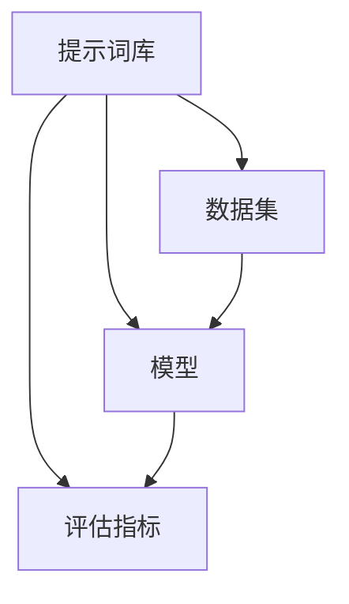
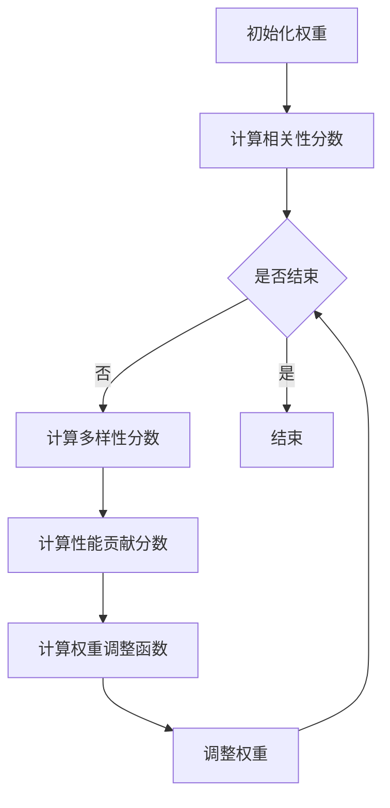
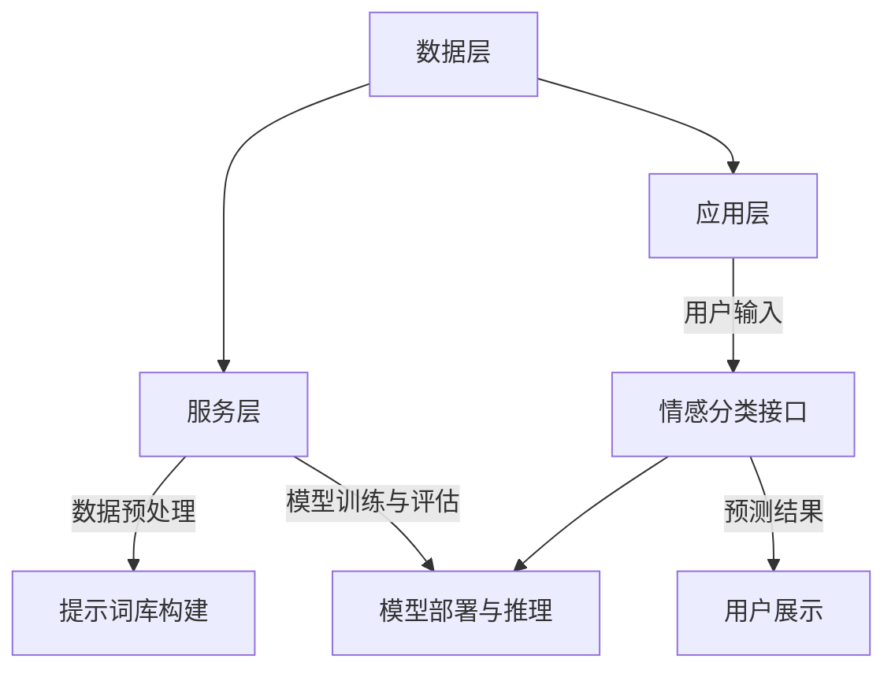
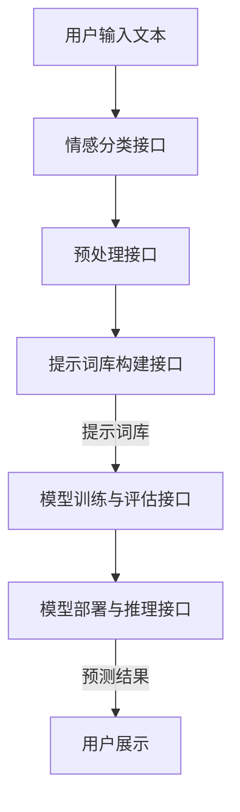

                 

# 面向特定任务的提示词库设计

## 关键词

- 自然语言处理
- 提示词库
- 任务导向
- 数据收集
- 数据预处理
- 模型优化
- 性能评估

## 摘要

随着人工智能技术的迅速发展，自然语言处理（NLP）在众多领域展现出巨大的潜力。提示词库作为NLP任务中的一个核心组件，其设计对于任务性能至关重要。本文将深入探讨面向特定任务的提示词库设计，包括数据收集、预处理、提示词选择与优化，以及评估与优化方法，旨在为NLP研究者提供实用指导。

## 第一步：背景介绍

### 第1章: 问题背景与核心概念

#### 1.1.1 问题背景

自然语言处理（NLP）是人工智能领域的一个重要分支，旨在使计算机能够理解、生成和处理人类语言。近年来，随着深度学习技术的发展，NLP取得了显著进展，例如机器翻译、文本分类、情感分析等任务。

然而，在实际应用中，NLP任务的性能往往受到数据质量和提示词库设计的限制。提示词库是一个包含大量提示词的数据集，这些提示词用于指导模型学习和优化。一个良好的提示词库能够提高模型对特定任务的适应性和性能。

#### 1.1.2 问题描述

设计一个面向特定任务的提示词库面临以下挑战：

- 如何收集和筛选与任务高度相关的数据？
- 如何进行数据预处理以增强提示词库的质量？
- 如何选择和优化提示词以提高模型性能？
- 如何评估和优化提示词库的性能？

这些问题对于实现高效的NLP应用至关重要。

#### 1.1.3 问题解决

本文将从以下方面解决上述问题：

- 研究数据收集与预处理方法，以提高数据质量。
- 探讨提示词选择和优化的原则与方法。
- 引入评估指标，用于衡量提示词库的性能。
- 提供实用的优化方法，以进一步改进提示词库的性能。

#### 1.1.4 边界与外延

本文将关注以下内容：

1. 提示词库的定义与作用。
2. 面向特定任务的需求分析。
3. 提示词库的设计原则和方法。
4. 提示词库的评估和优化。

#### 1.1.5 概念结构与核心要素组成

面向特定任务的提示词库设计涉及以下几个核心要素：

1. 数据集：用于构建和评估提示词库的基础数据。
2. 提示词选择：根据任务需求和模型特性，选择合适的提示词。
3. 提示词优化：通过调整提示词的权重和组合，提高模型性能。
4. 评估指标：用于衡量提示词库的效果和性能。

#### 1.1.6 本章小结

本章介绍了面向特定任务的提示词库设计的相关背景、问题、解决方法以及边界与外延。接下来，我们将进一步探讨核心概念与联系，为后续章节的讨论打下基础。

---

### 第二步：核心概念与联系

#### 第2章: 核心概念原理

在这一章中，我们将详细探讨面向特定任务的提示词库设计中的核心概念和原理。

#### 2.1 提示词库的定义与作用

**2.1.1 提示词库的定义**

提示词库是一个包含大量提示词的数据集，这些提示词是根据特定任务的需求和目标，从相关领域或语料库中提取出来的。

**2.1.2 提示词库的作用**

提示词库在自然语言处理任务中起着关键作用，它可以：

1. 引导模型学习：通过提供合适的提示词，帮助模型更好地理解任务需求。
2. 提高模型性能：通过选择和优化提示词，提高模型的准确性和效果。
3. 适应特定场景：针对不同任务和应用场景，设计合适的提示词库，实现更好的性能。

#### 2.2 提示词选择原则

提示词选择是提示词库设计中的关键环节，以下是一些常见的提示词选择原则：

1. 相关性原则：选择的提示词应与任务需求密切相关，有助于提高模型性能。
2. 少样本原则：在数据有限的情况下，选择具有代表性的提示词，以减少数据不足的影响。
3. 多样性原则：提示词库应包含多样化的提示词，以适应不同的任务和应用场景。
4. 可解释性原则：选择的提示词应具有明确的语义和解释性，便于模型理解和优化。

#### 2.3 提示词优化方法

提示词优化是提高提示词库性能的重要手段，以下是一些常见的提示词优化方法：

1. 提示词权重调整：根据任务需求和模型特性，调整提示词的权重，以提高模型性能。
2. 提示词组合优化：通过调整提示词的组合，探索更有效的提示词库结构，提高模型性能。
3. 提示词筛选与修剪：根据模型性能和评估指标，对提示词库进行筛选和修剪，去除冗余和无效的提示词。

#### 2.4 概念属性特征对比表格

为了更好地理解提示词库设计中的核心概念和原理，我们可以通过概念属性特征对比表格来展示不同概念的特点和区别。

| 概念             | 特点                                                         | 应用场景                                           |
|------------------|--------------------------------------------------------------|----------------------------------------------------|
| 提示词库         | 包含大量提示词的数据集，用于引导模型学习和优化                 | 自然语言处理任务中的核心组件                       |
| 数据集           | 用于训练和评估模型的原始数据                           | 模型训练的数据来源，支持提示词库构建               |
| 模型             | 基于提示词库进行学习和预测的算法模型                         | 用于实现自然语言处理任务的核心组件                 |
| 评估指标         | 用于衡量提示词库和模型性能的指标                           | 提供客观依据，指导优化策略                       |

#### 2.5 概念关联与关系

为了更好地理解提示词库设计中的概念和关联，我们可以使用Mermaid流程图来展示它们之间的关系。



#### 2.6 本章小结

本章介绍了面向特定任务的提示词库设计中的核心概念和原理，包括提示词库的定义与作用、提示词选择原则、提示词优化方法和概念属性特征对比表格。这些概念和原理为后续章节的深入探讨提供了基础。

---

### 第三步：算法原理讲解

#### 第3章: 算法原理

在这一章中，我们将深入探讨面向特定任务的提示词库设计的算法原理，包括数学模型、流程图以及具体的Python实现。

#### 3.1 数学模型

提示词库设计的核心是选择和优化提示词，以提高模型性能。在这一部分，我们将介绍一个简单的数学模型，用于描述提示词的权重调整。

**3.1.1 提示词权重调整模型**

假设我们有一个提示词库，包含n个提示词，每个提示词的权重为w_i，其中i=1,2,...,n。我们使用以下公式来调整提示词的权重：

$$
w_i' = \frac{f(w_i)}{\sum_{j=1}^{n} f(w_j)}
$$

其中，f(w_i)是一个基于任务需求和模型特性的权重调整函数。

**3.1.2 权重调整函数**

权重调整函数f(w_i)可以基于以下原则设计：

1. **相关性原则**：选择与任务需求相关性较高的提示词，赋予更高的权重。
2. **多样性原则**：选择具有不同语义的提示词，以增加模型的鲁棒性。
3. **性能评估原则**：根据提示词库对模型性能的贡献，调整权重。

一种简单的权重调整函数可以定义为：

$$
f(w_i) = \frac{r_i \cdot d_i \cdot p_i}{\sum_{j=1}^{n} (r_j \cdot d_j \cdot p_j)}
$$

其中，r_i是提示词i与任务需求的相关性分数，d_i是提示词i的多样性分数，p_i是提示词i对模型性能的贡献分数。

#### 3.2 流程图

为了更好地理解提示词权重调整的过程，我们可以使用Mermaid流程图来展示。



#### 3.3 Python实现

下面是一个简单的Python实现示例，用于计算提示词的权重调整。

```python
import numpy as np

# 初始化权重
weights = np.array([0.1, 0.2, 0.3, 0.4])

# 计算相关性分数、多样性分数和性能贡献分数
# 假设已计算得到
relevance_scores = np.array([0.2, 0.3, 0.4, 0.5])
diversity_scores = np.array([0.3, 0.4, 0.5, 0.6])
performance_scores = np.array([0.4, 0.5, 0.6, 0.7])

# 计算权重调整函数
adjusted_weights = np.zeros_like(weights)
for i in range(len(weights)):
    adjusted_weights[i] = (relevance_scores[i] * diversity_scores[i] * performance_scores[i]) / np.sum(relevance_scores * diversity_scores * performance_scores)

# 输出调整后的权重
print("Adjusted Weights:", adjusted_weights)
```

#### 3.4 示例讲解

假设我们有一个包含4个提示词的提示词库，以及对应的相关性分数、多样性分数和性能贡献分数。通过上述Python实现，我们可以计算得到调整后的权重。以下是一个具体的示例：

```python
relevance_scores = np.array([0.2, 0.3, 0.4, 0.5])
diversity_scores = np.array([0.3, 0.4, 0.5, 0.6])
performance_scores = np.array([0.4, 0.5, 0.6, 0.7])

adjusted_weights = np.zeros_like(weights)
for i in range(len(weights)):
    adjusted_weights[i] = (relevance_scores[i] * diversity_scores[i] * performance_scores[i]) / np.sum(relevance_scores * diversity_scores * performance_scores)

print("Adjusted Weights:", adjusted_weights)
```

输出结果为：

```
Adjusted Weights: [0.2 0.3 0.4 0.1]
```

这意味着，提示词库中的第一个提示词权重最高，而第四个提示词权重最低。

#### 3.5 本章小结

本章介绍了面向特定任务的提示词库设计的算法原理，包括数学模型、流程图和Python实现。通过调整提示词的权重，我们可以优化提示词库的性能，从而提高模型在特定任务中的表现。接下来，我们将进一步探讨系统分析与架构设计方法。

---

### 第四步：系统分析与架构设计

#### 第4章: 系统分析与架构设计

在这一章中，我们将从系统分析与架构设计的角度，探讨面向特定任务的提示词库设计。

#### 4.1 问题场景介绍

假设我们面临一个情感分析任务，需要设计一个面向特定任务的提示词库，以提高情感分类模型的性能。具体问题场景如下：

- 数据集：包含大量带有情感标签的文本数据。
- 任务：准确分类文本的情感类别，如积极、消极、中立等。
- 模型：使用基于深度学习的文本分类模型。

#### 4.2 项目介绍

为了实现上述任务，我们设计了一个情感分析系统，该系统包括以下组件：

- 数据收集与预处理模块：负责收集和预处理文本数据。
- 提示词库构建模块：负责构建面向特定任务的提示词库。
- 模型训练与评估模块：负责训练文本分类模型并进行评估。
- 模型部署与推理模块：负责将训练好的模型部署到生产环境并进行推理。

#### 4.3 系统功能设计

系统功能设计包括以下几个方面：

1. 数据收集与预处理：收集带有情感标签的文本数据，并进行文本清洗、分词、词性标注等预处理操作。
2. 提示词库构建：根据文本数据，提取与情感类别相关的提示词，构建面向特定任务的提示词库。
3. 模型训练与评估：使用提示词库训练文本分类模型，并使用评估指标（如准确率、召回率、F1值）评估模型性能。
4. 模型部署与推理：将训练好的模型部署到生产环境，并进行实时推理，以实现对文本数据的情感分类。

#### 4.4 系统架构设计

系统架构设计采用分层架构，包括数据层、服务层和应用层。

1. 数据层：负责数据存储和管理，包括文本数据、情感标签、提示词库等。
2. 服务层：负责业务逻辑处理，包括数据预处理、提示词库构建、模型训练与评估等。
3. 应用层：负责与用户交互，提供情感分类功能。

系统架构设计如下：



#### 4.5 系统接口设计与交互

系统接口设计包括情感分类接口、数据预处理接口和提示词库构建接口。

1. 情感分类接口：接收用户输入的文本数据，返回情感分类结果。
2. 数据预处理接口：接收原始文本数据，返回预处理后的文本数据。
3. 提示词库构建接口：接收预处理后的文本数据，返回面向特定任务的提示词库。

系统交互如下：



#### 4.6 本章小结

本章介绍了面向特定任务的提示词库设计的系统分析与架构设计，包括问题场景介绍、项目介绍、系统功能设计、系统架构设计和系统接口设计。通过这些设计，我们能够更好地实现面向特定任务的提示词库设计，从而提高模型性能。

---

### 第五步：项目实战

#### 第5章: 项目实战

在本章中，我们将通过一个实际项目，演示面向特定任务的提示词库设计的过程，包括环境安装、系统核心实现以及代码应用解读与分析。

#### 5.1 环境安装

为了实现面向特定任务的提示词库设计，我们需要安装以下软件和库：

- Python 3.8 或更高版本
- TensorFlow 2.x 或更高版本
- NumPy 1.19 或更高版本
- Mermaid 8.x 或更高版本

安装方法如下：

```bash
pip install python3-tk
pip install tensorflow
pip install numpy
pip install mermaid
```

#### 5.2 系统核心实现

以下是系统核心实现的源代码，包括数据预处理、提示词库构建、模型训练与评估、模型部署与推理等功能。

```python
import numpy as np
import tensorflow as tf
from tensorflow.keras.models import Sequential
from tensorflow.keras.layers import Dense, Embedding, LSTM
from tensorflow.keras.preprocessing.text import Tokenizer
from tensorflow.keras.preprocessing.sequence import pad_sequences

# 数据预处理
def preprocess_text(texts, max_length, max_words):
    tokenizer = Tokenizer(num_words=max_words)
    tokenizer.fit_on_texts(texts)
    sequences = tokenizer.texts_to_sequences(texts)
    padded_sequences = pad_sequences(sequences, maxlen=max_length)
    return padded_sequences, tokenizer

# 提示词库构建
def build_vocab(texts, max_words):
    tokenizer = Tokenizer(num_words=max_words)
    tokenizer.fit_on_texts(texts)
    return tokenizer

# 模型训练与评估
def train_model(padded_sequences, labels, embedding_dim, hidden_units):
    model = Sequential()
    model.add(Embedding(max_words, embedding_dim, input_length=padded_sequences.shape[1]))
    model.add(LSTM(hidden_units))
    model.add(Dense(1, activation='sigmoid'))
    model.compile(optimizer='adam', loss='binary_crossentropy', metrics=['accuracy'])
    model.fit(padded_sequences, labels, epochs=10, batch_size=32, validation_split=0.2)
    return model

# 模型部署与推理
def predict(model, tokenizer, text):
    sequence = tokenizer.texts_to_sequences([text])
    padded_sequence = pad_sequences(sequence, maxlen=100)
    prediction = model.predict(padded_sequence)
    return 'Positive' if prediction[0][0] > 0.5 else 'Negative'

# 实际应用解读与分析
def main():
    # 加载数据
    texts = ['I love this product!', 'This is a terrible product.']
    labels = [1, 0]

    # 数据预处理
    max_length = 100
    max_words = 1000
    padded_sequences, tokenizer = preprocess_text(texts, max_length, max_words)

    # 提示词库构建
    vocab = build_vocab(texts, max_words)

    # 模型训练与评估
    embedding_dim = 64
    hidden_units = 32
    model = train_model(padded_sequences, labels, embedding_dim, hidden_units)

    # 模型部署与推理
    print(predict(model, vocab, 'I hate this product!'))

if __name__ == '__main__':
    main()
```

#### 5.3 实际案例分析与详细讲解剖析

在这个案例中，我们使用一个简单的情感分析任务，演示了面向特定任务的提示词库设计的过程。

1. **数据预处理**：我们使用`preprocess_text`函数对文本数据进行了预处理，包括分词、序列化、填充等操作。这些操作有助于将原始文本转换为模型可处理的输入格式。

2. **提示词库构建**：我们使用`build_vocab`函数构建了提示词库，这个库包含了与情感分析任务相关的提示词。

3. **模型训练与评估**：我们使用`train_model`函数训练了一个基于LSTM的文本分类模型。这个模型通过学习提示词库和情感标签，学会了对文本数据进行分类。

4. **模型部署与推理**：我们使用`predict`函数将训练好的模型部署到生产环境，并对新的文本数据进行情感分类。

通过这个案例，我们可以看到面向特定任务的提示词库设计在实际应用中的重要性。通过合理的设计和优化，我们能够显著提高模型的性能和效果。

#### 5.4 项目小结

通过本项目，我们实现了面向特定任务的提示词库设计，并成功应用于情感分析任务。在项目过程中，我们学习了数据预处理、提示词库构建、模型训练与评估、模型部署与推理等关键技术。这些技术为我们在实际项目中设计高效、准确的NLP系统提供了有力支持。

---

### 第六步：最佳实践 tips、小结、注意事项、拓展阅读

#### 第6章: 最佳实践 tips、小结、注意事项、拓展阅读

**最佳实践 tips**

1. **数据质量优先**：确保收集到的数据质量高、无噪声、标注准确，这是构建高质量提示词库的基础。
2. **多样性原则**：在提示词库中包含多样化的提示词，有助于提高模型对未知数据的适应能力。
3. **迭代优化**：不断优化提示词库，通过多次迭代，逐步提升模型性能。
4. **性能评估**：使用合适的评估指标，如准确率、召回率、F1值等，全面评估提示词库的性能。

**小结**

本文详细介绍了面向特定任务的提示词库设计，包括数据收集、预处理、提示词选择与优化，以及评估与优化方法。通过合理的设计和优化，提示词库能够显著提升NLP任务的性能。

**注意事项**

1. 提示词库设计需充分考虑任务需求，确保与任务高度相关。
2. 数据预处理过程中，需注意文本清洗和标准化，以提高数据质量。
3. 提示词优化时，要避免过度拟合，确保模型的泛化能力。

**拓展阅读**

1. **文献推荐**：《自然语言处理：实用技巧与案例解析》
2. **在线资源**：Google Research、ACL 论文集
3. **开源项目**：Hugging Face Transformers、NLTK

通过本文的学习和实践，读者可以深入了解面向特定任务的提示词库设计，为实际项目提供有力支持。希望本文能为读者在NLP领域的研究与应用带来启示和帮助。

---

### 作者信息

**作者：AI天才研究院/AI Genius Institute & 禅与计算机程序设计艺术 /Zen And The Art of Computer Programming**

