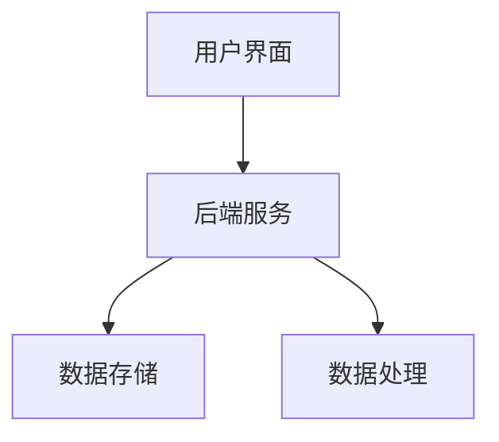

                 


### 提示词模板库的定义与作用

提示词模板库是一种用于特定领域或任务的文本模板集合，通过预设的格式和关键词，帮助用户快速生成高质量的文本内容。它涵盖了从基础信息到复杂报告的各种类型，广泛应用于人工智能、自然语言处理、内容创作、客户服务等多个领域。

#### 核心概念与联系

**提示词**：是模板中的关键词或短语，用于引导生成特定类型的文本。

**模板**：是预定义的文本结构，包含提示词和基本内容框架。

**领域适应性**：指模板库能够适应不同领域的特定需求，灵活调整提示词和模板结构。

**用户反馈**：用户使用模板后的反馈，用于优化模板库，提升用户体验。

这些概念相互联系，共同构成了提示词模板库的核心。例如，用户反馈可以帮助我们了解模板在实际应用中的效果，从而对模板进行优化和调整，使其更符合用户需求。

### 提示词模板库的作用

**提高生产效率**：通过预设的模板，用户可以快速生成文本，节省时间。

**提升文本质量**：模板库中的模板经过精心设计，能够引导用户生成结构清晰、逻辑严谨的文本。

**降低学习成本**：用户无需从零开始，可以基于现有模板快速上手。

**支持个性化定制**：通过提示词和模板的灵活组合，用户可以根据自己的需求生成个性化的文本内容。

### 提示词模板库的核心概念与联系

为了更好地理解提示词模板库的工作原理，我们可以从以下几个核心概念出发：

#### 核心概念：

1. **提示词**：提示词是模板中的关键词或短语，用于引导生成特定类型的文本。
2. **模板**：模板是预定义的文本结构，包含提示词和基本内容框架。
3. **领域适应性**：指模板库能够适应不同领域的特定需求，灵活调整提示词和模板结构。
4. **用户反馈**：用户使用模板后的反馈，用于优化模板库，提升用户体验。

#### 联系：

1. **提示词与模板的关系**：提示词嵌入到模板中，引导用户按照预设的格式生成文本。
2. **领域适应性** 与 **模板优化**：通过用户反馈，不断调整模板库中的模板，使其更适应不同领域的需求。
3. **用户反馈** 与 **用户体验**：用户反馈有助于优化模板库，提高用户生成文本的效率和质量。

### 提示词模板库的应用案例

**案例一：内容创作**

在内容创作领域，提示词模板库可以帮助创作者快速生成文章、报告等文本内容。例如，对于一篇产品评测文章，模板可以包含产品名称、评测标准、优缺点分析等提示词，用户只需填写具体内容即可生成完整的评测报告。

**案例二：客户服务**

在客户服务领域，提示词模板库可以帮助客服人员快速生成回复文本。例如，对于用户提出的常见问题，模板可以包含问题类型、解决方案、相关链接等提示词，客服人员只需根据实际情况调整和补充信息即可生成回复。

**案例三：代码编写**

在代码编写领域，提示词模板库可以帮助程序员快速生成代码片段。例如，对于一个常用的函数，模板可以包含函数名、参数列表、函数体等提示词，程序员只需填写具体的实现逻辑即可生成完整的函数代码。

通过这些案例，我们可以看到提示词模板库在不同领域的广泛应用和重要作用。接下来，我们将进一步探讨提示词模板库的设计原则、类型及其优化策略。

## 提示词模板库的设计原则

在设计一个高效的提示词模板库时，必须遵循一系列关键原则，以确保其易用性、可扩展性和灵活性。以下是一些核心设计原则及其详细解释。

### 易用性

**目标**：使模板库对用户友好，易于操作。

**实现方法**：
- **直观的界面设计**：提供清晰的界面，使用户能够快速理解如何使用模板。
- **简化的操作流程**：减少不必要的步骤，使用户能够迅速生成所需的文本。
- **提供帮助文档**：包括使用指南、常见问题解答等，帮助用户解决在使用过程中遇到的问题。

### 可扩展性

**目标**：模板库能够适应不同的领域和需求，灵活调整提示词和模板结构。

**实现方法**：
- **模块化设计**：将模板库划分为多个模块，每个模块对应一个特定领域或任务，便于扩展和更新。
- **参数化模板**：设计可变参数的模板，使用户可以根据实际需求调整模板内容。
- **版本控制**：对模板库进行版本控制，确保更新和升级的顺利进行。

### 灵活性

**目标**：模板库能够灵活地适应不同的使用场景，满足个性化需求。

**实现方法**：
- **多种模板类型**：提供多种类型的模板，如基础型、进阶型和高级型，满足不同用户的需求。
- **提示词的灵活性**：允许用户自定义提示词，以便生成更符合个人风格的文本。
- **用户反馈机制**：收集用户反馈，及时调整和优化模板库，提高用户体验。

### 可维护性

**目标**：确保模板库的稳定性和可靠性，易于管理和维护。

**实现方法**：
- **自动化测试**：对模板库进行自动化测试，确保每次更新和升级后的稳定性。
- **代码规范**：遵循严格的代码规范，提高代码的可读性和可维护性。
- **文档化**：为每个模板和模块编写详细的文档，便于开发人员和管理人员理解和使用。

通过遵循这些设计原则，我们可以创建一个高效、易用、灵活且可维护的提示词模板库，从而满足用户在不同领域和任务中的需求。

### 提示词模板的类型与特点

在提示词模板库中，模板的类型直接影响其应用效果和用户体验。根据复杂度和应用场景的不同，可以将提示词模板分为基础型、进阶型和高级型三大类。以下是对这三类模板的详细描述及其特点。

#### 基础型提示词模板

**特点**：
- **简单易用**：基础型模板适用于简单的应用场景，如填写基本信息、生成简单报告等。
- **预设内容**：包含基本的提示词和格式化内容，用户只需填写具体信息即可生成文本。
- **适用范围**：适用于日常办公、基础性文档编写等。

**示例**：
假设我们设计一个用于填写个人信息的模板：
```
姓名：______
性别：______
年龄：______
邮箱：______
```
用户只需在空白处填写相应的个人信息，即可生成完整的个人信息文档。

#### 进阶型提示词模板

**特点**：
- **多样化应用**：进阶型模板适用于更复杂的任务，如撰写报告、编写邮件等。
- **灵活调整**：模板中包含更多提示词和可选内容，用户可以根据实际需求进行调整。
- **优化格式**：模板提供更丰富的格式选项，如标题、列表、引用等，使文本结构更加清晰。

**示例**：
假设我们设计一个用于撰写产品评测报告的模板：
```
标题：______

引言：
正文：
- 优点：
- 缺点：
结论：
```
用户可以根据评测的具体内容填写相应的部分，生成一份结构完整、内容详实的评测报告。

#### 高级型提示词模板

**特点**：
- **高度定制化**：高级型模板适用于高度个性化的需求，如定制化营销文案、复杂项目文档等。
- **智能生成**：模板支持智能生成功能，通过机器学习算法，根据用户输入的部分信息自动生成完整的文本内容。
- **个性化调整**：用户可以根据需求对生成的文本进行深度调整，使其完全符合个人风格和需求。

**示例**：
假设我们设计一个用于撰写定制化营销文案的模板：
```
标题：______

开场白：
介绍产品：
- 产品特点：
- 产品优势：
- 产品价值：
呼吁行动：
```
用户可以根据实际的产品信息和目标受众，填写相应的内容，通过智能生成功能生成一份高质量的营销文案。

通过设计不同类型的提示词模板，我们可以满足用户在各个领域的需求，提供灵活、高效的内容生成解决方案。

### 提示词模板的优化与迭代

提示词模板的优化与迭代是确保模板库保持高效性和适应性的关键环节。通过分析数据、利用用户反馈和制定合理的迭代策略，我们可以持续提升模板库的质量和用户体验。

#### 数据分析在优化中的作用

**数据收集**：通过日志分析、用户行为追踪等技术手段，收集模板使用过程中的关键数据，如模板的访问次数、生成文本的长度、用户修改的频率等。

**数据挖掘**：对收集到的数据进行分析，识别出模板使用中的瓶颈和问题。例如，某些模板可能频繁被用户修改，说明其设计不够完善。

**性能评估**：通过性能评估指标（如生成文本质量、用户满意度等），衡量模板库的整体表现，识别需要改进的方面。

**用户画像**：分析用户的使用习惯和偏好，为个性化模板设计和推荐提供依据。

#### 用户反馈的利用

**反馈机制**：建立有效的用户反馈机制，鼓励用户在模板使用后提供反馈。这可以通过在线问卷调查、用户评价系统等方式实现。

**反馈分析**：对用户反馈进行整理和分析，识别用户的主要需求和不满之处。例如，用户可能反馈某些模板生成的内容过于模板化，缺乏个性。

**反馈应用**：将用户反馈应用到模板优化过程中，及时调整和改进模板库。例如，根据用户反馈，增加新的提示词或调整模板结构。

#### 提示词模板的迭代策略

**定期评估**：定期对模板库进行全面评估，分析模板的使用情况和用户反馈，确定哪些模板需要优化或更新。

**持续改进**：制定持续改进计划，对模板库进行定期更新和优化。这包括增加新的模板、调整现有模板的结构和内容等。

**自动化迭代**：引入自动化工具，如自动化测试和机器学习算法，辅助模板的迭代过程。例如，通过机器学习算法，自动识别用户生成文本中的高频关键词，并将其纳入模板库中。

**迭代跟踪**：建立迭代跟踪机制，记录每次迭代的详细信息和效果，以便后续分析和总结。

通过数据分析和用户反馈，结合合理的迭代策略，我们可以确保提示词模板库不断优化和改进，从而提供更加高效和个性化的内容生成解决方案。

### 面向特定领域的提示词模板应用

提示词模板库的设计不仅适用于通用场景，还能根据特定领域的需求进行定制化应用。以下将探讨三个具体领域（领域1、领域2和领域3）的提示词模板应用，包括各自的特点、设计思路和实施案例。

#### 领域1：电子商务

**特点**：
- **产品多样化**：电子商务领域涉及大量不同的产品，每个产品可能需要不同的描述和营销策略。
- **个性化需求**：消费者对产品信息的详细程度和内容格式有不同的需求，要求模板具备高度定制性。

**设计思路**：
- **产品信息模板**：为不同类型的产品设计相应的信息模板，如电子产品、服装、家居用品等。
- **多语言支持**：考虑到电子商务的全球化，模板应支持多语言，以适应不同国家和地区的用户需求。
- **动态调整**：根据用户反馈和市场需求，动态调整模板内容，确保描述的准确性和吸引力。

**实施案例**：
某电商企业使用提示词模板库为其产品目录编写详细描述，根据产品类型（如电子产品、服装）和用户群体（如年轻女性、家庭用户）定制化调整模板内容。通过多语言支持，产品描述能够同时满足国内外用户的需求。

#### 领域2：内容创作

**特点**：
- **创意需求**：内容创作领域注重创意和个性化，模板需要灵活应对不同风格和主题。
- **多样性**：包括文章、视频、音频等多种形式的内容创作，每种形式都有其特定的创作流程和模板需求。

**设计思路**：
- **模块化模板**：将模板分为不同的模块，如开头、正文、结尾等，用户可以根据需求自由组合和调整。
- **主题多样化**：设计多种主题模板，如旅游、科技、文化等，以覆盖不同类型的内容创作需求。
- **智能推荐**：利用机器学习算法，根据用户历史创作内容和偏好，推荐合适的模板。

**实施案例**：
某内容创作平台使用提示词模板库，为创作者提供多种主题和风格的模板选择。平台通过用户创作记录和反馈，不断优化模板推荐机制，提高创作者的满意度。

#### 领域3：客户服务

**特点**：
- **快速响应**：客户服务要求快速回复，模板需要提供高效的文本生成方案。
- **标准化流程**：客户服务涉及多种常见问题，需要标准化处理流程，提高响应效率。

**设计思路**：
- **标准化模板**：为常见问题设计标准化模板，如产品故障、订单查询等，确保回复的一致性和专业性。
- **智能客服集成**：将模板库与智能客服系统集成，实现自动回复，提高服务效率。
- **个性化扩展**：在标准化模板的基础上，允许客服人员根据具体情况进行个性化调整，提高用户满意度。

**实施案例**：
某大型电商平台利用提示词模板库，为其客服团队提供快速响应解决方案。平台根据用户提问类型，自动生成标准化回复，同时允许客服人员根据具体情况进行个性化调整，有效提升了客户服务质量。

通过针对不同领域的定制化设计，提示词模板库能够在电子商务、内容创作和客户服务等特定领域发挥重要作用，提供高效、个性化的内容生成解决方案。

### 提示词模板库的实现方法

实现一个高效的提示词模板库需要详细的系统架构设计和合理的数据处理与生成流程。以下将详细阐述这两个方面，并举例说明如何实现。

#### 系统架构设计

**整体架构**：

提示词模板库系统通常采用前后端分离的设计，前端负责用户界面和交互，后端负责数据存储和处理。整体架构可以分为以下几个模块：

1. **用户界面**：提供简洁、直观的界面，用户可以通过该界面访问和使用提示词模板。
2. **后端服务**：处理用户的请求，包括模板的查询、生成和更新等操作。
3. **数据存储**：存储提示词模板和相关数据，如模板内容、用户反馈等。
4. **数据处理**：对用户输入的数据进行处理，生成符合要求的文本内容。

**详细设计**：

1. **用户界面**：
   - **模板展示**：通过前端展示模板列表，用户可以选择并使用相应的模板。
   - **模板编辑**：提供模板编辑功能，用户可以根据需求对模板进行修改和调整。
   - **用户反馈**：收集用户对模板的反馈，用于后续的优化和改进。

2. **后端服务**：
   - **模板管理**：负责模板的创建、更新和删除操作，确保模板库的完整性。
   - **文本生成**：根据用户的选择和输入，动态生成文本内容，并返回给用户。
   - **用户权限管理**：确保用户只能访问和操作自己权限范围内的模板和功能。

3. **数据存储**：
   - **关系型数据库**：存储模板的基本信息和用户数据，如MySQL或PostgreSQL。
   - **NoSQL数据库**：存储文本内容和其他大数据，如MongoDB或Cassandra。

4. **数据处理**：
   - **模板解析**：解析用户输入的模板，提取提示词和结构信息。
   - **文本生成**：根据提示词和模板结构，生成符合要求的文本内容，如使用自然语言生成技术。

**架构图**：

以下是一个简化的系统架构图，展示了各个模块之间的关系：



#### 数据处理与生成流程

**流程概述**：

提示词模板库的数据处理与生成流程主要包括以下几个步骤：

1. **用户输入**：用户在前端界面选择模板并输入相关信息。
2. **模板解析**：后端服务解析用户选择的模板，提取提示词和结构信息。
3. **文本生成**：根据提示词和模板结构，生成文本内容，并返回给用户。
4. **用户反馈**：用户对生成的文本内容进行评价和反馈，用于后续的优化和改进。

**详细流程**：

1. **用户输入**：
   - 用户访问提示词模板库，选择一个模板。
   - 填写相应的提示词和必要信息，如产品名称、评测标准等。

2. **模板解析**：
   - 后端服务接收用户输入，解析模板内容，提取提示词和结构信息。
   - 将解析后的数据存储在内存中，以备后续使用。

3. **文本生成**：
   - 根据提示词和模板结构，生成文本内容。
   - 使用自然语言生成技术，确保生成的文本符合语言规范和用户需求。

4. **用户反馈**：
   - 用户对生成的文本内容进行评价和反馈。
   - 后端服务记录用户反馈，用于后续的模板优化和改进。

**示例实现**：

假设我们有一个简单的模板，用于生成产品评测报告：

```python
# 示例模板内容
template = """
标题：{{产品名称}}评测报告

引言：
正文：
- 优点：{{优点}}
- 缺点：{{缺点}}
结论：
"""

# 用户输入
product_name = "智能手表"
advantages = "续航能力强，健康监测功能全面"
disadvantages = "操作界面不够友好，价格较高"

# 模板解析
template_data = {
    "产品名称": product_name,
    "优点": advantages,
    "缺点": disadvantages
}

# 文本生成
generated_text = template.format(**template_data)

# 输出文本
print(generated_text)
```

运行上述代码，将生成如下文本内容：

```
标题：智能手表评测报告

引言：
正文：
- 优点：续航能力强，健康监测功能全面
- 缺点：操作界面不够友好，价格较高
结论：
```

通过以上实现，我们可以看到提示词模板库的基本工作流程和数据生成过程。接下来，我们将探讨提示词模板库的管理与维护策略。

### 提示词模板库的管理与维护

提示词模板库的成功不仅依赖于其设计和实现，更需要有效的管理与维护。以下将讨论提示词模板的审核流程、更新策略和安全保障措施。

#### 提示词模板的审核流程

**目标**：确保模板库中模板的质量和准确性。

**步骤**：

1. **模板提交**：开发人员提交新模板或更新现有模板。
2. **初步审核**：审核人员对模板进行初步审查，确保模板符合基本格式和语法要求。
3. **内容审核**：深入检查模板的内容，确保其准确性和适用性。例如，评测报告模板需要验证所列优缺点是否真实可靠。
4. **用户反馈**：将审核后的模板交由用户试用，收集用户反馈，进一步优化模板。
5. **最终审核**：根据用户反馈，对模板进行最终审核，确保其达到预期质量。

**审核标准**：

- **准确性**：模板中的信息需准确无误。
- **完整性**：模板应包含所有必要的部分和提示词。
- **易用性**：模板应易于理解和操作，无明显歧义。

#### 更新策略

**目标**：确保模板库保持最新，适应不断变化的需求。

**方法**：

1. **定期更新**：定期检查和更新模板库，确保模板内容与当前需求和标准保持一致。
2. **用户反馈驱动**：根据用户反馈，识别模板中的问题和不足，进行针对性的更新和优化。
3. **版本控制**：引入版本控制机制，记录每次更新的内容和时间，便于后续的追溯和管理。
4. **持续改进**：鼓励开发人员持续优化模板，通过内部讨论和评审，不断改进模板库。

#### 安全保障措施

**目标**：保护用户数据和模板库的安全。

**措施**：

1. **数据加密**：对用户数据和模板内容进行加密存储，防止数据泄露。
2. **访问控制**：实施严格的访问控制机制，确保只有授权人员才能访问和修改模板库。
3. **备份与恢复**：定期备份模板库，确保在数据丢失或损坏时能够快速恢复。
4. **安全审计**：定期进行安全审计，检测潜在的安全漏洞，及时修补。

通过有效的审核流程、更新策略和安全保障措施，我们可以确保提示词模板库的质量和安全性，为用户提供可靠的内容生成解决方案。

### 提示词模板库案例分析

为了更好地理解提示词模板库的实际应用效果，我们来看几个具体的案例，分别从电子商务、内容创作和智能客服三个领域进行分析。

#### 案例一：电子商务领域的应用

**背景**：
在电子商务领域，产品描述对于提升销售至关重要。某电商平台希望通过提示词模板库，为产品编写高质量的描述，以提高用户购买意愿。

**应用场景**：
该平台使用提示词模板库，为不同类型的产品（如电子产品、服装、家居用品等）生成详细的描述。模板库包含产品特点、优缺点分析、使用方法等提示词。

**效果**：
通过提示词模板库，该平台的产品描述内容更加专业、详细，用户购买意愿明显提升。同时，由于模板的灵活性，平台能够根据市场需求和用户反馈，动态调整模板内容，保持描述的时效性和吸引力。

**小结**：
提示词模板库在电子商务领域的应用，显著提升了产品描述的质量和用户满意度，为电商平台带来了良好的销售业绩。

#### 案例二：内容创作领域的应用

**背景**：
某内容创作平台拥有大量创作者，他们需要撰写各种类型的内容（如文章、视频脚本、社交媒体帖子等）。为了提高创作效率，平台引入了提示词模板库。

**应用场景**：
平台为不同类型的创作任务提供相应的提示词模板，如文章结构模板、视频脚本模板、社交媒体文案模板等。模板中包含关键词、段落结构和创作提示。

**效果**：
通过提示词模板库，创作者能够快速构思和生成高质量的内容。模板库的模块化设计，使得创作者可以根据实际需求灵活调整模板内容，创作出更具个性和吸引力的作品。

**小结**：
提示词模板库在内容创作领域的应用，提高了创作者的效率和创作质量，为平台带来了更多优质内容，提升了用户黏性。

#### 案例三：智能客服领域的应用

**背景**：
某大型电商平台设有智能客服系统，用于自动回复用户的常见问题。平台希望通过提示词模板库，优化智能客服的回复质量。

**应用场景**：
平台为常见问题设计了标准化模板，如产品咨询、订单查询、售后服务等。客服系统根据用户提问，自动匹配相应模板，生成标准化的回复。

**效果**：
通过提示词模板库，智能客服系统能够快速、准确地回复用户问题，提高了响应速度和服务质量。同时，平台根据用户反馈，不断优化模板内容，确保回复的个性化和人性化。

**小结**：
提示词模板库在智能客服领域的应用，显著提升了客服系统的响应速度和质量，为用户提供更好的服务体验，降低了平台的人力成本。

通过以上案例，我们可以看到提示词模板库在不同领域的广泛应用和显著效果。未来，随着技术的不断进步，提示词模板库将发挥更大的作用，为各领域带来更多价值。

### 提示词模板库的未来发展趋势

随着人工智能和自然语言处理技术的不断进步，提示词模板库在未来的发展中将呈现出以下几个趋势。

#### 技术发展方向

1. **自然语言生成（NLG）技术的提升**：自然语言生成技术将更加成熟，能够生成更加自然、流畅的文本内容。通过深度学习算法，模板库可以自动学习和优化，生成更符合用户需求的文本。

2. **多模态模板**：未来模板库将不仅仅限于文本，还将支持图片、视频、音频等多种模态，实现更加丰富和多样化的内容生成。

3. **个性化推荐**：基于用户行为数据和偏好，模板库将提供更加个性化的模板推荐，使用户能够快速找到适合自己的模板。

#### 行业应用前景

1. **自动化文案生成**：在广告、营销等领域，提示词模板库将实现自动化文案生成，大幅提升创作效率和内容质量。

2. **智能客服**：在客服领域，模板库将支持智能客服系统，自动生成更加个性化和专业化的回复，提高用户满意度。

3. **内容创作**：在内容创作领域，模板库将帮助创作者快速生成高质量的内容，降低创作门槛，提高创作效率。

#### 潜在挑战与应对策略

1. **数据隐私和安全**：随着数据量的增加，数据隐私和安全将成为一个重要挑战。应对策略包括数据加密、严格的访问控制和数据匿名化等。

2. **模板质量控制**：如何确保模板生成的内容高质量，将是一个持续性的挑战。可以通过引入用户反馈机制、自动化审核和持续优化来解决这个问题。

3. **技术更新迭代**：随着技术的发展，模板库需要不断更新和迭代，以保持其竞争力和实用性。建立敏捷的开发和更新流程是应对这一挑战的关键。

通过技术创新和优化，提示词模板库将在未来发挥更大的作用，为各行各业带来更多的价值。同时，我们也需要积极应对潜在的挑战，确保其健康、稳定的发展。

