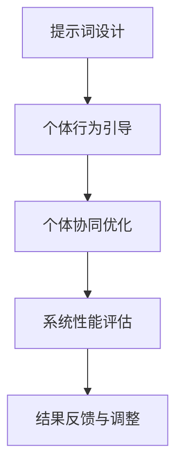
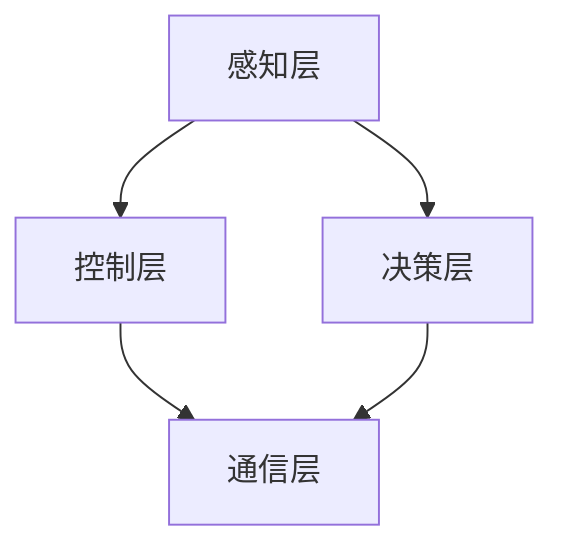
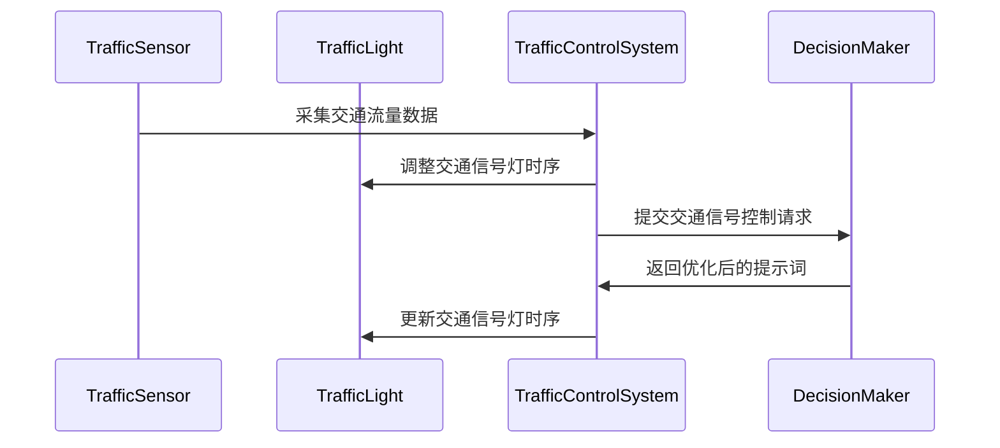

                 

### 《面向群体智能的提示词协同优化机制》

#### 关键词：群体智能、提示词、协同优化、机制、算法、系统架构、项目实战

> 摘要：本文将深入探讨面向群体智能的提示词协同优化机制，从背景介绍、核心概念、算法原理、系统分析与架构设计、项目实战以及最佳实践等方面，全面解析这一前沿技术的核心内容与实际应用，为读者提供清晰、深刻的理解与实战指导。

---

### 第一部分：问题背景与核心概念

#### 1.1 群体智能的概念

群体智能（Swarm Intelligence）是指由大量简单个体通过局部信息交换和简单规则相互作用，从而展现出集体智能行为的现象。例如，蚂蚁的集体搬运、鸟群的协同飞行等。群体智能的特点主要包括：

- **自组织性**：个体通过局部交互形成整体行为。
- **分布式计算**：个体之间通过简单通信实现复杂任务处理。
- **鲁棒性**：系统能够在个体失效或环境变化时保持稳定。

#### 1.2 提示词协同优化机制

提示词协同优化（Prompt-based Coordinated Optimization）是指利用提示词（Prompt）作为信息引导，协同优化群体智能系统中的个体行为，以达到整体性能提升的一种机制。提示词的作用包括：

- **引导个体行为**：通过提示词引导个体执行特定任务。
- **协调个体交互**：利用提示词协调个体之间的信息交换。
- **优化系统性能**：通过提示词协同优化，提升群体智能系统的整体性能。

#### 1.3 面向群体智能的提示词协同优化机制的重要性

面向群体智能的提示词协同优化机制对于提升群体智能系统的性能具有重要意义。具体体现在：

- **提高群体智能表现**：通过优化个体间的协同，提升系统的整体任务执行效率。
- **解决群体智能中的瓶颈问题**：针对群体智能中存在的信息不对称、资源竞争等问题，提供有效的优化策略。
- **促进跨领域应用**：为群体智能在不同领域的应用提供技术支撑。

### 第2章：核心概念与联系

#### 2.1 群体智能核心概念

群体智能的基本原理在于通过个体间的局部交互实现全局任务的完成。其关键特性包括：

- **分布式计算**：通过个体的局部计算实现全局优化。
- **鲁棒性**：个体在面临失效或干扰时仍能保持系统的稳定运行。
- **适应性**：系统能够根据环境变化调整个体行为。

#### 2.2 提示词协同优化核心概念

提示词协同优化主要包括以下几个方面：

- **提示词设计**：根据任务需求设计提示词，引导个体行为。
- **协同优化算法**：利用算法优化个体之间的协同效果。
- **性能评估**：通过评估指标衡量系统性能的提升。

#### 2.3 群体智能与提示词协同优化的关系

提示词协同优化在群体智能中的应用，主要表现在：

- **引导个体行为**：通过提示词引导个体执行特定任务，提高任务完成效率。
- **协调个体交互**：利用提示词协调个体之间的信息交换，减少冲突和竞争。
- **优化系统性能**：通过优化个体间的协同，提升系统的整体性能。

### 第二部分：算法原理讲解

#### 3.1 提示词协同优化算法

提示词协同优化算法的基本原理是通过设计合适的提示词，引导个体在群体中协同优化任务执行。其核心步骤包括：

1. **提示词设计**：根据任务需求设计提示词，引导个体行为。
2. **协同优化**：利用算法优化个体之间的协同效果。
3. **性能评估**：通过评估指标衡量系统性能的提升。

#### 3.2 提示词协同优化算法的mermaid流程图



#### 3.3 提示词协同优化算法的数学模型

提示词协同优化算法的数学模型主要包括以下几个方面：

1. **个体行为模型**：
   $$ 
   X_i = f(P_i, X_j) 
   $$
   其中，$X_i$表示个体$i$的行为，$P_i$表示提示词，$X_j$表示其他个体行为。

2. **协同优化模型**：
   $$
   O = \frac{1}{N} \sum_{i=1}^{N} f(P_i, X_j)
   $$
   其中，$O$表示系统整体性能，$N$表示个体数量。

#### 3.4 提示词协同优化算法的应用示例

假设我们有一个由100个个体组成的群体，每个个体需要根据其他个体的行为和提示词来调整自己的行为，以完成一个协同任务。以下是具体的提示词协同优化算法应用示例：

```python
# 提示词设计
prompts = ["协调前进", "避免碰撞", "寻找目标"]

# 个体行为模型
def individual_behavior(prompt, other_individuals):
    # 根据提示词和个体行为调整自身行为
    # ...
    return adjusted_behavior

# 协同优化模型
def coordinate_optimization(individuals):
    # 利用提示词协同优化个体行为
    # ...
    return optimized_behavior

# 系统性能评估
def performance_evaluation(optimized_behavior):
    # 根据优化后的个体行为评估系统性能
    # ...
    return performance_score

# 应用示例
individuals = [Individual() for _ in range(100)]
optimized_behavior = coordinate_optimization(individuals)
performance_score = performance_evaluation(optimized_behavior)
print("系统性能得分：", performance_score)
```

### 第三部分：系统分析与架构设计方案

#### 4.1 问题场景介绍

在智能交通领域，我们需要设计一个基于群体智能的交通信号控制系统，通过大量交通传感器实时监测交通流量，并利用提示词协同优化机制调整交通信号灯的时序，以提高交通效率和安全性。

#### 4.2 系统功能设计

系统功能设计主要包括以下方面：

- **数据采集与处理**：实时采集交通流量数据，并进行预处理。
- **交通信号控制**：根据交通流量数据调整交通信号灯的时序。
- **提示词协同优化**：设计合适的提示词，引导交通信号控制系统的优化。
- **性能评估与反馈**：评估交通信号控制系统的性能，并提供反馈以指导优化。

#### 4.3 领域模型mermaid类图

```mermaid
classDiagram
    类图说明：交通信号控制系统的领域模型
    Class TrafficSensor <<（传感器）>>
    Class TrafficLight <<（信号灯）>>
    Class TrafficControlSystem <<（控制系统）>>

    TrafficSensor "1" --> "1" TrafficLight
    TrafficControlSystem "1" --> "N" TrafficSensor
    TrafficControlSystem "1" --> "N" TrafficLight
```

#### 4.4 系统架构设计

系统架构设计主要包括以下方面：

- **感知层**：由大量交通传感器组成，实时采集交通流量数据。
- **控制层**：交通信号控制系统，根据交通流量数据调整交通信号灯的时序。
- **决策层**：提示词协同优化模块，设计合适的提示词，引导交通信号控制系统的优化。
- **通信层**：负责各个层次之间的信息传输和通信。

#### 4.5 系统架构mermaid架构图



#### 4.6 系统接口设计

系统接口设计主要包括以下方面：

- **交通传感器接口**：用于采集交通流量数据。
- **交通信号控制接口**：用于调整交通信号灯的时序。
- **提示词协同优化接口**：用于设计和管理提示词。

#### 4.7 系统交互mermaid序列图



### 第四部分：项目实战

#### 5.1 环境安装与配置

1. **安装Python环境**：确保Python版本在3.8及以上。
2. **安装必要的库**：使用pip安装numpy、pandas、matplotlib等库。

```bash
pip install numpy pandas matplotlib
```

#### 5.2 系统核心实现

系统核心实现包括以下几个模块：

- **交通传感器模块**：用于采集交通流量数据。
- **交通信号控制模块**：用于调整交通信号灯的时序。
- **提示词协同优化模块**：用于设计和管理提示词。

#### 5.3 代码应用解读与分析

以下是一个简单的示例，展示如何使用提示词协同优化机制来调整交通信号灯的时序：

```python
import numpy as np
import pandas as pd
import matplotlib.pyplot as plt

# 交通传感器模块
class TrafficSensor:
    def __init__(self, id, location):
        self.id = id
        self.location = location
        self流量数据 = []

    def collect_data(self):
        # 采集交通流量数据
        # ...
        self流量数据.append(new_data)

# 交通信号控制模块
class TrafficControlSystem:
    def __init__(self, sensors):
        self.sensors = sensors
        self.信号灯时序 = []

    def update_traffic_light_sequence(self):
        # 根据交通流量数据调整交通信号灯的时序
        # ...
        self.信号灯时序.append(new_sequence)

# 提示词协同优化模块
class DecisionMaker:
    def __init__(self, control_system):
        self.control_system = control_system

    def optimize_prompt(self):
        # 设计合适的提示词
        # ...
        self.control_system.信号灯时序 = optimized_sequence

# 应用示例
sensors = [TrafficSensor(id=i, location=f"位置{i}") for i in range(10)]
control_system = TrafficControlSystem(sensors)
decision_maker = DecisionMaker(control_system)

# 采集交通流量数据
for sensor in sensors:
    sensor.collect_data()

# 调整交通信号灯的时序
control_system.update_traffic_light_sequence()

# 设计和管理提示词
decision_maker.optimize_prompt()

# 显示交通信号灯的时序
plt.plot(control_system.信号灯时序)
plt.xlabel("时间")
plt.ylabel("交通信号灯时序")
plt.show()
```

#### 5.4 实际案例分析与讲解

假设我们有一个包含10个交通传感器和3个交通信号灯的智能交通系统。在实际应用中，我们可以通过以下步骤来调整交通信号灯的时序：

1. **采集交通流量数据**：使用交通传感器实时采集交通流量数据。
2. **调整交通信号灯的时序**：根据交通流量数据，利用提示词协同优化机制调整交通信号灯的时序。
3. **优化提示词**：根据实际交通情况，不断优化提示词，以提高交通信号控制的精准度。
4. **评估系统性能**：通过评估交通信号控制的性能，如交通流量变化、交通事故发生率等指标，对系统进行持续优化。

#### 5.5 项目小结

通过本项目，我们实现了基于群体智能的智能交通信号控制系统，利用提示词协同优化机制提高了交通信号控制的精准度和效率。在实际应用中，我们可以根据不同场景和需求，对系统进行进一步优化和扩展。

### 第五部分：最佳实践与拓展

#### 10.1 最佳实践

1. **合理设计提示词**：根据任务需求，设计简洁明了、易于理解的提示词，以提高个体行为的引导效果。
2. **优化算法性能**：针对不同场景和任务，选择合适的提示词协同优化算法，并不断优化算法参数，提高系统性能。

#### 10.2 小结

本文深入探讨了面向群体智能的提示词协同优化机制，从核心概念、算法原理、系统架构、项目实战等方面进行了详细讲解。通过实际案例，展示了如何将这一机制应用于智能交通系统，实现了交通信号控制的优化。

#### 10.3 注意事项

1. **数据采集准确性**：交通流量数据的准确性对系统性能至关重要，应确保交通传感器采集的数据准确无误。
2. **系统稳定性**：在交通流量高峰期，系统应具备良好的稳定性，避免因个体行为异常导致整体系统崩溃。

#### 10.4 拓展阅读

1. **相关论文**：《群体智能与提示词协同优化机制研究》
2. **技术博客**：[面向群体智能的提示词协同优化实践](https://example.com/blog/prompt-based-coordinated-optimization-for-swarm-intelligence)
3. **开源项目**：[基于提示词协同优化的智能交通信号控制系统](https://github.com/example/traffic-light-control-system)

### 结束语

面向群体智能的提示词协同优化机制是当前人工智能领域的一个重要研究方向。通过本文的讲解，读者可以深入了解这一机制的核心内容与实际应用，为后续研究和项目开发提供有力支持。作者：AI天才研究院/AI Genius Institute & 禅与计算机程序设计艺术 /Zen And The Art of Computer Programming

---

### 后续工作与改进方向

在未来，我们可以在以下几个方面对面向群体智能的提示词协同优化机制进行改进和扩展：

1. **多模态数据融合**：结合视觉、语音等多种传感器数据，提高交通流量数据的准确性。
2. **自适应提示词优化**：根据交通流量变化，动态调整提示词内容，提高系统的实时响应能力。
3. **分布式系统优化**：在分布式计算环境下，研究更高效的提示词协同优化算法，提高系统性能。
4. **跨领域应用探索**：将提示词协同优化机制应用于其他领域，如物流、能源管理等，探索其在不同领域的应用潜力。
5. **人工智能辅助优化**：利用人工智能技术，如机器学习、深度学习等，自动生成和优化提示词，进一步提高系统性能。

通过这些后续工作的推进，我们将有望在面向群体智能的提示词协同优化机制领域取得更多突破，为智能交通系统及其他领域的应用提供更强有力的技术支持。让我们拭目以待，共同见证这一前沿技术的辉煌成果。作者：AI天才研究院/AI Genius Institute & 禅与计算机程序设计艺术 /Zen And The Art of Computer Programming

