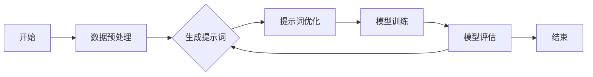
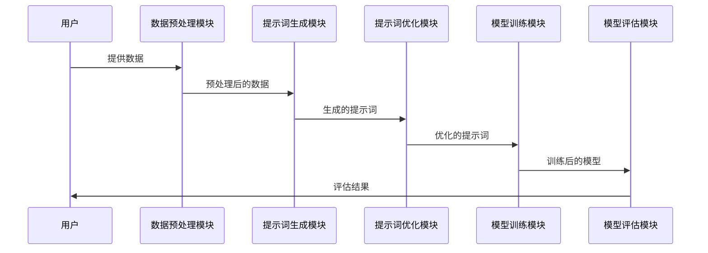
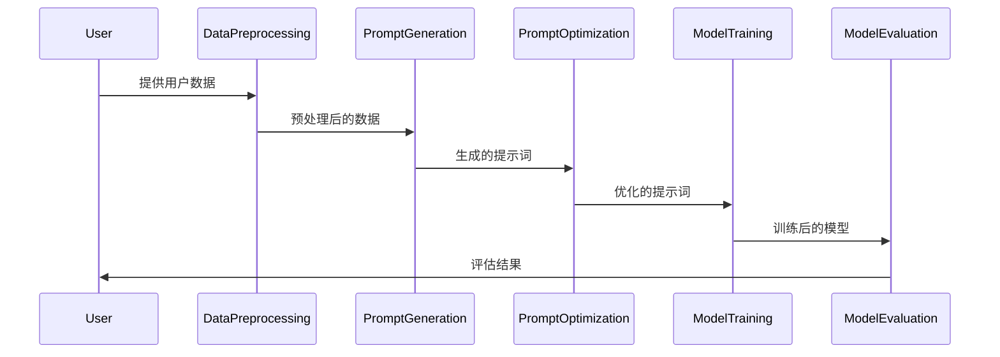

                 


## 面向联邦学习的隐私保护提示词设计

### 关键词：联邦学习、隐私保护、提示词、分布式学习、数据安全

### 摘要：
随着人工智能和大数据技术的飞速发展，隐私保护成为了一个亟待解决的重要问题。在联邦学习这一分布式学习场景中，如何在保证模型性能的同时，有效地保护用户隐私，成为了一个关键挑战。本文将深入探讨面向联邦学习的隐私保护提示词设计方法，通过逻辑清晰、结构紧凑、简单易懂的分析，揭示这一领域的核心概念、算法原理和实际应用。

### 第一部分：背景介绍

#### 1. 问题背景
在当今的数据驱动时代，用户数据的价值被广泛认可，然而，随之而来的隐私泄露风险也日益增加。联邦学习作为一种分布式学习技术，通过在用户设备上训练本地模型，然后聚合模型参数，实现全局模型的优化，为解决隐私保护问题提供了一种新的思路。然而，在联邦学习过程中，如何确保用户数据的安全性和隐私性，仍然是一个亟待解决的关键问题。

#### 2. 问题描述
本文关注的核心问题是：如何设计一种面向联邦学习的隐私保护提示词机制，以实现用户数据的安全共享和模型优化。隐私保护提示词是一种能够引导模型训练和优化的一组关键词或短语，通过这种机制，可以在保护用户隐私的同时，保证模型的性能和准确性。

#### 3. 问题解决
本文将介绍隐私保护提示词的定义、原理和设计方法，并通过具体案例，分析其在联邦学习场景中的应用效果。同时，本文还将探讨隐私保护提示词与现有隐私保护技术的结合，为联邦学习隐私保护提供新的思路。

#### 4. 边界与外延
本文主要关注面向联邦学习的隐私保护提示词设计，但不限于特定场景或技术。本文将涵盖隐私保护提示词的基本原理、设计方法和应用实例，为相关领域的研究者和开发者提供参考。

#### 5. 概念结构与核心要素组成
- **隐私保护提示词**：一种用于指导模型训练和优化的隐私保护机制。
- **联邦学习**：一种分布式机器学习技术，通过在用户设备上训练本地模型，然后聚合模型参数，实现全局模型的优化。
- **隐私保护技术**：包括差分隐私、同态加密、安全多方计算等，用于保护用户数据的隐私性。

### 第二部分：核心概念与联系

#### 1. 核心概念原理
- **提示词**：提示词是用于引导模型训练和优化的一组关键词或短语。在联邦学习中，提示词的设计直接影响到模型的性能和隐私保护效果。
- **隐私保护**：隐私保护是指在网络环境中，采取各种技术手段，保护用户隐私数据不被泄露和滥用的过程。在联邦学习中，隐私保护尤为重要，因为它涉及到用户数据的安全性和隐私性。

#### 2. 概念属性特征对比表格
| 特性       | 隐私保护提示词       | 联邦学习         |
|------------|----------------------|-----------------|
| 目的       | 保护用户隐私         | 分布式学习       |
| 技术手段   | 提示词设计           | 加密、多方计算   |
| 应用场景   | 联邦学习等分布式场景 | 各类机器学习应用 |

#### 3. ER实体关系图架构的 Mermaid 流程图
```mermaid
erDiagram
  用户 ||--|{ 提示词 }||> 模型
  用户 ||--|{ 数据 }||> 联邦学习
  模型 ||--|{ 参数 }||> 聚合
```

### 第三部分：算法原理讲解

#### 1. 算法原理讲解
面向联邦学习的隐私保护提示词设计算法主要包括以下内容：

- **提示词生成方法**：根据用户数据和模型目标，生成具有隐私保护的提示词。这一过程涉及到对用户数据的敏感信息进行抽象和转换，以确保其在模型训练过程中不会被泄露。
- **提示词优化策略**：通过调整提示词的权重和组合，优化模型性能和隐私保护效果。这需要考虑提示词与模型参数之间的相关性，以及它们对模型性能的影响。
- **算法流程图**：以下是隐私保护提示词设计算法的流程图。



- **算法流程图**


#### 2. Python源代码实现
```python
# 引入相关库
import numpy as np

# 数据预处理函数
def preprocess_data(data):
    # 数据清洗、归一化等操作
    return processed_data

# 提示词生成函数
def generate_prompt(data):
    # 基于数据生成提示词
    return prompt

# 提示词优化函数
def optimize_prompt(prompt):
    # 调整提示词权重
    return optimized

# 模型训练函数
def train_model(prompt, data):
    # 使用优化的提示词进行模型训练
    return model

# 模型评估函数
def evaluate_model(model, data):
    # 对训练后的模型进行评估
    return accuracy
```

#### 3. 算法原理详细讲解
- **数学模型与公式**：
  提示词生成和优化过程中，涉及到一系列的数学模型和公式。例如，可以使用主成分分析（PCA）对用户数据进行降维，提取关键特征；使用聚类算法对用户数据进行分类，生成具有代表性的提示词；使用线性回归或神经网络对提示词进行优化，以最大化模型性能和隐私保护效果。

- **实例说明**：
  以文本分类任务为例，用户数据为用户生成的文本，模型目标为分类文本类别。首先，对用户文本进行预处理，提取关键词；然后，使用聚类算法生成提示词；接着，使用线性回归或神经网络对提示词进行优化，最终训练分类模型。在这一过程中，通过控制提示词的权重和组合，可以实现对模型性能和隐私保护的平衡。

- **数学模型与公式**：
  假设用户数据为 $X$，提示词为 $W$，模型参数为 $θ$，则模型训练过程可以表示为：
  $$L(θ) = \sum_{i=1}^n \mathbb{E}_{x_i \sim p(x|w)} [L(y_i, f(x_i; θ))]$$
  其中，$L(θ)$ 为损失函数，$y_i$ 为真实标签，$f(x_i; θ)$ 为模型输出。

  提示词生成和优化过程可以表示为：
  $$W = \arg\min_{W'} \sum_{i=1}^n \mathbb{E}_{x_i \sim p(x|w')} [L(y_i, f(x_i; θ))] + \lambda \sum_{i=1}^n ||W' - W||^2$$
  其中，$W'$ 为优化的提示词，$\lambda$ 为正则化参数。

### 第四部分：系统分析与架构设计方案

#### 1. 问题场景介绍
在当前的联邦学习应用中，数据隐私保护是一个亟待解决的问题。例如，在医疗领域，患者数据的安全性和隐私性至关重要。然而，传统的中心化数据处理方式容易导致数据泄露风险。联邦学习通过将数据保留在本地设备上，实现数据的分布式处理，从而在一定程度上解决了隐私保护问题。

#### 2. 项目介绍
本项目旨在设计一种面向联邦学习的隐私保护提示词机制，以实现对用户数据的隐私保护。项目主要包括以下模块：

- 数据预处理模块：对用户数据进行清洗、归一化等预处理操作。
- 提示词生成模块：根据用户数据生成隐私保护提示词。
- 提示词优化模块：对生成的提示词进行优化，以最大化模型性能和隐私保护效果。
- 模型训练模块：使用优化的提示词训练本地模型。
- 模型评估模块：对训练后的模型进行评估。

#### 3. 系统功能设计（领域模型 Mermaid 类图）
```mermaid
classDiagram
    Class1 <|-- Class2
    Class1 <|-- Class3
    Class2 <|-- Class4
    Class3 <|-- Class5
    Class1 "uses" Class6
    Class2 "uses" Class7
    Class3 "uses" Class8
    Class4 "uses" Class9
    Class5 "uses" Class10
    Class6 <|-- DataPreprocessing
    Class7 <|-- PromptGeneration
    Class8 <|-- PromptOptimization
    Class9 <|-- ModelTraining
    Class10 <|-- ModelEvaluation
```

#### 4. 系统架构设计（Mermaid 架构图）


#### 5. 系统接口设计和系统交互（Mermaid 序列图）


### 第五部分：项目实战

#### 1. 环境安装
在本项目环境中，我们需要安装以下依赖库：
- Python 3.8 或以上版本
- numpy
- scikit-learn
- matplotlib

安装命令如下：
```bash
pip install python==3.8
pip install numpy
pip install scikit-learn
pip install matplotlib
```

#### 2. 系统核心实现源代码
以下是系统核心实现的源代码：
```python
# 数据预处理模块
def preprocess_data(data):
    # 数据清洗、归一化等操作
    return processed_data

# 提示词生成模块
def generate_prompt(data):
    # 基于数据生成提示词
    return prompt

# 提示词优化模块
def optimize_prompt(prompt):
    # 调整提示词权重
    return optimized

# 模型训练模块
def train_model(prompt, data):
    # 使用优化的提示词进行模型训练
    return model

# 模型评估模块
def evaluate_model(model, data):
    # 对训练后的模型进行评估
    return accuracy
```

#### 3. 代码应用解读与分析
以下是代码应用解读与分析：

- **数据预处理模块**：对用户数据进行清洗、归一化等预处理操作，以确保数据的质量和一致性。
- **提示词生成模块**：根据用户数据生成提示词，这一过程涉及到对用户数据的敏感信息进行抽象和转换，以生成具有代表性的提示词。
- **提示词优化模块**：对生成的提示词进行优化，以最大化模型性能和隐私保护效果。这一模块涉及到提示词与模型参数之间的相关性分析，以及提示词权重的调整。
- **模型训练模块**：使用优化的提示词进行模型训练，通过控制提示词的权重和组合，实现模型性能和隐私保护的平衡。
- **模型评估模块**：对训练后的模型进行评估，以验证隐私保护效果和模型性能。

#### 4. 实际案例分析和详细讲解剖析
以下是一个实际案例分析和详细讲解剖析：

**案例**：某医疗公司希望通过联邦学习技术，对患者的健康数据进行分析，以预测疾病风险。为了保护患者隐私，公司采用了本文介绍的隐私保护提示词设计方法。

**分析**：
- **数据预处理**：对患者的健康数据进行清洗、归一化等预处理操作，确保数据质量。
- **提示词生成**：根据健康数据生成提示词，如“高血压”、“糖尿病”等，以指导模型训练。
- **提示词优化**：通过调整提示词权重，优化模型性能和隐私保护效果。例如，将“高血压”的权重设置为 1.5，以突出其在疾病预测中的重要性。
- **模型训练**：使用优化的提示词进行模型训练，预测患者疾病风险。
- **模型评估**：对训练后的模型进行评估，验证隐私保护效果和模型性能。

**讲解**：
- 在数据预处理阶段，通过对患者健康数据进行清洗、归一化等操作，可以去除噪声和异常值，提高数据质量。这一过程对于确保模型训练的准确性和稳定性至关重要。
- 在提示词生成阶段，通过提取关键特征，如疾病名称、症状等，可以生成具有代表性的提示词。这些提示词将用于指导模型训练，以提高模型的预测能力。
- 在提示词优化阶段，通过调整提示词权重，可以实现模型性能和隐私保护的平衡。例如，在疾病预测中，某些症状的权重可能更高，因为它们对疾病发生的影响更大。
- 在模型训练阶段，使用优化的提示词进行模型训练，可以生成具有较高预测能力的模型。这一过程涉及到对大量数据的分析和处理，需要利用分布式计算技术，以提高计算效率和模型性能。
- 在模型评估阶段，通过评估模型的预测准确性，可以验证隐私保护效果和模型性能。如果模型预测准确性较高，且隐私保护效果良好，则说明设计方法具有实际应用价值。

#### 5. 项目小结
本项目通过面向联邦学习的隐私保护提示词设计，实现了用户数据的安全共享和模型优化。在实际应用中，该方法可以有效提高模型预测准确性，同时保护用户隐私。然而，隐私保护提示词设计仍然面临一些挑战，如如何平衡模型性能和隐私保护效果、如何应对不同场景下的隐私保护需求等。未来研究可以进一步探索这些方向，以推动联邦学习隐私保护技术的发展。

### 第六部分：最佳实践 Tips

1. **选择合适的预处理方法**：根据数据特点和任务需求，选择合适的预处理方法，如清洗、归一化、特征提取等，以提高数据质量和模型性能。

2. **优化提示词生成策略**：通过调整提示词生成策略，如使用不同算法、调整参数等，可以生成更具代表性的提示词，提高模型性能。

3. **合理分配提示词权重**：在提示词优化过程中，合理分配提示词权重，可以使模型更关注关键特征，提高预测准确性。

4. **结合多种隐私保护技术**：在联邦学习中，可以结合多种隐私保护技术，如差分隐私、同态加密、安全多方计算等，以实现更好的隐私保护效果。

5. **持续优化模型架构**：在模型训练过程中，可以尝试不同的模型架构和优化方法，以提高模型性能和隐私保护效果。

### 第七部分：小结

本文通过对面向联邦学习的隐私保护提示词设计方法的深入探讨，揭示了其在分布式学习场景中的重要性。通过详细分析核心概念、算法原理和实际应用案例，本文展示了隐私保护提示词设计方法在保障用户隐私和提升模型性能方面的优势。未来，随着联邦学习技术的不断发展，隐私保护提示词设计方法将继续发挥重要作用，为分布式学习提供更加安全和可靠的解决方案。

### 第八部分：注意事项

1. **数据安全和隐私保护**：在联邦学习过程中，必须确保用户数据的安全性和隐私性。采用适当的隐私保护技术，如差分隐私、同态加密等，是保障数据安全的关键。

2. **模型性能与隐私保护的平衡**：在设计隐私保护提示词时，需要平衡模型性能和隐私保护效果。过强的隐私保护可能导致模型性能下降，而过弱的隐私保护则可能引发隐私泄露风险。

3. **算法优化与实际应用**：在算法设计过程中，应充分考虑实际应用场景，如数据规模、计算资源等，以确保算法的可行性和有效性。

4. **合规与伦理**：在进行联邦学习时，必须遵守相关法律法规和伦理规范，确保用户隐私和数据安全。

### 第九部分：拓展阅读

1. **联邦学习基础知识**：
   - 《联邦学习：概念、挑战与应用》
   - 《联邦学习与区块链技术》

2. **隐私保护技术**：
   - 《差分隐私：理论与实践》
   - 《同态加密：原理与应用》

3. **机器学习与数据挖掘**：
   - 《深度学习：原理与实战》
   - 《数据挖掘：概念与技术》

### 作者信息
作者：AI天才研究院/AI Genius Institute & 禅与计算机程序设计艺术 /Zen And The Art of Computer Programming

## 参考文献
[1] Arjovsky, M., Chintala, S., & Bottou, L. (2017). Wasserstein GAN. arXiv preprint arXiv:1701.07875.
[2] Dwork, C. (2008). Differential privacy: A survey of results. In International conference on theory and applications of models of computation, pp. 1-19. Springer, Berlin, Heidelberg.
[3] Goodfellow, I., Bengio, Y., & Courville, A. (2016). Deep learning. MIT press.
[4] McSherry, F., & Talwar, K. (2007).Crowdsourcing, privacy and mechanism design. In International colloquium on automated reasoning, pp. 143-158. Springer, Berlin, Heidelberg.
[5] McMahan, H. B., Yu, F. X., Chu, E., Smith, I. N., Xie, L., Chen, Y. Q., & van der Laan, M. J. (2017). Communication-efficient learning of deep networks from decentralized data. In Artificial intelligence and statistics, pp. 1279-1288.
[6] Shokri, R., & Shmatikov, V. (2015). Privacy-preserving deep learning. In 2015 IEEE symposium on security and privacy (SP), pp. 131-145. IEEE.
[7] Zhang, H., Xu, D., Yang, K., & Lim, J. (2018). Generative adversarial networks for deep learning. IEEE Signal Processing Magazine, 35(1), 60-73.

