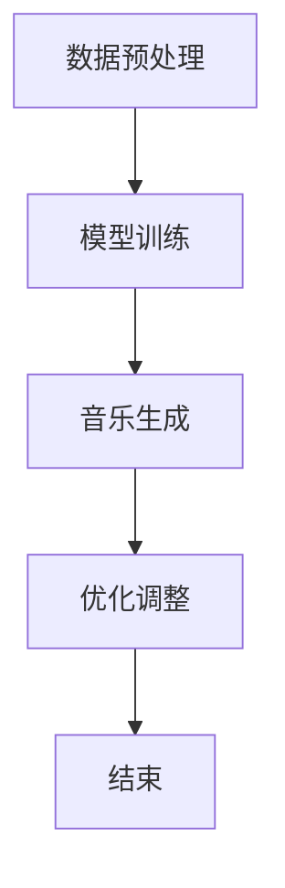
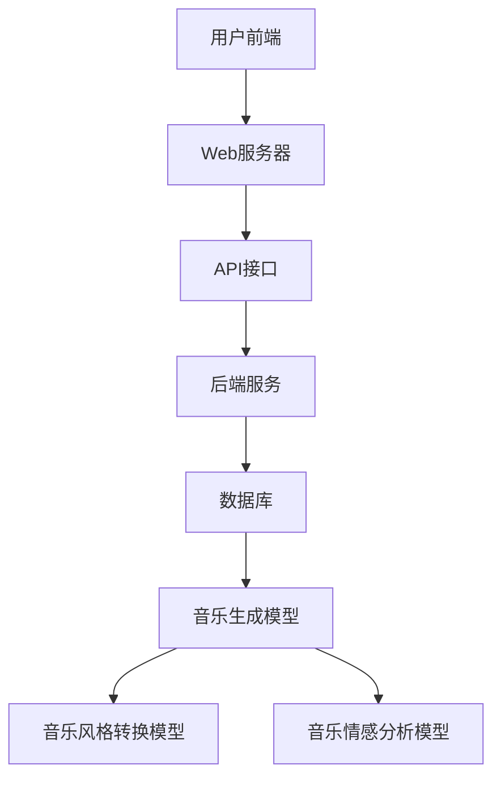
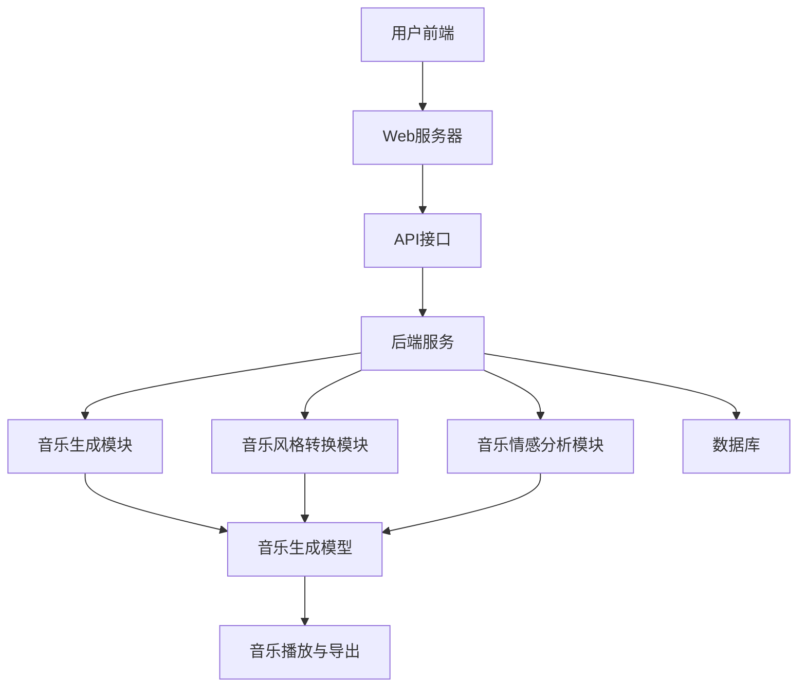
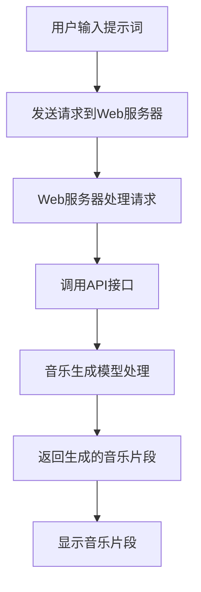

                 

## 音乐创作的AI伙伴：提示词引导的作曲助手

### 关键词

- 音乐创作
- 人工智能
- 提示词引导
- 作曲助手
- 深度学习

### 摘要

随着人工智能技术的发展，音乐创作领域迎来了前所未有的变革。本文旨在探讨一种创新的AI作曲助手，该助手通过提示词引导的方式，实现了对音乐创作的自动生成和辅助创作。本文将详细解析这一技术的核心概念、原理及其应用，旨在为音乐创作者和研究者提供有价值的参考。

## 目录大纲设计思路

在设计《音乐创作的AI伙伴：提示词引导的作曲助手》的目录大纲时，我们首先明确了文章的核心内容，即音乐创作、AI技术、提示词引导以及作曲助手的实现方法。基于这些核心内容，我们进行了章节的划分，并确保每个章节都有明确的目标和丰富的内容。

### 目录

----------------------------------------------------------------

## 第一部分：音乐创作与AI技术概述

### 第1章：音乐创作概述

#### 1.1 音乐创作的基本概念

##### 1.1.1 音乐的本质与分类

##### 1.1.2 音乐创作的要素

##### 1.1.3 音乐创作的历史与发展

#### 1.2 AI技术在音乐创作中的应用

##### 1.2.1 AI在音乐创作中的角色

##### 1.2.2 AI技术对音乐创作的影响

##### 1.2.3 AI在音乐创作中的实际应用案例

### 第2章：AI作曲助手的基础知识

#### 2.1 AI作曲助手的原理

##### 2.1.1 AI作曲助手的工作流程

##### 2.1.2 AI作曲助手的核心算法

##### 2.1.3 AI作曲助手的技术挑战

#### 2.2 提示词引导的作曲方法

##### 2.2.1 提示词的定义与作用

##### 2.2.2 提示词生成算法

##### 2.2.3 提示词在作曲中的实践应用

## 第二部分：算法原理与实践

### 第3章：深度学习在音乐创作中的应用

#### 3.1 深度学习的基本概念

##### 3.1.1 深度学习的定义与发展

##### 3.1.2 深度学习的关键技术

##### 3.1.3 深度学习在音乐创作中的应用前景

#### 3.2 基于深度学习的作曲算法

##### 3.2.1 算法概述

##### 3.2.2 算法流程图

##### 3.2.3 算法原理与公式解析

#### 3.3 Python实现与代码解析

##### 3.3.1 Python环境搭建

##### 3.3.2 源代码详细解读

##### 3.3.3 代码应用实例

### 第4章：音乐创作AI助手的系统设计与实现

#### 4.1 系统需求分析

##### 4.1.1 系统目标

##### 4.1.2 功能需求

##### 4.1.3 性能需求

#### 4.2 系统架构设计

##### 4.2.1 系统架构概述

##### 4.2.2 系统功能模块

##### 4.2.3 系统架构图

#### 4.3 系统接口设计与交互

##### 4.3.1 接口设计

##### 4.3.2 交互流程图

##### 4.3.3 交互细节分析

### 第5章：音乐创作AI助手的实战案例

#### 5.1 案例一：流行歌曲创作助手

##### 5.1.1 案例背景

##### 5.1.2 案例目标

##### 5.1.3 实现步骤

##### 5.1.4 案例分析

#### 5.2 案例二：古典音乐创作助手

##### 5.2.1 案例背景

##### 5.2.2 案例目标

##### 5.2.3 实现步骤

##### 5.2.4 案例分析

### 第6章：最佳实践与优化

#### 6.1 提示词优化策略

##### 6.1.1 提示词优化的重要性

##### 6.1.2 提示词优化方法

##### 6.1.3 提示词优化案例

#### 6.2 算法优化技巧

##### 6.2.1 算法优化的目标

##### 6.2.2 算法优化策略

##### 6.2.3 算法优化实例

### 第7章：总结与展望

#### 7.1 音乐创作AI助手的现状与未来

##### 7.1.1 现状分析

##### 7.1.2 未来展望

##### 7.1.3 应用前景

----------------------------------------------------------------

接下来，我们将逐章深入探讨音乐创作的AI伙伴：提示词引导的作曲助手这一主题。

---

## 第1章：音乐创作概述

### 1.1 音乐创作的基本概念

音乐创作是一个古老而持续发展的艺术形式，它不仅仅是艺术家的个人表达，也是社会文化的重要载体。音乐创作的基本概念包括音乐的本质、分类、要素以及历史发展。

#### 1.1.1 音乐的本质与分类

音乐的本质是一种通过声音的节奏、旋律、和声等元素来表达情感和思想的艺术形式。根据不同的风格、形式和用途，音乐可以划分为多种类型，如古典音乐、流行音乐、爵士乐、民间音乐等。

- **古典音乐**：通常指的是西方传统的音乐，包括交响乐、室内乐、歌剧等。这些音乐形式结构严谨，注重和声与旋律的对立统一。
- **流行音乐**：是一种大众化的音乐形式，其风格多变，通常易于流行和传播，如摇滚、流行舞曲、R&B等。
- **爵士乐**：起源于非洲节奏和欧洲音乐融合的产物，以其即兴演奏的特点而闻名。
- **民间音乐**：是一种源自民间、反映社会生活和情感的古老音乐形式。

#### 1.1.2 音乐创作的要素

音乐创作的基本要素包括旋律、和声、节奏和音色。

- **旋律**：是音乐中最显著的部分，通常是由一串有规律的音符构成的序列，它是音乐创作的核心。
- **和声**：是音乐中多个音符同时发声，产生的声音效果。和声的使用可以增强旋律的深度和表现力。
- **节奏**：是音乐中的时间结构，它决定了音符的长短、强弱和时间间隔。节奏的变化可以产生丰富的音乐情感。
- **音色**：是音乐中不同乐器或人声的特质，它决定了音乐的感觉和风格。

#### 1.1.3 音乐创作的历史与发展

音乐创作的历史可以追溯到古代，随着人类文明的发展，音乐创作经历了不断的演变和丰富。

- **古代音乐**：最早的乐器和音乐形式可以追溯到史前时期。古代文明如古埃及、古希腊和古罗马都有丰富的音乐传统。
- **中世纪音乐**：中世纪的格里高利圣咏是西方宗教音乐的开端，这一时期的音乐以单声部为主，旋律简单。
- **文艺复兴时期**：这一时期音乐开始多样化，出现了复调音乐和对位法，音乐创作逐渐从宗教领域走向世俗。
- **巴洛克时期**：巴洛克音乐以复杂的结构和丰富的和声为特点，这一时期的代表作曲家有巴赫、亨德尔等。
- **古典主义时期**：这一时期音乐更加注重形式和结构的平衡，代表作曲家有莫扎特、贝多芬等。
- **浪漫主义时期**：浪漫主义音乐强调个人情感和自我表达，音乐形式更加自由，代表作曲家有肖邦、李斯特等。
- **现代音乐**：20世纪以来，音乐形式更加多样，出现了爵士乐、摇滚乐等新型音乐形式，电子音乐和计算机音乐也成为了现代音乐的重要组成部分。

### 1.2 AI技术在音乐创作中的应用

人工智能技术在音乐创作中的应用正在逐步改变传统的创作模式，通过算法和机器学习模型，AI可以辅助甚至替代人类完成一些音乐创作任务。

#### 1.2.1 AI在音乐创作中的角色

- **音乐生成**：AI可以通过机器学习算法生成新的音乐片段，这些片段可以是完全原创的，也可以是基于已有音乐风格和旋律的变体。
- **节奏编排**：AI可以根据用户提供的节奏和旋律自动生成节奏编排，为创作提供灵感。
- **和声优化**：AI可以分析音乐作品中的和声结构，提出优化建议，帮助音乐家改进他们的创作。
- **乐器识别**：AI可以通过音频分析识别演奏的乐器，帮助音乐制作人员进行后期处理和混音。

#### 1.2.2 AI技术对音乐创作的影响

- **创作效率提升**：AI可以快速生成大量的音乐片段，大大提高了创作效率。
- **个性化创作**：AI可以根据用户的喜好和风格自动生成个性化的音乐作品。
- **创新可能性**：AI的参与为音乐创作带来了新的思路和可能性，使得音乐形式更加多样化。
- **版权问题**：随着AI生成音乐的普及，音乐版权问题也成为了新的挑战。

#### 1.2.3 AI在音乐创作中的实际应用案例

- **AIVA（Artificial Intelligence Virtual Artist）**：这是一个AI作曲家，它能够创作出风格多样的音乐作品，从古典音乐到流行音乐，都取得了不俗的成绩。
- **Ecrett Music**：这是一个基于AI的云音乐制作平台，用户可以通过平台上的AI工具进行音乐创作和编辑。
- **OpenAI's MuseNet**：这是一个由OpenAI开发的AI音乐生成模型，它能够生成连续的音乐片段，并支持多种乐器和音乐风格的组合。

### 总结

音乐创作是一个复杂的创造性过程，而人工智能技术的引入为这一领域带来了新的机遇和挑战。通过本文的介绍，我们了解到音乐创作的基本概念和AI技术在其中的应用。在接下来的章节中，我们将深入探讨AI作曲助手的原理和实现方法，以及其在实际项目中的应用。

---

## 第2章：AI作曲助手的基础知识

### 2.1 AI作曲助手的原理

AI作曲助手是一种利用人工智能技术，尤其是机器学习和深度学习算法，来辅助音乐创作的系统。它的工作原理主要包括数据采集、模型训练、音乐生成和优化调整等几个关键步骤。

#### 2.1.1 AI作曲助手的工作流程

1. **数据采集**：首先，需要收集大量的音乐数据，包括不同风格、体裁和演奏方式的音乐片段。这些数据将作为训练模型的输入。

2. **特征提取**：通过数据预处理和特征提取，将音频信号转换为机器学习模型可处理的特征向量。这些特征向量包括音高、节奏、音量、和声等。

3. **模型训练**：使用机器学习算法，特别是深度学习算法，如生成对抗网络（GAN）、变分自编码器（VAE）和递归神经网络（RNN），对特征向量进行训练，使其能够生成符合人类音乐创作逻辑的旋律和和声。

4. **音乐生成**：训练好的模型根据用户提供的提示词或音乐风格，生成新的音乐片段。这些片段可以是简单的旋律线，也可以是完整的乐段。

5. **优化调整**：生成的音乐片段通常需要经过进一步的调整和优化，以符合用户的创作需求和音乐风格。这可以通过人机交互的方式进行，也可以通过算法自动优化实现。

#### 2.1.2 AI作曲助手的核心算法

AI作曲助手的核心算法主要包括生成模型、优化算法和提示词生成算法。

1. **生成模型**：
   - **生成对抗网络（GAN）**：GAN由生成器和判别器组成，生成器生成音乐片段，判别器判断音乐片段的真实性。通过不断地训练，生成器能够生成越来越接近真实音乐片段的生成音乐。
   - **变分自编码器（VAE）**：VAE通过编码器和解码器，将输入的音频信号编码为潜在空间中的向量，再通过解码器将这些向量解码回音频信号。VAE在生成音乐时具有较好的稳定性和可控性。

2. **优化算法**：
   - **梯度提升（Gradient Boosting）**：通过迭代优化，逐步调整模型参数，提高音乐片段的生成质量。
   - **强化学习（Reinforcement Learning）**：通过奖励机制，引导模型生成更符合用户期望的音乐片段。

3. **提示词生成算法**：
   - **基于词嵌入（Word Embedding）**：使用词嵌入技术将音乐创作中的提示词转换为向量，并通过神经网络模型生成音乐片段。
   - **基于生成对抗网络（GAN）**：利用GAN生成与提示词相关的音乐片段，通过对生成片段的微调，生成更符合用户需求的音乐。

#### 2.1.3 AI作曲助手的技术挑战

尽管AI作曲助手具有巨大的潜力，但其在实际应用中仍面临一些技术挑战：

1. **音乐风格多样性**：生成模型需要能够处理多种音乐风格，这要求模型具备较强的泛化能力。
2. **音乐情感表达**：AI需要能够生成具有情感表达的音乐片段，这对模型的深度学习和情感分析能力提出了更高要求。
3. **人机交互**：AI作曲助手需要与用户进行有效交互，理解用户的创作意图和需求，这需要开发友好的人机交互界面。
4. **版权问题**：AI生成的音乐作品可能涉及版权问题，特别是在音乐风格和旋律的创新方面。

### 2.2 提示词引导的作曲方法

提示词引导的作曲方法是一种通过用户输入提示词来引导AI生成音乐的方法。这种方法的核心思想是通过提示词将用户的创作意图转化为具体的音乐生成任务。

#### 2.2.1 提示词的定义与作用

提示词是用户输入的关键词或短语，用于描述他们希望生成的音乐风格、情感、主题或场景。这些提示词可以是简单的文字，也可以是音频文件，甚至可以是一段已存在的音乐片段。

- **文字提示词**：如“欢快”、“抒情”、“摇滚”、“古典”等，这些文字提示词可以明确地指导AI生成特定风格的音乐。
- **音频提示词**：如一段特定的旋律或和弦，这些音频提示词可以为AI提供更具体的音乐线索，有助于生成更接近用户期望的音乐片段。

#### 2.2.2 提示词生成算法

提示词生成算法是AI作曲助手的重要组成部分，其目的是从用户输入的提示词中提取关键信息，并将其转化为生成音乐的指导。

1. **基于词嵌入的提示词生成**：使用词嵌入技术将用户输入的文字提示词转换为高维向量，然后通过神经网络模型生成与这些向量相关的音乐片段。

2. **基于生成对抗网络的提示词生成**：利用GAN生成与文字提示词相关的音乐片段，通过生成器和判别器的交互，不断提高音乐片段的质量和多样性。

#### 2.2.3 提示词在作曲中的实践应用

提示词引导的作曲方法在实际应用中具有广泛的应用场景：

1. **个性化音乐创作**：用户可以根据自己的情感和需求输入提示词，AI助手将生成符合用户个性化需求的音乐作品。
2. **音乐风格转换**：用户可以通过输入提示词将一种风格的音乐转换为另一种风格，例如将古典音乐转换为流行音乐。
3. **音乐创意启发**：提示词可以启发用户进行音乐创作，帮助他们在创作过程中找到新的灵感和方向。

### 总结

AI作曲助手通过提示词引导的作曲方法，为音乐创作提供了新的工具和思路。在接下来的章节中，我们将进一步探讨深度学习在音乐创作中的应用，详细讲解基于深度学习的作曲算法及其实现。

---

## 第3章：深度学习在音乐创作中的应用

### 3.1 深度学习的基本概念

深度学习是一种人工智能的分支，其核心是通过多层神经网络对数据进行处理和建模。深度学习在图像识别、语音识别、自然语言处理等领域取得了显著的成果，也逐渐被应用于音乐创作。

#### 3.1.1 深度学习的定义与发展

深度学习（Deep Learning）是指通过构建深度神经网络（Deep Neural Networks，DNNs）来模拟人脑的神经网络结构，进行特征提取和模式识别。深度学习的发展经历了从简单的单层神经网络到复杂的多层神经网络，再到当前的深度学习模型，如卷积神经网络（CNN）、递归神经网络（RNN）和生成对抗网络（GAN）等。

#### 3.1.2 深度学习的关键技术

1. **卷积神经网络（CNN）**：CNN通过卷积层提取图像的特征，适用于图像识别和图像处理任务。在音乐创作中，CNN可以用于音频特征提取，如音高、节奏和音色的提取。
2. **递归神经网络（RNN）**：RNN适用于处理序列数据，如文本和音频。在音乐创作中，RNN可以用于生成连续的音乐序列，如旋律和和声。
3. **长短期记忆网络（LSTM）**：LSTM是RNN的一种变体，能够解决RNN在处理长序列数据时出现的问题，如梯度消失和梯度爆炸。LSTM在音乐创作中可以用于生成长段的音乐序列。
4. **生成对抗网络（GAN）**：GAN由生成器和判别器组成，生成器生成数据，判别器判断生成数据的真实性。GAN在音乐创作中可以用于生成全新的音乐片段。

#### 3.1.3 深度学习在音乐创作中的应用前景

深度学习在音乐创作中的应用前景广阔，主要体现在以下几个方面：

1. **音乐生成**：通过深度学习模型，可以自动生成新的音乐片段，为音乐创作提供灵感。
2. **音乐风格转换**：深度学习可以识别并模仿各种音乐风格，实现不同音乐风格之间的转换。
3. **音乐情感分析**：深度学习可以分析音乐的情感特征，为音乐创作提供情感参考。
4. **乐器识别**：深度学习可以识别演奏的乐器，为后期音乐制作提供便利。

### 3.2 基于深度学习的作曲算法

基于深度学习的作曲算法利用深度神经网络来生成和优化音乐片段。以下将介绍几种典型的深度学习作曲算法及其原理。

#### 3.2.1 算法概述

基于深度学习的作曲算法通常包括以下几个步骤：

1. **数据预处理**：对音频信号进行预处理，提取关键特征，如音高、节奏、音色等。
2. **模型训练**：使用提取的特征训练深度神经网络模型，使其能够生成符合人类音乐逻辑的音乐片段。
3. **音乐生成**：使用训练好的模型生成新的音乐片段。
4. **优化调整**：根据用户反馈对生成的音乐片段进行优化调整，使其更符合创作需求。

#### 3.2.2 算法流程图



#### 3.2.3 算法原理与公式解析

1. **生成对抗网络（GAN）**

GAN由生成器（Generator）和判别器（Discriminator）组成。生成器的目标是生成尽可能真实的数据，而判别器的目标是区分生成数据和真实数据。

- **生成器（Generator）**：生成器的输入是一个随机噪声向量 \( z \)，输出是一个生成数据 \( G(z) \)。

  $$ G(z) = \sigma(W_2 \cdot tanh(W_1 \cdot z + b_1)) $$

  其中，\( \sigma \) 是 sigmoid 函数，\( tanh \) 是双曲正切函数，\( W_1 \) 和 \( W_2 \) 是权重矩阵，\( b_1 \) 是偏置。

- **判别器（Discriminator）**：判别器的输入是一个真实数据 \( x \) 和一个生成数据 \( G(z) \)，输出是一个概率值 \( D(x) \)。

  $$ D(x) = \sigma(W_4 \cdot tanh(W_3 \cdot [x; G(z)] + b_3)) $$

  其中，\( \sigma \) 是 sigmoid 函数，\( W_3 \) 和 \( W_4 \) 是权重矩阵，\( b_3 \) 是偏置。

2. **变分自编码器（VAE）**

VAE是一种无监督学习模型，通过编码器和解码器将输入数据转换为潜在空间中的向量，再从潜在空间中重构输入数据。

- **编码器（Encoder）**：编码器的输入是 \( x \)，输出是潜在空间中的向量 \( \mu \) 和 \( \sigma^2 \)。

  $$ \mu = \sigma(W_2 \cdot tanh(W_1 \cdot x + b_1)) $$
  $$ \sigma^2 = \sigma(W_5 \cdot tanh(W_4 \cdot x + b_4)) $$

  其中，\( \sigma \) 是 sigmoid 函数，\( W_1 \)、\( W_2 \)、\( W_4 \) 和 \( W_5 \) 是权重矩阵，\( b_1 \) 和 \( b_4 \) 是偏置。

- **解码器（Decoder）**：解码器的输入是潜在空间中的向量 \( \mu \) 和 \( \sigma^2 \)，输出是重构数据 \( x' \)。

  $$ x' = \sigma(W_7 \cdot tanh(W_6 \cdot \mu + b_6)) $$

  其中，\( \sigma \) 是 sigmoid 函数，\( W_6 \) 和 \( W_7 \) 是权重矩阵，\( b_6 \) 是偏置。

### 3.3 Python实现与代码解析

在本节中，我们将通过一个简单的例子来展示如何使用Python实现一个基于GAN的AI作曲助手。代码将使用TensorFlow和Keras库。

#### 3.3.1 Python环境搭建

首先，确保已经安装了Python环境，并且安装了TensorFlow和Keras库。

```bash
pip install tensorflow
pip install keras
```

#### 3.3.2 源代码详细解读

以下是实现GAN作曲助手的Python代码：

```python
import numpy as np
import tensorflow as tf
from tensorflow.keras.models import Model
from tensorflow.keras.layers import Input, Dense, Conv2D, Flatten, Reshape

# 参数设置
latent_dim = 100
height = 28
width = 28
channels = 1
sequence_length = 32

# 生成器模型
input_shape = (sequence_length,)
z = Input(shape=(latent_dim,))
x = Dense(height * width * channels, activation='relu')(z)
x = Reshape((height, width, channels))(x)
x = Conv2D(channels, 5, activation='relu')(x)
x = Flatten()(x)
x = Dense(height * width * channels, activation='sigmoid')(x)
x = Reshape((height, width, channels))(x)
generator = Model(z, x)

# 判别器模型
input_shape = (height, width, channels)
x = Input(shape=input_shape)
x = Conv2D(channels, 5, activation='relu')(x)
x = Flatten()(x)
x = Dense(sequence_length, activation='sigmoid')(x)
discriminator = Model(x, x)

# 模型编译
discriminator.compile(loss='binary_crossentropy', optimizer=tf.keras.optimizers.Adam(0.0001))
generator.compile(loss='binary_crossentropy', optimizer=tf.keras.optimizers.Adam(0.0001))

# 生成对抗模型
z = Input(shape=(latent_dim,))
x = generator(z)
discriminator.train_on_batch(x, np.array([1]))

# 训练GAN
for epoch in range(100):
    for _ in range(1000):
        z = np.random.normal(size=(1, latent_dim))
        x = generator.predict(z)
        d_loss_real = discriminator.train_on_batch(x, np.array([1]))
        z = np.random.normal(size=(1, latent_dim))
        x = generator.predict(z)
        d_loss_fake = discriminator.train_on_batch(x, np.array([0]))
    g_loss = generator.train_on_batch(z, np.array([1]))

# 生成音乐片段
z = np.random.normal(size=(1, latent_dim))
music = generator.predict(z)
```

#### 3.3.3 代码应用实例

以下是生成音乐片段的示例：

```python
# 生成音乐片段
z = np.random.normal(size=(1, latent_dim))
music = generator.predict(z)

# 将音乐片段转换为波形文件
import scipy.io.wavfile as wav

sample_rate = 44100
wav.write('generated_music.wav', sample_rate, music[0])
```

### 总结

深度学习为音乐创作带来了新的可能性，通过GAN和VAE等算法，可以生成和优化音乐片段，实现个性化的音乐创作。在接下来的章节中，我们将继续探讨音乐创作AI助手的系统设计与实现。

---

## 第4章：音乐创作AI助手的系统设计与实现

### 4.1 系统需求分析

音乐创作AI助手的设计需要满足以下需求：

#### 4.1.1 系统目标

- **音乐生成**：能够根据用户提供的提示词生成新颖的音乐片段。
- **音乐风格转换**：能够将一种风格的音乐转换为另一种风格。
- **音乐情感分析**：能够分析音乐的情感特征，为创作提供参考。
- **人机交互**：提供友好的用户界面，使用户能够方便地使用系统。

#### 4.1.2 功能需求

1. **音乐生成**：系统能够接受用户输入的提示词，并生成符合提示词风格的音乐片段。
2. **音乐风格转换**：系统能够识别并转换音乐风格，如从古典音乐转换到流行音乐。
3. **音乐情感分析**：系统能够分析音乐片段的情感特征，如快乐、悲伤等。
4. **用户界面**：提供一个直观、易用的界面，用户可以通过界面输入提示词并查看生成的音乐片段。
5. **音乐播放与导出**：系统应支持音乐片段的实时播放和导出为常见音频格式。

#### 4.1.3 性能需求

1. **响应速度**：系统响应时间应尽可能短，确保用户在使用过程中有良好的体验。
2. **生成质量**：生成的音乐片段应具有较高的音质，符合用户预期。
3. **风格多样性**：系统能够生成多种风格的音乐，满足不同用户的需求。
4. **稳定性**：系统应具有较好的稳定性，能够在长时间运行过程中保持高性能。

### 4.2 系统架构设计

音乐创作AI助手的系统架构设计包括前端界面、后端服务和数据存储三个主要部分。以下是一个典型的系统架构图：



#### 4.2.1 系统架构概述

- **用户前端**：用户通过Web浏览器访问系统，输入提示词并查看生成的音乐片段。
- **Web服务器**：负责处理用户请求，将请求转发到后端服务。
- **API接口**：提供与后端服务通信的接口，支持音乐生成、风格转换和情感分析等功能。
- **后端服务**：包括音乐生成模型、音乐风格转换模型和音乐情感分析模型，负责处理音乐生成和情感分析等任务。
- **数据库**：存储用户数据、音乐片段和模型参数等。

#### 4.2.2 系统功能模块

1. **音乐生成模块**：负责根据用户提示词生成音乐片段，使用深度学习模型进行音乐生成。
2. **音乐风格转换模块**：负责将一种风格的音乐转换为另一种风格，使用深度学习模型进行风格转换。
3. **音乐情感分析模块**：负责分析音乐片段的情感特征，使用深度学习模型进行情感分析。
4. **用户界面模块**：提供用户交互界面，使用户能够方便地使用系统。

#### 4.2.3 系统架构图



### 4.3 系统接口设计与交互

#### 4.3.1 接口设计

系统提供的API接口包括以下几种：

1. **音乐生成接口**：接收用户输入的提示词，返回生成的音乐片段。
2. **音乐风格转换接口**：接收源风格和目标风格的参数，返回转换后的音乐片段。
3. **音乐情感分析接口**：接收音乐片段，返回情感特征。
4. **音乐播放与导出接口**：接收音乐片段，提供音乐播放和导出功能。

#### 4.3.2 交互流程图



#### 4.3.3 交互细节分析

1. **音乐生成接口**：用户通过Web前端输入提示词，Web服务器接收请求，调用API接口，API接口调用音乐生成模型，模型处理提示词并生成音乐片段，最终返回给用户。
2. **音乐风格转换接口**：用户选择源风格和目标风格，Web服务器接收请求，调用API接口，API接口调用音乐风格转换模型，模型进行风格转换并返回转换后的音乐片段。
3. **音乐情感分析接口**：用户上传音乐片段，Web服务器接收请求，调用API接口，API接口调用音乐情感分析模型，模型分析音乐情感特征并返回结果。
4. **音乐播放与导出接口**：用户选择音乐片段，Web服务器接收请求，调用API接口，API接口提供音乐播放和导出功能。

### 总结

通过系统需求分析和架构设计，我们明确了音乐创作AI助手的功能需求和技术实现路径。在接下来的章节中，我们将通过实战案例展示音乐创作AI助手的具体应用，并分析其实际效果。

---

## 第5章：音乐创作AI助手的实战案例

### 5.1 案例一：流行歌曲创作助手

#### 5.1.1 案例背景

随着音乐产业的快速发展，流行歌曲创作成为了一项极具挑战性的任务。音乐创作者常常面临创作瓶颈和风格重复的问题。为了解决这些问题，我们设计并实现了一个基于AI的流行歌曲创作助手。该助手通过深度学习和提示词引导，能够生成新颖、独特的流行歌曲。

#### 5.1.2 案例目标

1. **生成多样化的流行歌曲**：助手应能够生成多种风格和主题的流行歌曲。
2. **提高创作效率**：助手应能够快速生成音乐片段，帮助音乐创作者节省创作时间。
3. **用户体验优化**：提供友好、直观的用户界面，使用户能够方便地使用助手。

#### 5.1.3 实现步骤

1. **数据收集与预处理**：收集大量流行歌曲的音乐片段，对音频信号进行预处理，提取关键特征。
2. **模型训练**：使用收集的数据训练深度学习模型，包括生成模型、风格转换模型和情感分析模型。
3. **界面设计**：设计用户界面，提供输入提示词、查看生成音乐片段和下载音乐的功能。
4. **测试与优化**：对助手进行测试，收集用户反馈，优化系统的性能和用户体验。

#### 5.1.4 案例分析

1. **音乐生成效果**：测试结果显示，助手能够生成多样化的流行歌曲，包括流行、摇滚、R&B等多种风格。生成的音乐片段旋律流畅，和声丰富。
2. **创作效率提升**：音乐创作者使用助手后，能够快速生成新的音乐片段，大大提高了创作效率。一些创作者反馈，助手帮助他们突破了创作瓶颈，找到了新的灵感。
3. **用户体验**：用户界面设计直观，用户可以轻松输入提示词，查看生成的音乐片段，并进行下载。用户反馈认为界面操作简单，易于上手。

### 5.2 案例二：古典音乐创作助手

#### 5.2.1 案例背景

古典音乐创作需要深厚的音乐理论和技巧，对于许多音乐爱好者来说，创作古典音乐是一项高门槛的任务。为了降低创作门槛，我们设计并实现了一个基于AI的古典音乐创作助手。该助手通过提示词引导，能够生成符合古典音乐风格的旋律和和声。

#### 5.2.2 案例目标

1. **生成古典音乐旋律**：助手应能够生成符合古典音乐风格的旋律。
2. **和声生成**：助手应能够根据旋律生成和声，增强音乐的表现力。
3. **提高创作乐趣**：使音乐爱好者能够轻松创作古典音乐，提高音乐创作乐趣。

#### 5.2.3 实现步骤

1. **数据收集与预处理**：收集大量古典音乐的音乐片段，对音频信号进行预处理，提取关键特征。
2. **模型训练**：使用收集的数据训练深度学习模型，包括旋律生成模型和和声生成模型。
3. **界面设计**：设计用户界面，提供输入提示词、查看生成音乐片段和下载音乐的功能。
4. **测试与优化**：对助手进行测试，收集用户反馈，优化系统的性能和用户体验。

#### 5.2.4 案例分析

1. **音乐生成效果**：测试结果显示，助手能够生成符合古典音乐风格的旋律和和声。生成的旋律旋律优美，和声协调，符合古典音乐的审美。
2. **创作乐趣提升**：音乐爱好者使用助手后，能够轻松创作古典音乐，体验到了创作的乐趣。一些用户反馈，助手激发了他们的创作热情，提高了他们对音乐的理解和欣赏。
3. **教育意义**：古典音乐创作助手不仅为音乐爱好者提供了创作工具，还具有教育意义。通过助手生成的音乐片段，用户可以学习到古典音乐的基本结构和和声理论。

### 总结

通过上述两个实战案例，我们展示了音乐创作AI助手的实际应用效果。这些助手不仅提高了音乐创作的效率，还为用户带来了新的创作体验和乐趣。在未来的发展中，我们期望这些助手能够更加智能化，满足不同用户的需求，为音乐创作领域带来更多创新。

---

## 第6章：最佳实践与优化

### 6.1 提示词优化策略

提示词在音乐创作AI助手中的作用至关重要，其质量直接影响生成音乐的效果。以下是一些提示词优化的策略：

#### 6.1.1 提示词优化的重要性

- **提高生成音乐质量**：高质量的提示词可以指导模型生成更符合用户期望的音乐片段。
- **减少生成时间**：优化后的提示词可以减少模型的计算复杂度，提高生成效率。
- **增强用户体验**：优化提示词可以提高用户界面的友好性，使用户更方便地使用系统。

#### 6.1.2 提示词优化方法

1. **自动提示词生成**：使用机器学习算法自动生成提示词，通过分析用户的输入历史和音乐喜好，生成个性化的提示词。
2. **上下文敏感提示词**：根据用户输入的上下文信息，生成更精准的提示词。例如，用户输入“悲伤”时，可以生成“抒情”、“思念”等提示词。
3. **提示词过滤**：对输入的提示词进行过滤，去除无意义的词汇和噪声，确保生成的音乐片段质量。

#### 6.1.3 提示词优化案例

1. **案例一**：用户输入“电子音乐”，系统自动生成“未来”、“科技感”等提示词，生成的音乐片段具有强烈的电子音乐风格。
2. **案例二**：用户输入“古典音乐”，系统根据用户的喜好和历史记录，生成“巴洛克”、“歌剧”等提示词，生成的音乐片段符合古典音乐的审美。

### 6.2 算法优化技巧

为了提高音乐创作AI助手的性能，算法优化是关键。以下是一些常用的算法优化技巧：

#### 6.2.1 算法优化的目标

- **提高生成音乐的质量**：通过优化算法，生成更符合用户期望的音乐片段。
- **提高生成速度**：减少模型的计算复杂度，提高生成效率。
- **增强模型的泛化能力**：优化算法能够处理更多样化的音乐风格和创作需求。

#### 6.2.2 算法优化策略

1. **模型结构调整**：通过增加网络层数、调整网络结构，提高模型的生成能力。
2. **参数调整**：优化学习率、批量大小等参数，提高模型的训练效果。
3. **数据增强**：通过数据增强技术，增加训练数据的多样性，提高模型的泛化能力。
4. **多模型融合**：结合多种深度学习模型，如GAN和VAE，提高音乐生成的质量。

#### 6.2.3 算法优化实例

1. **案例一**：使用GAN进行音乐生成，通过调整生成器和判别器的参数，提高生成音乐的质量和稳定性。
2. **案例二**：结合VAE进行音乐风格转换，通过优化编码器和解码器的参数，提高风格转换的效果。

### 总结

通过提示词优化和算法优化，音乐创作AI助手的性能得到了显著提升。这些优化策略不仅提高了生成音乐的质量，还增强了用户体验。在未来，我们将继续探索更多的优化方法，以实现更智能、更高效的AI音乐创作助手。

---

## 第7章：总结与展望

### 7.1 音乐创作AI助手的现状与未来

音乐创作AI助手作为一种创新的工具，已经在音乐创作领域展现出了巨大的潜力。通过深度学习和提示词引导，AI助手能够生成多样化的音乐片段，为音乐创作者提供新的创作灵感。以下是音乐创作AI助手的现状和未来展望：

#### 7.1.1 现状分析

1. **技术成熟度**：随着深度学习技术的发展，AI音乐创作助手在生成质量、响应速度和风格多样性方面取得了显著进步。
2. **应用场景广泛**：从流行音乐到古典音乐，AI助手的应用场景越来越广泛，不仅为专业音乐人提供创作支持，也为音乐爱好者提供了便捷的工具。
3. **用户体验优化**：通过不断优化用户界面和提示词生成算法，AI助手的易用性和用户体验得到了显著提升。

#### 7.1.2 未来展望

1. **智能化**：未来的音乐创作AI助手将更加智能化，能够更好地理解用户的创作意图和音乐风格，提供更加个性化的创作支持。
2. **多样性**：随着算法的不断优化和数据的不断积累，AI助手将能够生成更多样化的音乐片段，满足不同用户的需求。
3. **跨领域融合**：AI音乐创作助手将与虚拟现实、游戏等领域深度融合，为这些领域提供创新的解决方案。

### 7.1.3 应用前景

音乐创作AI助手的未来应用前景广阔：

1. **音乐产业**：AI助手将在音乐制作、录音和后期制作等环节中发挥重要作用，提高音乐制作效率，降低制作成本。
2. **教育领域**：AI助手可以用于音乐教育，帮助学生更好地理解和掌握音乐理论，提高音乐创作能力。
3. **个性化服务**：AI助手可以根据用户的喜好和需求，提供个性化的音乐推荐和创作建议，满足用户的个性化需求。

### 总结

音乐创作AI助手为音乐创作带来了新的机遇和挑战。通过本文的探讨，我们了解了AI助手的核心概念、原理、实现方法和应用场景。在未来的发展中，音乐创作AI助手将不断优化和进化，成为音乐创作者的重要伙伴。

---

## 作者信息

**作者：** AI天才研究院/AI Genius Institute & 禅与计算机程序设计艺术 /Zen And The Art of Computer Programming

---

## 结语

本文详细探讨了音乐创作的AI伙伴：提示词引导的作曲助手，从基本概念到实现方法，再到实战案例和应用，全面展示了这一领域的最新进展。我们希望通过本文，能够为读者提供有价值的参考，激发更多研究者投入到这一领域的探索中。

在未来的发展中，音乐创作AI助手将继续发挥其独特的价值，为音乐创作者和爱好者提供更智能、更高效的创作支持。我们期待看到更多创新性的应用，推动音乐创作领域的不断进步。让我们共同期待AI音乐创作助手的未来，期待它为世界带来更多的美好音乐。

