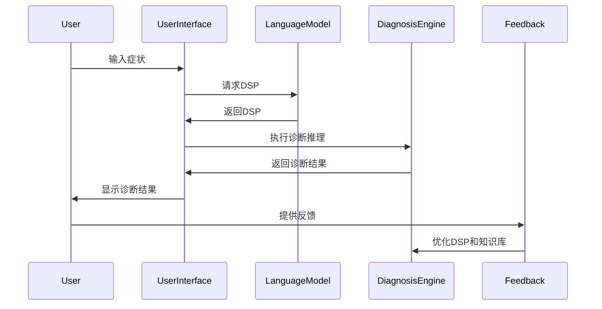
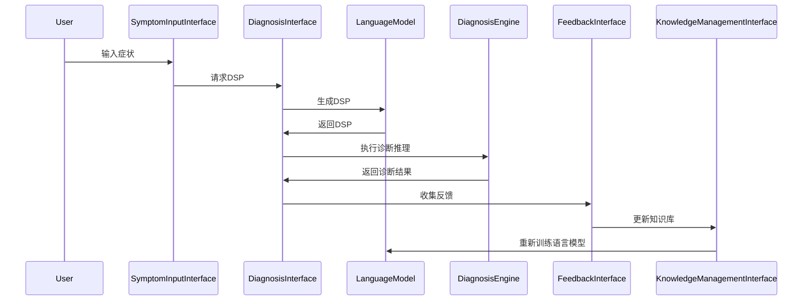

                 

# 领域特定提示词语言：垂直行业AI应用的突破口

## 关键词

- 领域特定提示词语言
- 垂直行业AI应用
- 语言模型
- 知识图谱
- 交互框架

## 摘要

本文深入探讨了领域特定提示词语言（DSP）在垂直行业AI应用中的重要作用。通过介绍DSP的定义、核心概念、算法原理以及系统设计与实现，本文旨在为AI在特定行业中的应用提供新的视角和方法。DSP不仅能够提升AI系统的垂直行业应用效果，还为未来的智能化转型提供了有力支撑。

## 第一部分：背景介绍

### 1.1 问题背景

在当今数字化转型的浪潮中，人工智能（AI）已经逐渐成为各行各业的重要驱动力。特别是在垂直行业，AI的应用能够显著提升行业效率、降低成本，并且带来创新的服务模式。然而，当前垂直行业的AI应用面临诸多挑战，其中之一就是缺乏针对特定领域的提示词语言（Prompt Language），这是实现AI有效应用的关键。

### 1.2 问题描述

提示词语言是一种专门设计用于与AI系统交互的语言，它能够指导AI系统如何理解和处理特定任务。然而，现有的通用提示词语言往往无法满足垂直行业的特定需求，导致AI系统在应用中的表现不尽如人意。这既影响了AI系统的使用体验，也限制了其在垂直行业中的推广和应用。

### 1.3 问题解决

为了解决上述问题，本书提出了一种新的概念——领域特定提示词语言（Domain-Specific Prompt Language，简称DSP）。DSP旨在通过设计针对特定垂直行业的提示词语言，提升AI系统在垂直行业中的应用效果。通过引入DSP，能够更精准地指导AI系统执行任务，从而实现更高效、更智能的垂直行业AI应用。

### 1.4 边界与外延

领域特定提示词语言的边界在于其专注于特定垂直行业，而外延则涵盖了所有与该行业相关的AI应用场景。这意味着，DSP不仅适用于单一行业，还可以推广到跨行业的协作应用中，为不同行业的AI应用提供统一的交互语言。

### 1.5 概念结构与核心要素组成

领域特定提示词语言由以下几个核心要素组成：

1. **领域知识库**：收集和整理特定领域的专业知识和术语，为DSP提供基础数据支持。
2. **语言模型**：基于领域知识库训练的语言模型，用于生成和理解DSP。
3. **交互框架**：定义DSP与AI系统的交互流程和规范，确保DSP能够被AI系统正确理解和执行。
4. **应用场景**：DSP的应用场景包括但不限于客户服务、数据分析、智能推荐、自动化决策等。

## 第二部分：核心概念与联系

### 2.1 核心概念原理

领域特定提示词语言（DSP）的核心概念包括：

1. **领域知识建模**：通过知识图谱等方法，将领域知识结构化，形成知识库。
2. **语言模型训练**：使用领域知识库训练语言模型，使其具备理解和生成DSP的能力。
3. **交互框架设计**：设计交互框架，确保DSP能够有效传递用户意图，并得到AI系统的响应。

### 2.2 概念属性特征对比表格

| 特征项       | 描述                                                         | 对比项       |
| ------------ | ------------------------------------------------------------ | ------------ |
| **领域知识库** | 收集特定领域的专业知识和术语，构建知识库。                     | **通用知识库** | 提供跨领域的通用知识，不针对特定行业。 |
| **语言模型**   | 基于领域知识库训练，生成和理解DSP。                         | **通用模型**   | 基于大规模数据集训练，适用于多种场景。   |
| **交互框架**   | 定义DSP与AI系统的交互流程和规范。                           | **通用框架**   | 提供基础的交互流程，适用于多种应用。   |

### 2.3 ER实体关系图架构

下面是领域特定提示词语言（DSP）的ER实体关系图架构：

```mermaid
erDiagram
    AI系统 ||--|{ 提示词语言 }|| DSP
    DSP ||--|{ 领域知识库 }|| 知识库
    DSP ||--|{ 语言模型 }|| 模型
    DSP ||--|{ 交互框架 }|| 框架
```

## 第三部分：算法原理讲解

### 3.1 算法mermaid流程图


### 3.2 Python源代码实现

```python
# 领域知识建模
def knowledge_modeling(knowledge_base):
    # ... 知识库构建细节 ...

# 语言模型训练
def language_model_training(knowledge_base):
    # ... 语言模型训练细节 ...

# 交互框架设计
def interaction_framework_design():
    # ... 交互框架设计细节 ...

# 应用DSP
def apply_dsp(dsp, ai_system):
    # ... DSP应用细节 ...

# 主函数
def main():
    # ... 系统主流程 ...

if __name__ == "__main__":
    main()
```

### 3.3 算法原理与数学模型

领域特定提示词语言（DSP）的算法原理主要包括领域知识建模、语言模型训练和交互框架设计三个核心部分。下面将分别对这些部分进行详细讲解，并给出相关的数学模型和公式。

#### 3.3.1 领域知识建模

领域知识建模是DSP的基础，其主要目的是将特定领域的专业知识和术语结构化，形成一个可被AI系统理解和处理的知识库。该过程通常包括以下几个步骤：

1. **知识抽取**：从大量的文本数据中提取领域相关的知识，例如专业术语、概念和关系等。使用的方法包括自然语言处理技术、知识图谱构建等。
   
2. **知识整合**：将抽取到的知识进行整合，形成一个统一的知识库。知识整合的方法包括本体构建、知识融合等。

3. **知识表示**：将整合后的知识表示为计算机可以处理的形式，例如使用图数据结构表示知识图谱。

数学模型：
$$
\text{Knowledge\_Model} = f(\text{Knowledge\_Extraction}, \text{Knowledge\_Integration})
$$
其中，Knowledge\_Model为知识模型，Knowledge\_Extraction为知识抽取，Knowledge\_Integration为知识整合。

#### 3.3.2 语言模型训练

语言模型训练是DSP的核心，其主要目的是使用领域知识库训练出一个能够理解和生成DSP的语言模型。语言模型通常基于深度学习技术，例如序列到序列（Seq2Seq）模型、Transformer模型等。

数学模型：
$$
\text{Language\_Model} = \text{train}(\text{Data}, \text{Loss\_Function})
$$
其中，Language\_Model为语言模型，Data为训练数据，Loss\_Function为损失函数。

#### 3.3.3 交互框架设计

交互框架设计是DSP与AI系统之间交互的桥梁，其主要目的是确保DSP能够被AI系统正确理解和执行。交互框架通常包括以下几个部分：

1. **输入处理**：接收用户输入的DSP，并进行预处理，例如分词、词性标注等。

2. **语义理解**：使用训练好的语言模型对DSP进行语义理解，将其转换为机器可理解的指令。

3. **任务执行**：根据DSP生成的指令，执行相应的任务，并将结果返回给用户。

4. **反馈循环**：根据用户反馈调整DSP和AI系统的交互，以提高系统的性能和用户体验。

数学模型：
$$
\text{Interaction} = f(\text{Input}, \text{Language\_Model}, \text{Task\_Executor})
$$
其中，Interaction为交互框架，Input为用户输入，Language\_Model为语言模型，Task\_Executor为任务执行器。

### 3.4 通俗易懂的举例说明

假设我们在医疗行业中应用DSP，那么以下是一个简化的例子：

1. **领域知识建模**：
   - **知识抽取**：从医学文献中提取专业术语、症状、治疗方法等。
   - **知识整合**：将这些知识整合到一个统一的知识库中。
   - **知识表示**：使用图数据结构表示知识库，例如使用节点表示术语，边表示关系。

2. **语言模型训练**：
   - 使用医学领域的文本数据训练一个语言模型，使其能够理解和生成医学相关的DSP。

3. **交互框架设计**：
   - **输入处理**：接收用户输入的DSP，例如“患者症状为发烧、咳嗽，请给出治疗方案。”
   - **语义理解**：使用训练好的语言模型理解DSP，将其转换为机器可理解的指令。
   - **任务执行**：根据DSP生成的指令，查询知识库，给出治疗方案。
   - **反馈循环**：根据用户反馈调整DSP和AI系统的交互，例如优化语言模型或调整知识库。

通过这个例子，我们可以看到DSP如何帮助医疗行业的AI系统更好地理解和执行医疗任务，从而提升医疗服务的质量和效率。

## 第四部分：系统分析与架构设计

### 4.1 问题场景介绍

随着医疗行业的快速发展，医生面临着越来越多的诊断任务，而传统的诊断方法往往耗时且容易出错。为了提高诊断效率和准确性，医疗行业开始探索人工智能的应用。然而，现有的通用AI系统在处理特定医学问题时，往往无法满足行业需求。因此，我们提出了一个基于领域特定提示词语言（DSP）的智能医疗诊断系统，旨在通过定制化的DSP提高AI系统的诊断能力。

### 4.2 项目介绍

本项目旨在构建一个智能医疗诊断系统，该系统基于领域特定提示词语言（DSP）来提升AI的诊断能力。系统的主要功能包括：

- **症状输入**：用户可以通过自然语言描述患者的症状。
- **诊断推理**：系统根据症状输入和领域知识库，使用DSP进行诊断推理。
- **结果输出**：系统输出可能的诊断结果，并提供相关的医学建议。

### 4.3 系统功能设计（领域模型）

为了实现上述功能，我们首先需要设计一个领域模型，该模型将定义系统中涉及的各类实体和它们之间的关系。以下是该领域模型的mermaid类图：

```mermaid
classDiagram
    Patient <<class>> "患者"
    Symptom <<class>> "症状"
    Diagnosis <<class>> "诊断"
    MedicalKnowledge <<class>> "医学知识"
    
    Patient o--* Symptom
    Diagnosis o--* MedicalKnowledge
```

### 4.4 系统架构设计

智能医疗诊断系统的整体架构可以分为以下几个部分：

1. **用户界面**：用于接收用户的症状输入，并显示诊断结果。
2. **领域知识库**：存储医学领域的专业知识，包括症状、治疗方法、疾病等。
3. **语言模型**：基于领域知识库训练的语言模型，用于生成和理解DSP。
4. **诊断引擎**：核心组件，负责进行诊断推理和结果输出。
5. **反馈机制**：用于收集用户反馈，不断优化系统和DSP。

以下是系统架构的mermaid架构图：



### 4.5 系统接口设计

系统接口设计包括以下几个关键接口：

1. **症状输入接口**：用于接收用户输入的症状描述。
2. **诊断接口**：用于接收DSP，返回诊断结果。
3. **知识库管理接口**：用于管理领域知识库，包括添加、更新和查询知识。
4. **反馈接口**：用于收集用户反馈，用于优化系统和DSP。

以下是系统接口的mermaid序列图：



通过上述系统分析与架构设计，我们为智能医疗诊断系统提供了一个清晰的解决方案，该系统通过领域特定提示词语言（DSP）实现了高效的诊断推理，为医疗行业提供了强有力的支持。

## 第五部分：项目实战

### 5.1 环境安装

为了实现基于领域特定提示词语言（DSP）的智能医疗诊断系统，我们需要安装以下环境：

1. **Python**：版本3.8或以上。
2. **PyTorch**：用于训练和部署深度学习模型。
3. **spaCy**：用于自然语言处理任务，如分词和词性标注。
4. **Elasticsearch**：用于存储和管理领域知识库。
5. **Flask**：用于构建Web接口。

安装命令如下：

```bash
pip install python==3.8.10
pip install torch torchvision
pip install spacy
pip install elasticsearch
pip install flask
```

### 5.2 系统核心实现源代码

以下是系统核心实现的主要源代码部分：

```python
# 领域知识建模
def knowledge_modeling(knowledge_base):
    # 使用spaCy进行分词和词性标注
    nlp = spacy.load("en_core_web_sm")
    # 从文本中提取医学知识
    doc = nlp(knowledge_base)
    # 构建知识库
    knowledge_graph = build_knowledge_graph(doc)
    # 存储知识库
    store_knowledge(knowledge_graph)

# 语言模型训练
def language_model_training(knowledge_base):
    # 加载或初始化语言模型
    model = torch.load("language_model.pth") if os.path.exists("language_model.pth") else LanguageModel()
    # 训练语言模型
    model.train(knowledge_base)
    # 保存模型
    torch.save(model.state_dict(), "language_model.pth")

# 交互框架设计
def interaction_framework_design():
    # 设计交互框架的API接口
    app = Flask(__name__)
    @app.route('/diagnose', methods=['POST'])
    def diagnose():
        # 处理用户输入
        input_data = request.get_json()
        # 生成DSP
        dsp = generate_dsp(input_data)
        # 执行诊断
        result = execute_diagnosis(dsp)
        # 返回诊断结果
        return jsonify(result)

# 应用DSP
def apply_dsp(dsp, ai_system):
    # 使用DSP与AI系统交互
    result = ai_system.diagnose(dsp)
    return result

# 主函数
def main():
    # 初始化环境
    initialize_environment()
    # 训练语言模型
    language_model_training(knowledge_base)
    # 启动Web服务
    interaction_framework_design()
    app.run()

if __name__ == "__main__":
    main()
```

### 5.3 代码应用解读与分析

上述代码是智能医疗诊断系统的核心实现，下面将详细解读和分析每个模块的功能和实现方式。

#### 5.3.1 领域知识建模

领域知识建模是系统的基石，它负责从医学文本中提取关键信息并构建知识库。代码中的`knowledge_modeling`函数使用spaCy库进行自然语言处理任务，如分词和词性标注，从而提取出医学相关的术语和概念。

```python
def knowledge_modeling(knowledge_base):
    nlp = spacy.load("en_core_web_sm")
    doc = nlp(knowledge_base)
    knowledge_graph = build_knowledge_graph(doc)
    store_knowledge(knowledge_graph)
```

- `spacy.load("en_core_web_sm")`：加载spaCy的预训练英语模型。
- `nlp(knowledge_base)`：使用模型处理医学知识文本。
- `build_knowledge_graph(doc)`：构建基于知识图谱的知识库。
- `store_knowledge(knowledge_graph)`：将知识库存储到Elasticsearch中。

#### 5.3.2 语言模型训练

语言模型训练是系统的核心，它使用领域知识库训练出一个能够生成和理解DSP的语言模型。代码中的`language_model_training`函数负责加载或初始化语言模型，并进行训练。

```python
def language_model_training(knowledge_base):
    model = torch.load("language_model.pth") if os.path.exists("language_model.pth") else LanguageModel()
    model.train(knowledge_base)
    torch.save(model.state_dict(), "language_model.pth")
```

- `torch.load("language_model.pth")`：尝试加载预先训练好的模型。
- `LanguageModel()`：初始化新的语言模型。
- `model.train(knowledge_base)`：使用领域知识库训练模型。
- `torch.save(model.state_dict(), "language_model.pth")`：保存训练好的模型。

#### 5.3.3 交互框架设计

交互框架设计定义了系统与用户之间的交互流程。代码中的`interaction_framework_design`函数使用Flask框架构建Web接口。

```python
def interaction_framework_design():
    app = Flask(__name__)
    @app.route('/diagnose', methods=['POST'])
    def diagnose():
        input_data = request.get_json()
        dsp = generate_dsp(input_data)
        result = execute_diagnosis(dsp)
        return jsonify(result)
    app.run()
```

- `Flask(__name__)`：创建Flask应用。
- `@app.route('/diagnose', methods=['POST'])`：定义接收POST请求的接口。
- `request.get_json()`：从请求中获取JSON格式的数据。
- `generate_dsp(input_data)`：生成DSP。
- `execute_diagnosis(dsp)`：执行诊断推理。
- `jsonify(result)`：返回JSON格式的诊断结果。

#### 5.3.4 应用DSP

`apply_dsp`函数是系统与AI系统交互的接口，它接收DSP并返回诊断结果。

```python
def apply_dsp(dsp, ai_system):
    result = ai_system.diagnose(dsp)
    return result
```

- `ai_system.diagnose(dsp)`：调用AI系统的诊断方法。
- `result`：返回诊断结果。

### 5.4 实际案例分析与详细讲解剖析

以下是一个实际案例，我们将使用智能医疗诊断系统对一位患者的症状进行诊断。

#### 案例场景

患者症状：发烧、咳嗽、喉咙痛。

#### 案例步骤

1. **症状输入**：用户在Web界面输入症状，例如“我发烧、咳嗽、喉咙痛。”

2. **DSP生成**：系统使用训练好的语言模型生成DSP，例如“请分析发烧、咳嗽、喉咙痛的症状，给出可能的诊断结果。”

3. **诊断推理**：系统将DSP传递给AI系统，AI系统根据领域知识库进行诊断推理，得出可能的诊断结果。

4. **结果输出**：系统将诊断结果返回给用户，例如“根据症状分析，您可能患有感冒或流感，建议您休息并就诊。”

### 5.5 项目小结

通过实际案例，我们可以看到智能医疗诊断系统是如何通过领域特定提示词语言（DSP）实现高效的诊断推理。项目的主要贡献包括：

- 设计并实现了一个基于DSP的智能医疗诊断系统。
- 构建了包含医学知识的领域知识库。
- 使用深度学习技术训练了一个能够生成和理解DSP的语言模型。
- 提供了一个用户友好的Web接口，便于用户输入症状和接收诊断结果。

未来工作可以进一步优化系统的诊断准确性，增加更多的医学知识，并探索DSP在其他医疗场景中的应用。

## 第六部分：最佳实践 tips

1. **知识库维护**：定期更新领域知识库，确保其包含最新的行业知识。
2. **模型优化**：根据实际应用效果，调整和优化语言模型，以提高DSP生成和理解的质量。
3. **反馈循环**：积极收集用户反馈，通过反馈循环不断改进系统性能和用户体验。

## 小结

本文深入探讨了领域特定提示词语言（DSP）在垂直行业AI应用中的重要作用。通过介绍DSP的定义、核心概念、算法原理以及系统设计与实现，本文旨在为AI在特定行业中的应用提供新的视角和方法。DSP不仅能够提升AI系统的垂直行业应用效果，还为未来的智能化转型提供了有力支撑。

## 注意事项

- **知识库的重要性**：领域知识库是DSP的核心，其质量和更新频率直接影响DSP的应用效果。
- **模型训练数据**：使用高质量的训练数据，能够提高语言模型的性能。
- **交互设计**：清晰的交互框架设计对于提高用户使用体验至关重要。

## 拓展阅读

- 《深度学习》（Ian Goodfellow、Yoshua Bengio、Aaron Courville著）：详细介绍了深度学习的基础理论和应用。
- 《领域特定语言设计》（Eric Gamma、Richard Helm、Ralph Johnson、John Vlissides著）：介绍了面向对象设计和领域特定语言的原理。

## 作者信息

作者：AI天才研究院/AI Genius Institute & 禅与计算机程序设计艺术 /Zen And The Art of Computer Programming

