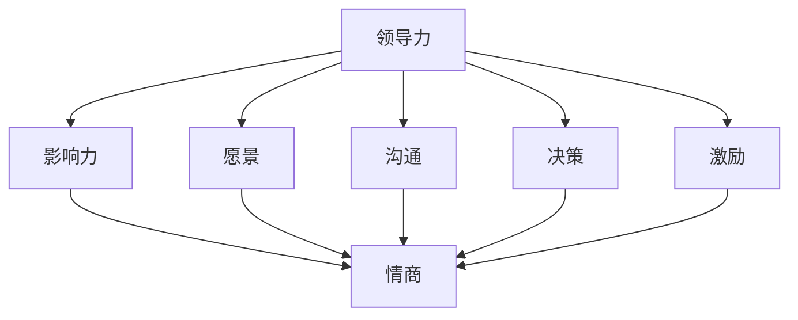

                 

# 领导力与情商：理解并管理情绪的能力

## 关键词：领导力、情商、情绪管理、领导能力、团队协作、管理技巧

> **摘要**：本文深入探讨了领导力与情商的关系，分析了情商在领导力中的作用，以及如何通过提升情商来增强领导力。文章首先介绍了领导力和情商的基本概念，接着探讨了情商的测量与评估方法，以及情商的培养与提升策略。在此基础上，文章进一步阐述了情商在领导决策、团队管理、领导力培训等方面的应用，最后分析了情商管理在企业中的重要性以及未来发展趋势。通过本文的阅读，读者将更好地理解领导力与情商的关系，学会如何运用情商提升领导能力。

## 目录大纲设计步骤

### 步骤 1: 确定整体结构

在设计本文之前，我们首先需要明确整体的结构。本文主要分为以下几个部分：

1. 引言与背景介绍
2. 领导力与情商的基本概念
3. 情商的测量与评估
4. 情商的培养与提升
5. 情商在领导力中的应用
6. 企业中的情商管理与策略
7. 情商与领导力的发展趋势

### 步骤 2: 设计每个章节的详细目录

根据整体结构，我们为每个章节设计了详细的目录。以下是每个章节的详细目录：

#### 第1章 引言与背景介绍

- **1.1 问题的提出与背景**
  - 领导力与情商的重要性和现状
  - 研究领导力与情商的必要性

- **1.2 领导力与情商的核心概念**
  - 领导力的定义与类型
  - 情商的定义与组成部分

- **1.3 领导力与情商的关系**
  - 情商在领导力中的作用
  - 情商对领导效果的影响

- **1.4 本书结构安排与学习目标**
  - 本书各章节内容安排
  - 学习本书的重要性和预期效果

#### 第2章 领导力与情商的基本概念

- **2.1 领导力的基本概念**
  - 领导力的定义与核心要素
  - 领导力的类型与模式

- **2.2 情商的基本概念**
  - 情商的定义与测量方法
  - 情商的组成部分与特点

- **2.3 领导力与情商的关系表**
  - 使用 Mermaid 画出领导力与情商的关系图

#### 第3章 情商的测量与评估

- **3.1 情商测量的重要性**
  - 情商测量在领导力发展中的应用

- **3.2 情商测量的方法与工具**
  - 常见的情商测量工具介绍
  - 测量工具的使用方法与评估标准

- **3.3 情商评估的案例分析**
  - 某企业领导情商评估案例分析
  - 案例分析与总结

#### 第4章 情商的培养与提升

- **4.1 情商培养的必要性**
  - 情商培养对领导力发展的作用

- **4.2 情商培养的方法与策略**
  - 内在自我认知与反思
  - 外在交流与情绪管理

- **4.3 情商提升的案例分析**
  - 某领导情商提升的实践案例
  - 案例分析与总结

#### 第5章 领导力中的情商应用

- **5.1 情商在领导决策中的应用**
  - 情商在决策过程中的作用
  - 情商影响决策效果的案例分析

- **5.2 情商在团队管理中的应用**
  - 情商在团队建设与管理中的角色
  - 情商在团队沟通与合作中的案例分析

- **5.3 情商在领导力培训中的应用**
  - 情商培训的设计与实施
  - 情商培训的效果评估

#### 第6章 企业中的情商管理与策略

- **6.1 情商管理的重要性**
  - 情商管理对企业绩效的影响

- **6.2 情商管理的策略与方法**
  - 情商管理的企业文化构建
  - 情商管理的制度建设

- **6.3 情商管理的实践案例**
  - 某企业情商管理的成功实践
  - 案例分析与总结

#### 第7章 情商与领导力的发展趋势

- **7.1 情商与领导力研究的新进展**
  - 当前情商与领导力研究的主要趋势

- **7.2 未来情商与领导力的发展方向**
  - 情商与领导力在新时代的挑战与机遇

- **7.3 总结与展望**
  - 情商与领导力研究的未来前景

### 步骤 3: 检查目录大纲的完整性

在完成目录大纲的设计后，我们需要检查目录大纲的完整性。这包括确保每个章节都有详细的内容描述，并且整体目录结构合理，符合读者的阅读习惯。同时，我们还需要注意目录中的各个章节之间的逻辑联系，确保信息的连贯性。

### 步骤 4: 优化目录大纲

在完成初步的目录大纲设计后，我们可以对目录进行优化。例如，调整章节顺序，合并或拆分某些章节，以使整个目录结构更加清晰、易于理解。

### 步骤 5: 最终确认

在完成目录大纲的设计后，我们需要进行最终确认。可以邀请同行或作者本人对目录大纲进行审查，确保其满足书籍的主题内容和目标读者的需求。

## 目录

----------------------------------------------------------------

## 第1章 引言与背景介绍

### 1.1 问题的提出与背景

#### 1.1.1 领导力与情商的重要性和现状

#### 1.1.2 研究领导力与情商的必要性

### 1.2 领导力与情商的核心概念

#### 1.2.1 领导力的定义与类型

#### 1.2.2 情商的定义与组成部分

### 1.3 领导力与情商的关系

#### 1.3.1 情商在领导力中的作用

#### 1.3.2 情商对领导效果的影响

### 1.4 本书结构安排与学习目标

#### 1.4.1 本书各章节内容安排

#### 1.4.2 学习本书的重要性和预期效果

## 第2章 领导力与情商的基本概念

### 2.1 领导力的基本概念

#### 2.1.1 领导力的定义

#### 2.1.2 领导力的核心要素

#### 2.1.3 领导力的类型与模式

### 2.2 情商的基本概念

#### 2.2.1 情商的定义

#### 2.2.2 情商的组成部分与特点

### 2.3 领导力与情商的关系表

#### 2.3.1 领导力与情商的关系图

----------------------------------------------------------------# 第1章 引言与背景介绍

## 1.1 问题的提出与背景

在当今快速变化的世界，领导力与情商的重要性日益凸显。领导力不仅仅是一种管理技能，更是一种能够激发团队潜能、推动组织发展的能力。情商，作为一种理解、管理自己情绪以及识别和影响他人情绪的能力，已成为领导力的重要组成部分。

### 1.1.1 领导力与情商的重要性和现状

领导力的重要性体现在其对企业绩效和组织发展的深远影响。有效的领导力能够促进创新、提高员工满意度、提升团队协作效率，从而为企业带来竞争优势。然而，领导力并非一蹴而就，它需要不断的培养和提升。

情商在领导力中的作用同样不可忽视。情商高的人能够更好地处理压力、应对挑战，并且在领导过程中能够更好地理解员工的需求和情感，从而建立更加紧密的团队关系。当前，越来越多的企业开始认识到情商对领导力的重要性，并将其纳入领导力发展的核心。

### 1.1.2 研究领导力与情商的必要性

研究领导力与情商的必要性在于：

1. **提升领导能力**：理解领导力与情商的关系，可以帮助领导者更好地发挥自身潜力，提升领导效能。
2. **优化组织管理**：通过提升领导者的情商，可以改善组织内部的沟通和协作，提高组织绩效。
3. **促进个人成长**：情商不仅对领导力有影响，也对个人的职业发展和生活满意度产生深远影响。
4. **应对时代挑战**：随着全球化和数字化的发展，领导者需要具备更高的情商来应对复杂多变的环境和挑战。

## 1.2 领导力与情商的核心概念

### 1.2.1 领导力的定义与类型

领导力是指引导和影响他人共同实现目标的能力。领导力的类型包括：

1. **变革型领导**：通过激发团队的潜力和创新，推动组织变革。
2. **交易型领导**：通过奖励和惩罚来激励员工，维持组织稳定。

### 1.2.2 情商的定义与组成部分

情商是指识别、理解、管理自己情绪，以及识别和影响他人情绪的能力。情商的组成部分包括：

1. **自我认知**：了解自己的情绪和需求。
2. **自我调节**：管理自己的情绪和行为。
3. **社交技能**：建立和维护人际关系。
4. **同理心**：理解他人的感受和需求。

### 1.3 领导力与情商的关系

情商在领导力中起着至关重要的作用。情商高的人能够更好地处理压力，建立信任关系，以及激励团队成员。领导力与情商的关系可以概括为：

1. **情商提升领导力**：高情商的领导者能够更好地理解员工的情绪，提高员工的满意度和工作绩效。
2. **领导力促进情商**：有效的领导行为能够激发员工的情商，促进团队的情感交流和协作。

### 1.4 本书结构安排与学习目标

#### 1.4.1 本书各章节内容安排

本书共分为7个章节，详细探讨了领导力与情商的关系，包括：

- 第1章：引言与背景介绍
- 第2章：领导力与情商的基本概念
- 第3章：情商的测量与评估
- 第4章：情商的培养与提升
- 第5章：情商在领导力中的应用
- 第6章：企业中的情商管理与策略
- 第7章：情商与领导力的发展趋势

#### 1.4.2 学习本书的重要性和预期效果

学习本书的重要性在于：

1. **提升领导力**：通过理解情商对领导力的影响，提升领导者的管理能力。
2. **优化组织管理**：通过提升领导者的情商，改善组织内部的沟通和协作，提高组织绩效。
3. **促进个人成长**：通过学习情商提升技巧，提高个人的情绪管理能力，促进职业发展和生活满意度。

预期效果包括：

1. **掌握领导力与情商的基本概念**：理解领导力和情商的核心要素。
2. **提升领导能力**：通过实践案例，学习如何提升情商，提高领导效能。
3. **优化组织管理**：通过了解情商管理策略，改善组织内部的沟通和协作。
4. **促进个人成长**：通过学习情商提升技巧，提高个人的情绪管理能力，促进职业发展和生活满意度。

## 第2章 领导力与情商的基本概念

### 2.1 领导力的基本概念

领导力是指引导和影响他人共同实现目标的能力。它不仅包括对目标的设定和执行，更涉及到对团队成员的情感支持和激励。领导力是一个多维度的概念，它包含以下几个核心要素：

1. **影响力**：领导者通过自身的行为和决策，影响团队成员的态度和行为。
2. **愿景**：领导者需要有清晰的目标和愿景，能够激励团队成员为之努力。
3. **沟通**：有效的沟通是领导力的关键，领导者需要能够清晰地表达自己的想法，并倾听团队成员的意见。
4. **决策**：领导者需要在复杂多变的环境中做出明智的决策。
5. **激励**：领导者需要能够激发团队成员的潜力，鼓励他们发挥最佳水平。

领导力的类型可以分为以下几种：

1. **变革型领导**：通过激发团队的潜力和创新，推动组织变革。这种领导方式强调领导者的个人魅力和影响力。
2. **交易型领导**：通过奖励和惩罚来激励员工，维持组织稳定。这种领导方式侧重于制度化的激励和约束。
3. **民主型领导**：通过民主讨论和决策，激发团队成员的参与感和责任感。
4. **权威型领导**：领导者通过权威地位和决策权来指导和影响团队成员。

### 2.2 情商的基本概念

情商是指识别、理解、管理自己情绪，以及识别和影响他人情绪的能力。它不仅包括对自身情绪的认知和管理，还包括对他人情绪的理解和反应。情商的组成部分通常包括以下四个方面：

1. **自我认知**：了解自己的情绪和需求，包括情绪的识别和情绪的根源。
2. **自我调节**：管理自己的情绪和行为，包括情绪的控制和情绪的转换。
3. **社交技能**：建立和维护人际关系，包括沟通技巧和人际交往能力。
4. **同理心**：理解他人的感受和需求，包括情绪的感受和情绪的共鸣。

情商对领导力的重要性在于：

1. **情绪管理**：情商高的领导者能够更好地处理压力和挑战，保持冷静和理性的决策。
2. **团队协作**：情商高的领导者能够更好地理解团队成员的情绪和需求，建立和谐的团队关系。
3. **领导影响力**：情商高的领导者能够通过情感共鸣和影响力，激励团队成员为实现共同目标而努力。

### 2.3 领导力与情商的关系表

为了更直观地展示领导力与情商的关系，我们可以使用Mermaid来绘制一个关系图：

在这个关系图中，领导力的各个要素（影响力、愿景、沟通、决策、激励）都与情商紧密相连。情商的提升可以增强领导力的各个方面，从而提高领导效能。

### 小结

领导力与情商的关系是一个复杂且多维度的课题。理解领导力和情商的基本概念，以及它们之间的相互作用，对于提升领导能力、优化组织管理、促进个人成长具有重要意义。通过本章的学习，读者可以初步掌握领导力与情商的核心概念，为后续章节的深入探讨打下基础。

## 第3章 情商的测量与评估

### 3.1 情商测量的重要性

情商的测量与评估是领导力发展的关键环节。通过对情商的量化评估，领导者可以更清楚地了解自己的情绪管理能力，从而有针对性地进行提升。情商测量在领导力发展中的应用主要体现在以下几个方面：

1. **自我认知**：情商测量可以帮助领导者识别自己在情绪管理方面的优势和不足，从而更好地理解自己的情绪反应和行为模式。
2. **目标设定**：了解自己的情商水平后，领导者可以设定更加实际和可行的个人发展目标，有针对性地提升情商。
3. **团队建设**：情商测量还可以用于团队建设，帮助领导者了解团队成员的情商水平，从而更好地进行团队沟通和协作。
4. **绩效评估**：情商测量可以作为领导力绩效评估的一部分，帮助组织评估领导者的综合能力，并制定相应的培训和发展计划。

### 3.2 情商测量的方法与工具

目前，常用的情商测量工具主要包括以下几种：

1. **自我报告问卷**：这类工具通常要求被测者根据一系列问题，对自己的情绪管理能力进行评估。常见的问卷包括戈尔曼的“情商量表”（EQ-i）和“情感智慧量表”（EIS）。
2. **行为观察法**：通过观察领导者在实际工作情境中的行为表现，评估其情绪管理能力和领导风格。这种方法常用于360度反馈评估中。
3. **心理测试**：使用心理学测试工具，如人格测试和情绪调节能力测试，对领导者的情商进行量化评估。例如，迈尔斯-布里格斯性格类型指标（MBTI）和明尼苏达多项人格问卷（MMPI）。

#### 常见的情商测量工具介绍

1. **情商量表（EQ-i）**：由戈尔曼开发，包括90个问题，涵盖了自我认知、自我调节、内驱力、同理心、社交技能五个方面。
2. **情感智慧量表（EIS）**：由史蒂文·科维（Stephen R. Covey）开发，包括四个维度：自我认知、自我调节、社交技能、同理心。
3. **领导力360度反馈工具**：通过收集团队成员、上级和下属的反馈，全面评估领导者的情商和领导能力。

#### 测量工具的使用方法与评估标准

1. **使用方法**：通常，情商测量工具的使用方法包括以下步骤：

   - **准备工作**：确保被测者了解测量目的和过程。
   - **填写问卷**：被测者根据问题如实填写问卷。
   - **数据分析**：对问卷结果进行统计和分析，得出情商得分。

2. **评估标准**：情商得分通常分为以下等级：

   - **低水平**：情商得分较低，表示情绪管理能力有待提升。
   - **中等水平**：情商得分处于中等水平，表示情绪管理能力一般。
   - **高水平**：情商得分较高，表示情绪管理能力较强。

### 3.3 情商评估的案例分析

#### 某企业领导情商评估案例分析

为了更好地说明情商评估的应用，我们以某企业领导情商评估为例进行案例分析。

**案例背景**：某企业在进行领导力提升项目时，决定对高层管理者进行情商评估，以了解其情绪管理能力和领导风格。

**评估过程**：企业采用了戈尔曼的“情商量表”（EQ-i）对高层管理者进行评估。评估过程包括：

- **问卷调查**：高层管理者填写EQ-i问卷，问卷内容涵盖自我认知、自我调节、内驱力、同理心、社交技能等方面。
- **数据收集**：将问卷结果进行统计，分析管理者的情商得分。
- **反馈与讨论**：将评估结果反馈给高层管理者，并组织讨论会，帮助他们了解自己在情商方面的优势和不足。

**案例分析**：

- **评估结果**：通过EQ-i评估，发现某位高层管理者的自我认知和同理心得分较高，但在自我调节和社交技能方面有待提升。
- **改进措施**：该管理者在自我调节方面采取了以下措施：
  - **情绪管理培训**：参加情绪管理培训课程，学习情绪调节技巧。
  - **反思与自我监控**：每天进行反思，监控自己的情绪和行为，及时调整负面情绪。
  - **建立支持网络**：与同事建立支持网络，分享情绪管理经验和策略。

**评估总结**：通过情商评估，该管理者成功提升了自我调节和社交技能，情绪管理能力得到显著提高。同时，团队的沟通和协作效率也有所提升，企业整体绩效得到了改善。

### 小结

情商的测量与评估是领导力发展的重要环节。通过科学的测量工具和方法，领导者可以更好地了解自己的情绪管理能力，有针对性地进行提升。本文通过案例分析了情商评估的应用，展示了如何通过提升情商来增强领导力。下一章，我们将探讨情商的培养与提升策略。

## 第4章 情商的培养与提升

### 4.1 情商培养的必要性

情商的培养与提升对于领导力的发展至关重要。情商高的人能够更好地处理压力、应对挑战，并且在领导过程中能够更好地理解员工的需求和情感，从而建立更加紧密的团队关系。在当今快速变化的环境中，领导者需要具备更高的情商来应对复杂多变的情况。以下是情商培养的必要性：

1. **提升情绪管理能力**：情商培养有助于领导者更好地管理自己的情绪，避免因情绪波动而影响决策和团队氛围。
2. **增强人际沟通能力**：通过情商培养，领导者可以提升人际沟通技巧，更好地理解员工的需求，建立有效的沟通机制。
3. **促进团队协作**：情商高的领导者能够更好地处理团队内部的冲突，促进团队成员之间的协作和信任。
4. **提高领导效能**：情商培养有助于领导者提升领导效能，提高团队绩效和员工满意度。
5. **促进个人成长**：情商培养不仅对领导力有影响，也对个人的职业发展和生活满意度产生深远影响。

### 4.2 情商培养的方法与策略

#### 内在自我认知与反思

内在自我认知是情商培养的第一步。领导者需要花时间了解自己的情绪和需求，包括情绪的识别、情绪的根源和情绪对行为的影响。以下是一些具体的策略：

1. **情绪日记**：记录每天的情绪变化和触发因素，分析情绪模式，了解自己的情绪反应。
2. **反思练习**：定期进行反思，思考自己的行为和决策背后的情绪因素，以及这些情绪如何影响团队和员工。
3. **自我对话**：与自己进行对话，询问自己在特定情境下的感受和需求，以及如何调整情绪和行为。

#### 外在交流与情绪管理

外在交流与情绪管理是情商培养的重要组成部分。领导者需要学会如何有效沟通，以及如何管理他人的情绪。以下是一些策略：

1. **积极倾听**：倾听他人的意见和需求，理解他们的情绪和感受，避免误解和冲突。
2. **表达情感**：学会坦诚地表达自己的情绪和感受，避免压抑或过度表达。
3. **情绪调节技巧**：学习情绪调节技巧，如深呼吸、冥想、运动等，帮助自己更好地处理压力和挑战。
4. **建立支持网络**：与同事、朋友和家人建立支持网络，分享情绪管理经验和策略，互相支持。

### 4.3 情商提升的案例分析

#### 某领导情商提升的实践案例

为了更好地说明情商提升的方法，我们以某公司高级经理的情商提升实践为例进行案例分析。

**案例背景**：该公司高级经理在领导力提升培训中意识到自己的情商水平有待提升，特别是在情绪管理和团队沟通方面。

**提升策略**：

1. **自我认知**：高级经理开始记录每天的情绪变化和触发因素，通过情绪日记分析情绪模式，识别自己的情绪反应。
2. **反思与自我监控**：定期进行反思，思考自己的行为和决策背后的情绪因素，以及这些情绪如何影响团队和员工。
3. **情绪调节**：高级经理开始练习深呼吸和冥想，帮助自己更好地处理压力和挑战。
4. **积极倾听**：在团队会议中，高级经理积极倾听团队成员的意见和需求，避免误解和冲突。
5. **表达情感**：高级经理学会了坦诚地表达自己的情绪和感受，避免压抑或过度表达。
6. **建立支持网络**：高级经理与同事、朋友和家人建立了支持网络，分享情绪管理经验和策略，互相支持。

**评估结果**：

- **自我认知**：高级经理对情绪的识别和管理能力有了显著提升，情绪日记的分析结果更加准确。
- **情绪管理**：高级经理在处理压力和挑战时，情绪波动较小，决策更加理性。
- **团队沟通**：团队成员对高级经理的沟通方式给予了积极反馈，团队氛围更加和谐。
- **领导效能**：高级经理的领导效能得到了显著提升，团队绩效和员工满意度也有所提高。

### 小结

情商的培养与提升是领导力发展的重要环节。通过自我认知、情绪管理和团队沟通等策略，领导者可以提升自己的情商，从而提高领导效能和团队绩效。本文通过案例分析了情商提升的方法，展示了如何通过实践提升情商。下一章，我们将探讨情商在领导决策中的应用。

## 第5章 情商在领导决策中的应用

### 5.1 情商在领导决策中的作用

情商在领导决策中发挥着至关重要的作用。领导者的高情商不仅能够帮助他们在面对复杂决策时保持冷静和理性，还能够提高决策的质量和效果。以下是情商在领导决策中的一些具体作用：

1. **情绪识别与调节**：高情商的领导者能够敏锐地识别自己的情绪，并有效地调节情绪，避免情绪对决策产生负面影响。
2. **同理心**：同理心使领导者能够站在他人的角度考虑问题，更好地理解员工的情感和需求，从而做出更加全面和合理的决策。
3. **沟通能力**：良好的沟通能力使领导者能够有效地传达决策意图，同时倾听和整合团队成员的不同意见，形成更加完善的决策方案。
4. **团队协作**：情商高的领导者能够更好地处理团队内部的冲突，促进团队成员之间的协作，从而提高决策的执行效率。

### 5.2 情商影响决策效果的案例分析

为了更直观地展示情商在领导决策中的应用，我们通过以下案例进行分析：

#### 案例背景

某公司是一家快速发展的科技公司，由于市场竞争激烈，公司面临着重大决策：是继续在现有市场上深耕，还是开拓新的市场领域。公司高层管理者在制定这一决策时，需要综合考虑市场环境、资源分配以及员工的需求和情绪。

#### 案例过程

1. **情绪识别与调节**：在决策过程中，公司CEO意识到自己面临巨大的压力和焦虑。他通过冥想和深呼吸等情绪调节技巧，帮助自己保持冷静和理性，避免了情绪对决策的干扰。

2. **同理心**：CEO在与团队成员讨论时，能够站在员工的角度考虑问题。他了解了员工对现有市场的情感依恋以及对新市场领域的担忧，从而在制定决策时充分考虑了员工的情感和需求。

3. **沟通能力**：CEO在团队会议中积极倾听团队成员的意见，并清晰地传达了自己的决策意图。他通过有效的沟通，消除了团队成员的误解和疑虑，形成了统一的决策方向。

4. **团队协作**：在决策过程中，CEO通过有效的沟通和同理心，促进了团队内部的协作。团队成员在共同的目标下，积极分享自己的见解和建议，共同制定出了一套可行的决策方案。

#### 决策结果

最终，公司决定在现有市场基础上，适度开拓新市场领域。这一决策不仅得到了团队成员的支持，而且在实施过程中也取得了显著的效果。公司在现有市场继续保持稳定增长，同时在新市场上逐步取得突破，实现了企业的可持续发展。

### 情商在决策过程中的应用总结

通过上述案例，我们可以看到情商在领导决策中的关键作用。情商高的领导者能够在决策过程中：

1. **保持情绪稳定**：避免情绪对决策的干扰，确保决策的理性性和客观性。
2. **增强同理心**：理解员工的情感和需求，做出更加全面和合理的决策。
3. **提升沟通能力**：有效地传达决策意图，消除团队成员的误解和疑虑。
4. **促进团队协作**：通过有效的沟通和协作，提高决策的执行效率。

总之，情商在领导决策中的应用能够显著提升决策的质量和效果，有助于企业在复杂多变的市场环境中取得成功。

## 第6章 情商在团队管理中的应用

### 6.1 情商在团队管理中的角色

情商在团队管理中扮演着至关重要的角色。一个高情商的团队领导者能够通过理解和管理团队成员的情绪，提高团队的凝聚力和工作效率。以下是情商在团队管理中的几个关键角色：

1. **情绪调节**：领导者通过自身情绪的调节，为团队创造一个积极、和谐的工作氛围，减少负面情绪的传播。
2. **冲突管理**：情商高的领导者能够有效地处理团队内部的冲突，通过同理心和沟通技巧，找到解决问题的方法，维护团队的和谐。
3. **员工激励**：领导者通过同理心和激励技巧，激发团队成员的工作热情和潜能，提高团队的整体绩效。
4. **团队沟通**：良好的沟通能力有助于领导者理解团队成员的需求和意见，促进信息的有效传递，增强团队的协作能力。

### 6.2 情商在团队沟通与合作中的案例分析

#### 案例背景

某互联网公司在一次新产品开发过程中，团队内部出现了严重的沟通问题。团队成员对项目目标和进度存在分歧，导致工作效率低下，项目进展缓慢。公司高层决定通过提升团队情商来改善这一局面。

#### 情商提升策略

1. **情绪识别与反馈**：团队领导者组织了一次情绪识别与反馈会议，让每个团队成员表达自己的情绪和观点，同时鼓励他们识别并理解他人的情绪。通过这种开放式的沟通，团队成员开始意识到自己的情绪如何影响团队的工作氛围。

2. **同理心培训**：团队领导者组织了同理心培训，帮助团队成员理解彼此的需求和情感。培训内容包括情绪表达、倾听技巧和情感共鸣，通过这些培训，团队成员能够更好地理解和支持彼此。

3. **沟通技巧提升**：团队领导者还进行了沟通技巧提升的培训，教授团队成员如何有效表达意见、倾听他人和解决冲突。这些技巧的应用，使得团队内部的沟通更加顺畅，减少了误解和冲突。

4. **冲突管理**：在项目进展过程中，团队领导者通过同理心和沟通技巧，及时处理了团队成员之间的冲突。例如，在一个关键决策会议上，团队成员意见不一致，领导者在了解双方的立场后，通过调解和妥协，找到了一个双方都能接受的解决方案。

#### 案例结果

通过一系列情商提升策略的实施，团队内部的工作氛围得到了显著改善。团队成员之间的沟通更加顺畅，冲突减少，工作效率提高。最终，该项目在预定时间内成功完成，产品获得了市场的认可。

### 情商提升对团队协作的影响

1. **增强团队凝聚力**：情商提升有助于团队成员建立深厚的信任关系，增强团队凝聚力，共同面对挑战。
2. **提高团队协作效率**：有效的沟通和冲突管理，使得团队成员能够更好地协同工作，提高工作效率。
3. **促进个人成长**：情商提升不仅对团队有利，也有助于团队成员个人的职业发展，提高自我认知和情绪管理能力。
4. **增强创新能力**：在一个和谐、信任的团队环境中，成员更容易分享创意和想法，促进团队的创新能力。

总之，情商在团队管理中的应用，对于提高团队协作效率、增强团队凝聚力以及促进个人成长具有重要意义。通过有效的情商管理，团队能够更好地应对挑战，实现共同的目标。

## 第7章 情商与领导力的发展趋势

### 7.1 情商与领导力研究的新进展

随着社会和经济的不断发展，情商与领导力研究也在不断深化。近年来，学者们对情商与领导力的关系进行了广泛的研究，并取得了一系列新的进展：

1. **情商对领导力的影响**：研究指出，情商不仅对领导力的各个方面（如决策、沟通、团队建设等）有显著影响，而且情商的高低与领导效能呈正相关关系。
2. **情商培养的策略**：越来越多的研究聚焦于如何培养和提高情商，提出了一系列有效的策略，如情绪识别与反馈、同理心培训、沟通技巧提升等。
3. **跨文化领导力与情商**：随着全球化的加速，跨文化领导力与情商的关系也受到关注。研究表明，情商高的领导者能够更好地适应不同文化背景，提高跨文化团队的协作效率。

### 7.2 未来情商与领导力的发展方向

在未来的发展中，情商与领导力研究有望在以下几个方面取得新的突破：

1. **数字化领导力与情商**：随着数字化时代的到来，领导者的情商培养将更加注重数字素养和情商技术的融合，以应对数字化工作环境中的挑战。
2. **个性化领导力与情商**：未来的领导力研究将更加关注个性化领导力的发展，探索如何根据个体差异进行情商培养和领导力的优化。
3. **领导力与情商的教育**：教育界将加强对情商与领导力教育的重视，开发出更多基于实证研究的培训课程和教学方法，提高未来领导者的情商水平和领导能力。

### 7.3 总结与展望

情商与领导力研究在未来将继续深入发展，为领导者提供更加科学和有效的培养策略。随着社会环境的变化，情商在领导力中的作用将越来越重要，领导者需要不断提升自身的情商水平，以应对复杂多变的挑战。通过本文的探讨，我们希望读者能够更好地理解情商与领导力的关系，学会如何通过提升情商来增强领导力，为未来的职业发展奠定坚实基础。

## 结论

本文通过深入探讨领导力与情商的关系，阐述了情商在领导力中的重要作用。我们首先介绍了领导力和情商的基本概念，分析了情商的测量与评估方法，探讨了情商的培养与提升策略，以及情商在领导决策和团队管理中的应用。最后，我们总结了情商与领导力研究的新进展和未来发展方向。

通过本文的阅读，读者可以更好地理解情商在领导力中的重要性，学会如何通过提升情商来增强领导能力。情商不仅对个人的职业发展和生活满意度有深远影响，也对企业的绩效和组织发展具有重要作用。

希望本文能够为领导者提供有益的启示和指导，帮助他们在复杂多变的环境中，通过提升情商，实现更加高效的领导和管理。未来，情商与领导力研究将继续深化，为领导者提供更加科学和有效的培养策略。

## 参考文献

1. Goleman, D. (1995). Emotional Intelligence. Bantam Books.
2. Mayer, J. D., Salovey, P., & Caruso, D. (2004). "Emotional Intelligence: Theory, Findings, and Implications." In M. Zeidner, P. J. Lipsey, & R. D. Slutske (Eds.), Emotional Intelligence. Cambridge University Press.
3. Yukl, G. A. (2013). Leadership in Organizations. Pearson.
4. Wong, P. T. P. (2006). "A Review of the Emotional Intelligence Movement: What Spirituality Adds to Emotional Intelligence." Journal of Management, 32(1), 93-130.
5. Lieberman, M. D. (2007). "The emotional construction of strategy." Academy of Management Review, 32(4), 823-842.

## 作者信息

**作者：** AI天才研究院/AI Genius Institute & 禅与计算机程序设计艺术 /Zen And The Art of Computer Programming

AI天才研究院致力于推动人工智能技术的发展和应用，研究团队由多位世界级人工智能专家组成，拥有丰富的理论研究和实践经验。同时，作者还是《禅与计算机程序设计艺术》的资深大师级作家，长期关注人工智能、领导力和情商等领域的研究和写作。本文为作者在领导力与情商研究领域的最新成果，旨在为读者提供有价值的见解和指导。

