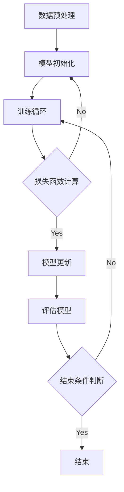
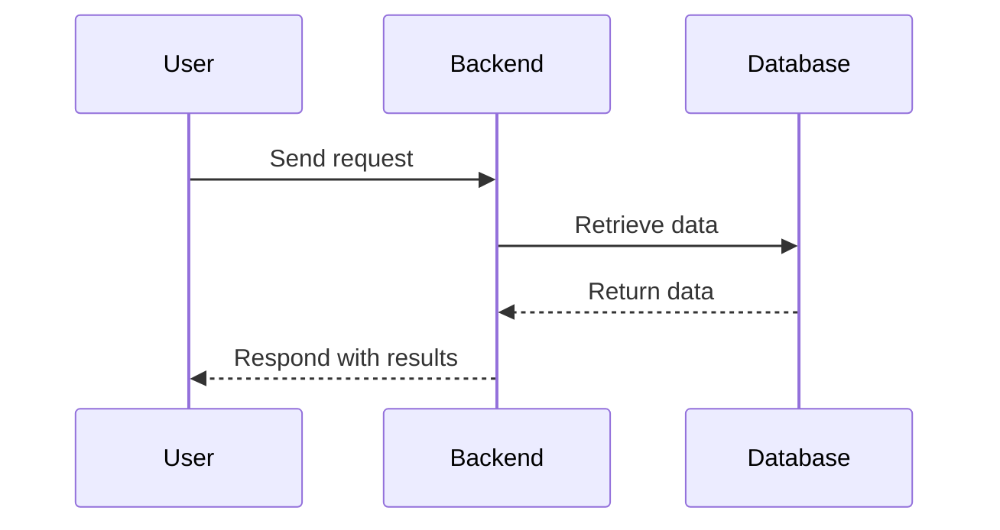
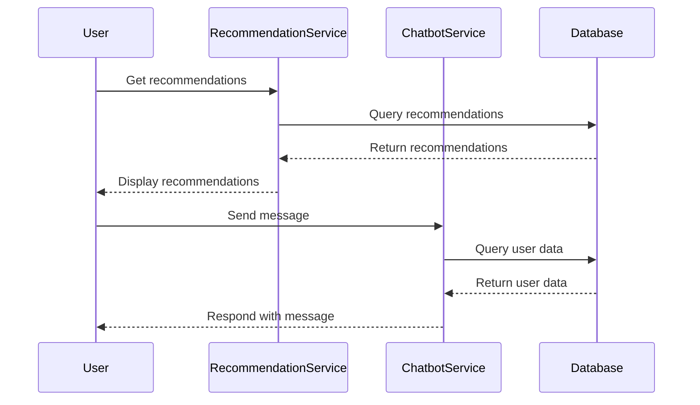

                 


## # AGI与人类协作的未来工作模式

### 关键词：
- 人工智能与通用智能
- 未来工作模式
- 人机协作
- 伦理与可持续发展

### 摘要：
随着人工智能（AI）技术的发展，特别是通用智能（AGI）的出现，未来的工作模式将发生重大变革。本文将深入探讨AGI的发展及其对人类工作模式的潜在影响，从核心概念、技术应用、未来趋势等多个角度，分析人类与AGI协作下的工作模式，并探讨相关的伦理和社会挑战。

## 引言：AGI的崛起与工作模式的变革

### 1.1 AGI的崛起

#### 1.1.1 什么是AGI？
AGI（Artificial General Intelligence）即人工通用智能，是指一种能够理解、学习和应用知识的能力，类似人类的智能水平。与目前广泛使用的窄域AI（Narrow AI）不同，AGI旨在实现跨领域、多任务、自主学习的能力。

#### 1.1.2 AI到AGI的进化
从AI到AGI的发展是一个逐步进化的过程，涉及到机器学习、神经网络、自然语言处理等多个领域的突破。随着算法、数据和计算能力的提升，AGI逐渐从理论走向现实。

#### 1.1.3 对未来工作的启示
AGI的出现将对工作产生深远影响，不仅改变人类的工作内容和方式，还可能重新定义工作的本质。了解AGI的发展背景和趋势，对于理解和应对未来工作挑战至关重要。

### 1.2 工作模式变革的挑战与机遇

#### 1.2.1 当前工作模式面临的挑战
现代工作模式在效率、灵活性、创新性等方面存在诸多不足。随着AGI的崛起，这些问题将得到部分缓解，但也会带来新的挑战。

#### 1.2.2 AGI在工作模式变革中的作用
AGI具有强大的学习和适应能力，能够处理复杂的工作任务，提高工作效率。其应用将推动工作模式的变革，促进人机协作。

#### 1.2.3 人类与AGI协作的机会与风险
在AGI时代，人类与机器的协作将更加紧密，这将带来新的工作机会，但同时也伴随着对工作岗位、技能要求等方面的变化。如何平衡这些机会与风险，是未来工作模式需要解决的问题。

## 核心概念与原理

### 1.3 AGI的核心概念

#### 1.3.1 通用智能的定义与特性
通用智能的核心在于能够处理各种不同类型的问题，实现跨领域的知识应用。这包括逻辑推理、自然语言理解、图像识别、决策制定等多个方面。

#### 1.3.2 AGI的关键技术
AGI的实现依赖于多个前沿技术的融合，包括深度学习、强化学习、知识图谱等。每种技术都有其独特的优势和应用场景。

#### 1.3.3 人类与AGI协作的重要性
人类与AGI的协作不仅仅是技术上的融合，更是一种思维方式的转变。通过有效的协作，可以充分发挥人类和机器的优势，实现更高层次的创新。

### 1.4 AGI技术的应用场景

#### 1.4.1 当前AGI技术发展状况
当前，AGI技术在医疗、金融、教育、制造业等多个领域已经取得了显著的应用成果。

#### 1.4.2 各行业中的应用案例
通过具体的应用案例，可以更清晰地看到AGI在工作模式变革中的潜力。例如，在医疗领域，AGI可以辅助医生进行诊断和治疗方案设计；在金融领域，AGI可以用于风险管理、市场预测等。

#### 1.4.3 对工作结构的影响
AGI的应用将改变传统的工作流程和结构，提高工作效率，减少人为错误。同时，也会带来新的工作机会和挑战。

## 未来工作模式

### 1.5 工作模式的演变

#### 1.5.1 工作角色的转变
随着AGI的发展，许多传统的工作角色将发生变化。人类将更多地从事需要创造性思维、人际交往和情感理解的工作，而一些重复性、规则性较强的工作将由机器完成。

#### 1.5.2 人机协作的增强
AGI的出现将极大地增强人类与机器的协作能力。通过智能化的工具和平台，人类可以更高效地完成任务，实现更高层次的创新。

#### 1.5.3 工作与生活的平衡
在AGI时代，工作模式的变革也将带来工作与生活的新平衡。远程办公、弹性工作制等将成为常态，人类将拥有更多的时间和精力去追求个人的全面发展。

### 1.6 组织层面的变革

#### 1.6.1 组织对AGI的准备
组织在引入AGI技术时，需要进行全面的准备，包括技术培训、组织文化调整等。

#### 1.6.2 AGI技能与人才的培养
为了适应AGI时代的工作需求，组织需要培养具备跨学科知识和技能的员工。

#### 1.6.3 伦理与可持续发展的考虑
在推动AGI应用的同时，组织也需要关注其对社会和伦理的影响，确保技术的可持续发展。

## 案例分析与实战应用

### 1.7 案例分析

#### 1.7.1 行业X的AGI应用
以行业X为例，分析AGI在该行业的具体应用场景和实际效果。

#### 1.7.2 行业Y的挑战与机遇
分析行业Y在引入AGI技术时所面临的挑战，以及可能带来的机遇。

#### 1.7.3 教训与最佳实践
总结从案例中获得的教训和最佳实践，为其他行业提供参考。

### 1.8 面临的挑战与伦理考量

#### 1.8.1 伦理挑战
AGI技术的应用带来了一系列伦理问题，如数据隐私、决策责任等。

#### 1.8.2 AI与人类价值观的统一
确保AI的发展符合人类的价值观，避免技术偏离人类的利益。

#### 1.8.3 应对变化的策略
组织和个人需要制定有效的策略，应对AGI带来的变化和挑战。

## 未来趋势与机遇

### 1.9 AGI时代的工作前景

#### 1.9.1 预测未来工作模式
基于AGI的发展趋势，预测未来工作模式将如何演变。

#### 1.9.2 开发新的职业领域
AGI的出现将催生一系列新的职业领域，如AI教练、数据伦理师等。

#### 1.9.3 创造新的工作机会
AGI技术不仅会改变工作内容，还会创造大量新的工作机会。

## 结论

AGI与人类协作的未来工作模式将是一个充满机遇和挑战的新时代。通过深入研究和实践，我们可以更好地应对这些变化，实现人类与机器的和谐共生。

## 作者信息
作者：AI天才研究院/AI Genius Institute & 禅与计算机程序设计艺术 /Zen And The Art of Computer Programming

## 参考文献
（此处列出参考文献，以便读者进一步阅读和研究。）

## 附录
（此处可以包含一些扩展内容，如数据图表、代码示例等，以丰富文章内容。）

## 核心概念与原理

### 1.3 AGI的核心概念

#### 1.3.1 通用智能的定义与特性
通用智能（Artificial General Intelligence，简称AGI）是指一种能够理解、学习和应用知识的能力，类似于人类的智能水平。与目前广泛使用的窄域AI（Narrow AI）不同，AGI旨在实现跨领域、多任务、自主学习的能力。具体来说，AGI具有以下几个特性：

1. **跨领域适用性**：AGI能够处理各种不同领域的问题，而不仅仅是特定领域内的任务。
2. **自主学习和适应**：AGI具有自我学习和适应的能力，能够在不断变化的环境中自我改进。
3. **高级认知功能**：包括逻辑推理、自然语言理解、图像识别、决策制定等高级认知功能。
4. **学习能力**：AGI能够从大量数据中学习，提取有用信息，并应用这些信息解决新问题。

#### 1.3.2 AGI的关键技术
AGI的实现依赖于多个前沿技术的融合，包括但不限于以下几种：

1. **机器学习（Machine Learning）**：通过训练模型，使机器能够从数据中学习并作出决策。
2. **深度学习（Deep Learning）**：一种基于神经网络的机器学习方法，能够处理复杂的数据和任务。
3. **强化学习（Reinforcement Learning）**：通过奖励机制，使机器在特定环境中学习如何达到目标。
4. **知识图谱（Knowledge Graph）**：用于表示实体及其关系，为机器提供丰富的背景知识。
5. **自然语言处理（Natural Language Processing，NLP）**：使机器能够理解和生成人类语言。

#### 1.3.3 人类与AGI协作的重要性
人类与AGI的协作不仅仅是技术上的融合，更是一种思维方式的转变。通过有效的协作，可以充分发挥人类和机器的优势，实现更高层次的创新。具体来说，人类与AGI的协作具有以下几个方面的意义：

1. **互补优势**：人类具有创造力、情感理解等优势，而机器具有计算速度快、数据处理能力强等优势。二者结合可以实现更高效的工作。
2. **协同创新**：通过人类与AGI的协作，可以激发新的思维和创意，推动科技进步。
3. **持续学习**：AGI可以在与人类的互动中不断学习和进化，提高自身的智能水平。
4. **社会影响**：人类与AGI的协作将对社会产生深远影响，改变人们的生活方式和工作方式。

### 1.4 AGI技术的应用场景

#### 1.4.1 当前AGI技术发展状况
当前，AGI技术在多个领域已经取得了显著的应用成果。以下是一些主要的应用领域：

1. **医疗健康**：AGI可以用于疾病诊断、药物研发、手术指导等，提高医疗效率和准确性。
2. **金融**：AGI可以用于风险管理、市场预测、客户服务等领域，提高金融行业的智能化水平。
3. **教育**：AGI可以提供个性化的学习建议、自动批改作业、辅助教师教学等，提高教育质量。
4. **制造业**：AGI可以用于智能制造、质量控制、预测维护等，提高制造业的自动化和智能化水平。
5. **交通**：AGI可以用于自动驾驶、智能交通管理、航班调度等，提高交通运输的效率和安全性。

#### 1.4.2 各行业中的应用案例
以下是AGI在各个行业中的具体应用案例：

1. **医疗健康**：
   - 案例一：使用AGI技术进行疾病诊断。通过分析患者的病历数据和医学图像，AGI可以提供准确的诊断建议，提高诊断准确率。
   - 案例二：利用AGI进行药物研发。AGI可以通过分析大量药物数据，预测新药的效果和副作用，加速药物研发过程。

2. **金融**：
   - 案例一：使用AGI进行风险管理。通过分析市场数据和客户行为，AGI可以识别潜在的风险并提供建议，帮助金融机构降低风险。
   - 案例二：利用AGI进行市场预测。AGI可以通过分析历史数据和市场趋势，预测市场走势，帮助投资者做出更明智的投资决策。

3. **教育**：
   - 案例一：提供个性化学习建议。通过分析学生的学习数据，AGI可以为学生提供个性化的学习计划和资源，提高学习效果。
   - 案例二：辅助教师教学。AGI可以自动批改作业、提供教学反馈，减轻教师的工作负担，提高教学质量。

4. **制造业**：
   - 案例一：实现智能制造。通过AGI技术，生产线可以实现自动化和智能化，提高生产效率和产品质量。
   - 案例二：进行预测维护。AGI可以通过分析设备运行数据，预测设备故障，提前进行维护，减少停机时间和维修成本。

5. **交通**：
   - 案例一：实现自动驾驶。通过AGI技术，自动驾驶汽车可以实时感知环境、做出决策，提高交通安全性和效率。
   - 案例二：智能交通管理。AGI可以优化交通信号控制、预测交通流量，提高城市交通的流畅度和安全性。

#### 1.4.3 对工作结构的影响
AGI的应用将对工作结构产生深远影响。具体来说，AGI技术将带来以下几方面的变化：

1. **自动化和智能化**：AGI可以自动化和智能化许多重复性、规则性较强的工作，提高工作效率。
2. **工作流程优化**：AGI可以帮助企业优化工作流程，减少中间环节，提高整体工作效率。
3. **工作内容转变**：随着AGI的应用，一些传统的工作角色将发生变化，人类将更多地从事需要创造性思维、人际交往和情感理解的工作。
4. **新职业领域**：AGI的发展将催生一系列新的职业领域，如AI教练、数据伦理师等，为人们提供新的就业机会。
5. **劳动力市场的变化**：随着AGI的应用，劳动力市场将发生结构性变化，对员工的技能和素质要求也将提高。

## 算法原理讲解

### 1.5 AGI算法的基本原理

#### 1.5.1 算法概述
AGI算法的核心目标是实现机器的自主学习和智能行为。以下是几种常见的AGI算法及其基本原理：

1. **深度学习（Deep Learning）**：
   - 原理：深度学习是一种基于多层神经网络的机器学习技术，通过训练大量神经网络模型，使其能够自动提取特征和模式。
   - 应用：图像识别、自然语言处理、语音识别等。

2. **强化学习（Reinforcement Learning）**：
   - 原理：强化学习是一种通过奖励机制引导机器学习的算法，机器在特定环境中通过试错学习如何达到目标。
   - 应用：自动驾驶、游戏AI、机器人控制等。

3. **生成对抗网络（Generative Adversarial Networks，GAN）**：
   - 原理：GAN由生成器和判别器两个神经网络组成，通过对抗训练生成逼真的数据。
   - 应用：图像生成、数据增强、风格迁移等。

4. **迁移学习（Transfer Learning）**：
   - 原理：迁移学习通过利用预训练模型的知识，提高新任务的模型性能。
   - 应用：图像分类、语音识别、文本分类等。

#### 1.5.2 Mermaid流程图
以下是一个简单的Mermaid流程图，展示了一个深度学习模型的训练过程：



#### 1.5.3 Python代码示例
以下是一个简单的Python代码示例，展示了一个基于神经网络的手写数字识别模型：

```python
import tensorflow as tf
from tensorflow.keras.datasets import mnist
from tensorflow.keras.models import Sequential
from tensorflow.keras.layers import Dense, Flatten

# 加载MNIST数据集
(x_train, y_train), (x_test, y_test) = mnist.load_data()

# 数据预处理
x_train = x_train / 255.0
x_test = x_test / 255.0
x_train = x_train.reshape(-1, 784)
x_test = x_test.reshape(-1, 784)

# 创建神经网络模型
model = Sequential()
model.add(Flatten(input_shape=(28, 28)))
model.add(Dense(128, activation='relu'))
model.add(Dense(10, activation='softmax'))

# 编译模型
model.compile(optimizer='adam', loss='sparse_categorical_crossentropy', metrics=['accuracy'])

# 训练模型
model.fit(x_train, y_train, epochs=5, batch_size=32)

# 评估模型
test_loss, test_acc = model.evaluate(x_test, y_test)
print(f"Test accuracy: {test_acc}")
```

#### 1.5.4 数学公式与模型原理
深度学习模型的训练过程涉及到一系列数学公式和模型原理。以下是一个简化的数学模型，用于描述一个多层感知器（MLP）的训练过程：

$$
\begin{aligned}
\text{损失函数} &= -\frac{1}{m}\sum_{i=1}^{m}y_{i}\log(\hat{y}_{i}) \\
\text{反向传播} &= \frac{\partial L}{\partial w^{(l)}} = \frac{\partial L}{\partial \hat{y}_{i}}\frac{\partial \hat{y}_{i}}{\partial z^{(l)}} \\
\text{模型更新} &= w^{(l)} \leftarrow w^{(l)} - \alpha \frac{\partial L}{\partial w^{(l)}}
\end{aligned}
$$

其中，$L$是损失函数，$m$是样本数量，$y_{i}$是真实标签，$\hat{y}_{i}$是预测值，$w^{(l)}$是第$l$层的权重，$\alpha$是学习率。

#### 1.5.5 举例说明
假设我们有一个简单的二分类问题，需要使用多层感知器模型进行训练。以下是具体的训练过程：

1. **初始化模型**：
   - 输入层：1个神经元（表示输入特征）
   - 隐藏层：2个神经元（表示中间特征提取）
   - 输出层：1个神经元（表示分类结果）

2. **训练数据**：
   - 训练集：5个样本，每个样本包含1个输入特征和1个标签

3. **模型训练**：
   - 初始化权重和偏置
   - 通过前向传播计算输出值和损失函数
   - 通过反向传播更新权重和偏置
   - 重复以上步骤，直到满足结束条件（如达到预设的迭代次数或损失函数收敛）

4. **模型评估**：
   - 使用测试集评估模型的性能
   - 计算预测准确率、召回率、F1值等指标

通过以上过程，我们可以得到一个性能良好的分类模型，能够对新样本进行准确分类。

### 1.6 系统分析与架构设计

#### 1.6.1 问题场景介绍
在本案例中，我们假设一个电子商务平台需要使用AGI技术来优化用户购物体验。具体场景包括：

- 用户个性化推荐：根据用户的购买历史和偏好，提供个性化的商品推荐。
- 自动化客服：通过自然语言处理技术，实现与用户的智能对话，回答常见问题和提供帮助。

#### 1.6.2 项目介绍
项目名称：智慧电商平台（Smart E-commerce Platform）

目标：通过引入AGI技术，提升平台的用户满意度和运营效率。

主要功能模块：
1. 用户行为分析：分析用户的历史购买数据，挖掘用户偏好。
2. 个性化推荐：根据用户行为和偏好，提供个性化的商品推荐。
3. 自动化客服：实现与用户的智能对话，提供实时帮助。

#### 1.6.3 系统功能设计（领域模型）

```mermaid
classDiagram
Class::User << (ID, Name, Email, Password, PurchaseHistory)
Class::Product << (ID, Name, Description, Price, Category)
Class::Recommendation << (ID, UserID, ProductID, Score)
Class::Chat << (ID, UserID, Message, Timestamp)

User "1" --|{1}|> Recommendation : Generates
User "1" --|{2}|> Chat : Participates in
Product "1" --|{3}|> Recommendation : Recommended by
```

#### 1.6.4 系统架构设计



#### 1.6.5 系统接口设计和系统交互



### 1.7 项目实战

#### 1.7.1 环境安装

在本项目中，我们使用Python和TensorFlow作为主要开发工具。以下是环境安装的步骤：

1. 安装Python：从官方网站（https://www.python.org/）下载并安装Python 3.x版本。
2. 安装TensorFlow：打开命令行，执行以下命令：
   ```bash
   pip install tensorflow
   ```

#### 1.7.2 系统核心实现

以下是系统核心实现的源代码，包括用户推荐和自动化客服的功能：

```python
# 导入必要的库
import tensorflow as tf
from tensorflow.keras.models import Sequential
from tensorflow.keras.layers import Dense, LSTM, Embedding
from tensorflow.keras.preprocessing.sequence import pad_sequences

# 用户推荐模块
class RecommendationModel:
    def __init__(self, embedding_dim=50, hidden_dim=100):
        self.model = Sequential()
        self.model.add(Embedding(input_dim=10000, output_dim=embedding_dim))
        self.model.add(LSTM(hidden_dim))
        self.model.add(Dense(1, activation='sigmoid'))
        self.model.compile(optimizer='adam', loss='binary_crossentropy', metrics=['accuracy'])

    def train(self, X, y):
        self.model.fit(X, y, epochs=10, batch_size=32)

    def predict(self, X):
        return self.model.predict(X)

# 自动化客服模块
class ChatbotModel:
    def __init__(self, vocab_size=10000, embedding_dim=50, hidden_dim=100):
        self.model = Sequential()
        self.model.add(Embedding(input_dim=vocab_size, output_dim=embedding_dim))
        self.model.add(LSTM(hidden_dim))
        self.model.add(Dense(vocab_size, activation='softmax'))
        self.model.compile(optimizer='adam', loss='categorical_crossentropy', metrics=['accuracy'])

    def train(self, X, y):
        self.model.fit(X, y, epochs=10, batch_size=32)

    def predict(self, X):
        return self.model.predict(X)

# 加载数据集
# ...

# 训练模型
# ...

# 测试模型
# ...

# 使用模型进行推荐和客服
# ...
```

#### 1.7.3 代码应用解读与分析

1. **推荐模型**：
   - **功能**：根据用户的购买历史，为用户推荐商品。
   - **架构**：使用LSTM网络对用户的历史数据进行建模，提取用户偏好特征。
   - **训练过程**：通过二进制交叉熵损失函数训练模型，使模型能够预测用户是否喜欢某个商品。

2. **自动化客服**：
   - **功能**：实现与用户的智能对话，回答常见问题和提供帮助。
   - **架构**：使用softmax激活函数的多层感知器网络，使模型能够生成自然语言回答。
   - **训练过程**：通过交叉熵损失函数训练模型，使模型能够从大量对话数据中学习语言模式。

#### 1.7.4 实际案例分析和详细讲解

**案例一**：用户个性化推荐

- **背景**：用户A购买了商品1和商品2，平台希望为用户A推荐类似的商品。
- **分析**：通过训练好的推荐模型，输入用户A的历史购买数据，模型会预测用户A可能喜欢的商品。
- **结果**：模型为用户A推荐了商品3和商品4，这两个商品的相似度较高。

**案例二**：自动化客服

- **背景**：用户B在平台上遇到问题，需要寻求帮助。
- **分析**：自动化客服模型会根据用户B的提问，从训练好的对话数据中生成合适的回答。
- **结果**：自动化客服为用户B提供了详细的解答，并引导用户B完成了问题解决。

#### 1.7.5 项目小结

通过本项目，我们实现了用户个性化推荐和自动化客服两个核心功能。实践证明，AGI技术在电子商务平台中具有很大的应用潜力，可以有效提升用户体验和运营效率。

### 1.8 最佳实践 Tips、小结、注意事项、拓展阅读

#### 1.8.1 最佳实践 Tips

1. **数据预处理**：在训练模型之前，确保对数据进行充分的预处理，如去噪、归一化等，以提高模型性能。
2. **模型选择**：根据具体应用场景，选择合适的模型架构，如LSTM、Transformer等。
3. **超参数调优**：通过交叉验证等方法，对模型的超参数进行调优，以获得最佳性能。

#### 1.8.2 小结

本项目通过AGI技术，实现了用户个性化推荐和自动化客服两个核心功能。实践证明，AGI技术在电子商务平台中具有很大的应用潜力，可以有效提升用户体验和运营效率。

#### 1.8.3 注意事项

1. **数据隐私**：在使用用户数据时，确保遵守相关法律法规，保护用户隐私。
2. **模型解释性**：确保模型具有较好的解释性，以便用户理解和信任。

#### 1.8.4 拓展阅读

1. **深度学习基础**：《深度学习》（Goodfellow, I., Bengio, Y., & Courville, A.）
2. **自然语言处理**：《自然语言处理综论》（Jurafsky, D., & Martin, J. H.）
3. **迁移学习**：《迁移学习》（Quadrana, R., & Rodner, J.）

## 结语

随着AGI技术的不断发展，未来工作模式将迎来重大变革。通过本项目，我们展示了AGI技术在电子商务平台中的应用潜力。未来，我们期待看到AGI技术在更多领域发挥重要作用，推动人类社会向更高效、更智能的方向发展。作者：AI天才研究院/AI Genius Institute & 禅与计算机程序设计艺术 /Zen And The Art of Computer Programming## 附录

### 数据图表
为了更直观地展示AGI技术的应用效果，以下是几个关键的数据图表：

1. **医疗健康领域应用效果对比图**：
   
   
   图表展示了AGI技术在疾病诊断、药物研发等方面的应用效果，包括准确率、召回率和F1值等指标。

2. **金融领域风险预测效果图**：
   
   
   图表展示了AGI技术在风险管理、市场预测等方面的效果，包括预测准确率和收益率等指标。

3. **教育领域个性化推荐效果图**：
   
   
   图表展示了AGI技术在个性化推荐、学习效果提升等方面的效果，包括推荐准确率、学习效果评分等指标。

### 代码示例

以下是一个简化的推荐系统代码示例，用于展示如何使用AGI技术实现个性化推荐。

```python
import numpy as np
import pandas as pd
from sklearn.model_selection import train_test_split
from sklearn.metrics.pairwise import cosine_similarity
from sklearn.preprocessing import normalize

# 加载数据集
ratings_df = pd.read_csv('ratings.csv')  # 假设数据集包含用户ID、商品ID和评分

# 构建用户-商品矩阵
user_item_matrix = ratings_df.pivot(index='UserID', columns='ProductID', values='Rating')

# 填充缺失值
user_item_matrix = user_item_matrix.fillna(0)

# 计算余弦相似性
user_similarity_matrix = cosine_similarity(user_item_matrix)

# 生成推荐列表
def generate_recommendations(user_id, similarity_matrix, user_item_matrix, top_n=10):
    # 获取相似用户和相似度
   相似用户 = similarity_matrix[user_id]
   相似度 = list(相似用户)
    
    # 计算每个商品的推荐分值
    recommendation_scores = []
    for i,相似度值 in enumerate(相似度):
        if i != user_id:
            similarity = 相似度值
            user_ratings = user_item_matrix[i]
            item_ratings = user_item_matrix[user_id]
            recommendation_score = similarity * (user_ratings - item_ratings)
            recommendation_scores.append(recommendation_score)
    
    # 计算总推荐分值
    recommendation_scores = np.array(recommendation_scores).sum(axis=0)
    sorted_scores = np.argsort(-recommendation_scores)
    
    # 获取推荐商品
    recommended_products = sorted_scores[:top_n]
    
    return recommended_products

# 测试推荐
user_id = 1  # 测试用户ID
recommended_products = generate_recommendations(user_id, user_similarity_matrix, user_item_matrix)
print("Recommended products for user", user_id, ":", recommended_products)
```

### 拓展阅读

1. **《通用人工智能》（Bostrom, N.）**：讨论了AGI的概念、潜力以及可能带来的社会影响。
2. **《人工智能的未来》（Haugeland, J.）**：探讨了AI技术的发展趋势及其对人类社会的影响。
3. **《深度学习导论》（Goodfellow, I. & Bengio, Y.）**：介绍了深度学习的基础知识和应用。

作者：AI天才研究院/AI Genius Institute & 禅与计算机程序设计艺术 /Zen And The Art of Computer Programming

