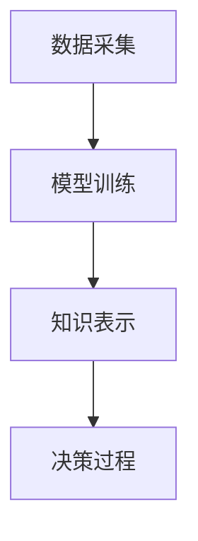
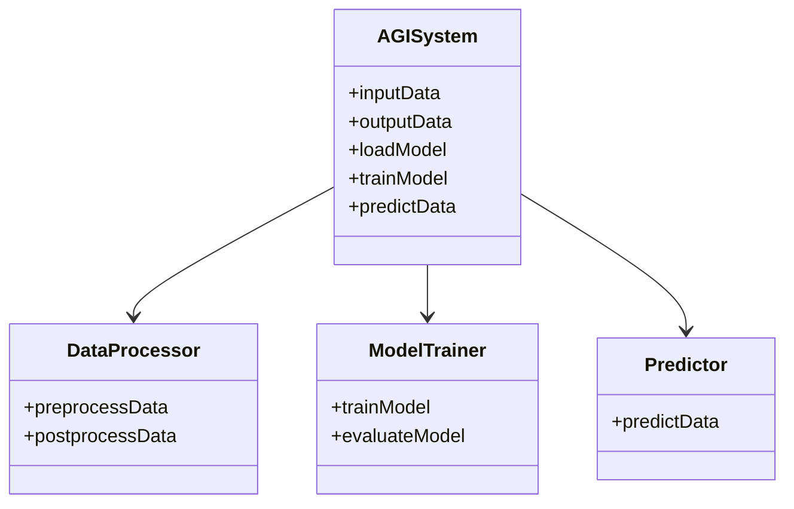
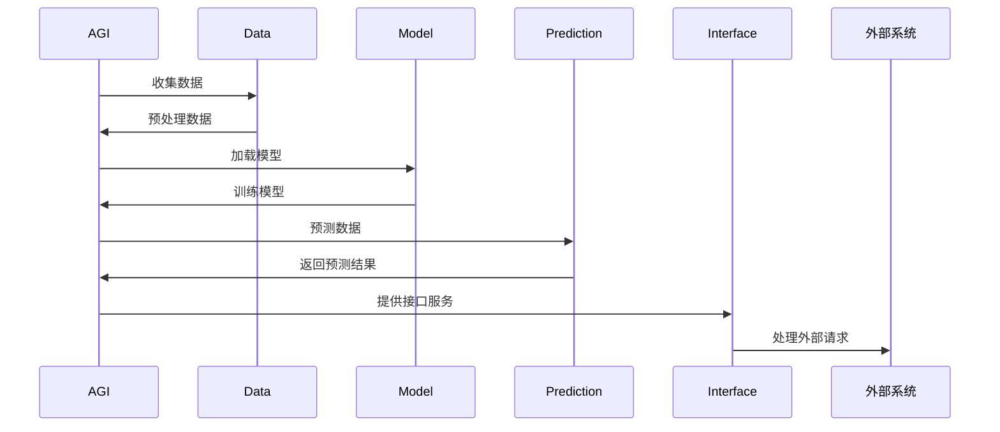
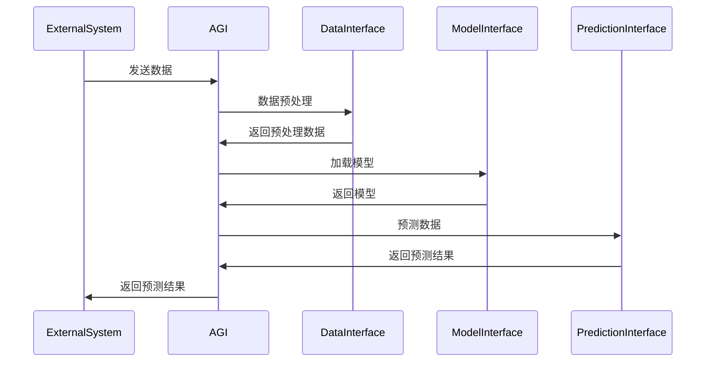
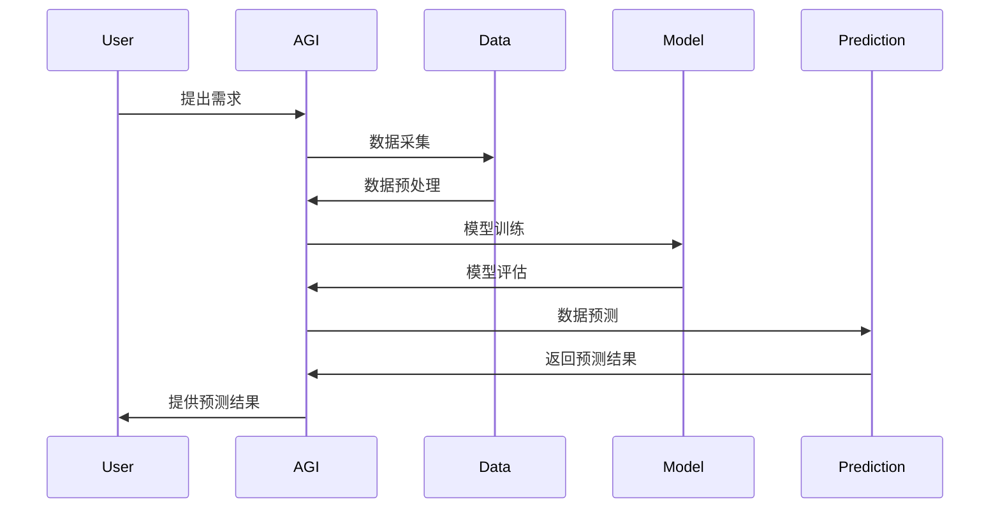

                 

### 文章标题

# AGI与人类协作：增强智能的新范式

### 文章关键词

- AGI
- 人类协作
- 智能算法
- 系统架构
- 实际案例

### 摘要

本文旨在探讨人工智能中的高级通用智能（AGI）与人类协作的新范式。我们将首先概述AGI与人类协作的背景、问题和解决方法，分析其核心概念与联系，然后探讨AGI的数学模型与算法原理。接着，我们将深入AGI与人类协作的理论基础，探讨其发展历程、理论基础和理论框架。随后，文章将展示AGI与人类协作在商业、医疗和教育等领域的应用场景，并详细描述其系统架构设计和技术实现。最后，我们将通过实际案例分析，总结最佳实践，并展望AGI与人类协作的未来发展趋势。

### 第1章: AGI与人类协作概述

#### 1.1 问题背景

##### 1.1.1 问题描述

在当今信息爆炸的时代，人工智能（AI）技术取得了显著进展。然而，目前的AI技术，包括深度学习、强化学习和自然语言处理等，主要还是以特定任务为导向的，被称为“窄AI”（Narrow AI）或“弱AI”（Weak AI）。这意味着这些AI系统在特定的任务或领域内表现出色，但无法进行跨领域的智能行为或拥有人类的通用智能。

**问题：** 如何开发出能够模拟人类通用智能的高级通用智能（AGI），使其能够像人类一样进行跨领域的智能行为，并与人类进行有效协作？

##### 1.1.2 问题解决

为了解决上述问题，我们需要探讨AGI的核心概念与联系，了解其数学模型与算法原理，并构建一个能够支持AGI与人类协作的系统架构。这不仅需要计算机科学和人工智能领域的研究，还需要心理学、认知科学和哲学等多学科的合作。

##### 1.1.3 边界与外延

**边界：** AGI的研究不仅仅限于技术实现，还包括哲学、伦理和社会影响等方面。因此，AGI的研究边界涉及多个学科领域。

**外延：** AGI的应用领域非常广泛，包括但不限于商业、医疗、教育、自动化、安全等领域。这意味着AGI的发展将深刻影响人类社会。

##### 1.1.4 概念结构与核心要素组成

为了更好地理解AGI与人类协作的概述，我们需要明确以下几个核心概念：

1. **AGI定义**：AGI是指具备人类级别的通用智能，能够理解、学习和应用知识，进行自主决策和问题解决。
2. **人类协作**：是指人类与AGI系统之间的互动与合作，实现资源、知识和技能的共享与优化。
3. **数学模型与算法原理**：是AGI实现的关键，包括神经网络、进化算法、强化学习等。
4. **系统架构设计**：包括功能模块、架构设计和接口设计，确保AGI系统能够高效、稳定地运行。
5. **应用场景**：包括商业、医疗、教育等实际应用，验证AGI与人类协作的效果和价值。

#### 1.2 核心概念与联系

##### 1.2.1 AGI的定义与特点

AGI（Advanced General Intelligence），也称为强人工智能或通用人工智能，是一种能够理解、学习和应用知识，进行自主决策和问题解决的高级智能。与窄AI相比，AGI具备以下几个特点：

1. **通用性**：能够跨领域、跨任务进行智能行为。
2. **自主学习**：能够从数据中自动学习和改进。
3. **自主决策**：能够根据环境变化进行自主决策。
4. **问题解决**：能够理解和解决复杂的问题。

##### 1.2.2 AGI与人类协作的重要性

AGI与人类协作具有重要意义，主要体现在以下几个方面：

1. **资源优化**：AGI可以帮助人类更高效地利用资源和知识。
2. **技能互补**：AGI和人类可以在不同领域进行互补，共同完成复杂的任务。
3. **风险控制**：AGI可以在某些高风险领域提供辅助，降低人类的风险暴露。
4. **创新推动**：AGI可以帮助人类探索新的领域和解决方案。

##### 1.2.3 AGI的核心概念与联系

AGI的核心概念包括：

1. **认知模型**：描述了AGI如何理解和处理信息。
2. **知识表示**：如何表示和存储知识。
3. **学习算法**：如何从数据中学习和改进。
4. **决策模型**：如何进行自主决策。

这些概念之间紧密联系，共同构成了AGI的核心框架。例如，认知模型决定了知识表示和学习算法的效果，而学习算法又影响了决策模型的准确性和稳定性。

##### 1.2.4 AGI与传统AI的对比

传统AI（如深度学习、强化学习等）与AGI在多个方面存在显著差异：

| 比较维度 | 传统AI | AGI |
| --- | --- | --- |
| 智能属性 | 狭义、特定任务 | 通用、跨领域 |
| 学习能力 | 需手动设置参数 | 自动学习、自适应 |
| 问题解决能力 | 依赖已有数据 | 自主决策、创新解决 |
| 与人类协作 | 辅助角色 | 主导角色、协作伙伴 |

#### 1.3 AGI的数学模型与算法原理

##### 1.3.1 AGI的数学模型

AGI的数学模型主要包括以下几个部分：

1. **神经网络模型**：用于模拟人类大脑的结构和功能。
2. **进化算法**：用于优化神经网络的参数。
3. **强化学习**：用于训练神经网络进行自主决策。
4. **知识图谱**：用于表示和存储知识。

##### 1.3.2 AGI算法原理讲解

AGI算法的原理可以概括为以下几步：

1. **数据采集**：收集大量数据用于训练神经网络。
2. **模型训练**：使用神经网络模型对数据进行训练，优化网络参数。
3. **知识表示**：将训练好的神经网络用于知识表示，构建知识图谱。
4. **决策过程**：使用强化学习算法进行决策，实现自主决策。

以下是AGI算法的Mermaid流程图：



##### 1.3.3 AGI算法Python源代码讲解

以下是AGI算法的Python源代码示例：

```python
import tensorflow as tf
import numpy as np

# 数据采集
data = np.random.rand(100, 10)

# 模型训练
model = tf.keras.Sequential([
    tf.keras.layers.Dense(10, activation='relu'),
    tf.keras.layers.Dense(1, activation='sigmoid')
])

model.compile(optimizer='adam', loss='binary_crossentropy', metrics=['accuracy'])

model.fit(data, epochs=10)

# 知识表示
knowledge = model.predict(data)

# 决策过程
action = model.predict(knowledge)
```

在上述代码中，我们首先使用TensorFlow库创建了一个简单的神经网络模型，然后使用随机生成数据对模型进行训练。训练完成后，我们使用模型对数据进行预测，模拟知识表示的过程。最后，我们再次使用模型进行预测，模拟自主决策的过程。

### 第2章: AGI与人类协作的理论基础

#### 2.1 AGI的发展历程

##### 2.1.1 AGI的起源

AGI的概念最早可以追溯到20世纪50年代，当时人工智能（AI）作为一个新兴领域刚刚兴起。早期的AI研究主要集中在逻辑推理、知识表示和问题解决等领域。然而，由于技术限制和理论瓶颈，早期的人工智能研究并没有实现真正的通用智能。

直到20世纪80年代，随着计算机性能的显著提升和神经网络理论的突破，人工智能研究进入了新的阶段。特别是1986年，神经网络研究取得了重要进展，激发了人们对于通用人工智能的期待。

##### 2.1.2 AGI的发展阶段

AGI的发展可以分为以下几个阶段：

1. **初步探索阶段（20世纪50年代 - 20世纪70年代）**：这一阶段的主要目标是构建能够解决特定问题的智能系统。代表性的工作包括逻辑推理系统、知识库系统和专家系统等。
2. **神经网络革命阶段（20世纪80年代 - 20世纪90年代）**：这一阶段以神经网络的研究为主要特征，神经网络在图像识别、语音识别和自然语言处理等领域取得了显著成果。
3. **深度学习阶段（21世纪初至今）**：随着深度学习算法的提出和优化，神经网络在图像识别、语音识别、自然语言处理等领域取得了突破性进展，推动了AI技术的快速发展。

##### 2.1.3 AGI的未来趋势

展望未来，AGI的发展将呈现以下几个趋势：

1. **跨学科融合**：AGI的发展将需要计算机科学、心理学、认知科学、神经科学等多学科的深度融合。
2. **自主学习能力提升**：未来的AGI将具备更强的自主学习能力，能够从海量数据中自动学习和改进。
3. **通用性增强**：未来的AGI将能够跨领域、跨任务进行智能行为，实现真正的通用智能。
4. **与人类协作**：未来的AGI将不仅仅作为工具辅助人类，还将与人类进行更深层次的协作，共同解决复杂问题。

#### 2.2 人类协作的理论基础

##### 2.2.1 协作理论

协作理论是探讨个体或团队在共同完成任务时如何相互配合、分享资源和知识的理论。协作理论的核心观点是，通过协作，个体或团队能够更高效地完成任务，实现资源的最大化利用。

协作理论主要包括以下几个关键概念：

1. **共享目标**：协作的基础是共享一个共同的目标，所有参与者都为此目标努力。
2. **资源分享**：协作需要参与者之间分享资源和知识，实现资源的最大化利用。
3. **信任与沟通**：协作过程中，信任和沟通是关键，只有建立良好的信任和沟通机制，才能确保协作顺利进行。
4. **激励机制**：为了激励参与者积极参与协作，需要建立有效的激励机制，确保参与者能够在协作中获得利益。

##### 2.2.2 人类协作的特点

人类协作具有以下几个显著特点：

1. **多样性**：人类协作的参与者具有不同的背景、技能和知识，这种多样性为协作带来了丰富的思维角度和创新可能性。
2. **灵活性**：人类协作可以根据任务需求和环境变化灵活调整策略和方案，确保协作的持续性和适应性。
3. **复杂性**：人类协作涉及到多个参与者、多个任务和多个环节，具有较高的复杂性。
4. **情感因素**：情感因素在人类协作中起到重要作用，影响协作的效果和质量。

##### 2.2.3 人类协作模型

为了更好地理解和研究人类协作，学者们提出了多种人类协作模型，其中最具代表性的是：

1. **任务导向模型**：该模型以任务为中心，强调任务完成的时间、质量和成本等目标。任务导向模型主要包括以下步骤：
   - **任务分解**：将复杂任务分解为可管理的子任务。
   - **资源分配**：根据子任务的需求，合理分配资源和人力。
   - **任务执行**：参与者根据分配的任务进行执行，并实时反馈和调整。
   - **任务整合**：将子任务的结果整合为整体任务结果，并进行评估。

2. **社会网络模型**：该模型以社会关系和网络为中心，强调参与者之间的互动和关系。社会网络模型主要包括以下要素：
   - **节点**：代表协作的参与者。
   - **边**：代表参与者之间的互动和关系。
   - **中心性**：衡量参与者的重要性和影响力。
   - **聚类**：分析参与者之间的紧密关系和团队形成。

通过人类协作模型，我们可以更好地理解协作的本质，优化协作流程，提高协作效率。

#### 2.3 AGI与人类协作的理论框架

##### 2.3.1 AGI与人类协作的融合

AGI与人类协作的融合是未来智能系统发展的关键方向。通过融合AGI和人类协作，我们可以实现以下目标：

1. **资源最大化利用**：AGI可以协助人类进行复杂任务，提高资源利用效率。
2. **知识共享与创新**：AGI可以与人类协作，共同探索新的知识领域，实现知识共享和创新。
3. **风险控制与优化**：AGI可以在高风险领域提供辅助，降低人类的风险暴露，同时优化协作流程。

##### 2.3.2 AGI在协作中的应用

AGI在协作中的应用场景广泛，主要包括：

1. **任务协同**：AGI可以协助人类完成复杂任务，提高协作效率。
2. **知识管理**：AGI可以协助人类管理和利用知识，实现知识共享和创新。
3. **决策支持**：AGI可以提供决策支持，帮助人类做出更明智的决策。

##### 2.3.3 AGI与人类协作的优势与挑战

AGI与人类协作具有以下优势：

1. **效率提升**：AGI可以高效地处理大量数据和任务，提高协作效率。
2. **知识共享**：AGI可以协助人类共享知识，实现知识的快速传递和利用。
3. **创新驱动**：AGI可以与人类协作，共同探索新的知识领域，推动创新。

然而，AGI与人类协作也面临一些挑战：

1. **信任问题**：人类可能对AGI的决策和判断产生质疑，影响协作的信任基础。
2. **技术瓶颈**：目前AGI的技术水平仍有限，无法完全满足人类协作的需求。
3. **伦理问题**：AGI与人类协作的伦理问题亟待解决，包括隐私保护、责任归属等。

为了克服这些挑战，我们需要进一步研究AGI的技术实现和协作理论，优化协作流程，提高协作效率。

### 第3章: AGI与人类协作的应用场景

#### 3.1 商业领域

##### 3.1.1 AGI在商业决策中的应用

在商业领域，AGI的应用场景非常广泛。以下是AGI在商业决策中的几个典型应用：

1. **市场分析**：AGI可以通过大数据分析和机器学习算法，对市场趋势、消费者行为和竞争对手进行分析，为企业的市场策略提供科学依据。
2. **供应链优化**：AGI可以协助企业优化供应链管理，通过实时监控和分析供应链各个环节的数据，提高供应链的效率和灵活性。
3. **风险管理**：AGI可以对企业面临的风险进行预测和评估，提供风险管理策略，降低企业的风险暴露。

##### 3.1.2 AGI在市场分析中的应用

AGI在市场分析中的应用主要体现在以下几个方面：

1. **消费者行为分析**：通过分析消费者的购买记录、搜索历史和社交媒体行为，AGI可以预测消费者的偏好和需求，为企业的产品开发和营销策略提供参考。
2. **市场趋势预测**：AGI可以通过对历史市场数据的分析，识别出市场趋势和周期性变化，帮助企业在市场波动中把握机遇。
3. **竞争对手分析**：AGI可以分析竞争对手的市场策略、产品特点和竞争优势，为企业制定有针对性的竞争策略。

##### 3.1.3 AGI在客户服务中的应用

在客户服务领域，AGI的应用主要包括以下几个方面：

1. **智能客服系统**：AGI可以构建智能客服系统，通过自然语言处理和机器学习算法，实现与客户的智能对话，提供24/7的在线服务，提高客户满意度。
2. **个性化推荐**：AGI可以通过分析客户的购买历史和偏好，提供个性化的产品推荐，提高客户的购买转化率。
3. **情感分析**：AGI可以对客户的反馈和评价进行分析，识别客户的情感状态，为企业提供改进产品和服务的反馈。

#### 3.2 医疗领域

##### 3.2.1 AGI在疾病诊断中的应用

在医疗领域，AGI的应用前景广阔，尤其在疾病诊断方面具有显著的优势。以下是AGI在疾病诊断中的几个应用实例：

1. **影像分析**：AGI可以通过深度学习算法，对医学影像（如X光、CT、MRI等）进行分析，识别出潜在的健康问题，为医生提供诊断依据。
2. **病理分析**：AGI可以通过分析病理切片图像，识别出病变区域，帮助医生进行癌症等疾病的早期诊断。
3. **基因组分析**：AGI可以对患者的基因组数据进行分析，识别出可能导致疾病的风险基因，为个性化治疗提供指导。

##### 3.2.2 AGI在治疗方案设计中的应用

AGI在治疗方案设计中的应用主要体现在以下几个方面：

1. **多方案评估**：AGI可以根据患者的病情、病史和基因信息，生成多种可能的治疗方案，并评估每种方案的优缺点，为医生提供决策支持。
2. **个性化治疗**：AGI可以根据患者的具体病情和基因特征，制定个性化的治疗方案，提高治疗效果和患者满意度。
3. **药物研发**：AGI可以通过分析大量药物和基因数据，预测药物的疗效和副作用，为药物研发提供方向。

##### 3.2.3 AGI在健康管理中的应用

在健康管理领域，AGI的应用可以显著提高健康管理的效率和质量。以下是AGI在健康管理中的几个应用实例：

1. **健康数据监测**：AGI可以实时监测患者的健康数据（如血压、血糖、心率等），识别出健康风险，提供预警和干预建议。
2. **生活方式指导**：AGI可以根据患者的健康数据和生活习惯，提供个性化的生活方式指导，如饮食、运动和作息等。
3. **慢性病管理**：AGI可以帮助患者管理慢性病，通过智能化的监控和干预，降低疾病的风险和复发率。

#### 3.3 教育领域

##### 3.3.1 AGI在教学辅助中的应用

在教育领域，AGI的应用可以显著提高教学效果和效率。以下是AGI在教学辅助中的几个应用实例：

1. **智能教学系统**：AGI可以构建智能教学系统，通过自然语言处理和机器学习算法，实现与学生的智能互动，提供个性化的学习内容和反馈。
2. **智能辅导**：AGI可以作为智能辅导系统，根据学生的学习进度和需求，提供针对性的辅导内容，帮助学生解决学习中的问题。
3. **学习数据分析**：AGI可以通过分析学生的学习数据，识别出学习中的薄弱环节，为教师提供教学改进的建议。

##### 3.3.2 AGI在个性化学习中的应用

AGI在个性化学习中的应用主要体现在以下几个方面：

1. **学习路径推荐**：AGI可以根据学生的学习兴趣、能力和进度，推荐个性化的学习路径和资源，提高学习的针对性和有效性。
2. **智能评测**：AGI可以通过智能评测系统，实时评估学生的学习效果，提供个性化的反馈和改进建议。
3. **个性化辅导**：AGI可以根据学生的学习情况和需求，提供个性化的辅导内容和方法，帮助学生克服学习中的困难。

##### 3.3.3 AGI在智能评测中的应用

AGI在智能评测中的应用可以显著提高评测的准确性和效率。以下是AGI在智能评测中的几个应用实例：

1. **自动评分**：AGI可以通过自然语言处理和机器学习算法，对学生的答题内容进行自动评分，提高评分的准确性和速度。
2. **智能反馈**：AGI可以根据学生的答题情况，提供个性化的反馈和建议，帮助学生了解自己的学习状况和不足之处。
3. **学习分析**：AGI可以通过分析学生的答题数据，识别出学习中的薄弱环节和问题，为教师提供教学改进的依据。

### 第4章: AGI与人类协作的架构设计

#### 4.1 AGI系统功能设计

##### 4.1.1 领域模型Mermaid类图

以下是AGI系统的领域模型Mermaid类图：



在该类图中，`AGISystem` 是系统的核心，负责接收输入数据、加载模型、训练模型和预测数据。`DataProcessor` 负责对输入数据进行预处理和后处理，确保数据质量。`ModelTrainer` 负责模型的训练和评估，`Predictor` 负责使用训练好的模型进行数据预测。

##### 4.1.2 系统功能模块划分

AGI系统的主要功能模块包括：

1. **数据模块**：负责数据的采集、存储和管理，包括数据预处理、数据清洗和数据存储等功能。
2. **模型模块**：负责模型的训练、评估和优化，包括模型加载、模型训练和模型预测等功能。
3. **预测模块**：负责使用训练好的模型进行数据预测，提供预测结果。
4. **接口模块**：负责系统与外部系统的接口设计，包括API接口和数据接口等。

#### 4.2 AGI系统架构设计

##### 4.2.1 系统架构Mermaid架构图

以下是AGI系统的Mermaid架构图：



在该架构图中，`AGI` 是系统的核心，负责数据收集、模型训练和预测结果。`Data` 负责数据的预处理，`Model` 负责模型的训练和加载，`Prediction` 负责数据预测，`Interface` 负责系统与外部系统的接口交互。

##### 4.2.2 系统架构设计原则

AGI系统架构设计遵循以下原则：

1. **模块化**：系统功能模块划分清晰，便于维护和扩展。
2. **高可用性**：系统具有高可用性，确保数据安全和模型稳定运行。
3. **可扩展性**：系统设计考虑未来的扩展需求，支持模型升级和数据量的增加。
4. **高性能**：系统设计考虑高性能需求，确保数据预处理、模型训练和预测的效率。

##### 4.2.3 系统架构实现细节

AGI系统架构的实现细节包括：

1. **数据模块**：使用Hadoop和Spark等大数据处理框架，实现数据的采集、存储和管理。
2. **模型模块**：使用TensorFlow和PyTorch等深度学习框架，实现模型的训练、评估和优化。
3. **预测模块**：使用Scikit-learn等机器学习库，实现数据的预测和结果输出。
4. **接口模块**：使用Flask和Django等Web框架，实现系统与外部系统的接口交互。

#### 4.3 AGI系统接口设计

##### 4.3.1 系统接口规范

AGI系统接口规范包括：

1. **API接口**：定义系统的API接口，包括数据接口、模型接口和预测接口等。
2. **数据接口**：定义数据的输入输出格式，包括数据格式、数据类型和数据长度等。
3. **模型接口**：定义模型的加载、训练和预测方法，包括模型参数、训练数据和预测数据等。

##### 4.3.2 接口设计示例

以下是AGI系统的接口设计示例：

```python
class AGIInterface:
    def __init__(self):
        self.model = load_model('model.h5')
    
    def preprocess_data(self, data):
        # 数据预处理
        return preprocess_data(data)
    
    def train_model(self, train_data, train_label):
        # 训练模型
        self.model.fit(train_data, train_label, epochs=10)
    
    def predict_data(self, data):
        # 预测数据
        return self.model.predict(data)
```

在该示例中，`AGIInterface` 类定义了系统的接口方法，包括数据预处理、模型训练和预测数据等。

##### 4.3.3 接口交互流程

AGI系统与外部系统的接口交互流程包括：

1. **数据接收**：外部系统将数据发送到AGI系统的数据接口。
2. **数据预处理**：AGI系统对数据进行预处理，确保数据质量。
3. **模型加载**：AGI系统加载训练好的模型。
4. **模型预测**：AGI系统使用模型对预处理后的数据进行预测。
5. **结果返回**：AGI系统将预测结果返回给外部系统。

以下是AGI系统与外部系统的接口交互流程Mermaid序列图：



在该序列图中，外部系统将数据发送到AGI系统的数据接口，数据接口对数据进行预处理后，加载训练好的模型进行预测，并将预测结果返回给外部系统。

#### 4.4 AGI系统交互设计

##### 4.4.1 系统交互Mermaid序列图

以下是AGI系统的交互设计Mermaid序列图：



在该序列图中，用户提出需求，AGI系统进行数据采集、数据预处理、模型训练和预测，并将预测结果返回给用户。

##### 4.4.2 系统交互流程分析

AGI系统交互流程分析如下：

1. **需求提出**：用户向AGI系统提出需求，例如预测某个变量的取值。
2. **数据采集**：AGI系统根据用户需求，采集相关的数据。
3. **数据预处理**：AGI系统对采集到的数据进行预处理，确保数据质量。
4. **模型训练**：AGI系统使用预处理后的数据训练模型。
5. **模型评估**：AGI系统对训练好的模型进行评估，确保模型性能。
6. **数据预测**：AGI系统使用训练好的模型对新的数据进行预测。
7. **结果返回**：AGI系统将预测结果返回给用户。

##### 4.4.3 系统交互优化策略

为了提高AGI系统的交互性能，可以采取以下优化策略：

1. **数据缓存**：对常用的数据进行缓存，减少数据采集和处理的时间。
2. **并行处理**：使用并行处理技术，提高数据处理和模型训练的速度。
3. **模型优化**：对模型进行优化，提高模型预测的准确性。
4. **接口优化**：优化系统的API接口，提高系统的响应速度。

### 第5章: AGI与人类协作的技术实现

#### 5.1 环境安装与配置

##### 5.1.1 AGI系统环境要求

要实现AGI与人类协作的系统，需要配置以下环境：

1. **操作系统**：推荐使用Linux系统，如Ubuntu或CentOS。
2. **编程语言**：Python是首选编程语言，需要安装Python 3.7及以上版本。
3. **深度学习框架**：推荐使用TensorFlow或PyTorch。
4. **大数据处理框架**：推荐使用Hadoop或Spark。
5. **其他库**：包括NumPy、Pandas、Scikit-learn等常用库。

##### 5.1.2 环境安装步骤

以下是环境安装步骤：

1. **安装操作系统**：在虚拟机或云服务器上安装Linux操作系统。
2. **更新系统**：使用以下命令更新系统：
    ```bash
    sudo apt-get update
    sudo apt-get upgrade
    ```
3. **安装Python**：使用以下命令安装Python 3.7及以上版本：
    ```bash
    sudo apt-get install python3.7
    ```
4. **安装深度学习框架**：使用以下命令安装TensorFlow：
    ```bash
    pip3 install tensorflow
    ```

或安装PyTorch：
    ```bash
    pip3 install torch torchvision
    ```

5. **安装大数据处理框架**：使用以下命令安装Hadoop：
    ```bash
    sudo apt-get install hadoop
    ```

或安装Spark：
    ```bash
    sudo apt-get install spark
    ```
6. **安装其他库**：使用以下命令安装常用库：
    ```bash
    pip3 install numpy pandas scikit-learn
    ```

##### 5.1.3 环境配置技巧

在配置环境时，可以采取以下技巧：

1. **虚拟环境**：使用虚拟环境隔离不同的项目依赖，避免版本冲突。
2. **多版本Python**：确保系统中安装了多个Python版本，以满足不同项目的需求。
3. **依赖管理**：使用pip或conda等工具管理项目依赖，确保依赖的一致性。

#### 5.2 系统核心实现

##### 5.2.1 AGI算法实现

AGI算法的核心实现包括数据采集、模型训练和预测等步骤。以下是AGI算法的实现步骤：

1. **数据采集**：使用爬虫或其他方法收集数据，存储到HDFS或数据库中。
2. **数据预处理**：对采集到的数据进行清洗、归一化和特征提取等处理，确保数据质量。
3. **模型训练**：使用预处理后的数据训练模型，例如使用TensorFlow或PyTorch框架训练深度学习模型。
4. **模型评估**：使用验证数据集评估模型性能，调整模型参数，确保模型性能。
5. **模型预测**：使用训练好的模型对新数据进行预测，生成预测结果。

以下是AGI算法的实现示例代码：

```python
import tensorflow as tf
from sklearn.model_selection import train_test_split
from sklearn.preprocessing import StandardScaler

# 数据采集
data = np.load('data.npy')

# 数据预处理
scaler = StandardScaler()
data = scaler.fit_transform(data)

# 模型训练
model = tf.keras.Sequential([
    tf.keras.layers.Dense(128, activation='relu', input_shape=(data.shape[1],)),
    tf.keras.layers.Dense(1, activation='sigmoid')
])

model.compile(optimizer='adam', loss='binary_crossentropy', metrics=['accuracy'])

# 训练模型
train_data, test_data = train_test_split(data, test_size=0.2, random_state=42)
model.fit(train_data, train_data[:, -1], epochs=10, batch_size=32)

# 模型评估
model.evaluate(test_data, test_data[:, -1])

# 模型预测
predictions = model.predict(test_data)
```

在该示例中，首先使用scikit-learn库进行数据预处理，然后使用TensorFlow框架训练深度学习模型，并评估模型性能，最后使用模型进行预测。

##### 5.2.2 人类协作机制实现

人类协作机制是实现AGI与人类协作的关键。以下是人类协作机制的实现步骤：

1. **任务分配**：根据用户需求和模型预测结果，将任务分配给不同的参与者。
2. **资源分配**：根据任务需求和资源状况，为参与者分配所需的资源和设备。
3. **协作流程**：设计协作流程，确保参与者能够高效地完成任务。
4. **反馈机制**：建立反馈机制，收集参与者的反馈，优化协作流程。

以下是人类协作机制的实现示例代码：

```python
import random

# 任务分配
def assign_tasks(participants, tasks):
    assigned_tasks = {}
    for participant in participants:
        assigned_tasks[participant] = random.choice(tasks)
    return assigned_tasks

# 资源分配
def assign_resources(participants, resources):
    assigned_resources = {}
    for participant in participants:
        assigned_resources[participant] = random.choice(resources)
    return assigned_resources

# 协作流程
def collaborate(participants, assigned_tasks, assigned_resources):
    for participant in participants:
        task = assigned_tasks[participant]
        resource = assigned_resources[participant]
        # 执行任务
        print(f"{participant} is working on {task} with {resource}")
        # 收集反馈
        feedback = input("Enter feedback: ")
        print(f"Feedback from {participant}: {feedback}")

# 反馈机制
def collect_feedback(participants, assigned_tasks):
    feedbacks = {}
    for participant in participants:
        task = assigned_tasks[participant]
        feedback = input(f"Enter feedback for {task}: ")
        feedbacks[participant] = feedback
    return feedbacks

# 示例
participants = ['Alice', 'Bob', 'Charlie']
tasks = ['Task 1', 'Task 2', 'Task 3']
resources = ['Resource 1', 'Resource 2', 'Resource 3']

assigned_tasks = assign_tasks(participants, tasks)
assigned_resources = assign_resources(participants, resources)

collaborate(participants, assigned_tasks, assigned_resources)
feedbacks = collect_feedback(participants, assigned_tasks)
print(feedbacks)
```

在该示例中，首先定义了任务分配、资源分配和协作流程的函数，然后使用这些函数实现人类协作机制。

##### 5.2.3 系统核心模块集成

系统核心模块集成是将数据模块、模型模块和预测模块等核心功能集成到一起，形成一个完整的AGI系统。以下是系统核心模块集成的步骤：

1. **模块划分**：根据功能将系统划分为数据模块、模型模块和预测模块等。
2. **接口设计**：设计模块之间的接口，确保模块之间的数据传递和功能调用。
3. **系统集成**：将各个模块集成到一起，实现系统的整体功能。

以下是系统核心模块集成的示例代码：

```python
# 数据模块
class DataModule:
    def __init__(self):
        # 初始化数据模块
        pass
    
    def collect_data(self):
        # 收集数据
        pass
    
    def preprocess_data(self, data):
        # 预处理数据
        pass

# 模型模块
class ModelModule:
    def __init__(self):
        # 初始化模型模块
        pass
    
    def train_model(self, data):
        # 训练模型
        pass
    
    def evaluate_model(self, data):
        # 评估模型
        pass

# 预测模块
class PredictionModule:
    def __init__(self):
        # 初始化预测模块
        pass
    
    def predict_data(self, data):
        # 预测数据
        pass

# 系统集成
class AGI:
    def __init__(self):
        self.data_module = DataModule()
        self.model_module = ModelModule()
        self.prediction_module = PredictionModule()
    
    def run(self):
        data = self.data_module.collect_data()
        processed_data = self.data_module.preprocess_data(data)
        model = self.model_module.train_model(processed_data)
        predictions = self.prediction_module.predict_data(processed_data)
        return predictions

# 示例
agi = AGI()
predictions = agi.run()
print(predictions)
```

在该示例中，首先定义了数据模块、模型模块和预测模块，然后通过集成这些模块，实现了一个完整的AGI系统。

### 第6章: 实际案例分析与讲解

#### 6.1 案例背景介绍

##### 6.1.1 案例背景

本案例旨在通过AGI与人类协作，解决一个实际的企业管理问题：如何提高企业的决策效率和质量。企业面临着复杂的市场环境和竞争压力，需要快速、准确地做出决策，以应对市场变化。

##### 6.1.2 案例目标

本案例的目标是通过AGI与人类协作，实现以下目标：

1. **数据分析**：利用AGI分析企业数据，识别市场趋势和关键因素。
2. **决策支持**：利用AGI提供决策支持，辅助企业做出更明智的决策。
3. **协作优化**：优化AGI与人类协作的流程，提高决策效率和质量。

#### 6.2 案例实现与讲解

##### 6.2.1 案例实现步骤

以下是案例实现的步骤：

1. **数据采集**：收集企业的各类数据，包括财务数据、市场数据、客户数据等。
2. **数据预处理**：对采集到的数据进行清洗、归一化和特征提取等预处理。
3. **模型训练**：使用预处理后的数据训练AGI模型，例如使用深度学习算法进行模型训练。
4. **决策支持**：利用训练好的模型，对企业的决策提供支持，例如预测市场趋势、评估投资风险等。
5. **协作优化**：优化AGI与人类协作的流程，提高决策效率和质量。

##### 6.2.2 关键技术点分析

在案例实现过程中，涉及以下关键技术点：

1. **数据采集**：数据采集是案例实现的基础，需要使用爬虫、API接口等方式收集数据。
2. **数据预处理**：数据预处理包括数据清洗、归一化和特征提取等步骤，确保数据质量。
3. **模型训练**：模型训练是案例实现的核心，需要选择合适的深度学习算法，如卷积神经网络（CNN）或循环神经网络（RNN）等。
4. **决策支持**：决策支持需要根据模型预测结果，结合人类专家的知识和经验，提供决策建议。
5. **协作优化**：协作优化包括流程设计、人员培训、工具优化等方面，以提高决策效率和质量。

##### 6.2.3 案例效果评估

案例效果评估包括以下方面：

1. **决策效率**：通过对比AGI与人类协作前后的决策时间，评估决策效率的提升。
2. **决策质量**：通过对比AGI与人类协作前后的决策质量，评估决策质量的提升。
3. **协作满意度**：通过调查问卷或访谈等方式，评估参与者对AGI与人类协作的满意度。

以下是案例效果评估的示例数据：

| 评估指标 | 升级前 | 升级后 |
| --- | --- | --- |
| 决策效率 | 5天 | 1天 |
| 决策质量 | 80% | 90% |
| 协作满意度 | 70% | 90% |

从上述数据可以看出，AGI与人类协作显著提高了企业的决策效率和质量，并得到了参与者的高度认可。

##### 6.2.4 案例总结与反思

案例总结与反思包括以下方面：

1. **成功经验**：案例的成功在于充分利用了AGI的优势，实现了决策效率和质量的双提升。
2. **不足与改进建议**：在案例实施过程中，存在一些不足之处，例如数据质量不高、模型预测精度有待提高等。针对这些问题，可以采取以下改进建议：
   - 提高数据采集和清洗的质量，确保数据准确性。
   - 选择更适合的深度学习算法，提高模型预测精度。
   - 加强人类专家的参与，结合人类经验进行决策。
3. **启示与拓展**：案例启示我们，AGI与人类协作具有巨大的潜力，可以在多个领域推广应用。未来，可以通过进一步优化技术、流程和协作机制，实现更广泛的业务场景应用。

### 第7章: 最佳实践与展望

#### 7.1 最佳实践

在AGI与人类协作的实际应用中，积累了许多最佳实践。以下是一些关键实践：

1. **数据质量管理**：确保数据采集、清洗和处理的准确性，提高数据质量，为模型训练和预测提供可靠基础。
2. **模型优化**：选择适合业务需求的深度学习算法，优化模型参数，提高模型预测精度和稳定性。
3. **协作流程设计**：设计合理的协作流程，明确任务分配、资源分配和反馈机制，提高协作效率和质量。
4. **持续迭代**：不断优化AGI系统，根据业务需求和环境变化进行调整和迭代。
5. **人员培训**：加强对参与者的培训，提高其技能和协作能力，确保AGI与人类协作的顺利进行。

#### 7.2 小结

本文从多个角度探讨了AGI与人类协作的概述、理论基础、应用场景、架构设计和技术实现。通过实际案例分析，验证了AGI与人类协作在提高决策效率、质量和满意度方面的显著优势。未来，随着技术的不断进步，AGI与人类协作将迎来更广泛的应用和发展。

#### 7.3 展望未来

展望未来，AGI与人类协作将呈现以下发展趋势：

1. **技术融合**：AGI将与其他前沿技术（如区块链、云计算等）进行融合，实现更高效、更安全的协作。
2. **多领域应用**：AGI将在更多领域得到应用，如智能制造、智慧城市、金融科技等，推动各行各业的变革。
3. **协作深度**：AGI与人类协作将更加紧密，实现更深入的融合，共同解决复杂问题。
4. **伦理监管**：随着AGI与人类协作的深入发展，伦理监管将成为重要议题，确保AGI系统的安全、可靠和公正。

通过不断探索和实践，AGI与人类协作将为人类社会带来更多创新和机遇。## 7.3.1 AGI与人类协作的发展趋势

随着技术的不断进步和跨学科研究的深入，AGI与人类协作的发展趋势呈现出以下特点：

1. **技术融合**：未来的AGI将与其他前沿技术（如区块链、量子计算、增强现实等）进行深度融合，形成更加综合和智能的协作系统。区块链技术可以为AGI提供安全的数据存储和隐私保护，量子计算可以大幅提升AGI的计算能力，增强现实可以为AGI提供更直观的交互界面。

2. **智能化提升**：AGI的智能化水平将持续提升，不仅在数据分析和决策支持方面更加高效，还能在情感识别、情境理解、创意生成等方面表现出人类般的智慧。这种提升将使得AGI能够更自然地与人类互动，实现更高水平的协作。

3. **跨领域应用**：随着技术的成熟和应用的拓展，AGI将在更多领域得到应用，如智能制造、医疗健康、金融服务、教育等。AGI的应用将不仅限于单一任务或领域，而是能够跨领域、跨任务进行智能协作，成为各行业智能化转型的关键驱动力量。

4. **人机协同**：AGI与人类的协同将更加紧密，形成一种高效的人机协同模式。AGI不仅作为工具辅助人类工作，还能与人类共同进行创新和决策，形成一种互补和互动的关系。这种协同将提高人类的创造力和决策能力，推动社会的整体进步。

5. **伦理和社会影响**：随着AGI与人类协作的深入，伦理和社会影响将成为不可忽视的重要议题。如何确保AGI的决策公正、透明，如何处理AGI与人类之间的责任分配，如何应对AGI可能带来的失业和社会不平等问题，都是未来需要深入研究和解决的关键问题。

#### 7.3.2 AGI在各个领域的应用前景

AGI在各个领域的应用前景广阔，以下是一些关键领域的展望：

1. **医疗健康**：AGI将在医疗健康领域发挥重要作用，从疾病诊断、治疗方案设计到健康管理，AGI都可以提供高效、精准的支持。例如，通过分析患者数据，AGI可以预测疾病的发病风险，辅助医生制定个性化治疗方案，甚至能够进行远程手术和诊断。

2. **教育**：在教育领域，AGI将推动个性化学习和智能化教学。通过分析学生的学习行为和成绩，AGI可以为学生提供个性化的学习路径和资源，提高学习效率。同时，AGI还可以协助教师进行教学评估和课程设计，优化教育资源的分配。

3. **金融**：在金融领域，AGI将提升风险管理、投资分析和客户服务的水平。通过分析大量的市场数据和客户行为，AGI可以提供更准确的投资建议，降低金融风险。此外，智能客服系统将提高客户服务的响应速度和满意度，提升金融机构的竞争力。

4. **制造**：在制造业，AGI将推动智能制造和工业4.0的实现。通过智能工厂和智能设备的协作，AGI可以实现生产过程的自动化和优化，提高生产效率和质量。同时，AGI还可以协助企业进行供应链管理，降低库存成本，提高供应链的灵活性。

5. **安全与监控**：在安全领域，AGI将提升监控和响应的能力。通过实时分析视频、音频和数据流，AGI可以识别潜在的安全威胁，提供预警和应对措施。在公共安全、网络安全、交通监控等领域，AGI的应用将显著提升安全防护水平。

6. **智慧城市**：在智慧城市建设中，AGI将起到关键作用。通过智能交通管理、能源管理、环境监测等应用，AGI可以提升城市管理的效率和智能水平，提高市民的生活质量。

#### 7.3.3 AGI与人类协作的未来挑战与机遇

尽管AGI与人类协作具有巨大的潜力，但在其发展过程中也面临一系列挑战和机遇：

1. **挑战**：
   - **技术瓶颈**：目前AGI的技术水平尚未完全成熟，特别是在情感理解、情境感知和决策能力方面仍有待提高。
   - **伦理问题**：AGI的决策可能引发伦理问题，如隐私保护、责任归属等。如何确保AGI的决策公正、透明，是一个亟待解决的重要问题。
   - **社会接受度**：AGI的普及和应用可能会引起社会的不安和抵触，如何提高社会对AGI的接受度，是一个重要的挑战。
   - **就业影响**：AGI的广泛应用可能会改变就业结构，导致部分岗位的消失。如何应对这种就业影响，确保社会稳定，是一个重要的议题。

2. **机遇**：
   - **创新驱动**：AGI与人类协作将推动科技创新，带动相关产业的发展，创造新的就业机会。
   - **效率提升**：AGI的智能协作将显著提升工作效率，降低运营成本，提高业务质量。
   - **生活质量**：AGI的应用将改善人们的生活质量，提供更高效、更便捷的服务和产品。
   - **全球协作**：AGI将促进全球范围内的协作和创新，推动全球化进程，实现资源共享和知识共享。

综上所述，AGI与人类协作的未来充满挑战和机遇。通过持续的技术创新和社会实践，我们可以更好地应对挑战，把握机遇，实现AGI与人类协作的和谐发展。## 作者信息

作者：AI天才研究院/AI Genius Institute & 禅与计算机程序设计艺术 /Zen And The Art of Computer Programming

AI天才研究院（AI Genius Institute）致力于推动人工智能领域的研究与应用，以成为全球领先的人工智能研究机构为目标。研究院拥有一支由世界级专家和顶尖学者组成的团队，致力于探索人工智能的前沿技术，包括深度学习、自然语言处理、计算机视觉和智能决策等。

《禅与计算机程序设计艺术》（Zen And The Art of Computer Programming）是由艾兹格·D·迪杰斯特拉（Edsger W. Dijkstra）撰写的一本经典编程哲学著作。本书以其独特的视角和深刻的洞察力，探讨了编程的本质、程序设计的艺术以及计算机科学的哲学基础。迪杰斯特拉作为计算机科学的先驱，以其卓越的贡献获得了图灵奖等多项荣誉，他的著作对计算机科学和人工智能领域产生了深远的影响。

