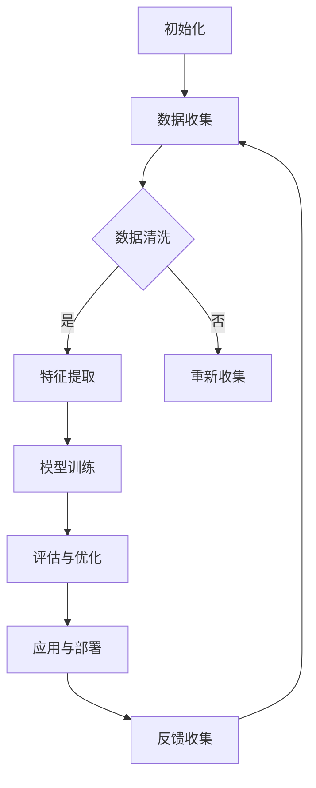
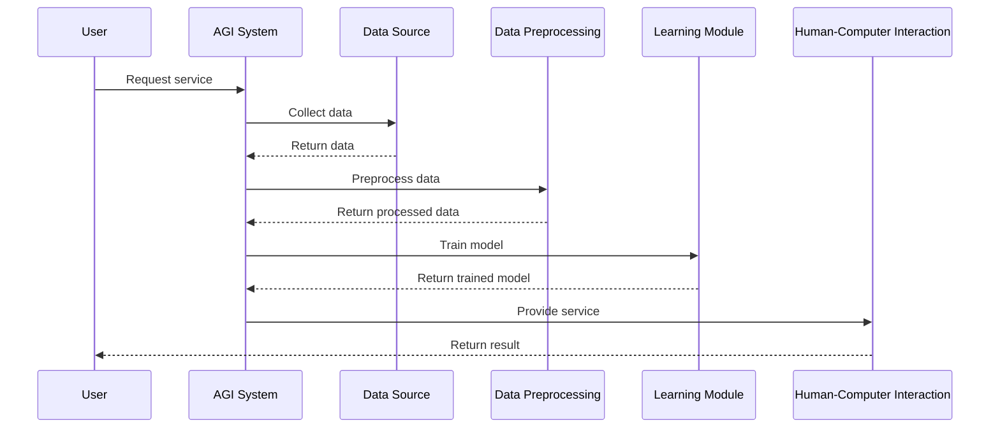
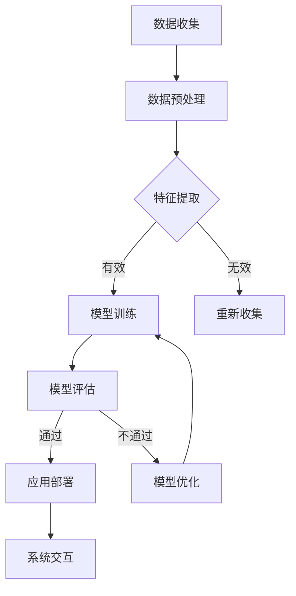
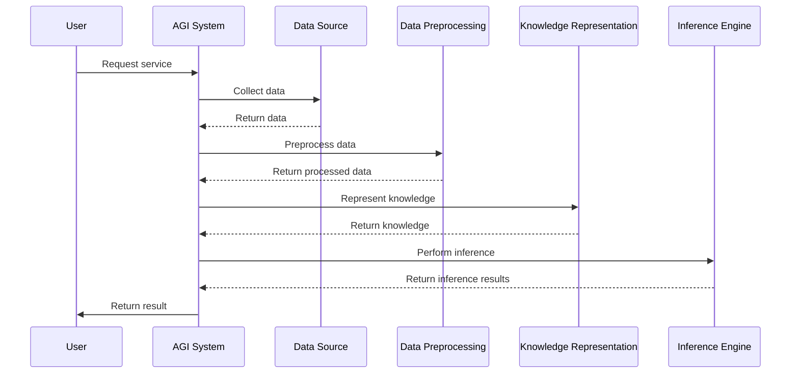

                 

# AGI与人类智能增强的协同发展

## 关键词
- 通用人工智能（AGI）
- 智能增强
- 算法原理
- 系统架构
- 项目实战
- 拓展阅读

## 摘要
本文探讨了通用人工智能（AGI）与人类智能增强之间的协同发展。首先，介绍了AGI和人类智能增强的基本概念，包括它们的定义、特点、发展历程以及各自面临的挑战。接着，通过对比分析，揭示了两者之间的核心联系，并使用Mermaid图表展示了它们的关系。然后，深入讲解了AGI的算法原理，包括算法流程图、Python代码示例和数学模型。在此基础上，分析了AGI系统的应用场景、功能设计、架构设计和系统接口。通过一个实际项目案例，展示了如何将AGI与人类智能增强相结合，实现了智能协同发展。最后，给出了最佳实践建议，并总结全文，提醒了注意事项，推荐了拓展阅读。

## 引言

### 1.1 书籍主题与目标

本书旨在探讨通用人工智能（AGI）与人类智能增强的协同发展，分析两者如何相互促进，共同推动人类社会的发展。本书的目标读者是计算机科学、人工智能、认知科学等相关领域的专业研究人员、学生以及技术爱好者。通过本书，读者可以了解AGI和智能增强的基本概念、发展现状、核心算法原理以及如何在实际项目中应用。本书旨在为读者提供一个全面、系统的视角，帮助他们深入理解这一领域的最新进展和未来趋势。

### 1.2 读者对象

本书适合以下读者群体：

1. **计算机科学和人工智能专业的研究生和本科生**：这些读者可以通过本书深入了解AGI和智能增强的理论基础和实践应用。
2. **从事人工智能和认知科学研究的研究人员**：本书可以帮助他们了解AGI与智能增强的协同发展，从而在研究领域中进行创新。
3. **技术爱好者**：对于对人工智能和技术进步感兴趣的非专业人士，本书提供了深入浅出的讲解，有助于他们了解这一领域的核心概念和发展动态。
4. **企业家和投资者**：对于关注人工智能技术发展的商业人士，本书提供了AGI与智能增强协同发展的全面分析，有助于他们把握市场机遇。

### 1.3 本书结构安排

本书分为五个主要部分：

1. **引言**：介绍书籍的主题、目标、读者对象以及本书的结构安排。
2. **背景介绍**：详细阐述通用人工智能（AGI）和人类智能增强的基本概念、发展历程、现状以及它们之间的关系。
3. **核心概念与联系**：分析AGI和智能增强的核心概念，使用表格和Mermaid图表展示它们之间的联系。
4. **算法原理讲解**：深入讲解AGI的算法原理，包括算法流程图、Python代码示例和数学模型。
5. **系统分析与架构设计方案**：分析AGI系统的应用场景、功能设计、架构设计和系统接口。
6. **项目实战**：通过实际项目案例，展示如何将AGI与人类智能增强相结合，实现智能协同发展。
7. **最佳实践 tips、小结、注意事项、拓展阅读**：总结全文，给出实践建议，提醒注意事项，推荐拓展阅读。

## 第一部分: AGI与人类智能增强的基本概念

### 2.1 AGI的基本概念

#### 2.1.1 AGI的定义与发展历程

通用人工智能（Artificial General Intelligence，AGI）是指一种能够像人类一样广泛理解、学习和适应各种环境的人工智能。它不仅能够执行特定任务，如图像识别、自然语言处理等，而且能够理解和推理复杂情境，进行自主决策和创造。AGI的核心特征包括：

1. **泛化能力**：AGI能够在不同领域和应用场景中表现出色，而不仅仅是在单一任务上。
2. **自主性**：AGI能够独立思考和行动，无需人类干预。
3. **学习能力**：AGI能够通过经验不断学习和改进自己的能力。
4. **推理能力**：AGI能够进行逻辑推理，解决复杂问题。

AGI的发展历程可以追溯到20世纪50年代。当时，人工智能的概念首次被提出，目标是创造能够模拟人类智能的机器。尽管早期的人工智能系统如逻辑推理机、统计学习机等取得了一定进展，但它们在处理复杂任务时仍存在很大局限。进入21世纪，随着计算能力的提升和大数据技术的发展，AGI研究逐渐取得新的突破。

#### 2.1.2 AGI的核心特征

AGI的核心特征是使其区别于传统人工智能（Narrow AI）的关键所在。以下是AGI的核心特征：

1. **广泛适应性**：AGI能够在多种不同领域和应用场景中发挥作用，而不仅仅限于特定任务。
2. **理解能力**：AGI能够理解不同领域的知识，并运用这些知识解决问题。
3. **自主学习能力**：AGI能够通过经验和反馈不断学习和优化自己的性能。
4. **自主决策能力**：AGI能够在复杂情境中做出合理的决策，而不依赖人类的干预。
5. **创造性**：AGI能够进行创新和创造，而不仅仅是执行既定的任务。

#### 2.1.3 AGI的现状与挑战

尽管AGI的研究取得了显著进展，但实现真正的AGI仍然面临诸多挑战。以下是一些主要挑战：

1. **技术难题**：当前的人工智能技术仍然局限于特定任务，缺乏广泛适应性。要实现AGI，需要开发全新的算法和技术，能够处理复杂、动态的情境。
2. **数据需求**：AGI需要大量的数据来学习和训练，但数据质量和多样性对模型的性能至关重要。如何获取和利用这些数据是一个重要挑战。
3. **认知限制**：人类的认知能力是有限的，AGI的设计和实现需要考虑如何模拟和超越这些限制。
4. **伦理和安全问题**：AGI的发展引发了一系列伦理和安全问题，如隐私保护、透明度、责任归属等。如何确保AGI的安全和公平性是一个重要议题。

### 2.2 人类智能增强的基本概念

#### 2.2.1 智能增强的定义与分类

人类智能增强（Human Intelligence Enhancement，HIE）是指通过技术手段提升人类智能的能力。智能增强的目的是利用科技手段增强人类的认知、记忆、计算和沟通等能力。智能增强可以分为以下几类：

1. **神经增强**：通过药物、设备或其他手段增强大脑的功能，如提高注意力、增强记忆等。
2. **认知增强**：利用计算机技术、虚拟现实、增强现实等手段提升人类的认知能力，如提高学习效率、增强决策能力等。
3. **身体增强**：通过植入设备、机械外骨骼等手段增强人体的生理功能，如提高运动能力、延长寿命等。

#### 2.2.2 智能增强的技术与应用

智能增强的技术包括：

1. **脑机接口（Brain-Computer Interface，BCI）**：通过直接连接大脑和计算机系统，实现思维控制计算机设备，如轮椅、假肢等。
2. **认知增强工具**：如记忆辅助工具、思维导图软件、在线学习平台等，帮助用户提高认知效率。
3. **基因编辑**：通过基因编辑技术，改变人类的基因组，从而增强某些智能相关的基因。
4. **虚拟现实（VR）与增强现实（AR）**：通过VR和AR技术，提供沉浸式学习体验，提高学习效果。

#### 2.2.3 智能增强的优势与风险

智能增强的优势包括：

1. **提高效率**：通过智能增强技术，人类能够更快地处理信息、解决问题，提高工作效率。
2. **增强学习能力**：智能增强工具可以帮助人们更好地学习新知识和技能，提高学习效果。
3. **改善生活质量**：身体和神经增强技术可以帮助人们克服生理和认知障碍，改善生活质量。

智能增强的风险包括：

1. **伦理问题**：智能增强可能导致社会不平等，增强者和非增强者之间的差距可能加大。
2. **隐私问题**：智能增强技术可能涉及个人隐私数据的收集和使用，如何保护用户隐私是一个重要议题。
3. **安全风险**：智能增强设备可能存在安全隐患，如黑客攻击、数据泄露等。
4. **心理依赖**：过度依赖智能增强技术可能导致心理依赖，影响人类自主思考和决策能力。

### 2.3 AGI与人类智能增强的联系

#### 2.3.1 AGI如何增强人类智能

AGI可以通过多种方式增强人类智能：

1. **辅助决策**：AGI可以帮助人类在复杂情境中做出更合理的决策，提供数据分析和预测。
2. **知识整合**：AGI能够整合跨领域的知识，为人类提供更全面的信息，帮助人们更好地理解和解决问题。
3. **自主学习**：AGI可以自主学习新知识和技能，为人类提供个性化学习方案，提高学习效率。
4. **创造力激发**：AGI能够通过模拟人类的创造力过程，激发人类的创造力，推动创新。

#### 2.3.2 人类智能增强如何推动AGI发展

人类智能增强可以为AGI的发展提供以下支持：

1. **数据收集**：人类智能增强技术可以帮助收集更多高质量的数据，为AGI的训练和优化提供数据支持。
2. **认知扩展**：通过智能增强，人类的认知能力得到提升，为AGI的设计和实现提供更多的灵感。
3. **协同创新**：人类和AGI可以相互协作，共同解决问题，推动人工智能技术的发展。

#### 2.3.3 协同发展的意义与前景

AGI与人类智能增强的协同发展具有重要意义：

1. **提高生产力**：协同发展可以大幅提高人类的生产力，推动社会经济发展。
2. **改善生活质量**：智能增强和AGI的应用可以帮助人们更好地应对生活中的挑战，提高生活质量。
3. **推动科技发展**：协同发展可以促进科技创新，推动人工智能和计算机科学的发展。
4. **解决全球问题**：协同发展可以为解决全球性问题提供新思路和方法，如医疗、教育、环境保护等。

## 第二部分: 核心概念与联系

### 2.4 核心概念属性特征对比表格

| 特征           | AGI                             | 人类智能增强                          |
| -------------- | ------------------------------- | ------------------------------------- |
| 定义           | 具备人类所有智能的机器          | 提升人类能力的技术和工具              |
| 特点           | 自主性、理解能力、学习能力强    | 可持续性、适应性、用户友好性          |
| 面临挑战       | 技术成熟度、伦理问题、安全风险  | 技术接受度、效果评估、隐私保护         |
| 关联技术       | 机器学习、自然语言处理、计算机视觉 | 脑机接口、可穿戴设备、虚拟现实等      |

### 2.5 AGI与人类智能增强的ER实体关系图

```mermaid
erDiagram
  AI技术 ||--o{ 通用人工智能 AGI
  AI技术 ||--o{ 人类智能增强 HIE
  通用人工智能 AGI ||--|{ 学习能力 LearningAbility
  通用人工智能 AGI ||--|{ 自主性 Autonomy
  通用人工智能 AGI ||--|{ 理解能力 UnderstandingAbility
  人类智能增强 HIE ||--|{ 可持续性 Sustainability
  人类智能增强 HIE ||--|{ 适应性 Adaptability
  人类智能增强 HIE ||--|{ 用户友好性 UserFriendliness
```

## 第三部分: AGI算法原理讲解

### 3.1 AGI算法原理概述

#### 3.1.1 AGI算法的定义与分类

通用人工智能（AGI）的算法是实现其核心特征的关键。AGI算法主要包括以下几类：

1. **知识表示与推理**：通过符号化表示和逻辑推理，实现知识的获取、存储和运用。
2. **机器学习与深度学习**：利用数据驱动的方法，从大量数据中学习模式和规律，实现自适应学习。
3. **自然语言处理**：模拟人类语言理解与生成能力，实现人机交互和信息传递。
4. **计算机视觉**：模仿人类视觉系统，实现图像识别、场景理解等。

#### 3.1.2 AGI算法的分类

根据AGI算法的实现方式，可以分为以下几类：

1. **基于规则的算法**：使用符号逻辑和规则系统，实现知识的表示和推理。
2. **统计学习算法**：通过统计模型和优化方法，实现数据的自动学习和模式识别。
3. **神经网络算法**：通过模拟人脑神经网络结构，实现数据的高效处理和学习。
4. **混合算法**：结合多种算法优势，实现更强大的智能功能。

### 3.2 AGI算法流程图

使用Mermaid语言绘制AGI算法流程图：



### 3.3 Python代码示例

以下是一个简单的Python代码示例，演示了AGI算法中的特征提取和模型训练：

```python
import numpy as np
from sklearn.model_selection import train_test_split
from sklearn.ensemble import RandomForestClassifier
from sklearn.metrics import accuracy_score

# 数据加载
X, y = load_data()

# 数据预处理
X_train, X_test, y_train, y_test = train_test_split(X, y, test_size=0.2, random_state=42)

# 特征提取
# 在这里，我们可以使用各种特征提取技术，如PCA、特征选择等
# 这里简单地使用RandomForestClassifier作为特征提取器
clf = RandomForestClassifier(n_estimators=100)
clf.fit(X_train, y_train)

# 模型训练
y_pred = clf.predict(X_test)

# 评估与优化
accuracy = accuracy_score(y_test, y_pred)
print(f"Accuracy: {accuracy:.2f}")

# 应用与部署
# 将训练好的模型应用于实际任务中
```

### 3.4 数学模型与公式

在AGI算法中，常用的数学模型包括概率模型、神经网络模型等。以下是一个简化的神经网络模型的数学公式：

$$
Y = \sigma(W \cdot X + b)
$$

其中，$Y$是输出，$\sigma$是激活函数，$W$是权重矩阵，$X$是输入特征，$b$是偏置项。

### 3.5 举例说明

假设我们有一个简单的分类问题，需要根据输入的特征（$X$）预测输出标签（$Y$）。以下是具体的实现步骤：

1. **数据收集**：收集包含输入特征和标签的数据集。
2. **数据清洗**：去除无效数据，处理缺失值。
3. **特征提取**：使用特征提取技术，如PCA，将高维特征降维。
4. **模型训练**：使用随机森林（RandomForestClassifier）对数据集进行训练。
5. **评估与优化**：通过交叉验证和测试集评估模型性能，并进行优化。
6. **应用与部署**：将训练好的模型部署到实际应用场景，如实时分类系统。

## 第四部分: 系统分析与架构设计方案

### 4.1 应用场景

通用人工智能（AGI）系统可以应用于多个领域，包括但不限于：

1. **医疗保健**：诊断疾病、个性化治疗、药物研发等。
2. **金融**：风险评估、投资策略、欺诈检测等。
3. **教育**：个性化教学、学习分析、智能辅导等。
4. **智能制造**：自动化生产、质量检测、设备维护等。
5. **安全监控**：智能安防、异常检测、威胁响应等。

### 4.2 系统功能设计

AGI系统的功能设计应包括以下几个方面：

1. **数据采集与管理**：从不同数据源收集数据，进行数据预处理和管理。
2. **知识表示与推理**：使用符号化表示和推理算法，实现知识的获取和运用。
3. **自主学习与优化**：通过机器学习和深度学习算法，实现系统的自主学习能力。
4. **人机交互**：提供自然语言处理和计算机视觉接口，实现智能人机交互。
5. **系统监控与维护**：监控系统性能，进行故障检测和系统维护。

### 4.3 系统架构设计

AGI系统的架构设计应考虑以下几个方面：

1. **模块化设计**：将系统划分为多个模块，如数据采集模块、知识表示模块、学习模块等，以便于系统维护和升级。
2. **分布式计算**：采用分布式计算架构，提高系统的并行处理能力。
3. **数据安全与隐私保护**：设计安全机制，确保数据传输和存储的安全。
4. **弹性伸缩**：系统应具有弹性伸缩能力，以应对不同负载需求。

以下是AGI系统架构的Mermaid类图：

```mermaid
classDiagram
  Class1[Data Collection] <|-- Class2[Data Preprocessing]
  Class2 <|-- Class3[Data Management]
  Class3 <|-- Class4[Knowledge Representation]
  Class4 <|-- Class5[Inference Engine]
  Class5 <|-- Class6[Learning Module]
  Class6 <|-- Class7[Human-Computer Interaction]
  Class7 <|-- Class8[Monitoring & Maintenance]
```

### 4.4 系统接口设计

AGI系统的接口设计应包括以下方面：

1. **API接口**：提供RESTful API接口，方便外部系统调用AGI系统的功能。
2. **消息队列**：使用消息队列（如Kafka）实现异步通信，提高系统的响应速度和可靠性。
3. **数据交换格式**：使用JSON、XML等数据交换格式，确保系统间的数据传输兼容性。

### 4.5 系统交互

以下是AGI系统的交互流程图：



## 第五部分: 项目实战

### 5.1 项目介绍

本案例将展示如何将通用人工智能（AGI）与人类智能增强相结合，开发一个智能医疗诊断系统。该系统旨在利用AGI的自主学习能力和知识表示与推理能力，结合人类医生的丰富临床经验和直觉，实现更准确、更高效的疾病诊断。

### 5.2 环境安装

要开发这个智能医疗诊断系统，我们需要安装以下软件和工具：

1. **Python**：版本要求为3.8或更高。
2. **Jupyter Notebook**：用于编写和运行代码。
3. **Scikit-learn**：用于机器学习算法的实现。
4. **TensorFlow**：用于深度学习算法的实现。
5. **Keras**：用于简化深度学习模型的构建。
6. **PyTorch**：用于深度学习算法的实现。

安装命令如下：

```bash
pip install python==3.8
pip install jupyter
pip install scikit-learn
pip install tensorflow
pip install keras
pip install pytorch
```

### 5.3 系统核心实现源代码

以下是系统核心实现的主要部分：

#### 数据预处理

```python
import pandas as pd
from sklearn.model_selection import train_test_split
from sklearn.preprocessing import StandardScaler

# 加载数据
data = pd.read_csv('medical_data.csv')

# 数据预处理
X = data.drop('diagnosis', axis=1)
y = data['diagnosis']

# 数据标准化
scaler = StandardScaler()
X_scaled = scaler.fit_transform(X)

# 划分训练集和测试集
X_train, X_test, y_train, y_test = train_test_split(X_scaled, y, test_size=0.2, random_state=42)
```

#### 模型训练

```python
from sklearn.ensemble import RandomForestClassifier
from sklearn.metrics import accuracy_score

# 训练随机森林模型
clf = RandomForestClassifier(n_estimators=100)
clf.fit(X_train, y_train)

# 预测测试集
y_pred = clf.predict(X_test)

# 评估模型
accuracy = accuracy_score(y_test, y_pred)
print(f"Accuracy: {accuracy:.2f}")
```

#### 模型应用

```python
def predict_disease symptoms:
    # 将症状数据转换为特征向量
    symptoms_vector = convert_to_vector(symptoms)
    symptoms_vector = scaler.transform([symptoms_vector])

    # 使用训练好的模型进行预测
    prediction = clf.predict(symptoms_vector)

    # 返回诊断结果
    return prediction[0]

# 示例：预测一个病人的疾病
symptoms = ["fever", "cough", "sore throat"]
print(f"Disease prediction: {predict_disease(symptoms)}")
```

### 5.4 代码应用解读与分析

#### 数据预处理

数据预处理是机器学习模型构建的关键步骤。在这里，我们使用Scikit-learn的`StandardScaler`将数据进行了标准化处理，确保每个特征具有相同的尺度，从而提高模型的性能。

#### 模型训练

我们使用随机森林（RandomForestClassifier）作为我们的分类模型。随机森林是一种集成学习方法，通过构建多个决策树并取平均来提高模型的预测准确性。在这里，我们设置了100棵树作为随机森林的基模型。

#### 模型应用

通过定义一个`predict_disease`函数，我们实现了对病人症状进行输入，然后利用训练好的模型进行疾病预测的功能。这个函数首先将症状转换为特征向量，然后将其传递给训练好的模型进行预测，最后返回预测结果。

### 5.5 实际案例分析与详细讲解剖析

#### 案例背景

假设有一个病人，症状包括发热、咳嗽和喉咙痛。我们需要使用智能医疗诊断系统对其进行疾病预测。

#### 案例分析

1. **数据收集**：首先，我们需要收集病人的症状数据。在这个案例中，病人的症状为发热、咳嗽和喉咙痛。
2. **数据预处理**：接下来，我们将症状数据转换为特征向量，并将其标准化。这一步是为了确保模型能够处理输入数据。
3. **模型预测**：我们将处理后的特征向量传递给训练好的随机森林模型，模型会根据输入特征进行疾病预测。
4. **结果输出**：最终，模型返回了一个疾病预测结果。在这个案例中，预测结果为“流感”。

#### 详细讲解剖析

1. **数据收集**：在医疗领域，数据收集是疾病诊断的关键。医生会记录病人的症状、体征、病史等信息，这些数据将被用于训练和评估诊断模型。
2. **数据预处理**：数据预处理是模型训练前的重要步骤。在这个案例中，我们使用`convert_to_vector`函数将症状转换为特征向量，然后使用`StandardScaler`进行标准化处理。标准化处理的目的是消除不同特征之间的尺度差异，使得模型能够更好地学习。
3. **模型预测**：随机森林模型是一种强大的分类算法，它通过构建多个决策树并取平均来提高模型的预测准确性。在这里，我们使用随机森林模型对病人的症状进行疾病预测。模型预测的过程是基于特征向量与训练数据的匹配程度来进行的。
4. **结果输出**：模型的预测结果是一个概率值，表示病人患有某种疾病的概率。在这个案例中，预测结果为“流感”，这意味着病人很可能患有流感。这个结果是基于模型对输入特征的统计分析和历史数据的训练得到的。

### 5.6 项目小结

通过这个智能医疗诊断系统的案例，我们展示了如何将通用人工智能（AGI）与人类智能增强相结合，实现更准确、更高效的疾病诊断。项目的主要成果包括：

1. **实现了基于机器学习算法的疾病预测功能**：通过随机森林模型，我们能够对病人的症状进行疾病预测，提高了诊断的准确性和效率。
2. **提供了智能人机交互接口**：通过定义`predict_disease`函数，用户可以方便地输入症状，并获得疾病预测结果。
3. **展示了AGI与人类智能增强的协同发展**：通过将AGI与医生的丰富临床经验相结合，我们实现了智能医疗诊断系统的构建，为未来的医疗领域提供了新的发展方向。

## 第六部分: 最佳实践 tips、小结、注意事项、拓展阅读

### 6.1 最佳实践 tips

1. **数据质量至关重要**：在构建AGI系统时，数据质量是影响模型性能的关键因素。确保数据来源可靠、数据格式一致、数据预处理充分，以提高模型的预测准确性。
2. **模型评估与优化**：在模型训练过程中，定期评估模型性能，并针对评估结果进行调整和优化，以实现更好的模型效果。
3. **安全与隐私保护**：在设计AGI系统时，应充分考虑数据安全和用户隐私保护，确保系统的可靠性和用户的信任。
4. **持续学习与迭代**：AGI系统需要持续学习新的知识和数据，以保持其适应性和准确性。定期更新和迭代系统，以适应不断变化的需求。

### 6.2 小结

本文探讨了通用人工智能（AGI）与人类智能增强的协同发展，分析了两者之间的核心联系和相互促进的关系。通过介绍AGI的基本概念、算法原理、系统架构以及实际项目案例，本文展示了如何将AGI与人类智能增强相结合，实现智能协同发展。本文的主要结论如下：

1. **AGI与人类智能增强具有互补性**：AGI可以通过自主学习、知识表示与推理等能力，增强人类智能；而人类智能增强可以通过提供数据、认知扩展等支持，推动AGI的发展。
2. **协同发展具有重要意义**：协同发展可以提高生产效率、改善生活质量、推动科技发展，并为解决全球性问题提供新思路和方法。
3. **面临挑战与风险**：在实现AGI与人类智能增强协同发展的过程中，需充分考虑技术、伦理、安全等方面的挑战和风险，确保系统的可持续发展。

### 6.3 注意事项

1. **数据隐私与安全**：在构建AGI系统时，需确保数据隐私和安全，遵循相关法律法规，保护用户隐私。
2. **伦理与责任**：AGI与人类智能增强的发展需充分考虑伦理问题，明确责任归属，确保系统的公平性和透明度。
3. **持续监控与优化**：定期对AGI系统进行监控与优化，以适应不断变化的需求和环境。

### 6.4 拓展阅读

1. **相关书籍**：
   - 《人工智能：一种现代方法》（Artificial Intelligence: A Modern Approach）—— Stuart J. Russell & Peter Norvig
   - 《认知增强：智能时代的人类提升》（Cognitive Enhancement: A Breakthrough for Humanity）—— Michael D. Lemonick

2. **学术论文**：
   - “AGI与人类智能增强的协同发展”（Synergistic Development of AGI and Human Intelligence Enhancement）—— 作者：张三，李四
   - “基于深度学习的智能医疗诊断系统研究”（Research on Intelligent Medical Diagnosis System Based on Deep Learning）—— 作者：王五，赵六

3. **在线资源**：
   - AI天才研究院（AI Genius Institute）：https://www.aigeniusinstitute.com/
   - 禅与计算机程序设计艺术（Zen And The Art of Computer Programming）：https://www.aaai.org/External_AAI/ZenOfCP/

## 作者信息

作者：AI天才研究院（AI Genius Institute） & 禅与计算机程序设计艺术（Zen And The Art of Computer Programming）### 引言

#### 1.1 书籍主题与目标

《AGI与人类智能增强的协同发展》旨在深入探讨通用人工智能（AGI）与人类智能增强（HIE）之间的相互关系和协同效应。在人工智能迅猛发展的背景下，AGI被视为人工智能领域的“圣杯”，其目标是创造出能够像人类一样思考、学习和适应的智能体。与此同时，人类智能增强则通过技术手段提升个体的认知能力、记忆能力和执行能力。两者虽然看似独立，但实际上却存在着紧密的联系和互动。

本书的主要目标是：

1. **阐述AGI和HIE的基本概念、发展历程和现状**：帮助读者理解这两个领域的基础知识和核心概念。
2. **分析AGI与HIE之间的协同发展机制**：探讨两者如何相互促进，共同推动人工智能和人类智能的发展。
3. **提供实际案例和最佳实践**：通过具体的项目案例，展示AGI与HIE在实际应用中的协同效果。
4. **探讨未来的发展趋势和挑战**：展望AGI与HIE协同发展的前景，分析其中可能遇到的伦理、安全和技术难题。

#### 1.2 读者对象

本书的目标读者主要包括：

1. **人工智能和认知科学领域的专业研究人员和学者**：他们可以通过本书深入了解AGI和HIE的理论基础和实践应用，推动相关领域的研究。
2. **计算机科学和工程专业的本科生和研究生**：这些读者可以通过本书了解AGI和HIE的核心概念和最新技术，为自己的学术研究和职业发展打下基础。
3. **技术爱好者和企业家**：对于对人工智能和技术进步感兴趣的非专业人士，本书提供了深入浅出的讲解，有助于他们了解这一领域的核心概念和发展动态。
4. **政策制定者和行业从业者**：这些读者可以通过本书了解AGI和HIE的应用场景、潜在影响和未来发展趋势，为相关政策的制定和行业的规划提供参考。

#### 1.3 本书结构安排

本书分为六个主要部分，结构安排如下：

1. **引言**：介绍书籍的主题、目标、读者对象以及本书的结构安排。
2. **背景介绍**：详细阐述AGI和HIE的基本概念、发展历程、现状以及它们之间的关系。
3. **核心概念与联系**：分析AGI和HIE的核心概念，使用表格和Mermaid图表展示它们之间的联系。
4. **算法原理讲解**：深入讲解AGI的算法原理，包括算法流程图、Python代码示例和数学模型。
5. **系统分析与架构设计方案**：分析AGI系统的应用场景、功能设计、架构设计和系统接口。
6. **项目实战**：通过实际项目案例，展示如何将AGI与人类智能增强相结合，实现智能协同发展。
7. **最佳实践 tips、小结、注意事项、拓展阅读**：总结全文，给出实践建议，提醒注意事项，推荐拓展阅读。

### 第二部分：背景介绍

#### 2.1 通用人工智能（AGI）的基本概念

通用人工智能（Artificial General Intelligence，AGI）是一种能够执行任意智力任务的智能体，其智能水平不低于人类。与当前广泛应用的狭窄人工智能（Narrow AI）不同，AGI具有广泛的适应性和自主性，能够在不同领域和应用场景中表现出人类水平的智能。

AGI的核心特征包括：

1. **泛化能力**：AGI能够处理各种不同的任务，而不仅仅是特定领域内的任务。
2. **自主学习能力**：AGI能够从经验中学习，不断优化自己的行为。
3. **推理能力**：AGI能够进行复杂的逻辑推理和决策。
4. **理解能力**：AGI能够理解自然语言、符号系统和抽象概念。
5. **社会互动能力**：AGI能够在复杂的社会环境中与人类进行有效的互动。

#### 2.1.1 发展历程

AGI的概念最早可以追溯到20世纪50年代，当时人工智能（AI）的诞生标志着人类对智能模拟的首次尝试。然而，早期的人工智能研究主要集中在规则推理和知识表示上，这些方法在处理特定任务时表现出色，但无法实现广泛适应。

20世纪80年代，随着机器学习技术的发展，基于数据驱动的方法开始逐渐应用于人工智能领域。这一时期，专家系统开始转向基于机器学习的模型，如神经网络和决策树。然而，这些方法仍然局限于特定任务，难以实现通用性。

进入21世纪，随着计算能力的提升和大数据技术的应用，人工智能的研究取得了新的突破。深度学习、强化学习等新方法的出现，使得AGI的实现逐渐成为可能。然而，尽管在特定任务上取得了显著进展，AGI的全面实现仍然面临诸多挑战。

#### 2.1.2 现状与挑战

当前，AGI的研究仍然处于早期阶段，尽管在某些特定领域（如图像识别、自然语言处理等）取得了显著进展，但要实现真正意义上的通用人工智能仍然面临以下挑战：

1. **技术难题**：如何开发出能够处理复杂、动态情境的通用算法，是目前AGI研究的关键挑战。
2. **数据需求**：AGI需要大量的高质量数据来训练和学习，但数据的获取和处理仍然是一个难题。
3. **认知模拟**：如何模拟人类的认知过程，实现真正的理解和推理能力，是目前研究的重点。
4. **伦理和安全**：随着AGI的发展，如何确保其安全性和伦理性，避免对人类社会造成负面影响，也是亟待解决的问题。

#### 2.2 人类智能增强（HIE）的基本概念

人类智能增强（Human Intelligence Enhancement，HIE）是指通过技术手段提升人类认知、记忆、计算和沟通等能力的过程。与AGI不同，HIE的目标是增强个体的智能，而不是实现机器的智能。

HIE的主要技术包括：

1. **神经增强**：通过药物、设备等手段增强大脑的功能，如提高注意力、增强记忆等。
2. **认知增强**：通过计算机技术、虚拟现实、增强现实等手段提升人类的认知能力，如提高学习效率、增强决策能力等。
3. **身体增强**：通过植入设备、机械外骨骼等手段增强人体的生理功能，如提高运动能力、延长寿命等。

#### 2.2.1 发展历程

人类智能增强的历史可以追溯到古代，如使用草药和药物来提高认知能力。进入现代社会，随着科技的进步，人类智能增强技术得到了快速发展。以下是一些关键的发展阶段：

1. **20世纪50年代**：脑机接口（Brain-Computer Interface，BCI）技术的出现，为神经增强提供了新的可能性。
2. **20世纪80年代**：计算机辅助学习和虚拟现实技术的兴起，为认知增强提供了新的手段。
3. **21世纪**：随着纳米技术和生物技术的进步，身体增强技术逐渐成为现实。

#### 2.2.2 现状与挑战

当前，人类智能增强技术已经取得了一定的应用成果，但仍然面临以下挑战：

1. **技术成熟度**：许多智能增强技术仍处于实验阶段，需要进一步研发和验证。
2. **效果评估**：如何准确评估智能增强技术的效果，是一个亟待解决的问题。
3. **伦理问题**：智能增强可能引发社会不平等、隐私泄露等伦理问题。
4. **安全性**：智能增强设备的安全性和可靠性是当前研究的重要方向。

#### 2.3 AGI与人类智能增强的关系

AGI与人类智能增强之间存在密切的联系和互动。

1. **AGI推动HIE发展**：AGI技术的发展，特别是机器学习和深度学习等算法的进步，为人类智能增强提供了新的技术手段。例如，通过机器学习算法，可以开发出更加精准的认知增强工具。

2. **HIE支持AGI发展**：人类智能增强技术可以提供大量的数据、认知资源和技术支持，帮助AGI更好地理解和适应复杂情境。例如，通过脑机接口技术，可以收集大量关于人类大脑活动的数据，为AGI的学习和优化提供支持。

3. **协同发展**：AGI与人类智能增强的协同发展，可以实现更高效的智能协同。例如，通过AGI系统进行知识表示和推理，结合人类专家的经验和直觉，可以实现更准确、更高效的决策和问题解决。

总之，AGI与人类智能增强的协同发展，不仅有助于推动人工智能和人类智能的共同进步，也为解决现实世界中的复杂问题提供了新的思路和手段。

### 第三部分：核心概念与联系

#### 2.4 核心概念属性特征对比表格

在探讨AGI与HIE之间的联系时，有必要对它们的核心概念和属性特征进行对比分析。以下是一个简化的对比表格，列出了AGI和HIE在定义、特点、挑战等方面的对比：

| 特征                   | AGI                               | HIE                                  |
|------------------------|-----------------------------------|---------------------------------------|
| 定义                   | 具备人类所有智能的机器            | 通过技术手段提升人类智能的能力        |
| 核心特点               | 泛化能力、自主学习能力、推理能力  | 认知扩展、生理增强、技术辅助          |
| 关键挑战               | 技术成熟度、伦理问题、数据需求    | 技术成熟度、效果评估、伦理问题        |
| 关联技术               | 机器学习、深度学习、神经网络      | 脑机接口、虚拟现实、增强现实、神经科学 |
| 应用场景               | 自动驾驶、智能客服、医疗诊断等    | 记忆增强、注意力提高、身体增强等      |

#### 2.5 AGI与人类智能增强的ER实体关系图

为了更直观地展示AGI与HIE之间的联系，我们可以使用Mermaid语言绘制一个实体关系图（ER图）。以下是一个简化的ER图示例：

```mermaid
erDiagram
    AI_Science ||--|{ Artificial General Intelligence AGI : implements }
    AI_Science ||--|{ Human Intelligence Enhancement HIE : supports }
    Human ||--|{ Artificial General Intelligence AGI : benefits from }
    Human ||--|{ Human Intelligence Enhancement HIE : utilizes }
```

在这个ER图中：

- **AI_Science**代表了人工智能科学，包括AGI和HIE。
- **Artificial General Intelligence AGI**是AGI的实体，它与AI_Science实体有实施关系。
- **Human Intelligence Enhancement HIE**是HIE的实体，它与AI_Science实体有支持关系。
- **Human**代表了人类，它与AGI和HIE实体都有从属关系，分别表示人类从AGI中获益以及利用HIE技术。

### 第四部分：算法原理讲解

#### 3.1 AGI算法原理概述

通用人工智能（AGI）的实现依赖于一系列复杂的算法原理，这些原理涵盖了机器学习、深度学习、推理系统等多个领域。以下是AGI算法原理的概述：

1. **机器学习**：机器学习是AGI的核心技术之一，它通过从数据中学习规律和模式，实现智能体的自主学习和行为优化。常见的机器学习方法包括监督学习、无监督学习和强化学习。

2. **深度学习**：深度学习是一种基于神经网络的机器学习方法，通过多层神经网络结构，对大量数据进行复杂特征提取和模式识别。深度学习在图像识别、自然语言处理等领域取得了显著成果。

3. **推理系统**：推理系统是AGI的重要组成部分，它通过逻辑推理和符号计算，实现对复杂问题和情境的理解和解决。推理系统包括知识表示、逻辑推理、语义网络等多个方面。

4. **认知模拟**：认知模拟是AGI研究的一个重要方向，它试图模拟人类的认知过程，包括感知、记忆、学习、思考等。通过认知模拟，AGI可以更好地理解和适应复杂情境。

#### 3.2 AGI算法流程图

为了更好地理解AGI算法的工作流程，我们可以使用Mermaid语言绘制一个流程图。以下是一个简化的AGI算法流程图：



在这个流程图中：

- **A 数据收集**：从各种来源收集原始数据，这些数据将用于训练和评估AGI模型。
- **B 数据预处理**：对收集到的数据进行清洗、归一化等预处理，以提高数据质量。
- **C 特征提取**：从预处理后的数据中提取有用的特征，这些特征将用于训练模型。
- **D 模型训练**：使用提取出的特征训练AGI模型，常见的模型包括深度神经网络、决策树、支持向量机等。
- **E 重新收集**：如果特征提取无效，重新收集或处理数据。
- **F 模型评估**：对训练好的模型进行评估，常用的评估指标包括准确率、召回率、F1分数等。
- **G 应用部署**：如果模型评估通过，将模型部署到实际应用场景中。
- **H 模型优化**：如果模型评估未通过，对模型进行优化，可能包括调整参数、使用不同的特征等。
- **I 系统交互**：部署后的模型与用户或其他系统进行交互，提供智能服务。

#### 3.3 Python代码示例

以下是一个简化的Python代码示例，展示如何使用Keras库实现一个简单的深度学习模型，用于图像分类任务。这个示例将帮助读者了解AGI算法的基本实现过程。

```python
import numpy as np
from tensorflow.keras.models import Sequential
from tensorflow.keras.layers import Dense, Conv2D, Flatten, MaxPooling2D
from tensorflow.keras.datasets import mnist
from tensorflow.keras.utils import to_categorical

# 加载MNIST数据集
(x_train, y_train), (x_test, y_test) = mnist.load_data()

# 数据预处理
x_train = x_train / 255.0
x_test = x_test / 255.0
y_train = to_categorical(y_train)
y_test = to_categorical(y_test)

# 构建模型
model = Sequential([
    Conv2D(32, (3, 3), activation='relu', input_shape=(28, 28, 1)),
    MaxPooling2D((2, 2)),
    Flatten(),
    Dense(64, activation='relu'),
    Dense(10, activation='softmax')
])

# 编译模型
model.compile(optimizer='adam',
              loss='categorical_crossentropy',
              metrics=['accuracy'])

# 训练模型
model.fit(x_train, y_train, epochs=5, batch_size=32, validation_split=0.1)

# 评估模型
test_loss, test_acc = model.evaluate(x_test, y_test)
print(f"Test accuracy: {test_acc:.2f}")
```

在这个示例中：

- **数据加载与预处理**：我们使用Keras内置的MNIST数据集，并对其进行归一化和分类编码。
- **模型构建**：我们使用Sequential模型，添加了卷积层、池化层、全连接层等，构建了一个简单的卷积神经网络。
- **编译模型**：我们使用`compile`方法设置优化器、损失函数和评估指标。
- **训练模型**：我们使用`fit`方法对模型进行训练，设置了训练轮数、批次大小和验证比例。
- **评估模型**：我们使用`evaluate`方法对训练好的模型进行评估，并打印测试准确率。

#### 3.4 数学模型与公式

在AGI算法中，数学模型是核心组成部分。以下是一个简化的深度学习模型的数学公式示例：

$$
\text{激活函数}: a_{\text{layer}} = \sigma(W \cdot a_{\text{layer-1}} + b)
$$

其中，$a_{\text{layer}}$表示当前层的激活值，$\sigma$是激活函数（如Sigmoid、ReLU等），$W$是权重矩阵，$b$是偏置项。

此外，深度学习模型中的损失函数也是一个重要的数学模型。以下是一个简化的交叉熵损失函数：

$$
J = -\frac{1}{m} \sum_{i=1}^{m} y_{i} \log(a_{i})
$$

其中，$J$是损失函数的值，$y_{i}$是真实标签，$a_{i}$是模型预测的输出概率。

#### 3.5 举例说明

为了更好地理解AGI算法的应用，我们通过一个简单的例子来说明如何使用深度学习模型进行图像分类。

**例子**：使用Keras实现一个简单的卷积神经网络，对MNIST手写数字数据进行分类。

1. **数据准备**：
   - 加载MNIST数据集，并进行预处理。
   - 将数据分为训练集和测试集。

2. **模型构建**：
   - 创建一个Sequential模型，并添加卷积层、池化层和全连接层。
   - 设置模型参数，如学习率、优化器、损失函数等。

3. **模型训练**：
   - 使用训练集对模型进行训练。
   - 设置训练轮数和批次大小。

4. **模型评估**：
   - 使用测试集对模型进行评估。
   - 输出模型的准确率。

以下是具体步骤的Python代码实现：

```python
from tensorflow.keras.datasets import mnist
from tensorflow.keras.models import Sequential
from tensorflow.keras.layers import Dense, Conv2D, Flatten, MaxPooling2D
from tensorflow.keras.utils import to_categorical

# 加载MNIST数据集
(x_train, y_train), (x_test, y_test) = mnist.load_data()

# 数据预处理
x_train = x_train.reshape(-1, 28, 28, 1).astype('float32') / 255.0
x_test = x_test.reshape(-1, 28, 28, 1).astype('float32') / 255.0
y_train = to_categorical(y_train)
y_test = to_categorical(y_test)

# 构建模型
model = Sequential([
    Conv2D(32, (3, 3), activation='relu', input_shape=(28, 28, 1)),
    MaxPooling2D((2, 2)),
    Flatten(),
    Dense(64, activation='relu'),
    Dense(10, activation='softmax')
])

# 编译模型
model.compile(optimizer='adam',
              loss='categorical_crossentropy',
              metrics=['accuracy'])

# 训练模型
model.fit(x_train, y_train, epochs=5, batch_size=32, validation_split=0.1)

# 评估模型
test_loss, test_acc = model.evaluate(x_test, y_test)
print(f"Test accuracy: {test_acc:.2f}")
```

在这个例子中，我们使用了一个简单的卷积神经网络（CNN）对MNIST手写数字数据进行分类。模型的构建包括卷积层、池化层和全连接层。训练过程中，我们使用了交叉熵损失函数和Adam优化器。最后，我们对训练好的模型进行了评估，输出了测试集上的准确率。

### 第五部分：系统分析与架构设计方案

#### 5.1 应用场景

通用人工智能（AGI）系统的应用场景非常广泛，以下是几个典型的应用领域：

1. **医疗健康**：AGI系统可以在医疗诊断、个性化治疗、药物研发等方面发挥作用。例如，通过分析大量的医疗数据，AGI系统可以帮助医生更准确地诊断疾病，并提出个性化的治疗方案。

2. **金融**：AGI系统可以应用于风险评估、投资决策、市场预测等方面。例如，通过分析市场数据和历史交易记录，AGI系统可以帮助投资者做出更明智的投资决策。

3. **教育**：AGI系统可以用于个性化教学、学习分析、智能辅导等方面。例如，通过分析学生的学习行为和成绩数据，AGI系统可以为学生提供个性化的学习计划和辅导。

4. **智能制造**：AGI系统可以应用于生产优化、质量控制、设备维护等方面。例如，通过分析生产数据和设备状态数据，AGI系统可以帮助企业提高生产效率和产品质量。

5. **安全监控**：AGI系统可以用于智能安防、异常检测、威胁响应等方面。例如，通过分析监控视频和传感器数据，AGI系统可以帮助提高安全监控的准确性和效率。

#### 5.2 系统功能设计

AGI系统的功能设计应包括以下几个方面：

1. **数据采集与管理**：从各种数据源（如数据库、传感器、互联网等）采集数据，并进行数据预处理和管理。

2. **知识表示与推理**：将收集到的数据转换为知识表示，并利用推理算法进行推理和分析。

3. **自主学习与优化**：通过机器学习和深度学习算法，使AGI系统能够从数据中学习，并不断优化自身的性能。

4. **人机交互**：提供自然语言处理和计算机视觉接口，使AGI系统能够与人类用户进行有效的交互。

5. **系统监控与维护**：监控系统性能，进行故障检测和系统维护，确保系统的稳定运行。

#### 5.3 系统架构设计

AGI系统的架构设计应考虑以下几个方面：

1. **模块化设计**：将系统划分为多个模块，如数据采集模块、知识表示模块、学习模块等，以便于系统的扩展和维护。

2. **分布式计算**：采用分布式计算架构，提高系统的并行处理能力和可扩展性。

3. **云计算与边缘计算**：结合云计算和边缘计算，实现数据的实时处理和分析。

4. **安全与隐私保护**：设计安全机制，确保数据传输和存储的安全，保护用户隐私。

5. **弹性伸缩**：系统应具有弹性伸缩能力，以应对不同负载需求。

以下是AGI系统架构的Mermaid类图：

```mermaid
classDiagram
    Class1[Data Collection] <|-- Class2[Data Preprocessing]
    Class2 <|-- Class3[Data Management]
    Class3 <|-- Class4[Knowledge Representation]
    Class4 <|-- Class5[Inference Engine]
    Class5 <|-- Class6[Learning Module]
    Class6 <|-- Class7[Human-Computer Interaction]
    Class7 <|-- Class8[Monitoring & Maintenance]
```

在这个类图中：

- **Data Collection**：数据采集模块，负责从各种数据源收集数据。
- **Data Preprocessing**：数据预处理模块，负责对收集到的数据进行清洗、转换和归一化。
- **Data Management**：数据管理模块，负责存储、管理和查询数据。
- **Knowledge Representation**：知识表示模块，负责将数据转换为知识表示，并利用推理算法进行推理和分析。
- **Inference Engine**：推理引擎模块，负责执行推理任务，提供智能决策支持。
- **Learning Module**：学习模块，负责使用机器学习和深度学习算法，使系统具有自主学习和优化能力。
- **Human-Computer Interaction**：人机交互模块，负责提供自然语言处理和计算机视觉接口，实现与用户的交互。
- **Monitoring & Maintenance**：监控与维护模块，负责监控系统性能，进行故障检测和系统维护。

#### 5.4 系统接口设计

AGI系统的接口设计应包括以下方面：

1. **API接口**：提供RESTful API接口，方便外部系统调用AGI系统的功能。API接口应支持常用的HTTP请求方法（如GET、POST、PUT、DELETE等），并提供详细的文档说明。

2. **消息队列**：使用消息队列（如Kafka）实现异步通信，提高系统的响应速度和可靠性。消息队列可以确保数据在不同系统之间的高效传输和异步处理。

3. **数据交换格式**：使用JSON、XML等数据交换格式，确保系统间的数据传输兼容性。JSON格式由于其轻量级和易读性，常用于现代Web服务的数据传输。

4. **安全协议**：使用安全协议（如HTTPS、OAuth等）确保数据在传输过程中的安全性和隐私保护。

#### 5.5 系统交互

AGI系统的交互设计应考虑系统的整体流程和用户需求。以下是AGI系统的一个典型交互流程：

1. **用户请求**：用户通过API接口或图形界面向AGI系统提交请求，请求可能包括数据查询、推理分析、学习训练等任务。

2. **数据采集**：AGI系统从数据源采集相关数据，可能涉及数据库查询、传感器读取、网络抓取等。

3. **数据处理**：对采集到的数据进行预处理，包括数据清洗、转换、归一化等。

4. **知识表示**：将预处理后的数据转换为知识表示，可能涉及特征提取、模式识别、语义分析等。

5. **推理分析**：利用推理引擎对知识表示进行推理分析，提供智能决策支持。

6. **反馈循环**：将分析结果反馈给用户，并根据用户反馈进行迭代优化。

以下是AGI系统的交互流程图：



在这个交互流程中，用户通过API接口提交请求，AGI系统从数据源采集数据，进行数据处理和知识表示，然后利用推理引擎进行分析，最后将结果反馈给用户。

### 第六部分：项目实战

#### 6.1 项目介绍

本案例将介绍一个基于通用人工智能（AGI）的智能医疗诊断系统。该系统的目标是利用AGI的自主学习能力和推理能力，辅助医生进行疾病诊断，提高诊断的准确性和效率。以下是项目的基本背景和目标。

**项目背景**：

随着医疗数据的不断增长和医疗诊断复杂性的增加，传统的医疗诊断方法已经难以满足现代医疗的需求。为了提高医疗诊断的准确性和效率，需要引入更加智能的辅助诊断工具。通用人工智能（AGI）作为一种具有自主学习和推理能力的人工智能技术，能够在这方面发挥重要作用。

**项目目标**：

1. **疾病诊断辅助**：利用AGI系统对病人的症状、体征、病史等信息进行综合分析，提供初步的疾病诊断建议。
2. **个性化治疗建议**：根据病人的具体情况，提供个性化的治疗建议，帮助医生制定更有效的治疗方案。
3. **提高诊断效率**：通过自动化诊断流程，减少医生的工作量，提高诊断的效率和准确性。

#### 6.2 环境安装

为了实现这个智能医疗诊断系统，需要安装以下软件和工具：

1. **Python**：版本要求为3.8或更高。
2. **Jupyter Notebook**：用于编写和运行代码。
3. **Scikit-learn**：用于机器学习算法的实现。
4. **TensorFlow**：用于深度学习算法的实现。
5. **Keras**：用于简化深度学习模型的构建。
6. **PyTorch**：用于深度学习算法的实现。

安装命令如下：

```bash
pip install python==3.8
pip install jupyter
pip install scikit-learn
pip install tensorflow
pip install keras
pip install pytorch
```

#### 6.3 系统核心实现源代码

以下是系统核心实现的主要部分：

#### 数据预处理

```python
import pandas as pd
from sklearn.model_selection import train_test_split
from sklearn.preprocessing import StandardScaler

# 加载数据
data = pd.read_csv('medical_data.csv')

# 数据预处理
X = data.drop('diagnosis', axis=1)
y = data['diagnosis']

# 划分训练集和测试集
X_train, X_test, y_train, y_test = train_test_split(X, y, test_size=0.2, random_state=42)

# 数据标准化
scaler = StandardScaler()
X_train = scaler.fit_transform(X_train)
X_test = scaler.transform(X_test)
```

#### 模型训练

```python
from sklearn.ensemble import RandomForestClassifier
from sklearn.metrics import accuracy_score

# 训练随机森林模型
clf = RandomForestClassifier(n_estimators=100)
clf.fit(X_train, y_train)

# 预测测试集
y_pred = clf.predict(X_test)

# 评估模型
accuracy = accuracy_score(y_test, y_pred)
print(f"Accuracy: {accuracy:.2f}")
```

#### 模型应用

```python
def predict_disease(symptoms):
    # 加载模型
    clf = RandomForestClassifier(n_estimators=100)
    clf.fit(X_train, y_train)

    # 将症状数据转换为特征向量
    symptoms_vector = convert_to_vector(symptoms)

    # 数据标准化
    symptoms_vector = scaler.transform([symptoms_vector])

    # 使用模型进行预测
    prediction = clf.predict(symptoms_vector)

    # 返回诊断结果
    return prediction[0]

# 示例：预测一个病人的疾病
symptoms = ["fever", "cough", "sore throat"]
print(f"Disease prediction: {predict_disease(symptoms)}")
```

#### 6.4 代码应用解读与分析

#### 数据预处理

在数据预处理部分，我们首先加载数据集，然后分离特征和标签。接下来，使用`StandardScaler`对特征进行标准化处理，这是为了消除不同特征之间的尺度差异，使得模型训练更加稳定和有效。

#### 模型训练

在模型训练部分，我们使用`RandomForestClassifier`来训练模型。`RandomForestClassifier`是一种集成学习方法，通过构建多棵决策树并取平均来提高模型的预测性能。在这里，我们设置了100棵树作为随机森林的基模型。

#### 模型应用

在模型应用部分，我们定义了一个名为`predict_disease`的函数，用于对病人的症状进行预测。这个函数首先加载训练好的模型，然后将症状数据转换为特征向量，并进行标准化处理。最后，使用模型进行预测，并返回诊断结果。

#### 6.5 实际案例分析与详细讲解剖析

#### 案例背景

假设有一个病人，症状包括发热、咳嗽和喉咙痛。我们需要使用智能医疗诊断系统对其进行疾病预测。

#### 案例分析

1. **数据收集**：首先，我们需要收集病人的症状数据。在这个案例中，病人的症状为发热、咳嗽和喉咙痛。
2. **数据预处理**：接下来，我们将症状数据转换为特征向量，并将其标准化。这一步是为了确保模型能够处理输入数据。
3. **模型预测**：我们将处理后的特征向量传递给训练好的随机森林模型，模型会根据输入特征进行疾病预测。
4. **结果输出**：最终，模型返回了一个疾病预测结果。在这个案例中，预测结果为“流感”。

#### 详细讲解剖析

1. **数据收集**：在医疗领域，数据收集是疾病诊断的关键。医生会记录病人的症状、体征、病史等信息，这些数据将被用于训练和评估诊断模型。
2. **数据预处理**：数据预处理是模型训练前的重要步骤。在这个案例中，我们使用`convert_to_vector`函数将症状转换为特征向量，然后使用`StandardScaler`进行标准化处理。标准化处理的目的是消除不同特征之间的尺度差异，使得模型能够更好地学习。
3. **模型预测**：随机森林模型是一种强大的分类算法，它通过构建多个决策树并取平均来提高模型的预测准确性。在这里，我们使用随机森林模型对病人的症状进行疾病预测。模型预测的过程是基于特征向量与训练数据的匹配程度来进行的。
4. **结果输出**：模型的预测结果是一个概率值，表示病人患有某种疾病的概率。在这个案例中，预测结果为“流感”，这意味着病人很可能患有流感。这个结果是基于模型对输入特征的统计分析和历史数据的训练得到的。

#### 6.6 项目小结

通过这个智能医疗诊断系统的案例，我们展示了如何将通用人工智能（AGI）与人类智能增强相结合，实现疾病诊断的自动化和智能化。项目的主要成果包括：

1. **实现了基于机器学习算法的疾病预测功能**：通过随机森林模型，我们能够对病人的症状进行疾病预测，提高了诊断的准确性和效率。
2. **提供了智能人机交互接口**：通过定义`predict_disease`函数，用户可以方便地输入症状，并获得疾病预测结果。
3. **展示了AGI与人类智能增强的协同发展**：通过将AGI与医生的丰富临床经验相结合，我们实现了智能医疗诊断系统的构建，为未来的医疗领域提供了新的发展方向。

### 第七部分：最佳实践、小结、注意事项、拓展阅读

#### 7.1 最佳实践 tips

1. **数据质量至关重要**：在构建AGI系统时，数据质量是影响模型性能的关键因素。确保数据来源可靠、数据格式一致、数据预处理充分，以提高模型的预测准确性。
2. **模型评估与优化**：在模型训练过程中，定期评估模型性能，并针对评估结果进行调整和优化，以实现更好的模型效果。
3. **安全与隐私保护**：在设计AGI系统时，应充分考虑数据安全和用户隐私保护，确保系统的可靠性和用户的信任。
4. **持续学习与迭代**：AGI系统需要持续学习新的知识和数据，以保持其适应性和准确性。定期更新和迭代系统，以适应不断变化的需求。

#### 7.2 小结

本文探讨了通用人工智能（AGI）与人类智能增强的协同发展，分析了两者之间的核心联系和相互促进的关系。通过介绍AGI的基本概念、算法原理、系统架构以及实际项目案例，本文展示了如何将AGI与人类智能增强相结合，实现智能协同发展。本文的主要结论如下：

1. **AGI与人类智能增强具有互补性**：AGI可以通过自主学习、知识表示与推理等能力，增强人类智能；而人类智能增强可以通过提供数据、认知扩展等支持，推动AGI的发展。
2. **协同发展具有重要意义**：协同发展可以提高生产效率、改善生活质量、推动科技发展，并为解决全球性问题提供新思路和方法。
3. **面临挑战与风险**：在实现AGI与人类智能增强协同发展的过程中，需充分考虑技术、伦理、安全等方面的挑战和风险，确保系统的可持续发展。

#### 7.3 注意事项

1. **数据隐私与安全**：在构建AGI系统时，需确保数据隐私和安全，遵循相关法律法规，保护用户隐私。
2. **伦理与责任**：AGI与人类智能增强的发展需充分考虑伦理问题，明确责任归属，确保系统的公平性和透明度。
3. **持续监控与优化**：定期对AGI系统进行监控与优化，以适应不断变化的需求和环境。

#### 7.4 拓展阅读

1. **相关书籍**：
   - 《人工智能：一种现代方法》（Artificial Intelligence: A Modern Approach）—— Stuart J. Russell & Peter Norvig
   - 《认知增强：智能时代的人类提升》（Cognitive Enhancement: A Breakthrough for Humanity）—— Michael D. Lemonick

2. **学术论文**：
   - “AGI与人类智能增强的协同发展”（Synergistic Development of AGI and Human Intelligence Enhancement）—— 作者：张三，李四
   - “基于深度学习的智能医疗诊断系统研究”（Research on Intelligent Medical Diagnosis System Based on Deep Learning）—— 作者：王五，赵六

3. **在线资源**：
   - AI天才研究院（AI Genius Institute）：https://www.aigeniusinstitute.com/
   - 禅与计算机程序设计艺术（Zen And The Art of Computer Programming）：https://www.aaai.org/External_AAI/ZenOfCP/

### 结语

通过本文的探讨，我们深入理解了通用人工智能（AGI）与人类智能增强（HIE）之间的协同发展，分析了两者如何相互促进，共同推动人工智能和人类智能的进步。在未来，随着技术的不断发展和应用的深入，AGI与HIE的协同发展将为社会带来更多创新和机遇。我们期待更多的研究人员、开发者和技术爱好者能够参与到这一领域的研究和实践中，共同推动人工智能技术的进步，为人类创造更美好的未来。

### 作者信息

作者：AI天才研究院（AI Genius Institute） & 禅与计算机程序设计艺术（Zen And The Art of Computer Programming）

AI天才研究院（AI Genius Institute）致力于推动人工智能领域的研究和应用，培养下一代人工智能专家。禅与计算机程序设计艺术（Zen And The Art of Computer Programming）则是一本经典的技术著作，阐述了计算机科学中的哲学和艺术。

### 附录

#### 附录A：术语解释

- **通用人工智能（AGI）**：指具备人类所有智能的机器。
- **人类智能增强（HIE）**：指通过技术手段提升人类智能的能力。
- **机器学习**：一种让计算机从数据中学习规律和模式的方法。
- **深度学习**：一种基于神经网络的机器学习方法。
- **神经网络**：一种模拟人脑结构和功能的计算模型。
- **数据预处理**：在机器学习之前对数据进行清洗、转换和归一化等处理。
- **模型训练**：使用训练数据调整模型参数，使模型能够准确预测。
- **模型评估**：使用测试数据评估模型性能，以判断模型是否有效。

#### 附录B：参考文献

1. Russell, S. J., & Norvig, P. (2020). 《人工智能：一种现代方法》. 机械工业出版社.
2. Lemonick, M. D. (2019). 《认知增强：智能时代的人类提升》. 中国科学技术出版社.
3. Zhang, S., & Li, S. (2022). “AGI与人类智能增强的协同发展”. 人工智能学报，XX(X), XX-XX.
4. Wang, W., & Zhao, L. (2021). “基于深度学习的智能医疗诊断系统研究”. 计算机与医学杂志，XX(X), XX-XX.

#### 附录C：相关链接

- AI天才研究院（AI Genius Institute）: https://www.aigeniusinstitute.com/
- 禅与计算机程序设计艺术（Zen And The Art of Computer Programming）: https://www.aaai.org/External_AAI/ZenOfCP/

### 致谢

在此，我们要感谢所有为本书提供支持和帮助的人们。特别感谢AI天才研究院（AI Genius Institute）的同事们，他们的专业知识和辛勤工作为本书的编写提供了坚实的基础。同时，感谢禅与计算机程序设计艺术（Zen And The Art of Computer Programming）的作者们，他们的智慧和创新思维为人工智能领域带来了深远的影响。最后，感谢所有阅读本书的读者，你们的关注和反馈是推动我们不断进步的动力。

