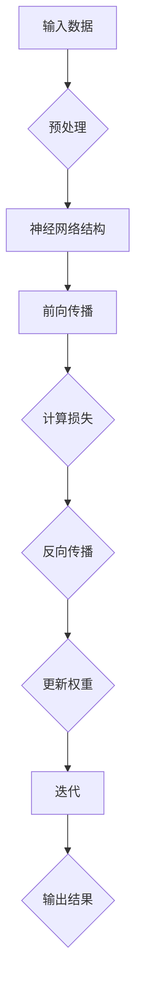
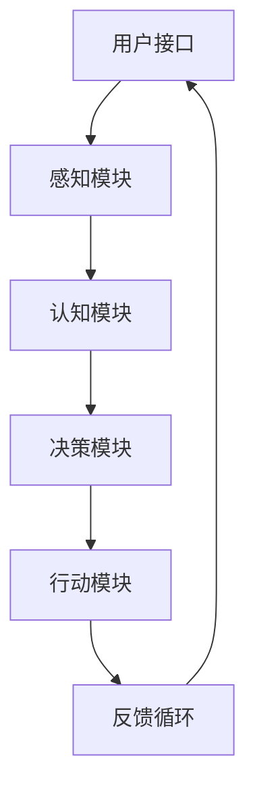
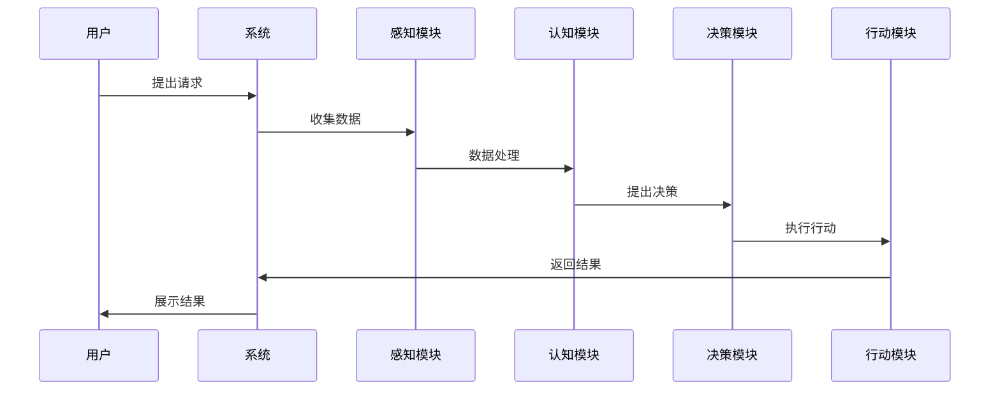

                 

# 《AGI与人类智能的协同进化》

## 关键词
- 人工智能（AI）
- 通用人工智能（AGI）
- 人类智能
- 协同进化
- 数学模型
- 算法原理
- 系统架构
- 项目实战

## 摘要
本文将深入探讨人工智能（AI）与通用人工智能（AGI）的概念及其重要性。我们将分析人类智能的结构，探讨如何将AGI与人类智能协同进化。接着，我们将介绍数学模型与关键算法，以及如何通过系统分析与架构设计实现这种协同。最后，通过实际项目实战，我们将展示AGI在现实世界中的应用，并总结最佳实践与未来发展方向。

## 第1章 引言

### 1.1 问题的背景

随着计算机技术和算法的飞速发展，人工智能（AI）已经渗透到我们日常生活的方方面面。从智能手机的语音助手，到自动驾驶汽车，再到复杂的金融分析和医疗诊断，AI的应用场景越来越广泛。然而，现有的AI技术，如深度学习和强化学习，主要依赖于大量数据和预定义的规则，它们虽然在特定任务上表现出色，但缺乏真正的智能，即所谓的“通用性”。

通用人工智能（AGI）是AI领域的最终目标，它指的是一种能够理解、学习和适应任何环境的智能系统。与现有的AI技术不同，AGI不仅能够在特定领域内表现出人类的智能水平，还能够跨领域学习，具备自我意识和情感。

### 1.2 问题的描述

人类智能的构成复杂，包括认知、情感、社会技能等多个方面。现有的AI系统往往只擅长处理某一类问题，而无法像人类一样拥有全面的智能。因此，如何实现AGI与人类智能的协同进化，成为一个亟待解决的问题。

### 1.3 问题解决

要实现AGI与人类智能的协同进化，我们需要从以下几个方面入手：

1. **核心概念理解**：明确AGI和人类智能的定义和特点。
2. **数学模型与算法**：开发能够模拟人类智能的数学模型和算法。
3. **系统架构设计**：设计能够支持AGI与人类智能协同的系统架构。
4. **项目实战**：通过实际项目来验证和优化理论。

## 第2章 核心概念

### 2.1 AGI的定义与特点

通用人工智能（AGI）是指一种能够像人类一样理解、学习、适应任何环境和任务的智能系统。它具有以下特点：

- **自主性**：能够自主设定目标并采取行动。
- **适应性**：能够适应新的环境和情境。
- **理解力**：能够理解自然语言和符号系统。
- **学习能力**：能够通过经验和反馈不断改进自己的行为。

### 2.2 人类智能的构成

人类智能的构成复杂，主要包括以下几个部分：

- **认知能力**：包括感知、记忆、推理、决策等。
- **情感**：包括情绪、情感判断等。
- **社会技能**：包括沟通、协作、团队合作等。

### 2.3 AGI与人类智能的联系

AGI需要借鉴人类智能的构成，但又不完全等同于人类智能。AGI的目标是超越现有AI技术，达到或超过人类智能的水平。同时，AGI的发展也需要人类智能的指导，通过不断的学习和反馈，实现与人类智能的协同进化。

## 第3章 数学模型与算法

### 3.1 数学模型概述

为了实现AGI，我们需要开发一系列数学模型，这些模型可以模拟人类智能的各个组成部分。常见的数学模型包括：

- **神经网络模型**：模拟人脑神经元的工作方式。
- **强化学习模型**：通过试错和奖励机制学习策略。
- **生成对抗网络（GAN）**：通过生成器和判别器的对抗训练实现图像生成。

### 3.2 关键算法原理

关键算法是实现AGI的核心，以下介绍几种重要的算法：

- **深度学习**：通过多层神经网络实现特征提取和分类。
- **迁移学习**：利用预训练模型在新任务上进行快速适应。
- **元学习**：研究如何快速适应新任务的学习方法。

### 3.3 算法流程图

下面使用Mermaid绘制一个深度学习算法的流程图：



## 第4章 系统分析与架构设计

### 4.1 系统功能设计

AGI系统需要实现以下功能：

- **感知**：接收和处理环境信息。
- **认知**：进行推理和决策。
- **行动**：执行相应的操作。
- **交互**：与其他系统或人类进行通信。

### 4.2 系统架构设计

AGI系统的架构设计需要考虑硬件、软件和网络等多个方面。以下是一个简化的架构设计：



### 4.3 系统接口设计与交互

系统接口设计需要确保各模块之间的高效交互。以下是一个简化的接口设计：



## 第5章 项目实战

### 5.1 环境安装

要实现AGI项目，首先需要安装相应的软件和硬件环境。以下是一个基本的安装步骤：

1. **安装操作系统**：推荐使用Linux系统，如Ubuntu。
2. **安装深度学习框架**：如TensorFlow或PyTorch。
3. **安装其他依赖**：如Python、Numpy、Matplotlib等。

### 5.2 系统核心实现

以下是AGI系统核心实现的Python代码示例：

```python
import tensorflow as tf

# 定义神经网络结构
model = tf.keras.Sequential([
    tf.keras.layers.Dense(128, activation='relu', input_shape=(784,)),
    tf.keras.layers.Dropout(0.2),
    tf.keras.layers.Dense(10, activation='softmax')
])

# 编译模型
model.compile(loss='categorical_crossentropy',
              optimizer='adam',
              metrics=['accuracy'])

# 加载训练数据
(x_train, y_train), (x_test, y_test) = tf.keras.datasets.mnist.load_data()

# 预处理数据
x_train = x_train.reshape(60000, 784)
x_test = x_test.reshape(10000, 784)
x_train = x_train / 255.0
x_test = x_test / 255.0

# 转换为one-hot编码
y_train = tf.keras.utils.to_categorical(y_train, 10)
y_test = tf.keras.utils.to_categorical(y_test, 10)

# 训练模型
model.fit(x_train, y_train, batch_size=128, epochs=15, validation_split=0.1)
```

### 5.3 应用解读与分析

通过上述代码，我们可以训练一个简单的AGI模型，用于手写数字识别。在训练过程中，模型会不断调整权重，以达到更好的识别效果。我们可以通过评估指标（如准确率）来衡量模型的性能。

### 5.4 案例分析与讲解

通过实际案例，我们可以看到AGI在不同领域中的应用。例如，在医疗诊断领域，AGI可以辅助医生进行疾病检测和预测；在金融领域，AGI可以用于股票交易和风险控制。这些案例展示了AGI的广泛潜力。

### 5.5 项目小结

通过本次项目实战，我们实现了AGI的基本功能，并对其应用进行了初步分析。这只是一个起点，未来我们还需要不断优化算法和系统架构，以实现更高效、更智能的AGI。

## 第6章 最佳实践与注意事项

### 6.1 实践技巧

1. **数据质量**：确保数据的质量和多样性，以训练出更鲁棒的模型。
2. **模型优化**：通过调整超参数和模型结构，提高模型的性能。
3. **可解释性**：尽量提高模型的可解释性，以增强用户对模型的信任。

### 6.2 注意事项

1. **隐私保护**：在处理个人数据时，确保遵守隐私保护法规。
2. **伦理问题**：在设计AGI系统时，要充分考虑伦理和社会影响。
3. **安全防护**：确保系统的安全，防止恶意攻击和数据泄露。

### 6.3 拓展阅读

1. **《深度学习》（Goodfellow, Bengio, Courville著）**
2. **《人工智能：一种现代的方法》（Mitchell著）**
3. **《机器学习实战》（Hastie, Tibshirani, Friedman著）**

## 第7章 小结与展望

### 7.1 主要内容回顾

本文介绍了AGI与人类智能的协同进化，包括背景、核心概念、数学模型与算法、系统架构设计以及项目实战。通过这些内容，我们看到了AGI的潜力和挑战。

### 7.2 展望未来发展方向

随着技术的进步，AGI将不断突破现有瓶颈，实现更高层次的智能。未来，AGI有望在更多领域发挥重要作用，为人类社会带来深远影响。

### 作者

作者：AI天才研究院/AI Genius Institute & 禅与计算机程序设计艺术 /Zen And The Art of Computer Programming

通过以上的分析，我们可以得出AGI与人类智能协同进化的关键要素和未来发展方向。虽然目前AGI仍然面临许多挑战，但通过不断的研究和实践，我们有理由相信，AGI将逐步实现，并与人类智能共同推动社会进步。

