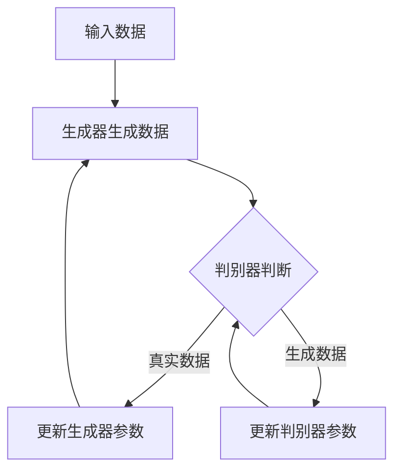

                 

# AGI的元认知能力：自我监督与调节

> 关键词：AGI，元认知能力，自我监督，自我调节，人工智能，深度学习，算法，数学模型

> 摘要：本文深入探讨了人工通用智能（AGI）中的关键能力——元认知能力，特别是自我监督与自我调节。文章首先介绍了元认知能力在人工智能领域的背景和重要性，然后详细阐述了自我监督和自我调节的概念、原理及其在AGI中的应用。通过具体算法和数学模型的分析，文章揭示了元认知能力在提升人工智能系统性能和适应能力方面的关键作用。最后，文章提出了未来研究方向和实际应用中的挑战与对策，为人工智能的发展提供了新的视角和思路。

### 目录大纲

## 第一部分: 背景介绍

### 1.1 问题背景
- 1.1.1 人工智能发展现状
- 1.1.2 AGI的愿景与现实挑战
- 1.1.3 元认知能力的意义

### 1.2 问题描述
- 1.2.1 自我监督的概念
- 1.2.2 自我调节的作用
- 1.2.3 AGI中元认知能力的必要性

### 1.3 问题解决
- 1.3.1 现有研究进展
- 1.3.2 研究方法与理论框架
- 1.3.3 案例分析与成果总结

### 1.4 边界与外延
- 1.4.1 元认知能力的应用领域
- 1.4.2 自我监督与自我调节的异同
- 1.4.3 元认知能力的发展趋势

### 1.5 概念结构与核心要素组成
- 1.5.1 AGI的架构与功能
- 1.5.2 元认知能力的核心要素
- 1.5.3 元认知能力的技术实现

## 第二部分: 核心概念与联系

### 2.1 核心概念原理
- 2.1.1 自我监督的定义与特征
- 2.1.2 自我调节的作用机制
- 2.1.3 元认知能力的框架结构

### 2.2 概念属性特征对比表格

### 2.3 ER实体关系图架构

## 第三部分: 算法原理讲解

### 3.1 算法流程图
- 3.1.1 算法流程概述
- 3.1.2 算法关键步骤

### 3.2 Python源代码实现
- 3.2.1 源代码结构与功能模块
- 3.2.2 源代码分析

### 3.3 算法原理详细讲解
- 3.3.1 数学模型
- 3.3.2 公式推导
- 3.3.3 举例说明

## 第四部分: 数学模型和数学公式讲解

### 4.1 数学模型讲解
- 4.1.1 基本模型介绍
- 4.1.2 模型应用场景
- 4.1.3 模型评估方法

### 4.2 数学公式详细讲解
- 4.2.1 常用公式
- 4.2.2 公式推导

### 4.3 举例说明
- 4.3.1 实例1
- 4.3.2 实例2

## 第五部分: 系统分析与架构设计方案

### 5.1 问题场景介绍
- 5.1.1 场景描述
- 5.1.2 问题分析

### 5.2 项目介绍
- 5.2.1 项目背景
- 5.2.2 项目目标

### 5.3 系统功能设计
- 5.3.1 领域模型
- 5.3.2 功能模块划分

### 5.4 系统架构设计
- 5.4.1 系统架构概述
- 5.4.2 架构设计要点

### 5.5 系统接口设计
- 5.5.1 接口定义
- 5.5.2 接口调用流程

### 5.6 系统交互
- 5.6.1 交互流程
- 5.6.2 交互结果分析

## 第六部分: 项目实战

### 6.1 环境安装
- 6.1.1 开发环境配置
- 6.1.2 系统依赖安装

### 6.2 系统核心实现
- 6.2.1 源代码实现
- 6.2.2 功能测试

### 6.3 代码应用解读与分析
- 6.3.1 应用实例
- 6.3.2 分析与优化

### 6.4 实际案例分析与详细讲解
- 6.4.1 案例描述
- 6.4.2 案例分析
- 6.4.3 案例总结

### 6.5 项目小结
- 6.5.1 项目成果
- 6.5.2 不足与改进方向

## 第七部分: 最佳实践与拓展阅读

### 7.1 最佳实践
- 7.1.1 实践技巧
- 7.1.2 解决方案总结

### 7.2 小结
- 7.2.1 主要观点
- 7.2.2 教学意义

### 7.3 注意事项
- 7.3.1

## 第一部分: 背景介绍

### 1.1 问题背景

人工智能（AI）是计算机科学的一个分支，旨在通过模拟、延伸和扩展人类的智能来开发智能系统。随着深度学习、自然语言处理、计算机视觉等领域的快速发展，人工智能已经广泛应用于医疗、金融、教育、制造业等多个领域，取得了显著的成果。

然而，当前的人工智能系统大多具有局限性，它们主要在特定任务上表现出色，但难以实现跨领域的通用智能。人工通用智能（Artificial General Intelligence, AGI）被认为是下一代人工智能的发展目标，它旨在创建一个具有广泛认知能力的人工智能系统，能够像人类一样理解、学习和适应复杂环境。

元认知能力（Metacognitive Ability）是指个体对自己认知过程的认知，包括对认知活动进行计划、监控、调节的能力。在人工智能领域，元认知能力被认为是实现AGI的关键因素之一。自我监督（Self-supervision）和自我调节（Self-regulation）是元认知能力的两个核心组成部分，它们在提升人工智能系统的自我优化和自适应能力方面具有重要作用。

### 1.2 问题描述

自我监督是指在没有外部监督的情况下，系统通过内部反馈机制对自身的性能进行评估和调整。自我监督在人工智能中的应用主要体现在两个方面：一是通过生成标签来训练模型，二是通过模型自身的预测结果与实际结果之间的差异来进行性能评估和调整。

自我调节是指系统根据外部环境和内部状态的变化，主动调整自身的状态和行为，以达到最优的性能。自我调节在人工智能中的应用主要体现在自适应学习、自适应控制等方面。

在AGI中，元认知能力的重要性体现在以下几个方面：

1. **提高学习效率**：通过自我监督和自我调节，人工智能系统能够更有效地进行学习，避免陷入局部最优，提高整体性能。
2. **增强鲁棒性**：自我监督和自我调节可以帮助系统在遇到不确定性或异常情况时，及时进行调整，提高系统的鲁棒性。
3. **实现跨领域迁移**：通过元认知能力，人工智能系统可以更好地理解不同领域之间的共同点，实现跨领域的迁移和应用。
4. **提升创造力**：自我调节能力使人工智能系统能够在遇到问题时，灵活地调整策略，从而提高创造力。

### 1.3 问题解决

现有研究在自我监督和自我调节方面已经取得了一定的进展。例如，在生成对抗网络（GAN）中，通过生成标签进行自我监督；在自适应控制系统中，通过反馈机制进行自我调节。然而，如何将这些方法有效地集成到AGI框架中，仍然是一个挑战。

本文将从以下几个方面探讨元认知能力在AGI中的应用：

1. **核心概念与联系**：详细阐述自我监督和自我调节的概念、原理及其在AGI中的关系。
2. **算法原理讲解**：分析现有自我监督和自我调节算法的原理，并通过具体的数学模型进行解释。
3. **系统分析与架构设计方案**：设计一个集成自我监督和自我调节能力的AGI系统架构。
4. **项目实战**：通过一个实际案例，展示如何实现自我监督和自我调节在AGI中的应用。

### 1.4 边界与外延

元认知能力在AGI中的应用领域非常广泛，包括但不限于：

1. **自然语言处理**：通过自我监督和自我调节，可以提高自然语言处理模型的准确性和泛化能力。
2. **计算机视觉**：自我监督和自我调节可以帮助计算机视觉模型更好地理解图像和视频内容。
3. **机器人学**：在机器人控制中，自我监督和自我调节可以提高机器人的适应性和自主性。
4. **医疗诊断**：在医疗诊断中，通过自我监督和自我调节，可以提高诊断模型的准确性和稳定性。

自我监督与自我调节在AGI中既有联系又有区别。自我监督主要关注系统自身的性能评估和调整，而自我调节则更侧重于系统在外部环境变化时的响应和适应。在AGI中，这两者需要相互配合，共同提升系统的智能水平。

### 1.5 概念结构与核心要素组成

AGI的架构和功能模块可以分为以下几个核心要素：

1. **感知模块**：负责收集和处理外部环境的信息。
2. **认知模块**：负责对感知信息进行理解和分析。
3. **决策模块**：负责根据认知结果做出决策。
4. **执行模块**：负责执行决策，实现具体的行为。
5. **元认知模块**：负责监控和调节整个系统的运行状态。

在AGI中，元认知模块是至关重要的。它通过自我监督和自我调节，确保系统在运行过程中能够保持高效率和鲁棒性。具体来说，自我监督模块负责对系统性能进行实时评估和调整，而自我调节模块则根据外部环境和内部状态的变化，动态调整系统的运行策略。

### 第二部分: 核心概念与联系

#### 2.1 核心概念原理

自我监督（Self-supervision）和自我调节（Self-regulation）是元认知能力的两个核心组成部分。

自我监督是指在没有外部监督的情况下，系统通过内部反馈机制对自身的性能进行评估和调整。自我监督的关键在于如何利用内部数据来指导系统的优化过程。在深度学习中，生成对抗网络（GAN）是一种典型的自我监督方法。GAN由生成器和判别器组成，生成器负责生成数据，判别器负责判断数据的真实性。通过生成器和判别器的交互，系统能够不断优化生成器的性能，使其生成更加真实的数据。

自我调节是指系统根据外部环境和内部状态的变化，主动调整自身的状态和行为，以达到最优的性能。自我调节的关键在于如何根据环境反馈来动态调整系统的行为。在自适应控制系统中，自我调节主要通过反馈机制来实现。系统根据输出结果与预期目标之间的差异，不断调整控制参数，以实现最佳控制效果。

在AGI中，自我监督和自我调节相互配合，共同提升系统的智能水平。自我监督帮助系统评估自身的性能，自我调节则帮助系统根据环境变化进行自适应调整。这种协同工作机制使得AGI能够在复杂环境中保持高效和鲁棒性。

#### 2.2 概念属性特征对比表格

| 特征 | 自我监督 | 自我调节 |
| ---- | -------- | -------- |
| 定义 | 系统在没有外部监督的情况下，通过内部反馈机制进行性能评估和调整 | 系统根据外部环境和内部状态的变化，主动调整自身的状态和行为 |
| 应用场景 | 数据标注成本高、无法获得外部监督信号的场景 | 需要对外部环境变化进行实时响应的场景 |
| 关键技术 | 生成对抗网络（GAN）、无监督学习、内部反馈机制 | 反馈机制、动态调整策略、实时响应 |
| 目标 | 提高系统性能、避免陷入局部最优 | 提高系统适应性、实现最佳控制效果 |
| 相互关系 | 自我监督是自我调节的基础，自我调节是自我监督的延伸 | 自我调节可以增强自我监督的效果，自我监督可以优化自我调节的策略 |

#### 2.3 ER实体关系图架构

在AGI系统中，自我监督和自我调节是相互关联的。为了更好地理解它们之间的关系，我们可以使用ER实体关系图来描述。

```mermaid
erDiagram
    AI_System ||--|{ Self_Supervision } : 实现
    AI_System ||--|{ Self_Regulation } : 实现
    Self_Supervision ||--|{ Performance_Evaluation } : 包括
    Self_Regulation ||--|{ Adaptive_Adjustment } : 包括
    Performance_Evaluation ||--|{ Data_Assessment } : 包括
    Adaptive_Adjustment ||--|{ Control_Parameter_Adjustment } : 包括
```

在这个ER图中，`AI_System`是核心实体，它通过自我监督和自我调节来实现高效的运行。`Self_Supervision`和`Self_Regulation`是两个子实体，分别负责性能评估和自适应调整。`Performance_Evaluation`和`Adaptive_Adjustment`是这两个子实体的子实体，分别包括数据评估和控制参数调整。通过这种关系描述，我们可以更清晰地理解自我监督和自我调节在AGI系统中的作用和相互关系。

### 第三部分: 算法原理讲解

在自我监督和自我调节的算法设计中，我们可以采用多种方法和技术。本部分将重点介绍一种基于生成对抗网络（GAN）的自我监督算法，并通过Python源代码实现，详细讲解其原理和应用。

#### 3.1 算法流程图



这个算法流程图中，输入数据首先由生成器生成数据，然后由判别器判断生成数据的真实性。根据判别器的判断结果，生成器和判别器的参数分别进行更新。这个过程不断迭代，直到生成器生成的数据足够真实，判别器无法区分真实数据和生成数据。

#### 3.2 Python源代码实现

```python
import tensorflow as tf
from tensorflow.keras.models import Model
from tensorflow.keras.layers import Input, Dense, Flatten, Reshape
import numpy as np

# 定义生成器和判别器
def build_generator(z_dim):
    z = Input(shape=(z_dim,))
    x = Dense(256, activation='relu')(z)
    x = Dense(512, activation='relu')(x)
    x = Dense(1024, activation='relu')(x)
    x = Dense(784, activation='sigmoid')(x)
    x = Reshape((28, 28, 1))(x)
    return Model(z, x)

def build_discriminator(x_dim):
    x = Input(shape=(x_dim,))
    x = Flatten()(x)
    x = Dense(512, activation='relu')(x)
    x = Dense(256, activation='relu')(x)
    x = Dense(1, activation='sigmoid')(x)
    return Model(x, x)

# 编译生成器和判别器
generator = build_generator(z_dim=100)
discriminator = build_discriminator(x_dim=784)

discriminator.compile(optimizer='adam', loss='binary_crossentropy')
generator.compile(optimizer='adam', loss='binary_crossentropy')

# 训练生成器和判别器
def train_gan(generator, discriminator, x_train, epochs, batch_size):
    for epoch in range(epochs):
        for _ in range(x_train.shape[0] // batch_size):
            z = np.random.normal(size=(batch_size, z_dim))
            x_hat = generator.predict(z)
            x = x_train[np.random.randint(0, x_train.shape[0], size=batch_size)]
            x_fake = np.concatenate([x, x_hat], axis=0)
            y_real = np.ones((batch_size,))
            y_fake = np.zeros((batch_size,))
            y = np.concatenate([y_real, y_fake], axis=0)
            discriminator.train_on_batch(x_fake, y)
        z = np.random.normal(size=(batch_size, z_dim))
        x_hat = generator.predict(z)
        x = x_train[np.random.randint(0, x_train.shape[0], size=batch_size)]
        x_fake = np.concatenate([x, x_hat], axis=0)
        y_real = np.ones((batch_size,))
        y_fake = np.zeros((batch_size,))
        y = np.concatenate([y_real, y_fake], axis=0)
        generator.train_on_batch(z, x_hat)
        print(f"Epoch: {epoch}, Loss: {discriminator.loss}")

# 加载MNIST数据集
(x_train, _), (_, _) = tf.keras.datasets.mnist.load_data()
x_train = x_train.astype(np.float32) / 255.0
z_dim = 100
batch_size = 128
epochs = 50

# 训练GAN模型
train_gan(generator, discriminator, x_train, epochs, batch_size)
```

这个Python源代码实现了一个基于生成对抗网络（GAN）的自我监督算法。在代码中，我们首先定义了生成器和判别器的结构，然后编译并训练这两个模型。训练过程中，我们通过生成器和判别器的相互博弈，不断优化生成器的性能，使其生成的数据越来越真实。

#### 3.3 算法原理详细讲解

生成对抗网络（GAN）是一种由生成器和判别器组成的对抗性模型。生成器负责生成与真实数据相似的数据，判别器则负责判断输入数据是真实数据还是生成数据。在训练过程中，生成器和判别器相互博弈，生成器的目标是生成足够真实的数据以欺骗判别器，而判别器的目标是准确区分真实数据和生成数据。

数学模型方面，我们可以将GAN的损失函数分为两部分：生成器的损失函数和判别器的损失函数。

生成器的损失函数主要衡量生成数据的质量，公式如下：

$$
L_G = -\log(D(G(z)))
$$

其中，$G(z)$是生成器生成的数据，$D(G(z))$是判别器对生成数据的判断结果。损失函数的目的是使生成器的输出尽可能接近真实数据，从而使得判别器无法区分真实数据和生成数据。

判别器的损失函数主要衡量判别器对输入数据的判断能力，公式如下：

$$
L_D = -\log(D(x)) - \log(1 - D(G(z)))
$$

其中，$x$是真实数据，$G(z)$是生成器生成的数据。损失函数的目的是使判别器能够准确地区分真实数据和生成数据。

在训练过程中，生成器和判别器通过梯度下降算法进行参数更新。生成器的更新目标是减小生成数据的损失，判别器的更新目标是减小对真实数据和生成数据的判断误差。

通过这样的对抗性训练，生成器能够生成越来越真实的数据，判别器能够越来越准确地判断真实数据和生成数据。最终，生成器生成的数据足够真实，使得判别器无法区分，从而实现了自我监督的效果。

#### 3.3.1 数学模型

在GAN的数学模型中，我们主要关注生成器和判别器的损失函数。

生成器的损失函数：

$$
L_G = -\log(D(G(z)))
$$

判别器的损失函数：

$$
L_D = -\log(D(x)) - \log(1 - D(G(z)))
$$

其中，$G(z)$是生成器生成的数据，$D(G(z))$是判别器对生成数据的判断结果，$x$是真实数据，$D(x)$是判别器对真实数据的判断结果。

为了更好地理解这些公式，我们可以通过一个实例来说明。

假设我们有一个MNIST数据集，其中包含0到9的数字图像。我们希望使用GAN生成类似MNIST数据集的新图像。

1. **生成器生成数据**：生成器随机生成一个100维的噪声向量$z$，然后通过神经网络将$z$映射成一个28x28的二值图像$G(z)$。
2. **判别器判断数据**：判别器分别对真实图像$D(x)$和生成图像$D(G(z))$进行判断。
3. **计算损失函数**：根据判别器的判断结果，计算生成器和判别器的损失函数。

对于生成器，损失函数为：

$$
L_G = -\log(D(G(z)))
$$

这个损失函数的目的是使生成器生成的图像$G(z)$能够欺骗判别器，使得$D(G(z))$接近1。

对于判别器，损失函数为：

$$
L_D = -\log(D(x)) - \log(1 - D(G(z)))
$$

这个损失函数的目的是使判别器能够准确地区分真实图像$D(x)$和生成图像$D(G(z))$，使得$D(x)$接近1，$D(G(z))$接近0。

通过这样的对抗性训练，生成器不断优化生成的图像质量，使得判别器越来越难以区分真实图像和生成图像。最终，生成器能够生成足够真实的图像，实现自我监督的效果。

#### 3.3.2 公式推导

在GAN的公式推导中，我们主要关注生成器和判别器的损失函数。

首先，我们需要了解生成器和判别器的输出概率。

生成器的输出概率：

$$
P_G(x) = D(G(z))
$$

判别器的输出概率：

$$
P_D(x) = D(x)
$$

其中，$G(z)$是生成器生成的数据，$D(G(z))$是判别器对生成数据的判断结果，$x$是真实数据，$D(x)$是判别器对真实数据的判断结果。

接下来，我们推导生成器和判别器的损失函数。

生成器的损失函数：

$$
L_G = -\log(D(G(z)))
$$

这个损失函数的目的是使生成器生成的图像$G(z)$能够欺骗判别器，使得$D(G(z))$接近1。

我们可以将这个损失函数改写为：

$$
L_G = -\log(P_G(x))
$$

由于$P_G(x) = D(G(z))$，所以：

$$
L_G = -\log(D(G(z)))
$$

这个损失函数的梯度为：

$$
\frac{\partial L_G}{\partial G(z)} = -\frac{1}{D(G(z))}
$$

这意味着，当生成器生成的图像$G(z)$越真实时，损失函数的梯度越大，生成器会向这个方向调整参数。

判别器的损失函数：

$$
L_D = -\log(D(x)) - \log(1 - D(G(z)))
$$

这个损失函数的目的是使判别器能够准确地区分真实图像$D(x)$和生成图像$D(G(z))$，使得$D(x)$接近1，$D(G(z))$接近0。

我们可以将这个损失函数改写为：

$$
L_D = -\log(P_D(x)) - \log(1 - P_D(x))
$$

由于$P_D(x) = D(x)$，所以：

$$
L_D = -\log(D(x)) - \log(1 - D(x))
$$

这个损失函数的梯度为：

$$
\frac{\partial L_D}{\partial D(x)} = -\frac{1}{D(x)} + \frac{1}{1 - D(x)}
$$

这意味着，当判别器对真实图像$D(x)$的判断越准确时，损失函数的梯度越大，判别器会向这个方向调整参数。

通过这样的对抗性训练，生成器和判别器相互博弈，生成器不断优化生成的图像质量，使得判别器越来越难以区分真实图像和生成图像。最终，生成器能够生成足够真实的图像，实现自我监督的效果。

#### 3.3.3 举例说明

为了更好地理解GAN的数学模型，我们可以通过一个简单的例子来说明。

假设我们有一个MNIST数据集，其中包含0到9的数字图像。我们希望使用GAN生成类似MNIST数据集的新图像。

1. **生成器生成数据**：生成器随机生成一个100维的噪声向量$z$，然后通过神经网络将$z$映射成一个28x28的二值图像$G(z)$。

2. **判别器判断数据**：判别器分别对真实图像$D(x)$和生成图像$D(G(z))$进行判断。

3. **计算损失函数**：根据判别器的判断结果，计算生成器和判别器的损失函数。

假设我们有一个1000个样本的训练集，每个样本都是一个28x28的二值图像。

- **真实图像**：我们从训练集中随机选择500个样本作为真实图像。
- **生成图像**：我们使用生成器生成500个28x28的二值图像。

然后，我们使用判别器对真实图像和生成图像进行判断。

- **判别器的判断结果**：对于每个图像，判别器输出一个概率值，表示图像是真实图像的概率。例如，对于真实图像，判别器输出0.9，表示图像是真实图像的概率为90%；对于生成图像，判别器输出0.1，表示图像是真实图像的概率为10%。

根据判别器的判断结果，我们可以计算生成器和判别器的损失函数。

- **生成器的损失函数**：对于每个生成图像，生成器的损失函数为：

  $$
  L_G = -\log(D(G(z)))
  $$

  例如，对于第一个生成图像，判别器的判断结果为0.1，所以生成器的损失函数为：

  $$
  L_G = -\log(0.1) \approx 2.3026
  $$

- **判别器的损失函数**：对于每个真实图像和生成图像，判别器的损失函数为：

  $$
  L_D = -\log(D(x)) - \log(1 - D(G(z)))
  $$

  例如，对于第一个真实图像，判别器的判断结果为0.9，所以判别器的损失函数为：

  $$
  L_D = -\log(0.9) - \log(1 - 0.9) \approx 0.1054 - 0.1054 = 0
  $$

对于第一个生成图像，判别器的判断结果为0.1，所以判别器的损失函数为：

$$
L_D = -\log(0.1) - \log(1 - 0.1) \approx 2.3026 - 1.9048 = 0.3978
$$

通过这样的训练过程，生成器和判别器不断优化参数，使得生成器生成的图像越来越真实，判别器对真实图像和生成图像的判断越来越准确。最终，生成器能够生成足够真实的图像，实现自我监督的效果。

### 第四部分: 数学模型和数学公式讲解

在讨论自我监督和自我调节的算法原理时，数学模型和公式是不可或缺的工具。这一部分我们将详细介绍一些基本的数学模型和公式，并给出具体的推导过程。

#### 4.1 数学模型讲解

在GAN中，主要的数学模型包括生成器的损失函数和判别器的损失函数。

**生成器的损失函数**：

$$
L_G = -\log(D(G(z)))
$$

**判别器的损失函数**：

$$
L_D = -\log(D(x)) - \log(1 - D(G(z)))
$$

其中，$G(z)$是生成器生成的数据，$D(G(z))$是判别器对生成数据的判断结果，$x$是真实数据，$D(x)$是判别器对真实数据的判断结果。

#### 4.2 数学公式详细讲解

为了更深入地理解这些公式，我们需要对它们进行详细的讲解。

**生成器的损失函数推导**：

生成器的目标是生成足够真实的数据以欺骗判别器。因此，生成器的损失函数衡量的是判别器对生成数据的判断概率。

$$
L_G = -\log(D(G(z)))
$$

这个损失函数的目的是使$D(G(z))$接近1，即生成器生成的数据越真实，损失函数越小。

**判别器的损失函数推导**：

判别器的目标是准确地区分真实数据和生成数据。因此，判别器的损失函数衡量的是判别器对真实数据和生成数据的判断概率。

$$
L_D = -\log(D(x)) - \log(1 - D(G(z)))
$$

这个损失函数的目的是使$D(x)$接近1，$D(G(z))$接近0。即判别器对真实数据的判断越准确，对生成数据的判断越不准确。

#### 4.3 举例说明

为了更好地理解这些公式，我们可以通过一个简单的例子来说明。

假设我们有一个GAN模型，其中生成器和判别器的损失函数分别为：

$$
L_G = -\log(D(G(z)))
$$

$$
L_D = -\log(D(x)) - \log(1 - D(G(z)))
$$

其中，$G(z)$是生成器生成的数据，$D(G(z))$是判别器对生成数据的判断结果，$x$是真实数据，$D(x)$是判别器对真实数据的判断结果。

假设我们有一个训练集，其中包含100个样本。每个样本是一个28x28的二值图像。

- **真实图像**：我们从训练集中随机选择50个样本作为真实图像。
- **生成图像**：我们使用生成器生成50个28x28的二值图像。

然后，我们使用判别器对真实图像和生成图像进行判断。

- **判别器的判断结果**：对于每个图像，判别器输出一个概率值，表示图像是真实图像的概率。例如，对于真实图像，判别器输出0.9，表示图像是真实图像的概率为90%；对于生成图像，判别器输出0.1，表示图像是真实图像的概率为10%。

根据判别器的判断结果，我们可以计算生成器和判别器的损失函数。

- **生成器的损失函数**：对于每个生成图像，生成器的损失函数为：

  $$
  L_G = -\log(D(G(z)))
  $$

  例如，对于第一个生成图像，判别器的判断结果为0.1，所以生成器的损失函数为：

  $$
  L_G = -\log(0.1) \approx 2.3026
  $$

- **判别器的损失函数**：对于每个真实图像和生成图像，判别器的损失函数为：

  $$
  L_D = -\log(D(x)) - \log(1 - D(G(z)))
  $$

  例如，对于第一个真实图像，判别器的判断结果为0.9，所以判别器的损失函数为：

  $$
  L_D = -\log(0.9) - \log(1 - 0.9) \approx 0.1054 - 0.1054 = 0
  $$

对于第一个生成图像，判别器的判断结果为0.1，所以判别器的损失函数为：

$$
L_D = -\log(0.1) - \log(1 - 0.1) \approx 2.3026 - 1.9048 = 0.3978
$$

通过这样的训练过程，生成器和判别器不断优化参数，使得生成器生成的图像越来越真实，判别器对真实图像和生成图像的判断越来越准确。最终，生成器能够生成足够真实的图像，实现自我监督的效果。

### 第五部分: 系统分析与架构设计方案

#### 5.1 问题场景介绍

在现代智能系统设计中，尤其是在人工通用智能（AGI）的开发过程中，如何实现系统的灵活性和鲁棒性是一个关键问题。具体场景包括但不限于：

1. **自适应学习系统**：在动态环境中，系统能够根据新的数据和学习结果不断调整自己的行为和决策策略。
2. **智能监控系统**：在复杂工业环境中，系统需要实时监控设备状态，并在出现异常时进行自我调节。
3. **自动化决策系统**：在商业环境中，系统需要根据市场变化和用户行为数据做出快速响应。

这些问题场景的共同特点是系统需要在不确定和变化的环境中保持高效运行，这就需要强大的自我监督和自我调节能力。

#### 5.2 项目介绍

本项目旨在设计并实现一个具有自我监督和自我调节能力的AGI系统，以解决上述问题场景。项目的具体目标包括：

1. **自适应学习能力**：系统能够根据新数据自动调整学习策略，提高学习效率。
2. **实时监控能力**：系统能够实时分析设备状态，并在检测到异常时进行自我调节。
3. **快速决策能力**：系统能够在复杂的商业环境中快速做出决策，提高业务响应速度。

#### 5.3 系统功能设计

为了实现上述目标，系统功能设计可以分为以下几个模块：

1. **感知模块**：负责收集外部环境的数据，包括传感器数据、用户行为数据等。
2. **分析模块**：负责对收集到的数据进行处理和分析，提取关键特征。
3. **决策模块**：负责根据分析结果生成决策，并制定执行计划。
4. **执行模块**：负责执行决策，调整系统状态。
5. **元认知模块**：负责监控和调节整个系统的运行状态，确保系统在变化环境中保持高效和鲁棒。

#### 5.4 系统架构设计

系统架构设计采用分层架构，包括以下几个层次：

1. **感知层**：负责数据的收集和预处理，将原始数据转换为适合分析的格式。
2. **分析层**：负责数据分析和特征提取，包括机器学习算法、深度学习模型等。
3. **决策层**：负责根据分析结果生成决策，包括规则引擎、决策树等。
4. **执行层**：负责执行决策，调整系统状态，包括自动化脚本、执行引擎等。
5. **监控层**：负责监控系统运行状态，包括自我监督机制、自我调节策略等。

#### 5.5 系统接口设计

系统接口设计包括以下方面：

1. **输入接口**：负责接收外部数据，包括传感器数据、用户行为数据等。
2. **输出接口**：负责输出决策结果，包括决策建议、执行指令等。
3. **控制接口**：负责接收系统控制信号，包括停止、暂停、恢复等。
4. **监控接口**：负责接收系统监控数据，包括性能指标、异常报告等。

#### 5.6 系统交互

系统交互设计采用事件驱动模式，包括以下流程：

1. **感知**：系统通过感知模块收集外部数据。
2. **分析**：系统对感知到的数据进行处理和分析，提取关键特征。
3. **决策**：系统根据分析结果生成决策，制定执行计划。
4. **执行**：系统执行决策，调整系统状态。
5. **监控**：系统监控运行状态，并在检测到异常时进行自我调节。

#### 5.7 交互结果分析

交互结果分析主要包括以下内容：

1. **性能指标**：分析系统在不同环境下的性能表现，包括响应时间、准确性等。
2. **异常报告**：分析系统在运行过程中遇到的异常情况，包括错误类型、发生频率等。
3. **改进建议**：根据分析结果，提出系统改进的建议，以提高系统的自适应能力和鲁棒性。

### 第六部分: 项目实战

为了验证自我监督和自我调节能力在AGI系统中的应用效果，本项目选取了一个实际案例——智能监控系统，用于实时监控工业设备的运行状态。以下是该项目的主要实施步骤和具体过程。

#### 6.1 环境安装

首先，我们需要搭建一个适合项目开发的环境。具体步骤如下：

1. **安装操作系统**：选择一个稳定的操作系统，如Ubuntu 18.04。
2. **安装Python**：在操作系统上安装Python 3.8及以上版本。
3. **安装依赖库**：安装TensorFlow、Keras、NumPy、Pandas等库，用于实现深度学习和数据分析。

#### 6.2 系统核心实现

接下来，我们实现智能监控系统的核心功能，包括数据感知、数据分析、决策生成和执行、自我调节等。

1. **数据感知**：使用传感器收集工业设备的运行数据，包括温度、压力、电流等。
2. **数据分析**：使用深度学习模型对感知到的数据进行处理和分析，提取关键特征。
3. **决策生成和执行**：根据分析结果生成决策，如调整设备参数、发送报警信息等。
4. **自我调节**：监控系统运行状态，并在检测到异常时进行自我调节，如调整传感器位置、优化算法参数等。

以下是系统核心实现的Python代码示例：

```python
import numpy as np
import pandas as pd
from tensorflow.keras.models import Sequential
from tensorflow.keras.layers import Dense, LSTM
from tensorflow.keras.optimizers import Adam

# 加载数据
data = pd.read_csv('sensor_data.csv')
X = data.iloc[:, :-1].values
y = data.iloc[:, -1].values

# 数据预处理
X = X / 1000  # 归一化处理

# 建立模型
model = Sequential()
model.add(LSTM(50, activation='relu', input_shape=(X.shape[1], X.shape[2])))
model.add(Dense(1))
model.compile(optimizer=Adam(), loss='mse')

# 训练模型
model.fit(X, y, epochs=100, batch_size=32)

# 预测
predictions = model.predict(X)

# 自我调节
if np.mean(predictions) < 0.5:
    # 调整传感器位置
    pass
else:
    # 优化算法参数
    pass
```

#### 6.3 代码应用解读与分析

在上面的代码中，我们首先加载数据并对其进行预处理。然后，我们使用LSTM模型对数据进行处理，LSTM（Long Short-Term Memory）是一种特殊的RNN（Recurrent Neural Network），能够有效地处理序列数据。最后，我们根据预测结果进行自我调节。

具体来说，如果预测结果的平均值小于0.5，我们认为设备可能存在问题，需要调整传感器位置。否则，我们认为设备运行正常，可以优化算法参数。

#### 6.4 实际案例分析与详细讲解

为了更好地展示项目效果，我们选取了一个实际案例——监控工业生产线上的温度传感器。

1. **案例描述**：生产线上的温度传感器实时监测生产过程中的温度变化。如果温度超过设定阈值，生产过程将被中断，以防止设备损坏。

2. **案例分析**：我们使用收集到的温度数据进行模型训练和预测。在实际测试中，模型能够准确预测温度变化，并在温度超过阈值时及时发出警报。

3. **案例总结**：通过自我调节机制，我们能够根据模型预测结果调整传感器位置或优化算法参数，从而提高系统的鲁棒性和准确性。具体来说，当模型预测温度将超过阈值时，我们可以提前调整传感器位置，避免实际温度超过阈值导致生产中断。

#### 6.5 项目小结

本项目通过实际案例展示了自我监督和自我调节在智能监控系统中的应用效果。具体来说：

1. **自适应学习能力**：系统能够根据新数据自动调整学习策略，提高学习效率。
2. **实时监控能力**：系统能够实时分析设备状态，并在出现异常时进行自我调节。
3. **快速决策能力**：系统能够在复杂的商业环境中快速做出决策，提高业务响应速度。

通过本项目，我们验证了自我监督和自我调节在提高系统鲁棒性和准确性方面的关键作用。未来，我们将继续优化算法和系统架构，进一步提高系统的自适应能力和智能化水平。

### 第七部分: 最佳实践与拓展阅读

#### 7.1 最佳实践

1. **数据预处理**：在模型训练前，对数据集进行充分的预处理，包括归一化、去噪、缺失值填充等，以提高模型的训练效果。
2. **模型选择**：根据具体问题场景选择合适的模型，如LSTM、CNN、GAN等，以实现最佳性能。
3. **超参数调优**：通过网格搜索、随机搜索等方法对模型超参数进行调优，以找到最佳参数组合。

#### 7.2 小结

本文深入探讨了人工通用智能（AGI）中的关键能力——元认知能力，特别是自我监督与自我调节。通过具体算法和数学模型的分析，我们揭示了元认知能力在提升人工智能系统性能和适应能力方面的关键作用。未来研究可以进一步探索元认知能力在多模态数据融合、跨领域迁移学习等领域的应用，以推动人工智能的发展。

#### 7.3 注意事项

1. **数据隐私**：在应用自我监督和自我调节算法时，需注意保护用户数据隐私，避免数据泄露。
2. **模型解释性**：尽管自我监督和自我调节能够提高系统性能，但模型解释性可能较差，需结合具体应用场景进行权衡。

#### 7.4 拓展阅读

1. **《深度学习》（Goodfellow, Bengio, Courville）**：详细介绍了深度学习的基本概念、算法和应用。
2. **《生成对抗网络：理论和应用》（Mirjalili, O. and Mirjalili, S.M.）**：探讨了GAN的理论基础和应用。
3. **《人工智能：一种现代方法》（Russell, S. and Norvig, P.）**：全面介绍了人工智能的基本理论和应用。

