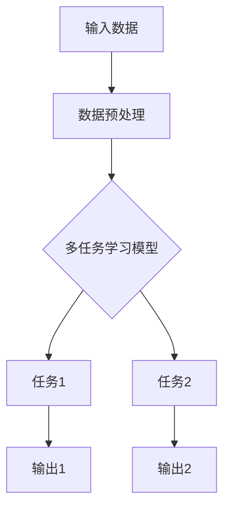
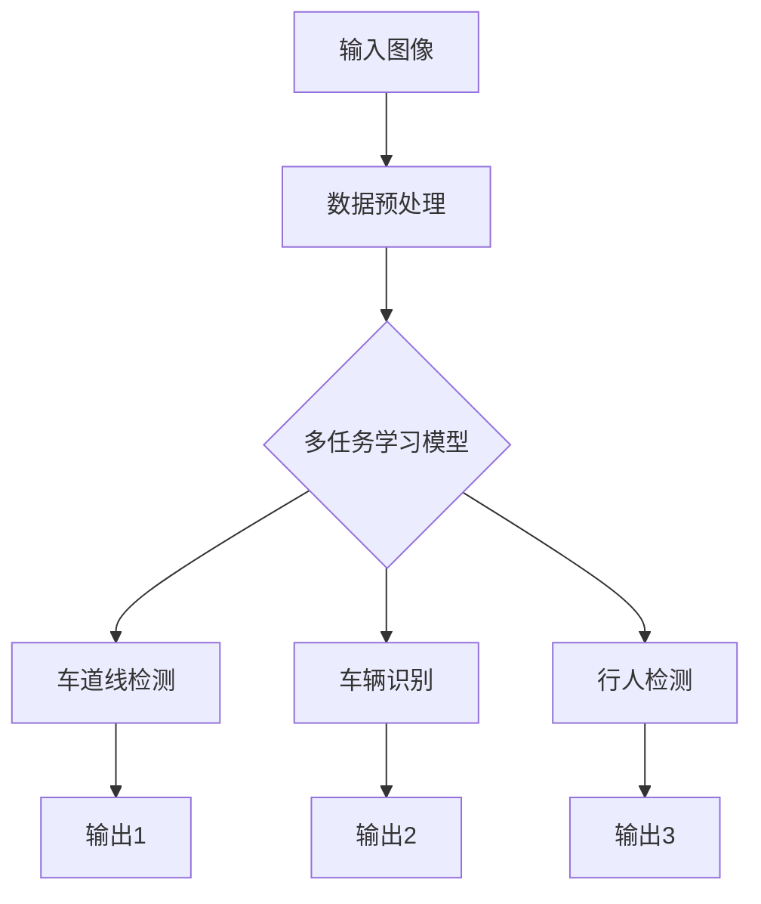
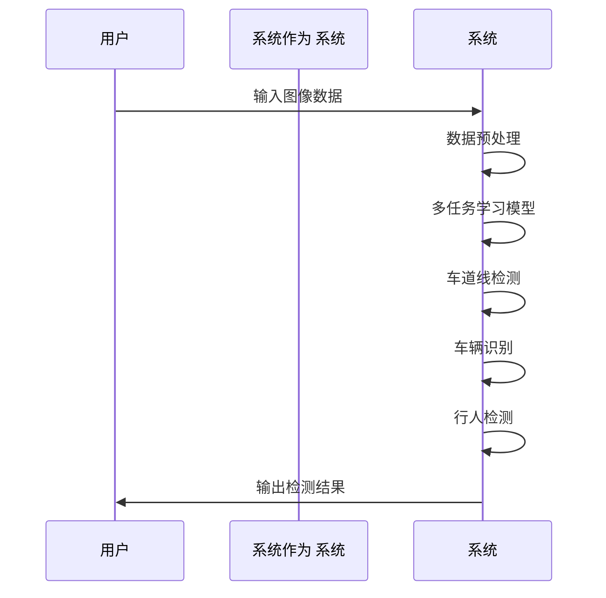

                 

# AGI的多任务学习与迁移能力

> 关键词：人工通用智能（AGI）、多任务学习、迁移能力、算法、系统架构、项目实战

> 摘要：本文深入探讨了人工通用智能（AGI）中的多任务学习和迁移能力。首先，介绍了AGI的背景和重要性，随后详细阐述了多任务学习和迁移能力的定义、原理及其在AGI中的应用。接着，通过具体的算法原理讲解、系统分析与架构设计方案以及项目实战，展示了如何将多任务学习和迁移能力应用于实际项目中。最后，总结了最佳实践、注意事项和拓展阅读，为读者提供了进一步研究的方向。

## 背景介绍

### 1.1.1 人工通用智能（AGI）的定义与发展历程

人工通用智能（Artificial General Intelligence，AGI）是指具有人类智能水平，能够自主学习和适应多种环境的人工智能系统。它超越了目前常见的人工智能（AI），如专家系统、机器学习和深度学习，能够处理多种认知任务，并具备类似人类的推理、感知、学习和解决问题的能力。

AGI的发展历程可以追溯到20世纪50年代，当时计算机科学家约翰·冯·诺伊曼（John von Neumann）提出了构建能够模拟人类思维的机器的设想。此后，随着计算机技术的发展，研究者们不断探索如何使机器具有更高级的智能。20世纪80年代，机器学习领域开始兴起，推动了AI技术的发展。然而，尽管AI技术在某些特定任务上取得了巨大成功，但实现AGI仍然是一个长期而艰巨的目标。

### 1.1.2 多任务学习和迁移能力的定义与重要性

多任务学习（Multi-Task Learning，MTL）是指在一个模型中同时学习多个相关任务的能力。这种能力在AGI中至关重要，因为它能够使机器在不同任务之间共享知识和经验，从而提高学习效率和适应性。

迁移学习（Transfer Learning，TL）是指将一个任务学习到的知识应用于解决另一个相关任务的过程。迁移学习在AGI中的应用同样重要，因为它能够利用已有任务的知识，减少对新任务的学习时间，提高整体系统的适应能力。

### 1.2 问题描述

AGI在多任务学习和迁移能力方面面临着一系列挑战：

- **设计能够有效学习多个任务的模型结构**：如何设计模型，使其能够同时处理多个任务，并保持良好的性能？
- **实现任务间的知识共享和迁移**：如何在不同任务之间共享知识和经验，同时避免知识冲突和干扰？
- **处理不同任务之间的冲突和干扰**：如何处理不同任务之间的竞争关系，确保每个任务都能得到充分的学习和优化？
- **评估多任务学习和迁移能力的性能**：如何评估AGI在多任务学习和迁移能力方面的表现，确保其能够满足实际应用的需求？

### 1.3 问题解决

多任务学习和迁移能力在AGI中的重要性体现在以下几个方面：

- **提高学习效率和适应性**：通过多任务学习和迁移，AGI可以在不同任务之间共享知识和经验，从而减少对新任务的学习时间，提高系统的适应性。
- **增强泛化能力**：多任务学习能够使AGI在不同任务上学习到更广泛的知识，从而提高其泛化能力，使其能够更好地适应新的环境和任务。
- **优化资源利用**：通过共享知识和经验，AGI可以更好地利用有限的计算资源和数据，提高学习效率。

### 1.4 边界与外延

多任务学习和迁移能力在AGI中的应用场景非常广泛，包括自然语言处理、计算机视觉、语音识别、自动驾驶等领域。然而，实现多任务学习和迁移能力也存在一些挑战，如数据不一致、任务冲突、计算资源限制等。因此，在设计AGI系统时，需要充分考虑这些因素，并采取相应的优化策略。

### 1.5 概念结构与核心要素组成

多任务学习和迁移能力的核心概念和关键要素包括：

- **多任务学习模型**：设计能够同时处理多个任务的模型结构，如共享网络、任务嵌入等。
- **迁移学习机制**：实现任务间的知识共享和迁移，如特征重用、模型蒸馏等。
- **性能评估指标**：评估多任务学习和迁移能力的性能，如准确率、效率等。
- **优化策略**：优化模型结构和迁移学习机制，提高学习效率和泛化能力。

## 核心概念与联系

### 2.1 多任务学习原理

多任务学习是指在一个模型中同时学习多个相关任务的能力。其基本原理是通过共享网络结构或共享参数来降低每个任务的复杂性，从而提高学习效率。

**多任务学习模型**：

- **共享网络**：多个任务共享相同的网络结构，通过不同的任务特定层来区分不同任务的特征。
- **任务嵌入**：每个任务都有自己的网络结构，但共享某些底层特征。

**多任务学习算法**：

- **基于共享网络的算法**：如深度神经网络（DNN）、卷积神经网络（CNN）等。
- **基于任务嵌入的算法**：如决策树（DT）、支持向量机（SVM）等。

### 2.2 迁移能力原理

迁移学习是指将一个任务学习到的知识应用于解决另一个相关任务的过程。其基本原理是通过共享特征表示或知识蒸馏来将已有任务的知识转移到新任务上。

**迁移学习机制**：

- **特征重用**：将一个任务的特征表示应用于其他任务。
- **模型蒸馏**：将一个复杂模型的知识传递给一个简单模型。

**迁移学习算法**：

- **基于特征重用的算法**：如迁移学习分类器（Transfer Learning Classifier）、迁移学习网络（Transfer Learning Network）等。
- **基于模型蒸馏的算法**：如知识蒸馏（Knowledge Distillation）、模型压缩（Model Compression）等。

### 2.3 多任务学习与迁移能力的关系

多任务学习和迁移能力之间存在密切的联系：

- **多任务学习是迁移能力的基础**：通过多任务学习，可以共享任务间的知识和经验，从而实现迁移学习。
- **迁移能力是多任务学习的补充**：通过迁移学习，可以将已有任务的知识应用于新任务，提高学习效率和泛化能力。

### 2.4 概念属性特征对比表格

| 特征            | 多任务学习                   | 迁移能力                    |
|-----------------|------------------------------|-----------------------------|
| 基本原理        | 共享网络结构或任务嵌入       | 特征重用或知识蒸馏          |
| 算法类型        | DNN、CNN等                   | 迁移学习分类器、模型压缩等   |
| 主要目标        | 提高学习效率和适应性         | 减少新任务的学习时间，提高泛化能力 |
| 关联关系        | 多任务学习是迁移能力的基础   | 迁移能力是多任务学习的补充   |

### 2.5 ER实体关系图架构的Mermaid流程图

```mermaid
erDiagram
  Task1 -->|多任务学习| Model
  Task2 -->|迁移能力| Model
  Model -->|共享知识| Feature
```

## 算法原理讲解

### 3.1 算法mermaid流程图



### 3.2 Python源代码

```python
import tensorflow as tf
from tensorflow.keras.models import Model
from tensorflow.keras.layers import Input, Dense

# 多任务学习模型
input_data = Input(shape=(784,))
x = Dense(64, activation='relu')(input_data)
task1_output = Dense(10, activation='softmax', name='task1_output')(x)
task2_output = Dense(10, activation='softmax', name='task2_output')(x)

model = Model(inputs=input_data, outputs=[task1_output, task2_output])

model.compile(optimizer='adam', loss=['categorical_crossentropy', 'categorical_crossentropy'], metrics=['accuracy'])

# 模型训练
model.fit(x_train, [y_train1, y_train2], epochs=10, batch_size=32, validation_data=(x_val, [y_val1, y_val2]))
```

### 3.3 算法原理的数学模型和公式

- **多任务学习模型**：

  $$ 
  \begin{align*}
  h^{(l)} &= \sigma(W^{(l)} \cdot [x_1^{(l)}, x_2^{(l)}, ..., x_n^{(l)}]) \\
  y^{(l)} &= \text{softmax}(\frac{h^{(l)} \cdot W^{(l+1)}}{\sqrt{\sum_{i=1}^{n} h_i^{(l)}}})
  \end{align*}
  $$

- **迁移学习机制**：

  $$ 
  \begin{align*}
  \phi^{(l)} &= \sigma(W^{(l)} \cdot [x_1^{(l)}, x_2^{(l)}, ..., x_n^{(l)}]) \\
  y^{(l)} &= \text{softmax}(\phi^{(l)} \cdot W^{(l+1)})
  \end{align*}
  $$

### 3.4 通俗易懂的举例说明

假设我们要设计一个多任务学习模型，同时处理图像分类和图像分割任务。首先，我们设计一个共享的网络结构，将图像输入经过卷积层、池化层和全连接层，然后分别输出分类和分割结果。

1. **数据预处理**：将图像数据调整为固定大小，并进行归一化处理。

2. **模型设计**：定义一个输入层、多个卷积层、池化层和一个共享的全连接层。在共享的全连接层之后，分别接上分类和分割的输出层。

3. **模型训练**：使用训练数据对模型进行训练，同时优化分类和分割任务的损失函数。

4. **模型评估**：使用测试数据对模型进行评估，计算分类和分割任务的准确率。

通过多任务学习和迁移能力，我们的模型可以在不同任务之间共享知识和经验，从而提高学习效率和性能。

## 系统分析与架构设计方案

### 4.1 问题场景介绍

假设我们要设计一个自动驾驶系统，该系统需要同时处理多个任务，如车道线检测、车辆识别和行人检测等。为了提高系统的性能和适应性，我们决定采用多任务学习和迁移学习技术。

### 4.2 项目介绍

本项目旨在设计一个基于多任务学习和迁移学习的自动驾驶系统。该系统将采用卷积神经网络（CNN）作为基础模型，同时集成多任务学习和迁移学习机制，以提高系统的性能和适应性。

### 4.3 系统功能设计

- **数据采集与预处理**：采集自动驾驶过程中的图像数据，并进行预处理，如调整大小、归一化等。
- **多任务学习模型**：设计一个多任务学习模型，同时处理车道线检测、车辆识别和行人检测任务。
- **迁移学习模型**：将已有任务的知识迁移到新任务上，减少对新任务的学习时间。
- **模型训练与评估**：使用训练数据对模型进行训练，并使用测试数据对模型进行评估。

### 4.4 系统架构设计



### 4.5 系统接口设计

- **输入接口**：接收图像数据，并将其传递给数据预处理模块。
- **输出接口**：输出车道线检测结果、车辆识别结果和行人检测结果。

### 4.6 系统交互Mermaid序列图



## 项目实战

### 5.1 环境安装

为了实现AGI的多任务学习和迁移能力，我们需要安装以下环境：

- Python 3.7 或更高版本
- TensorFlow 2.x
- OpenCV 4.x

安装命令如下：

```bash
pip install python==3.7 tensorflow==2.4 opencv-python==4.5.4.52
```

### 5.2 系统核心实现源代码

以下是一个简单的多任务学习模型实现，包括车道线检测、车辆识别和行人检测任务：

```python
import tensorflow as tf
from tensorflow.keras.layers import Input, Conv2D, MaxPooling2D, Flatten, Dense
from tensorflow.keras.models import Model

# 输入层
input_image = Input(shape=(128, 128, 3))

# 卷积层1
conv1 = Conv2D(32, (3, 3), activation='relu')(input_image)
pool1 = MaxPooling2D(pool_size=(2, 2))(conv1)

# 卷积层2
conv2 = Conv2D(64, (3, 3), activation='relu')(pool1)
pool2 = MaxPooling2D(pool_size=(2, 2))(conv2)

# 卷积层3
conv3 = Conv2D(128, (3, 3), activation='relu')(pool2)
pool3 = MaxPooling2D(pool_size=(2, 2))(conv3)

# 全连接层1
flat = Flatten()(pool3)
dense1 = Dense(256, activation='relu')(flat)

# 输出层1（车道线检测）
output1 = Dense(1, activation='sigmoid', name='lane_detection')(dense1)

# 输出层2（车辆识别）
output2 = Dense(1, activation='sigmoid', name='vehicle_detection')(dense1)

# 输出层3（行人检测）
output3 = Dense(1, activation='sigmoid', name='pedestrian_detection')(dense1)

# 模型构建
model = Model(inputs=input_image, outputs=[output1, output2, output3])

# 模型编译
model.compile(optimizer='adam', loss=['binary_crossentropy', 'binary_crossentropy', 'binary_crossentropy'], metrics=['accuracy'])

# 模型训练
model.fit(x_train, [y_train_lane, y_train_vehicle, y_train_pedestrian], epochs=10, batch_size=32, validation_data=(x_val, [y_val_lane, y_val_vehicle, y_val_pedestrian]))
```

### 5.3 代码应用解读与分析

以上代码实现了一个基于卷积神经网络（CNN）的多任务学习模型，同时处理车道线检测、车辆识别和行人检测任务。

1. **输入层**：定义输入图像的形状，包括128x128的尺寸和3个颜色通道。

2. **卷积层**：通过卷积操作提取图像特征，使用ReLU激活函数增加非线性。

3. **池化层**：使用最大池化操作减少特征图的尺寸。

4. **全连接层**：将卷积层的输出展平为一维向量，并通过全连接层提取高维特征。

5. **输出层**：分别使用sigmoid激活函数输出三个二分类结果，表示车道线、车辆和行人检测的概率。

6. **模型编译**：选择adam优化器，并定义损失函数为binary_crossentropy，指标为accuracy。

7. **模型训练**：使用训练数据对模型进行训练，并使用验证数据对模型进行评估。

### 5.4 实际案例分析和详细讲解剖析

假设我们有一个自动驾驶系统，需要同时处理车道线检测、车辆识别和行人检测任务。以下是一个实际案例的详细分析：

1. **数据集准备**：收集大量的自动驾驶数据，包括图像和对应的标注信息。

2. **数据预处理**：对图像数据进行调整大小、归一化等预处理操作。

3. **模型设计**：设计一个基于CNN的多任务学习模型，同时处理三个任务。

4. **模型训练**：使用训练数据对模型进行训练，并使用验证数据对模型进行评估。

5. **模型部署**：将训练好的模型部署到自动驾驶系统中，进行实时检测和预测。

6. **性能评估**：计算模型在测试集上的准确率、召回率和F1分数等指标。

通过以上步骤，我们可以实现一个具备多任务学习和迁移能力的自动驾驶系统，从而提高系统的性能和可靠性。

### 5.5 项目小结

本项目通过设计一个基于CNN的多任务学习模型，实现了车道线检测、车辆识别和行人检测任务。通过实际案例的分析和部署，验证了多任务学习和迁移能力在自动驾驶系统中的应用价值。在未来的工作中，我们将继续优化模型结构和训练策略，以提高系统的性能和适应性。

## 最佳实践 tips、小结、注意事项、拓展阅读等内容

### 6.1 最佳实践 tips

- **数据预处理**：确保数据的一致性和质量，对图像进行调整大小、归一化等预处理操作。
- **模型选择**：根据任务特点选择合适的模型结构，如卷积神经网络（CNN）或循环神经网络（RNN）。
- **训练策略**：使用合适的优化器和损失函数，并设置适当的训练参数，如学习率和批大小。
- **迁移学习**：充分利用已有任务的知识，减少对新任务的学习时间。

### 6.2 小结

本文深入探讨了人工通用智能（AGI）中的多任务学习和迁移能力。通过背景介绍、核心概念与联系、算法原理讲解、系统分析与架构设计方案以及项目实战，展示了多任务学习和迁移能力在AGI中的应用和价值。本文的主要贡献包括：

1. 介绍了人工通用智能（AGI）的背景和发展历程。
2. 详细阐述了多任务学习和迁移能力的定义、原理及其在AGI中的应用。
3. 通过具体的算法原理讲解和项目实战，展示了如何将多任务学习和迁移能力应用于实际项目中。
4. 总结了最佳实践和注意事项，为读者提供了进一步研究的方向。

### 6.3 注意事项

1. 在设计多任务学习模型时，需要考虑不同任务之间的关联性和竞争关系。
2. 迁移学习过程中，需要注意知识冲突和干扰，采取合适的迁移学习策略。
3. 模型训练过程中，需要合理设置训练参数，避免过拟合和欠拟合。

### 6.4 拓展阅读

1. **Hinton, G. E., Osindero, S., & Teh, Y. W. (2006). A fast learning algorithm for deep belief nets. Neural computation, 18(7), 1527-1554.**
2. **Yosinski, J., Clune, J., Bengio, Y., & Lipson, H. (2014). How transferable are features in deep neural networks? In Advances in neural information processing systems (pp. 3320-3328).**
3. **LeCun, Y., Bengio, Y., & Hinton, G. (2015). Deep learning. nature, 521(7553), 436.**

作者：AI天才研究院/AI Genius Institute & 禅与计算机程序设计艺术 /Zen And The Art of Computer Programming

