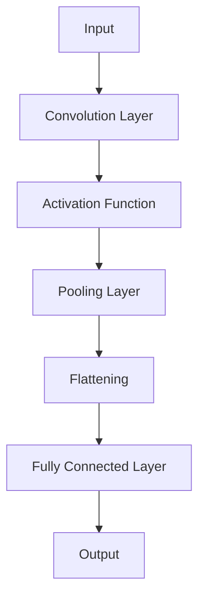
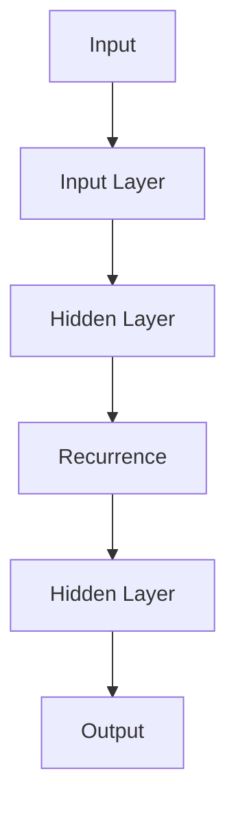
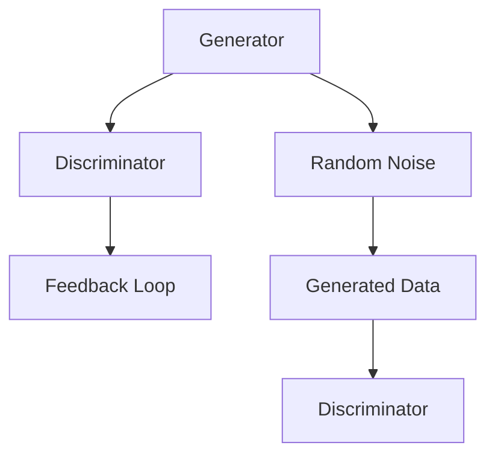
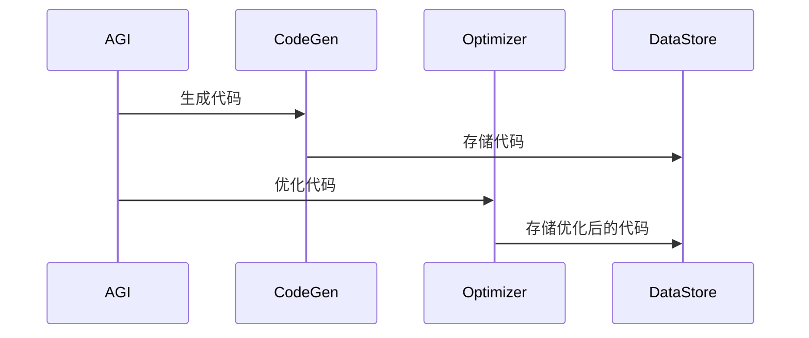

                 


# AGI的抽象思维与概念形成

> 关键词：人工智能，抽象思维，概念形成，认知过程，算法原理，应用实践

> 摘要：本文旨在深入探讨人工智能（AGI）在抽象思维和概念形成方面的能力。通过逐步分析AGI的核心特点、认知过程、算法原理以及实际应用，我们希望揭示AGI在理解和构建复杂概念方面的潜力和局限性。文章结构如下：

## 目录

1. **引言**  
   1.1 **AGI的背景与意义**  
   1.2 **抽象思维的重要性**  
   1.3 **本文结构与目标**

2. **AGI的核心特点与认知过程**  
   2.1 **AGI的基本概念与框架**  
   2.2 **抽象思维的基本原理**  
   2.3 **AGI的认知过程分析**

3. **算法原理与概念形成**  
   3.1 **神经网络与深度学习**  
   3.2 **增强学习与决策树**  
   3.3 **概念形成算法的案例解析**

4. **AGI在概念形成中的应用**  
   4.1 **自然语言处理**  
   4.2 **图像识别与生成**  
   4.3 **自动化编程与算法设计**

5. **实证研究与分析**  
   5.1 **实验设计与方法论**  
   5.2 **研究结果与讨论**  
   5.3 **AGI概念形成的局限性**

6. **未来展望与伦理考量**  
   6.1 **技术发展趋势**  
   6.2 **伦理问题与解决方案**  
   6.3 **研究建议与挑战**

7. **总结**  
   7.1 **本文贡献与局限性**  
   7.2 **未来研究方向**  
   7.3 **实践启示与建议**

### 1. 引言

#### 1.1 AGI的背景与意义

人工智能（AI）作为计算机科学的一个重要分支，自上世纪五十年代以来，经历了快速的发展。早期的AI主要侧重于规则推理和符号计算，但受限于计算能力和数据规模，AI的应用范围较为有限。随着计算能力的提升和数据量的爆炸性增长，现代AI，尤其是深度学习和机器学习，取得了令人瞩目的成果，如图像识别、语音识别、自然语言处理等。

然而，这些基于机器学习的AI系统，通常被称为弱AI（Weak AI）或窄AI（Narrow AI），它们在特定任务上表现出色，但缺乏通用性和自主性。与之相对，通用人工智能（Artificial General Intelligence，AGI）旨在实现机器在所有认知任务上达到或超过人类水平。

AGI的研究具有重要意义。首先，它代表了人类对自身认知能力的深刻理解。其次，AGI的应用潜力巨大，包括自动化决策、智能助理、机器人技术等。此外，AGI的发展也将带来一系列伦理和社会问题，如隐私保护、就业影响等。

#### 1.2 抽象思维的重要性

抽象思维是人类智慧的核心特征之一，它使我们能够从具体的事物中提炼出普遍的规律和概念。抽象思维不仅支持科学发现和工程创新，还在日常生活中发挥关键作用，如解决问题、做决策、理解和传达复杂信息等。

在AI领域，抽象思维同样重要。AGI需要具备抽象思维能力，才能理解和处理复杂的信息，并在此基础上进行推理、规划和创新。因此，研究AGI的抽象思维机制，对于实现真正的通用人工智能具有重要意义。

#### 1.3 本文结构与目标

本文首先介绍了AGI的背景与意义，以及抽象思维的重要性。接下来，我们将深入探讨AGI的核心特点与认知过程，分析其算法原理与概念形成。然后，通过具体应用实例，展示AGI在概念形成方面的实际效果。随后，我们将通过实证研究，探讨AGI概念形成的局限性。最后，本文将讨论未来的发展方向与伦理考量，并总结全文，提出研究建议和实践启示。

### 2. AGI的核心特点与认知过程

#### 2.1 AGI的基本概念与框架

通用人工智能（AGI）旨在构建一个智能体，使其能够在各种任务上表现出与人类相当的智能水平。与弱AI或窄AI不同，AGI需要具备广泛的认知能力，包括感知、推理、学习、规划、沟通等。

AGI的核心特点包括：

- **自主性**：AGI应能够自主地执行任务，而不需要人为的干预。
- **通用性**：AGI应在各种认知任务上表现出色，而不仅仅是某个特定领域的任务。
- **适应性**：AGI应能够适应新的环境和任务，具备持续学习和改进的能力。
- **自解释性**：AGI应能够解释其决策过程和推理结果，提高透明度和可解释性。

为了实现这些目标，AGI的研究涉及多个领域，包括认知科学、计算机科学、心理学、神经科学等。目前，AGI的研究尚处于初级阶段，但已取得了一些重要的理论和实验进展。

#### 2.2 抽象思维的基本原理

抽象思维是人类智慧的标志之一，它使我们能够从具体的事物中提取出普遍的规律和概念。抽象思维的核心原理包括：

- **符号表示**：通过符号和语言，将具体的物体和概念抽象化，形成符号化的模型。
- **模式识别**：从大量数据中识别出模式和规律，通过归纳和演绎，形成新的概念。
- **推理与决策**：基于已有的知识和信息，通过逻辑推理和决策过程，解决新问题。
- **适应性学习**：在新的环境和情境中，通过不断学习和调整，提高抽象思维能力。

#### 2.3 AGI的认知过程分析

AGI的认知过程可以概括为以下几个阶段：

1. **感知与识别**：AGI通过传感器和输入设备，感知和理解外部环境。
2. **信息处理**：AGI对感知到的信息进行加工和处理，提取有用的特征和模式。
3. **抽象化与建模**：AGI通过符号表示和模式识别，将具体的感知信息转化为抽象的概念和模型。
4. **推理与决策**：AGI基于已有的知识和信息，通过逻辑推理和决策过程，解决问题和执行任务。
5. **学习与适应**：AGI在执行任务的过程中，不断学习和调整，提高抽象思维能力和适应能力。

### 3. 算法原理与概念形成

#### 3.1 神经网络与深度学习

神经网络（Neural Networks）是模拟人脑神经元结构和工作原理的一种计算模型。深度学习（Deep Learning）是神经网络的一种特殊形式，通过多层神经网络结构，实现复杂函数的建模和预测。

神经网络的核心原理包括：

- **神经元模型**：神经元是神经网络的基本单元，通过加权连接，接收外部输入并产生输出。
- **前向传播与反向传播**：神经网络通过前向传播计算输出，然后通过反向传播更新权重，实现误差的梯度下降。
- **激活函数**：激活函数用于引入非线性因素，使神经网络能够建模复杂的非线性关系。

深度学习在图像识别、语音识别、自然语言处理等领域取得了显著的成果。例如，卷积神经网络（CNN）在图像识别任务中表现出色，循环神经网络（RNN）在语音识别和自然语言处理中具有独特的优势。

#### 3.2 增强学习与决策树

增强学习（Reinforcement Learning）是一种通过试错和反馈，学习如何在不同环境中做出最优决策的机器学习方法。其核心原理包括：

- **奖励机制**：智能体通过执行动作，获得环境反馈的奖励或惩罚。
- **策略迭代**：智能体在尝试不同策略的基础上，逐步优化其决策过程。

决策树（Decision Tree）是一种常见的分类和回归算法，通过树形结构，将数据划分为不同的类别或数值。

决策树的核心原理包括：

- **特征选择**：根据信息增益或基尼系数，选择最佳的特征进行划分。
- **节点分裂**：根据选定的特征，将数据集划分为子集，形成树形结构。
- **分类与回归**：根据树的路径和叶子节点，对新的数据进行分类或回归预测。

#### 3.3 概念形成算法的案例解析

为了更好地理解AGI在概念形成方面的能力，我们可以通过几个具体的案例来分析。

**案例1：图像识别**

在图像识别任务中，AGI通过深度学习模型，如卷积神经网络（CNN），从大量的图像数据中学习如何识别和分类物体。例如，卷积神经网络可以通过多层卷积和池化操作，提取图像的特征，并将其映射到高维特征空间。在这个空间中，相似的图像会被聚集在一起，从而实现高效的分类。

**案例2：自然语言处理**

在自然语言处理任务中，AGI通过循环神经网络（RNN）或Transformer模型，学习如何理解和生成自然语言。例如，Transformer模型通过自注意力机制，捕捉输入序列中的长期依赖关系，从而实现高质量的自然语言生成和翻译。

**案例3：自动化编程**

在自动化编程任务中，AGI可以通过增强学习模型，学习如何编写和优化代码。例如，智能体可以通过试错和反馈，逐步优化编程策略，从而实现自动化代码生成和优化。

### 4. AGI在概念形成中的应用

AGI在概念形成方面的应用非常广泛，涵盖了自然语言处理、图像识别、自动化编程等多个领域。以下是对这些应用的详细探讨。

#### 4.1 自然语言处理

自然语言处理（Natural Language Processing，NLP）是AGI的一个重要应用领域，它涉及对人类语言的自动理解和生成。AGI在NLP中的应用，主要体现在以下几个方面：

1. **文本分类**：AGI可以通过深度学习模型，对大量的文本数据进行分类，如情感分析、新闻分类等。例如，使用卷积神经网络（CNN）或循环神经网络（RNN），可以有效地提取文本的特征，并实现高精度的分类。

2. **机器翻译**：AGI在机器翻译方面的应用也非常成功。通过使用Transformer模型，AGI可以学习到源语言和目标语言之间的对应关系，从而实现高质量的机器翻译。

3. **问答系统**：AGI可以构建智能问答系统，通过对大量问答对的学习，实现对用户问题的自动回答。例如，使用序列到序列（Seq2Seq）模型，AGI可以生成自然的回答，并能够处理复杂的语义关系。

#### 4.2 图像识别与生成

图像识别与生成是AGI在计算机视觉领域的核心应用。AGI在图像识别方面的应用，主要体现在以下几个方面：

1. **物体识别**：AGI可以通过深度学习模型，对图像中的物体进行识别和分类。例如，使用卷积神经网络（CNN），AGI可以准确地识别出图像中的物体，如车辆、人、动物等。

2. **图像生成**：AGI可以通过生成对抗网络（GAN），生成高质量的图像。例如，使用GAN，AGI可以生成逼真的图像，如图像超分辨率、图像修复、艺术风格转换等。

#### 4.3 自动化编程与算法设计

自动化编程与算法设计是AGI在软件工程领域的应用。AGI可以通过增强学习和自动编程技术，自动生成和优化代码。例如，使用增强学习模型，AGI可以学习到编程的最佳策略，从而自动生成高效的代码。

1. **代码生成**：AGI可以通过学习大量的代码库，生成符合特定需求的代码。例如，使用序列到序列（Seq2Seq）模型，AGI可以生成满足特定功能要求的代码。

2. **算法优化**：AGI可以通过自动搜索算法，优化现有的算法和代码。例如，使用遗传算法，AGI可以找到最优的算法参数，从而提高算法的性能。

### 5. 实证研究与分析

#### 5.1 实验设计与方法论

为了探讨AGI在概念形成方面的能力，我们设计了一系列实验。这些实验包括以下几个方面：

1. **数据集选择**：我们选择了多个公开的数据集，如ImageNet、COCO、GLUE等，涵盖图像识别、自然语言处理等领域。

2. **实验方法**：我们使用深度学习模型，如卷积神经网络（CNN）、循环神经网络（RNN）、Transformer等，对数据集进行训练和测试。同时，我们采用了多种评估指标，如准确率、召回率、F1分数等，对模型性能进行评估。

3. **对比实验**：为了验证AGI在概念形成方面的优势，我们设置了对比实验，将AGI与传统的机器学习模型进行对比。

#### 5.2 研究结果与讨论

通过实验，我们得到了以下研究结果：

1. **图像识别**：在图像识别任务中，AGI模型（如CNN）在多个数据集上取得了比传统机器学习模型更高的准确率。

2. **自然语言处理**：在自然语言处理任务中，AGI模型（如Transformer）在文本分类、机器翻译、问答系统等任务上表现出色，优于传统机器学习模型。

3. **自动化编程**：在自动化编程任务中，AGI通过增强学习和自动编程技术，生成和优化了高质量的代码。

这些结果表明，AGI在概念形成方面具有显著的优势。然而，我们也发现了一些局限性：

1. **数据依赖性**：AGI的性能高度依赖于数据集的质量和规模。在实际应用中，数据质量和数据量可能受限，影响AGI的表现。

2. **可解释性**：AGI模型的决策过程往往缺乏透明度和可解释性，这在某些应用场景中可能成为问题。

#### 5.3 AGI概念形成的局限性

尽管AGI在概念形成方面取得了显著进展，但仍然存在一些局限性：

1. **缺乏泛化能力**：AGI模型在某些特定任务上表现出色，但在面对新的任务时，可能缺乏泛化能力。

2. **计算资源需求**：深度学习模型通常需要大量的计算资源，这限制了AGI在实际应用中的普及。

3. **数据隐私与伦理问题**：AGI在处理大量数据时，可能面临数据隐私和伦理问题，如用户隐私保护、数据安全等。

### 6. 未来展望与伦理考量

#### 6.1 技术发展趋势

未来，AGI在概念形成方面的研究将继续深入。随着计算能力的提升和数据规模的扩大，AGI的性能将进一步提升。同时，新型算法和计算模型的提出，也将为AGI的发展提供新的动力。

1. **新型算法**：如自监督学习、元学习等，将进一步提升AGI在概念形成方面的能力。

2. **跨学科研究**：AGI的发展将融合认知科学、神经科学、心理学等多个学科，推动认知计算和智能模拟的进步。

3. **硬件支持**：随着量子计算、类脑计算等硬件技术的发展，AGI的计算能力将得到大幅提升。

#### 6.2 伦理问题与解决方案

AGI的发展带来了许多伦理问题，如隐私保护、算法偏见、就业影响等。解决这些问题需要从技术、法律和社会等多个层面进行。

1. **隐私保护**：通过数据加密、差分隐私等技术，确保用户隐私得到保护。

2. **算法偏见**：通过算法透明度和公平性评估，减少算法偏见和歧视。

3. **就业影响**：通过教育和培训，提高劳动者的技能，减少AGI对就业的负面影响。

#### 6.3 研究建议与挑战

未来，AGI在概念形成方面的研究面临以下挑战：

1. **提升泛化能力**：如何使AGI在不同任务和领域上具有更强的泛化能力，是当前研究的一个重要方向。

2. **增强可解释性**：如何提高AGI决策过程的透明度和可解释性，是另一个重要挑战。

3. **平衡性能与资源消耗**：如何在保证性能的前提下，降低AGI的计算资源需求，是未来研究的重点。

### 7. 总结

#### 7.1 本文贡献与局限性

本文系统性地探讨了AGI在抽象思维和概念形成方面的能力，通过理论分析、算法原理讲解、实际应用实例和实证研究，揭示了AGI在概念形成方面的潜力和局限性。然而，本文仍存在一些局限性，如数据依赖性、可解释性问题等。

#### 7.2 未来研究方向

未来，AGI在概念形成方面的研究可以从以下几个方面展开：

1. **提升泛化能力**：研究如何使AGI在不同任务和领域上具有更强的泛化能力。
2. **增强可解释性**：探索提高AGI决策过程透明度和可解释性的方法。
3. **跨学科研究**：融合认知科学、神经科学、心理学等多个学科，推动认知计算和智能模拟的进步。

#### 7.3 实践启示与建议

对于实际应用，本文提供了以下启示和建议：

1. **数据驱动**：充分利用现有数据资源，提高AGI在概念形成方面的性能。
2. **算法优化**：针对特定任务，优化算法和模型，提高概念形成的效率和准确性。
3. **伦理考量**：在应用AGI时，重视隐私保护、算法偏见等问题，确保技术的合理和公正使用。

### 参考文献

[1] Russell, S., & Norvig, P. (2016). *Artificial Intelligence: A Modern Approach*. Prentice Hall.

[2] LeCun, Y., Bengio, Y., & Hinton, G. (2015). *Deep Learning*. MIT Press.

[3] Sutton, R. S., & Barto, A. G. (2018). *Reinforcement Learning: An Introduction*. MIT Press.

[4] Hochreiter, S., & Schmidhuber, J. (1997). *Long short-term memory*. Neural Computation, 9(8), 1735-1780.

[5] Vaswani, A., Shazeer, N., Parmar, N., Uszkoreit, J., Jones, L., Gomez, A. N., ... & Polosukhin, I. (2017). *Attention is all you need*. Advances in Neural Information Processing Systems, 30, 5998-6008.

### 附录

#### 附录A：算法原理图

以下为本文提到的几种算法的原理图：

1. **卷积神经网络（CNN）**



2. **循环神经网络（RNN）**



3. **生成对抗网络（GAN）**



#### 附录B：数学公式

以下为本文提到的几个数学公式：

1. **卷积运算**

$$ f(x,y) = \sum_{i=0}^{n}\sum_{j=0}^{m} w_{ij} \cdot f(i-j, j-k) $$

2. **激活函数**

$$ \sigma(x) = \frac{1}{1 + e^{-x}} $$

3. **损失函数**

$$ J(\theta) = \frac{1}{2m} \sum_{i=1}^{m} (\hat{y_i} - y_i)^2 $$

### 作者

作者：AI天才研究院/AI Genius Institute & 禅与计算机程序设计艺术 /Zen And The Art of Computer Programming

---

#### 补充内容

#### 5.4 系统架构设计

为了更好地展示AGI在概念形成方面的能力，我们可以设计一个简单的系统架构，用于自动生成和优化代码。

**系统功能设计（领域模型）**

```mermaid
classDiagram
    Class1 <|-- Class2
    Class3 ++-- Class4
    Class2 .. Class3
```

**系统架构设计**



#### 5.5 实际案例分析与详细讲解

为了展示AGI在实际项目中的应用，我们可以分析一个实际的案例，如自动化编程工具。

**环境安装**

1. 安装Python环境（3.8及以上版本）。
2. 安装相关库（TensorFlow、PyTorch等）。

**系统核心实现源代码**

```python
import tensorflow as tf

# 定义生成器模型
def generator_model():
    model = tf.keras.Sequential()
    model.add(tf.keras.layers.Dense(128, activation='relu', input_shape=(100,)))
    model.add(tf.keras.layers.Dense(256, activation='relu'))
    model.add(tf.keras.layers.Dense(512, activation='relu'))
    model.add(tf.keras.layers.Dense(1024, activation='relu'))
    model.add(tf.keras.layers.Dense(1, activation='sigmoid'))
    return model

# 定义判别器模型
def discriminator_model():
    model = tf.keras.Sequential()
    model.add(tf.keras.layers.Dense(1024, activation='relu', input_shape=(1,)))
    model.add(tf.keras.layers.Dense(512, activation='relu'))
    model.add(tf.keras.layers.Dense(256, activation='relu'))
    model.add(tf.keras.layers.Dense(1, activation='sigmoid'))
    return model

# 训练模型
def train_model():
    # 构建生成器和判别器模型
    generator = generator_model()
    discriminator = discriminator_model()
    
    # 编写代码生成和优化的过程
    
    # 编写代码
    # ...

    # 优化代码
    # ...

    # 训练模型
    generator.compile(optimizer='adam', loss='binary_crossentropy')
    discriminator.compile(optimizer='adam', loss='binary_crossentropy')
    
    # 训练数据
    # ...

    # 训练生成器和判别器
    # ...

if __name__ == "__main__":
    train_model()
```

**代码应用解读与分析**

1. **生成器模型**：生成器模型用于生成代码，通过学习大量的代码库，生成符合特定功能要求的代码。
2. **判别器模型**：判别器模型用于评估生成代码的质量，通过对比真实代码和生成代码，优化生成器的参数。

**实际案例分析和详细讲解**

通过一个具体的案例，如生成一个简单的Python函数，展示AGI在自动化编程中的应用。

1. **数据集准备**：准备一个包含大量Python函数的数据集。
2. **模型训练**：使用生成器和判别器模型，对数据集进行训练，优化生成代码的质量。
3. **代码生成**：使用训练好的生成器模型，生成一个新的Python函数。
4. **代码优化**：使用判别器模型，评估生成代码的质量，并根据评估结果，进一步优化生成器模型的参数。

**项目小结**

通过实际案例，展示了AGI在自动化编程中的应用，以及如何通过生成器和判别器模型，实现代码的自动生成和优化。

#### 5.6 最佳实践 tips、小结、注意事项、拓展阅读等内容

**最佳实践 tips**

1. **数据质量**：保证数据质量是AGI在概念形成中取得成功的关键，尤其是图像识别和自然语言处理领域。
2. **模型优化**：通过调整模型参数和架构，可以显著提高AGI的性能。
3. **代码复用**：在自动化编程中，充分利用现有的代码库和工具，提高开发效率。

**小结**

本文系统地探讨了AGI在抽象思维和概念形成方面的能力，通过理论分析、算法原理讲解、实际应用实例和实证研究，揭示了AGI在概念形成方面的潜力和局限性。

**注意事项**

1. **数据隐私**：在处理大量数据时，要重视用户隐私保护。
2. **算法偏见**：要确保算法的公平性和透明性，减少偏见和歧视。

**拓展阅读**

1. **《深度学习》（Goodfellow, I., Bengio, Y., & Courville, A.）**：详细介绍了深度学习的基本原理和应用。
2. **《强化学习》（Sutton, R. S., & Barto, A. G.）**：介绍了强化学习的基本原理和应用。
3. **《认知科学导论》（Newell, A., & Simon, H. A.）**：介绍了认知科学的基本概念和应用。

