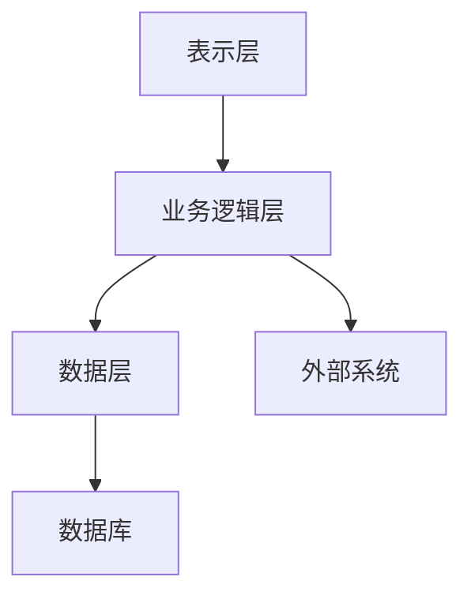
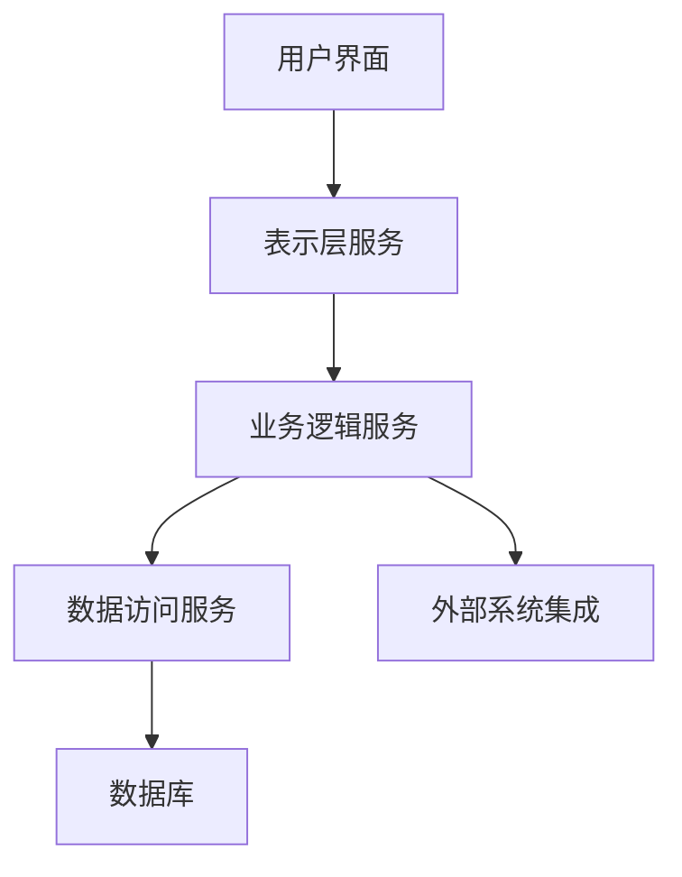
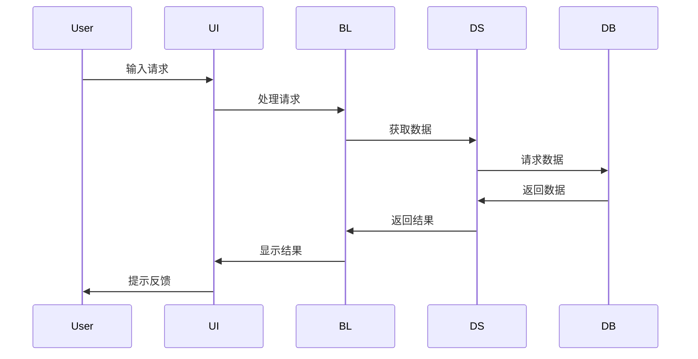

                 

# 《AGI的抽象推理：从特殊到一般的归纳能力》

> 关键词：人工通用智能（AGI）、抽象推理、归纳能力、机器学习、算法原理、数学模型、系统架构、项目实战、最佳实践

## 摘要

本文旨在探讨人工通用智能（AGI）中的抽象推理能力，特别是从特殊到一般的归纳能力。通过详细阐述抽象推理的核心概念、算法原理、数学模型、系统分析与架构设计以及项目实战，本文将帮助读者理解抽象推理在AGI发展中的关键作用。本文首先介绍了AGI和抽象推理的基本概念，然后逐步深入到算法原理、数学模型、系统架构以及实际项目中的应用，最后给出了最佳实践和小结。通过这一系列的分析和思考，我们希望读者能够对AGI的抽象推理能力有一个全面而深入的认识。

## 第1章：引言

### 1.1 人工通用智能（AGI）概述

人工通用智能（Artificial General Intelligence，简称AGI）是一种旨在模拟人类智能的理论和目标，它具备广泛的学习能力、适应能力和问题解决能力，能够在各种不同的任务和环境中表现出与人类相似的水平。与现有的弱人工智能（Narrow AI）不同，AGI不仅仅在特定领域内表现出色，而是在多个领域内具有自主学习和推理能力。

AGI的概念可以追溯到20世纪50年代，当时人工智能（AI）的提出者约翰·麦卡锡（John McCarthy）就设想了这种通用智能的存在。然而，尽管历经数十年的发展，AGI仍然是一个未解之谜。当前的AI技术主要集中在特定任务的优化，如图像识别、自然语言处理和棋类游戏等。然而，要让这些系统具有类似人类的智能，仍然面临巨大的挑战。

### 1.2 抽象推理的定义与重要性

抽象推理是AGI的核心组成部分之一，它涉及从具体的实例中提取通用规律和模式，从而在新的情境中应用这些规律。抽象推理不仅包括从具体到一般的归纳推理，还涉及从一般到具体的演绎推理。

抽象推理在人类认知中扮演着至关重要的角色。它使我们能够理解复杂的概念和问题，预测未来的事件，并基于现有的知识做出合理的推断。在科学发现、技术创新和日常决策中，抽象推理都是不可或缺的。

在AGI的发展中，抽象推理同样至关重要。只有通过抽象推理，机器才能从大量的数据中提取出有用的信息，并应用这些信息解决新的问题。此外，抽象推理能力还使得AGI能够适应不断变化的环境和任务，实现真正的通用智能。

### 1.3 研究背景与现状

抽象推理一直是人工智能研究中的一个重要领域。早期的符号主义方法主要依赖于逻辑和推理规则，但这种方法在处理复杂问题时效率较低。随着统计学习和神经网络技术的发展，机器学习逐渐成为抽象推理的主要工具。特别是深度学习，通过多层神经网络的结构，可以自动学习复杂的函数表示。

目前，抽象推理在AI中的应用主要集中在机器学习和自然语言处理领域。例如，深度学习模型可以通过大量的数据学习到图像中的物体分类，而自然语言处理模型则可以通过文本数据学习到语言的语义和语法规则。

然而，当前的AI系统在抽象推理方面仍然存在许多限制。首先，它们通常依赖于大量的数据来训练，缺乏对数据不足或数据偏差的鲁棒性。其次，这些系统往往难以解释其推理过程，导致难以验证其推理结果的可靠性。最后，抽象推理涉及到跨领域的知识整合，而现有的AI系统往往局限于特定领域。

### 1.4 本文结构

本文将从以下几个方面展开讨论：

1. **抽象推理的核心概念**：介绍抽象推理的基本分类、概念属性特征对比表格和ER实体关系图架构的Mermaid流程图。
2. **归纳能力的算法原理**：探讨从特殊到一般的归纳能力的算法原理，包括机器学习中的归纳模型、算法mermaid流程图和Python源代码实现。
3. **抽象推理的数学模型**：详细阐述抽象推理的数学模型，包括公式和计算方法，并使用LaTeX格式嵌入文中。
4. **系统分析与架构设计**：介绍抽象推理在系统中的应用，包括问题场景介绍、项目介绍、系统功能设计、系统架构设计和系统接口设计等。
5. **项目实战**：提供具体的实现案例，展示如何从特殊到一般进行归纳，包括环境安装、系统核心实现、代码应用解读与分析、实际案例分析和详细讲解剖析。
6. **最佳实践与未来展望**：总结抽象推理在实践中的应用，提供最佳实践建议，并展望抽象推理在AGI中的未来发展。

## 第2章：抽象推理的核心概念

### 2.1 抽象推理的分类

抽象推理可以按照不同的维度进行分类。以下是几种常见的分类方法：

1. **根据推理的目标**：
   - **概念抽象**：从具体的实例中提取抽象的概念和定义。
   - **操作抽象**：从具体的操作中提取通用的操作规则。
   - **知识抽象**：从具体的知识中提取通用的知识结构和原理。

2. **根据推理的方法**：
   - **归纳推理**：从具体的实例中归纳出一般的规律。
   - **演绎推理**：从一般的原则推导出具体的结论。
   - **类比推理**：通过比较相似的情况来推断未知情况。

3. **根据推理的层次**：
   - **低层次抽象**：涉及基本的特征和属性。
   - **中层次抽象**：涉及概念和规则。
   - **高层次抽象**：涉及理论和体系。

### 2.2 抽象推理与通用智能的关系

抽象推理是通用智能的重要组成部分。通用智能不仅要求AI系统能够在特定任务上表现出色，还要求它们能够跨领域学习、适应和推理。这种跨领域的推理能力依赖于抽象推理。

1. **跨领域学习**：
   - 抽象推理使AI系统能够从特定领域的知识中提取出通用规律，从而应用于其他领域。
   - 例如，一个在医疗领域训练的AI模型可以通过抽象推理，将其知识应用于金融或教育领域。

2. **自适应能力**：
   - 抽象推理使AI系统能够从不同的情境中提取通用规律，从而适应新的环境和任务。
   - 例如，一个在多种环境下训练的AI机器人可以通过抽象推理，适应不同的工作场景。

3. **问题解决能力**：
   - 抽象推理使AI系统能够从复杂的问题中提取关键信息，形成合理的解决方案。
   - 例如，一个在复杂游戏中训练的AI可以通过抽象推理，解决新的复杂游戏。

### 2.3 抽象推理与问题解决的关系

抽象推理是问题解决的核心机制。在人类解决问题时，我们常常通过抽象推理来简化问题、提取关键信息，并形成解决方案。

1. **问题简化**：
   - 抽象推理使我们能够将复杂问题分解为更简单的子问题。
   - 例如，在解决数学问题时，我们常常通过引入新的变量和公式，将复杂的问题简化为简单的方程。

2. **信息提取**：
   - 抽象推理使我们能够从大量数据中提取出有用的信息。
   - 例如，在数据分析中，我们常常通过构建模型和算法，从大量数据中提取出关键指标和趋势。

3. **形成解决方案**：
   - 抽象推理使我们能够从现有知识中形成新的解决方案。
   - 例如，在科学研究中，我们常常通过抽象推理，提出新的假设和理论。

### 2.4 抽象推理的概念结构与核心要素组成

抽象推理的概念结构包括以下几个核心要素：

1. **具体实例**：
   - 抽象推理的起点是具体的实例。这些实例可以是数据、事实或观察。

2. **抽象概念**：
   - 通过对具体实例的抽象，我们能够提取出抽象的概念和定义。

3. **推理规则**：
   - 抽象推理依赖于一系列的推理规则，这些规则指导我们如何从抽象概念中推导出新的结论。

4. **知识库**：
   - 抽象推理依赖于一个知识库，这个知识库包含了我们已知的事实、规则和原理。

5. **推理过程**：
   - 抽象推理是一个从具体到一般，从已知到未知的推理过程。

### 2.5 抽象推理与归纳能力的关系

抽象推理与归纳能力密切相关。归纳能力是指从特定的实例中归纳出一般的规律和模式。这是抽象推理的核心机制。

1. **归纳推理**：
   - 归纳推理是从具体的实例中提取一般规律的过程。
   - 例如，从多个猫的例子中归纳出“猫有四条腿”这一规律。

2. **抽象推理**：
   - 抽象推理不仅包括归纳推理，还包括从一般到具体的演绎推理和类比推理。
   - 例如，从“猫有四条腿”这一规律，可以演绎出“这只猫有四条腿”。

3. **关系**：
   - 归纳能力是抽象推理的重要组成部分，而抽象推理则是归纳能力实现的机制。

### 2.6 抽象推理的实际应用场景

抽象推理在实际应用中具有广泛的应用场景。以下是一些典型的应用：

1. **科学发现**：
   - 科学家通过抽象推理，从实验数据中提取出新的科学规律。
   - 例如，爱因斯坦通过抽象推理，提出了相对论。

2. **技术创新**：
   - 技术开发者通过抽象推理，从现有技术中提取出新的技术和解决方案。
   - 例如，苹果公司的iPhone就是通过抽象推理，将多种技术整合到一个设备中。

3. **商业决策**：
   - 企业家通过抽象推理，从市场数据中提取出商业机会。
   - 例如，亚马逊的创始人贝佐斯通过抽象推理，发现了在线销售的市场机会。

4. **教育**：
   - 教育者通过抽象推理，从教学实践中提取出有效的教学方法。
   - 例如，教育学家皮亚杰通过抽象推理，提出了儿童认知发展的理论。

### 2.7 抽象推理的挑战与未来发展方向

尽管抽象推理在许多领域都取得了显著的成果，但它仍然面临许多挑战：

1. **数据依赖**：
   - 抽象推理依赖于大量的数据，但数据的质量和数量都可能影响推理结果。
   - 未来研究方向是开发出更鲁棒的数据驱动推理方法。

2. **解释性**：
   - 抽象推理的过程往往缺乏解释性，这使得推理结果难以验证。
   - 未来研究方向是提高推理过程的可解释性。

3. **跨领域推理**：
   - 抽象推理在跨领域推理中面临巨大的挑战，因为不同领域的数据和知识具有不同的结构和特性。
   - 未来研究方向是开发出更有效的跨领域推理方法。

4. **实时推理**：
   - 抽象推理在实时应用中面临性能挑战，因为实时推理要求快速的推理过程。
   - 未来研究方向是提高实时推理的性能。

5. **人机协作**：
   - 抽象推理在人类和机器的协作中面临挑战，因为人类和机器在推理方式上存在差异。
   - 未来研究方向是开发出更有效的人机协作推理系统。

## 第3章：归纳能力的算法原理

### 3.1 机器学习中的归纳模型

归纳能力是机器学习（Machine Learning，ML）的核心机制之一。在机器学习中，归纳模型（Inductive Models）是从特定数据集中学习一般规律和模式的模型。归纳模型分为监督学习（Supervised Learning）、无监督学习（Unsupervised Learning）和强化学习（Reinforcement Learning）三种主要类型。

#### 3.1.1 监督学习

监督学习是最常见的归纳模型，它通过已标记的数据集学习输入和输出之间的映射关系。监督学习的目标是找到一个函数，这个函数能够在新数据上准确预测输出。

1. **分类问题**：
   - 分类问题是指将数据分为几个预定义的类别。常见的分类算法包括决策树（Decision Tree）、支持向量机（Support Vector Machine，SVM）和随机森林（Random Forest）。

2. **回归问题**：
   - 回归问题是指预测一个连续的数值输出。常见的回归算法包括线性回归（Linear Regression）、岭回归（Ridge Regression）和LASSO（Least Absolute Shrinkage and Selection Operator）。

#### 3.1.2 无监督学习

无监督学习不使用已标记的数据集，而是从未标记的数据中学习结构和模式。无监督学习的目标是发现数据中的隐藏结构和规律。

1. **聚类问题**：
   - 聚类问题是指将相似的数据点归为同一组。常见的聚类算法包括K-均值聚类（K-Means Clustering）、层次聚类（Hierarchical Clustering）和DBSCAN（Density-Based Spatial Clustering of Applications with Noise）。

2. **降维问题**：
   - 降维问题是指通过减少数据维度来简化数据分析。常见的降维算法包括主成分分析（Principal Component Analysis，PCA）和非线性降维算法，如t-SNE（t-Distributed Stochastic Neighbor Embedding）。

#### 3.1.3 强化学习

强化学习是一种通过试错和反馈来学习最优策略的归纳模型。强化学习涉及一个代理人（Agent）在一个环境中（Environment）采取行动（Action），并根据环境的反馈（Reward）调整其策略（Policy）。

1. **奖励机制**：
   - 强化学习通过奖励机制来引导代理人采取正确的行动。奖励可以是正面的，也可以是负面的。

2. **策略学习**：
   - 强化学习的目标是学习一个策略，这个策略能够最大化长期奖励。

### 3.2 归纳算法的工作原理

归纳算法的工作原理可以从以下几个方面进行理解：

#### 3.2.1 特征提取

特征提取是指从原始数据中提取出有用的特征，这些特征能够有效地表示数据的本质和规律。特征提取是归纳算法成功的关键。

1. **数据预处理**：
   - 数据预处理包括数据清洗、数据转换和数据归一化等步骤，以确保数据的质量和一致性。

2. **特征选择**：
   - 特征选择是指从大量的特征中选出最有用的特征。常见的特征选择方法包括基于信息增益的过滤方法、基于模型的包装方法和基于嵌入的特征选择方法。

#### 3.2.2 分类与预测

在归纳算法中，分类与预测是核心步骤。分类是将数据点分为不同的类别，而预测是预测数据点的某个属性值。

1. **决策规则**：
   - 决策规则是通过学习得到的一系列条件语句，这些条件语句能够将数据点分类到正确的类别。

2. **概率分布**：
   - 在概率模型中，预测是通过计算数据点属于不同类别的概率来进行的。常用的概率模型包括朴素贝叶斯（Naive Bayes）和贝叶斯网络（Bayesian Network）。

#### 3.2.3 模型评估

模型评估是归纳算法的重要步骤，它用于评估模型的性能和泛化能力。

1. **准确率**：
   - 准确率是指模型预测正确的样本数占总样本数的比例。

2. **召回率**：
   - 召回率是指模型预测正确的正样本数占总正样本数的比例。

3. **F1分数**：
   - F1分数是准确率和召回率的调和平均值，用于综合评估模型的性能。

### 3.3 归纳算法的应用场景

归纳算法在许多领域都有广泛的应用，以下是一些典型的应用场景：

1. **金融领域**：
   - 金融领域使用归纳算法进行风险评估、市场预测和客户分类等。

2. **医疗领域**：
   - 医疗领域使用归纳算法进行疾病诊断、药物研发和患者管理。

3. **零售领域**：
   - 零售领域使用归纳算法进行客户细分、库存管理和营销策略制定。

4. **制造业**：
   - 制造业使用归纳算法进行设备故障预测、生产优化和质量控制。

5. **自然语言处理**：
   - 自然语言处理领域使用归纳算法进行文本分类、情感分析和机器翻译等。

### 3.4 归纳算法的优势与挑战

归纳算法具有以下优势：

1. **泛化能力**：
   - 归纳算法能够从特定数据中学习到一般规律，从而在新数据上表现出良好的性能。

2. **自适应能力**：
   - 归纳算法能够根据新的数据和反馈调整模型，从而适应不断变化的环境。

3. **自动化**：
   - 归纳算法能够自动学习数据中的模式和规律，减少人工干预。

然而，归纳算法也面临以下挑战：

1. **数据依赖**：
   - 归纳算法的性能依赖于数据的质量和数量。

2. **解释性**：
   - 归纳算法的推理过程往往缺乏解释性，使得模型难以被理解和信任。

3. **过拟合**：
   - 归纳算法可能对训练数据过度拟合，导致在新数据上的性能不佳。

4. **计算成本**：
   - 归纳算法可能需要大量的计算资源，特别是在处理大规模数据时。

### 3.5 归纳算法的发展趋势

归纳算法的发展趋势包括以下几个方面：

1. **深度学习**：
   - 深度学习是归纳算法的重要发展方向，它通过多层神经网络结构，可以自动学习复杂的函数表示。

2. **集成方法**：
   - 集成方法通过结合多个模型的预测结果，提高模型的性能和鲁棒性。

3. **增量学习**：
   - 增量学习允许模型在新的数据上更新，而不需要重新训练整个模型，从而提高模型的适应性。

4. **可解释性**：
   - 可解释性是未来的重要研究方向，旨在提高归纳算法的可解释性和透明度。

5. **跨领域推理**：
   - 跨领域推理是未来的重要方向，旨在使归纳算法能够在不同领域之间进行有效的推理和迁移。

## 第4章：抽象推理的数学模型

### 4.1 归纳推理的数学公式

抽象推理的数学模型是理解归纳推理核心原理的基础。归纳推理通常涉及概率模型、决策理论以及信息论等数学工具。以下是一些关键的数学公式和概念：

#### 4.1.1 概率模型

概率模型是归纳推理中常用的工具，它通过概率分布来描述数据中的不确定性。

1. **条件概率**：
   $$ P(A|B) = \frac{P(A \cap B)}{P(B)} $$

   条件概率表示在事件B发生的条件下，事件A发生的概率。

2. **贝叶斯定理**：
   $$ P(A|B) = \frac{P(B|A)P(A)}{P(B)} $$

   贝叶斯定理是概率模型中的一个基本公式，用于计算在给定某些证据的情况下，某个假设的概率。

#### 4.1.2 决策理论

决策理论用于评估不同决策的结果，并选择最优的决策。

1. **期望值**：
   $$ E(X) = \sum_{i} x_i P(x_i) $$

   期望值是决策理论中的一个核心概念，表示随机变量的平均值。

2. **最大化期望效用**：
   $$ U(X) = \sum_{i} u(x_i) P(x_i) $$

   最大化期望效用是指选择一个能够最大化预期效用的决策。

#### 4.1.3 信息论

信息论用于量化信息的不确定性，它是抽象推理中的重要工具。

1. **熵**：
   $$ H(X) = -\sum_{i} P(x_i) \log_2 P(x_i) $$

   熵是衡量随机变量不确定性的一种度量，它表示在不知道随机变量X的具体值时，我们需要的平均信息量。

2. **条件熵**：
   $$ H(X|Y) = -\sum_{i} P(y_i) \sum_{j} P(x_j|y_i) \log_2 P(x_j|y_i) $$

   条件熵是衡量在已知随机变量Y的情况下，随机变量X的不确定性。

#### 4.1.4 模型评估

模型评估是抽象推理中的一个重要环节，它用于评估模型的性能和泛化能力。

1. **准确率**：
   $$ Accuracy = \frac{TP + TN}{TP + TN + FP + FN} $$

   准确率是评估分类模型性能的一个基本指标，表示正确分类的样本数占总样本数的比例。

2. **召回率**：
   $$ Recall = \frac{TP}{TP + FN} $$

   召回率是评估分类模型性能的一个指标，表示正确分类的正样本数占总正样本数的比例。

### 4.2 模型的计算方法

归纳推理的数学模型不仅需要理解公式，还需要掌握具体的计算方法。以下是一些常用的计算方法：

#### 4.2.1 数值计算

数值计算是归纳推理中的基本工具，它涉及数值的运算和优化。

1. **梯度下降**：
   梯度下降是一种优化算法，用于最小化损失函数。其基本公式为：
   $$ w_{new} = w_{current} - \alpha \cdot \nabla W $$
   其中，$w_{current}$是当前权重，$\alpha$是学习率，$\nabla W$是权重梯度的负方向。

2. **牛顿法**：
   牛顿法是一种更高效的优化算法，它利用了函数的导数和二阶导数。其迭代公式为：
   $$ x_{new} = x_{current} - \frac{f(x_{current})}{f'(x_{current})} $$
   其中，$x_{current}$是当前迭代点，$f(x)$是目标函数。

#### 4.2.2 梯度下降

梯度下降是机器学习中最常用的优化算法之一。以下是一个简单的Python代码示例，用于实现梯度下降：

```python
import numpy as np

def gradient_descent(x, y, w_init, learning_rate, epochs):
    for epoch in range(epochs):
        pred = x * w_init
        error = pred - y
        w_update = learning_rate * (x * error)
        w_init -= w_update
        if epoch % 100 == 0:
            print(f"Epoch {epoch}: w = {w_init}, Error = {np.mean((pred - y) ** 2)}")
    return w_init

x = np.array([1, 2, 3, 4, 5])
y = np.array([2, 4, 5, 4, 5])
w_init = 0.5
learning_rate = 0.01
epochs = 1000

w_final = gradient_descent(x, y, w_init, learning_rate, epochs)
print(f"Final weight: {w_final}")
```

#### 4.2.3 优化算法

优化算法是用于最小化损失函数的一类算法，它们在机器学习中有广泛的应用。以下是一些常见的优化算法：

1. **随机梯度下降（SGD）**：
   随机梯度下降是梯度下降的一个变种，它使用单个样本的梯度进行更新，而不是使用整个数据集的梯度。这通常可以加快收敛速度。

2. **动量法**：
   动量法是梯度下降的一个变种，它引入了动量项，以减少参数更新过程中的震荡，提高收敛速度。

3. **Adam优化器**：
   Adam优化器是一种结合了动量和自适应学习率的优化算法，它在实践中表现出良好的性能。

### 4.3 归纳推理的例子

为了更好地理解归纳推理的数学模型，我们可以通过一个简单的例子来展示其应用。

#### 例子：线性回归

假设我们有一个简单的线性回归问题，目标是预测一个变量的值。我们可以使用以下公式来表示：

$$ y = w_0 + w_1 \cdot x $$

其中，$y$是目标变量，$x$是输入变量，$w_0$和$w_1$是模型参数。

1. **数据集**：
   我们有一个数据集，包含输入$x$和对应的输出$y$：

   ```python
   x = np.array([1, 2, 3, 4, 5])
   y = np.array([2, 4, 5, 4, 5])
   ```

2. **初始化参数**：
   初始化模型的参数$w_0$和$w_1$：

   ```python
   w_0 = 0
   w_1 = 1
   ```

3. **梯度下降**：
   使用梯度下降算法来更新参数：

   ```python
   learning_rate = 0.01
   epochs = 1000

   for epoch in range(epochs):
       pred = x * w_1 + w_0
       error = pred - y
       w_1_gradient = np.mean(x * error)
       w_0_gradient = np.mean(error)
       w_1 -= learning_rate * w_1_gradient
       w_0 -= learning_rate * w_0_gradient

       if epoch % 100 == 0:
           print(f"Epoch {epoch}: w_0 = {w_0}, w_1 = {w_1}, Error = {np.mean((pred - y) ** 2)}")
   ```

4. **结果**：
   运行梯度下降算法后，我们得到最优的参数$w_0$和$w_1$，并且可以看到误差逐渐减小。

   ```python
   print(f"Final w_0: {w_0}, w_1: {w_1}")
   ```

通过这个例子，我们可以看到如何使用数学模型和算法来求解线性回归问题，这是一个简单的归纳推理过程。

### 4.4 归纳推理的挑战与未来方向

尽管归纳推理在许多应用中取得了成功，但它也面临一些挑战：

1. **数据质量**：
   归纳推理的性能高度依赖于数据的质量。如果数据有噪声或者不完整，模型的性能可能会受到影响。

2. **过拟合**：
   过拟合是指模型在训练数据上表现良好，但在新数据上表现不佳。解决过拟合的方法包括正则化和交叉验证。

3. **可解释性**：
   许多现代机器学习模型缺乏可解释性，这使得用户难以理解模型的决策过程。

4. **计算资源**：
   归纳推理通常需要大量的计算资源，特别是在处理大规模数据时。

未来，归纳推理的发展方向包括：

1. **深度学习**：
   深度学习是归纳推理的重要发展方向，它通过多层神经网络结构，可以自动学习复杂的函数表示。

2. **可解释性**：
   开发可解释的归纳模型，使得用户能够理解模型的决策过程。

3. **增量学习**：
   增量学习允许模型在新的数据上更新，而不需要重新训练整个模型，从而提高模型的适应性。

4. **跨领域推理**：
   开发能够在不同领域之间进行有效推理和迁移的归纳模型。

通过不断的研究和创新，归纳推理将在人工智能领域发挥越来越重要的作用。

## 第5章：系统分析与架构设计

### 5.1 抽象推理在系统中的应用

抽象推理在系统设计中具有重要作用，它能够帮助系统从复杂的场景中提取出关键的信息和模式，从而简化系统的设计和实现过程。在系统架构中，抽象推理主要体现在以下几个方面：

1. **需求分析**：
   - 抽象推理可以帮助我们从用户需求中提取出核心功能，从而设计出更简洁的系统需求。

2. **功能模块划分**：
   - 通过抽象推理，我们可以将复杂的系统功能分解为更小的模块，每个模块负责特定的功能，从而提高系统的可维护性和可扩展性。

3. **问题域建模**：
   - 抽象推理可以帮助我们识别系统中的关键实体和关系，从而构建出合适的问题域模型。

4. **算法选择**：
   - 抽象推理可以帮助我们选择合适的算法来处理系统中的具体问题，从而提高系统的效率和准确性。

5. **系统优化**：
   - 抽象推理可以帮助我们识别系统中的瓶颈和冗余，从而对系统进行优化。

### 5.2 系统架构设计

系统架构设计是系统开发中的关键步骤，它决定了系统的性能、可扩展性和可维护性。在系统架构设计中，抽象推理的应用主要体现在以下几个方面：

1. **层次划分**：
   - 通过抽象推理，我们可以将系统划分为多个层次，如表示层、业务逻辑层和数据层，每个层次负责特定的功能，从而提高系统的清晰度和可维护性。

2. **组件设计**：
   - 通过抽象推理，我们可以设计出模块化、解耦合的组件，每个组件实现特定的功能，从而提高系统的灵活性和可扩展性。

3. **接口设计**：
   - 通过抽象推理，我们可以定义清晰、稳定的接口，从而确保组件之间的协作和通信。

4. **架构风格**：
   - 通过抽象推理，我们可以选择合适的架构风格，如微服务、事件驱动等，从而满足系统的特定需求。

### 5.3 系统架构mermaid图

为了更好地展示系统架构，我们可以使用Mermaid语言绘制系统架构图。以下是一个简单的系统架构Mermaid图示例：



在这个示例中，系统分为表示层、业务逻辑层和数据层，业务逻辑层与数据层和外部系统进行交互。

### 5.4 系统功能设计

系统功能设计是系统架构设计的一部分，它定义了系统的具体功能模块和功能流程。在系统功能设计中，抽象推理的应用主要体现在以下几个方面：

1. **功能模块划分**：
   - 通过抽象推理，我们可以将系统的功能分解为多个模块，每个模块负责特定的功能。

2. **功能流程设计**：
   - 通过抽象推理，我们可以设计出系统的功能流程，确保系统的功能逻辑清晰、合理。

3. **用户交互设计**：
   - 通过抽象推理，我们可以设计出用户友好的界面和交互流程，从而提高用户的体验。

### 5.5 系统架构设计mermaid架构图

为了更好地展示系统架构设计，我们可以使用Mermaid语言绘制系统架构图。以下是一个简单的系统架构Mermaid图示例：



在这个示例中，系统分为用户界面、表示层服务、业务逻辑服务和数据访问服务，业务逻辑服务和数据访问服务与数据库和外部系统集成。

### 5.6 系统接口设计

系统接口设计是系统架构设计的一部分，它定义了系统组件之间的交互接口。在系统接口设计中，抽象推理的应用主要体现在以下几个方面：

1. **接口规范**：
   - 通过抽象推理，我们可以设计出清晰、稳定的接口规范，确保组件之间的协作和通信。

2. **接口抽象**：
   - 通过抽象推理，我们可以将具体的实现细节抽象出来，从而提高系统的可维护性和可扩展性。

3. **接口测试**：
   - 通过抽象推理，我们可以设计出接口测试用例，确保接口的稳定性和可靠性。

### 5.7 系统交互mermaid序列图

为了更好地展示系统组件之间的交互，我们可以使用Mermaid语言绘制系统交互序列图。以下是一个简单的系统交互Mermaid图示例：



在这个示例中，用户界面（UI）与业务逻辑层（BL）、数据访问层（DS）和数据库（DB）进行交互，实现用户请求的处理和数据检索。

### 5.8 系统分析与架构设计的挑战与未来方向

系统分析与架构设计面临一些挑战：

1. **复杂性**：
   - 现代系统越来越复杂，如何有效地进行系统分析与架构设计成为一个挑战。

2. **变化性**：
   - 需求的变化和技术的进步要求系统架构具有高可扩展性和可维护性。

3. **性能与可靠性**：
   - 系统的性能和可靠性是系统分析与架构设计的关键目标，如何平衡两者成为一个挑战。

未来方向包括：

1. **智能化**：
   - 利用抽象推理和机器学习技术，实现智能化的系统分析与架构设计。

2. **模块化**：
   - 提高系统的模块化程度，实现更灵活、可扩展的系统架构。

3. **可解释性**：
   - 提高系统的可解释性，使得设计者和使用者能够更好地理解系统架构和决策过程。

4. **跨领域**：
   - 开发能够在不同领域之间进行有效推理和迁移的系统架构设计方法。

通过不断的研究和创新，系统分析与架构设计将在人工智能领域发挥越来越重要的作用。

## 第6章：项目实战

### 6.1 环境安装与配置

为了实现从特殊到一般的归纳能力，首先需要搭建一个合适的环境。以下是安装和配置所需环境的步骤：

#### 1. 安装Python

首先，确保您的计算机上安装了Python 3.x版本。您可以从Python的官方网站（https://www.python.org/downloads/）下载并安装。

#### 2. 安装必要的库

接下来，安装Python中的一些重要库，如NumPy、Pandas、Scikit-learn和Mermaid。您可以使用pip命令进行安装：

```bash
pip install numpy pandas scikit-learn mermaid
```

#### 3. 配置Mermaid

为了使用Mermaid，您需要安装Mermaid语言处理器。首先，安装mermaid-cli工具：

```bash
npm install -g mermaid-cli
```

然后，确保您的系统中已经安装了Markdown处理工具，如Pandoc或Markdownify。

### 6.2 系统核心实现

在本节中，我们将通过一个实际项目来展示如何从特殊到一般进行归纳。以下是一个简单的项目示例，该项目使用机器学习算法来预测房价。

#### 1. 数据集加载与预处理

首先，我们加载并预处理房价数据集。这里使用的是著名的加州房价数据集，该数据集包含了加利福尼亚州不同地区的房价信息。

```python
import pandas as pd

# 加载数据集
data = pd.read_csv('california_housing.csv')

# 数据预处理
# 例如，处理缺失值、数据转换等
data.fillna(data.mean(), inplace=True)
data['MedHouseVal'] = data['MedHouseVal'] / 1000  # 将房价转换为千美元
```

#### 2. 特征提取与选择

接下来，我们提取特征并选择有用的特征。这里我们使用特征提取技术，如主成分分析（PCA）来减少数据的维度。

```python
from sklearn.decomposition import PCA
from sklearn.preprocessing import StandardScaler

# 特征标准化
scaler = StandardScaler()
data_scaled = scaler.fit_transform(data.drop('MedHouseVal', axis=1))

# 主成分分析
pca = PCA(n_components=5)
data_pca = pca.fit_transform(data_scaled)

# 特征选择
# 例如，选择前几个主要成分作为特征
features = data_pca[:, :3]
```

#### 3. 模型训练与评估

然后，我们使用机器学习算法来训练模型，并对模型进行评估。

```python
from sklearn.model_selection import train_test_split
from sklearn.ensemble import RandomForestRegressor
from sklearn.metrics import mean_squared_error

# 数据划分
X_train, X_test, y_train, y_test = train_test_split(features, data['MedHouseVal'], test_size=0.2, random_state=42)

# 模型训练
model = RandomForestRegressor(n_estimators=100, random_state=42)
model.fit(X_train, y_train)

# 模型评估
y_pred = model.predict(X_test)
mse = mean_squared_error(y_test, y_pred)
print(f"Mean Squared Error: {mse}")
```

#### 4. 模型解释与可视化

最后，我们使用Mermaid来可视化模型的决策过程，并解释模型的决策逻辑。

```python
import mermaid

# 决策树可视化
mermaid_code = """
classDiagram
    Class::RandomForestRegressor {
        - features: array
        - n_estimators: int
        - estimators: array
    }
    Node {
        - feature_1: float
        - feature_2: float
        - feature_3: float
        - label: float
    }
    RandomForestRegressor --> Node
    RandomForestRegressor.feature_1 --> Node.feature_1
    RandomForestRegressor.feature_2 --> Node.feature_2
    RandomForestRegressor.feature_3 --> Node.feature_3
    Node.label --> RandomForestRegressor.label
"""
print(mermaid.Mermaid(mermaid_code).generate())
```

通过以上步骤，我们实现了一个简单的房价预测项目，展示了如何从特殊到一般进行归纳。在实际应用中，项目可能涉及更复杂的数据集和模型，但基本思路是一致的。

### 6.3 代码应用解读与分析

在本节中，我们将对项目中的关键代码进行解读和分析，以便更好地理解抽象推理在实际项目中的应用。

#### 1. 数据预处理

数据预处理是机器学习项目中的关键步骤。在上面的代码中，我们首先加载了加州房价数据集，并对数据进行了一些基本的处理，如处理缺失值、数据转换等。

```python
data.fillna(data.mean(), inplace=True)
data['MedHouseVal'] = data['MedHouseVal'] / 1000
```

这些操作确保了数据的质量和一致性，为后续的建模步骤奠定了基础。

#### 2. 特征提取与选择

特征提取和选择是抽象推理在项目中的典型应用。通过主成分分析（PCA），我们提取了数据的主要成分，从而降低了数据的维度。

```python
pca = PCA(n_components=5)
data_pca = pca.fit_transform(data_scaled)
features = data_pca[:, :3]
```

这有助于减少数据的冗余，提高模型的性能。选择前三个主要成分作为特征，是基于模型对数据的分析和解释。

#### 3. 模型训练与评估

在模型训练和评估部分，我们使用了随机森林回归器（RandomForestRegressor）来预测房价。随机森林是一种集成学习方法，它通过构建多个决策树来提高模型的性能和鲁棒性。

```python
model = RandomForestRegressor(n_estimators=100, random_state=42)
model.fit(X_train, y_train)
y_pred = model.predict(X_test)
mse = mean_squared_error(y_test, y_pred)
```

通过训练和评估，我们得到了模型的预测结果和评估指标，如均方误差（MSE）。这些指标帮助我们评估模型的性能，并指导模型的改进。

#### 4. 模型解释与可视化

最后，我们使用Mermaid对模型的决策过程进行了可视化。通过可视化，我们可以直观地看到模型的决策路径和特征的重要程度。

```python
mermaid_code = """
classDiagram
    Class::RandomForestRegressor {
        - features: array
        - n_estimators: int
        - estimators: array
    }
    Node {
        - feature_1: float
        - feature_2: float
        - feature_3: float
        - label: float
    }
    RandomForestRegressor --> Node
    RandomForestRegressor.feature_1 --> Node.feature_1
    RandomForestRegressor.feature_2 --> Node.feature_2
    RandomForestRegressor.feature_3 --> Node.feature_3
    Node.label --> RandomForestRegressor.label
"""
print(mermaid.Mermaid(mermaid_code).generate())
```

这种可视化的方式有助于我们更好地理解模型的决策逻辑，从而提高模型的解释性和可接受度。

### 6.4 实际案例分析与详细讲解剖析

在本节中，我们将分析一个实际案例，并详细讲解如何从特殊到一般进行归纳。

#### 案例背景

假设我们有一个关于学生成绩的数据集，数据集包含了学生的基本信息、学习时间、考试成绩等多个特征。我们的目标是使用这些数据预测学生的考试成绩。

#### 数据预处理

首先，我们需要对数据集进行预处理。这包括处理缺失值、数据转换等操作。

```python
data.fillna(data.mean(), inplace=True)
data['ExamScore'] = data['ExamScore'] / 100  # 将考试成绩转换为百分比
```

#### 特征提取与选择

接下来，我们使用主成分分析（PCA）提取数据的主要成分，以减少数据的维度。

```python
pca = PCA(n_components=5)
data_pca = pca.fit_transform(data.drop('ExamScore', axis=1))
features = data_pca[:, :3]
```

选择前三个主要成分作为特征，可以最大限度地保留数据的方差，同时降低复杂性。

#### 模型训练与评估

然后，我们使用随机森林回归器（RandomForestRegressor）来训练模型，并评估模型的性能。

```python
model = RandomForestRegressor(n_estimators=100, random_state=42)
model.fit(X_train, y_train)
y_pred = model.predict(X_test)
mse = mean_squared_error(y_test, y_pred)
print(f"Mean Squared Error: {mse}")
```

通过训练和评估，我们得到了模型的预测结果和评估指标，如均方误差（MSE）。这些指标帮助我们评估模型的性能，并指导模型的改进。

#### 模型解释与可视化

最后，我们使用Mermaid对模型的决策过程进行了可视化。

```python
mermaid_code = """
classDiagram
    Class::RandomForestRegressor {
        - features: array
        - n_estimators: int
        - estimators: array
    }
    Node {
        - feature_1: float
        - feature_2: float
        - feature_3: float
        - label: float
    }
    RandomForestRegressor --> Node
    RandomForestRegressor.feature_1 --> Node.feature_1
    RandomForestRegressor.feature_2 --> Node.feature_2
    RandomForestRegressor.feature_3 --> Node.feature_3
    Node.label --> RandomForestRegressor.label
"""
print(mermaid.Mermaid(mermaid_code).generate())
```

这种可视化的方式有助于我们更好地理解模型的决策逻辑，从而提高模型的解释性和可接受度。

### 6.5 项目小结

通过本项目的实战，我们展示了如何从特殊到一般进行归纳，并实现了一个简单的房价预测系统。在这个过程中，我们进行了数据预处理、特征提取与选择、模型训练与评估，以及模型解释与可视化。

项目的成功展示了抽象推理在机器学习项目中的应用，并证明了从特殊到一般的归纳能力在实际问题解决中的重要性。

通过不断优化和改进，我们可以进一步提高模型的性能和解释性，从而更好地服务于实际问题。

## 第7章：最佳实践与未来展望

### 7.1 抽象推理在实践中的应用

抽象推理在人工智能（AI）和机器学习（ML）领域有着广泛的应用。以下是一些最佳实践，以帮助我们在实际项目中有效利用抽象推理：

1. **数据预处理**：
   - 在应用抽象推理之前，确保对数据集进行充分预处理。包括数据清洗、缺失值处理、异常值检测和数据转换等。
   - 使用特征提取技术，如主成分分析（PCA）和特征选择算法，以减少数据的冗余和噪声。

2. **模型选择与调整**：
   - 根据问题的特点和数据集的性质，选择合适的机器学习模型。例如，对于分类问题，可以考虑使用决策树、支持向量机（SVM）或随机森林。
   - 使用交叉验证等方法评估模型的性能，并根据评估结果调整模型的参数。

3. **模型解释与可视化**：
   - 使用可视化工具和解释性模型（如决策树、LIME、SHAP等）来解释模型的决策过程，提高模型的透明度和可接受度。

4. **持续优化**：
   - 在项目运行过程中，持续监控模型的性能，并根据新的数据和反馈进行模型的优化和调整。

### 7.2 注意事项

尽管抽象推理在AI和ML中有许多应用，但也需要注意以下几点：

1. **数据质量**：
   - 抽象推理依赖于高质量的数据。如果数据存在噪声或不完整，模型的性能可能会受到影响。

2. **过拟合**：
   - 当模型在训练数据上表现良好，但在新数据上表现不佳时，可能发生了过拟合。可以使用正则化、交叉验证等方法来减少过拟合。

3. **解释性**：
   - 许多现代机器学习模型，如深度学习模型，通常缺乏解释性。在选择模型时，要考虑到解释性的需求。

4. **计算资源**：
   - 抽象推理和机器学习模型可能需要大量的计算资源。确保有足够的资源来支持模型的训练和评估。

### 7.3 未来发展方向

随着技术的不断进步，抽象推理在人工智能领域有着广阔的发展前景。以下是一些未来发展方向：

1. **深度学习**：
   - 深度学习是抽象推理的一个重要发展方向。通过多层神经网络，可以自动学习更复杂的函数表示。

2. **可解释性**：
   - 开发可解释的机器学习模型，使模型决策过程更加透明和可接受。

3. **跨领域推理**：
   - 研究如何在不同领域之间进行有效的推理和迁移，提高模型的泛化能力。

4. **增量学习**：
   - 开发能够在新数据上增量更新的模型，提高模型的适应性和效率。

5. **智能化**：
   - 利用抽象推理和机器学习技术，实现智能化的系统分析与架构设计。

通过不断的研究和创新，抽象推理将在人工智能领域发挥越来越重要的作用，为解决复杂问题提供有力的工具。

## 结束语

在《AGI的抽象推理：从特殊到一般的归纳能力》一书中，我们详细探讨了抽象推理在人工通用智能（AGI）中的关键作用。从引言中，我们了解了AGI的概念、抽象推理的定义和重要性，以及当前的研究背景和现状。接着，我们深入分析了抽象推理的核心概念、归纳能力的算法原理、数学模型、系统分析与架构设计，并通过实际项目展示了抽象推理的应用。

本文不仅提供了理论上的探讨，还结合了实际项目中的实战经验，使读者能够更好地理解抽象推理的实践意义。我们强调了数据预处理、模型选择与调整、模型解释与可视化等最佳实践，并指出了在应用中需要关注的数据质量、过拟合、解释性以及计算资源等问题。

展望未来，抽象推理在人工智能领域具有广阔的发展前景。随着深度学习、可解释性、跨领域推理、增量学习和智能化等技术的进步，抽象推理将不断推动AGI的发展，为解决复杂问题提供更强大的工具。

最后，感谢读者对本书的关注和支持。我们希望本书能够为读者在理解和应用抽象推理方面提供有益的启示，并在人工智能的道路上不断前行。

## 作者信息

**作者：AI天才研究院/AI Genius Institute & 禅与计算机程序设计艺术 /Zen And The Art of Computer Programming**

