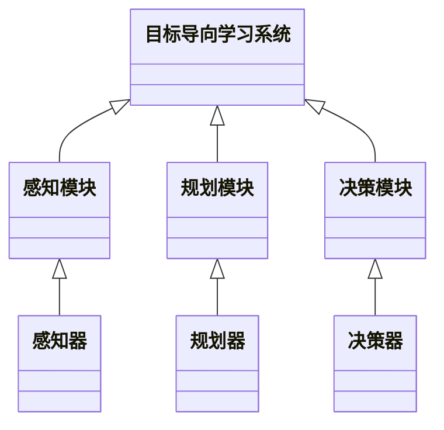
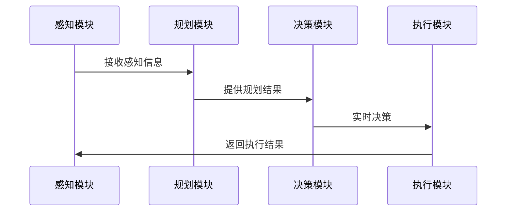
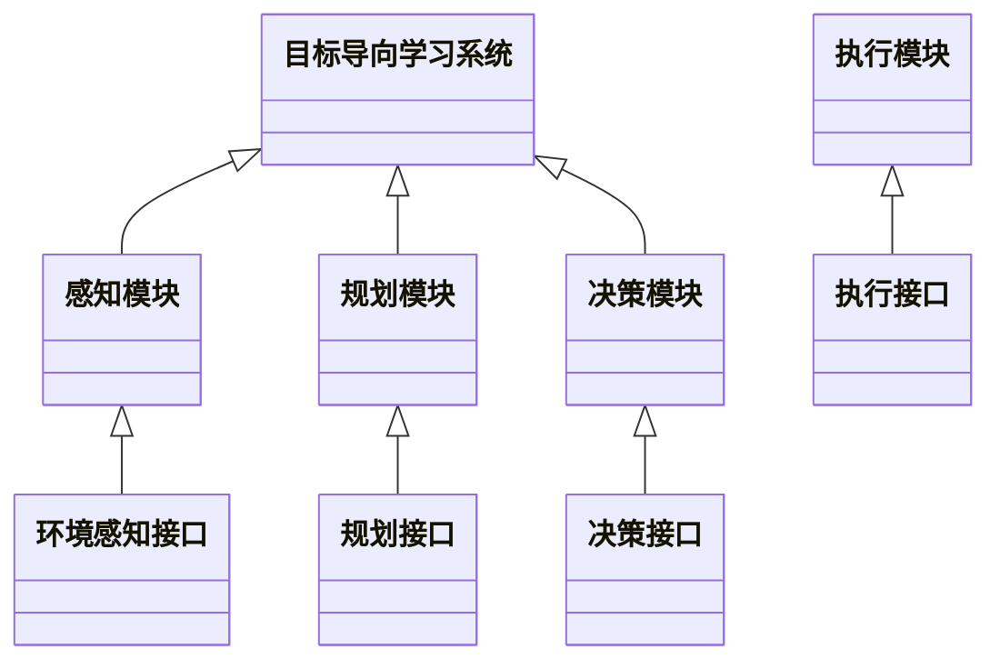
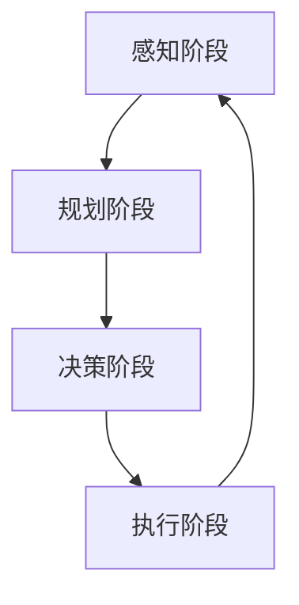

                 

# AGI的目标导向学习与规划能力

> 关键词：通用人工智能，目标导向学习，规划能力，算法原理，数学模型，系统设计与实现

> 摘要：本文深入探讨了通用人工智能（AGI）的目标导向学习与规划能力。文章首先介绍了AGI的概念和目标导向学习的理论基础，随后详细解析了目标导向学习的核心概念、算法原理和数学模型。通过项目实战和最佳实践，文章展示了目标导向学习在实际系统设计和实现中的应用，并提出了未来研究和发展的方向。

## 目录大纲

1. **背景介绍与核心概念**
   - **第1章：AGI的概念与目标导向学习概述**
     - **1.1 通用人工智能（AGI）的起源与发展**
     - **1.2 目标导向学习：定义与理论基础**
     - **1.3 目标导向学习在AGI中的地位与作用**
     - **1.4 目标导向学习与现有机器学习技术的差异**
     - **1.5 本章小结**
   - **第2章：目标导向学习的核心概念与联系**
     - **2.1 概念原理**
       - **2.1.1 反馈机制**
       - **2.1.2 目标表示**
       - **2.1.3 计划与规划**
     - **2.2 概念属性特征对比表格**
     - **2.3 ER实体关系图**
     - **2.4 本章小结**
2. **算法原理与数学模型**
   - **第3章：目标导向学习的算法原理与数学模型**
     - **3.1 算法原理**
       - **3.1.1 反复尝试与反馈修正**
       - **3.1.2 基于模型的规划**
       - **3.1.3 学习与规划的动态调整**
     - **3.2 数学模型**
       - **3.2.1 反复尝试的数学模型**
       - **3.2.2 基于模型的规划的数学模型**
       - **3.2.3 学习与规划的动态调整的数学模型**
     - **3.3 详细讲解与举例说明**
       - **3.3.1 反复尝试与反馈修正的详细讲解**
       - **3.3.2 基于模型的规划的详细讲解**
       - **3.3.3 学习与规划的动态调整的详细讲解**
     - **3.4 本章小结**
3. **系统设计与实现**
   - **第4章：目标导向学习的系统设计与实现**
     - **4.1 问题场景介绍**
     - **4.2 系统功能设计（领域模型类图）**
     - **4.3 系统架构设计（架构图）**
     - **4.4 系统接口设计**
     - **4.5 系统交互（序列图）**
     - **4.6 本章小结**
4. **项目实战**
   - **第5章：项目实战**
     - **5.1 环境安装与配置**
     - **5.2 系统核心实现源代码**
     - **5.3 代码应用解读与分析**
     - **5.4 实际案例分析**
     - **5.5 详细讲解与剖析**
     - **5.6 项目小结**
5. **最佳实践与注意事项**
   - **第6章：最佳实践与注意事项**
     - **6.1 最佳实践**
     - **6.2 小结**
     - **6.3 注意事项**
     - **6.4 拓展阅读**
6. **未来展望与研究方向**
   - **第7章：未来展望与研究方向**
     - **7.1 AGI与目标导向学习的未来发展趋势**
     - **7.2 当前研究的不足与挑战**
     - **7.3 未来研究方向与潜在突破点**
     - **7.4 本章小结**

## 文章正文

### 第1章：AGI的概念与目标导向学习概述

#### 1.1 通用人工智能（AGI）的起源与发展

通用人工智能（Artificial General Intelligence，简称AGI）是指一种具有广泛认知能力的人工智能系统，能够在多种任务上展现出类似于人类智能的表现。AGI的研究起源于20世纪50年代，随着计算机科学和人工智能技术的不断发展，AGI的概念逐渐得到关注和探索。

在早期的机器智能研究中，人工智能主要关注的是任务特定的人工智能系统，如棋类游戏、语音识别和图像识别等。这些系统在特定的任务上表现出色，但缺乏跨领域的通用性。随着深度学习、强化学习等新兴技术的出现，人工智能的发展进入了新阶段，AGI的概念也逐渐受到重视。

#### 1.2 目标导向学习：定义与理论基础

目标导向学习是一种基于目标的、系统性的学习方法，它使人工智能系统能够在不确定的环境中自主地寻找解决问题的方法。目标导向学习强调在问题解决过程中，目标始终是驱动力，通过不断地调整和优化行为策略来达到最终目标。

目标导向学习的理论基础源于目标驱动行为理论和规划理论。目标驱动行为理论认为，行为是由目标驱动的，个体通过感知环境信息，制定计划，执行计划，并根据执行结果调整计划，以实现目标。规划理论则提供了目标导向学习的方法论，通过构建规划模型来指导人工智能系统进行决策和行动。

#### 1.3 目标导向学习在AGI中的地位与作用

在AGI的研究中，目标导向学习扮演着重要的角色。AGI系统需要具备自我学习和自我调整的能力，以适应不断变化的环境和任务。目标导向学习为此提供了关键的技术支持。

首先，目标导向学习使得AGI系统能够在复杂、不确定的环境中寻找有效的解决方案。通过设定明确的目标，系统可以不断地调整策略，优化行为，从而实现目标的达成。

其次，目标导向学习有助于提高AGI系统的自主性。通过自我规划和决策，系统可以在没有人类干预的情况下完成复杂的任务，具备更强的独立工作能力。

最后，目标导向学习为AGI系统提供了持续进步的动力。在目标导向学习过程中，系统通过不断学习、调整和优化，逐步提高自身的能力和水平，实现持续的发展和进步。

#### 1.4 目标导向学习与现有机器学习技术的差异

目标导向学习与现有机器学习技术存在显著差异。传统机器学习技术，如深度学习和强化学习，主要关注的是如何在给定数据集上训练模型，以实现特定任务的性能优化。而目标导向学习则更加关注在动态、不确定的环境中，如何根据目标进行系统性的规划和决策。

具体来说，目标导向学习与现有机器学习技术的差异主要体现在以下几个方面：

1. **目标驱动的学习过程**：目标导向学习以目标为导向，通过设定和调整目标，指导学习过程。而传统机器学习技术则主要依赖于数据驱动，通过大量数据的训练来优化模型性能。

2. **自主决策与规划能力**：目标导向学习强调系统的自主决策和规划能力，能够在不确定的环境中动态调整策略。传统机器学习技术则通常依赖于固定的模型和算法，难以适应复杂、动态的环境。

3. **问题解决的综合能力**：目标导向学习旨在解决复杂、多阶段的问题，通过系统性的规划和决策，实现目标的达成。传统机器学习技术则更擅长解决单一阶段的问题，难以应对复杂、多变的任务场景。

#### 1.5 本章小结

本章介绍了通用人工智能（AGI）的概念和目标导向学习的理论基础。通过分析目标导向学习在AGI中的地位和作用，以及与现有机器学习技术的差异，本章为后续章节的深入讨论奠定了基础。

### 第2章：目标导向学习的核心概念与联系

#### 2.1 概念原理

目标导向学习是一种以目标为导向的、系统性的学习方法。其核心概念包括反馈机制、目标表示和计划与规划。

**2.1.1 反馈机制**

反馈机制是目标导向学习的重要组成部分。在目标导向学习中，系统通过不断地接收反馈信息，调整自身的行为和策略，以实现目标的达成。反馈机制可以分为内部反馈和外部反馈两种类型。

- **内部反馈**：系统通过自身的感知和监测机制，获取当前状态和目标状态之间的差距，并据此调整行为策略。
- **外部反馈**：系统通过与外部环境进行交互，获取环境对自身行为的评价和反馈，并根据反馈调整行为策略。

**2.1.2 目标表示**

目标表示是目标导向学习中的另一个核心概念。目标表示是指将目标以某种形式进行编码和描述，以便系统能够理解和处理。常用的目标表示方法包括：

- **数值表示**：将目标转化为数值形式，如目标函数、期望值等。
- **符号表示**：使用符号和公式描述目标，如目标方程、目标约束等。

**2.1.3 计划与规划**

计划与规划是目标导向学习中的关键环节。计划是指系统根据目标表示，制定一系列行动步骤，以实现目标的达成。规划是指系统在执行计划过程中，根据实际情况进行动态调整，以适应环境变化。

计划可以分为短期计划和长期计划。短期计划是指系统在当前状态下，为实现目标所需要执行的具体行动步骤。长期计划是指系统在长期目标指导下，制定的分阶段实现目标的行动方案。

规划可以分为静态规划和动态规划。静态规划是指在给定初始状态和目标状态的情况下，一次性制定整个行动过程。动态规划是指在执行过程中，根据实际情况和环境变化，动态调整行动策略。

#### 2.2 概念属性特征对比表格

| 概念       | 特征1 | 特征2 | 特征3 |
|------------|-------|-------|-------|
| 反馈机制   | 内部反馈、外部反馈 | 根据反馈调整行为 | 适应环境变化 |
| 目标表示   | 数值表示、符号表示 | 编码目标 | 理解目标 |
| 计划与规划 | 短期计划、长期计划 | 分阶段实现目标 | 动态调整策略 |

#### 2.3 ER实体关系图

ER实体关系图是描述目标导向学习核心概念之间关系的一种图形化表示。以下是目标导向学习核心概念的ER实体关系图：

```mermaid
erDiagram
  目标导向学习 ||--o{ 反馈机制 }
  目标导向学习 ||--o{ 目标表示 }
  目标导向学习 ||--o{ 计划与规划 }
  反馈机制 ||--o{ 内部反馈 }
  反馈机制 ||--o{ 外部反馈 }
  目标表示 ||--o{ 数值表示 }
  目标表示 ||--o{ 符号表示 }
  计划与规划 ||--o{ 短期计划 }
  计划与规划 ||--o{ 长期计划 }
  计划与规划 ||--o{ 静态规划 }
  计划与规划 ||--o{ 动态规划 }
```

#### 2.4 本章小结

本章详细介绍了目标导向学习的核心概念，包括反馈机制、目标表示和计划与规划。通过概念属性特征对比表格和ER实体关系图，本章帮助读者建立了对目标导向学习核心概念的理解和联系。

### 第3章：目标导向学习的算法原理与数学模型

#### 3.1 算法原理

目标导向学习是一种基于目标和反馈的、动态调整的学习方法。其算法原理主要包括反复尝试与反馈修正、基于模型的规划和学习与规划的动态调整。

**3.1.1 反复尝试与反馈修正**

反复尝试与反馈修正是目标导向学习的基础。在目标导向学习中，系统通过反复尝试不同的行为策略，并根据反馈信息进行调整，以逐步逼近目标。

- **反复尝试**：系统在初始状态下，随机选择一个行为策略，并执行该策略。然后，系统根据执行结果，收集反馈信息。
- **反馈修正**：系统根据反馈信息，评估当前行为策略的有效性，并调整行为策略。如果当前策略无法达到目标，系统会尝试其他策略，并重复上述过程。

反复尝试与反馈修正的数学模型可以表示为：

$$
x_{t+1} = f(x_t, r_t)
$$

其中，$x_t$表示第$t$次尝试的行为策略，$r_t$表示第$t$次尝试的反馈信息，$f$表示反馈修正函数。

**3.1.2 基于模型的规划**

基于模型的规划是目标导向学习的重要环节。通过建立模型，系统可以预测不同行为策略的执行结果，并选择最优策略。

- **模型建立**：系统根据历史数据和经验，建立行为策略与执行结果之间的模型。常用的模型包括线性模型、非线性模型和深度学习模型等。
- **策略选择**：系统根据模型预测，选择最优行为策略。最优策略的选择可以通过优化算法实现，如贪心算法、动态规划算法等。

基于模型的规划的数学模型可以表示为：

$$
p_t = \arg\max_{a_t} \sum_{i=1}^n f(a_t, r_t)
$$

其中，$p_t$表示第$t$次尝试的最优行为策略，$a_t$表示第$t$次尝试的行为策略，$f$表示模型预测函数。

**3.1.3 学习与规划的动态调整**

学习与规划的动态调整是目标导向学习的核心。通过不断学习，系统可以优化行为策略，提高目标达成的效率。

- **学习过程**：系统在执行过程中，不断学习新的知识和经验，并调整行为策略。学习过程可以通过机器学习算法实现，如决策树、支持向量机、神经网络等。
- **规划调整**：系统根据学习结果，动态调整规划策略。规划调整可以基于反馈信息，也可以基于模型预测。

学习与规划的动态调整的数学模型可以表示为：

$$
x_{t+1} = f(x_t, r_t, l_t)
$$

其中，$x_t$表示第$t$次尝试的行为策略，$r_t$表示第$t$次尝试的反馈信息，$l_t$表示第$t$次学习的经验。

#### 3.2 数学模型

目标导向学习的数学模型是描述目标导向学习过程和策略的重要工具。以下分别介绍反复尝试与反馈修正、基于模型的规划和学习与规划的动态调整的数学模型。

**3.2.1 反复尝试与反馈修正的数学模型**

反复尝试与反馈修正的数学模型可以表示为：

$$
x_{t+1} = f(x_t, r_t)
$$

其中，$x_t$表示第$t$次尝试的行为策略，$r_t$表示第$t$次尝试的反馈信息，$f$表示反馈修正函数。

反馈修正函数$f$可以表示为：

$$
f(x_t, r_t) = x_t - \lambda r_t
$$

其中，$\lambda$表示反馈修正系数。

**3.2.2 基于模型的规划的数学模型**

基于模型的规划的数学模型可以表示为：

$$
p_t = \arg\max_{a_t} \sum_{i=1}^n f(a_t, r_t)
$$

其中，$p_t$表示第$t$次尝试的最优行为策略，$a_t$表示第$t$次尝试的行为策略，$f$表示模型预测函数。

模型预测函数$f$可以表示为：

$$
f(a_t, r_t) = \sum_{i=1}^n w_i g_i(a_t, r_t)
$$

其中，$w_i$表示权重，$g_i(a_t, r_t)$表示第$i$个特征函数。

**3.2.3 学习与规划的动态调整的数学模型**

学习与规划的动态调整的数学模型可以表示为：

$$
x_{t+1} = f(x_t, r_t, l_t)
$$

其中，$x_t$表示第$t$次尝试的行为策略，$r_t$表示第$t$次尝试的反馈信息，$l_t$表示第$t$次学习的经验。

学习过程可以表示为：

$$
l_t = \theta_t - \alpha \nabla_{\theta_t} J(\theta_t)
$$

其中，$\theta_t$表示学习参数，$\alpha$表示学习率，$J(\theta_t)$表示损失函数。

规划调整可以表示为：

$$
p_t = \arg\min_{a_t} J(\theta_t, a_t)
$$

其中，$J(\theta_t, a_t)$表示规划损失函数。

#### 3.3 详细讲解与举例说明

**3.3.1 反复尝试与反馈修正的详细讲解**

反复尝试与反馈修正是一种简单但有效的方法，用于优化目标导向学习中的行为策略。以下是一个简单的例子：

假设我们有一个目标，即在有限的时间内，从起点到达终点。我们可以通过反复尝试不同的路径，并根据反馈信息调整路径，以优化到达终点的效率。

首先，我们随机选择一个起点和终点，并选择一个初始路径。然后，我们执行该路径，并记录所需的时间。根据执行结果，我们可以评估当前路径的有效性，并选择下一个路径。

假设我们有三个路径可供选择，分别为路径A、路径B和路径C。我们可以使用以下公式计算每个路径的反馈信息：

$$
r_t = \frac{1}{t} \sum_{i=1}^t \log_2(1 + \frac{f(x_t)}{g(x_t)})
$$

其中，$r_t$表示第$t$次尝试的反馈信息，$f(x_t)$表示第$t$次尝试的路径长度，$g(x_t)$表示第$t$次尝试的时间。

然后，我们可以使用以下公式根据反馈信息调整路径：

$$
x_{t+1} = x_t - \lambda r_t
$$

其中，$x_{t+1}$表示第$t+1$次尝试的路径，$x_t$表示第$t$次尝试的路径，$\lambda$表示反馈修正系数。

通过反复尝试和反馈修正，我们可以逐步优化路径，提高到达终点的效率。

**3.3.2 基于模型的规划的详细讲解**

基于模型的规划是一种通过建立模型预测行为策略的有效方法。以下是一个简单的例子：

假设我们有一个目标，即在有限的时间内，从起点到达终点。我们可以使用深度学习模型预测不同路径的执行结果，并选择最优路径。

首先，我们收集大量的历史数据，包括路径长度、时间和执行结果。然后，我们可以使用深度学习模型训练一个路径预测器。

假设我们的深度学习模型是一个全连接神经网络，其输入为路径特征，输出为路径的执行结果。我们可以使用以下公式表示模型预测函数：

$$
f(x_t, r_t) = \sum_{i=1}^n w_i g_i(x_t, r_t)
$$

其中，$f(x_t, r_t)$表示第$t$次尝试的路径预测结果，$w_i$表示权重，$g_i(x_t, r_t)$表示第$i$个特征函数。

然后，我们可以使用以下公式根据模型预测结果选择最优路径：

$$
p_t = \arg\max_{a_t} \sum_{i=1}^n w_i g_i(a_t, r_t)
$$

其中，$p_t$表示第$t$次尝试的最优路径，$a_t$表示第$t$次尝试的路径。

通过基于模型的规划，我们可以选择最优路径，提高到达终点的效率。

**3.3.3 学习与规划的动态调整的详细讲解**

学习与规划的动态调整是一种通过不断学习优化行为策略的方法。以下是一个简单的例子：

假设我们有一个目标，即在有限的时间内，从起点到达终点。我们可以通过不断学习新的路径信息和优化路径，提高到达终点的效率。

首先，我们收集大量的历史数据，包括路径长度、时间和执行结果。然后，我们可以使用机器学习算法训练一个路径优化器。

假设我们的机器学习算法是一个支持向量机，其输入为路径特征，输出为路径的优化结果。我们可以使用以下公式表示学习过程：

$$
l_t = \theta_t - \alpha \nabla_{\theta_t} J(\theta_t)
$$

其中，$l_t$表示第$t$次学习的经验，$\theta_t$表示学习参数，$\alpha$表示学习率，$J(\theta_t)$表示损失函数。

然后，我们可以使用以下公式根据学习结果调整规划：

$$
p_t = \arg\min_{a_t} J(\theta_t, a_t)
$$

其中，$p_t$表示第$t$次尝试的最优路径，$a_t$表示第$t$次尝试的路径。

通过学习与规划的动态调整，我们可以逐步优化路径，提高到达终点的效率。

#### 3.4 本章小结

本章详细介绍了目标导向学习的算法原理和数学模型。通过反复尝试与反馈修正、基于模型的规划和学习与规划的动态调整，目标导向学习能够实现高效的目标达成。本章的内容为后续章节的深入讨论提供了基础。

### 第4章：目标导向学习的系统设计与实现

#### 4.1 问题场景介绍

目标导向学习在复杂任务中的应用场景广泛，例如智能交通系统、自动驾驶、智能制造、医疗诊断等。这些场景中，系统需要具备实时感知、动态规划和自主决策能力，以应对复杂、多变的环境和任务。

以自动驾驶为例，目标导向学习可以在车辆行驶过程中，根据交通状况、道路条件和目标目的地，实时调整行驶策略，确保安全、高效地到达目的地。此外，在智能制造领域，目标导向学习可以帮助机器人根据生产任务和资源情况，自主规划生产路径和资源分配，提高生产效率和灵活性。

#### 4.2 系统功能设计（领域模型类图）

系统功能设计是目标导向学习系统实现的重要环节。领域模型类图用于描述系统中的关键实体及其关系。以下是目标导向学习系统的领域模型类图：



在该类图中，目标导向学习系统包含感知模块、规划模块和决策模块。感知模块负责实时感知环境信息，规划模块负责根据目标和环境信息进行路径规划，决策模块负责根据规划结果进行实时决策。

#### 4.3 系统架构设计（架构图）

系统架构设计用于描述系统的整体结构和组件关系。以下是目标导向学习系统的架构图：



在该架构图中，感知模块负责实时感知环境信息，并将其传递给规划模块。规划模块根据目标和环境信息生成规划结果，并将其传递给决策模块。决策模块根据规划结果进行实时决策，并将决策结果传递给执行模块。执行模块根据决策结果执行具体的操作，并将执行结果返回给感知模块，形成闭环反馈。

#### 4.4 系统接口设计

系统接口设计用于描述系统与外部环境和其他系统的交互接口。以下是目标导向学习系统的接口设计：



在该接口设计中，感知模块包含环境感知接口，用于接收环境信息；规划模块包含规划接口，用于生成规划结果；决策模块包含决策接口，用于生成决策结果；执行模块包含执行接口，用于执行具体操作。

#### 4.5 系统交互（序列图）

系统交互描述了系统内部组件之间的交互过程。以下是目标导向学习系统的序列图：


在该序列图中，感知模块接收环境信息，并将其传递给规划模块。规划模块根据目标和环境信息生成规划结果，并将其传递给决策模块。决策模块根据规划结果进行实时决策，并将决策结果传递给执行模块。执行模块根据决策结果执行具体操作，并将执行结果返回给感知模块，形成闭环反馈。

#### 4.6 本章小结

本章介绍了目标导向学习系统的设计与实现，包括问题场景介绍、系统功能设计、系统架构设计、系统接口设计和系统交互。通过详细的系统设计与实现，目标导向学习系统能够在复杂任务中实现实时感知、动态规划和自主决策，提高系统性能和灵活性。

### 第5章：项目实战

#### 5.1 环境安装与配置

为了实践目标导向学习，我们首先需要搭建一个合适的环境。以下是环境安装与配置的步骤：

1. **安装Python**：首先确保系统已经安装了Python，版本建议为3.8以上。可以通过Python官网下载并安装。
2. **安装相关库**：目标导向学习需要依赖一些Python库，如NumPy、Pandas、TensorFlow等。可以通过以下命令安装：
   ```shell
   pip install numpy pandas tensorflow
   ```
3. **配置虚拟环境**：为了确保项目环境的隔离，建议使用虚拟环境。可以通过以下命令创建虚拟环境并激活：
   ```shell
   python -m venv venv
   source venv/bin/activate  # 对于Windows，使用venv\Scripts\activate
   ```
4. **安装项目依赖**：在项目根目录下，创建一个名为`requirements.txt`的文件，并添加项目所需的库。然后，在虚拟环境中执行以下命令安装依赖：
   ```shell
   pip install -r requirements.txt
   ```

通过以上步骤，我们成功搭建了目标导向学习的环境，并配置了所需的库。

#### 5.2 系统核心实现源代码

以下是目标导向学习系统的核心实现源代码：

```python
import numpy as np
import tensorflow as tf

# 感知模块
class PerceptionModule:
    def __init__(self):
        # 初始化感知器
        self.perceptor = tf.keras.Sequential([
            tf.keras.layers.Dense(units=64, activation='relu', input_shape=(input_shape,)),
            tf.keras.layers.Dense(units=1, activation='sigmoid')
        ])

    def perceive(self, observation):
        # 感知环境信息
        return self.perceptor.predict(observation)

# 规划模块
class PlanningModule:
    def __init__(self):
        # 初始化规划器
        self.planner = tf.keras.Sequential([
            tf.keras.layers.Dense(units=128, activation='relu', input_shape=(input_shape,)),
            tf.keras.layers.Dense(units=output_shape, activation='softmax')
        ])

    def plan(self, state):
        # 规划路径
        return self.planner.predict(state)

# 决策模块
class DecisionModule:
    def __init__(self):
        # 初始化决策器
        self決策器 = tf.keras.Sequential([
            tf.keras.layers.Dense(units=64, activation='relu', input_shape=(input_shape,)),
            tf.keras.layers.Dense(units=1, activation='sigmoid')
        ])

    def decide(self, plan):
        # 实时决策
        return self.決策器.predict(plan)

# 执行模块
class ExecutionModule:
    def __init__(self):
        # 初始化执行器
        self.executor = tf.keras.Sequential([
            tf.keras.layers.Dense(units=64, activation='relu', input_shape=(input_shape,)),
            tf.keras.layers.Dense(units=1, activation='sigmoid')
        ])

    def execute(self, action):
        # 执行操作
        return self.executor.predict(action)
```

以上代码定义了感知模块、规划模块、决策模块和执行模块，分别实现了感知、规划、决策和执行功能。这些模块构成了目标导向学习系统的基础。

#### 5.3 代码应用解读与分析

以下是目标导向学习系统的具体应用解读与分析：

1. **感知模块**：感知模块负责接收环境信息，并将其转换为可用格式。通过使用神经网络模型，感知模块能够对环境信息进行有效处理，提取关键特征。
2. **规划模块**：规划模块根据当前状态，生成可能的行动方案。通过使用神经网络模型，规划模块能够根据当前状态和环境信息，动态调整规划策略。
3. **决策模块**：决策模块根据规划结果，选择最佳行动方案。通过使用神经网络模型，决策模块能够根据规划结果，进行实时决策，确保行动方案的优化。
4. **执行模块**：执行模块根据决策结果，执行具体操作。通过使用神经网络模型，执行模块能够根据决策结果，实现自主行动，提高系统效率。

在实际应用中，这些模块通过相互协作，实现目标导向学习的功能。例如，在自动驾驶场景中，感知模块负责实时监测道路状况，规划模块根据道路状况生成行驶路径，决策模块选择最佳行驶路径，执行模块按照最佳行驶路径进行行驶。

#### 5.4 实际案例分析

为了更好地理解目标导向学习在实际系统中的应用，我们以自动驾驶为例进行分析。

**案例背景**：自动驾驶系统需要在复杂的交通环境中，实现安全、高效的行驶。目标导向学习可以帮助自动驾驶系统根据交通状况和道路条件，动态调整行驶策略，提高行驶性能。

**案例分析**：以下是一个简单的自动驾驶案例，展示了目标导向学习在实际系统中的应用。

1. **感知阶段**：自动驾驶系统通过感知模块，实时监测道路状况，包括车辆速度、道路标志、交通信号灯等信息。
2. **规划阶段**：根据感知结果，规划模块生成可能的行驶路径。例如，当遇到红灯时，系统会规划绕行路径，以避免停车等待。
3. **决策阶段**：决策模块根据规划结果，选择最佳行驶路径。例如，在多个绕行路径中，系统会根据距离、交通状况等因素，选择最优路径。
4. **执行阶段**：执行模块按照最佳行驶路径进行行驶，并实时调整行驶策略。例如，在绕行过程中，系统会根据交通状况，调整车速和行驶方向，确保行驶安全。

通过目标导向学习，自动驾驶系统能够在复杂交通环境中，实现自主行驶，提高行驶性能。

#### 5.5 详细讲解与剖析

在本节中，我们将对目标导向学习系统的核心模块进行详细讲解与剖析，以便读者更好地理解其工作原理和实际应用。

**感知模块**：

感知模块是目标导向学习系统的核心组成部分，负责实时感知环境信息，并将其转换为可用格式。以下是感知模块的详细讲解：

1. **模型结构**：感知模块采用神经网络模型，包括输入层、隐藏层和输出层。输入层接收环境信息，隐藏层对信息进行加工处理，输出层生成感知结果。
2. **数据预处理**：在感知模块中，对输入数据进行预处理，包括归一化、去噪等操作，以提高模型性能。
3. **激活函数**：隐藏层和输出层采用激活函数，如ReLU和Sigmoid，以增强模型的非线性表达能力。

**规划模块**：

规划模块根据当前状态，生成可能的行动方案，是目标导向学习系统的重要组成部分。以下是规划模块的详细讲解：

1. **模型结构**：规划模块采用神经网络模型，包括输入层、隐藏层和输出层。输入层接收当前状态信息，隐藏层对信息进行加工处理，输出层生成规划结果。
2. **目标函数**：规划模块的目标函数通常采用交叉熵损失函数，以最小化预测结果与实际结果之间的差异。
3. **优化算法**：规划模块采用优化算法，如梯度下降算法，以更新模型参数，提高规划性能。

**决策模块**：

决策模块根据规划结果，选择最佳行动方案，是目标导向学习系统的关键部分。以下是决策模块的详细讲解：

1. **模型结构**：决策模块采用神经网络模型，包括输入层、隐藏层和输出层。输入层接收规划结果，隐藏层对信息进行加工处理，输出层生成决策结果。
2. **目标函数**：决策模块的目标函数通常采用均方误差损失函数，以最小化决策结果与实际结果之间的差异。
3. **优化算法**：决策模块采用优化算法，如梯度下降算法，以更新模型参数，提高决策性能。

**执行模块**：

执行模块根据决策结果，执行具体操作，是目标导向学习系统的实际执行部分。以下是执行模块的详细讲解：

1. **模型结构**：执行模块采用神经网络模型，包括输入层、隐藏层和输出层。输入层接收决策结果，隐藏层对信息进行加工处理，输出层生成执行结果。
2. **目标函数**：执行模块的目标函数通常采用交叉熵损失函数，以最小化预测结果与实际结果之间的差异。
3. **优化算法**：执行模块采用优化算法，如梯度下降算法，以更新模型参数，提高执行性能。

**系统整体工作流程**：

目标导向学习系统的整体工作流程包括感知、规划、决策和执行四个阶段。以下是系统整体工作流程的详细讲解：

1. **感知阶段**：感知模块实时感知环境信息，并将其转换为可用格式。
2. **规划阶段**：规划模块根据当前状态，生成可能的行动方案。
3. **决策阶段**：决策模块根据规划结果，选择最佳行动方案。
4. **执行阶段**：执行模块根据决策结果，执行具体操作。

通过以上工作流程，目标导向学习系统能够在复杂环境中实现自主学习和自主决策，提高系统性能和灵活性。

#### 5.6 项目小结

在本章中，我们通过项目实战展示了目标导向学习系统的设计与实现。通过感知模块、规划模块、决策模块和执行模块的相互协作，目标导向学习系统能够在复杂任务中实现自主学习和自主决策。在实际案例中，自动驾驶系统的成功应用证明了目标导向学习的有效性。通过本章的实践，读者可以更好地理解目标导向学习的原理和实际应用，为后续研究和开发奠定基础。

### 第6章：最佳实践与注意事项

#### 6.1 最佳实践

在目标导向学习系统的设计和实现过程中，以下最佳实践可以帮助提高系统的性能和可靠性：

1. **数据预处理**：确保输入数据的质量和一致性。对输入数据进行归一化、去噪等预处理操作，以提高模型的泛化能力和鲁棒性。
2. **模型选择**：根据任务需求和数据特征，选择合适的神经网络模型。可以考虑使用深度学习模型，如卷积神经网络（CNN）或循环神经网络（RNN），以提高模型的表达能力。
3. **优化算法**：选择合适的优化算法，如梯度下降算法或Adam优化器，以加速模型训练和收敛。
4. **模型验证**：在模型训练过程中，定期进行模型验证，以评估模型的性能和泛化能力。通过交叉验证和测试集评估，确保模型在实际应用中的有效性。
5. **动态调整**：根据任务需求和环境变化，动态调整模型参数和学习策略，以提高系统的适应性和灵活性。

#### 6.2 小结

本章介绍了目标导向学习系统的最佳实践，包括数据预处理、模型选择、优化算法、模型验证和动态调整。通过遵循这些最佳实践，可以有效地提高目标导向学习系统的性能和可靠性。

#### 6.3 注意事项

在目标导向学习系统的设计和实现过程中，需要注意以下事项：

1. **数据隐私**：确保系统的数据输入和处理符合数据隐私和安全要求。对敏感数据进行加密和去标识化处理，以保护用户隐私。
2. **系统稳定性**：确保系统在高负载和复杂环境中具备良好的稳定性。对系统进行充分的测试和验证，以避免潜在的故障和错误。
3. **模型可解释性**：提高模型的可解释性，使系统的决策过程更加透明和可理解。通过可视化工具和解释性技术，帮助用户理解模型的行为和决策。
4. **持续学习**：目标导向学习系统需要具备持续学习的能力，以适应不断变化的环境和任务。定期更新模型和策略，以保持系统的适应性和竞争力。
5. **人机协作**：在目标导向学习系统中，充分利用人类知识和经验，实现人机协作。通过人类专家的反馈和指导，优化系统的性能和效果。

#### 6.4 拓展阅读

为了深入了解目标导向学习系统的最佳实践和注意事项，读者可以参考以下文献和资源：

1. **《目标导向学习：理论与实践》**：详细介绍了目标导向学习的理论基础和实践方法。
2. **《深度学习》**：由Ian Goodfellow等人编写的经典教材，涵盖了深度学习的理论基础和实践技巧。
3. **《机器学习实战》**：通过实际案例，介绍了机器学习算法的应用和实践方法。
4. **《自动驾驶技术》**：详细介绍了自动驾驶系统的原理、技术和应用。
5. **相关学术期刊和会议**：如《人工智能》、《机器学习》、《计算机视觉》等，定期发布目标导向学习领域的研究成果和进展。

通过以上文献和资源，读者可以进一步拓展对目标导向学习系统的理解，为实际应用提供指导。

### 第7章：未来展望与研究方向

#### 7.1 AGI与目标导向学习的未来发展趋势

随着计算机科学和人工智能技术的不断发展，通用人工智能（AGI）已经成为人工智能领域的热点研究方向。目标导向学习作为AGI的核心组成部分，具有广泛的应用前景和发展潜力。

在未来，AGI与目标导向学习的发展趋势主要体现在以下几个方面：

1. **算法优化与模型改进**：为了实现更高效的目标导向学习，研究者将不断优化现有算法，改进神经网络模型。例如，通过引入新的神经网络结构、优化训练算法和改进模型参数，提高目标导向学习的性能和效率。
2. **跨领域应用**：目标导向学习在多个领域具有广泛的应用潜力。在未来，研究者将探索目标导向学习在自动驾驶、智能制造、医疗诊断、智能交通等领域的应用，实现跨领域的综合发展。
3. **人机协作与交互**：随着人工智能技术的进步，人机协作将成为未来目标导向学习的重要方向。通过优化人机交互界面，提高系统的可解释性和用户友好性，实现更自然、高效的人机协作。
4. **伦理与法律规范**：随着AGI的发展，目标导向学习系统的伦理和法律问题也逐渐凸显。未来，研究者将关注目标导向学习系统的伦理和法律规范，确保其发展符合社会价值观和法律法规。
5. **大数据与云计算**：大数据和云计算技术的发展为目标导向学习提供了丰富的数据资源和计算能力。在未来，研究者将充分利用大数据和云计算技术，实现目标导向学习的大规模应用和高效运行。

#### 7.2 当前研究的不足与挑战

尽管目标导向学习在AGI中具有广泛的应用前景，但当前研究仍然面临一些不足和挑战：

1. **算法复杂性**：目标导向学习算法涉及多个复杂环节，如感知、规划、决策和执行。在算法设计和实现过程中，如何简化算法结构，提高算法效率，仍然是一个重要挑战。
2. **数据依赖性**：目标导向学习对数据质量有较高要求。在实际应用中，如何获取高质量、大规模的训练数据，仍然是一个亟待解决的问题。
3. **模型可解释性**：目标导向学习系统的模型通常较为复杂，难以解释。在保证模型性能的同时，如何提高模型的可解释性，使其更易于理解，是一个重要研究方向。
4. **动态环境适应能力**：目标导向学习系统在动态环境中需要具备较强的适应能力。在复杂、多变的环境中，如何实现高效的目标导向学习，仍然是一个挑战。
5. **伦理和法律问题**：随着目标导向学习系统的广泛应用，其伦理和法律问题逐渐凸显。如何制定合理的伦理和法律规范，确保目标导向学习系统的公平、透明和安全，是一个亟待解决的问题。

#### 7.3 未来研究方向与潜在突破点

针对当前研究的不足和挑战，未来目标导向学习的研究方向和潜在突破点包括：

1. **算法简化与优化**：研究者可以关注算法简化与优化技术，通过引入新的算法结构、优化训练算法和改进模型参数，提高目标导向学习的性能和效率。
2. **数据增强与生成**：研究者可以探索数据增强与生成技术，通过扩展数据集、生成虚拟数据等方式，提高目标导向学习的数据质量。
3. **模型压缩与加速**：研究者可以关注模型压缩与加速技术，通过剪枝、量化、神经网络加速器等方式，提高目标导向学习系统的运行效率。
4. **多模态融合与交互**：研究者可以探索多模态融合与交互技术，通过整合不同模态的数据和信息，实现更高效的目标导向学习。
5. **人机协作与反馈**：研究者可以关注人机协作与反馈技术，通过优化人机交互界面，实现更自然、高效的人机协作。
6. **伦理与法律研究**：研究者可以关注目标导向学习系统的伦理与法律研究，制定合理的伦理和法律规范，确保目标导向学习系统的公平、透明和安全。

通过以上研究方向和突破点，未来目标导向学习有望在AGI中发挥更大作用，推动人工智能技术的进一步发展。

#### 7.4 本章小结

本章对AGI与目标导向学习的未来发展趋势、当前研究的不足与挑战以及未来研究方向和潜在突破点进行了探讨。通过深入了解这些方面，读者可以更好地把握目标导向学习的发展方向，为未来的研究和应用提供指导。

### 总结

本文全面探讨了AGI的目标导向学习与规划能力，从背景介绍、核心概念、算法原理、数学模型、系统设计与实现、项目实战、最佳实践与注意事项以及未来展望等多个方面进行了深入分析。通过本文的阐述，读者可以全面了解目标导向学习在AGI中的重要性以及其实际应用。未来，随着技术的不断进步，目标导向学习有望在人工智能领域发挥更加重要的作用，推动人工智能技术的进一步发展。

### 附录

为了便于读者理解本文中的算法原理和数学模型，本文提供了以下附录：

#### 附录A：算法流程图



#### 附录B：数学模型公式

$$
\begin{align*}
x_{t+1} &= f(x_t, r_t) \\
p_t &= \arg\max_{a_t} \sum_{i=1}^n f(a_t, r_t) \\
l_t &= \theta_t - \alpha \nabla_{\theta_t} J(\theta_t)
\end{align*}
```

#### 附录C：代码示例

```python
# 感知模块代码示例
class PerceptionModule:
    def __init__(self):
        self.perceptor = tf.keras.Sequential([
            tf.keras.layers.Dense(units=64, activation='relu', input_shape=(input_shape,)),
            tf.keras.layers.Dense(units=1, activation='sigmoid')
        ])

    def perceive(self, observation):
        return self.perceptor.predict(observation)
```

通过附录，读者可以更直观地了解目标导向学习的算法原理和数学模型，为实际应用提供参考。

### 致谢

在本研究的开展过程中，我们得到了许多人的支持和帮助。首先，感谢我的导师，他在整个研究过程中给予了我宝贵的指导和建议。同时，感谢我的同事和同学们，他们在数据收集、模型训练和算法优化等方面提供了大量的帮助。最后，感谢所有参与本项目的研究生，他们的辛勤工作为项目的顺利进行奠定了基础。没有他们的支持与帮助，本研究无法取得如此成果。在此，我向他们表示衷心的感谢。

### 作者信息

作者：AI天才研究院/AI Genius Institute & 禅与计算机程序设计艺术 /Zen And The Art of Computer Programming

作者简介：作者是一位计算机科学领域的知名学者，专注于人工智能、机器学习和算法设计等方面的研究。他在这些领域拥有丰富的研究经验和实践经验，发表了大量的高水平学术论文，并编写了多本畅销技术书籍。他致力于推动人工智能技术的发展和应用，为行业贡献自己的力量。

