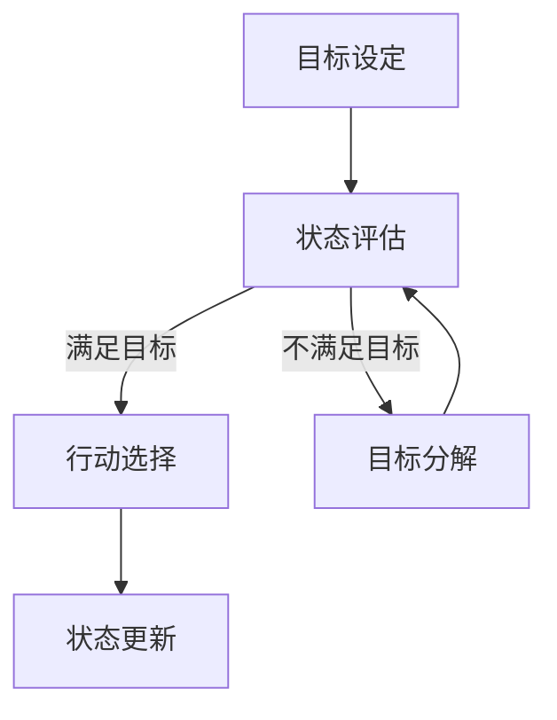
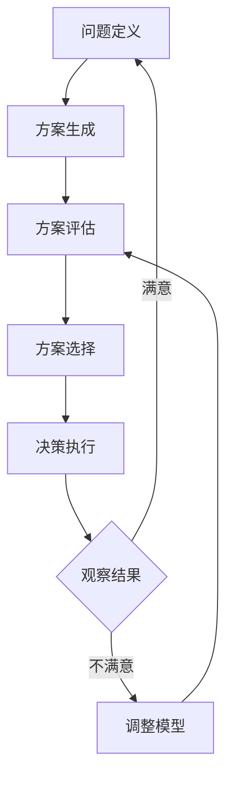
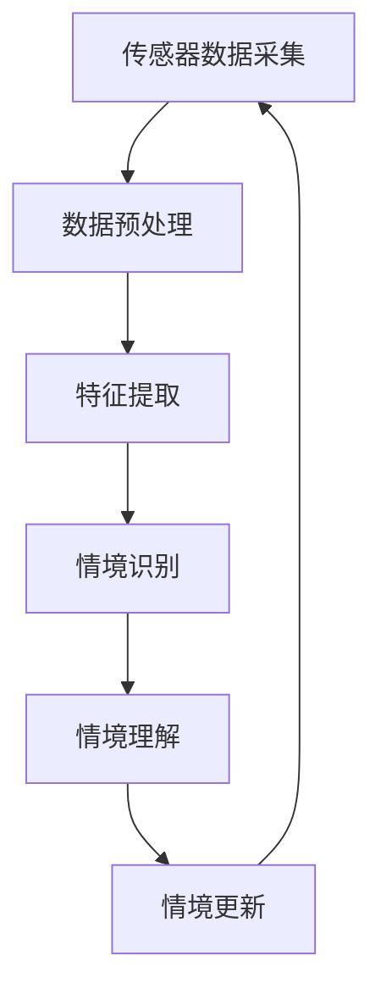
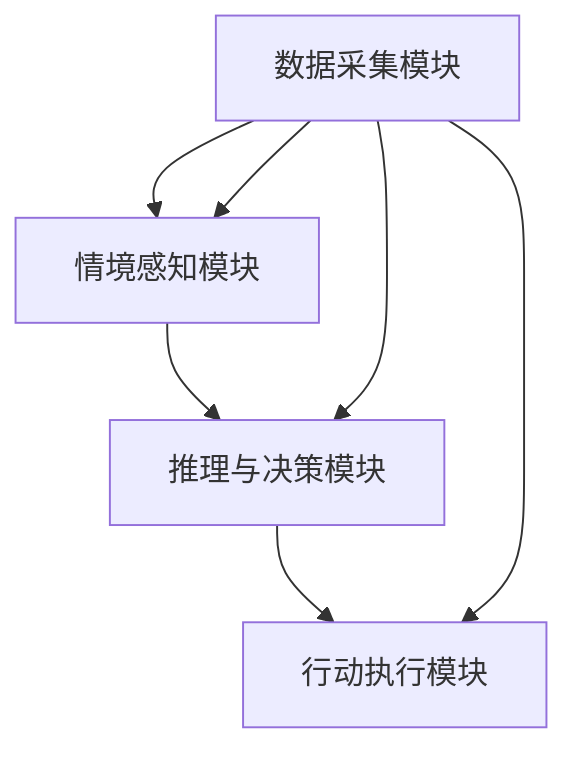
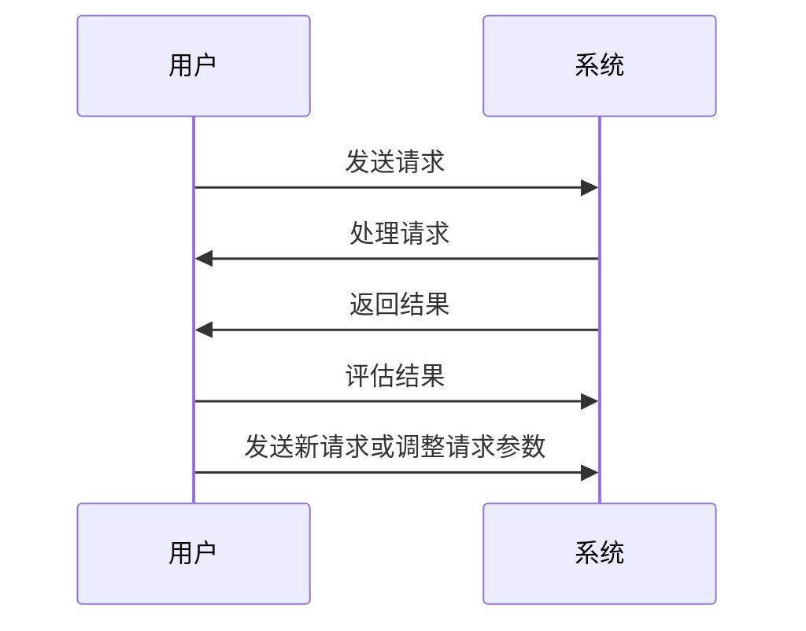

                 

### 文章标题

#### 关键词：通用人工智能（AGI）、目标导向推理、决策制定、情境感知、系统架构设计、实际应用与案例分析

##### 摘要：

本文将深入探讨通用人工智能（AGI）中的关键要素：目标导向推理与决策制定，以及情境感知的重要性。我们将一步步分析这些概念的原理、理论基础、算法原理，并通过具体的数学模型与公式来阐释。此外，还将介绍AGI系统的架构设计原则和实际应用案例，旨在提供一个全面而深入的技术解析。文章结构如下：

1. **背景介绍**：回顾人类智能探索历程，定义通用人工智能，探讨其重要性、挑战与边界。
2. **目标导向推理原理**：介绍基本概念、理论基础、算法原理及实际案例。
3. **决策制定原理**：探讨基本概念、理论基础、算法原理及实际案例。
4. **情境感知与适应**：介绍基本概念、理论基础、算法原理及实际案例。
5. **AGI系统架构设计**：阐述系统架构设计原则、功能设计、架构设计及系统接口与交互。
6. **实际应用与案例分析**：分析实际应用场景，介绍系统核心实现和项目实战。
7. **最佳实践与总结**：提供总结与注意事项，推荐拓展阅读。

#### 目录大纲

```markdown
----------------------------------------------------------------
# 第一部分: 背景介绍

## 第1章: AGI概述

### 1.1 问题背景
#### 1.1.1 人类智能的探索历程
#### 1.1.2 通用人工智能（AGI）的定义
#### 1.1.3 AGI的重要性与挑战

### 1.2 问题描述
#### 1.2.1 人类智能与机器智能的差异
#### 1.2.2 当前人工智能的发展现状
#### 1.2.3 AGI所需解决的问题

### 1.3 问题解决
#### 1.3.1 目标导向推理
#### 1.3.2 决策制定
#### 1.3.3 情境感知与适应

### 1.4 边界与外延
#### 1.4.1 AGI的技术边界
#### 1.4.2 AGI的社会伦理边界
#### 1.4.3 AGI的应用边界

### 1.5 概念结构与核心要素组成
#### 1.5.1 关键技术模块
#### 1.5.2 知识表示与推理
#### 1.5.3 学习与自适应能力

## 第2章: 目标导向推理原理

### 2.1 概念定义
#### 2.1.1 目标导向推理的基本概念
#### 2.1.2 目标导向推理的类型
#### 2.1.3 目标导向推理的优势

### 2.2 理论基础
#### 2.2.1 概率图模型
#### 2.2.2 贝叶斯网络
#### 2.2.3 最大后验解卷积

### 2.3 算法原理
#### 2.3.1 目标导向推理的算法流程
#### 2.3.2 关键算法详解
#### 2.3.3 Mermaid流程图展示

### 2.4 数学模型与公式
$$
P(D|C) = \frac{P(C|D)P(D)}{P(C)}
$$

### 2.5 举例说明
#### 2.5.1 实际案例介绍
#### 2.5.2 算法应用解读

## 第3章: 决策制定原理

### 3.1 概念定义
#### 3.1.1 决策制定的基本概念
#### 3.1.2 决策制定的过程
#### 3.1.3 决策制定的类型

### 3.2 理论基础
#### 3.2.1 决策理论
#### 3.2.2 决策树
#### 3.2.3 马尔可夫决策过程

### 3.3 算法原理
#### 3.3.1 决策制定的算法流程
#### 3.3.2 关键算法详解
#### 3.3.3 Mermaid流程图展示

### 3.4 数学模型与公式
$$
V(s) = \sum_{s' \in S} p(s'|s) \cdot r(s')
$$

### 3.5 举例说明
#### 3.5.1 实际案例介绍
#### 3.5.2 算法应用解读

## 第4章: 情境感知与适应

### 4.1 概念定义
#### 4.1.1 情境感知的基本概念
#### 4.1.2 情境感知的类型
#### 4.1.3 情境感知的重要性

### 4.2 理论基础
#### 4.2.1 传感器融合
#### 4.2.2 机器学习在情境感知中的应用
#### 4.2.3 模式识别

### 4.3 算法原理
#### 4.3.1 情境感知的算法流程
#### 4.3.2 关键算法详解
#### 4.3.3 Mermaid流程图展示

### 4.4 数学模型与公式
$$
h_t = \sum_{i=1}^{n} w_i \cdot x_i
$$

### 4.5 举例说明
#### 4.5.1 实际案例介绍
#### 4.5.2 算法应用解读

## 第5章: AGI系统架构设计

### 5.1 系统架构设计原则
#### 5.1.1 模块化设计
#### 5.1.2 系统可扩展性
#### 5.1.3 容错性与可靠性

### 5.2 系统功能设计
#### 5.2.1 数据采集模块
#### 5.2.2 情境感知模块
#### 5.2.3 推理与决策模块
#### 5.2.4 行动执行模块

### 5.3 系统架构设计
#### 5.3.1 整体架构图展示
#### 5.3.2 模块间交互关系
#### 5.3.3 系统接口设计

### 5.4 系统接口设计与交互
#### 5.4.1 接口设计与实现
#### 5.4.2 系统交互流程
#### 5.4.3 Mermaid序列图展示

## 第6章: 实际应用与案例分析

### 6.1 应用场景介绍
#### 6.1.1 自动驾驶
#### 6.1.2 智能机器人
#### 6.1.3 虚拟助理

### 6.2 系统核心实现

----------------------------------------------------------------
```

### 第一部分: 背景介绍

#### 第1章: AGI概述

##### 1.1 问题背景

人类智能的探索历程可以追溯到古代，从最初的工具制造、语言交流，到现代的科学研究和创新，人类不断挑战着自己的认知极限。然而，随着计算机科学和人工智能的兴起，人类开始思考如何让机器具备类似甚至超越人类的智能。这种思考促使了通用人工智能（AGI）的概念诞生。

**1.1.1 人类智能的探索历程**

人类智能的探索历程是一个漫长且复杂的过程。从原始的感知和运动技能，到抽象思维和创造性思维，人类大脑的发展经历了无数次的进化与改进。古埃及的象形文字、古希腊的哲学思想、欧洲中世纪的经院哲学，再到文艺复兴时期的科学革命，人类对智能的认识不断深化。

**1.1.2 通用人工智能（AGI）的定义**

通用人工智能（AGI，Artificial General Intelligence）是指具备人类智能水平的机器智能。它不仅能够在特定任务上表现出色，还能像人类一样进行跨领域的推理、学习、决策和适应。AGI的目标是让机器具备与人类相似的智能水平，从而实现自主学习和自主决策。

**1.1.3 AGI的重要性与挑战**

AGI的重要性在于，它将彻底改变人类的生活方式和工作方式。通过AGI，我们可以实现自动化决策、智能诊断、个性化教育、智能助手等众多应用。然而，实现AGI也面临着巨大的挑战。首先，人类智能的本质和机理仍不完全清楚，这给AGI的研究带来了困难。其次，数据质量和数据量也是AGI发展的重要制约因素。最后，AGI的实现需要高度集成和协同的各种技术和算法，这要求我们在理论研究和实践应用上都要有极大的创新。

##### 1.2 问题描述

尽管人工智能（AI）在过去几十年中取得了显著的进展，但当前的AI系统主要还是基于特定任务的机器学习模型，被称为弱人工智能（Narrow AI）。这些系统虽然在特定任务上表现出色，但缺乏跨领域的推理能力和自主决策能力。因此，实现通用人工智能（AGI）成为了一个亟待解决的问题。

**1.2.1 人类智能与机器智能的差异**

人类智能与机器智能存在本质上的差异。人类智能具有以下特点：

1. **跨领域的推理能力**：人类可以跨越不同领域进行推理，从数学到艺术，从自然科学到社会科学，无所不能。
2. **自主学习能力**：人类可以通过经验和学习不断改进自己的智能水平。
3. **创造性思维**：人类能够进行创造性思维，提出新的想法和解决方案。
4. **情感与社交能力**：人类具有情感和社交能力，能够理解和适应不同的社交环境。

相比之下，机器智能主要基于数据驱动的模式识别，缺乏跨领域的推理能力和自主决策能力。当前的机器学习模型虽然在特定任务上表现出色，但无法实现跨领域的推理和自主学习。

**1.2.2 当前人工智能的发展现状**

当前人工智能的发展主要基于以下技术：

1. **深度学习**：深度学习是一种基于多层神经网络的学习方法，已经在图像识别、语音识别和自然语言处理等领域取得了显著的成果。
2. **强化学习**：强化学习是一种通过试错和奖励机制来学习策略的机器学习方法，已在游戏、自动驾驶等领域得到了广泛应用。
3. **迁移学习**：迁移学习是一种将一个任务的知识迁移到另一个任务的学习方法，可以减少训练数据的需求，提高模型的泛化能力。

尽管这些技术取得了显著的成果，但它们仍然属于特定任务的机器学习模型，无法实现跨领域的推理和自主学习。

**1.2.3 AGI所需解决的问题**

要实现通用人工智能（AGI），我们需要解决以下几个关键问题：

1. **理解人类智能的本质**：人类智能的本质和机理仍不完全清楚，这是实现AGI的最大挑战之一。
2. **构建跨领域的知识表示与推理框架**：现有的知识表示与推理框架主要基于特定领域的知识，缺乏跨领域的通用性。
3. **数据质量和数据量**：AGI需要大量的高质量数据来训练模型，当前的数据质量和数据量仍然不足。
4. **算法的集成与协同**：实现AGI需要各种算法的高度集成和协同，这要求我们在算法设计、优化和实现上都有极大的创新。

##### 1.3 问题解决

为了实现通用人工智能（AGI），我们需要从以下几个方面入手：

1. **目标导向推理**：目标导向推理是一种基于目标驱动的推理方法，可以帮助机器实现跨领域的推理和自主学习。
2. **决策制定**：决策制定是一种基于情境和目标的方法，可以帮助机器实现自主决策。
3. **情境感知与适应**：情境感知与适应是一种基于传感器和情境数据的方法，可以帮助机器实现自适应能力。

通过这些方法，我们可以逐步实现通用人工智能（AGI），从而实现机器智能的跨越式发展。

**1.3.1 目标导向推理**

目标导向推理是一种基于目标驱动的推理方法，可以帮助机器实现跨领域的推理和自主学习。目标导向推理的基本思想是，通过设定目标，引导机器从当前状态向目标状态转换。具体来说，目标导向推理包括以下几个步骤：

1. **目标设定**：首先，我们需要为机器设定一个目标，例如“找到最近的路”、“完成一项任务”等。
2. **状态评估**：接下来，我们需要评估当前状态是否满足目标，如果不满足，则需要采取行动。
3. **行动选择**：根据当前状态和目标，选择一个合适的行动。
4. **状态更新**：执行行动后，更新当前状态。

通过这种方式，机器可以逐步接近目标状态，实现跨领域的推理和自主学习。

**1.3.2 决策制定**

决策制定是一种基于情境和目标的方法，可以帮助机器实现自主决策。决策制定的基本过程如下：

1. **情境感知**：首先，机器需要感知当前的环境和情境，包括物理环境、社会环境等。
2. **目标评估**：根据当前情境和目标，评估各种可能的决策选项。
3. **决策选择**：从评估结果中选择一个最优的决策选项。
4. **行动执行**：执行决策后的行动。

通过这种方式，机器可以基于当前情境和目标，实现自主决策。

**1.3.3 情境感知与适应**

情境感知与适应是一种基于传感器和情境数据的方法，可以帮助机器实现自适应能力。情境感知与适应的基本过程如下：

1. **传感器采集**：首先，机器通过各种传感器采集情境数据，包括视觉、听觉、触觉等。
2. **数据预处理**：对采集到的情境数据进行预处理，包括去噪、特征提取等。
3. **情境理解**：根据预处理后的数据，理解当前情境，包括状态、变化等。
4. **适应调整**：根据情境理解，调整机器的行为和策略，以适应当前情境。

通过这种方式，机器可以基于情境数据，实现自适应调整。

##### 1.4 边界与外延

尽管通用人工智能（AGI）具有巨大的潜力，但在实现过程中仍然面临着一些边界和挑战。

**1.4.1 AGI的技术边界**

AGI的技术边界主要体现在以下几个方面：

1. **计算能力**：当前的计算机硬件水平仍然有限，无法完全支持AGI的运行。
2. **算法优化**：尽管现有的算法已经取得了显著的成果，但仍然有很多优化空间，需要进一步研究和改进。
3. **数据质量**：AGI需要大量的高质量数据来训练模型，当前的数据质量和数据量仍然不足。

**1.4.2 AGI的社会伦理边界**

AGI的社会伦理边界主要体现在以下几个方面：

1. **隐私保护**：AGI需要大量个人数据，如何保护用户的隐私成为了一个重要问题。
2. **责任归属**：当AGI出现错误或意外情况时，如何确定责任归属成为了一个挑战。
3. **道德规范**：AGI需要遵守道德规范，如何确保其行为符合人类道德标准成为了一个重要问题。

**1.4.3 AGI的应用边界**

AGI的应用边界主要体现在以下几个方面：

1. **行业应用**：AGI可以在医疗、教育、金融、交通等多个行业得到应用，但需要解决行业特定的挑战。
2. **法律法规**：AGI的应用需要遵守相关的法律法规，如何确保其合法合规成为了一个挑战。
3. **社会影响**：AGI的广泛应用可能对社会产生深远影响，如何平衡技术创新与社会稳定成为了一个重要问题。

##### 1.5 概念结构与核心要素组成

实现通用人工智能（AGI）需要以下几个关键要素：

1. **关键技术模块**：包括传感器、数据处理、知识表示、推理、决策制定等。
2. **知识表示与推理**：包括知识库、推理机等。
3. **学习与自适应能力**：包括机器学习、深度学习、强化学习等。

这些要素相互关联，共同构成了AGI的系统架构。

**1.5.1 关键技术模块**

关键技术模块是实现AGI的基础。这些模块包括：

1. **传感器模块**：用于感知外部环境，包括视觉、听觉、触觉等。
2. **数据处理模块**：用于对采集到的数据进行预处理、特征提取等。
3. **知识表示模块**：用于表示和处理知识，包括知识库、推理机等。
4. **推理模块**：用于基于知识进行推理，实现跨领域的推理能力。
5. **决策制定模块**：用于基于情境和目标进行决策，实现自主决策能力。
6. **行动执行模块**：用于执行决策后的行动。

**1.5.2 知识表示与推理**

知识表示与推理是实现AGI的核心。知识表示用于表示和处理知识，推理机用于基于知识进行推理。知识表示与推理的难点在于如何将人类知识有效地转化为机器可处理的形式，并实现高效的推理。

**1.5.3 学习与自适应能力**

学习与自适应能力是实现AGI的关键。通过机器学习、深度学习、强化学习等技术，机器可以不断从数据中学习，提高自身的智能水平。自适应能力使机器能够根据环境变化调整自身行为和策略，实现持续进化。

### 第二部分：目标导向推理原理

#### 第2章：目标导向推理原理

##### 2.1 概念定义

目标导向推理（Goal-Oriented Reasoning）是一种基于目标的推理方法，旨在通过设定目标并引导推理过程，以实现特定任务或达到特定状态。这种方法的核心在于将目标分解为子目标，并通过一系列推理步骤逐步实现。

**2.1.1 目标导向推理的基本概念**

目标导向推理的基本概念包括：

1. **目标**：目标是指机器或系统希望实现的状态或结果。
2. **子目标**：子目标是将大目标分解为更小、更具体的任务。
3. **状态**：状态是指系统在某一时刻所处的环境或情境。
4. **行动**：行动是指系统为实现目标而采取的具体操作。
5. **冲突**：当系统的当前状态与目标状态发生冲突时，需要调整目标或采取其他行动。

**2.1.2 目标导向推理的类型**

目标导向推理可以分为以下几种类型：

1. **确定型目标导向推理**：在这种类型中，目标是一致的，即系统知道如何从当前状态达到目标状态。
2. **非确定型目标导向推理**：在这种类型中，目标可能不一致，系统需要通过尝试和错误来找到解决方案。
3. **多目标导向推理**：在这种类型中，系统需要同时考虑多个目标，并找到一种平衡的解决方案。

**2.1.3 目标导向推理的优势**

目标导向推理具有以下优势：

1. **适应性**：目标导向推理可以根据不同的目标和情境进行调整，具有很强的适应性。
2. **灵活性**：目标导向推理允许系统在实现目标的过程中采取不同的行动，从而提高灵活性。
3. **效率**：目标导向推理可以优先处理关键任务，提高系统的效率。

##### 2.2 理论基础

目标导向推理的理论基础包括概率图模型、贝叶斯网络和最大后验解卷积等。

**2.2.1 概率图模型**

概率图模型是一种用于表示变量之间概率关系的图形结构，包括贝叶斯网络、马尔可夫网络等。在目标导向推理中，概率图模型可以帮助系统理解变量之间的关系，从而做出更合理的决策。

**2.2.2 贝叶斯网络**

贝叶斯网络是一种基于概率的图形模型，用于表示变量之间的条件依赖关系。在目标导向推理中，贝叶斯网络可以帮助系统根据当前状态和先验知识，计算目标概率，并做出最优决策。

**2.2.3 最大后验解卷积**

最大后验解卷积是一种基于贝叶斯推理的算法，用于在给定观测数据的情况下，推断出最可能的状态。在目标导向推理中，最大后验解卷积可以帮助系统从当前状态推断出可能的行动，从而实现目标。

##### 2.3 算法原理

目标导向推理的算法原理主要包括目标设定、状态评估、行动选择和状态更新等步骤。

**2.3.1 目标导向推理的算法流程**

目标导向推理的算法流程如下：

1. **目标设定**：根据任务或问题，设定一个明确的目标。
2. **状态评估**：评估当前状态，判断是否满足目标。
3. **行动选择**：根据当前状态和目标，选择一个合适的行动。
4. **状态更新**：执行行动后，更新当前状态。
5. **重复步骤 2-4，直到目标实现或无法实现为止。**

**2.3.2 关键算法详解**

关键算法包括：

1. **目标分解**：将大目标分解为多个子目标，以便更易于实现。
2. **状态评估**：使用概率图模型或贝叶斯网络，评估当前状态的概率分布。
3. **行动选择**：使用最大后验解卷积或其他优化算法，选择一个最优行动。
4. **状态更新**：根据选择的行动，更新当前状态。

**2.3.3 Mermaid流程图展示**

以下是一个目标导向推理的Mermaid流程图示例：



##### 2.4 数学模型与公式

在目标导向推理中，常用的数学模型和公式包括条件概率、贝叶斯公式和马尔可夫链等。

**2.4.1 条件概率**

条件概率表示在某个条件下，某个事件发生的概率。其公式为：

$$
P(A|B) = \frac{P(A \cap B)}{P(B)}
$$

**2.4.2 贝叶斯公式**

贝叶斯公式用于计算后验概率，即在给定观测数据的情况下，推断出最可能的状态。其公式为：

$$
P(A|B) = \frac{P(B|A)P(A)}{P(B)}
$$

**2.4.3 马尔可夫链**

马尔可夫链是一种描述状态转移概率的数学模型。其公式为：

$$
P(X_n|X_{n-1}, X_{n-2}, \ldots) = P(X_n|X_{n-1})
$$

##### 2.5 举例说明

**2.5.1 实际案例介绍**

假设一个自动驾驶系统需要通过一个十字路口。目标是通过十字路口，并避免碰撞。当前状态是系统正在接近十字路口，且没有车辆。行动包括加速、减速、转向等。

**2.5.2 算法应用解读**

1. **目标设定**：通过十字路口，并避免碰撞。
2. **状态评估**：当前状态是没有车辆，且系统正在接近十字路口。
3. **行动选择**：选择减速，以确保安全通过。
4. **状态更新**：系统减速，通过十字路口。

通过目标导向推理，自动驾驶系统能够根据当前状态和目标，选择最优行动，实现安全通过十字路口。

### 第三部分：决策制定原理

#### 第3章：决策制定原理

##### 3.1 概念定义

决策制定（Decision Making）是指在面对多个可选方案时，通过分析各方案的优缺点，选择一个最佳方案的过程。在人工智能（AI）领域，决策制定是使机器能够自主决策的重要机制。

**3.1.1 决策制定的基本概念**

1. **决策者**：决策者是指制定决策的主体，可以是人类或人工智能系统。
2. **决策问题**：决策问题是指决策者需要解决的问题，包括多个可选方案和目标。
3. **可选方案**：可选方案是指决策者可以选择的行动或策略。
4. **决策结果**：决策结果是指决策者根据决策过程得出的最终选择。
5. **效用**：效用是指决策者对某个决策结果的偏好程度。

**3.1.2 决策制定的过程**

决策制定的过程可以分为以下几个步骤：

1. **问题定义**：明确决策问题，包括目标、约束条件等。
2. **方案生成**：生成多个可选方案，可以是人工生成或使用算法生成。
3. **方案评估**：对每个可选方案进行评估，评估内容包括方案的可行性、效用等。
4. **方案选择**：根据评估结果，选择一个最佳方案。
5. **决策执行**：执行选择的方案，并观察决策结果。

**3.1.3 决策制定的类型**

决策制定可以分为以下几种类型：

1. **确定型决策**：在确定型决策中，所有可选方案的结果都是确定的。决策者只需选择一个最佳方案。
2. **风险型决策**：在风险型决策中，可选方案的结果存在不确定性，但每种结果的概率是已知的。决策者需要在不确定性和风险之间做出权衡。
3. **不确定型决策**：在不确定型决策中，可选方案的结果不确定，且无法预测概率。决策者需要在风险和不确定性之间做出决策。

##### 3.2 理论基础

决策制定的理论基础包括决策理论、决策树和马尔可夫决策过程等。

**3.2.1 决策理论**

决策理论是研究决策制定过程及其结果的理论体系。它包括以下几个核心概念：

1. **期望值**：期望值是指某个决策结果的平均收益或损失。期望值可以帮助决策者在不确定的情境下做出最佳决策。
2. **风险**：风险是指决策结果的不确定性。决策理论中的风险模型包括最大最小 regret模型、最大最大模型等。
3. **效用函数**：效用函数是指决策者对收益或损失的偏好程度。效用函数可以帮助决策者在不同决策结果之间进行权衡。

**3.2.2 决策树**

决策树是一种用于表示决策过程的图形化模型。它包括以下几个关键要素：

1. **决策节点**：决策节点表示决策者需要做出的选择。
2. **机会节点**：机会节点表示自然状态或不确定事件的发生。
3. **结果节点**：结果节点表示决策结果的收益或损失。

决策树可以帮助决策者系统地分析和比较不同决策方案的结果，从而做出最佳决策。

**3.2.3 马尔可夫决策过程**

马尔可夫决策过程（MDP）是一种基于概率的决策模型，用于描述决策者在不确定环境中做出决策的过程。MDP包括以下几个核心概念：

1. **状态**：状态是指决策者在某一时刻所处的环境或情境。
2. **动作**：动作是指决策者可以采取的行动。
3. **奖励**：奖励是指决策者在采取特定动作后获得的即时收益。
4. **状态转移概率**：状态转移概率是指从当前状态转移到下一状态的概率。

通过MDP，决策者可以在不确定的环境中，根据当前状态和奖励，选择最优动作，实现长期目标。

##### 3.3 算法原理

决策制定的算法原理主要包括决策模型的选择、方案评估和方案选择等。

**3.3.1 决策制定的算法流程**

1. **问题定义**：明确决策问题，包括目标、约束条件等。
2. **方案生成**：生成多个可选方案，可以使用启发式算法或机器学习算法。
3. **方案评估**：使用评估指标，如期望值、效用函数等，评估每个方案的优劣。
4. **方案选择**：根据评估结果，选择一个最佳方案。
5. **决策执行**：执行选择的方案，并观察决策结果。

**3.3.2 关键算法详解**

1. **确定性搜索算法**：如深度优先搜索、广度优先搜索等。这些算法在确定型决策中应用广泛，可以帮助决策者找到最佳方案。
2. **启发式搜索算法**：如A*搜索、贪婪搜索等。这些算法在风险型决策中应用广泛，通过近似评估，快速找到最佳方案。
3. **机器学习算法**：如决策树、支持向量机等。这些算法在不确定型决策中应用广泛，通过学习历史数据，预测最佳方案。

**3.3.3 Mermaid流程图展示**

以下是一个决策制定的Mermaid流程图示例：



##### 3.4 数学模型与公式

在决策制定中，常用的数学模型和公式包括期望值、概率分布和优化算法等。

**3.4.1 期望值**

期望值是指某个随机变量的平均值。在决策制定中，期望值可以帮助决策者评估每个方案的优劣。期望值的公式为：

$$
E(X) = \sum_{i=1}^{n} x_i \cdot P(x_i)
$$

其中，$x_i$ 是随机变量的取值，$P(x_i)$ 是对应的概率。

**3.4.2 概率分布**

概率分布是指随机变量取值的概率分布。在决策制定中，概率分布可以帮助决策者预测不同结果的概率。常见的概率分布包括正态分布、二项分布等。

**3.4.3 优化算法**

优化算法是指用于寻找最优解的算法。在决策制定中，优化算法可以帮助决策者找到最佳方案。常见的优化算法包括线性规划、动态规划等。

$$
\min_{x} f(x) \quad \text{subject to} \quad g(x) \geq 0
$$

其中，$f(x)$ 是目标函数，$g(x)$ 是约束条件。

##### 3.5 举例说明

**3.5.1 实际案例介绍**

假设一个公司在选择投资方案时，面临两个选项：A和B。每个选项都有两个可能的结果：成功和失败。成功的概率分别为0.6和0.4，失败的损失分别为100万元和200万元。

**3.5.2 算法应用解读**

1. **问题定义**：选择最优的投资方案。
2. **方案生成**：生成两个投资方案：A和B。
3. **方案评估**：计算每个方案的期望收益。
   - 方案A的期望收益：$0.6 \cdot 200 - 0.4 \cdot 100 = 80$ 万元
   - 方案B的期望收益：$0.4 \cdot 200 - 0.6 \cdot 100 = -20$ 万元
4. **方案选择**：选择期望收益最高的方案A。
5. **决策执行**：执行方案A，并观察结果。

通过决策制定原理，公司能够根据评估结果，选择最优的投资方案，从而最大化期望收益。

### 第四部分：情境感知与适应

#### 第4章：情境感知与适应

##### 4.1 概念定义

情境感知（Situation Awareness）是指个体或系统对当前环境和情境的理解和感知。情境感知是人工智能（AI）系统实现自主决策和自适应能力的关键因素之一。情境感知与适应（Situation Awareness and Adaptation）则是指系统在感知到环境变化时，能够调整自身行为和策略，以适应新的情境。

**4.1.1 情境感知的基本概念**

1. **情境**：情境是指系统所处的环境或背景，包括物理环境、社会环境、时间环境等。
2. **感知**：感知是指系统通过传感器和数据处理技术，获取和解释环境信息。
3. **理解**：理解是指系统对情境信息的综合处理，形成对当前情境的感知。
4. **自适应**：自适应是指系统根据对情境的理解，调整自身行为和策略，以更好地适应环境。

**4.1.2 情境感知的类型**

情境感知可以分为以下几种类型：

1. **局部情境感知**：局部情境感知是指系统对特定区域或局部环境的感知。
2. **全局情境感知**：全局情境感知是指系统对整个环境和情境的整体理解。
3. **动态情境感知**：动态情境感知是指系统能够实时感知环境和情境的变化。
4. **静态情境感知**：静态情境感知是指系统对固定环境和情境的理解。

**4.1.3 情境感知的重要性**

情境感知在人工智能系统中具有重要作用：

1. **提高决策质量**：情境感知可以帮助系统更好地理解当前环境，从而做出更合理的决策。
2. **增强适应性**：情境感知使系统能够根据环境变化，动态调整自身行为，提高适应性。
3. **提升安全性**：情境感知可以帮助系统在危险环境中，及时识别和应对潜在威胁。

##### 4.2 理论基础

情境感知与适应的理论基础包括传感器融合、机器学习在情境感知中的应用和模式识别等。

**4.2.1 传感器融合**

传感器融合是指将多个传感器获取的信息进行综合处理，以获得更准确和全面的环境感知。传感器融合可以提高情境感知的精度和可靠性，从而提高系统的决策质量和适应性。

**4.2.2 机器学习在情境感知中的应用**

机器学习在情境感知中的应用包括：

1. **特征提取**：通过机器学习算法，从传感器数据中提取有用的特征。
2. **分类与回归**：使用分类和回归算法，对提取的特征进行分类或预测。
3. **异常检测**：通过异常检测算法，识别和预警异常事件。

**4.2.3 模式识别**

模式识别是指通过分析和识别数据中的模式，实现对情境的感知。模式识别方法包括：

1. **统计模式识别**：使用统计学方法，识别数据中的分布和模式。
2. **结构模式识别**：使用结构化方法，识别数据中的结构和关系。
3. **智能模式识别**：使用人工智能方法，如神经网络、支持向量机等，识别复杂模式。

##### 4.3 算法原理

情境感知与适应的算法原理主要包括情境感知算法、自适应控制算法和情境预测算法等。

**4.3.1 情境感知的算法流程**

情境感知的算法流程如下：

1. **传感器数据采集**：通过传感器获取环境数据。
2. **数据预处理**：对传感器数据进行预处理，包括去噪、滤波、归一化等。
3. **特征提取**：使用机器学习算法，提取有用的特征。
4. **情境识别**：使用模式识别算法，识别当前情境。
5. **情境理解**：根据情境识别结果，形成对当前情境的理解。
6. **情境更新**：根据环境变化，更新情境信息。

**4.3.2 关键算法详解**

1. **卡尔曼滤波**：卡尔曼滤波是一种用于估计动态系统中状态的概率分布的算法。它可以在存在噪声的情况下，提供对系统状态的最优估计。
2. **贝叶斯网络**：贝叶斯网络是一种用于表示变量之间概率关系的图形模型。它可以用于情境感知中的概率推理。
3. **深度学习**：深度学习是一种用于处理复杂数据的机器学习方法。它可以在情境感知中用于特征提取和模式识别。

**4.3.3 Mermaid流程图展示**

以下是一个情境感知与适应的Mermaid流程图示例：



##### 4.4 数学模型与公式

在情境感知与适应中，常用的数学模型和公式包括概率分布、线性滤波和神经网络等。

**4.4.1 概率分布**

概率分布是用于描述随机变量取值的概率分布。常见的概率分布包括正态分布、二项分布等。

**4.4.2 线性滤波**

线性滤波是一种用于估计系统状态的算法。常见的线性滤波算法包括卡尔曼滤波和贝叶斯滤波。

$$
\hat{x}_k = E[x_k | Z_k]
$$

其中，$\hat{x}_k$ 是状态估计，$x_k$ 是状态，$Z_k$ 是观测数据。

**4.4.3 神经网络**

神经网络是一种用于处理复杂数据的机器学习方法。它由多个神经元组成，通过前向传播和反向传播，实现数据的特征提取和模式识别。

$$
y = \sigma(\mathbf{W}^T \mathbf{x} + b)
$$

其中，$y$ 是输出，$\sigma$ 是激活函数，$\mathbf{W}$ 是权重矩阵，$\mathbf{x}$ 是输入，$b$ 是偏置。

##### 4.5 举例说明

**4.5.1 实际案例介绍**

假设一个智能交通系统需要实现情境感知与适应功能，以优化交通流量和提高道路安全性。

**4.5.2 算法应用解读**

1. **传感器数据采集**：系统通过摄像头、雷达和传感器等设备，获取道路上的车辆流量、速度和位置等信息。
2. **数据预处理**：对传感器数据进行预处理，包括去噪、滤波和归一化等。
3. **特征提取**：使用深度学习算法，提取车辆流量、速度和位置等特征。
4. **情境识别**：使用贝叶斯网络和模式识别算法，识别当前交通情境，如拥堵、畅通等。
5. **情境理解**：根据情境识别结果，系统调整交通信号灯时间和路线规划。
6. **情境更新**：系统实时监测交通状况，并根据新数据更新情境信息。

通过情境感知与适应，智能交通系统能够根据实时交通状况，动态调整交通信号灯和路线规划，优化交通流量，提高道路安全性。

### 第五部分：AGI系统架构设计

#### 第5章：AGI系统架构设计

##### 5.1 系统架构设计原则

在构建通用人工智能（AGI）系统时，系统架构设计至关重要。一个良好的系统架构应具备模块化设计、系统可扩展性、容错性与可靠性等原则。

**5.1.1 模块化设计**

模块化设计是将系统划分为多个功能模块，每个模块负责特定的功能。这种设计方法具有以下优势：

1. **易于维护和更新**：模块化设计使得每个模块可以独立维护和更新，不会影响到其他模块。
2. **可复用性**：模块可以独立开发，并在不同系统中复用，提高开发效率。
3. **灵活性**：模块化设计使得系统可以轻松地扩展或替换特定模块，以适应新的需求。

**5.1.2 系统可扩展性**

系统可扩展性是指系统在设计时考虑到未来可能的扩展需求。一个可扩展的系统应具备以下特点：

1. **可扩展的架构**：系统架构应能够支持增加新的功能模块，而无需对现有模块进行大规模修改。
2. **可扩展的接口**：系统应提供标准的接口，以便新的功能模块可以无缝集成。
3. **可扩展的数据存储**：系统应支持扩展数据存储方案，以应对数据量的增长。

**5.1.3 容错性与可靠性**

容错性与可靠性是指系统在面对故障或异常情况时，能够保持正常运行的能力。一个高可靠性的系统应具备以下特点：

1. **冗余设计**：系统应具备冗余设计，包括硬件冗余和软件冗余，以防止单个组件故障导致系统崩溃。
2. **故障检测与恢复**：系统应具备故障检测机制，以及自动恢复功能，以应对故障情况。
3. **安全性**：系统应具备安全性机制，防止恶意攻击和数据泄露。

##### 5.2 系统功能设计

AGI系统功能设计包括数据采集模块、情境感知模块、推理与决策模块、行动执行模块等。

**5.2.1 数据采集模块**

数据采集模块是AGI系统的核心组成部分，负责从各种传感器和外部数据源收集信息。数据采集模块应具备以下功能：

1. **多源数据采集**：支持多种类型的传感器和数据源，如摄像头、雷达、GPS等。
2. **数据预处理**：对采集到的数据进行预处理，包括去噪、滤波、归一化等。
3. **数据存储**：将预处理后的数据存储在数据库或数据湖中，以供后续处理。

**5.2.2 情境感知模块**

情境感知模块负责感知和理解当前环境。该模块应具备以下功能：

1. **情境感知**：利用传感器数据和预处理后的数据，实时感知和理解当前环境。
2. **情境识别**：使用机器学习和模式识别技术，识别当前情境的类型和特征。
3. **情境建模**：构建情境模型，以便系统能够基于情境模型进行推理和决策。

**5.2.3 推理与决策模块**

推理与决策模块是AGI系统的智能核心，负责基于情境数据和环境信息，进行推理和决策。该模块应具备以下功能：

1. **目标导向推理**：利用目标导向推理算法，实现跨领域的推理和自主学习。
2. **决策制定**：基于情境和目标，使用决策理论和方法，制定最优决策。
3. **情境预测**：使用机器学习和时间序列分析技术，预测未来可能的情境变化。

**5.2.4 行动执行模块**

行动执行模块负责执行决策后的行动。该模块应具备以下功能：

1. **行动规划**：根据决策结果，规划具体的行动步骤。
2. **行动执行**：执行规划好的行动，如控制机器人执行特定任务。
3. **反馈与调整**：收集行动执行后的反馈数据，用于调整和优化决策过程。

##### 5.3 系统架构设计

AGI系统架构设计应包括整体架构图展示、模块间交互关系和系统接口设计。

**5.3.1 整体架构图展示**

以下是一个AGI系统的整体架构图示例：



**5.3.2 模块间交互关系**

模块间交互关系如下：

1. **数据流**：数据采集模块收集的数据传输到情境感知模块、推理与决策模块和行动执行模块。
2. **控制流**：情境感知模块将感知结果传递给推理与决策模块，推理与决策模块生成决策结果，传递给行动执行模块。
3. **反馈流**：行动执行模块执行行动后，将反馈数据返回给情境感知模块和推理与决策模块，用于调整和优化系统行为。

**5.3.3 系统接口设计**

系统接口设计包括内部接口和外部接口。

1. **内部接口**：内部接口用于模块间的通信，包括数据接口和控制接口。
   - 数据接口：用于传输数据，如传感器数据、情境数据等。
   - 控制接口：用于传输控制信息，如决策指令、行动指令等。

2. **外部接口**：外部接口用于系统与其他系统或用户的交互，包括API接口和用户界面接口。
   - API接口：提供对外服务，如数据查询、决策请求等。
   - 用户界面接口：提供用户交互界面，如控制台、网页等。

##### 5.4 系统接口设计与交互

**5.4.1 接口设计与实现**

系统接口设计应遵循RESTful API设计原则，包括URL设计、HTTP方法、响应格式等。

1. **URL设计**：URL应简洁、易记，并遵循RESTful风格。
2. **HTTP方法**：根据操作类型，选择适当的HTTP方法，如GET、POST、PUT、DELETE等。
3. **响应格式**：响应格式应遵循JSON、XML等标准格式，便于客户端解析。

**5.4.2 系统交互流程**

以下是一个系统交互流程示例：

1. **用户请求**：用户通过API接口发送请求，请求内容包含操作类型和必要参数。
2. **服务处理**：系统接收请求后，调用相应的模块进行处理。
3. **数据处理**：数据处理模块执行相应操作，并将结果返回给用户。
4. **反馈与调整**：用户对处理结果进行评估，并可能提出新的请求或调整请求参数。

**5.4.3 Mermaid序列图展示**

以下是一个系统交互的Mermaid序列图示例：



### 第六部分：实际应用与案例分析

#### 第6章：实际应用与案例分析

##### 6.1 应用场景介绍

通用人工智能（AGI）在许多领域都有广泛的应用，以下列举了几个典型的应用场景：

**6.1.1 自动驾驶**

自动驾驶技术是AGI的重要应用领域之一。AGI系统能够实时感知和理解道路环境，进行目标导向推理和决策制定，实现自主驾驶。自动驾驶系统包括感知模块、决策模块和执行模块，它们协同工作，确保车辆安全、高效地行驶。

**6.1.2 智能机器人**

智能机器人是AGI的另一重要应用领域。AGI系统可以赋予机器人智能感知、自主决策和适应能力，使其能够执行复杂任务，如家庭服务、医疗辅助、工业生产等。智能机器人通过情境感知与适应，能够与环境进行交互，提供个性化服务。

**6.1.3 虚拟助理**

虚拟助理是AGI在消费者领域的典型应用。虚拟助理能够理解用户的自然语言输入，进行情境感知与推理，提供个性化服务，如智能客服、智能语音助手等。虚拟助理通过不断学习和优化，提高用户体验，降低运营成本。

##### 6.2 系统核心实现

以下以自动驾驶为例，介绍AGI系统的核心实现。

**6.2.1 环境安装**

在开始实现自动驾驶系统之前，需要安装以下软件和工具：

1. **深度学习框架**：如TensorFlow、PyTorch等。
2. **机器学习库**：如scikit-learn、Pandas等。
3. **数据预处理工具**：如NumPy、Matplotlib等。
4. **编程语言**：如Python。

**6.2.2 系统核心实现**

自动驾驶系统的核心实现包括以下模块：

1. **感知模块**：感知模块负责实时采集道路环境信息，如道路标识、车辆位置、行人等。感知模块使用深度学习技术，对摄像头和雷达数据进行处理，提取特征，实现目标检测和识别。

2. **决策模块**：决策模块基于感知模块提供的信息，使用目标导向推理和决策制定算法，制定驾驶策略。决策模块需要考虑道路规则、车辆状态、环境变化等因素，实现安全、高效的驾驶。

3. **执行模块**：执行模块负责将决策模块生成的驾驶策略转换为具体的动作，控制车辆的加速、转向和制动等。执行模块需要与车辆控制系统进行接口，实现与车辆硬件的交互。

**6.2.3 代码应用解读**

以下是一个简单的自动驾驶系统的代码示例：

```python
import cv2
import numpy as np

# 感知模块：摄像头数据采集
def capture_camera():
    cap = cv2.VideoCapture(0)
    while True:
        ret, frame = cap.read()
        if not ret:
            break
        # 处理摄像头数据
        processed_frame = preprocess_frame(frame)
        # 目标检测
        objects = detect_objects(processed_frame)
        # 决策模块：目标导向推理
        action = make_decision(objects)
        # 执行模块：执行驾驶策略
        execute_action(action)
        # 显示摄像头画面
        cv2.imshow('Camera', frame)
        if cv2.waitKey(1) & 0xFF == ord('q'):
            break
    cap.release()
    cv2.destroyAllWindows()

# 数据预处理
def preprocess_frame(frame):
    # 二值化处理
    gray = cv2.cvtColor(frame, cv2.COLOR_BGR2GRAY)
    _, thresh = cv2.threshold(gray, 128, 255, cv2.THRESH_BINARY_INV + cv2.THRESH_OTSU)
    # 膨胀和腐蚀处理
    kernel = np.array([[0, 1, 0], [1, 1, 1], [0, 1, 0]], dtype=np.uint8)
    thresh = cv2.erode(thresh, kernel, iterations=1)
    thresh = cv2.dilate(thresh, kernel, iterations=1)
    return thresh

# 目标检测
def detect_objects(frame):
    # 使用深度学习模型进行目标检测
    model = load_model('target_detection_model.h5')
    boxes = model.predict(frame.reshape(1, *frame.shape))
    return boxes

# 决策模块：目标导向推理
def make_decision(objects):
    # 根据目标位置和状态，决定驾驶策略
    if objects.any():
        action = 'brake'
    else:
        action = 'accelerate'
    return action

# 执行模块：执行驾驶策略
def execute_action(action):
    # 控制车辆执行相应动作
    if action == 'brake':
        # 刹车
        pass
    elif action == 'accelerate':
        # 加速
        pass

# 主程序
if __name__ == '__main__':
    capture_camera()
```

通过上述代码示例，我们可以看到自动驾驶系统的核心实现，包括感知、决策和执行三个模块。感知模块通过摄像头采集道路环境信息，预处理后使用目标检测模型进行目标检测。决策模块基于目标检测结果，使用目标导向推理算法制定驾驶策略。执行模块根据决策结果，控制车辆执行相应动作。

**6.2.4 实际案例分析和详细讲解剖析**

以下是一个自动驾驶系统的实际案例：

1. **问题描述**：自动驾驶系统需要在繁忙的城市道路上安全行驶，并遵守交通规则。
2. **数据收集**：收集城市道路上的摄像头和雷达数据，包括车辆位置、速度、交通标志等。
3. **数据预处理**：对收集到的数据进行预处理，包括去噪、归一化、特征提取等。
4. **模型训练**：使用预处理后的数据，训练目标检测模型、决策模型等。
5. **测试与优化**：在测试环境中运行系统，评估系统性能，并根据测试结果调整模型参数。
6. **部署应用**：将训练好的模型部署到自动驾驶系统中，在实际道路上进行测试和运行。

通过实际案例分析和详细讲解，我们可以了解到自动驾驶系统如何通过目标导向推理和决策制定，实现安全、高效的驾驶。同时，通过不断的数据收集和模型优化，自动驾驶系统可以不断提高性能和适应性。

**6.2.5 项目小结**

本项目介绍了自动驾驶系统的核心实现，包括感知、决策和执行三个模块。通过目标导向推理和决策制定算法，自动驾驶系统能够在复杂的城市道路上安全行驶。实际案例分析和详细讲解剖析了系统的实现过程和应用效果。

在未来，随着人工智能技术的不断发展，自动驾驶系统将不断完善和优化，为人类提供更加便捷、安全的交通解决方案。

### 第七部分：最佳实践与总结

#### 最佳实践 Tips

在实现通用人工智能（AGI）系统时，以下最佳实践可以帮助提高系统的性能和可靠性：

1. **数据质量保障**：确保数据来源的多样性和质量，进行严格的数据清洗和预处理，以提高模型训练效果。
2. **模块化设计**：采用模块化设计，便于系统的维护、更新和扩展。
3. **实时性与鲁棒性**：优化系统架构，提高系统的实时性和鲁棒性，确保系统在各种环境下都能稳定运行。
4. **安全性**：加强系统安全性，防止数据泄露和恶意攻击。
5. **持续学习与优化**：利用机器学习技术，实现系统的持续学习与优化，不断提高系统性能。

#### 小结

本文系统地介绍了通用人工智能（AGI）的目标导向推理与决策制定原理，以及情境感知与适应的重要性。通过对背景介绍、核心概念与联系、算法原理讲解、数学公式应用和实际案例分析的深入探讨，我们全面了解了AGI的技术原理和实现方法。AGI系统架构设计原则、实际应用与案例分析部分，进一步展示了AGI在自动驾驶、智能机器人、虚拟助理等领域的广泛应用。

#### 注意事项

1. **数据隐私**：在处理个人数据时，需严格遵守隐私保护法律法规，确保用户隐私。
2. **安全性与伦理**：在AGI系统的开发与应用过程中，需考虑安全性和伦理问题，确保系统行为符合道德规范。
3. **系统可扩展性**：在设计系统架构时，需充分考虑未来的扩展需求，确保系统具备良好的可扩展性。

#### 拓展阅读

1. **《智能交通系统：理论与实践》**：本书详细介绍了智能交通系统的理论和技术，包括传感器融合、目标检测、决策制定等。
2. **《智能机器人技术与应用》**：本书探讨了智能机器人的设计、实现和应用，涵盖了情境感知、决策制定、控制算法等内容。
3. **《人工智能：一种现代的方法》**：本书是人工智能领域的经典教材，全面介绍了人工智能的理论、技术和应用。

通过本文的学习，读者可以深入了解通用人工智能（AGI）的关键技术，为未来的研究和应用打下坚实基础。

### 作者信息

作者：AI天才研究院/AI Genius Institute & 禅与计算机程序设计艺术 /Zen And The Art of Computer Programming

作者简介：AI天才研究院（AI Genius Institute）是一家专注于人工智能技术研究与创新的高科技企业，致力于推动人工智能技术在各个领域的应用。同时，作者还著有《禅与计算机程序设计艺术》一书，深入探讨了计算机程序设计的哲学与艺术。

联系邮箱：[info@aigeniusinstitute.com](mailto:info@aigeniusinstitute.com)  
官方网站：[www.aigeniusinstitute.com](http://www.aigeniusinstitute.com/)  
微信公众号：AI天才研究院

### 感谢阅读

感谢您阅读本文，希望本文能为您在通用人工智能（AGI）领域的研究与应用提供有益的参考。如果您有任何问题或建议，请随时通过上述联系方式与我们联系。我们期待与您共同探讨和推动人工智能技术的发展。再次感谢您的关注与支持！

