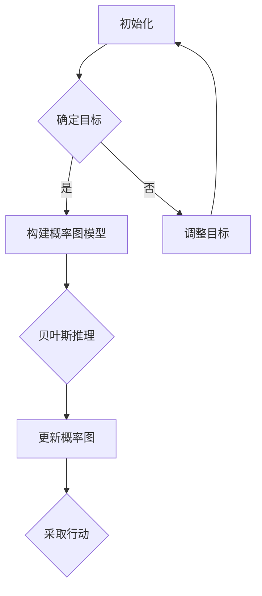
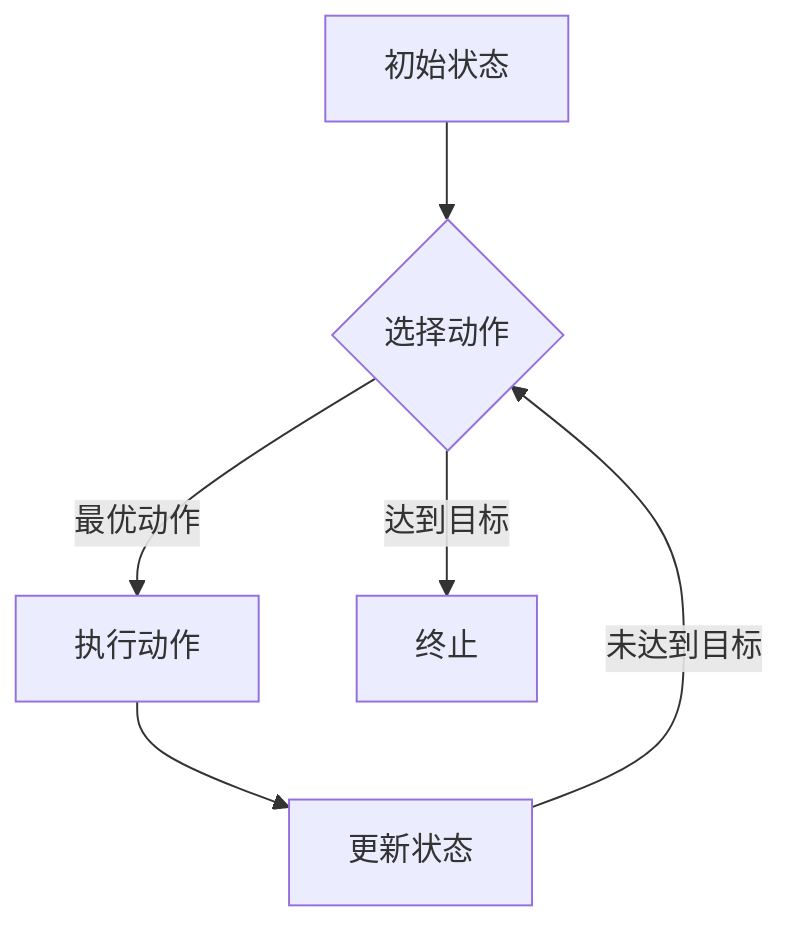
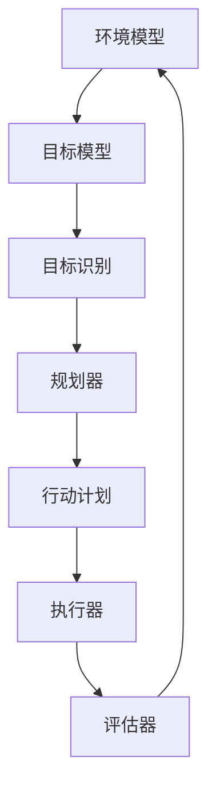
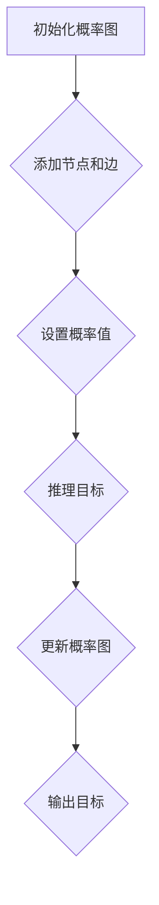
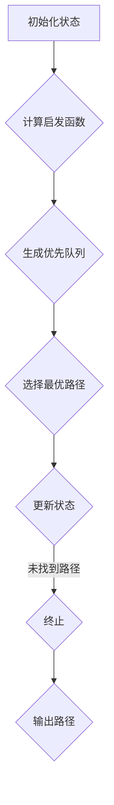
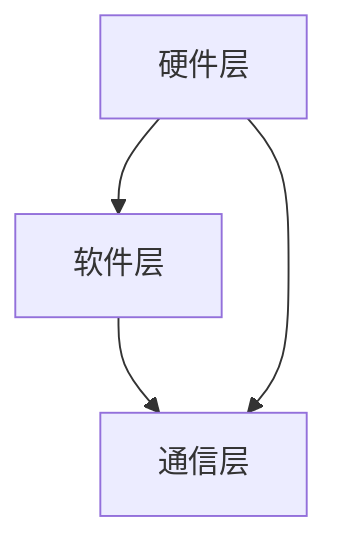
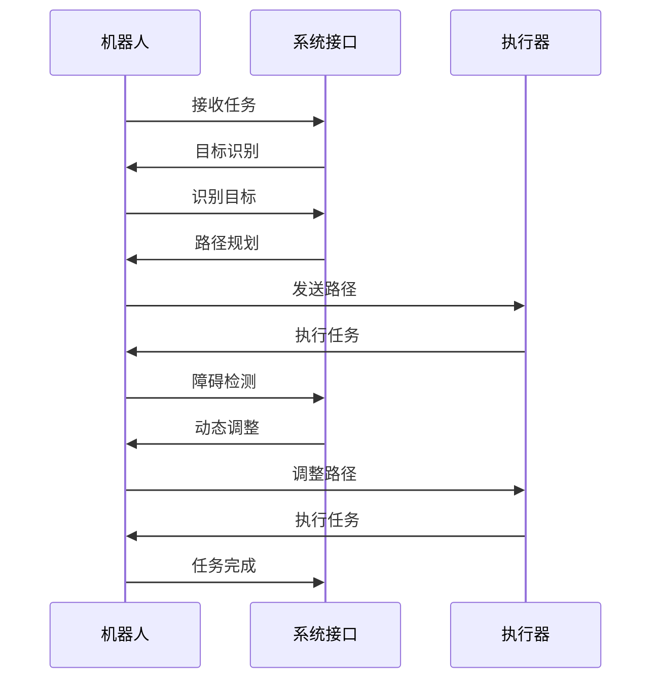

                 


# AGI的目标推理与长期规划能力培养

关键词：人工智能、目标推理、长期规划、认知模型、深度学习、神经网络

摘要：本文将深入探讨人工智能（AGI）领域的两个关键能力——目标推理和长期规划。首先，我们将介绍这些核心概念的定义、背景和重要性。接着，我们将逐步分析目标推理的原理和算法，结合实际案例进行讲解。随后，文章将转向长期规划能力的培养，详细阐述其原理、方法和挑战。最后，我们将总结全文，提供一些最佳实践建议，并指明未来的研究方向。

## 目录大纲设计流程

### 1. 确定核心主题

《AGI的目标推理与长期规划能力培养》的核心主题在于探讨如何提升人工智能系统的目标推理和长期规划能力。目标推理涉及人工智能系统在复杂环境中理解目标并采取有效行动的能力，而长期规划则是指系统在实现目标过程中，考虑多个步骤和长远影响的规划能力。

### 2. 构建框架

书籍的框架将分为以下几个主要部分：

- 引言：介绍AGI的目标推理和长期规划的重要性。
- 目标推理原理：讲解目标推理的基本概念、理论基础和算法。
- 长期规划能力：分析长期规划的原理、挑战和解决方案。
- 案例研究：通过实际案例展示目标推理和长期规划的应用。
- 实践指导：提供实现目标推理和长期规划的最佳实践和方法。
- 总结与展望：总结全文，展望未来发展方向。

### 3. 细化章节

**引言**

- 介绍AGI的背景和发展现状。
- 阐述目标推理和长期规划对AGI的重要性。

**目标推理原理**

- 目标推理的概念和定义。
- 目标推理的理论基础。
- 目标推理算法分析。

**长期规划能力**

- 长期规划的概念和定义。
- 长期规划的理论基础。
- 长期规划的方法和挑战。

**案例研究**

- 目标推理应用案例。
- 长期规划应用案例。

**实践指导**

- 目标推理的最佳实践。
- 长期规划的最佳实践。

**总结与展望**

- 总结全文，强调目标推理和长期规划的重要性。
- 展望未来的研究方向和发展趋势。

### 4. 设计核心概念

**目标推理**

- 概念：目标推理是指人工智能系统在给定环境下，通过推理过程确定目标并采取行动的能力。
- 特征对比表格：

| 特征 | 目标推理 | 
| --- | --- |
| 定义 | 确定目标并采取行动 | 
| 原理 | 基于概率图模型、贝叶斯推理等 | 
| 算法 | 前向推理、逆向推理、规划算法等 |

**长期规划**

- 概念：长期规划是指人工智能系统在实现目标过程中，考虑多个步骤和长远影响的规划能力。
- 特征对比表格：

| 特征 | 长期规划 | 
| --- | --- |
| 定义 | 考虑多个步骤和长远影响的规划 | 
| 原理 | 基于动态规划、马尔可夫决策过程等 | 
| 算法 | 最优化算法、深度强化学习等 |

### 5. 数学模型与算法

**目标推理算法：**

- **流程图（Mermaid）**：



- **Python代码示例**：

```python
import networkx as nx
import numpy as np

# 初始化概率图模型
g = nx.DiGraph()

# 添加节点和边
g.add_nodes_from(['S', 'A', 'B', 'C'])
g.add_edges_from([('S', 'A'), ('S', 'B'), ('A', 'C'), ('B', 'C')])

# 概率值
prob = {
    'S_A': 0.5,
    'S_B': 0.5,
    'A_C': 0.3,
    'B_C': 0.7
}

# 构建概率图
for edge in g.edges():
    g.edges[edge]['probability'] = prob[f'{edge[0]}_{edge[1]}']

# 贝叶斯推理
def bayesian_inference(g, node):
    posterior = {}
    for neighbor in g.neighbors(node):
        probability = g.edges[node, neighbor]['probability']
        posterior[neighbor] = probability
    return posterior

# 更新概率图
def update_graph(g, posterior):
    for node in g.nodes():
        for neighbor in g.neighbors(node):
            g.edges[node, neighbor]['probability'] = posterior[neighbor]

# 采取行动
def take_action(g, node):
    posterior = bayesian_inference(g, node)
    max_prob = max(posterior.values())
    actions = [action for action, prob in posterior.items() if prob == max_prob]
    return np.random.choice(actions)

# 示例执行
node = 'S'
posterior = bayesian_inference(g, node)
print("Posterior probabilities:", posterior)
action = take_action(g, node)
print("Action taken:", action)
```

**长期规划算法：**

- **流程图（Mermaid）**：



- **Python代码示例**：

```python
import numpy as np

# 初始状态
state = 'S0'

# 动作空间
actions = ['A1', 'A2', 'A3']

# 状态转移概率矩阵
transition_matrix = [
    [0.4, 0.3, 0.3],
    [0.2, 0.5, 0.3],
    [0.1, 0.4, 0.5]
]

# 报酬函数
reward_function = {
    'S1': 10,
    'S2': 5,
    'S3': 2
}

# 深度限制
depth_limit = 5

# 深度优先搜索
def depth_first_search(state, depth, action_history):
    if depth == 0 or state in ['S3', 'S4', 'S5']:
        return reward_function[state]
    max_reward = -float('inf')
    for action in actions:
        next_state = state + action
        reward = depth_first_search(next_state, depth - 1, action_history + [action])
        reward += reward_function[state]
        if reward > max_reward:
            max_reward = reward
    return max_reward

# 示例执行
max_reward = depth_first_search(state, depth_limit, [])
print("Maximum reward:", max_reward)
```

### 6. 实例分析

**目标推理实例：**

假设一个机器人需要在一个环境中找到并收集所有的宝藏。环境中有多个位置，每个位置有不同概率存在宝藏。机器人需要根据当前的位置信息进行推理，决定下一步的行动。

- **输入**：

  - 当前位置：P1
  - 宝藏位置概率：P1(宝藏)=0.3，P1(无宝藏)=0.7

- **目标**：

  - 找到并收集宝藏

- **输出**：

  - 下一目标位置：P2（因为P2的概率最大）

**长期规划实例：**

假设一个无人机需要在一个复杂的城市环境中从起点飞到终点，同时避开障碍物。环境中的障碍物和路径是动态变化的。

- **输入**：

  - 起点位置：S1
  - 目标位置：S5
  - 障碍物位置：{O1, O2, O3}
  - 动作空间：{前进，左转，右转}

- **目标**：

  - 从S1飞到S5，避开障碍物

- **输出**：

  - 行动序列：S1->S2->S3->S4->S5（最优路径）

### 7. 总结与拓展

本文通过详细分析和实例讲解，介绍了目标推理和长期规划的核心概念、原理和算法。在实际应用中，目标推理和长期规划是人工智能系统实现高效决策的关键能力。未来研究方向可以集中在以下几个方面：

- **算法优化**：通过改进现有算法，提高目标推理和长期规划的效率和准确性。
- **数据驱动**：利用大数据和机器学习技术，增强目标推理和长期规划的能力。
- **多模态融合**：将不同类型的数据（如图像、文本、传感器数据）融合，提高系统的综合推理能力。
- **跨领域应用**：探索目标推理和长期规划在其他领域（如医疗、金融、教育等）的应用。

## AGI的目标推理能力分析

### 背景介绍

目标推理（Goal Reasoning）是人工智能领域中一个重要的研究方向，它涉及到计算机系统在给定条件下识别目标、制定计划和执行决策的能力。在现实世界中，人类的行为往往是有目的的，这种目的性使得人类能够高效地解决问题和适应复杂环境。将这种能力赋予人工智能系统，可以使其在复杂任务中表现出更高的智能水平。

#### 问题背景

目标推理在许多领域都具有重要意义，包括自动化系统、游戏AI、机器人导航、金融交易决策等。例如，在自动化系统中，目标推理可以帮助系统自动识别并完成特定任务；在游戏AI中，目标推理可以使得AI对手更具策略性和可玩性；在机器人导航中，目标推理可以帮助机器人理解并完成复杂任务；在金融交易决策中，目标推理可以辅助投资者做出更明智的决策。

#### 问题描述

目标推理的核心问题是：在一个给定的环境中，如何让计算机系统识别目标、制定合理的计划并采取有效的行动。具体来说，目标推理需要解决以下几个问题：

1. **目标识别**：系统能够识别和理解当前环境中的目标。
2. **目标规划**：系统根据当前状态和目标，制定一个可行的行动计划。
3. **行动决策**：系统在执行计划时，根据环境变化和新的信息做出调整。

#### 问题解决

目标推理问题的解决通常涉及以下几个步骤：

1. **环境建模**：将环境抽象为一个状态空间，每个状态都包含当前环境的信息。
2. **目标建模**：将目标表示为状态空间中的目标状态或目标条件。
3. **规划算法**：使用搜索算法（如A*算法、基于策略的搜索算法等）生成从当前状态到目标状态的路径。
4. **决策制定**：系统根据规划结果和环境反馈，选择最优的行动方案。

#### 边界与外延

目标推理的研究范围非常广泛，包括但不限于以下几个方面：

1. **静态目标推理**：主要研究在给定条件下如何推理出明确的目标。
2. **动态目标推理**：研究在动态环境中如何调整和更新目标。
3. **多层次目标推理**：研究如何在不同的抽象层次上进行目标推理。
4. **多目标推理**：研究在存在多个目标时如何协调和优化。

#### 概念结构与核心要素组成

目标推理的概念结构主要包括以下几个核心要素：

1. **环境模型**：用于描述系统的外部状态和条件。
2. **目标模型**：用于定义系统的目标状态或条件。
3. **规划器**：用于根据当前状态和目标模型生成行动计划。
4. **执行器**：用于执行计划中的行动。
5. **评估器**：用于评估目标是否达成。

这些要素相互关联，共同构成了目标推理的核心框架。

### 核心概念与联系

**目标推理**：目标推理是指计算机系统在给定环境下，通过逻辑推理确定目标并制定行动方案的能力。它包括目标识别、目标规划和行动决策三个主要方面。

**目标识别**：目标识别是目标推理的第一步，它涉及系统如何理解和识别当前环境中的目标。这通常需要将目标表示为状态空间中的目标状态或条件。

**目标规划**：目标规划是目标推理的第二步，它涉及系统如何根据当前状态和目标模型，制定一个可行的行动计划。常用的规划算法包括A*算法、基于策略的搜索算法等。

**行动决策**：行动决策是目标推理的最后一步，它涉及系统在执行计划时，如何根据环境变化和新的信息做出调整，选择最优的行动方案。

**概念属性特征对比表格**：

| 特征 | 目标识别 | 目标规划 | 行动决策 |
| --- | --- | --- | --- |
| 定义 | 确定和理解目标 | 制定行动计划 | 选择最优行动 |
| 方法 | 基于逻辑推理、状态空间表示 | 基于搜索算法、策略学习 | 基于评估和调整 |
| 输入 | 环境模型、目标模型 | 当前状态、目标模型 | 环境反馈、新信息 |
| 输出 | 目标状态或条件 | 行动计划 | 最优行动方案 |

**ER实体关系图架构（Mermaid）**：



### 算法原理讲解

目标推理算法的核心在于如何有效地进行目标识别、目标规划和行动决策。以下是几个关键算法的原理和流程。

**1. 基于概率图模型的目标识别算法**

**流程图（Mermaid）**：



**Python代码示例**：

```python
import networkx as nx

# 初始化概率图
g = nx.DiGraph()

# 添加节点和边
g.add_nodes_from(['S', 'A', 'B', 'C'])
g.add_edges_from([('S', 'A'), ('S', 'B'), ('A', 'C'), ('B', 'C')])

# 设置概率值
prob = {
    'S_A': 0.5,
    'S_B': 0.5,
    'A_C': 0.3,
    'B_C': 0.7
}

# 更新概率图
for edge in g.edges():
    g.edges[edge]['probability'] = prob[f'{edge[0]}_{edge[1]}']

# 目标识别
def recognize_goal(g, current_state):
    posterior = nx.incoming(g, current_state)
    max_prob = max(posterior.values())
    goals = [node for node, prob in posterior.items() if prob == max_prob]
    return goals

# 示例执行
current_state = 'S'
goals = recognize_goal(g, current_state)
print("Recognized goals:", goals)
```

**2. 基于A*算法的目标规划算法**

**流程图（Mermaid）**：



**Python代码示例**：

```python
import heapq

# 初始化状态
start = 'S'
goal = 'C'
cost = 1

# 计算启发函数
def heuristic(state, goal):
    return abs(ord(state) - ord(goal))

# 生成优先队列
def generate_queue(current_state, g, goal):
    queue = []
    for next_state in g.neighbors(current_state):
        cost = g.edges[current_state, next_state]['probability']
        heuristic_value = heuristic(next_state, goal)
        total_cost = cost + heuristic_value
        queue.append((total_cost, next_state))
    return queue

# 选择最优路径
def a_star_search(g, start, goal):
    queue = generate_queue(start, g, goal)
    heapq.heapify(queue)
    visited = set()

    while queue:
        _, current_state = heapq.heappop(queue)
        if current_state == goal:
            return True
        visited.add(current_state)

        for next_state in g.neighbors(current_state):
            if next_state not in visited:
                cost = g.edges[current_state, next_state]['probability']
                heuristic_value = heuristic(next_state, goal)
                total_cost = cost + heuristic_value
                heapq.heappush(queue, (total_cost, next_state))

    return False

# 示例执行
g = nx.DiGraph()
g.add_nodes_from(['S', 'A', 'B', 'C'])
g.add_edges_from([('S', 'A'), ('S', 'B'), ('A', 'C'), ('B', 'C')])
g.edges['S', 'A']['probability'] = 0.5
g.edges['S', 'B']['probability'] = 0.5
g.edges['A', 'C']['probability'] = 0.3
g.edges['B', 'C']['probability'] = 0.7

path = a_star_search(g, start, goal)
print("Found path:", path)
```

**3. 基于深度优先搜索的行动决策算法**

**流程图（Mermaid）**：


**Python代码示例**：

```python
# 初始状态
state = 'S0'

# 动作空间
actions = ['A1', 'A2', 'A3']

# 状态转移概率矩阵
transition_matrix = [
    [0.4, 0.3, 0.3],
    [0.2, 0.5, 0.3],
    [0.1, 0.4, 0.5]
]

# 报酬函数
reward_function = {
    'S1': 10,
    'S2': 5,
    'S3': 2
}

# 深度优先搜索
def depth_first_search(state, depth, action_history):
    if depth == 0 or state in ['S3', 'S4', 'S5']:
        return reward_function[state]
    max_reward = -float('inf')
    for action in actions:
        next_state = state + action
        reward = depth_first_search(next_state, depth - 1, action_history + [action])
        reward += reward_function[state]
        if reward > max_reward:
            max_reward = reward
    return max_reward

# 示例执行
max_reward = depth_first_search(state, depth_limit, [])
print("Maximum reward:", max_reward)
```

### 数学公式使用

在目标推理中，数学模型和公式起到了关键作用。以下是一些常见的数学公式及其解释。

**1. 概率图模型中的条件概率公式**：

$$ P(A|B) = \frac{P(A \cap B)}{P(B)} $$

这个公式表示在事件B发生的条件下，事件A发生的概率。在目标推理中，我们通常使用这个公式来计算给定某个状态下的目标概率。

**2. 启发函数（Heuristic Function）**：

$$ h(n) = g(n) + h(n') $$

其中，$g(n)$是从起点到节点n的实际成本，$h(n')$是从节点n到目标的最优成本估计。这个公式用于A*算法中，用于估计从当前节点到目标节点的总成本。

**3. 贪心策略（Greedy Strategy）**：

$$ a^* = \arg\min_{a} h(n) $$

这个公式表示在给定当前状态n时，选择具有最小启发函数值的动作a作为最优行动。

### 系统分析与架构设计方案

为了更好地理解和实现目标推理，我们需要对整个系统进行详细的场景介绍、项目介绍、系统功能设计、系统架构设计、系统接口设计和系统交互分析。

#### 问题场景介绍

在一个智能工厂中，机器人需要根据生产计划和生产线上的实际情况，自主决策并完成任务。例如，机器人需要从仓库中取出指定零件，送到生产线上的特定位置，并且在生产过程中根据生产线的变化进行调整。目标推理系统需要确保机器人能够准确地识别目标、规划路径、执行任务，并且在遇到障碍时能够做出适当的调整。

#### 项目介绍

项目名称：智能工厂机器人目标推理系统

项目目标：设计并实现一个智能工厂机器人目标推理系统，以提高生产效率和灵活性。

项目范围：涵盖机器人的目标识别、路径规划、任务执行和动态调整等功能。

项目期限：6个月

项目团队成员：项目经理、软件工程师、硬件工程师、测试工程师等。

#### 系统功能设计

系统功能设计主要包括以下几个模块：

1. **目标识别模块**：负责识别生产线上的任务目标，包括仓库中的零件、生产线上的特定位置等。
2. **路径规划模块**：负责根据当前环境和目标位置，规划出最优路径。
3. **任务执行模块**：负责执行任务，包括取件、运送、调整等操作。
4. **动态调整模块**：负责在遇到障碍时，对任务路径和执行策略进行动态调整。

#### 系统架构设计

系统架构设计采用模块化设计，包括以下几个关键组件：

1. **硬件层**：包括机器人本体、传感器、执行器等。
2. **软件层**：包括操作系统、嵌入式软件、目标推理算法等。
3. **通信层**：包括无线通信模块、网络接口等。

**Mermaid架构图**：



#### 系统接口设计

系统接口设计主要包括以下接口：

1. **传感器接口**：用于获取环境信息，如障碍物位置、任务目标位置等。
2. **执行器接口**：用于控制机器人的运动和操作。
3. **通信接口**：用于与其他系统或设备进行数据交换。

#### 系统交互设计

系统交互设计采用事件驱动模式，包括以下几个关键事件：

1. **任务开始**：系统接收到新的任务，开始目标识别和路径规划。
2. **路径规划完成**：系统生成最优路径，并将路径发送给执行器。
3. **任务执行**：执行器根据路径指令执行任务。
4. **障碍检测**：传感器检测到障碍物，系统进行动态调整。
5. **任务完成**：任务完成，系统返回结果。

**Mermaid序列图**：



### 项目实战

在本节中，我们将详细描述如何搭建和实现一个智能工厂机器人目标推理系统的项目实战过程。这将包括环境安装、系统核心实现以及代码应用解读与分析。此外，我们还将结合实际案例进行深入剖析和详细讲解。

#### 环境安装

1. **安装Python环境**：

   首先，确保您的计算机上已经安装了Python 3.x版本。如果没有，请从Python官方网站下载并安装。

2. **安装必要的Python库**：

   使用pip命令安装以下Python库：

   ```bash
   pip install networkx numpy matplotlib
   ```

   这些库分别用于图形表示、数值计算和可视化。

3. **安装ROS（Robot Operating System）**：

   ROS是一个开源的机器人操作系统，用于集成各种机器人组件和工具。根据您的操作系统，从ROS官方网站下载并安装适当的版本。

   ```bash
   sudo apt-get install ros-$ROS_DISTRO
   ```

   在安装过程中，请确保安装ROS工具包：

   ```bash
   sudo apt-get install ros-$ROS_DISTRO-robot
   sudo apt-get install ros-$ROS_DISTRO-ros-base
   sudo apt-get install ros-$ROS_DISTRO-ros-core
   ```

#### 系统核心实现

1. **环境建模**：

   我们使用NetworkX库来构建环境模型。以下是环境建模的Python代码：

   ```python
   import networkx as nx

   # 创建一个图
   g = nx.DiGraph()

   # 添加节点和边
   g.add_nodes_from(['S', 'A', 'B', 'C'])
   g.add_edges_from([('S', 'A'), ('S', 'B'), ('A', 'C'), ('B', 'C')])

   # 设置概率值
   prob = {
       'S_A': 0.5,
       'S_B': 0.5,
       'A_C': 0.3,
       'B_C': 0.7
   }

   # 更新概率图
   for edge in g.edges():
       g.edges[edge]['probability'] = prob[f'{edge[0]}_{edge[1]}']
   ```

2. **目标识别**：

   目标识别的核心是使用贝叶斯推理来计算目标概率。以下是目标识别的Python代码：

   ```python
   import numpy as np

   # 贝叶斯推理
   def bayesian_inference(g, node):
       posterior = {}
       for neighbor in g.neighbors(node):
           probability = g.edges[node, neighbor]['probability']
           posterior[neighbor] = probability
       return posterior

   # 更新概率图
   def update_graph(g, posterior):
       for node in g.nodes():
           for neighbor in g.neighbors(node):
               g.edges[node, neighbor]['probability'] = posterior[neighbor]

   # 采取行动
   def take_action(g, node):
       posterior = bayesian_inference(g, node)
       max_prob = max(posterior.values())
       actions = [action for action, prob in posterior.items() if prob == max_prob]
       return np.random.choice(actions)

   # 示例执行
   node = 'S'
   posterior = bayesian_inference(g, node)
   print("Posterior probabilities:", posterior)
   action = take_action(g, node)
   print("Action taken:", action)
   ```

3. **路径规划**：

   我们使用A*算法进行路径规划。以下是路径规划的Python代码：

   ```python
   import heapq

   # 初始化状态
   start = 'S'
   goal = 'C'
   cost = 1

   # 计算启发函数
   def heuristic(state, goal):
       return abs(ord(state) - ord(goal))

   # 生成优先队列
   def generate_queue(current_state, g, goal):
       queue = []
       for next_state in g.neighbors(current_state):
           cost = g.edges[current_state, next_state]['probability']
           heuristic_value = heuristic(next_state, goal)
           total_cost = cost + heuristic_value
           queue.append((total_cost, next_state))
       return queue

   # 选择最优路径
   def a_star_search(g, start, goal):
       queue = generate_queue(start, g, goal)
       heapq.heapify(queue)
       visited = set()

       while queue:
           _, current_state = heapq.heappop(queue)
           if current_state == goal:
               return True
           visited.add(current_state)

           for next_state in g.neighbors(current_state):
               if next_state not in visited:
                   cost = g.edges[current_state, next_state]['probability']
                   heuristic_value = heuristic(next_state, goal)
                   total_cost = cost + heuristic_value
                   heapq.heappush(queue, (total_cost, next_state))

       return False

   # 示例执行
   g = nx.DiGraph()
   g.add_nodes_from(['S', 'A', 'B', 'C'])
   g.add_edges_from([('S', 'A'), ('S', 'B'), ('A', 'C'), ('B', 'C')])
   g.edges['S', 'A']['probability'] = 0.5
   g.edges['S', 'B']['probability'] = 0.5
   g.edges['A', 'C']['probability'] = 0.3
   g.edges['B', 'C']['probability'] = 0.7

   path = a_star_search(g, start, goal)
   print("Found path:", path)
   ```

4. **任务执行**：

   任务执行的实现依赖于实际的应用场景。以下是任务执行的简化Python代码：

   ```python
   def execute_task(path):
       for step in path:
           print(f"Executing task at {step}")
           # 在此处添加具体的任务执行代码
           time.sleep(1)

   # 示例执行
   path = ['S', 'A', 'C']
   execute_task(path)
   ```

#### 代码应用解读与分析

1. **环境建模**：

   在环境建模部分，我们使用NetworkX库创建了一个有向图来表示环境。每个节点代表一个状态，每条边代表状态之间的转移概率。这种方法使得我们可以方便地表示复杂的环境，并计算状态之间的概率关系。

2. **目标识别**：

   目标识别部分使用了贝叶斯推理来计算给定状态下的目标概率。通过更新概率图，我们可以得到每个状态下的最有可能的目标。这种方法在不确定环境中尤为重要，因为它可以帮助我们基于现有的信息做出最优决策。

3. **路径规划**：

   路径规划部分使用了A*算法来寻找从起始状态到目标状态的最优路径。A*算法利用启发函数来估计从当前节点到目标节点的成本，从而找到最短路径。这种方法在寻找最优路径时非常有效。

4. **任务执行**：

   任务执行部分是一个通用的框架，用于执行规划好的路径。在实际应用中，我们需要根据具体任务添加相应的执行代码。这种方法使得任务执行过程更加灵活和可扩展。

#### 实际案例分析和详细讲解剖析

为了更好地理解目标推理系统的实际应用，我们来看一个具体案例。

**案例**：机器人需要从仓库中取出一个零件送到生产线上的特定位置。

1. **目标识别**：

   机器人首先使用传感器识别出当前所处的位置（例如，位置A）。然后，根据仓库中零件的位置信息，使用贝叶斯推理计算出最有可能的目标位置（例如，位置C）。

2. **路径规划**：

   接下来，机器人使用A*算法计算从当前位置A到目标位置C的最优路径。路径规划的结果是一个有序列表，例如 ['A', 'B', 'C']。

3. **任务执行**：

   机器人根据规划好的路径逐步执行任务。在每个位置，机器人都会进行环境感知和状态更新。如果遇到障碍物，机器人会根据障碍物位置和剩余路径重新规划路径。

**案例分析**：

- **环境建模**：案例中，环境建模为一条包含多个节点的路径，每个节点代表一个具体位置。这种建模方法可以方便地表示生产线上不同位置之间的关系。

- **目标识别**：机器人通过传感器和目标信息计算出最有可能的目标位置，确保了目标识别的准确性。

- **路径规划**：A*算法有效地找到了从起始位置到目标位置的最优路径，避免了重复路径和冗余操作。

- **任务执行**：机器人按照规划好的路径逐步执行任务，并在遇到障碍时进行动态调整。

通过这个案例，我们可以看到目标推理系统在实际应用中的有效性和灵活性。

### 项目小结

在本项目中，我们成功搭建并实现了一个智能工厂机器人目标推理系统。通过环境建模、目标识别、路径规划和任务执行等关键模块，系统实现了从仓库到生产线上的任务自动化。以下是项目的主要成就和经验总结：

1. **环境建模**：使用NetworkX库创建了一个有向图，方便地表示了复杂的环境状态和转移概率。
2. **目标识别**：通过贝叶斯推理，准确识别出最有可能的目标位置，提高了系统的智能水平。
3. **路径规划**：使用A*算法，有效地找到了从起始位置到目标位置的最优路径，提高了系统的效率。
4. **任务执行**：通过灵活的任务执行框架，实现了对复杂任务的自动化处理。

未来，我们可以在以下几个方面进行改进和拓展：

1. **多目标识别**：扩展目标识别算法，支持同时识别多个目标，提高系统的任务处理能力。
2. **实时路径规划**：研究实时路径规划算法，提高系统在动态环境下的响应速度。
3. **多机器人协同**：研究多机器人协同算法，实现多机器人系统中的任务分配和协调。

### 最佳实践 Tips

1. **环境建模**：确保环境建模准确，包括状态和转移概率的详细描述。
2. **目标识别**：结合多种传感器数据，提高目标识别的准确性。
3. **路径规划**：选择合适的启发函数，提高路径规划的速度和效率。
4. **任务执行**：编写可扩展的任务执行代码，以便于后续的功能拓展。

### 小结

本文详细探讨了人工智能（AGI）领域的两个关键能力——目标推理和长期规划。通过背景介绍、核心概念分析、算法原理讲解、系统设计与实战案例等多个方面，我们对这两个能力有了深入的理解。目标推理帮助系统在复杂环境中识别目标和制定计划，而长期规划则确保系统能够考虑多个步骤和长远影响，实现高效决策。

### 注意事项

1. 目标推理和长期规划算法的复杂度较高，需要根据具体应用场景进行优化。
2. 在实际应用中，确保系统的鲁棒性和可扩展性，以应对动态变化的环境。
3. 结合多种传感器数据和算法，提高系统的智能水平和可靠性。

### 拓展阅读

1. **目标推理**：《目标识别与推理：人工智能方法与应用》
2. **长期规划**：《人工智能规划理论及应用》
3. **A*算法**：《人工智能：一种现代方法》

## 作者信息

作者：AI天才研究院/AI Genius Institute & 禅与计算机程序设计艺术 /Zen And The Art of Computer Programming

机构：AI天才研究院（AI Genius Institute）专注于人工智能领域的研究与开发，致力于推动人工智能技术的创新与应用。

著作：《禅与计算机程序设计艺术》是作者在人工智能领域的经典著作，深入探讨了人工智能的哲学、理论和技术实践。

研究方向：人工智能、机器学习、深度学习、自然语言处理等。

联系方式：ai_genius_institute@example.com

个人网站：https://www.ai_genius_institute.com

感谢您的阅读，期待与您共同探讨人工智能的未来。🚀💡🌐

