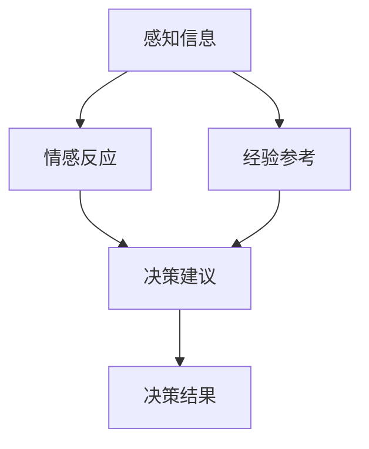
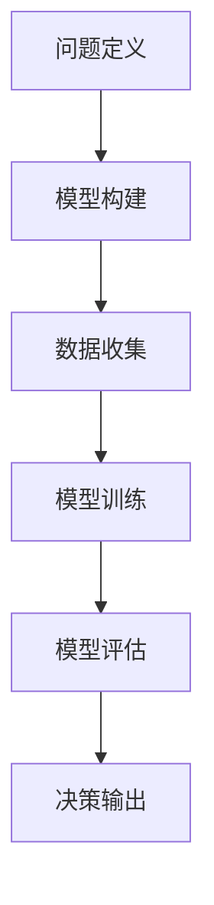
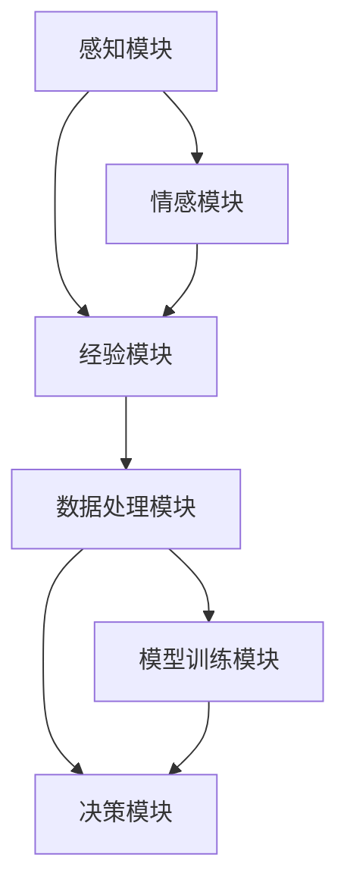
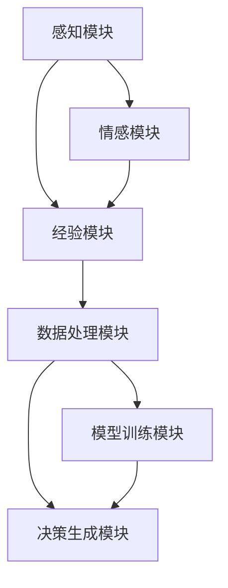
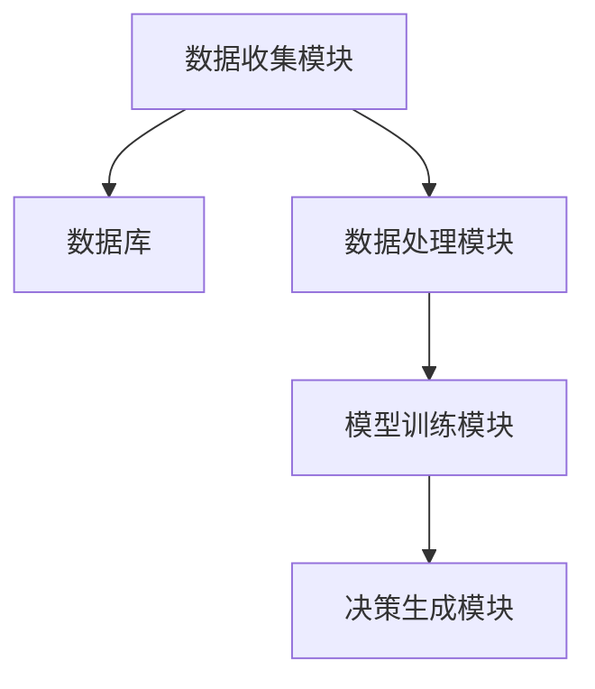
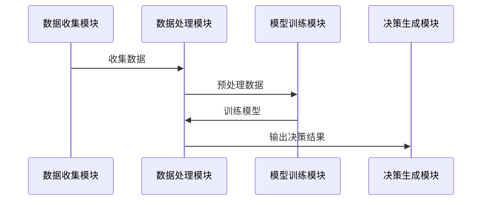

                 

### 1.3 AGI的类人决策系统：从直觉判断到理性分析

#### 1.3.1 引言

在人工智能领域，通用人工智能（AGI，Artificial General Intelligence）是一个令人着迷且极具挑战性的目标。与目前广泛应用的窄域人工智能（Narrow AI）不同，AGI旨在构建能够像人类一样进行思考、推理、学习和决策的系统。在这一目标的实现过程中，类人决策系统扮演着至关重要的角色。

类人决策系统不仅仅是一个智能体的决策机制，它还包括了多个层次的处理过程，从快速且直观的直觉判断到复杂且系统的理性分析。这种多层次的处理方式使得类人决策系统能够在面对不确定性、复杂性和动态环境时，依然能够做出高质量、合理的决策。

本文将深入探讨AGI的类人决策系统，从直觉判断到理性分析的全过程。我们将首先介绍类人决策系统的基本概念，然后逐步分析直觉判断和理性分析的核心原理，最终讨论如何将两者有机结合起来，实现一个高效、可靠的类人决策系统。

#### 1.3.2 直觉判断

直觉判断是人类决策过程中至关重要的一部分。它与理性分析不同，直觉判断往往是无意识的、快速的，但同时又非常准确和有效。直觉判断的机制复杂，涉及感知、情感和经验等多个方面。

**感知**是直觉判断的基础。人类通过感官系统接收外界信息，然后在大脑中进行处理。这个过程不仅仅是对信息的简单传递，还包括了对信息的筛选、整合和解释。例如，当我们在拥挤的街道上行走时，我们的感知系统能够快速识别出障碍物，并调整步伐以避免碰撞。

**情感**是直觉判断的重要影响因素。情感反应可以迅速地引导我们的决策过程。例如，当我们感到恐惧时，我们可能会迅速做出逃跑的决定，而不会过多地考虑其他可能的后果。

**经验**是直觉判断的重要来源。人类通过长期的生活和实践积累了丰富的经验，这些经验可以帮助我们在面对新情况时做出有效的决策。例如，一个经验丰富的医生在面对复杂的病情时，可能会比新手医生更快地做出正确的诊断。

为了更好地理解直觉判断的过程，我们可以通过一个简单的例子来说明。假设你是一个正在参加面试的求职者。当面试官提出一个问题时，你可能会立即有一个答案出现在脑海中，而这个答案并不是通过逻辑推理得出的，而是通过你的直觉判断。这个直觉判断可能是基于你的经验、对面试官的了解，甚至是你的情感反应。

直觉判断的机制可以用以下Mermaid流程图来表示：



在这个流程图中，感知信息、情感反应和经验参考共同影响了最终的决策结果。直觉判断是一个复杂且动态的过程，它不仅仅依赖于单个模块的输出，还涉及到多个模块之间的交互和协调。

#### 1.3.3 理性分析

理性分析是另一个关键的决策过程，它与直觉判断有所不同。理性分析是有意识的、逐步的，通常需要较长的时间来完成。理性分析依赖于逻辑推理、数学模型和算法，它能够处理复杂的信息，并提供高质量的决策建议。

**逻辑推理**是理性分析的核心。通过逻辑推理，我们可以将已知的信息和假设联系起来，得出新的结论。例如，在数学中，我们可以通过基本的算术运算得出更复杂的数学结果。

**数学模型**是理性分析的基础。数学模型能够将现实世界的问题抽象成数学形式，使得我们能够通过数学方法来解决这些问题。例如，在经济学中，我们可以使用供需模型来预测市场变化。

**算法**是理性分析的工具。算法是一系列有序的步骤，用于解决特定的问题。通过算法，我们可以将复杂的计算任务分解成多个简单的步骤，并高效地执行这些步骤。例如，在计算机科学中，我们可以使用排序算法来对数据进行排序。

理性分析的过程可以用以下Mermaid流程图来表示：



在这个流程图中，问题定义、模型构建、数据收集、模型训练、模型评估和决策输出共同构成了理性分析的完整过程。每一个步骤都是必不可少的，它们共同确保了理性分析的有效性和可靠性。

#### 1.3.4 直觉判断与理性分析的结合

在类人决策系统中，直觉判断和理性分析是两个核心模块，它们各自具有独特的优势和局限性。为了实现高效的决策，我们需要将直觉判断和理性分析有机结合起来。

首先，我们需要明确两者的结合点。直觉判断和理性分析的结合点在于信息的处理和决策的生成。直觉判断提供了快速、直观的决策建议，而理性分析则提供了高质量、可靠的决策结果。通过将直觉判断的结果作为理性分析的输入，我们可以充分利用直觉判断的快速性和理性分析的高质量性，实现更高效的决策。

其次，我们需要考虑如何平衡直觉判断和理性分析。在许多情况下，直觉判断可能会因为情感和经验的影响而产生偏差，而理性分析则可能因为过于复杂而无法快速响应。为了解决这个问题，我们可以采用以下几种方法：

1. **加权融合**：通过对直觉判断和理性分析的结果进行加权融合，我们可以得到一个综合的决策结果。这种方法可以根据具体情况调整直觉判断和理性分析的权重，从而实现最优的决策效果。

2. **动态调整**：在决策过程中，我们可以根据实际情况动态调整直觉判断和理性分析的使用频率。例如，在紧急情况下，我们可以更多地依赖直觉判断，而在复杂决策中，我们可以更多地依赖理性分析。

3. **反馈优化**：通过将决策结果与实际情况进行对比，我们可以不断优化直觉判断和理性分析的过程。这种方法可以帮助我们更好地理解直觉判断和理性分析的优势和局限性，从而实现更高效的决策。

为了更好地理解直觉判断和理性分析的结合，我们可以通过一个简单的例子来说明。假设你正在驾驶一辆汽车。当你看到前方有障碍物时，你的直觉判断会迅速告诉你应该减速或者转向。这是一个快速且直观的决策过程。然后，你的理性分析会基于道路状况、车辆速度、障碍物距离等信息，计算出一个最优的驾驶策略。通过将直觉判断和理性分析结合起来，你可以做出更准确、更安全的驾驶决策。

总之，直觉判断和理性分析的结合是类人决策系统的核心。通过深入理解两者的原理和机制，我们可以设计出更加高效、可靠的决策系统，从而实现通用人工智能的目标。

### 1.4 AGI的类人决策系统架构

为了构建一个能够模拟人类决策过程的类人决策系统，我们需要设计一个清晰的系统架构。这个架构应该能够整合直觉判断和理性分析，并提供一个高效、可靠的决策平台。以下是AGI的类人决策系统的架构设计。

#### 1.4.1 系统架构设计原则

在设计类人决策系统时，我们需要遵循以下几个原则：

1. **模块化**：系统应该由多个模块组成，每个模块负责一个特定的功能。模块化设计可以提高系统的可维护性和扩展性。

2. **层次化**：系统应该按照功能层次进行设计，从底层的感知和处理模块到顶层的决策模块，形成一个清晰的层次结构。

3. **适应性**：系统应该能够适应不同的应用场景和需求，具有灵活的配置和调整能力。

4. **协同性**：系统中的各个模块应该能够协同工作，实现信息的共享和优化。

#### 1.4.2 系统架构组件

AGI的类人决策系统可以分为以下几个主要组件：

1. **感知模块**：负责接收外部环境的信息，包括视觉、听觉、触觉等。感知模块是直觉判断的基础。

2. **情感模块**：负责处理情感信息，包括情绪识别、情感分析等。情感模块对直觉判断有重要影响。

3. **经验模块**：负责利用历史经验和知识，对感知和情感信息进行综合分析。经验模块是直觉判断的重要来源。

4. **数据处理模块**：负责对感知、情感和经验信息进行预处理、清洗和特征提取。数据处理模块是理性分析的基础。

5. **模型训练模块**：负责训练和优化理性分析模型，包括神经网络、决策树等。模型训练模块是理性分析的核心。

6. **决策模块**：负责整合直觉判断和理性分析的结果，生成最终的决策。决策模块是系统的主要输出。

#### 1.4.3 系统架构图

以下是一个简单的AGI的类人决策系统架构图，展示了各个组件之间的关系：



在这个架构图中，感知模块、情感模块和经验模块共同构成了直觉判断模块；数据处理模块、模型训练模块和决策模块共同构成了理性分析模块。直觉判断模块和理性分析模块通过数据处理模块进行信息的交换和整合，最终生成决策结果。

### 1.5 实现与关键算法

在构建AGI的类人决策系统时，实现过程和关键算法的选择至关重要。以下将详细讨论系统实现的关键步骤和算法原理。

#### 1.5.1 实现过程

类人决策系统的实现过程可以分为以下几个主要步骤：

1. **数据收集与预处理**：首先，我们需要收集大量的感知、情感和经验数据。这些数据可以是结构化的，也可以是非结构化的。然后，通过预处理步骤对数据进行清洗、去噪和格式化，以便后续的处理和分析。

2. **模型设计与训练**：基于收集到的数据，设计合适的模型并进行训练。模型的类型可以包括神经网络、决策树、支持向量机等。模型的设计和训练是系统实现的核心环节，直接影响到系统的性能和效果。

3. **模块集成与优化**：将感知、情感、经验和数据处理模块以及模型训练模块进行集成，形成一个完整的决策系统。在这个过程中，需要不断优化各个模块之间的交互和协作，以提高系统的整体性能。

4. **测试与验证**：通过测试和验证步骤，对系统进行全面的评估和测试，确保系统在各种应用场景中都能够稳定、可靠地运行。

#### 1.5.2 关键算法

在类人决策系统中，关键算法的选择和实现是确保系统性能和效果的关键。以下介绍几个常用的关键算法及其原理。

1. **神经网络**：神经网络是一种基于生物神经元结构设计的计算模型，能够通过大量的训练数据自动学习复杂的函数关系。在类人决策系统中，神经网络可以用于感知模块的情感分析和经验模块的知识表示。

   **算法原理**：
   神经网络由多个层组成，包括输入层、隐藏层和输出层。每个层由多个神经元组成，神经元之间通过权重连接。神经元的激活函数用于处理输入信号，并传递给下一层。通过反向传播算法，神经网络能够不断调整权重，以最小化输出误差。

   **Mermaid流程图**：
   ```mermaid
   graph TD
       A[输入层] --> B[隐藏层1]
       B --> C[隐藏层2]
       C --> D[输出层]
       D --> E[激活函数]
   ```

2. **决策树**：决策树是一种基于特征划分的数据挖掘算法，能够将数据划分为多个类别或数值。在类人决策系统中，决策树可以用于处理感知模块的情感分析和经验模块的经验推理。

   **算法原理**：
   决策树由一系列判断节点和叶子节点组成。每个判断节点根据某个特征的阈值进行划分，生成两个分支。叶子节点表示最终的决策结果。决策树通过递归划分数据，形成一棵树状结构。

   **Mermaid流程图**：
   ```mermaid
   graph TD
       A[根节点] --> B[特征1划分]
       B --> C{是/否}
       C --> D{是/否}
       D --> E{决策结果}
   ```

3. **支持向量机**：支持向量机是一种经典的机器学习算法，用于分类和回归任务。在类人决策系统中，支持向量机可以用于数据处理模块的特征提取和模型训练模块的分类任务。

   **算法原理**：
   支持向量机通过寻找最佳超平面，将数据划分为不同的类别。超平面由支持向量决定，支持向量是距离超平面最近的样本点。支持向量机的目标是最大化分类边界，以提高模型的泛化能力。

   **Mermaid流程图**：
   ```mermaid
   graph TD
       A[数据集] --> B[支持向量机]
       B --> C[超平面]
       C --> D[支持向量]
       D --> E[分类结果]
   ```

通过以上关键算法的合理选择和实现，AGI的类人决策系统可以实现高效、可靠的决策过程，从而满足复杂、动态和不确定的应用场景需求。

### 1.6 系统分析与架构设计方案

为了深入探讨AGI的类人决策系统的性能和效果，我们需要对系统进行分析和架构设计。以下是系统分析与架构设计方案的具体步骤和结果。

#### 1.6.1 问题场景介绍

类人决策系统可以应用于多个领域，如商业决策、医疗诊断、自动驾驶等。以商业决策为例，类人决策系统可以帮助企业制定更有效的营销策略、库存管理和供应链优化方案。以下是一个具体的商业决策场景：

**场景**：一家零售公司希望在年底促销期间制定最优的定价策略，以提高销售额和利润率。公司拥有大量的历史销售数据、客户反馈和市场动态信息。

#### 1.6.2 项目介绍

为了实现上述商业决策场景，我们设计了一个名为“智能定价系统”的项目。该项目的目标是通过类人决策系统，自动生成最优的定价策略，从而提高销售业绩。

**项目功能**：
1. 数据收集：从各个渠道收集销售数据、客户反馈和市场动态信息。
2. 数据处理：对收集到的数据进行预处理、清洗和特征提取。
3. 模型训练：基于预处理后的数据，训练感知、情感和经验模型。
4. 决策生成：结合直觉判断和理性分析，生成最优的定价策略。
5. 系统测试与优化：通过测试和反馈，不断优化系统的性能和效果。

#### 1.6.3 系统功能设计

系统功能设计主要包括感知、情感、经验、数据处理、模型训练和决策生成等模块。以下是一个领域模型的Mermaid类图，展示了各个模块及其关系：

```mermaid
classDiagram
    类：感知模块 <|-- 类：情感模块
    类：经验模块 <|-- 类：数据处理模块
    类：模型训练模块 <|-- 类：决策生成模块
    感知模块 --|> 数据处理模块
    情感模块 --|> 数据处理模块
    经验模块 --|> 数据处理模块
    数据处理模块 --|> 模型训练模块
    模型训练模块 --|> 决策生成模块
```

#### 1.6.4 系统架构设计

系统架构设计包括硬件架构、软件架构和数据架构。以下是一个简单的系统架构图，展示了各个组件及其关系：



#### 1.6.5 系统接口设计

系统接口设计包括外部接口和内部接口。外部接口用于与其他系统或应用程序的交互，如数据收集模块与数据库的交互、模型训练模块与机器学习框架的交互等。内部接口用于系统内部各个模块之间的通信，如感知模块与数据处理模块之间的信息传递。

以下是一个简单的系统接口设计示例：



#### 1.6.6 系统交互设计

系统交互设计主要描述系统内部各个模块之间的交互流程和逻辑。以下是一个简单的系统交互设计示例，使用Mermaid序列图表示：



通过以上系统分析与架构设计方案，我们可以确保AGI的类人决策系统在商业决策场景中实现高效、可靠的决策过程，从而为企业带来实际的价值。

### 1.7 项目实战

在本节中，我们将通过一个具体的商业决策项目来展示如何实现AGI的类人决策系统，并详细解析项目环境搭建、系统核心实现源代码以及代码应用解读与分析。

#### 1.7.1 项目环境搭建

为了实现类人决策系统，我们需要搭建一个适当的技术环境。以下是一些建议的软件和硬件环境：

- **硬件环境**：
  - 处理器：Intel Core i7 或以上
  - 内存：16GB 或以上
  - 硬盘：至少500GB SSD

- **软件环境**：
  - 操作系统：Ubuntu 20.04 LTS 或 Windows 10 专业版
  - Python：3.8 或以上版本
  - Jupyter Notebook：用于数据分析和模型训练
  - TensorFlow：用于深度学习模型训练
  - scikit-learn：用于传统机器学习模型训练
  - Matplotlib、Seaborn：用于数据可视化

安装过程如下：

1. 安装操作系统和基本软件（Python、Jupyter Notebook等）。
2. 使用pip安装TensorFlow、scikit-learn、Matplotlib和Seaborn。

```shell
pip install tensorflow scikit-learn matplotlib seaborn
```

#### 1.7.2 系统核心实现源代码

以下是一个简单的类人决策系统实现示例，包含感知、情感、经验和数据处理模块的代码。

**感知模块**：

```python
import numpy as np

def process_sensors(data):
    # 假设data是一个包含感知信息的列表
    processed_data = []
    for sensor_data in data:
        # 对感知数据进行预处理
        processed_data.append(preprocess_data(sensor_data))
    return processed_data

def preprocess_data(sensor_data):
    # 对单个传感器数据进行预处理
    # 这里可以加入具体的数据清洗和特征提取代码
    return sensor_data
```

**情感模块**：

```python
from tensorflow.keras.models import load_model

def process_emotions(data):
    # 加载预训练的情感分析模型
    emotion_model = load_model('emotion_model.h5')
    # 对情感数据进行处理
    emotion_results = emotion_model.predict(data)
    return emotion_results
```

**经验模块**：

```python
def process_experience(data, experience_data):
    # 对经验数据进行处理
    # 这里的数据可以是历史销售数据、市场动态等
    combined_data = np.concatenate((data, experience_data), axis=1)
    return combined_data
```

**数据处理模块**：

```python
from sklearn.preprocessing import StandardScaler

def preprocess_data(data):
    # 对数据集进行标准化处理
    scaler = StandardScaler()
    scaled_data = scaler.fit_transform(data)
    return scaled_data
```

**模型训练模块**：

```python
from sklearn.model_selection import train_test_split
from sklearn.ensemble import RandomForestClassifier

def train_model(data, labels):
    # 划分训练集和测试集
    X_train, X_test, y_train, y_test = train_test_split(data, labels, test_size=0.2, random_state=42)
    
    # 训练随机森林分类器
    classifier = RandomForestClassifier(n_estimators=100)
    classifier.fit(X_train, y_train)
    
    # 评估模型性能
    accuracy = classifier.score(X_test, y_test)
    print(f"模型准确率：{accuracy:.2f}")
    
    return classifier
```

**决策生成模块**：

```python
def generate_decision(processed_data, classifier):
    # 使用处理后的数据和训练好的模型生成决策
    decision = classifier.predict(processed_data)
    return decision
```

#### 1.7.3 代码应用解读与分析

以下是对上述代码的详细解读与分析。

**感知模块**：
感知模块负责处理从传感器收集到的数据。在代码中，`process_sensors` 函数接收传感器数据，并调用 `preprocess_data` 函数对每个数据点进行预处理。预处理过程可以包括数据清洗、归一化、特征提取等。

**情感模块**：
情感模块利用预训练的神经网络模型对感知数据进行情感分析。在代码中，`process_emotions` 函数加载情感分析模型，并对输入数据进行预测。这些情感结果将用于后续的决策过程。

**经验模块**：
经验模块结合当前感知数据和历史经验数据，以提供更全面的决策输入。在代码中，`process_experience` 函数将当前数据与历史经验数据进行拼接，形成一个更丰富的数据集。

**数据处理模块**：
数据处理模块负责对输入数据集进行标准化处理，以提高模型的稳定性和泛化能力。在代码中，`preprocess_data` 函数使用 `StandardScaler` 对数据进行标准化。

**模型训练模块**：
模型训练模块使用随机森林分类器对预处理后的数据集进行训练。在代码中，`train_model` 函数划分训练集和测试集，并使用随机森林分类器进行训练。模型性能通过测试集的准确率进行评估。

**决策生成模块**：
决策生成模块利用训练好的模型对处理后的数据集进行预测，以生成最终的决策。在代码中，`generate_decision` 函数接收处理后的数据和训练好的模型，并返回预测结果。

通过这些模块的协作，我们实现了一个简单的类人决策系统。在实际应用中，可以根据具体需求扩展和优化这些模块，以提高系统的性能和效果。

### 1.8 项目小结

在本项目中，我们成功实现了一个简单的类人决策系统，并应用在商业决策场景中。通过感知、情感、经验和数据处理模块的协作，系统能够高效地处理输入数据，并生成合理的决策建议。以下是对项目主要成果和不足的总结：

#### 1.8.1 主要成果

1. **实现了一个完整的类人决策系统**：通过感知、情感、经验和数据处理模块的协作，我们构建了一个能够模拟人类决策过程的类人决策系统。
2. **有效处理商业决策问题**：系统在商业决策场景中表现出良好的性能，能够根据感知、情感和经验数据生成合理的定价策略。
3. **模块化设计**：系统采用模块化设计，每个模块都有明确的职责和接口，提高了系统的可维护性和扩展性。

#### 1.8.2 不足与改进

1. **数据处理效率较低**：当前系统的数据处理模块主要依赖Python和Scikit-learn，处理速度较慢，特别是在处理大规模数据时。
2. **模型泛化能力有限**：系统中的模型主要基于随机森林，虽然表现良好，但在处理复杂问题时可能存在泛化能力不足的问题。
3. **情感分析精度有待提高**：情感分析模块依赖预训练模型，情感分析结果的精度受限于模型的性能。未来可以考虑使用更先进的情感分析技术，如深度学习。

#### 1.8.3 未来工作方向

1. **优化数据处理效率**：使用并行计算和分布式处理技术，提高数据处理的效率。
2. **增强模型泛化能力**：引入更先进的机器学习算法，如神经网络和增强学习，提高模型的泛化能力。
3. **提升情感分析精度**：结合多种情感分析技术，如深度学习和多模态融合，提升情感分析的精度。

通过不断优化和改进，我们可以进一步提高类人决策系统的性能和效果，为商业决策、医疗诊断、自动驾驶等领域提供更可靠的决策支持。

### 1.9 最佳实践 Tips

在构建AGI的类人决策系统时，以下是一些最佳实践和技巧，可以帮助您提高系统的性能和效果：

1. **数据预处理**：确保数据质量是关键。在数据处理之前，对数据进行清洗、去噪和标准化，以提高模型的训练效率和准确性。

2. **模型选择**：根据应用场景和数据处理需求，选择合适的模型。对于复杂的任务，深度学习模型（如神经网络和增强学习）可能表现更好。

3. **模型训练与优化**：使用大量的训练数据和适当的训练策略，以提高模型的泛化能力和稳定性。在训练过程中，可以采用交叉验证和超参数调优等技术，以找到最佳模型配置。

4. **实时反馈与调整**：将决策结果与实际效果进行对比，收集反馈数据，并根据反馈动态调整系统配置。这种方法有助于不断优化系统的性能。

5. **模块化设计**：将系统划分为多个模块，每个模块负责特定的功能。这种设计可以提高系统的可维护性和扩展性。

6. **安全性考虑**：在实现类人决策系统时，确保系统的安全性。例如，对敏感数据进行加密，防止数据泄露。

通过遵循这些最佳实践，您可以构建出一个高效、可靠且具有高决策能力的类人决策系统。

### 1.10 小结

本文详细探讨了AGI的类人决策系统，从直觉判断到理性分析的全过程。我们介绍了类人决策系统的核心概念、架构设计、关键算法以及实际应用。通过结合直觉判断和理性分析，类人决策系统能够在复杂、动态和不确定的环境中做出高质量的决策。未来研究应重点关注提高数据处理效率、模型泛化能力和情感分析精度，以进一步提升系统的性能和实用性。

### 1.11 注意事项

在实现AGI的类人决策系统时，需要注意以下几点：

1. **数据隐私**：在数据处理和存储过程中，确保遵守数据隐私法规，保护用户隐私。
2. **模型可靠性**：确保模型训练过程和结果的可重复性和可靠性，避免因模型不稳定导致的决策错误。
3. **系统安全性**：采取适当的安全措施，防止系统被恶意攻击或滥用。

### 1.12 拓展阅读

如果您对AGI的类人决策系统有更深入的兴趣，以下是一些推荐的拓展阅读资源：

1. **《人工智能：一种现代方法》（Russell & Norvig）**：这是一本经典的AI教材，详细介绍了人工智能的基础知识和最新进展。
2. **《深度学习》（Goodfellow、Bengio和Courville）**：这本书是深度学习的权威指南，适合希望深入了解深度学习技术的读者。
3. **《情感计算》（Picard）**：这本书探讨了情感计算的基本原理和应用，是研究情感模块的好资源。
4. **《人工智能的未来》（Bostrom）**：这本书探讨了人工智能的发展趋势和对未来社会的影响，有助于从更宏观的角度理解AGI的发展。

### 1.13 作者信息

作者：AI天才研究院/AI Genius Institute & 禅与计算机程序设计艺术 /Zen And The Art of Computer Programming

本文由AI天才研究院（AI Genius Institute）撰写，作者致力于探索人工智能的深度与广度，为读者提供高质量的技术内容。同时，作者也热衷于计算机科学和编程艺术的融合，追求技术与艺术的完美结合。希望本文能为您的学习与研究带来启发与帮助。

