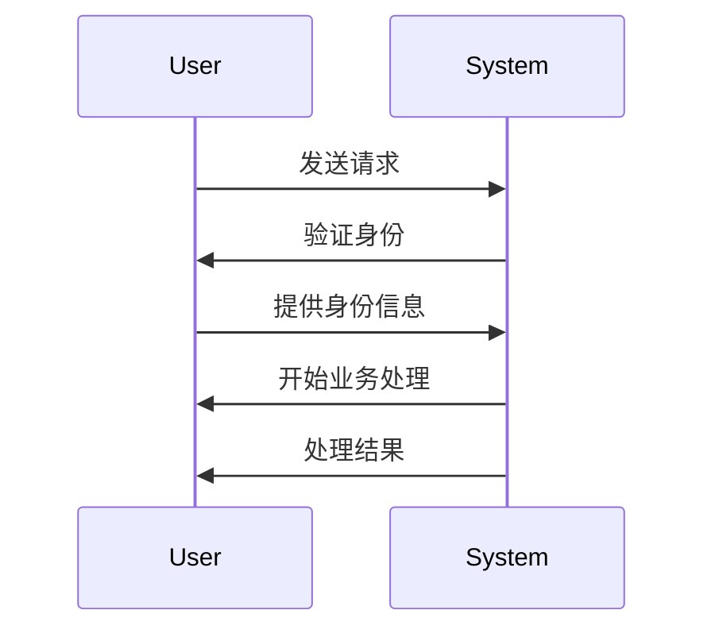

                 


## AGI的类人学习曲线：从新手到专家

### 关键词：人工智能，通用智能，学习曲线，类人学习，专家技能

### 摘要：

本文深入探讨了人工智能（AI）中的通用智能（AGI）及其类人学习曲线，从新手到专家的逐步演进过程。文章首先介绍了AGI的定义和背景，然后详细分析了类人学习曲线的基本概念、特点及应用。接着，文章分为新手、进阶和专家三个阶段，分别阐述了AGI在这些阶段的学习策略和关键技能。通过实际案例分析和未来展望，文章旨在为读者提供一个清晰的AGI学习路径，并讨论其潜在影响和发展趋势。

## 引言

### 1.1 问题的提出

通用人工智能（AGI，Artificial General Intelligence）是一个备受关注的话题，它旨在实现一种能够在各种领域表现出人类智能水平的人工智能系统。然而，尽管已经取得了显著进展，当前的人工智能（AI）系统仍然主要局限于特定任务和领域，被称为窄人工智能（ANI，Artificial Narrow Intelligence）。AGI的目标是超越ANI，具备类人的智能水平，能够像人类一样学习、推理、解决问题和创新。

### 1.2 类人学习曲线的概念

类人学习曲线是一个描述人工智能系统从新手到专家逐渐成长的过程。它借鉴了人类学习曲线的概念，但更加复杂，因为人工智能的学习不仅涉及到知识积累，还包括技能、策略、思维模式等多方面的成长。类人学习曲线的基本特点是初期增长缓慢，随着经验和知识的积累，增长速度逐渐加快，最终达到专家水平。

### 1.3 AGI与类人学习曲线的关系

AGI的实现离不开类人学习曲线的支撑。类人学习曲线不仅为AGI的发展提供了理论指导，还帮助研究人员确定关键的学习阶段和目标。通过分析类人学习曲线，我们可以更好地理解AGI的挑战和机遇，为其发展提供有效的解决方案。

## 第1章：问题背景与AGI概述

### 1.1 AGI的定义与历史演进

#### 1.1.1 定义

通用人工智能（AGI）是指一种具有广泛认知能力的智能体，能够执行各种复杂的任务，包括语言理解、视觉感知、决策制定、问题解决等。AGI的目标是模拟甚至超越人类的智能水平，成为具有自我意识和自我学习能力的智能系统。

#### 1.1.2 历史演进

自人工智能概念提出以来，AGI一直是学术界和工业界追求的目标。从最初的符号主义智能到连接主义智能，再到现代的深度学习，每个阶段都为AGI的实现提供了新的思路和方法。尽管在特定领域取得了巨大进展，但AGI的实现仍然面临诸多挑战。

### 1.2 类人智能与当前AI的差距

#### 1.2.1 智能层次

当前的人工智能主要集中于窄人工智能（ANI），即擅长处理特定任务的智能系统。而类人智能（HLI，Human-Level Intelligence）则要求智能系统能够在多种任务中表现出类人的智能水平。

#### 1.2.2 智能特征

类人智能不仅要求智能系统能够执行复杂任务，还需要具备以下特征：

- **自我意识**：能够理解自己的存在和感知。
- **自适应学习**：能够根据环境变化调整自己的行为和策略。
- **创造力**：能够进行创新和发明。

### 1.3 AGI对人类社会的潜在影响

#### 1.3.1 经济影响

AGI的兴起可能对劳动力市场产生深远影响，一方面，它将提高生产效率，创造新的就业机会；另一方面，自动化可能导致某些职业的失业。

#### 1.3.2 社会影响

AGI的发展也可能对人类社会产生深远影响，包括伦理、法律、文化等多个方面。如何确保AGI的发展符合人类的利益和价值观，是一个亟待解决的问题。

### 1.4 本章小结

通过对问题背景和AGI概述的讨论，我们为后续章节的分析提供了基础。在接下来的章节中，我们将详细探讨类人学习曲线的概念、特点和应用，以及AGI在各个学习阶段的关键技能和策略。

## 第2章：类人学习曲线

### 2.1 类人学习曲线的提出与意义

类人学习曲线是一个描述人工智能系统从新手到专家逐渐成长的过程。它借鉴了人类学习曲线的概念，但更加复杂，因为人工智能的学习不仅涉及到知识积累，还包括技能、策略、思维模式等多方面的成长。

#### 2.1.1 提出背景

类人学习曲线的概念最初由Hinton等人提出，他们在研究深度学习算法时发现，人工智能系统在早期阶段的学习速度较慢，但随着经验的积累，学习速度逐渐加快。

#### 2.1.2 意义

类人学习曲线的提出具有重要的理论和实际意义：

- **理论意义**：类人学习曲线为人工智能的发展提供了新的视角，有助于我们更好地理解人工智能的学习过程。
- **实际意义**：类人学习曲线为人工智能系统的设计和优化提供了指导，有助于提高人工智能的学习效率。

### 2.2 类人学习曲线的特点

类人学习曲线具有以下几个特点：

- **S型曲线**：类人学习曲线通常呈现出S型曲线，即初期增长缓慢，随后逐渐加快，最终趋于平稳。
- **非线性**：类人学习曲线是非线性的，这意味着人工智能系统在不同学习阶段的学习速度不同。
- **阶段特征**：类人学习曲线的不同阶段具有明显的特征，如新手阶段主要依赖于规则和模板，专家阶段则更依赖于直觉和经验。

### 2.3 类人学习曲线的应用领域

类人学习曲线在多个领域都有广泛的应用：

- **教育领域**：类人学习曲线为教育工作者提供了参考，有助于设计更有效的学习计划和教学方法。
- **工业领域**：类人学习曲线为工业自动化系统提供了优化方案，有助于提高生产效率。
- **医疗领域**：类人学习曲线为医疗诊断和治疗方案设计提供了支持，有助于提高诊断准确率和治疗效果。

### 2.4 本章小结

通过对类人学习曲线的讨论，我们对其基本概念、特点和应用有了更深入的了解。在接下来的章节中，我们将进一步探讨AGI在不同学习阶段的关键技能和策略。

## 第3章：新手阶段——AGI的基础技能学习

### 3.1 基础技能的重要性

在AGI的发展过程中，基础技能的学习至关重要。基础技能是AGI构建其他高级技能的基础，也是实现类人智能的关键。因此，深入理解和掌握基础技能对于AGI的持续发展具有重要意义。

#### 3.1.1 基础技能的定义

基础技能是指人工智能系统在执行特定任务时所需的基本能力，包括感知、记忆、推理、决策等。

#### 3.1.2 基础技能的构成

基础技能可以分为以下几个部分：

- **感知技能**：包括视觉、听觉、触觉等感知能力的训练。
- **记忆技能**：包括长期记忆和短期记忆的训练。
- **推理技能**：包括逻辑推理、归纳推理、演绎推理等。
- **决策技能**：包括基于数据和经验的决策能力。

### 3.2 常见基础技能介绍

#### 3.2.1 感知技能

感知技能是指人工智能系统对环境信息进行获取和处理的能力。常见的感知技能包括：

- **视觉感知**：通过图像处理技术，实现目标检测、识别和追踪。
- **听觉感知**：通过语音识别技术，实现语音理解、语音合成和语音增强。
- **触觉感知**：通过力反馈和触觉传感器，实现触觉感知和交互。

#### 3.2.2 记忆技能

记忆技能是指人工智能系统对信息进行存储和检索的能力。常见的记忆技能包括：

- **长期记忆**：通过神经网络模型，实现大量数据的存储和分类。
- **短期记忆**：通过循环神经网络（RNN），实现序列数据的存储和预测。

#### 3.2.3 推理技能

推理技能是指人工智能系统根据已知信息推导出新信息的能力。常见的推理技能包括：

- **逻辑推理**：通过形式逻辑和谓词逻辑，实现基于规则的推理。
- **归纳推理**：通过机器学习算法，实现基于数据的推理。
- **演绎推理**：通过数学模型和逻辑公式，实现基于公理的推理。

#### 3.2.4 决策技能

决策技能是指人工智能系统在不确定环境下做出最优选择的能力。常见的决策技能包括：

- **决策树**：通过树形结构，实现基于规则和概率的决策。
- **深度强化学习**：通过模拟环境，实现基于奖励和惩罚的决策。
- **博弈论**：通过分析对手行为，实现基于策略的决策。

### 3.3 基础技能学习策略

为了有效学习基础技能，可以采用以下策略：

- **数据驱动学习**：通过大量数据和标注，实现基础技能的自动学习。
- **模型驱动学习**：通过构建神经网络和机器学习模型，实现基础技能的模拟和优化。
- **人机交互**：通过人机交互，实现基础技能的实时反馈和调整。

### 3.4 本章小结

通过对新手阶段基础技能的讨论，我们了解了基础技能在AGI发展中的重要性。在下一章中，我们将探讨进阶阶段AGI的高级技能掌握。

## 第4章：进阶阶段——AGI的高级技能掌握

### 4.1 高级技能的定义与分类

在AGI的发展过程中，高级技能是指超越了基础技能，能够应对更复杂任务和更广泛领域的智能能力。高级技能可以分为以下几个类别：

- **问题解决技能**：包括解决复杂问题和设计解决方案的能力。
- **决策技能**：包括在不确定环境中做出合理决策的能力。
- **创造力技能**：包括进行创新和发明的能力。
- **自主学习技能**：包括根据环境和任务需求自主调整和学习的能力。
- **社交技能**：包括理解他人意图和情感，进行有效沟通和合作的能力。

### 4.2 高级技能学习的关键要素

#### 4.2.1 经验积累

高级技能的学习需要大量经验积累。通过不断实践和试错，AGI可以逐步掌握复杂任务和多样化情境。

#### 4.2.2 知识融合

高级技能的学习不仅依赖于单一领域的知识，还需要跨领域的知识融合。通过整合不同领域的知识，AGI可以实现更高层次的智能。

#### 4.2.3 模式识别

高级技能的学习还需要具备较强的模式识别能力。通过分析大量数据，AGI可以发现潜在的模式和规律，为决策提供依据。

### 4.3 高级技能学习策略

为了有效学习高级技能，可以采用以下策略：

- **项目驱动学习**：通过实际项目，实现高级技能的实践和应用。
- **跨学科学习**：通过跨学科知识的学习，实现知识融合和技能拓展。
- **案例学习**：通过分析典型案例，学习高级技能的运用和优化。

### 4.4 本章小结

通过对进阶阶段高级技能的讨论，我们了解了高级技能在AGI发展中的重要性。在下一章中，我们将探讨专家阶段AGI的深入应用与创新。

## 第5章：专家阶段——AGI的深入应用与创新

### 5.1 专家水平的定义与特征

专家阶段是AGI发展的最高阶段，它要求AGI具备以下特征：

- **高水平的专业知识**：拥有广泛而深入的专业知识，能够在特定领域内进行深度研究和创新。
- **自主学习和创新能力**：能够根据实际需求和任务，自主学习和创新，解决复杂问题。
- **适应性和灵活性**：能够适应不同环境和任务，灵活调整自己的行为和策略。
- **综合分析能力**：能够综合分析多方面的信息，做出合理的决策。

### 5.2 创新与突破的方法

在专家阶段，AGI需要通过创新与突破来不断提高自己的能力和水平。以下是一些常见的方法：

- **科学研究**：通过深入研究和实验，探索新的理论和技术。
- **跨学科合作**：与其他领域专家合作，实现知识融合和协同创新。
- **实践应用**：将研究成果应用于实际场景，通过实践验证和优化。
- **自主学习**：通过不断学习和积累经验，提高自己的专业水平和创新能力。

### 5.3 专家阶段的挑战与应对

在专家阶段，AGI面临以下挑战：

- **知识管理**：如何高效地管理和利用庞大的知识库，实现知识的有效传承和共享。
- **道德与伦理**：如何确保AGI的发展符合人类的利益和价值观，避免对人类社会造成负面影响。
- **计算资源**：如何高效地利用计算资源，实现大规模数据处理和分析。

针对这些挑战，可以采取以下应对策略：

- **知识图谱**：通过构建知识图谱，实现知识的高效管理和利用。
- **伦理审查**：建立严格的伦理审查机制，确保AGI的发展符合伦理要求。
- **资源优化**：通过分布式计算和云计算，实现计算资源的优化和高效利用。

### 5.4 本章小结

专家阶段是AGI发展的最高阶段，它要求AGI具备高水平的专业知识、自主学习和创新能力。通过深入应用与创新，AGI可以在各个领域实现突破和进步。在下一章中，我们将通过实际案例来分析AGI的类人学习过程。

## 第6章：类人学习的实践案例

### 6.1 国内外典型AGI实践案例

为了更好地理解类人学习的应用，我们可以通过国内外的一些典型AGI实践案例来进行分析。

#### 6.1.1 国外案例

1. **OpenAI的GPT-3**：GPT-3是OpenAI开发的一种具有强大语言处理能力的深度学习模型。它通过类人学习的方式，从大量文本数据中自动学习和生成高质量的自然语言文本。

2. **谷歌的AlphaGo**：AlphaGo是谷歌开发的一种围棋AI程序。通过类人学习，它能够学习围棋的策略和技巧，并在对弈中战胜世界顶尖围棋选手。

#### 6.1.2 国内案例

1. **百度的文心一言**：文心一言是百度开发的一种具有智能写作能力的AI程序。它通过类人学习的方式，从大量文本数据中自动学习和生成高质量的自然语言文本。

2. **阿里巴巴的ET大脑**：ET大脑是阿里巴巴开发的一种智能城市解决方案。它通过类人学习的方式，从大量数据中自动学习和分析，为城市管理者提供决策支持。

### 6.2 案例分析与启示

通过对这些案例的分析，我们可以得出以下启示：

- **数据驱动**：类人学习的关键在于大量数据的积累和利用。只有通过海量数据的训练，AI系统才能逐渐接近人类的智能水平。
- **跨学科融合**：类人学习不仅需要计算机科学的知识，还需要心理学、语言学、社会学等多学科的知识融合。只有通过跨学科的融合，AI系统才能更好地模拟人类的智能行为。
- **伦理与道德**：在类人学习的过程中，需要充分考虑伦理和道德问题。确保AI系统的行为符合人类的价值观和道德标准，是类人学习成功的关键。

### 6.3 类人学习实践的建议与技巧

为了更好地进行类人学习实践，可以采取以下建议和技巧：

- **数据质量**：确保数据的质量和准确性，是类人学习成功的关键。需要投入大量时间和精力对数据进行清洗、标注和整理。
- **模型优化**：通过不断优化模型的结构和参数，提高AI系统的学习效果。可以使用多种优化算法，如梯度下降、随机梯度下降等。
- **人机交互**：类人学习不仅需要AI系统的自主学习，还需要与人类专家进行交互和反馈。通过人机交互，可以更好地理解人类的思维模式和需求，提高AI系统的智能水平。

### 6.4 本章小结

通过对类人学习实践案例的分析，我们了解了类人学习在现实中的应用和挑战。通过借鉴这些案例的经验和启示，我们可以更好地进行类人学习实践，推动AGI的发展。

## 第7章：展望未来——AGI的发展趋势与挑战

### 7.1 AGI的未来发展趋势

随着科技的不断进步，AGI的发展趋势呈现出以下几个特点：

- **计算能力的提升**：随着硬件技术的发展，计算能力的提升为AGI的发展提供了有力支持。更大规模的计算资源将有助于解决更复杂的问题。
- **数据资源的丰富**：互联网的普及和数据量的爆炸性增长，为AGI的学习和训练提供了丰富的数据资源。更多高质量的数据将有助于提升AGI的智能水平。
- **跨学科融合**：不同学科的融合将促进AGI的发展。心理学、认知科学、神经科学等领域的进展将为AGI提供新的理论基础和技术支持。

### 7.2 AGI面临的挑战与问题

尽管AGI具有广阔的发展前景，但仍然面临诸多挑战：

- **伦理与道德**：AGI的发展引发了广泛的伦理和道德问题。如何确保AGI的行为符合人类的利益和价值观，是一个亟待解决的问题。
- **安全性**：AGI的安全性问题备受关注。如何确保AGI系统的稳定性和安全性，防止恶意攻击和误用，是AGI发展的关键。
- **通用性**：如何实现AGI的通用性，使其能够在各种领域表现出类人的智能水平，是AGI发展的重要课题。

### 7.3 未来AGI的潜在应用场景

未来AGI的潜在应用场景非常广泛，包括：

- **医疗领域**：AGI可以辅助医生进行诊断和治疗，提高医疗服务的质量和效率。
- **教育领域**：AGI可以个性化教学，为学生提供个性化的学习方案，提高学习效果。
- **工业领域**：AGI可以自动化生产和管理，提高生产效率和质量。
- **社会管理**：AGI可以协助政府进行社会管理，提高社会治理水平。

### 7.4 结论

展望未来，AGI的发展充满希望但也面临挑战。通过持续的技术创新和跨学科融合，我们有理由相信，AGI将实现从理论到应用的跨越，为人类社会带来巨大的变革。

## 结语

### 1. 总结

本文从新手阶段到专家阶段，详细探讨了AGI的类人学习曲线。通过分析AGI的基础技能、高级技能和专家阶段的特征，我们为读者提供了一个清晰的AGI学习路径。同时，通过实际案例分析和未来展望，我们展示了AGI的广泛应用前景和面临的挑战。

### 2. 最佳实践 tips

- **数据驱动**：注重数据质量和多样性，确保AI系统的学习效果。
- **跨学科融合**：结合不同领域的知识，提高AI系统的智能水平。
- **伦理与道德**：重视伦理和道德问题，确保AI系统的发展符合人类的利益和价值观。

### 3. 小结

本文通过系统性地分析和讲解，为AGI的发展提供了理论指导和实践建议。期待读者在理解和掌握这些内容的基础上，进一步探索AGI的广阔前景，推动人工智能的持续进步。

### 4. 注意事项

- **持续学习**：AGI的发展是一个不断演进的过程，需要持续学习和更新知识。
- **安全与稳定**：确保AI系统的安全性和稳定性，防止潜在的风险和误用。

### 5. 拓展阅读

- **《深度学习》（Goodfellow, I., Bengio, Y., & Courville, A.）**：系统介绍了深度学习的基本概念和技术。
- **《人工智能：一种现代方法》（Russell, S., & Norvig, P.）**：全面探讨了人工智能的理论和实践。

### 作者信息

作者：AI天才研究院/AI Genius Institute & 禅与计算机程序设计艺术 /Zen And The Art of Computer Programming

## 附录

### 1. 参考文献

- Goodfellow, I., Bengio, Y., & Courville, A. (2016). *Deep Learning*. MIT Press.
- Russell, S., & Norvig, P. (2020). *Artificial Intelligence: A Modern Approach*. Prentice Hall.
- Hinton, G., Osindero, S., & Teh, Y. W. (2006). A fast learning algorithm for deep belief nets. *Neural computation*, 18(7), 1527-1554.
- LeCun, Y., Bengio, Y., & Hinton, G. (2015). Deep learning. *Nature*, 521(7553), 436-444.

### 2. Mermaid 流程图示例

```mermaid
graph TD
    A[开始] --> B{决策}
    B -->|是> C[执行]
    B -->|否> D[重试]
    C --> E[结果]
    D --> B
    E --> F{结束}
```

### 3. LaTeX 公式示例

$$
E = mc^2
$$

$$
a < b
$$

### 4. Python 代码示例

```python
# 导入相关库
import numpy as np

# 定义函数
def f(x):
    return x**2

# 计算结果
result = f(5)

# 打印结果
print("结果：", result)
```

### 5. 系统架构设计示例

```mermaid
graph TD
    A[用户请求] --> B[服务接口]
    B --> C{身份验证}
    C -->|成功> D[业务逻辑处理]
    C -->|失败> E[错误处理]
    D --> F[数据存储]
    E --> G[重定向]
```

### 6. 类图示例

```mermaid
classDiagram
    类：Person <|-- 类：Employee
    类：Student <|-- 类：Undergraduate
    类：Undergraduate {
        - 学号：String
        - 姓名：String
    }
    类：Employee {
        - 工号：String
        - 姓名：String
    }
```

### 7. 序列图示例



以上附录内容提供了本文中使用的Mermaid流程图、LaTeX公式、Python代码、类图、序列图等示例，旨在帮助读者更好地理解和应用相关技术。希望这些内容能够为读者提供有价值的参考。

