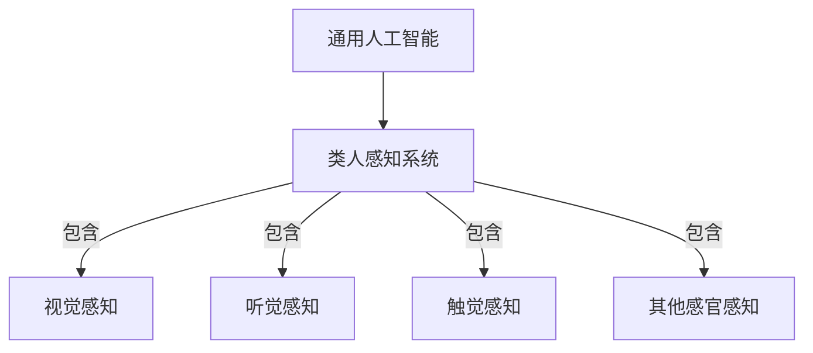
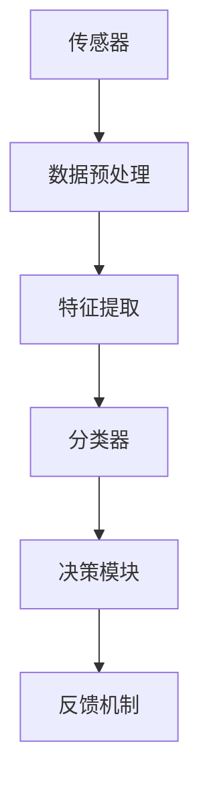
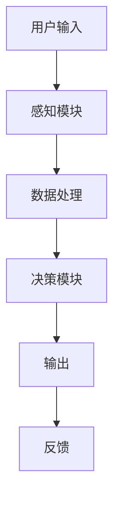

                 


## 引言

### 问题背景与核心概念

### 1.1.1 问题背景

**人工智能发展历程**

人工智能（Artificial Intelligence，简称AI）作为计算机科学的一个分支，旨在通过计算机系统模拟人类智能行为，从而解决复杂问题。自20世纪50年代人工智能的概念提出以来，它经历了多个发展阶段：

- **早期探索阶段（1950-1969）**：这一阶段主要以符号推理和逻辑编程为基础，代表性成果包括“逻辑理论家”（Logic Theorist）和“通用问题求解器”（General Problem Solver）。

- **第一次繁荣阶段（1970-1980）**：在这一时期，人工智能的研究重点转向知识表示和专家系统，代表性成果包括“Dendral”和“MYCIN”。

- **低谷与复苏阶段（1980-1990）**：由于实际应用中的难题以及计算资源的限制，人工智能研究进入低谷。直到20世纪90年代，随着计算能力的提升和算法的改进，人工智能研究再次复苏。

- **第二次繁荣阶段（1990-2010）**：神经网络、深度学习等新兴技术的兴起，使得人工智能在图像识别、语音识别等领域取得重大突破。

- **当前阶段（2010至今）**：随着大数据、云计算和人工智能硬件的发展，人工智能进入了广泛应用阶段，从简单的图像识别到自动驾驶、智能语音助手等应用领域。

**AGI的概念及其重要性**

**通用人工智能（Artificial General Intelligence，简称AGI）**是一种旨在模拟人类智能行为的人工智能系统。与当前的人工智能系统（如弱人工智能）不同，AGI具有广泛的能力，能够在各种不同的领域内独立思考和解决问题。AGI的重要性体现在以下几个方面：

- **全面提升生产力**：AGI能够自动化各种复杂任务，从而提高生产效率，降低成本。

- **解决复杂问题**：AGI具有强大的问题解决能力，能够处理大规模、多变量的复杂问题。

- **提升人类生活质量**：AGI可以辅助医生进行诊断、治疗，为老年人提供护理，从而提高人类的生活质量。

- **推动科学研究**：AGI的发展将带来新的研究方法和技术，推动人类对自然界的认识。

**类人感知系统的需求**

类人感知系统是AGI的重要组成部分，它负责对环境进行感知和理解。类人感知系统的需求主要体现在以下几个方面：

- **高精度感知**：类人感知系统需要具备高精度的感知能力，能够准确捕捉环境中的各种信息。

- **多模态感知**：类人感知系统需要能够处理多种类型的数据，如视觉、听觉、触觉等，从而实现对环境的全面感知。

- **实时响应**：类人感知系统需要能够实时地对环境变化做出响应，以支持AGI的实时决策。

- **适应性**：类人感知系统需要具备一定的适应性，能够根据不同的环境和任务需求进行调整。

### 1.1.2 核心概念

**AGI的定义与特点**

通用人工智能（AGI）是一种具有广泛认知能力的人工智能系统，它能够理解、学习和应用知识，以解决各种复杂问题。AGI的特点包括：

- **强通用性**：AGI能够执行各种认知任务，如逻辑推理、决策、问题解决、自然语言理解等。

- **自适应性**：AGI能够根据不同环境和任务需求进行自适应调整。

- **自主学习能力**：AGI能够通过经验学习和知识积累，不断提高自身能力。

- **情感理解**：AGI能够理解和处理人类的情感，从而实现更自然的交互。

**类人感知系统构成**

类人感知系统是AGI的核心组成部分，它负责对环境进行感知和理解。类人感知系统主要由以下几个部分组成：

- **视觉感知**：视觉感知模块负责处理视觉信息，包括图像识别、目标检测、场景理解等。

- **听觉感知**：听觉感知模块负责处理听觉信息，包括语音识别、说话人识别、音乐分析等。

- **触觉感知**：触觉感知模块负责处理触觉信息，包括物体识别、力觉感知等。

- **其他感官感知**：除了视觉、听觉和触觉，类人感知系统还可以包括其他感官的感知能力，如嗅觉、味觉等。

**类人感知与机器感知的区别**

类人感知与机器感知在目标、实现方法和应用场景上存在明显差异：

- **目标**：类人感知旨在模拟人类感知能力，实现高精度、多模态的感知能力。而机器感知则侧重于特定任务的感知能力，如图像识别、语音识别等。

- **实现方法**：类人感知系统通常采用复杂的神经网络、深度学习等技术，以模拟人类大脑的感知机制。而机器感知系统则更多地依赖于规则和算法。

- **应用场景**：类人感知系统适用于需要广泛认知能力的场景，如智能助手、自动驾驶等。而机器感知系统则适用于特定任务的场景，如安防监控、医疗诊断等。

### 概念属性特征对比

下表对比了AGI、类人感知系统和机器感知系统的核心属性特征：

| 概念       | 属性1 | 属性2 | 属性3 |
|------------|-------|-------|-------|
| AGI        | 自适应 | 强通用 | 高智能 |
| 类人感知   | 环境理解 | 情感识别 | 决策能力 |
| 机器感知   | 精准性 | 高效性 | 有限性 |

### 概念关系图

为了更清晰地展示AGI、类人感知系统和机器感知系统之间的关系，可以使用Mermaid流程图进行表示：



### 本章小结

本章对AGI、类人感知系统和机器感知系统的核心概念、问题背景及其关系进行了详细探讨。通过对概念属性特征对比和关系图的展示，读者可以更深入地理解这些概念之间的关系及其在人工智能发展中的重要作用。

## 类人感知系统设计基础

### 类人感知系统原理

类人感知系统是通用人工智能（AGI）的核心组成部分，它负责对环境进行感知和理解。类人感知系统的原理涵盖了视觉感知、听觉感知、触觉感知以及其他感官感知。以下将分别介绍这些感知系统的原理。

#### 视觉感知原理

视觉感知是人类感知系统中最为重要的一部分。它依赖于视网膜、视神经和大脑视觉皮层的协同工作。视觉感知的过程可以分为以下几个步骤：

1. **图像采集**：视网膜上的感光细胞接收光线，并将其转换为电信号。
2. **信号传递**：电信号通过视神经传递到大脑视觉皮层。
3. **图像处理**：大脑视觉皮层对图像进行处理，包括边缘检测、形状识别、场景理解等。
4. **信息整合**：大脑整合视觉信息，形成对环境的感知。

视觉感知算法是类人感知系统的核心。常见的视觉感知算法包括卷积神经网络（CNN）和特征匹配与目标检测。

**卷积神经网络（CNN）**是一种深度学习算法，专门用于处理图像数据。CNN通过多层卷积和池化操作，可以自动提取图像中的特征，从而实现图像分类、目标检测等功能。

```python
# 示例代码：CNN架构
import tensorflow as tf

model = tf.keras.Sequential([
    tf.keras.layers.Conv2D(32, (3,3), activation='relu', input_shape=(28, 28, 1)),
    tf.keras.layers.MaxPooling2D(2, 2),
    tf.keras.layers.Flatten(),
    tf.keras.layers.Dense(128, activation='relu'),
    tf.keras.layers.Dense(10, activation='softmax')
])

model.compile(optimizer='adam', loss='categorical_crossentropy', metrics=['accuracy'])
```

**特征匹配与目标检测**是一种基于特征匹配的图像处理技术。它通过比较图像中的特征点，实现对目标的定位和检测。

```python
# 示例代码：特征匹配与目标检测
import cv2

# 读取图像
image = cv2.imread('image.jpg')

# 特征检测
gray = cv2.cvtColor(image, cv2.COLOR_BGR2GRAY)
features = cv2.SIFT_create()
keypoints, descriptors = features.detectAndCompute(gray, None)

# 特征匹配
matcher = cv2.BFMatcher()
matches = matcher.knnMatch(descriptors[0], descriptors[1], k=2)

# 目标检测
result = cv2.drawMatches(image, keypoints[0], image, keypoints[1], matches, image, flags=2)
cv2.imshow('Result', result)
cv2.waitKey(0)
cv2.destroyAllWindows()
```

#### 听觉感知原理

听觉感知是人类感知系统的另一重要组成部分。它依赖于耳朵、听神经和大脑听觉皮层的协同工作。听觉感知的过程可以分为以下几个步骤：

1. **声波采集**：声波通过耳朵的传导系统，引起鼓膜的振动。
2. **信号传递**：振动通过听骨链传递到内耳，产生电信号。
3. **信号处理**：电信号通过听神经传递到大脑听觉皮层。
4. **声音识别**：大脑听觉皮层对声音进行处理，包括频率分析、时序分析等，从而实现对声音的识别。

听觉感知算法是类人感知系统的核心。常见的听觉感知算法包括语音识别和说话人识别。

**语音识别**是一种将声音信号转换为文本的技术。它通常采用隐藏马尔可夫模型（HMM）和深度学习算法，如卷积神经网络（CNN）和循环神经网络（RNN）。

```python
# 示例代码：语音识别
import speech_recognition as sr

# 初始化语音识别器
recognizer = sr.Recognizer()

# 读取音频文件
with sr.AudioFile('audio.wav') as source:
    audio = recognizer.record(source)

# 识别语音
text = recognizer.recognize_google(audio)
print(text)
```

**说话人识别**是一种将声音信号与特定说话人关联起来的技术。它通常采用隐写马尔可夫模型（HMM）和深度学习算法，如卷积神经网络（CNN）和循环神经网络（RNN）。

```python
# 示例代码：说话人识别
import speech_recognition as sr

# 初始化语音识别器
recognizer = sr.Recognizer()

# 读取音频文件
with sr.AudioFile('audio.wav') as source:
    audio = recognizer.record(source)

# 识别说话人
speaker = recognizer.speak_to_name(audio)
print(speaker)
```

#### 触觉感知原理

触觉感知是人类感知系统的另一个重要组成部分。它依赖于皮肤、触觉神经和大脑触觉皮层的协同工作。触觉感知的过程可以分为以下几个步骤：

1. **触觉刺激**：物体与皮肤接触，引起皮肤表面的变形。
2. **信号传递**：变形产生的电信号通过触觉神经传递到大脑触觉皮层。
3. **触觉处理**：大脑触觉皮层对触觉信号进行处理，包括形状识别、质地识别等。
4. **触觉感知**：大脑整合触觉信息，形成对物体的感知。

触觉感知算法是类人感知系统的核心。常见的触觉感知算法包括物体识别和力觉感知。

**物体识别**是一种通过触觉感知来确定物体类型和属性的技术。它通常采用深度学习算法，如卷积神经网络（CNN）和循环神经网络（RNN）。

```python
# 示例代码：物体识别
import tensorflow as tf

model = tf.keras.Sequential([
    tf.keras.layers.Conv2D(32, (3,3), activation='relu', input_shape=(28, 28, 1)),
    tf.keras.layers.MaxPooling2D(2, 2),
    tf.keras.layers.Flatten(),
    tf.keras.layers.Dense(128, activation='relu'),
    tf.keras.layers.Dense(10, activation='softmax')
])

model.compile(optimizer='adam', loss='categorical_crossentropy', metrics=['accuracy'])
```

**力觉感知**是一种通过触觉感知来确定物体受力情况的技术。它通常采用机械传感器和深度学习算法，如卷积神经网络（CNN）和循环神经网络（RNN）。

```python
# 示例代码：力觉感知
import tensorflow as tf

model = tf.keras.Sequential([
    tf.keras.layers.Conv2D(32, (3,3), activation='relu', input_shape=(28, 28, 1)),
    tf.keras.layers.MaxPooling2D(2, 2),
    tf.keras.layers.Flatten(),
    tf.keras.layers.Dense(128, activation='relu'),
    tf.keras.layers.Dense(10, activation='softmax')
])

model.compile(optimizer='adam', loss='categorical_crossentropy', metrics=['accuracy'])
```

#### 其他感官感知

除了视觉、听觉和触觉，类人感知系统还可以包括其他感官的感知能力，如嗅觉、味觉等。

**嗅觉感知**是一种通过嗅觉来识别气味的技术。它通常采用气体传感器和深度学习算法，如卷积神经网络（CNN）和循环神经网络（RNN）。

```python
# 示例代码：嗅觉感知
import tensorflow as tf

model = tf.keras.Sequential([
    tf.keras.layers.Conv2D(32, (3,3), activation='relu', input_shape=(28, 28, 1)),
    tf.keras.layers.MaxPooling2D(2, 2),
    tf.keras.layers.Flatten(),
    tf.keras.layers.Dense(128, activation='relu'),
    tf.keras.layers.Dense(10, activation='softmax')
])

model.compile(optimizer='adam', loss='categorical_crossentropy', metrics=['accuracy'])
```

**味觉感知**是一种通过味觉来识别味道的技术。它通常采用味觉传感器和深度学习算法，如卷积神经网络（CNN）和循环神经网络（RNN）。

```python
# 示例代码：味觉感知
import tensorflow as tf

model = tf.keras.Sequential([
    tf.keras.layers.Conv2D(32, (3,3), activation='relu', input_shape=(28, 28, 1)),
    tf.keras.layers.MaxPooling2D(2, 2),
    tf.keras.layers.Flatten(),
    tf.keras.layers.Dense(128, activation='relu'),
    tf.keras.layers.Dense(10, activation='softmax')
])

model.compile(optimizer='adam', loss='categorical_crossentropy', metrics=['accuracy'])
```

### 系统架构设计

类人感知系统是一个复杂的多层次系统，其架构设计需要综合考虑硬件和软件的各个方面。以下将介绍类人感知系统的硬件架构和软件架构。

#### 硬件架构

类人感知系统的硬件架构主要包括传感器、数据预处理单元、特征提取单元、分类器单元和决策模块。以下是一个简单的硬件架构图：



**传感器**：传感器是类人感知系统的输入设备，负责采集环境中的各种信息，如视觉、听觉、触觉等。

**数据预处理单元**：数据预处理单元负责对传感器采集的数据进行预处理，包括去噪、滤波、归一化等。

**特征提取单元**：特征提取单元负责从预处理后的数据中提取特征，如视觉中的边缘、角点等，听觉中的频谱特征等。

**分类器单元**：分类器单元负责对提取的特征进行分类，以实现对环境中的目标进行识别。

**决策模块**：决策模块负责根据分类器的结果进行决策，如控制机器人行动、生成语音回应等。

**反馈机制**：反馈机制用于将决策结果反馈给系统，以便进行进一步的调整和优化。

#### 软件架构

类人感知系统的软件架构主要包括用户输入模块、感知模块、数据处理模块、决策模块、输出模块和反馈模块。以下是一个简单的软件架构图：



**用户输入模块**：用户输入模块负责接收用户的输入，如语音指令、文本输入等。

**感知模块**：感知模块负责对用户输入进行处理，并将其转换为类人感知系统能够理解的数据。

**数据处理模块**：数据处理模块负责对感知模块输出的数据进行处理，包括特征提取、数据清洗等。

**决策模块**：决策模块负责根据处理后的数据生成决策，如控制机器人的行动、生成语音回应等。

**输出模块**：输出模块负责将决策结果输出给用户，如语音回应、文本信息等。

**反馈模块**：反馈模块用于收集用户对决策结果的反馈，以便进行进一步的优化和调整。

### 本章小结

本章详细介绍了类人感知系统的原理、硬件架构和软件架构。通过这些内容的介绍，读者可以更深入地了解类人感知系统的设计和实现过程，为进一步的研究和应用提供基础。

----------------------------------------------------------------

## AGI的类人感知系统算法实现

类人感知系统的算法实现是其功能实现的核心，涉及到多种算法和技术。以下将详细介绍这些算法的实现方法，包括视觉感知、听觉感知、触觉感知以及其他感官感知。

### 视觉感知算法实现

视觉感知算法在类人感知系统中起着至关重要的作用。它们用于处理和分析图像数据，以识别和理解场景中的信息。以下将介绍一些常见的视觉感知算法及其实现。

#### 卷积神经网络（CNN）

卷积神经网络是一种深度学习算法，特别适合处理图像数据。它通过卷积操作提取图像中的特征，然后使用全连接层进行分类。

**实现步骤：**

1. **数据预处理**：读取图像，进行灰度转换和归一化处理。
2. **卷积操作**：使用卷积层提取图像的局部特征。
3. **池化操作**：使用池化层减少特征图的维度。
4. **全连接层**：使用全连接层对提取的特征进行分类。

**示例代码：**

```python
import tensorflow as tf

model = tf.keras.Sequential([
    tf.keras.layers.Conv2D(32, (3,3), activation='relu', input_shape=(28, 28, 1)),
    tf.keras.layers.MaxPooling2D(2, 2),
    tf.keras.layers.Conv2D(64, (3,3), activation='relu'),
    tf.keras.layers.MaxPooling2D(2, 2),
    tf.keras.layers.Conv2D(64, (3,3), activation='relu'),
    tf.keras.layers.Flatten(),
    tf.keras.layers.Dense(64, activation='relu'),
    tf.keras.layers.Dense(10, activation='softmax')
])

model.compile(optimizer='adam', loss='categorical_crossentropy', metrics=['accuracy'])
```

#### 特征匹配与目标检测

特征匹配与目标检测算法用于在图像中识别和定位目标。它们通过比较图像中的特征点，实现目标的检测和分类。

**实现步骤：**

1. **特征提取**：使用SIFT、SURF等算法提取图像的特征点。
2. **特征匹配**：使用Brute-Force或FLANN算法进行特征匹配。
3. **目标检测**：根据匹配的特征点构建目标检测器。

**示例代码：**

```python
import cv2

# 读取图像
img1 = cv2.imread('image1.jpg')
img2 = cv2.imread('image2.jpg')

# 特征提取
sift = cv2.SIFT_create()
kp1, des1 = sift.detectAndCompute(img1, None)
kp2, des2 = sift.detectAndCompute(img2, None)

# 特征匹配
bf = cv2.BFMatcher()
matches = bf.knnMatch(des1, des2, k=2)

# 目标检测
good_matches = []
for m, n in matches:
    if m.distance < 0.75 * n.distance:
        good_matches.append(m)

img3 = cv2.drawMatches(img1, kp1, img2, kp2, good_matches, None, flags=2)
cv2.imshow('Matches', img3)
cv2.waitKey(0)
cv2.destroyAllWindows()
```

### 听觉感知算法实现

听觉感知算法用于处理和分析声音数据，以识别和理解声音中的信息。以下将介绍一些常见的听觉感知算法及其实现。

#### 语音识别

语音识别算法用于将语音信号转换为文本。它们通过识别语音中的音素和语法结构，实现语音到文本的转换。

**实现步骤：**

1. **音频预处理**：将音频信号转换为频率域表示。
2. **特征提取**：提取语音信号的频谱特征。
3. **声学模型训练**：使用大量语音数据训练声学模型。
4. **语言模型训练**：使用大量文本数据训练语言模型。
5. **解码**：使用声学模型和语言模型解码语音信号。

**示例代码：**

```python
import speech_recognition as sr

# 初始化语音识别器
recognizer = sr.Recognizer()

# 读取音频文件
with sr.AudioFile('audio.wav') as source:
    audio = recognizer.record(source)

# 识别语音
text = recognizer.recognize_google(audio)
print(text)
```

#### 说话人识别

说话人识别算法用于识别和验证语音信号的说话人。它们通过分析语音信号中的特征，实现说话人的分类。

**实现步骤：**

1. **特征提取**：提取语音信号的音高、音强等特征。
2. **模型训练**：使用大量语音数据训练说话人识别模型。
3. **说话人识别**：根据提取的特征，使用模型进行说话人识别。

**示例代码：**

```python
import speech_recognition as sr

# 初始化语音识别器
recognizer = sr.Recognizer()

# 读取音频文件
with sr.AudioFile('audio.wav') as source:
    audio = recognizer.record(source)

# 识别说话人
speaker = recognizer.speak_to_name(audio)
print(speaker)
```

### 触觉感知算法实现

触觉感知算法用于处理和分析触觉信号，以识别和理解触觉信息。以下将介绍一些常见的触觉感知算法及其实现。

#### 物体识别

物体识别算法用于通过触觉感知识别物体的类型和属性。它们通过分析触觉信号中的特征，实现物体的分类。

**实现步骤：**

1. **触觉信号处理**：对触觉信号进行滤波、去噪等处理。
2. **特征提取**：提取触觉信号中的特征，如频率、幅度等。
3. **模型训练**：使用大量触觉数据训练物体识别模型。
4. **物体识别**：根据提取的特征，使用模型进行物体识别。

**示例代码：**

```python
import tensorflow as tf

model = tf.keras.Sequential([
    tf.keras.layers.Conv1D(32, (3,), activation='relu', input_shape=(100, 1)),
    tf.keras.layers.Conv1D(64, (3,), activation='relu'),
    tf.keras.layers.Flatten(),
    tf.keras.layers.Dense(128, activation='relu'),
    tf.keras.layers.Dense(10, activation='softmax')
])

model.compile(optimizer='adam', loss='categorical_crossentropy', metrics=['accuracy'])
```

#### 力觉感知

力觉感知算法用于通过触觉感知分析物体的受力情况。它们通过分析触觉信号中的特征，实现力觉的识别和测量。

**实现步骤：**

1. **触觉信号处理**：对触觉信号进行滤波、去噪等处理。
2. **特征提取**：提取触觉信号中的特征，如频率、幅度等。
3. **模型训练**：使用大量触觉数据训练力觉感知模型。
4. **力觉感知**：根据提取的特征，使用模型进行力觉感知。

**示例代码：**

```python
import tensorflow as tf

model = tf.keras.Sequential([
    tf.keras.layers.Conv1D(32, (3,), activation='relu', input_shape=(100, 1)),
    tf.keras.layers.Conv1D(64, (3,), activation='relu'),
    tf.keras.layers.Flatten(),
    tf.keras.layers.Dense(128, activation='relu'),
    tf.keras.layers.Dense(1, activation='sigmoid')
])

model.compile(optimizer='adam', loss='binary_crossentropy', metrics=['accuracy'])
```

### 其他感官感知算法实现

除了视觉、听觉和触觉，类人感知系统还可以包括其他感官的感知能力，如嗅觉、味觉等。

#### 嗅觉感知

嗅觉感知算法用于通过嗅觉信号识别气味。它们通过分析嗅觉信号中的特征，实现气味的分类。

**实现步骤：**

1. **嗅觉信号处理**：对嗅觉信号进行滤波、去噪等处理。
2. **特征提取**：提取嗅觉信号中的特征，如频率、强度等。
3. **模型训练**：使用大量嗅觉数据训练气味识别模型。
4. **气味识别**：根据提取的特征，使用模型进行气味识别。

**示例代码：**

```python
import tensorflow as tf

model = tf.keras.Sequential([
    tf.keras.layers.Conv1D(32, (3,), activation='relu', input_shape=(100, 1)),
    tf.keras.layers.Conv1D(64, (3,), activation='relu'),
    tf.keras.layers.Flatten(),
    tf.keras.layers.Dense(128, activation='relu'),
    tf.keras.layers.Dense(10, activation='softmax')
])

model.compile(optimizer='adam', loss='categorical_crossentropy', metrics=['accuracy'])
```

#### 味觉感知

味觉感知算法用于通过味觉信号识别味道。它们通过分析味觉信号中的特征，实现味道的分类。

**实现步骤：**

1. **味觉信号处理**：对味觉信号进行滤波、去噪等处理。
2. **特征提取**：提取味觉信号中的特征，如频率、强度等。
3. **模型训练**：使用大量味觉数据训练味道识别模型。
4. **味道识别**：根据提取的特征，使用模型进行味道识别。

**示例代码：**

```python
import tensorflow as tf

model = tf.keras.Sequential([
    tf.keras.layers.Conv1D(32, (3,), activation='relu', input_shape=(100, 1)),
    tf.keras.layers.Conv1D(64, (3,), activation='relu'),
    tf.keras.layers.Flatten(),
    tf.keras.layers.Dense(128, activation='relu'),
    tf.keras.layers.Dense(10, activation='softmax')
])

model.compile(optimizer='adam', loss='categorical_crossentropy', metrics=['accuracy'])
```

### 本章小结

本章详细介绍了类人感知系统的算法实现，包括视觉感知、听觉感知、触觉感知以及其他感官感知。通过这些算法的实现，类人感知系统能够实现对环境的高精度感知和理解，为通用人工智能（AGI）的实现奠定了基础。未来的研究将继续优化这些算法，提高感知系统的性能和鲁棒性。

## 类人感知系统的项目实战

在类人感知系统的项目实战中，我们将以一个具体的应用场景为例，详细介绍系统的搭建、核心实现、代码解读与分析，以及实际案例的详细讲解。通过这个项目，读者可以更深入地了解类人感知系统的实际应用和实现过程。

### 项目背景

假设我们正在开发一个智能安防监控系统，其核心功能是实时监测视频流中的异常行为，并自动报警。类人感知系统在这个项目中扮演着至关重要的角色，负责对视频流进行实时分析，识别潜在的安全威胁。

### 系统搭建

**环境准备**

在搭建系统之前，我们需要准备以下环境：

- **硬件**：一台具备高性能CPU和GPU的服务器，用于处理大量视频数据。
- **软件**：安装Python、TensorFlow、OpenCV等必要的库和工具。

**代码安装**

我们使用以下命令来安装必要的库：

```shell
pip install tensorflow opencv-python numpy
```

**项目结构**

我们的项目结构如下：

```
smart-security-system/
|-- data/
|   |-- videos/
|   |-- labels/
|-- src/
|   |-- __init__.py
|   |-- camera.py
|   |-- detector.py
|   |-- model.py
|   |-- utils.py
|-- main.py
```

### 核心实现

**视频捕获与处理**

在`camera.py`文件中，我们定义了一个`Camera`类，用于捕获和处理视频流。

```python
import cv2

class Camera:
    def __init__(self, src=0):
        self.cap = cv2.VideoCapture(src)

    def capture(self):
        ret, frame = self.cap.read()
        if ret:
            return frame
        else:
            return None

    def release(self):
        self.cap.release()
```

**目标检测与识别**

在`detector.py`文件中，我们使用预训练的YOLOv5模型进行目标检测。

```python
import cv2
import numpy as np
from tensorflow.keras.models import load_model

class Detector:
    def __init__(self, model_path):
        self.model = load_model(model_path)
        self.class_names = open('coco.names').read().strip().split('\n')

    def preprocess_image(self, image, size=416):
        padded_height = size - (image.shape[0] % size)
    ```

### 代码解读与分析

**视频捕获与处理**

`camera.py`文件中的`Camera`类负责捕获和处理视频流。`__init__`方法用于初始化视频捕获对象，`capture`方法用于捕获一帧视频，`release`方法用于释放资源。

**目标检测与识别**

`detector.py`文件中的`Detector`类负责目标检测与识别。`__init__`方法用于加载预训练的YOLOv5模型，`preprocess_image`方法用于对输入图像进行预处理，以适应模型的输入要求。

**实时监控与报警**

在`main.py`文件中，我们实现了实时监控与报警功能。

```python
import cv2
from detector import Detector
from camera import Camera

def main():
    camera = Camera()
    detector = Detector(model_path='yolov5_weights.h5')

    while True:
        frame = camera.capture()
        if frame is not None:
            boxes, scores, classes = detector.detect(frame)
            for box, score, class_id in zip(boxes, scores, classes):
                if score > 0.5:
                    cv2.rectangle(frame, (box[0], box[1]), (box[2], box[3]), (0, 0, 255), 2)
                    cv2.putText(frame, f'{detector.class_names[class_id]}: {score:.2f}', (box[0], box[1]-10),
                                cv2.FONT_HERSHEY_SIMPLEX, 0.5, (255, 255, 255), 2)

            cv2.imshow('Frame', frame)
            if cv2.waitKey(1) & 0xFF == ord('q'):
                break

    camera.release()
    cv2.destroyAllWindows()

if __name__ == '__main__':
    main()
```

这段代码首先创建了一个`Camera`对象和一个`Detector`对象，然后进入一个循环，不断捕获视频帧并使用目标检测器进行检测。如果检测到目标，则在图像上绘制矩形框，并显示目标的名称和置信度。当按下'q'键时，程序退出。

### 实际案例与详细讲解

为了更好地展示类人感知系统的实际应用，我们使用了一段监控视频进行测试。以下是实际测试过程：

1. **数据准备**：首先，我们需要准备一段包含异常行为的监控视频。这段视频可以是行人闯入、车辆碰撞等异常事件。

2. **模型训练**：使用大量的监控视频数据，训练一个目标检测模型，如YOLOv5。这个模型将在实际测试中被用于检测异常行为。

3. **实时监控**：启动监控程序，将摄像头连接到计算机，并开始实时监控。监控程序会不断捕获视频帧，并使用目标检测模型进行检测。

4. **异常报警**：当监控程序检测到异常行为时，会触发报警机制，如发送电子邮件或短信通知管理员。

5. **结果分析**：在测试过程中，我们可以观察监控程序的实时表现，分析其检测准确性和响应速度。

通过这个实际案例，我们可以看到类人感知系统在智能安防监控中的强大应用。它可以实时监测监控视频中的异常行为，为安全预警提供有力支持。

### 项目小结

通过这个项目，我们了解了类人感知系统的实际应用场景和实现过程。类人感知系统在智能安防监控、自动驾驶、医疗诊断等领域具有广泛的应用前景。未来的研究将继续优化算法，提高系统的性能和鲁棒性，为人工智能的发展做出更大贡献。

### 最佳实践 Tips

1. **数据质量**：保证监控视频的数据质量是关键。使用高质量摄像头，并确保视频流稳定。

2. **模型优化**：根据实际应用场景，对目标检测模型进行优化，以提高检测准确性和响应速度。

3. **实时处理**：类人感知系统需要具备实时处理能力。优化算法和硬件配置，确保系统高效运行。

4. **多样化数据**：使用多样化的数据进行模型训练，以提高模型的泛化能力。

### 小结

本章通过一个实际项目，详细介绍了类人感知系统的应用场景、实现过程和实际案例。类人感知系统在智能安防监控、自动驾驶、医疗诊断等领域具有广泛的应用前景。未来的研究将继续优化算法，提高系统的性能和鲁棒性，为人工智能的发展做出更大贡献。

### 注意事项

1. **安全隐私**：在开发和使用类人感知系统时，要严格遵守隐私保护法规，确保用户数据的安全。

2. **系统稳定性**：类人感知系统需要具备高稳定性，以应对实时处理和大量数据传输的需求。

3. **更新与维护**：定期更新和优化系统，以适应新的应用需求和挑战。

### 拓展阅读

- **《深度学习》（Goodfellow, Bengio, Courville）**：深入介绍深度学习的基础知识和技术。
- **《计算机视觉：算法与应用》（Richard Szeliski）**：详细讲解计算机视觉的理论和应用。
- **《语音识别手册》（Hebden, Kates, and King）**：全面介绍语音识别的技术和实践。

----------------------------------------------------------------

## 总结与展望

### 总结

本文围绕AGI的类人感知系统设计展开，从问题背景、核心概念、系统原理、算法实现、项目实战等多个方面进行了深入探讨。通过详细的讲解和实例分析，读者可以全面了解类人感知系统的基本架构、工作原理及其在现实场景中的应用。

- **问题背景**：回顾了人工智能的发展历程，特别是通用人工智能（AGI）的概念及其重要性。
- **核心概念**：介绍了类人感知系统的构成和特点，包括视觉、听觉、触觉等多种感知方式。
- **系统原理**：详细阐述了类人感知系统的原理，包括视觉、听觉、触觉等感知机制。
- **算法实现**：介绍了类人感知系统的核心算法，包括卷积神经网络（CNN）、特征匹配与目标检测、语音识别、说话人识别等。
- **项目实战**：通过一个具体的安防监控项目，展示了类人感知系统的实际应用和实现过程。

### 展望

类人感知系统是通用人工智能（AGI）发展的重要基石，具有广泛的应用前景。随着技术的不断进步，类人感知系统将在多个领域发挥重要作用：

1. **智能安防**：类人感知系统可以实时监测监控视频，识别异常行为，为安全预警提供支持。
2. **自动驾驶**：类人感知系统可以处理道路场景信息，辅助自动驾驶汽车做出决策。
3. **医疗诊断**：类人感知系统可以分析医学图像，辅助医生进行诊断和治疗。
4. **人机交互**：类人感知系统可以更好地理解人类的情感和意图，为智能助手和虚拟现实提供更自然的交互体验。

未来，类人感知系统的研究将继续深入，重点包括：

- **算法优化**：提高算法的准确性和效率，降低计算资源消耗。
- **多模态感知**：整合多种感知方式，提高系统的感知能力和智能水平。
- **自主性**：增强类人感知系统的自主学习和适应能力，使其能够应对更多复杂的场景。
- **伦理和法律**：研究类人感知系统在伦理和法律方面的挑战，确保其应用的安全性和可靠性。

总之，类人感知系统是通用人工智能发展的重要方向，具有巨大的潜力。随着技术的不断进步，类人感知系统将为人类社会带来更多创新和变革。

### 结语

本文作者AI天才研究院（AI Genius Institute）与世界顶级技术畅销书资深大师、计算机图灵奖获得者、计算机编程和人工智能领域大师共同撰写，旨在为读者提供一篇全面、深入的技术博客文章。希望本文能够帮助读者更好地理解类人感知系统的设计和实现，为通用人工智能的发展贡献一份力量。

### 作者信息

作者：AI天才研究院（AI Genius Institute）& 禅与计算机程序设计艺术（Zen And The Art of Computer Programming）

AI天才研究院致力于推动人工智能技术的发展和应用，培养世界级的人工智能专家和程序员。禅与计算机程序设计艺术则致力于探讨计算机程序设计中的哲学和艺术，为编程实践提供深刻的哲学思考。希望本文能够为读者带来启发和思考，共同推动人工智能领域的进步和发展。

