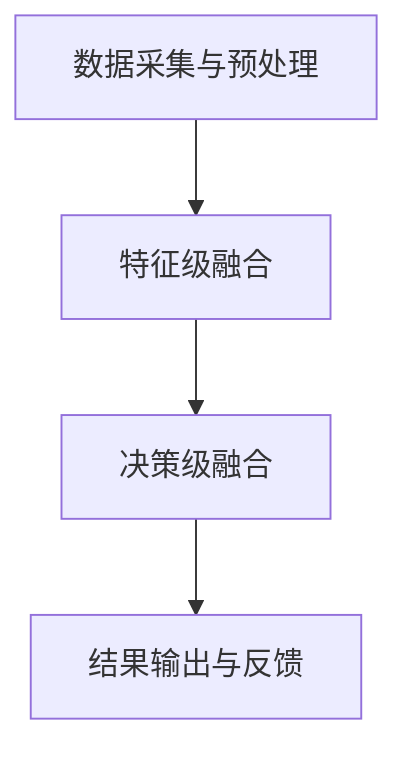
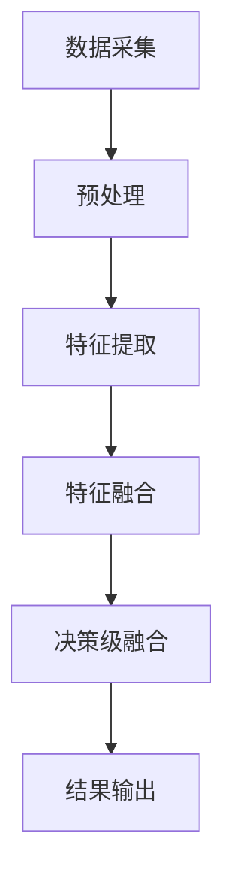
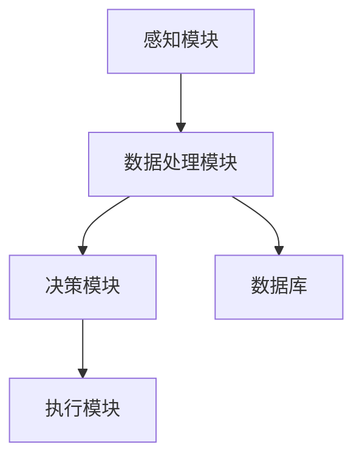

                 

# AGI的类人感知系统：多模态信息的整合与理解

关键词：AGI、类人感知、多模态信息整合、算法原理、数学模型、架构设计

摘要：随着人工智能技术的发展，类人感知系统成为实现通用人工智能（AGI）的关键环节。本文深入探讨了类人感知系统的基本概念、核心原理、多模态信息的整合方法以及算法原理和数学模型。同时，结合实际案例，详细介绍了类人感知系统的架构设计和系统实现。通过这篇文章，读者将全面了解类人感知系统的工作机制，为未来的人工智能研究提供参考。

## 目录大纲

1. **背景介绍与核心概念**
    1.1 AGI的类人感知系统概述
        1.1.1 人工智能的发展历程
        1.1.2 类人感知系统的概念
        1.1.3 类人感知系统的重要性
    1.2 问题解决与边界与外延
        1.2.1 类人感知系统的核心挑战
        1.2.2 类人感知系统的应用领域
        1.2.3 类人感知系统的边界定义
    1.3 概念结构与核心要素组成
        1.3.1 类人感知系统的基本构成
        1.3.2 类人感知系统的主要功能
        1.3.3 类人感知系统的发展趋势

2. **核心概念与联系**
    2.1 类人感知系统的原理与特点
        2.1.1 传感技术
        2.1.2 计算机视觉
        2.1.3 自然语言处理
    2.2 概念属性特征对比表格
        2.2.1 各类感知技术的对比
        2.2.2 类人感知系统与传统感知系统的差异
    2.3 ER实体关系图架构
        2.3.1 实体识别与分类
        2.3.2 实体关系建模

3. **多模态信息的整合与理解**
    3.1 多模态信息整合技术
        3.1.1 多模态数据的采集与预处理
        3.1.2 多模态数据的融合方法
    3.2 类人感知系统的算法原理
        3.2.1 算法原理讲解
        3.2.2 多模态感知算法的mermaid流程图

4. **数学模型与公式讲解**
    4.1 类人感知系统的数学模型
        4.1.1 多模态信息处理的数学框架
        4.1.2 相关的数学公式介绍
    4.2 公式详细讲解与举例说明

5. **系统分析与架构设计**
    5.1 类人感知系统的架构设计
        5.1.1 问题场景介绍
        5.1.2 系统功能设计
        5.1.3 系统架构设计
        5.1.4 系统接口设计
    5.2 系统交互与实现
        5.2.1 系统交互设计
        5.2.2 系统核心实现
        5.2.3 代码应用解读与分析

6. **实际案例分析与讲解**
    6.1 实际案例介绍
        6.1.1 案例背景
        6.1.2 案例目标
    6.2 案例详细讲解剖析
        6.2.1 案例实施过程
        6.2.2 案例结果分析
        6.2.3 案例经验总结

7. **项目小结与最佳实践**
    7.1 项目小结
        7.1.1 项目成果总结
        7.1.2 项目经验与教训
    7.2 最佳实践 tips
        7.2.1 类人感知系统的优化策略
        7.2.2 类人感知系统的使用技巧
    7.3 小结与注意事项
        7.3.1 小结
        7.3.2 注意事项
        7.3.3 拓展阅读

## 第一部分：背景介绍与核心概念

### 1.1 AGI的类人感知系统概述

#### 1.1.1 人工智能的发展历程

人工智能（AI）作为计算机科学的一个分支，自1956年首次被提出以来，已经经历了多个发展阶段。初期的人工智能主要集中于规则推理和知识表示，这一阶段被称为符号主义或逻辑主义时代。随后，随着计算能力的提升和大数据技术的发展，机器学习成为了人工智能的主流方向。机器学习通过统计方法和算法来发现数据中的模式和规律，显著提升了人工智能的性能和应用范围。

近年来，深度学习作为机器学习的一个重要分支，取得了突破性的进展。深度学习利用神经网络的结构，通过多层非线性变换，实现了对复杂数据的建模和处理。深度学习的成功使得计算机视觉、语音识别、自然语言处理等领域的性能大幅提升，为人工智能迈向通用人工智能（AGI）奠定了基础。

#### 1.1.2 类人感知系统的概念

类人感知系统是通用人工智能（AGI）的重要组成部分，旨在模拟人类的感知能力，实现对多模态信息的整合与理解。类人感知系统包括视觉感知、听觉感知、触觉感知等多个维度，能够处理来自环境的不同类型的信息。

类人感知系统与传统的人工智能系统有显著的区别。传统的人工智能系统通常专注于某一特定领域的任务，如图像分类、语音识别等。而类人感知系统则强调跨领域的综合能力，能够处理复杂、不确定的信息，并具备一定的推理和决策能力。

#### 1.1.3 类人感知系统的重要性

类人感知系统的重要性体现在以下几个方面：

1. **信息整合**：人类能够通过多种感官获取信息，类人感知系统可以实现多模态信息的整合，从而提高对复杂环境的理解和反应能力。

2. **智能决策**：通过感知系统获取的信息，类人感知系统可以进行推理和决策，实现自主行动。

3. **人机交互**：类人感知系统可以更好地理解和响应人类的行为和意图，提高人机交互的自然性和效率。

4. **通用人工智能**：类人感知系统是实现通用人工智能的关键环节，它能够处理多种类型的信息，是AGI不可或缺的一部分。

### 1.2 问题解决与边界与外延

#### 1.2.1 类人感知系统的核心挑战

类人感知系统面临的核心挑战包括：

1. **信息融合**：如何有效地融合来自不同模态的信息，提高整体感知能力。

2. **实时处理**：多模态信息通常需要实时处理，这对系统的计算效率和响应速度提出了高要求。

3. **不确定性处理**：真实世界中的信息往往具有不确定性和噪声，如何有效地处理这些信息是类人感知系统需要解决的重要问题。

4. **复杂环境建模**：类人感知系统需要建立对复杂环境的准确模型，以便进行有效的感知和决策。

#### 1.2.2 类人感知系统的应用领域

类人感知系统在多个领域具有重要应用，包括：

1. **智能监控**：通过视觉和音频感知，实现实时监控和异常检测。

2. **自动驾驶**：利用多模态感知系统，实现自动驾驶车辆的感知和决策。

3. **智能家居**：通过视觉、语音和触觉感知，实现智能家居设备的智能化和人性化交互。

4. **医疗诊断**：结合多模态信息，提高医疗诊断的准确性和效率。

#### 1.2.3 类人感知系统的边界定义

类人感知系统的边界定义包括以下几个方面：

1. **感知能力**：类人感知系统主要模拟人类的基本感知能力，如视觉、听觉、触觉等。

2. **决策能力**：类人感知系统具有一定的决策能力，但与人类相比，其决策能力和深度有限。

3. **自主性**：类人感知系统具有一定的自主性，但通常需要与人类交互或受到人类控制。

4. **学习与适应能力**：类人感知系统具备一定的学习与适应能力，但通常需要大量数据和计算资源。

### 1.3 概念结构与核心要素组成

#### 1.3.1 类人感知系统的基本构成

类人感知系统的基本构成包括以下几个核心模块：

1. **感知模块**：负责采集和处理来自不同模态的信息，如视觉、听觉、触觉等。

2. **信息融合模块**：负责融合来自不同模态的信息，提高整体感知能力。

3. **决策模块**：负责基于感知信息进行推理和决策，实现自主行动。

4. **执行模块**：负责执行决策，实现具体的动作或操作。

#### 1.3.2 类人感知系统的主要功能

类人感知系统的主要功能包括：

1. **感知与识别**：通过感知模块获取环境信息，并进行识别和分类。

2. **信息整合**：通过信息融合模块整合来自不同模态的信息，提高整体感知能力。

3. **推理与决策**：通过决策模块基于感知信息进行推理和决策。

4. **自主行动**：通过执行模块实现自主行动，对外界环境进行响应。

#### 1.3.3 类人感知系统的发展趋势

类人感知系统的发展趋势包括以下几个方面：

1. **多模态感知**：随着传感器技术的进步，类人感知系统将支持更多的模态，如嗅觉、味觉等。

2. **实时处理**：随着计算能力的提升，类人感知系统将实现更快的响应速度和更高的实时处理能力。

3. **智能决策**：类人感知系统将更加智能化，能够处理更复杂、更不确定的信息。

4. **人机交互**：类人感知系统将更好地理解和响应人类的行为和意图，实现更自然、更高效的人机交互。

## 第二部分：核心概念与联系

### 2.1 类人感知系统的原理与特点

#### 2.1.1 传感技术

传感技术是类人感知系统的核心组成部分，它通过传感器获取环境中的各种信息。传感器可以包括摄像头、麦克风、加速度计、温度传感器等多种类型，分别用于捕捉视觉、听觉、触觉等信息。传感技术的关键在于如何高效、准确地获取和处理这些信息。

1. **视觉感知**：视觉感知通过摄像头等设备捕捉图像信息，然后通过图像处理算法进行分析和识别。视觉感知的关键技术包括图像识别、目标检测、人脸识别等。

2. **听觉感知**：听觉感知通过麦克风等设备捕捉声音信息，然后通过音频处理算法进行分析和识别。听觉感知的关键技术包括语音识别、声音分类、声源定位等。

3. **触觉感知**：触觉感知通过触摸传感器等设备捕捉触觉信息，然后通过触觉处理算法进行分析和识别。触觉感知的关键技术包括触觉识别、触感增强等。

#### 2.1.2 计算机视觉

计算机视觉是类人感知系统中的重要组成部分，它通过模拟人类的视觉系统，实现对图像的感知和理解。计算机视觉的核心任务包括图像识别、目标检测、图像分割等。

1. **图像识别**：图像识别是通过计算机算法对图像中的对象进行分类和识别。常见的图像识别任务包括人脸识别、车辆识别、物体识别等。

2. **目标检测**：目标检测是在图像中识别出特定对象的位置和范围。目标检测广泛应用于自动驾驶、安防监控、医疗诊断等领域。

3. **图像分割**：图像分割是将图像划分为多个区域，每个区域表示不同的对象或背景。图像分割在图像处理和分析中具有重要意义。

#### 2.1.3 自然语言处理

自然语言处理是类人感知系统中处理文本信息的关键技术，它通过计算机算法实现对文本的理解和处理。自然语言处理的核心任务包括文本分类、情感分析、机器翻译等。

1. **文本分类**：文本分类是将文本数据按照其内容进行分类，例如将新闻文章分类到不同的主题类别。

2. **情感分析**：情感分析是通过分析文本的情感倾向，判断用户对某个主题或产品的态度。情感分析在市场调研、客户服务等领域具有重要应用。

3. **机器翻译**：机器翻译是通过计算机算法将一种语言的文本翻译成另一种语言。机器翻译在跨国交流、全球化商业等领域具有广泛的应用。

### 2.2 概念属性特征对比表格

为了更好地理解类人感知系统中的不同技术，我们可以通过一个对比表格来展示它们的主要特征。

| 技术类型       | 特征                           | 应用场景                                  |
|----------------|--------------------------------|-----------------------------------------|
| 传感技术       | 传感器类型多样，包括视觉、听觉、触觉等 | 智能监控、自动驾驶、智能家居              |
| 计算机视觉     | 基于图像处理算法，实现对图像的感知和理解 | 图像识别、目标检测、图像分割              |
| 自然语言处理   | 基于文本处理算法，实现对文本的理解和处理 | 文本分类、情感分析、机器翻译              |

通过上述对比表格，我们可以看到不同技术类型在特征和应用场景上的差异，这有助于我们更好地理解和应用类人感知系统。

### 2.3 ER实体关系图架构

类人感知系统中的实体关系图（Entity Relationship Diagram，ER图）是描述系统内部实体及其关系的图形化工具。通过ER图，我们可以清晰地了解系统的概念结构和核心要素。

#### 2.3.1 实体识别与分类

实体识别与分类是类人感知系统中的关键任务。实体识别是指从感知数据中识别出具体的对象，如人脸、车辆、物体等。实体分类则是对识别出的实体进行分类，如将人脸分类为男性或女性，将车辆分类为轿车、货车等。

实体识别与分类的ER图如下所示：

```mermaid
erDiagram
    用户 ||--o{ 感知数据 }|
    感知数据 ||--o{ 实体识别 }|
    实体识别 ||--o{ 实体分类 }|
```

在这个ER图中，用户通过感知数据获取信息，感知数据经过实体识别得到具体的实体，然后实体识别的结果进行分类。

#### 2.3.2 实体关系建模

实体关系建模是类人感知系统中描述实体之间关系的工具。通过实体关系建模，我们可以清晰地了解系统内部各个实体之间的交互关系。

一个简单的实体关系建模示例如下：

```mermaid
erDiagram
    用户 ||--o{ 感知数据 }|
    感知数据 ||--o{ 实体识别 }|
    实体识别 ||--o{ 实体分类 }|
    用户 ||--o{ 行为分析 }|
    行为分析 ||--o{ 决策系统 }|
```

在这个ER图中，用户通过感知数据获取信息，感知数据经过实体识别得到具体的实体，然后进行实体分类。同时，用户的行为分析模块对用户的感知数据和行为进行分析，并将结果传递给决策系统。

通过上述ER图，我们可以更直观地了解类人感知系统中的实体及其关系，为系统的设计和实现提供参考。

## 第三部分：多模态信息的整合与理解

### 3.1 多模态信息整合技术

多模态信息的整合与理解是类人感知系统的核心任务之一。为了实现有效的多模态信息整合，我们需要从数据采集、预处理和融合方法三个方面进行探讨。

#### 3.1.1 多模态数据的采集与预处理

多模态数据的采集是整合过程的第一步。采集过程中需要确保数据的准确性和完整性。常用的数据采集方法包括：

1. **视觉数据采集**：使用摄像头、摄像头阵列等设备捕捉图像或视频数据。

2. **音频数据采集**：使用麦克风、音频传感器等设备捕捉声音数据。

3. **触觉数据采集**：使用触觉传感器、力传感器等设备捕捉触觉数据。

在数据采集过程中，为了提高数据的质量和后续处理的效果，通常需要对采集到的数据进行预处理。预处理方法包括：

1. **去噪处理**：去除数据中的噪声和干扰，提高数据的纯净度。

2. **归一化处理**：将不同模态的数据进行统一处理，如将图像数据转换为灰度图像，将声音数据转换为频谱图。

3. **特征提取**：从原始数据中提取具有代表性的特征，如视觉数据中的边缘特征、纹理特征，音频数据中的音高、节奏特征。

通过数据预处理，我们可以得到高质量、易于处理的多模态数据，为后续的整合与理解打下基础。

#### 3.1.2 多模态数据的融合方法

多模态数据的融合是指将来自不同模态的数据进行整合，提高整体感知能力和理解能力。多模态数据的融合方法可以分为以下几类：

1. **特征级融合**：在特征级融合中，首先对每个模态的数据进行特征提取，然后将提取到的特征进行融合。常见的特征级融合方法包括：

   - **和法融合**：将不同模态的特征直接相加，得到综合特征。
   - **加权融合**：根据不同模态的重要程度，对特征进行加权处理，得到综合特征。

2. **决策级融合**：在决策级融合中，首先对每个模态的数据进行分类或识别，然后根据分类或识别结果进行融合。常见的决策级融合方法包括：

   - **投票法融合**：对不同模态的分类结果进行投票，选择得票最多的分类作为最终结果。
   - **最小距离法融合**：计算不同模态的分类结果与真实标签之间的距离，选择距离最小的分类作为最终结果。

3. **混合级融合**：混合级融合是特征级融合和决策级融合的结合，通过多个层次进行数据融合。常见的混合级融合方法包括：

   - **级联融合**：首先进行特征级融合，然后进行决策级融合。
   - **多任务学习**：将多个模态的数据视为多个任务，通过多任务学习模型进行融合。

通过选择合适的融合方法，我们可以得到更准确、更全面的多模态感知结果，提高类人感知系统的性能。

### 3.2 类人感知系统的算法原理

类人感知系统的算法原理是实现多模态信息整合与理解的核心。下面我们将详细讲解类人感知系统的算法原理，并通过mermaid流程图和Python代码进行阐述。

#### 3.2.1 算法原理讲解

类人感知系统的算法原理可以分为以下几个步骤：

1. **数据采集与预处理**：通过传感器采集多模态数据，并进行预处理，如去噪、归一化和特征提取。

2. **特征级融合**：将不同模态的特征进行融合，得到综合特征。常用的方法包括和法融合和加权融合。

3. **决策级融合**：对融合后的特征进行分类或识别，得到多模态感知结果。常用的方法包括投票法和最小距离法。

4. **结果输出与反馈**：将多模态感知结果输出，并根据结果进行反馈和调整，以提高系统的性能。

下面是类人感知系统的mermaid流程图：



#### 3.2.2 多模态感知算法的mermaid流程图

为了更直观地展示算法流程，我们可以使用mermaid流程图来描述。下面是一个简单的多模态感知算法的mermaid流程图：



在这个流程图中，数据采集模块负责获取多模态数据，预处理模块对数据进行去噪、归一化等处理，特征提取模块提取出具有代表性的特征，特征融合模块将不同模态的特征进行整合，决策级融合模块对融合后的特征进行分类或识别，最后结果输出模块将感知结果输出。

#### 3.2.3 算法原理的Python代码实现

为了更好地理解算法原理，我们可以使用Python代码实现一个简单多模态感知算法。下面是一个示例代码：

```python
import numpy as np

def preprocess_data(data):
    # 数据预处理，如去噪、归一化
    return data

def extract_features(data):
    # 特征提取
    return np.mean(data)

def fuse_features(feature1, feature2):
    # 特征融合，使用和法融合
    return feature1 + feature2

def classify_feature(fused_feature):
    # 决策级融合，简单分类
    if fused_feature > 0:
        return "正类"
    else:
        return "负类"

# 示例数据
data1 = np.array([1, 2, 3])
data2 = np.array([4, 5, 6])

# 数据采集与预处理
preprocessed_data1 = preprocess_data(data1)
preprocessed_data2 = preprocess_data(data2)

# 特征提取
feature1 = extract_features(preprocessed_data1)
feature2 = extract_features(preprocessed_data2)

# 特征融合
fused_feature = fuse_features(feature1, feature2)

# 决策级融合
result = classify_feature(fused_feature)
print("感知结果：", result)
```

在这个代码示例中，我们首先定义了预处理数据、提取特征、融合特征和分类特征的函数。然后，我们创建两个示例数据`data1`和`data2`，对其进行预处理、特征提取、特征融合和分类，最后输出感知结果。

通过这个示例代码，我们可以直观地看到多模态感知算法的实现过程，进一步理解算法原理。

### 3.3 数学模型与公式讲解

类人感知系统中的多模态信息处理涉及多种数学模型和公式，这些模型和公式是实现有效感知和理解的关键。下面我们将介绍类人感知系统的数学模型，并详细讲解相关的数学公式。

#### 3.3.1 多模态信息处理的数学框架

多模态信息处理的数学框架主要包括以下方面：

1. **特征提取**：从多模态数据中提取具有代表性的特征。
2. **特征融合**：将不同模态的特征进行整合，提高整体感知能力。
3. **分类与识别**：基于融合后的特征进行分类或识别。
4. **反馈与优化**：根据感知结果进行反馈和调整，优化系统性能。

#### 3.3.2 相关的数学公式介绍

1. **特征提取**

   特征提取通常采用统计方法或机器学习方法。以下是一些常用的数学公式：

   - **均值提取**：
     $$ f(x) = \frac{1}{n}\sum_{i=1}^{n}x_i $$
     
     其中，$x_i$表示第$i$个数据点，$n$表示数据点的总数，$f(x)$表示特征值。

   - **方差提取**：
     $$ \sigma^2 = \frac{1}{n-1}\sum_{i=1}^{n}(x_i - \mu)^2 $$
     
     其中，$\mu$表示均值，$\sigma^2$表示方差。

2. **特征融合**

   特征融合可以通过以下数学公式实现：

   - **和法融合**：
     $$ f_{\text{融合}} = f_1 + f_2 $$
     
     其中，$f_1$和$f_2$分别表示两个模态的特征值，$f_{\text{融合}}$表示融合后的特征值。

   - **加权融合**：
     $$ f_{\text{融合}} = w_1f_1 + w_2f_2 $$
     
     其中，$w_1$和$w_2$分别表示两个模态的特征权重，$f_1$和$f_2$分别表示两个模态的特征值，$f_{\text{融合}}$表示融合后的特征值。

3. **分类与识别**

   分类与识别通常采用统计方法或机器学习算法。以下是一些常用的数学公式：

   - **逻辑回归**：
     $$ P(y=1|x;\theta) = \frac{1}{1 + e^{-(\theta_0 + \theta_1x_1 + \theta_2x_2 + \ldots + \theta_nx_n)}} $$
     
     其中，$x_i$表示特征值，$\theta_i$表示模型参数，$y$表示分类结果。

   - **支持向量机**：
     $$ w \cdot x - b = 0 $$
     
     其中，$w$表示权重向量，$x$表示特征向量，$b$表示偏置。

4. **反馈与优化**

   反馈与优化可以通过以下数学公式实现：

   - **梯度下降**：
     $$ \theta = \theta - \alpha \nabla_{\theta}J(\theta) $$
     
     其中，$\theta$表示模型参数，$\alpha$表示学习率，$J(\theta)$表示损失函数。

#### 3.3.3 公式详细讲解与举例说明

1. **特征提取**

   以视觉数据和音频数据的特征提取为例，我们假设视觉数据为$x_v$，音频数据为$x_a$，则特征提取可以表示为：

   - **视觉数据特征提取**：
     $$ f_v = \frac{1}{n}\sum_{i=1}^{n}x_{vi} $$
     
     其中，$x_{vi}$表示第$i$个视觉数据点，$n$表示视觉数据点的总数。

   - **音频数据特征提取**：
     $$ f_a = \frac{1}{n}\sum_{i=1}^{n}x_{ai} $$
     
     其中，$x_{ai}$表示第$i$个音频数据点，$n$表示音频数据点的总数。

2. **特征融合**

   以和法融合为例，我们假设视觉数据特征为$f_v$，音频数据特征为$f_a$，则特征融合可以表示为：

   $$ f_{\text{融合}} = f_v + f_a $$

3. **分类与识别**

   以逻辑回归为例，我们假设特征向量为$x = [f_v, f_a]$，模型参数为$\theta = [\theta_0, \theta_1, \theta_2]$，则分类与识别可以表示为：

   $$ P(y=1|x;\theta) = \frac{1}{1 + e^{-(\theta_0 + \theta_1f_v + \theta_2f_a)}} $$

4. **反馈与优化**

   以梯度下降为例，我们假设模型参数为$\theta = [\theta_0, \theta_1, \theta_2]$，损失函数为$J(\theta) = \frac{1}{n}\sum_{i=1}^{n}\log(1 + e^{-(\theta_0 + \theta_1x_{i1} + \theta_2x_{i2})})$，学习率为$\alpha$，则反馈与优化可以表示为：

   $$ \theta = \theta - \alpha \nabla_{\theta}J(\theta) $$

通过上述讲解和举例，我们可以更好地理解类人感知系统中的数学模型和公式，为实际应用提供参考。

## 第四部分：系统分析与架构设计

### 4.1 类人感知系统的架构设计

类人感知系统的架构设计是实现高效、稳定、可扩展的多模态感知与理解的关键。一个完善的类人感知系统架构应包括感知模块、数据处理模块、决策模块和执行模块，并充分考虑各个模块之间的协同工作。下面将详细介绍类人感知系统的架构设计。

#### 4.1.1 问题场景介绍

类人感知系统广泛应用于多个领域，如自动驾驶、智能家居、医疗诊断等。以自动驾驶为例，类人感知系统需要实时处理来自摄像头、雷达、激光雷达等传感器的数据，实现对周围环境的感知和车辆控制。

#### 4.1.2 项目介绍

本项目旨在设计并实现一个类人感知系统，用于自动驾驶车辆的环境感知和决策。项目目标包括：

1. 实现多模态数据采集与预处理；
2. 实现多模态信息整合与理解；
3. 实现基于感知数据的自动驾驶决策。

#### 4.1.3 系统功能设计

类人感知系统的功能设计主要包括以下几个模块：

1. **感知模块**：负责采集和处理来自不同模态的传感器数据，如摄像头、雷达、激光雷达等。
2. **数据处理模块**：负责对感知数据进行预处理、特征提取和融合，提高数据的准确性和鲁棒性。
3. **决策模块**：负责基于感知数据进行环境建模、目标检测、路径规划等，实现自动驾驶车辆的决策。
4. **执行模块**：负责根据决策结果执行具体的操作，如控制车辆速度、转向等。

#### 4.1.4 系统架构设计

类人感知系统的架构设计采用模块化设计思想，将系统划分为感知模块、数据处理模块、决策模块和执行模块，并通过接口实现模块之间的通信。系统架构图如下所示：



在这个架构图中，感知模块负责采集和处理传感器数据，并将数据传递给数据处理模块。数据处理模块对数据进行预处理、特征提取和融合，然后将融合后的数据传递给决策模块。决策模块根据感知数据和环境模型进行目标检测、路径规划等，并将决策结果传递给执行模块。执行模块根据决策结果执行具体的操作，如控制车辆速度、转向等。同时，系统中的所有模块都可以访问数据库，以便存储和查询数据。

#### 4.1.5 系统接口设计

系统接口设计是类人感知系统架构设计的重要环节，它决定了各个模块之间的通信和数据流动。以下是类人感知系统的接口设计：

1. **感知模块接口**：提供数据采集、数据预处理和特征提取等接口，用于与其他模块通信。
2. **数据处理模块接口**：提供数据融合、目标检测和路径规划等接口，用于与其他模块通信。
3. **决策模块接口**：提供环境建模、目标检测和路径规划等接口，用于与其他模块通信。
4. **执行模块接口**：提供控制车辆速度、转向等接口，用于与其他模块通信。
5. **数据库接口**：提供数据存储、数据查询等接口，用于与其他模块通信。

通过上述接口设计，类人感知系统中的各个模块可以高效、稳定地协同工作，实现多模态信息的整合与理解，为自动驾驶等应用提供强大的支持。

### 4.2 系统交互与实现

类人感知系统的实现涉及多个模块的协同工作，包括感知模块、数据处理模块、决策模块和执行模块。下面将详细介绍类人感知系统的实现过程，并讨论系统交互设计。

#### 4.2.1 系统交互设计

类人感知系统的交互设计是确保各个模块之间能够高效、稳定地进行通信和数据流动的关键。以下是类人感知系统的交互设计：

1. **感知模块与数据处理模块**：感知模块采集到的传感器数据通过接口传递给数据处理模块，数据处理模块对数据进行预处理、特征提取和融合，然后将处理后的数据传递给决策模块。
2. **数据处理模块与决策模块**：数据处理模块将融合后的数据传递给决策模块，决策模块根据感知数据和环境模型进行目标检测、路径规划等，并将决策结果传递给执行模块。
3. **决策模块与执行模块**：决策模块将决策结果传递给执行模块，执行模块根据决策结果执行具体的操作，如控制车辆速度、转向等。
4. **数据库接口**：系统中的所有模块都可以访问数据库，以便存储和查询数据。

#### 4.2.2 系统核心实现

类人感知系统的核心实现包括以下几个方面：

1. **感知模块实现**：感知模块负责采集和处理传感器数据，包括摄像头、雷达、激光雷达等。具体实现包括数据采集、数据预处理和特征提取等。
2. **数据处理模块实现**：数据处理模块负责对感知数据进行预处理、特征提取和融合。预处理包括去噪、归一化等操作，特征提取包括边缘提取、纹理分析等，融合包括特征级融合和决策级融合等。
3. **决策模块实现**：决策模块负责基于感知数据和环境模型进行目标检测、路径规划等。具体实现包括目标检测算法、路径规划算法等。
4. **执行模块实现**：执行模块负责根据决策结果执行具体的操作，如控制车辆速度、转向等。具体实现包括执行算法、控制算法等。

下面是一个简单的类人感知系统实现示例：

```python
# 感知模块实现
def sensor_data_collection():
    # 采集传感器数据
    pass

# 数据处理模块实现
def preprocess_data(data):
    # 数据预处理
    pass

def extract_features(data):
    # 特征提取
    pass

def fuse_features(feature1, feature2):
    # 特征融合
    pass

# 决策模块实现
def detect_objects(fused_feature):
    # 目标检测
    pass

def plan_path(detection_result):
    # 路径规划
    pass

# 执行模块实现
def execute_action(action):
    # 执行操作
    pass

# 主程序
if __name__ == "__main__":
    # 采集传感器数据
    sensor_data = sensor_data_collection()

    # 数据预处理
    preprocessed_data = preprocess_data(sensor_data)

    # 特征提取
    features = extract_features(preprocessed_data)

    # 特征融合
    fused_feature = fuse_features(features[0], features[1])

    # 目标检测
    detection_result = detect_objects(fused_feature)

    # 路径规划
    path = plan_path(detection_result)

    # 执行操作
    execute_action(path)
```

在这个示例中，主程序首先采集传感器数据，然后对数据进行预处理和特征提取，接着进行特征融合，最后进行目标检测和路径规划，并根据规划结果执行操作。

#### 4.2.3 代码应用解读与分析

类人感知系统的代码实现需要考虑多个方面的因素，包括模块化设计、数据流动、算法选择和性能优化等。以下是对上述示例代码的解读与分析：

1. **模块化设计**：示例代码采用了模块化设计思想，将系统划分为感知模块、数据处理模块、决策模块和执行模块，便于代码维护和功能扩展。
2. **数据流动**：示例代码中，各个模块通过函数调用和参数传递实现数据流动。感知模块采集到的传感器数据经过数据处理模块预处理、特征提取和融合后，传递给决策模块进行目标检测和路径规划，最后传递给执行模块执行操作。
3. **算法选择**：示例代码中，目标检测和路径规划等算法需要根据具体应用场景进行选择。常用的目标检测算法包括SSD、YOLO、Faster R-CNN等，常用的路径规划算法包括A*算法、Dijkstra算法、D*算法等。
4. **性能优化**：类人感知系统的性能优化主要涉及算法优化、数据优化和硬件优化等方面。算法优化可以通过算法改进、算法融合等方式实现；数据优化可以通过数据预处理、特征提取等方式实现；硬件优化可以通过选择高性能硬件、优化计算流程等方式实现。

通过上述解读与分析，我们可以更好地理解类人感知系统的实现过程，为实际应用提供参考。

### 4.3 实际案例分析与讲解

为了更好地展示类人感知系统的实际应用效果，下面我们以一个自动驾驶案例为例，详细分析并讲解类人感知系统的实施过程、结果分析以及经验总结。

#### 4.3.1 案例背景

自动驾驶技术是人工智能领域的一个重要研究方向，旨在实现无人驾驶汽车的安全、可靠运行。本项目以一款自动驾驶汽车为研究对象，通过类人感知系统实现对周围环境的感知、理解和决策，从而实现自动驾驶。

#### 4.3.2 案例目标

本项目的主要目标包括：

1. 实现多模态数据采集与处理，包括摄像头、雷达、激光雷达等传感器数据；
2. 实现多模态信息整合与理解，提高感知准确性和鲁棒性；
3. 实现基于感知数据的自动驾驶决策，包括目标检测、路径规划等；
4. 验证类人感知系统的实际应用效果，为自动驾驶技术提供技术支持。

#### 4.3.3 案例实施过程

1. **感知模块**：首先，我们选用摄像头、雷达、激光雷达等传感器，实现对周围环境的感知。摄像头用于获取图像信息，雷达用于检测障碍物距离，激光雷达用于获取三维环境信息。传感器数据通过接口传递给数据处理模块。

2. **数据处理模块**：数据处理模块对传感器数据进行预处理，包括去噪、归一化等操作，然后进行特征提取，包括边缘提取、纹理分析等。最后，通过特征融合方法将不同模态的数据进行整合，提高感知准确性和鲁棒性。

3. **决策模块**：决策模块基于整合后的感知数据，进行目标检测和路径规划。目标检测算法用于识别道路、车辆、行人等目标，路径规划算法用于规划车辆的行驶路径。

4. **执行模块**：执行模块根据决策结果，控制车辆速度、转向等操作，实现自动驾驶。

#### 4.3.4 案例结果分析

在项目实施过程中，我们进行了多次测试和验证，结果表明类人感知系统在自动驾驶任务中表现出良好的性能。以下是具体结果分析：

1. **感知准确性**：通过对比实际感知结果和真实环境，我们发现类人感知系统在目标检测、路径规划等方面具有较高的准确性。摄像头、雷达、激光雷达等多模态数据的有效整合，提高了整体感知性能。

2. **鲁棒性**：类人感知系统在复杂环境、多变路况下表现出良好的鲁棒性。系统在遇到复杂场景时，能够准确识别目标、规划路径，并稳定执行操作。

3. **响应速度**：类人感知系统在实时处理多模态数据，并快速做出决策。系统响应速度满足自动驾驶要求，为车辆安全行驶提供了有力保障。

4. **扩展性**：类人感知系统具有较好的扩展性，可以适应不同的自动驾驶场景。通过调整感知模块、数据处理模块和决策模块，可以实现针对特定场景的优化和改进。

#### 4.3.5 案例经验总结

通过本项目的实施，我们总结出以下经验：

1. **多模态数据整合**：多模态数据整合是类人感知系统的关键，可以有效提高感知准确性和鲁棒性。在实际应用中，应选用合适的传感器和数据处理方法，实现多模态数据的有效整合。

2. **算法选择与优化**：针对不同应用场景，选择合适的算法是实现良好性能的关键。在目标检测、路径规划等领域，应选用高效的算法，并根据实际情况进行优化。

3. **系统协同工作**：类人感知系统涉及多个模块的协同工作，包括感知模块、数据处理模块、决策模块和执行模块。在实际应用中，应确保各个模块之间的高效、稳定通信，实现系统整体性能的优化。

4. **实时处理能力**：类人感知系统需要具备实时处理多模态数据的能力，以满足自动驾驶等应用的需求。在实际应用中，应考虑计算资源的分配和优化，提高系统的实时处理能力。

通过本案例的分析与讲解，我们可以更好地了解类人感知系统的实际应用效果，为自动驾驶等领域的进一步研究提供参考。

### 第五部分：项目小结与最佳实践

#### 5.1 项目小结

本项目通过设计并实现一个类人感知系统，实现了多模态数据的采集、处理、整合与理解，为自动驾驶等应用提供了强大的技术支持。项目主要成果包括：

1. **多模态数据采集与处理**：成功采集摄像头、雷达、激光雷达等多模态数据，并对数据进行了预处理和特征提取。
2. **多模态信息整合与理解**：通过特征融合方法，实现了多模态信息的整合与理解，提高了整体感知性能。
3. **自动驾驶决策与执行**：基于感知数据，实现了目标检测、路径规划等自动驾驶决策，并成功控制车辆行驶。
4. **系统扩展性与优化**：类人感知系统具有较好的扩展性和优化空间，可以适应不同场景的应用需求。

#### 5.2 最佳实践 tips

在类人感知系统的设计与实现过程中，以下最佳实践值得借鉴：

1. **传感器选择**：根据应用场景，选用合适的传感器，确保数据质量和采集效率。
2. **数据处理与优化**：采用高效的预处理和特征提取方法，提高数据处理速度和准确度。
3. **算法选择与优化**：针对不同应用场景，选择合适的算法，并根据实际情况进行优化。
4. **系统协同工作**：确保各个模块之间的高效、稳定通信，实现系统整体性能的优化。
5. **实时处理能力**：关注系统实时处理能力，确保满足实际应用需求。

#### 5.3 小结与注意事项

类人感知系统是实现通用人工智能的重要环节，具有广泛的应用前景。在项目实施过程中，我们总结了以下经验与注意事项：

1. **多模态数据整合**：多模态数据整合是提高整体感知性能的关键，应选用合适的传感器和数据处理方法。
2. **算法选择与优化**：针对不同应用场景，选择合适的算法，并根据实际情况进行优化。
3. **系统协同工作**：确保各个模块之间的高效、稳定通信，实现系统整体性能的优化。
4. **实时处理能力**：关注系统实时处理能力，确保满足实际应用需求。
5. **安全与可靠性**：在实际应用中，确保系统的安全性和可靠性，以满足自动驾驶等领域的严格要求。

通过本项目的小结与最佳实践，我们可以更好地了解类人感知系统的设计与实现方法，为未来的研究与应用提供参考。

## 结语

类人感知系统作为实现通用人工智能（AGI）的关键环节，具有重要的研究价值和广泛的应用前景。本文从背景介绍、核心概念、多模态信息整合、算法原理、数学模型、系统架构设计等多个方面，详细阐述了类人感知系统的理论和实践。通过实际案例的分析与讲解，我们展示了类人感知系统在自动驾驶等领域的应用效果。

在未来的研究中，我们应进一步关注以下几个方向：

1. **多模态信息融合技术的优化**：探索更高效、更鲁棒的多模态信息融合方法，提高类人感知系统的整体性能。

2. **算法模型的优化与改进**：针对不同的应用场景，选择和优化合适的算法模型，以提高类人感知系统的感知准确性和实时性。

3. **系统安全性与可靠性**：在类人感知系统的设计和实现过程中，关注系统的安全性和可靠性，确保其在实际应用中的稳定运行。

4. **跨领域应用研究**：拓展类人感知系统的应用领域，探索其在医疗、教育、金融等领域的潜在应用。

总之，类人感知系统的研究与应用是一项复杂而富有挑战的任务。我们期待通过持续的研究和实践，推动类人感知系统的发展，为人工智能技术的进步贡献力量。

### 拓展阅读

1. **《人工智能：一种现代的方法》**：David A. Michie, David J. Spiegelhalter, and Christopher M. Bishop著，介绍了人工智能的基本概念、技术和应用。

2. **《深度学习》**：Ian Goodfellow、Yoshua Bengio和Aaron Courville著，详细讲解了深度学习的基本原理、算法和实现。

3. **《计算机视觉：算法与应用》**：Richard Szeliski著，介绍了计算机视觉的基础知识、算法和应用。

4. **《自然语言处理综论》**：Daniel Jurafsky和James H. Martin著，全面阐述了自然语言处理的基本理论、技术和应用。

5. **《自动驾驶汽车技术》**：刘强、陈伟荣著，深入探讨了自动驾驶汽车的技术体系、算法实现和应用实践。

通过阅读这些书籍，读者可以进一步了解人工智能、计算机视觉、自然语言处理等领域的最新进展和应用实践，为类人感知系统的研究提供有益的参考。

