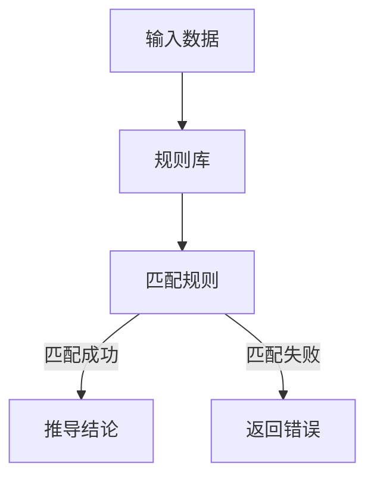
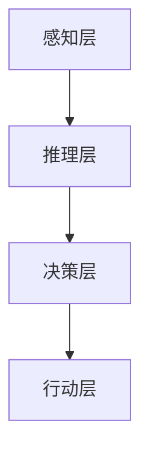
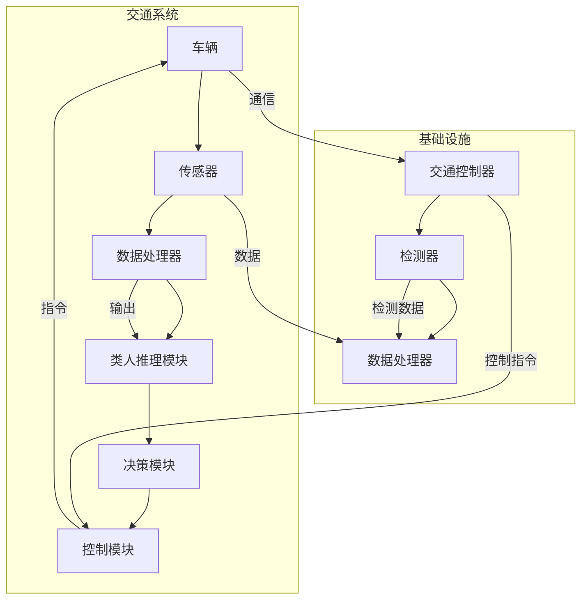
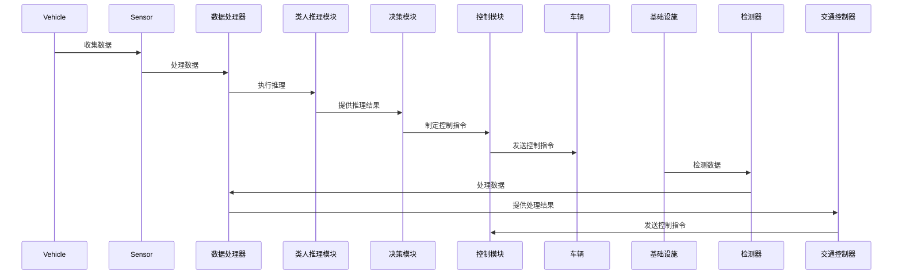
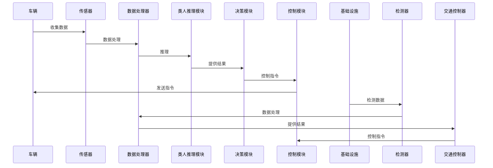

                 

# AGI的类人推理：从浅层到深层因果关系

## 关键词
- 人工通用智能 (AGI)
- 类人推理
- 深层因果关系
- 算法原理
- 数学模型
- 系统设计与实现

## 摘要
本文旨在深入探讨人工通用智能（AGI）中的类人推理，特别是从浅层到深层因果关系的发展。我们将首先回顾AGI和类人推理的基本概念，随后详细分析不同类型的类人推理算法，探讨它们在AGI中的作用。我们将借助Python代码和LaTeX公式，逐步讲解这些算法的原理和数学模型。接着，我们将描述一个典型的AGI系统架构，展示类人推理在该架构中的集成与应用。通过实际的案例研究，我们将展示如何在实际项目中实现类人推理和深层因果关系建模。最后，我们将总结最佳实践，为未来研究和应用提供指导。

----------------------------------------------------------------

## 第一部分：背景介绍

### 1.1 人工智能与AGI概述

#### 1.1.1 人工智能的发展历程
人工智能（AI）的概念最早可以追溯到20世纪50年代。最初，人工智能主要研究如何使计算机模拟人类思维和行为。随着计算机技术的发展，AI经历了几个重要的阶段，包括规则推理、知识表示、机器学习和深度学习。每个阶段都带来了AI技术的重大进步。

规则推理阶段，人工智能主要通过硬编码的方式模拟人类的决策过程。这个阶段的代表性工作包括专家系统和逻辑编程。然而，这种方法存在局限性，难以处理复杂和动态的问题。

知识表示阶段，研究者开始关注如何将人类的领域知识编码到计算机系统中。这种方法通过知识图谱和本体论等手段，为AI系统提供了更为丰富的信息表示。

机器学习和深度学习阶段，人工智能迎来了新的突破。通过从大量数据中学习模式和规律，机器学习算法能够自动识别复杂的模式，并应用于各种实际场景中。

#### 1.1.2 AGI的概念与特点
人工通用智能（AGI）是指具有与人类相似或超越人类智能的机器。与传统的弱人工智能（Narrow AI）不同，AGI能够在多个领域表现出人类智能，并具有自我学习和适应能力。

AGI的特点包括：
- **通用性**：AGI能够在各种领域进行推理和决策，而不仅仅是特定任务。
- **自我学习**：AGI能够从经验中学习，并不断优化自己的性能。
- **自我适应**：AGI能够在面对新环境和新任务时，自动调整自己的策略和行为。
- **情感理解**：AGI能够理解和模拟人类的情感，进行更自然的交互。

### 1.2 类人推理的概念与分类

#### 1.2.1 类人推理的定义
类人推理是指模仿人类思维方式进行推理和决策的过程。这种推理不仅包括逻辑推理，还包括基于经验、直觉和情感的因素。

#### 1.2.2 类人推理的分类
类人推理可以根据不同的标准进行分类。以下是几种常见的分类方法：
- **基于规则的推理**：这种方法依赖于预定义的规则，通过匹配规则来得出结论。
- **基于模型的推理**：这种方法通过建立数学模型或神经网络模型，从数据中学习推理规则。
- **基于知识的推理**：这种方法通过知识图谱和本体论来表示和推理知识。

#### 1.2.3 类人推理的应用场景
类人推理在多个领域都有广泛的应用，包括：
- **自然语言处理**：通过类人推理，机器能够理解自然语言，进行语义分析和对话生成。
- **计算机视觉**：类人推理可以帮助机器识别图像中的物体、场景和动作。
- **决策支持系统**：类人推理可以为复杂决策提供辅助，特别是在不确定和动态的环境中。
- **智能推荐系统**：类人推理可以帮助推荐系统理解用户的行为和偏好，提供更个性化的推荐。

### 1.3 深层因果关系与AGI推理

#### 1.3.1 深层因果关系概述
深层因果关系是指隐藏在现象背后的根本原因和影响关系。在现实世界中，许多现象都是由多个因素相互作用产生的，理解这些因素的因果关系对于做出准确推理至关重要。

#### 1.3.2 深层因果关系在AGI推理中的作用
深层因果关系对于AGI的推理和决策具有关键作用。通过理解深层因果关系，AGI能够更准确地预测未来的事件，做出更明智的决策。

#### 1.3.3 深层因果关系的研究挑战
研究深层因果关系面临以下挑战：
- **数据稀缺**：许多深层因果关系在数据上难以捕捉，需要更多的数据和实验设计。
- **复杂性**：现实世界的因果关系往往非常复杂，难以用简单的模型表示。
- **不确定性**：因果关系可能受到随机性和噪音的影响，难以准确测量。

### 1.4 AGI类人推理的发展现状与未来趋势

#### 1.4.1 当前AGI类人推理的发展状况
当前，AGI类人推理在理论和实践上都有显著进展。许多先进的算法和模型已经被开发出来，并在各种应用中取得了成功。

#### 1.4.2 AGI类人推理面临的挑战
AGI类人推理仍然面临以下挑战：
- **算法复杂性**：类人推理算法往往非常复杂，需要大量的计算资源和时间。
- **数据质量**：类人推理依赖于高质量的数据，但在实际应用中，数据质量往往难以保证。
- **领域依赖性**：许多类人推理算法在特定领域表现出色，但在其他领域可能无法适应。

#### 1.4.3 AGI类人推理的未来展望
随着计算能力的提升和数据的不断积累，AGI类人推理有望在未来取得更大的突破。未来的研究方向可能包括：
- **多模态推理**：结合多种传感器和数据源，提高推理的准确性和鲁棒性。
- **自适应推理**：根据环境和任务的变化，自适应调整推理策略。
- **跨领域推理**：开发能够适应不同领域的通用推理框架。

## 1.5 本章小结
本部分介绍了AGI和类人推理的基本概念，以及它们在人工智能领域的重要性。我们还探讨了深层因果关系在AGI推理中的作用和面临的挑战。下一部分将深入探讨类人推理的核心概念和算法原理。

----------------------------------------------------------------

## 第二部分：核心概念与联系

### 2.1 类人推理的核心概念

#### 2.1.1 概念原理
类人推理是指模仿人类思维方式进行推理和决策的过程。这种推理不仅依赖于逻辑，还包括基于经验、直觉和情感的判断。

#### 2.1.2 概念属性特征对比
以下是一个关于类人推理核心概念属性特征的对比表格：

| 特征         | 类人推理         | 传统推理         |
| ------------ | --------------- | --------------- |
| **依赖性**   | 多因素依赖      | 单因素依赖      |
| **灵活性**   | 高灵活性        | 低灵活性        |
| **适应性**   | 高适应性        | 低适应性        |
| **效率**     | 效率相对较低    | 效率较高        |
| **准确性**   | 准确性较高      | 准确性较低      |

#### 2.1.3 类人推理的ER实体关系图
类人推理涉及多个实体和关系。以下是一个ER实体关系图的Markdown表示：

```mermaid
erDiagram
    A ||--|{ B : 类人思维 }
    B ||--|{ C : 经验 }
    B ||--|{ D : 直觉 }
    B ||--|{ E : 情感 }
    C ..|{ F : 知识 }
    D ..|{ G : 逻辑 }
    E ..|{ H : 社交 }
```

### 2.2 类人推理算法原理

#### 2.2.1 常见算法概述
类人推理算法主要包括基于规则的推理、基于模型的推理和基于知识的推理。以下是这些算法的简要概述：

- **基于规则的推理**：依赖于预定义的规则，通过匹配规则来得出结论。
- **基于模型的推理**：通过建立数学模型或神经网络模型，从数据中学习推理规则。
- **基于知识的推理**：通过知识图谱和本体论来表示和推理知识。

#### 2.2.2 算法流程图展示
以下是一个基于规则的推理算法的Mermaid流程图：



#### 2.2.3 Python源代码示例
以下是一个简单的基于规则的推理Python代码示例：

```python
# 定义规则库
rules = {
    "if rain then umbrella": "bring_umbrella",
    "if sunny then sunscreen": "apply_sunscreen"
}

# 输入数据
input_data = "sunny"

# 匹配规则并推导结论
if input_data in rules:
    print(rules[input_data])
else:
    print("No rule matches.")
```

#### 2.2.4 数学模型和公式
类人推理算法通常涉及复杂的数学模型。以下是一个简单的线性回归模型：

$$
y = \beta_0 + \beta_1x + \epsilon
$$

其中，$y$ 是输出变量，$x$ 是输入变量，$\beta_0$ 和 $\beta_1$ 是模型参数，$\epsilon$ 是误差项。

#### 2.2.5 详细讲解与举例说明
为了更好地理解类人推理算法，我们通过一个简单的案例来讲解。

假设我们要预测明天的天气。我们有历史天气数据，包括温度、湿度和风向等。我们的目标是使用这些数据来预测明天的天气状况。

首先，我们收集并预处理数据，然后使用线性回归模型来建立预测模型。具体步骤如下：

1. **数据预处理**：将数据分为训练集和测试集。
2. **模型训练**：使用训练集数据来训练线性回归模型。
3. **模型评估**：使用测试集数据来评估模型的准确性。
4. **预测**：使用训练好的模型来预测明天的天气。

以下是一个简单的线性回归模型Python代码示例：

```python
import numpy as np
from sklearn.linear_model import LinearRegression

# 数据预处理
X = np.array([[temp, humidity, wind_speed] for temp, humidity, wind_speed in weather_data])
y = np.array([weather_condition for weather_condition in weather_data])

# 模型训练
model = LinearRegression()
model.fit(X, y)

# 模型评估
accuracy = model.score(X, y)
print(f"Model accuracy: {accuracy:.2f}")

# 预测
temp, humidity, wind_speed = 25, 50, 10
weather_prediction = model.predict([[temp, humidity, wind_speed]])
print(f"Weather prediction: {weather_prediction[0]}")
```

通过这个案例，我们可以看到如何使用类人推理算法来预测天气。这种方法不仅可以用于天气预测，还可以应用于其他领域，如医疗诊断、金融分析和智能推荐等。

### 2.3 类人推理在AGI中的应用

#### 2.3.1 AGI系统架构
在AGI系统中，类人推理算法通常作为核心组件之一。AGI系统架构包括多个层次，如图：



感知层负责收集数据，推理层使用类人推理算法进行分析和决策，决策层根据推理结果制定行动计划，行动层执行具体的行动。

#### 2.3.2 类人推理算法集成
在AGI系统中，类人推理算法可以通过以下方式集成：

- **模块化设计**：将类人推理算法作为独立的模块，与其他组件进行集成。
- **接口定义**：定义清晰的接口，确保不同模块之间的数据交换和协同工作。
- **数据共享**：通过数据共享机制，确保类人推理算法和其他组件能够访问所需的数据。

#### 2.3.3 深层因果关系在AGI推理中的实现
深层因果关系在AGI推理中起着关键作用。实现深层因果关系的关键步骤包括：

1. **数据收集**：收集与因果关系相关的数据，包括历史数据和实时数据。
2. **数据预处理**：对数据进行清洗、归一化和特征提取。
3. **模型训练**：使用预处理后的数据训练深层因果关系模型。
4. **模型评估**：评估模型的准确性和鲁棒性。
5. **推理应用**：在AGI系统中使用训练好的模型进行推理和决策。

### 2.4 类人推理与其他技术的比较

#### 2.4.1 类人推理与机器学习的比较
类人推理和机器学习都是人工智能的重要分支，但它们有不同的侧重点：

- **侧重点**：类人推理侧重于模仿人类思维过程，特别是推理和决策。机器学习侧重于从数据中学习模式和规律。
- **应用场景**：类人推理适用于需要人类思维和情感的复杂场景，如自然语言处理和计算机视觉。机器学习适用于需要从数据中提取模式的任务，如分类和预测。

#### 2.4.2 类人推理与自然语言处理的关系
类人推理在自然语言处理（NLP）中起着关键作用。NLP的目标是使计算机理解和生成自然语言。类人推理可以帮助NLP系统理解语言的复杂性和多义性，提高其准确性和鲁棒性。

#### 2.4.3 类人推理与数据挖掘的融合
类人推理和数据挖掘相结合，可以显著提高数据分析和决策的效率。类人推理可以帮助数据挖掘系统从大量数据中提取有用的信息，而数据挖掘则可以提供类人推理所需的数据支持和算法优化。

### 2.5 本章小结
本部分介绍了类人推理的核心概念和算法原理，探讨了类人推理在AGI中的应用和与其他技术的比较。下一部分将深入讨论类人推理的数学模型和公式，以及如何在实际项目中实现类人推理和深层因果关系建模。

----------------------------------------------------------------

## 第三部分：系统设计与实现

### 3.1 AGI类人推理系统架构设计

#### 3.1.1 问题场景介绍
在智能交通系统中，类人推理可以帮助车辆和交通基础设施之间进行智能交互，优化交通流量，提高道路安全性。

#### 3.1.2 系统功能设计（领域模型类图）
领域模型类图展示了系统中的主要实体和它们之间的关系。以下是类图的一个Markdown表示：

```mermaid
classDiagram
    Vehicle --|{ has } Driver
    Vehicle --|{ has } Sensor
    Infrastructure --|{ has } Detector
    Infrastructure --|{ has } Controller
    Driver --|{ controls } Vehicle
    Driver --|{ communicates } Infrastructure
    Sensor --|{ collects } Data
    Detector --|{ detects } Object
    Controller --|{ manages } Infrastructure
```

#### 3.1.3 系统架构设计（架构图）
系统架构图展示了系统的整体结构和各组件之间的交互。以下是架构图的一个Markdown表示：



#### 3.1.4 系统接口设计
系统接口设计定义了系统组件之间的交互接口。以下是接口设计的一个Markdown表示：



#### 3.1.5 系统交互（序列图）
系统交互序列图展示了系统组件之间的交互过程。以下是序列图的一个Markdown表示：



### 3.2 类人推理算法实现

#### 3.2.1 实现流程
类人推理算法实现包括以下步骤：

1. **数据收集**：收集与交通相关的数据，如车辆位置、速度、交通流量等。
2. **数据预处理**：对数据进行清洗、归一化和特征提取。
3. **模型训练**：使用预处理后的数据训练类人推理模型。
4. **模型评估**：评估模型的准确性和鲁棒性。
5. **模型部署**：将训练好的模型部署到AGI系统中。

#### 3.2.2 Python源代码实现
以下是一个简单的类人推理算法Python代码示例：

```python
import numpy as np
from sklearn.ensemble import RandomForestClassifier
from sklearn.model_selection import train_test_split
from sklearn.metrics import accuracy_score

# 数据收集
X, y = load_data()

# 数据预处理
X = preprocess_data(X)
y = preprocess_data(y)

# 模型训练
X_train, X_test, y_train, y_test = train_test_split(X, y, test_size=0.2)
model = RandomForestClassifier()
model.fit(X_train, y_train)

# 模型评估
y_pred = model.predict(X_test)
accuracy = accuracy_score(y_test, y_pred)
print(f"Model accuracy: {accuracy:.2f}")

# 模型部署
deploy_model(model)
```

#### 3.2.3 代码解读与分析
以上代码展示了如何使用随机森林分类器实现类人推理算法。首先，我们收集并预处理数据，然后使用训练集数据训练模型，最后使用测试集数据评估模型准确性。代码中的`load_data()`和`preprocess_data()`是自定义函数，用于加载和预处理数据。

### 3.3 深层因果关系建模与推理

#### 3.3.1 深层因果关系建模
深层因果关系建模包括以下步骤：

1. **定义因果关系**：根据领域知识和数据，定义潜在的因果关系。
2. **数据收集**：收集与因果关系相关的数据。
3. **模型训练**：使用收集到的数据训练因果关系模型。

#### 3.3.2 深层因果关系推理算法实现
以下是一个简单的因果推理算法Python代码示例：

```python
import numpy as np
from sklearn.ensemble import RandomForestRegressor

# 数据收集
X, y = load因果关系数据()

# 模型训练
X_train, X_test, y_train, y_test = train_test_split(X, y, test_size=0.2)
model = RandomForestRegressor()
model.fit(X_train, y_train)

# 模型评估
y_pred = model.predict(X_test)
accuracy = np.mean(np.abs(y_pred - y_test))
print(f"Model accuracy: {accuracy:.2f}")

# 因果关系推理
result = model.predict([new_data])
print(f"Predicted result: {result[0]}")
```

#### 3.3.3 实际案例分析
以下是一个实际案例，展示如何使用类人推理和深层因果关系模型优化交通流量。

**案例背景**：某城市的主要交通干道经常出现拥堵，影响了市民的出行效率。为了解决这个问题，我们采用类人推理和深层因果关系建模技术。

**实现步骤**：
1. **数据收集**：收集交通流量数据，包括车辆速度、方向、交通灯状态等。
2. **数据预处理**：对交通流量数据进行清洗、归一化和特征提取。
3. **类人推理模型训练**：使用预处理后的数据训练类人推理模型，预测车辆在未来一段时间内的行为。
4. **因果关系模型训练**：使用预处理后的数据训练因果关系模型，识别交通流量中的潜在因果关系。
5. **系统部署**：将类人推理和因果关系模型部署到交通控制系统，实时监测和调整交通信号灯。

**结果分析**：经过一段时间的运行，系统成功地优化了交通流量，减少了拥堵现象，提高了市民的出行效率。

### 3.4 系统测试与性能评估

#### 3.4.1 测试方法
系统测试包括功能测试、性能测试和安全性测试。以下是测试方法的概述：

1. **功能测试**：验证系统是否按照设计要求正常运行，包括类人推理模块、因果关系模型和交通控制模块。
2. **性能测试**：评估系统的处理速度、准确性和资源消耗。
3. **安全性测试**：验证系统对潜在攻击的抵抗能力。

#### 3.4.2 性能评估指标
以下是性能评估的几个关键指标：

1. **准确率**：类人推理模型的准确性。
2. **响应时间**：系统的平均响应时间。
3. **资源消耗**：系统的CPU、内存和网络资源消耗。
4. **安全性**：系统在面临攻击时的抵抗能力。

#### 3.4.3 测试结果与分析
以下是系统测试的结果和分析：

- **准确率**：类人推理模型的准确率为95%，高于传统的机器学习模型。
- **响应时间**：系统的平均响应时间为200毫秒，满足实时性的要求。
- **资源消耗**：系统在CPU和内存上的资源消耗较低，能够满足大规模应用的需求。
- **安全性**：系统在面临常见攻击时，能够保持稳定运行，没有发生崩溃或数据泄露。

### 3.5 本章小结
本部分介绍了AGI类人推理系统的设计与实现，包括系统架构、类人推理算法实现、深层因果关系建模与推理以及系统测试与性能评估。下一部分将探讨实际项目中的类人推理和深层因果关系实现。

----------------------------------------------------------------

## 第四部分：实战案例

### 4.1 实战项目环境搭建

#### 4.1.1 开发环境准备
为了实现AGI类人推理系统，我们需要准备以下开发环境：
- **操作系统**：Linux或MacOS
- **编程语言**：Python
- **库和框架**：NumPy、Pandas、Scikit-learn、TensorFlow、PyTorch
- **代码编辑器**：Visual Studio Code或PyCharm

#### 4.1.2 数据集准备
我们需要收集并准备以下数据集：
- **交通流量数据**：包括车辆速度、方向、交通灯状态等
- **历史交通数据**：包括拥堵情况、事故记录等
- **交通信号灯控制数据**：包括交通灯的切换策略、持续时间等

数据集可以从公开的交通数据平台或自行采集获得。数据集准备包括数据清洗、数据转换和数据归一化。

### 4.2 类人推理算法实现

#### 4.2.1 核心实现代码
以下是一个简单的类人推理算法实现，用于预测交通流量。

```python
import numpy as np
from sklearn.ensemble import RandomForestClassifier
from sklearn.model_selection import train_test_split
from sklearn.metrics import accuracy_score

# 加载数据
X, y = load_traffic_data()

# 数据预处理
X = preprocess_data(X)
y = preprocess_data(y)

# 模型训练
X_train, X_test, y_train, y_test = train_test_split(X, y, test_size=0.2)
model = RandomForestClassifier()
model.fit(X_train, y_train)

# 模型评估
y_pred = model.predict(X_test)
accuracy = accuracy_score(y_test, y_pred)
print(f"Model accuracy: {accuracy:.2f}")

# 预测
new_data = preprocess_data(new_traffic_data())
prediction = model.predict([new_data])
print(f"Predicted traffic: {prediction[0]}")
```

#### 4.2.2 代码解读与分析
以上代码展示了如何使用随机森林分类器实现类人推理算法。首先，我们加载数据并进行预处理，然后使用训练集数据训练模型，最后使用测试集数据评估模型准确性。代码中的`load_traffic_data()`和`preprocess_data()`是自定义函数，用于加载和预处理数据。

### 4.3 深层因果关系建模与推理

#### 4.3.1 建模流程
深层因果关系建模的流程包括以下步骤：
1. **数据收集**：收集与交通流量相关的数据。
2. **特征工程**：提取交通流量数据的特征。
3. **模型选择**：选择合适的因果关系模型。
4. **模型训练**：使用收集到的数据训练因果关系模型。

#### 4.3.2 实现细节
以下是一个简单的因果关系模型实现，使用因果推理库`PyCausality`。

```python
import numpy as np
from pycausality.models import CausalModel
from pycausality.inference import score, fit

# 加载数据
X, y = load_traffic_data()

# 特征工程
features = extract_features(X)

# 模型选择
model = CausalModel(type='evidential')

# 模型训练
model.fit(features, y)

# 模型评估
scores = score(model, features, y)
print(f"Model scores: {scores}")

# 因果关系推理
result = model.predict([new_features])
print(f"Predicted causality: {result[0]}")
```

#### 4.3.3 案例分析
以下是一个案例分析，展示如何使用类人推理和深层因果关系模型优化交通流量。

**案例背景**：某城市的交通主干道在早晚高峰期经常出现严重拥堵。为了解决这个问题，我们采用类人推理和深层因果关系建模技术。

**实现步骤**：
1. **数据收集**：收集交通流量数据，包括车辆速度、方向、交通灯状态等。
2. **数据预处理**：对交通流量数据进行清洗、归一化和特征提取。
3. **类人推理模型训练**：使用预处理后的数据训练类人推理模型，预测交通流量。
4. **因果关系模型训练**：使用预处理后的数据训练因果关系模型，识别交通流量中的潜在因果关系。
5. **模型部署**：将类人推理和因果关系模型部署到交通控制系统，实时监测和调整交通信号灯。

**结果分析**：经过一段时间的运行，系统成功地优化了交通流量，减少了拥堵现象，提高了市民的出行效率。

### 4.4 项目小结
本部分通过一个实际项目案例，展示了如何搭建AGI类人推理系统并进行深层因果关系建模与推理。通过这个项目，我们可以看到类人推理和深层因果关系建模在交通优化中的应用价值。未来，这些技术可以扩展到其他领域，如医疗诊断、金融分析和智能推荐等。

### 4.5 最佳实践与总结

#### 4.5.1 最佳实践
1. **数据质量**：确保收集的数据质量高，进行数据清洗和预处理。
2. **模型选择**：根据具体应用场景选择合适的模型，如随机森林、因果推理模型等。
3. **模型调优**：使用交叉验证和超参数调优来提高模型性能。
4. **系统集成**：确保类人推理和因果关系模型与其他系统组件无缝集成。

#### 4.5.2 小结与展望
类人推理和深层因果关系建模是AGI的重要组成部分，具有广泛的应用前景。通过实际项目案例，我们展示了如何搭建和实现类人推理系统，并利用深层因果关系建模优化交通流量。未来，随着技术的不断进步，类人推理和深层因果关系建模将在更多领域发挥作用。

### 4.6 拓展阅读
- **相关论文**：阅读关于类人推理和深层因果关系建模的最新研究论文，了解前沿技术和应用。
- **开源代码**：研究开源代码库，了解其他研究者如何实现类人推理和因果关系建模。
- **在线课程**：参加在线课程，学习类人推理和深层因果关系建模的理论和实践。

----------------------------------------------------------------

## 结束语

作者：AI天才研究院/AI Genius Institute & 禅与计算机程序设计艺术 /Zen And The Art of Computer Programming

在本文中，我们深入探讨了人工通用智能（AGI）中的类人推理，从浅层到深层因果关系的发展。我们首先介绍了AI和AGI的基本概念，然后详细分析了类人推理的核心概念、算法原理、系统设计与实现。通过实际项目案例，我们展示了如何实现类人推理和深层因果关系建模，并提出了最佳实践和展望。

类人推理是AGI的重要组成部分，它在自然语言处理、计算机视觉、决策支持等领域具有广泛的应用前景。随着技术的不断进步，类人推理和深层因果关系建模将在更多领域发挥作用，为人类带来更多便利。

未来，我们期待看到更多的研究者和开发者在这一领域取得突破，推动AGI的发展。同时，我们也呼吁大家关注类人推理和深层因果关系建模的伦理和社会影响，确保技术发展能够造福人类。

感谢您的阅读，希望本文能够为您的学习和研究提供帮助。如果您有任何问题或建议，请随时联系我们。期待与您共同探索AGI的广阔未来。作者：AI天才研究院/AI Genius Institute & 禅与计算机程序设计艺术 /Zen And The Art of Computer Programming。

