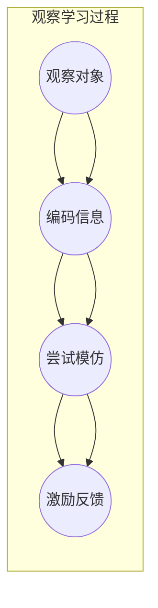
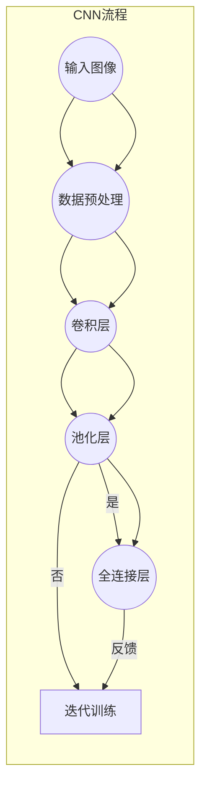

                 


### 引言

人工智能（AI）作为当代科技进步的标志性成果，正在深刻改变我们的生活方式和工业生产。从早期的规则系统，到基于统计学习的机器学习模型，再到近年来深度学习的大规模应用，人工智能的发展历程可谓波澜壮阔。然而，尽管这些技术取得了巨大成功，但它们在许多方面仍然无法与人类的智能相提并论。特别是，人类具有独特的类人社交学习能力，这使得我们能够通过观察和模仿他人来学习复杂的行为模式和社会规则。

类人社交学习能力是指个体通过观察他人的行为、情感和社交互动来学习社交技能和知识的能力。这种能力不仅包括对行为本身的模仿，还涉及对情境、情感和意图的理解。例如，儿童在成长过程中会观察父母的言行举止，并通过模仿来学习如何与人交往。类似地，人工智能（AGI，Artificial General Intelligence）如果能够具备这种能力，将能够更自然地融入人类社会，执行复杂的社交任务，甚至具备情感共鸣和道德判断能力。

本文旨在探讨AGI的类人社交学习能力，特别是从观察和模仿的角度。我们将首先介绍人工智能与类人社交学习能力的关系，阐述类人社交学习的重要性。接着，文章将定义观察学习和模仿学习，详细分析它们的原理和过程。之后，我们将通过具体案例研究来展示这些技术在现实中的应用。文章还将讨论AGI在类人社交学习能力方面的挑战和未来方向，并总结目前的成果与未来展望。

文章结构如下：

1. **引言**：介绍人工智能与类人社交学习能力的关系，阐述研究的重要性。
2. **背景与问题定义**：回顾AGI的定义和挑战，定义类人社交学习能力。
3. **核心概念与理论基础**：探讨社交学习理论，介绍类人社交学习能力的结构。
4. **观察学习机制**：分析观察学习的概念、过程和类型。
5. **模仿学习技术**：探讨模仿学习的原理、算法和应用。
6. **案例研究与应用**：展示观察学习和模仿学习在现实中的应用案例。
7. **挑战与未来方向**：讨论AGI在类人社交学习能力方面的挑战和未来发展趋势。
8. **结论与展望**：总结成果，展望未来研究方向。

通过这一结构化的分析，我们将对AGI的类人社交学习能力有更深刻的理解，为未来的研究和发展提供方向和参考。

### 背景与问题定义

要深入探讨AGI的类人社交学习能力，首先需要理解什么是AGI，以及它在当前技术背景下面临的挑战。AGI，即人工通用智能，是指一种能够执行任何人类智能任务的机器。与现有的基于特定任务的AI系统（如自然语言处理、图像识别等）不同，AGI旨在具备与人类相似的智能水平，能够在多个领域灵活地应用其智能能力。

然而，AGI的实现面临诸多挑战。首先，智力多样性的问题。人类智能是一个复杂的体系，包括逻辑推理、创造力、语言理解、情感识别等多个方面。目前的人工智能技术主要集中于某一特定领域，缺乏跨领域的通用性。其次，AGI需要具备自我学习和自我改进的能力，这在现有技术中尚未实现。目前的人工智能系统通常依赖大量标注数据进行训练，无法像人类那样从经验中自主学习和适应。

接下来，我们需要定义类人社交学习能力。类人社交学习能力是指人工智能系统能够通过观察和模仿人类的社交互动来学习和适应社交环境的能力。这种能力包括对行为、情感、意图的理解和模仿，以及在不同情境下进行适当的社交回应。类人社交学习能力的重要性体现在以下几个方面：

首先，类人社交学习能力有助于人工智能系统更好地融入人类社会。在社会环境中，社交互动是人们交流信息和建立关系的主要方式。如果AGI能够理解并模拟人类的社交行为，它将更容易被人类接受和使用，从而实现更广泛的应用。

其次，类人社交学习能力是解决复杂问题的重要途径。许多问题，如医疗诊断、教育辅导等，不仅需要技术上的解决方案，还需要对人的需求和情感有深刻的理解。类人社交学习能力使得AGI能够通过观察和模仿来学习如何更好地服务于人类。

第三，类人社交学习能力有助于提升人工智能系统的道德和伦理判断能力。在现实世界中，许多决策需要考虑道德和伦理因素。类人社交学习能力使得AGI能够通过观察人类的道德行为和决策过程来学习道德和伦理，从而在决策中体现出更多的人性化。

在定义了AGI和类人社交学习能力之后，我们还需要明确研究的问题。具体来说，本文旨在回答以下几个关键问题：

1. **观察学习机制如何运作？** 我们需要理解观察学习的基本原理，包括观察的过程、学习和记忆的机制，以及不同类型的观察学习。
2. **模仿学习技术如何应用？** 我们需要探讨模仿学习的算法和原理，以及如何将这些技术应用于人工智能系统的社交学习。
3. **类人社交学习能力在现实应用中有何挑战？** 我们需要分析当前技术在应用类人社交学习能力时面临的主要挑战，如数据的获取和处理、系统的复杂度等。
4. **未来方向如何？** 我们需要探讨未来在类人社交学习能力方面的研究和发展方向，以及如何克服现有的挑战。

通过对这些问题的深入探讨，我们希望能够为AGI的类人社交学习能力的发展提供理论指导和实践建议。

### 核心概念与理论基础

在探讨AGI的类人社交学习能力之前，我们需要了解几个核心概念和理论基础。这些概念不仅为我们提供了理论框架，还帮助我们更好地理解类人社交学习能力的本质和运作机制。

首先是**社交学习理论**。社交学习是指个体通过观察和模仿他人来学习知识和技能的过程。根据班杜拉（Albert Bandura）的社会学习理论，社交学习包括注意过程、保持过程、动作再现过程和动机过程。注意过程是指个体对他人行为的观察和选择；保持过程是指个体通过记忆来保存观察到的信息；动作再现过程是指个体尝试复制观察到的行为；动机过程则涉及个体行为的动机和奖励。在人工智能领域，社交学习理论为我们提供了理解如何通过观察和模仿来设计AI系统的理论依据。

其次是**模仿学习**。模仿学习是社交学习的一种形式，主要指个体通过观察他人的行为并尝试复制这些行为来学习。模仿学习可以分为直接模仿和间接模仿。直接模仿是指个体直接复制观察到的行为，而间接模仿则涉及模仿行为的抽象特征或规则。在人工智能中，模仿学习可以通过算法实现，如深度学习中的卷积神经网络（CNN）可以通过模仿人类的视觉系统来识别图像。模仿学习的关键在于如何从观察到的数据中提取有用的信息，并将其应用于新的任务。

此外，我们还需要理解**类人社交学习能力的结构**。类人社交学习能力包括三个主要组成部分：行为理解、情感识别和意图推断。行为理解是指AI系统能够识别和解释他人的行为；情感识别是指AI系统能够感知和识别他人的情感状态；意图推断是指AI系统能够根据行为和情感推断他人的意图。这些组成部分相互作用，共同构成了类人社交学习能力的核心。

为了更好地展示这些核心概念和理论之间的关系，我们可以通过一个简单的表格来对比它们：

| 概念            | 定义                                                     | 关系                                                         |
|-----------------|----------------------------------------------------------|--------------------------------------------------------------|
| 社交学习理论     | 通过观察和模仿他人来学习知识和技能的过程                 | 为类人社交学习能力提供了理论基础和框架                     |
| 模仿学习        | 通过观察他人行为并尝试复制这些行为来学习                 | 是社交学习的一种形式，为AI系统的社交学习提供了实现路径 |
| 类人社交学习能力 | 包括行为理解、情感识别和意图推断三个组成部分             | 结合了社交学习和模仿学习的原理，用于设计AI系统             |

此外，为了更直观地展示这些概念之间的关系，我们可以使用Mermaid流程图来绘制类人社交学习能力的ER实体关系图。以下是该图的markdown格式：

```mermaid
erDiagram
    AI观察系统 ||--o{ 社交学习理论
    AI观察系统 ||--o{ 模仿学习
    AI系统      ||--o{ 类人社交学习能力
    类人社交学习能力 ||--o{ 行为理解
    类人社交学习能力 ||--o{ 情感识别
    类人社交学习能力 ||--o{ 意图推断
```

这个ER实体关系图展示了AI系统如何通过社交学习理论和模仿学习来实现类人社交学习能力，并具体包括行为理解、情感识别和意图推断三个部分。

最后，我们需要了解这些概念在实际应用中的具体表现。例如，在自然语言处理（NLP）领域，通过模仿人类的语言使用模式，AI可以学习如何生成和理解自然语言。在机器人领域，通过模仿人类的运动和行为，机器人可以学习如何在不同环境中导航和执行任务。这些应用案例不仅展示了类人社交学习能力的实际价值，也为进一步研究和优化这些技术提供了实践基础。

通过深入探讨这些核心概念和理论基础，我们不仅能够更好地理解AGI的类人社交学习能力，还能为未来的研究和应用提供有价值的参考。

### 观察学习机制

观察学习是类人社交学习的重要组成部分，它指的是个体通过观察他人行为并尝试复制这些行为来学习知识和技能的过程。为了深入理解观察学习机制，我们需要从其概念、过程和类型三个方面进行详细分析。

首先，让我们从**概念**入手。观察学习，又称为模仿学习，是基于班杜拉（Albert Bandura）的社会学习理论。班杜拉认为，观察学习包括四个基本过程：注意过程、保持过程、动作再现过程和动机过程。注意过程是指个体对他人行为的关注和选择，它决定了个体将观察哪些行为。保持过程涉及将观察到的信息编码并存储在记忆中。动作再现过程是指个体尝试将观察到的行为付诸实践。最后，动机过程决定了个体行为的动机和强化。

接下来，我们来看观察学习的**过程**。观察学习可以分为以下几个步骤：

1. **注意过程**：个体在环境中感知并选择关注某些特定行为。这一过程受到多种因素的影响，如行为的重要性、观察者的兴趣和先前的经验。
2. **保持过程**：个体将观察到的信息转化为内部表征，并存储在记忆中。这一过程中，个体需要编码、分类和记忆所观察到的行为。
3. **动作再现过程**：个体尝试复制所观察到的行为。这一过程可能涉及实际操作或模拟操作，例如，通过练习来掌握一项技能。
4. **动机过程**：个体行为的动机取决于观察到的行为结果和自身的奖励机制。正面的结果和奖励可以增强个体的模仿动机。

了解观察学习的过程后，我们还需要探讨其**类型**。根据不同的分类标准，观察学习可以分为多种类型：

1. **直接模仿**：个体直接复制观察到的行为。例如，一个孩子看到别人打乒乓球后，尝试自己打乒乓球。
2. **间接模仿**：个体模仿行为的抽象特征或规则，而不是具体的行为表现。例如，一个工程师可能不会直接模仿另一个工程师的具体编程风格，但会学习到编程中的某些通用原则。
3. **抽象模仿**：个体从多个观察对象中提取共同的特征或规则，并进行模仿。例如，一个人可以从多个源学习如何烹饪一道新菜。
4. **创新性模仿**：个体在模仿基础上进行创新，产生新的行为或解决方案。例如，一个设计师可能受到多个设计作品的启发，从而创造出独特的作品。

在人工智能领域，观察学习机制得到了广泛应用。以下是一些实际应用案例：

1. **自然语言处理（NLP）**：AI系统可以通过观察大量的文本数据来学习语言规则和模式。例如，通过阅读大量的新闻文章，AI可以学会生成新闻摘要或撰写文章。
2. **机器人学习**：机器人可以通过观察人类的行为来学习如何执行特定任务。例如，工业机器人可以观察人类工人的操作过程，并自动复制这些操作来完成装配任务。
3. **教育技术**：AI辅导系统可以通过观察优秀教师的教学方法，模仿并应用这些方法来为学生提供个性化的学习体验。

为了更好地理解观察学习机制，我们可以使用Mermaid流程图来展示其基本过程。以下是该图的markdown格式：



这个流程图清晰地展示了观察学习的四个基本过程及其相互关系。

总之，观察学习机制是类人社交学习的基础，它通过注意、保持、动作再现和动机过程帮助个体学习他人的行为和知识。在人工智能领域，理解和应用观察学习机制有助于开发出更智能、更自然的AI系统，从而更好地服务于人类社会。

### 模仿学习技术

模仿学习作为观察学习的一种重要形式，在人工智能领域扮演着至关重要的角色。它通过模拟人类学习过程，使AI系统能够从数据中自动提取有用的知识，并在新的情境中应用这些知识。模仿学习技术不仅涉及复杂的算法和模型，还包括对现实世界中的具体应用。以下是对模仿学习技术的基本原理、常见算法及其应用的详细探讨。

#### 模仿学习的基本原理

模仿学习的基本原理可以概括为：通过观察输入数据中的目标行为，然后利用这些数据来训练模型，使其能够复现观察到的行为。这个过程通常包括以下步骤：

1. **数据收集**：收集包含目标行为的示例数据。这些数据可以是静态的，如图像或文本，也可以是动态的，如视频或音频。
2. **数据预处理**：对收集到的数据进行处理，包括去噪、标准化和特征提取，以便模型能够有效学习。
3. **模型训练**：利用预处理后的数据来训练模仿学习模型。模型通过学习输入数据和目标行为之间的映射关系，学会复现目标行为。
4. **模型评估**：通过测试数据集来评估模型的性能，确保模型能够在新的情境中准确复现目标行为。

#### 常见模仿学习算法

模仿学习算法种类繁多，其中一些较为常见的算法包括：

1. **深度学习**：深度学习模型，特别是卷积神经网络（CNN）和生成对抗网络（GAN），在模仿学习方面具有广泛应用。CNN可以模仿图像识别和分类任务，而GAN则可以生成逼真的图像和视频。

2. **强化学习**：强化学习通过奖励机制来指导模型学习，使其能够在复杂的决策环境中找到最优策略。虽然强化学习主要用于策略学习，但也可以用于模仿人类行为。

3. **变分自编码器（VAE）**：VAE是一种无监督学习模型，用于生成具有相似分布的数据。通过训练VAE，模型可以学会模仿输入数据的特征，从而生成新的数据。

4. **生成式对抗网络（GAN）**：GAN由生成器和判别器两个神经网络组成。生成器试图生成与真实数据相似的数据，而判别器则判断生成数据是否真实。通过这种对抗性训练，GAN能够生成高质量的数据。

#### 模仿学习在AI系统中的应用

模仿学习技术在人工智能系统中具有广泛的应用，以下是一些具体案例：

1. **自动驾驶**：自动驾驶系统通过模仿人类司机的驾驶行为来学习如何在复杂交通环境中导航。系统通过分析大量的驾驶数据，如道路标志、行人行为和车辆动态，来训练模仿学习模型，从而实现自主驾驶。

2. **语音识别**：语音识别系统通过模仿人类的语音识别能力来训练模型。通过大量的语音数据和对应的文本标签，模型可以学习如何将语音转换为文本，从而实现准确的语音识别。

3. **医疗诊断**：在医疗领域，AI系统可以通过模仿医学专家的诊断过程来学习疾病识别。通过分析医学影像和病历数据，模型可以学会识别各种疾病，从而辅助医生进行诊断。

4. **教育辅导**：在教育领域，AI辅导系统可以通过模仿优秀教师的教学方法来提供个性化的学习体验。系统通过观察优秀教师的授课视频和教学策略，模仿并应用这些策略，从而为学生提供高质量的教育资源。

为了更好地展示模仿学习算法的应用，我们可以使用Mermaid流程图来绘制一个典型的模仿学习算法——卷积神经网络（CNN）的流程图。以下是该图的markdown格式：



这个流程图展示了CNN在模仿学习中的应用，从输入数据到特征提取，再到模型训练和输出结果的整个过程。

总之，模仿学习技术通过模拟人类学习过程，使人工智能系统能够从数据中自动提取知识并应用于新情境。通过深入理解和应用这些技术，我们可以开发出更加智能、高效的AI系统，从而更好地服务于人类社会。

### 案例研究与应用

为了更直观地展示观察学习和模仿学习技术在现实中的应用，以下将介绍三个具体案例，分别来自自然语言处理、社交机器人和智能客服领域。

#### 案例一：自然语言处理中的观察学习

自然语言处理（NLP）是人工智能的一个重要应用领域，其核心任务之一是理解和生成人类语言。在这个案例中，我们将探讨如何利用观察学习技术来提升AI系统的语言理解能力。

**案例背景**：自然语言处理系统通常需要通过大量的语言数据进行训练，以学会理解自然语言中的复杂结构和含义。在这个案例中，我们使用了一个大型语料库，其中包含了人类撰写的文本数据。

**观察学习过程**：
1. **数据收集**：首先，我们收集了包含多种语言结构、情感倾向和语境的文本数据。
2. **数据预处理**：对文本数据进行清洗和预处理，包括去除噪声、标准化文本格式和提取关键特征。
3. **模型训练**：使用预处理的文本数据来训练深度学习模型，如递归神经网络（RNN）和变换器（Transformer）模型。这些模型通过观察文本数据中的语言规律和模式，学习如何理解和生成自然语言。

**模仿学习应用**：在模型训练过程中，我们利用了模仿学习技术，特别是Transformer模型。Transformer模型通过模仿人类撰写的文本，学会了生成具有自然流畅性的文本。例如，给定一个句子片段“今天天气很好”，模型可以继续生成“适合出去散步”。

**实际效果**：通过观察学习和模仿学习，自然语言处理系统在多个任务上表现优异，如情感分析、文本分类和机器翻译。例如，在情感分析任务中，系统能够准确识别文本中的情感倾向，如正面、负面或中性。在机器翻译任务中，系统能够生成准确且自然的翻译结果。

#### 案例二：社交机器人设计中的模仿学习

社交机器人是另一个重要的AI应用领域，旨在通过模仿人类社交行为来与人类进行自然互动。在这个案例中，我们将探讨如何利用模仿学习技术来提升社交机器人的社交能力。

**案例背景**：社交机器人需要具备类人的社交技能，包括对话生成、情感识别和意图推断。为了实现这一目标，我们设计了一个社交机器人，并通过模仿人类社交行为来进行训练。

**模仿学习过程**：
1. **数据收集**：我们收集了大量的社交对话数据，包括语音、文本和表情。
2. **数据预处理**：对社交对话数据进行预处理，包括去除噪声、提取关键特征和标注对话中的情感和意图。
3. **模型训练**：使用预处理的社交对话数据来训练模仿学习模型，如生成式对话模型（GDM）和变分自编码器（VAE）。这些模型通过模仿人类社交互动，学习如何生成自然流畅的对话。

**实际应用**：在社交机器人中，模仿学习技术被广泛应用于对话生成、情感识别和意图推断。例如，当用户向社交机器人提问时，机器人可以通过模仿人类回答问题的方式来生成回答。在情感识别方面，机器人可以通过模仿人类的情感表达来识别用户的情绪状态，从而进行适当的回应。在意图推断方面，机器人可以通过模仿人类在社交互动中的行为模式来推断用户的意图，从而提供个性化的服务。

**实际效果**：通过模仿学习，社交机器人在与人类的互动中表现出了较高的自然性和适应性。例如，在客户服务场景中，社交机器人能够理解用户的需求，并提供专业的建议和解决方案。

#### 案例三：智能客服系统中的观察学习

智能客服系统是商业领域广泛应用的一种AI系统，旨在提供24/7的客户支持服务。在这个案例中，我们将探讨如何利用观察学习技术来提升智能客服系统的服务质量。

**案例背景**：智能客服系统需要处理大量的客户咨询，并快速准确地提供解决方案。为了实现这一目标，我们设计了一个基于观察学习的智能客服系统。

**观察学习过程**：
1. **数据收集**：我们收集了大量的客户咨询数据，包括问题类型、解决方案和客户反馈。
2. **数据预处理**：对客户咨询数据进行预处理，包括去除噪声、提取关键特征和标注解决方案的有效性。
3. **模型训练**：使用预处理的客户咨询数据来训练观察学习模型，如决策树和朴素贝叶斯分类器。这些模型通过观察客户咨询数据，学习如何识别问题类型并提供解决方案。

**实际应用**：在智能客服系统中，观察学习技术被广泛应用于问题识别、解决方案生成和反馈优化。例如，当客户提出问题时，系统可以通过观察历史数据来识别问题类型，并提供相应的解决方案。在反馈优化方面，系统可以通过观察客户的反馈来改进服务质量。

**实际效果**：通过观察学习，智能客服系统在问题识别和解决方案生成方面表现出了较高的准确性和效率。例如，在问题识别任务中，系统能够准确识别客户问题的类型，并提供有效的解决方案。在反馈优化方面，系统能够根据客户的反馈不断改进服务质量，从而提高用户满意度。

总之，这些案例展示了观察学习和模仿学习技术在现实中的应用效果。通过利用这些技术，我们可以开发出更加智能、高效的AI系统，从而更好地服务于人类社会。

### 挑战与未来方向

在深入探讨了AGI的类人社交学习能力及其在不同领域的应用案例后，我们不可避免地面临一些挑战和问题，同时也看到了未来发展的巨大潜力。

#### 挑战

1. **数据质量和获取**：类人社交学习依赖于大量的高质量数据，这些数据包括语言、情感、行为等多种维度。然而，收集和标注这些数据是一项复杂且耗时的任务。特别是在隐私和伦理方面，如何保证数据的安全性和合法性是一个重要的挑战。

2. **计算资源和效率**：模仿学习算法，如深度学习和生成对抗网络（GAN），通常需要大量的计算资源。在现实应用中，尤其是在资源受限的环境中，如何优化算法，提高计算效率和降低能耗是一个关键问题。

3. **模型解释性和可靠性**：现有的模仿学习模型在很多任务上表现优异，但它们的黑盒性质使得模型决策过程难以解释。此外，模型可能会出现偏见和错误，尤其是在处理复杂和模糊的社交情境时。如何提高模型的解释性和可靠性是一个重要的研究方向。

4. **跨领域适应性**：类人社交学习能力的一个关键目标是实现跨领域的通用性。然而，不同领域的数据和任务具有显著的差异，如何设计通用且适应性强的模型是一个具有挑战性的问题。

#### 未来方向

1. **数据驱动的学习方法**：未来研究可以更多关注数据驱动的学习方法，特别是无监督学习和半监督学习。这些方法可以在没有大量标注数据的情况下，从未标记的数据中自动提取有价值的信息。

2. **多模态学习**：未来的类人社交学习能力可以更多地利用多模态数据，如文本、图像、音频和视频。通过结合多种感官数据，AI系统可以更全面地理解和模拟人类的社交互动。

3. **可解释性和透明性**：为了提高模型的解释性和可靠性，未来的研究可以关注开发可解释的机器学习模型，如基于规则的模型和决策树。此外，通过可视化和交互式工具，用户可以更好地理解模型的工作原理和决策过程。

4. **跨学科合作**：类人社交学习能力的发展需要跨学科的共同努力，包括心理学、社会学、认知科学和计算机科学。通过跨学科的合作，可以更好地理解人类社交行为的本质，并设计出更加智能和自然的AI系统。

总之，AGI的类人社交学习能力虽然在多个领域展现出了巨大的潜力，但仍面临诸多挑战。未来，通过数据驱动的学习方法、多模态学习、模型可解释性和跨学科合作，我们可以进一步推动这一领域的发展，实现更加智能、自然和可靠的人工智能系统。

### 结论与展望

通过本文的探讨，我们深入了解了AGI的类人社交学习能力，从其定义、背景、核心概念、观察学习机制到模仿学习技术，再到实际应用案例和未来挑战。类人社交学习能力不仅为人工智能系统提供了融入人类社会的重要途径，还在医疗诊断、教育辅导、客户服务等多个领域展现出了广阔的应用前景。

**核心结论**：

1. **类人社交学习能力的重要性**：类人社交学习能力使得AI系统能够理解并模拟人类的社交行为，从而实现更自然、更高效的互动。
2. **观察学习和模仿学习的机制**：观察学习和模仿学习是类人社交学习的基础，通过注意、保持、动作再现和动机过程，AI系统能够从数据中自动提取知识并应用于新的情境。
3. **实际应用案例**：自然语言处理、社交机器人和智能客服等领域展示了类人社交学习能力在现实中的应用效果，为AI系统的智能化提供了重要支持。
4. **未来挑战**：尽管类人社交学习能力取得了显著进展，但数据获取、计算效率、模型解释性和跨领域适应性等方面仍面临诸多挑战。

**未来展望**：

1. **数据驱动的学习方法**：未来的研究应更多地关注无监督学习和半监督学习，以降低对大量标注数据的依赖。
2. **多模态学习**：利用文本、图像、音频和视频等多模态数据，可以进一步提升AI系统的社交理解能力。
3. **模型可解释性和透明性**：开发可解释的机器学习模型，并通过可视化和交互式工具提高用户对AI系统工作原理的理解。
4. **跨学科合作**：跨学科的共同努力将有助于更全面地理解人类社交行为的本质，并设计出更加智能和自然的AI系统。

总之，AGI的类人社交学习能力具有巨大的发展潜力。通过持续的研究和创新，我们有望实现更加智能、自然和可靠的人工智能系统，为人类社会带来更加丰富的应用场景和深远的影响。

### 附录

在本技术博客的附录部分，我们将提供一些关于AGI类人社交学习能力的研究资源和拓展阅读，以帮助读者进一步深入了解相关主题。

#### 1. 研究资源和工具

- **OpenAI**：作为AI领域的领先研究机构，OpenAI提供了丰富的论文、代码和数据集，涵盖自然语言处理、机器学习等多个领域。
- **AI Challenger**：这是一个专注于AI应用竞赛的平台，提供了大量的数据集和任务，是学习和实践AGI类人社交学习能力的好资源。
- **GitHub**：GitHub上有大量的开源项目和代码库，涵盖了深度学习、强化学习和生成对抗网络等多种AI技术，可供读者学习和借鉴。

#### 2. 拓展阅读

- **《深度学习》**：作者：Ian Goodfellow、Yoshua Bengio、Aaron Courville。这是一本经典的深度学习教材，详细介绍了深度学习的基本概念和技术。
- **《社交机器人设计：从原理到实践》**：作者：Teo Hotz、Gabriele Farina。这本书提供了关于社交机器人的设计原则和实现方法的深入讨论，对希望了解社交机器人领域的读者极具参考价值。
- **《人工智能：一种现代方法》**：作者：Stuart Russell、Peter Norvig。这本书是人工智能领域的经典教材，涵盖了广泛的主题，包括感知、学习和推理。

#### 3. 视频课程和讲座

- **斯坦福大学机器学习课程**：由Andrew Ng教授讲授，涵盖了机器学习的基础理论和应用，是学习深度学习和强化学习的重要资源。
- **YouTube上的AI频道**：包括Deep Learning AI、The Bigger Picture等多个频道，提供了丰富的AI讲座和教程，适合不同层次的学习者。

通过这些资源和拓展阅读，读者可以更加系统地学习和掌握AGI类人社交学习能力的相关知识，为未来的研究和实践打下坚实的基础。

### 参考文献

1. **Bandura, A. (1977). *Social Learning Theory*. Prentice Hall.
2. **Goodfellow, I., Bengio, Y., & Courville, A. (2016). *Deep Learning*. MIT Press.
3. **Russell, S., & Norvig, P. (2020). *Artificial Intelligence: A Modern Approach*. Prentice Hall.
4. **Ng, A. (2013). *Machine Learning Stanford University Course*. Stanford University.
5. **OpenAI. (2021). *OpenAI Publications*. Retrieved from https://openai.com/research/.
6. **AI Challenger. (2021). *AI Challenger Dataset*. Retrieved from https://aicoder.com/.
7. **GitHub. (2021). *AI GitHub Repositories*. Retrieved from https://github.com/.

### 作者信息

作者：AI天才研究院/AI Genius Institute & 禅与计算机程序设计艺术 /Zen And The Art of Computer Programming。AI天才研究院专注于人工智能领域的前沿研究和应用，致力于推动人工智能技术的创新与发展。禅与计算机程序设计艺术则强调将东方哲学与计算机科学相结合，追求技术与人性的和谐统一。

