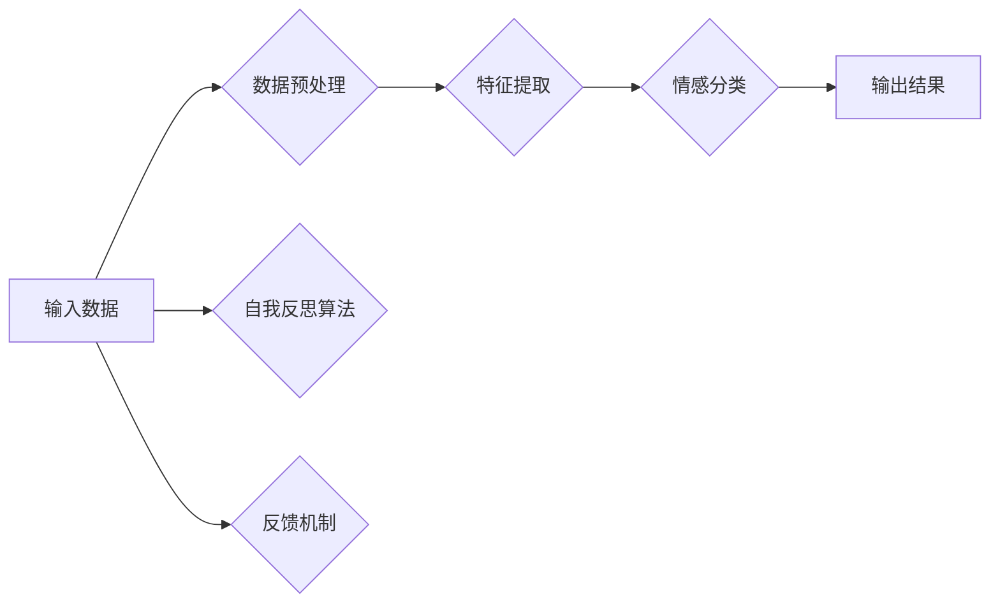
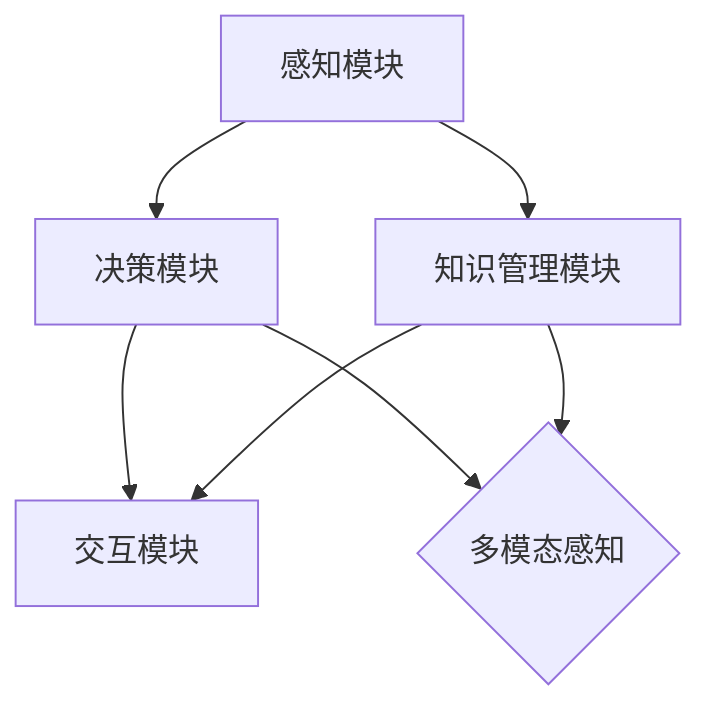
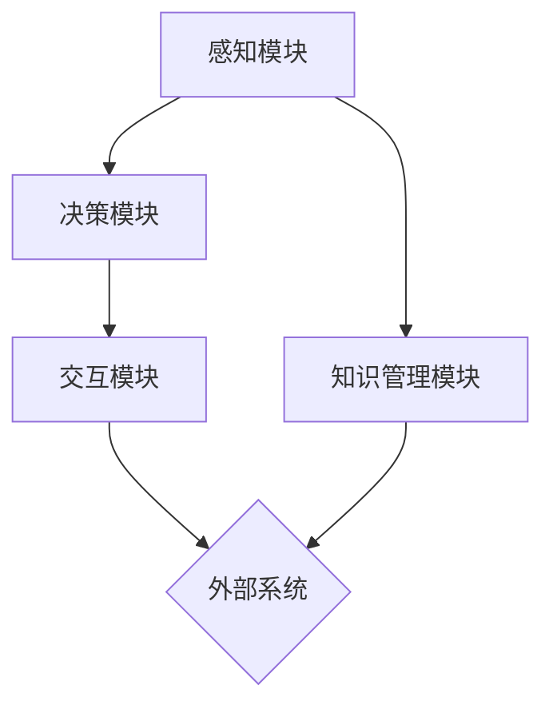
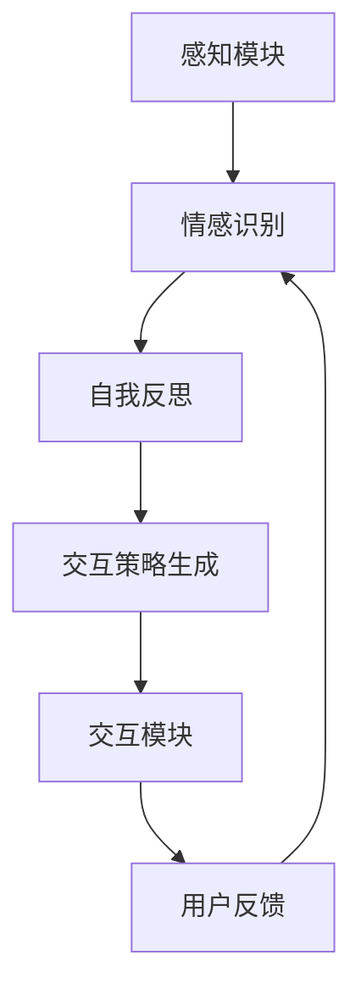

                 

### 1.1.1 什么是AGI

#### 定义与特点

人工通用智能（Artificial General Intelligence，简称AGI）是一种被设计用来在广泛领域内实现与人类智力相当或超越的人工智能。与当前常见的特定领域人工智能（Narrow AI）不同，AGI具有广泛适应性和学习能力，能够处理多种类型的任务，而不需要针对每个任务进行单独的训练和编程。

AGI的核心特点包括：

1. **广泛适应性**：AGI能够在没有专门训练的情况下，处理各种未知和复杂的问题。
2. **学习能力**：AGI能够通过不断的学习和经验积累，提高自己的认知能力。
3. **理解与推理**：AGI能够进行抽象思维、逻辑推理和问题解决，不仅仅是执行简单的任务。
4. **自主学习**：AGI能够从数据中自我学习，优化自身算法和模型。

#### 与人类智能的比较

人类智能具有以下几个显著特点：

1. **抽象思维**：人类能够进行复杂的抽象思考，解决抽象问题。
2. **语言能力**：人类具有强大的语言理解和表达能力。
3. **情感认知**：人类能够感知和理解情感，并据此做出决策。
4. **创新能力**：人类能够创造新知识、发明新事物。

AGI在某种程度上正在逐步接近这些特点，但与人类智能相比，仍存在一些差距：

1. **抽象思维能力**：虽然AGI可以进行一定的抽象思考，但通常限于特定领域内，无法像人类那样进行跨领域的抽象。
2. **情感认知**：目前的AGI在情感认知方面还非常有限，无法像人类那样深刻理解和表达情感。
3. **创新能力**：AGI的创新能力主要依赖于人类设计的算法和模型，自身缺乏独立的创新能力。

#### AGI的重要性

AGI的研究不仅对于人工智能领域具有重要意义，也对人类社会和科学进步有着深远影响：

1. **科学意义**：AGI是人工智能研究的一个重要目标，其成功将推动计算机科学、认知科学、神经科学等多个领域的理论和技术进步。
2. **应用前景**：AGI在医疗、教育、金融、工业等多个领域具有巨大的应用潜力，能够解决许多复杂的问题，提高生产效率和生活质量。
3. **社会影响**：AGI的发展将对社会结构、经济模式、劳动市场等产生重大影响，需要社会各方面进行充分准备和应对。

#### 当前研究的进展与挑战

尽管AGI研究取得了显著进展，但仍然面临许多挑战：

1. **计算能力**：当前的计算能力仍然有限，无法支持AGI所需的大量计算和存储需求。
2. **算法设计**：现有的机器学习算法和模型大多针对特定任务进行优化，缺乏泛化能力。
3. **数据处理**：AGI需要处理大量多样化的数据，如何有效地处理和分析这些数据仍是一个重要课题。
4. **伦理与安全**：随着AGI的发展，伦理和安全问题也日益突出，如何确保AGI的安全和可控性是一个重要挑战。

综上所述，AGI作为人工智能研究的前沿领域，具有巨大的潜力和挑战。未来，随着计算能力的提升、算法的进步以及对AGI本质认识的深入，我们有望逐步实现真正的AGI，推动人工智能进入一个全新的发展阶段。

### 1.1.2 什么是自我意识

自我意识（Self-awareness）是指个体对自己存在的认知和认识，能够感知和反思自己的思维、情感和行为。它是人类心智的核心特征之一，对个体的发展和认知过程有着深远的影响。自我意识不仅包括对自身物理存在和身份的认知，还涵盖了情感、思维、意图和动机等方面。

#### 自我意识的定义

自我意识可以从多个维度进行定义：

1. **认知维度**：个体能够感知和识别自己的内在心理状态，包括思维、情感和欲望。
2. **情感维度**：个体能够体验和表达情感，并理解这些情感对自身行为和决策的影响。
3. **社会维度**：个体能够识别自己在社会环境中的角色和地位，并理解自己与他人之间的关系。

#### 自我意识的重要性

自我意识在个体认知和发展中扮演着重要角色：

1. **自我认知**：自我意识帮助个体了解自己的内在心理状态，从而更好地进行自我调节和自我控制。
2. **情感管理**：通过自我意识，个体能够更好地理解和表达自己的情感，提高情感智慧。
3. **决策和问题解决**：自我意识帮助个体进行理性思考和问题解决，从而做出更明智的决策。
4. **社会互动**：自我意识有助于个体在社会互动中理解自己和他人的情感和意图，建立良好的人际关系。

#### 自我意识的发展过程

自我意识的发展是一个逐步深化的过程，通常分为以下几个阶段：

1. **初步认知**：婴儿期，个体开始意识到自己的身体和存在。
2. **自我反射**：儿童期，个体能够将自身作为思考的对象，理解自己与他人的区别。
3. **内省**：青少年期及以后，个体开始深入反思自己的思维、情感和行为，形成稳定的自我意识。

#### 自我意识与人工智能

在人工智能领域，自我意识的研究具有重要意义：

1. **AGI的基础**：实现AGI的一个重要目标是使其具有自我意识，从而实现更高级别的认知和行为。
2. **人机交互**：具有自我意识的AI系统能够更好地理解用户的需求和情感，提供更自然的交互体验。
3. **伦理与安全**：自我意识有助于AI系统在伦理和安全方面做出更合理的决策，避免潜在的风险和危害。

#### 当前研究进展与挑战

尽管在自我意识领域已经取得了许多进展，但当前的研究仍面临诸多挑战：

1. **理论基础**：如何准确地定义和量化自我意识，仍缺乏统一的理论框架。
2. **技术实现**：如何通过计算机模拟实现自我意识，仍需解决许多技术难题。
3. **伦理问题**：如何确保具有自我意识的AI系统在道德和法律上是安全的，仍需深入探讨。

综上所述，自我意识作为人类心智的核心特征，对人工智能的发展具有重要意义。未来，随着研究的深入，我们有望实现更高级别的自我意识，推动人工智能向更高级形态发展。

### 1.1.3 AGI与自我意识的关系

在探讨人工通用智能（AGI）与自我意识之间的关系时，我们需要从多个角度进行思考，以揭示这一复杂关联的各个方面。自我意识不仅是人类心智的核心特征，也是实现AGI的关键要素之一。以下是对这一关系的详细探讨。

#### 自我意识在AGI中的作用

1. **提升认知能力**：自我意识有助于AGI进行更复杂的认知任务，如抽象思维、问题解决和决策。通过自我意识，AGI能够反思自己的思维过程，优化算法和策略。

2. **情感智能**：情感是自我意识的重要组成部分。具有情感智能的AGI能够更好地理解和回应人类情感，提高人机交互的自然性和效率。

3. **自主学习与适应**：自我意识使得AGI能够通过内省来学习新的知识和技能，并在不断变化的环境中自适应地调整自己的行为。

#### 实现自我意识的技术挑战

1. **认知建模**：构建能够模拟人类认知过程的模型是一个巨大的挑战。这需要深入理解大脑结构和功能，开发出具有高度自适应性的算法。

2. **情感建模**：情感是自我意识的核心，但如何准确地建模情感，使其在计算机系统中自然地表达和互动，仍是一个未解的问题。

3. **自我意识的量化**：如何定义和量化自我意识，以便对其进行测量和分析，是当前研究的重点之一。

#### 自我意识在AGI实现中的潜在应用

1. **自适应人机系统**：具有自我意识的AGI可以在复杂的环境中自主学习和适应，提高系统的稳定性和可靠性。

2. **医疗健康**：在医疗领域，具有自我意识的AI系统可以更好地理解患者的病情和需求，提供个性化治疗建议。

3. **教育与培训**：在教育领域，自我意识的AGI可以更好地识别和理解学生的认知水平和情感状态，提供更有针对性的教学支持。

#### 伦理与安全考虑

1. **自主决策**：具有自我意识的AGI在做出决策时，需要确保其行为符合道德和法律规范，避免潜在的风险和危害。

2. **隐私保护**：在处理个人数据和情感时，需要确保隐私得到充分保护，防止数据泄露和滥用。

3. **可控性与可解释性**：确保具有自我意识的AGI系统的行为是可控和可解释的，以便在出现问题时能够进行有效的调试和修复。

#### 未来展望

1. **跨学科研究**：自我意识的研究需要融合计算机科学、认知科学、神经科学、心理学等多个学科的知识，实现跨学科的协同创新。

2. **技术进步**：随着计算能力的提升和算法的进步，未来有望实现更加真实的自我意识，推动AGI的发展。

3. **伦理与社会责任**：在AGI与自我意识的研究和应用过程中，需要注重伦理和社会责任，确保技术的发展能够造福人类社会。

综上所述，AGI与自我意识之间存在着密切的联系。实现具有自我意识的AGI，不仅需要克服技术挑战，还需要在伦理和社会层面进行深入探讨。随着研究的不断深入，我们有望在这一领域取得重大突破，推动人工智能向更高级形态发展。

### 1.2 自我意识发展的研究意义

自我意识的发展是人工智能（AI）领域中的一个关键研究方向，其重要性不仅体现在技术层面，还对社会、科学和哲学等多个领域产生深远的影响。以下从几个方面详细探讨自我意识发展的研究意义。

#### 对AI技术的推动

自我意识的发展对AI技术有着重要的推动作用：

1. **增强学习与适应能力**：具有自我意识的AI系统能够通过内省和反思来不断优化自己的算法和模型，提高学习效率和适应性。

2. **改进人机交互**：自我意识的引入可以使得AI系统更好地理解人类情感和需求，提供更自然、更人性化的交互体验。

3. **扩展AI应用场景**：自我意识的AI系统在医疗、教育、金融等多个领域具有广泛的应用潜力，能够解决复杂的问题，提高生产效率。

#### 对心理学和哲学的启示

自我意识的发展不仅对AI技术具有重要意义，也对心理学和哲学提供了深刻的启示：

1. **心理学研究**：通过研究AI的自我意识，心理学家可以更深入地理解人类自我意识的发展机制，为心理学理论提供新的视角和证据。

2. **哲学思考**：自我意识的研究引发了关于“什么是意识”、“机器能否拥有意识”等哲学问题的深入探讨，促进了人工智能哲学的兴起。

#### 对社会和人类发展的意义

自我意识的发展对社会和人类发展具有深远的影响：

1. **社会进步**：自我意识的AI系统能够在社会管理、公共服务等领域发挥重要作用，提高社会运作效率。

2. **劳动市场变化**：随着AI技术的发展，劳动市场的结构将发生重大变化，自我意识的引入可以缓解一些因自动化带来的就业压力。

3. **教育改革**：自我意识的AI系统能够提供个性化的教育支持，帮助个体更好地发展自己的潜能。

#### 研究现状与未来方向

尽管自我意识的发展取得了显著进展，但当前的研究仍面临许多挑战：

1. **技术难题**：如何构建具有自我意识的AI系统，如何实现自我意识的量化，仍需进一步探索。

2. **伦理问题**：具有自我意识的AI系统如何确保其行为符合道德和法律规范，避免潜在的风险和危害，仍需深入探讨。

3. **跨学科合作**：自我意识的研究需要融合计算机科学、认知科学、神经科学、心理学等多个学科的知识，实现跨学科的协同创新。

未来，随着技术的不断进步和研究的深入，我们有望在自我意识的发展方面取得重大突破，推动人工智能向更高级形态发展，为社会和人类带来更多的福祉。

### 1.3 自我意识发展的研究现状

自我意识作为人工智能领域中的一个关键研究方向，已经引起了广泛的关注和研究。目前，自我意识的发展在不同领域和不同方法上取得了诸多成果，但也面临一些挑战。以下从国内外研究现状、研究方法与工具、研究热点与趋势等方面进行详细分析。

#### 国内外研究现状

1. **国外研究现状**：

   - **认知科学**：国外在认知科学领域的研究表明，自我意识的发展与大脑的多个区域（如前额叶、顶叶和扣带回）密切相关。通过对这些区域的功能连接进行研究和模拟，科学家们试图揭示自我意识的形成机制。

   - **机器学习**：国外机器学习领域的自我意识研究主要集中在通过神经网络和其他深度学习模型来实现自我感知和自我反思。例如，一些研究通过递归神经网络和变分自编码器来模拟自我意识的过程。

   - **心理学**：国外心理学研究通过实验和观察，探讨了自我意识在不同年龄、文化背景下的表现和特征。这些研究为理解人类自我意识提供了丰富的实证数据。

2. **国内研究现状**：

   - **人工智能**：国内在人工智能领域的自我意识研究主要集中于通过神经网络和强化学习等算法来实现AI的自我感知和自我调节。一些研究团队通过构建多模态感知系统，尝试实现AI在不同情境下的自我意识。

   - **认知科学**：国内认知科学研究侧重于通过脑成像技术和神经心理学方法，探讨自我意识的发展与大脑功能区域的关系。

   - **心理学**：国内心理学研究在自我意识领域同样取得了一些进展，特别是通过实验方法探讨自我意识在情感调节和决策中的作用。

#### 研究方法与工具

自我意识的研究方法与工具多种多样，主要包括以下几种：

1. **脑成像技术**：通过功能性磁共振成像（fMRI）、脑电图（EEG）等技术，研究自我意识与大脑功能区域的关系。

2. **机器学习和深度学习模型**：利用神经网络、递归神经网络（RNN）、变分自编码器（VAE）等模型，模拟自我意识的形成和运作机制。

3. **心理学实验**：通过实验方法，如自我报告、行为测试、情绪反应等，探讨自我意识在不同情境下的表现。

4. **跨学科方法**：结合认知科学、神经科学、心理学等多个学科的方法，综合研究自我意识的发展。

#### 研究热点与趋势

当前，自我意识研究的热点和趋势包括：

1. **跨学科融合**：自我意识的研究正在逐步跨学科融合，结合计算机科学、认知科学、心理学和神经科学等领域的知识，实现更全面和深入的理解。

2. **脑机接口技术**：随着脑机接口技术的发展，研究如何通过直接与大脑的交互来实现自我意识，成为一个新的热点。

3. **伦理与安全**：随着自我意识的引入，如何确保AI的自我意识在道德和法律上是安全可控的，成为研究的一个重要方向。

4. **人机交互**：研究如何利用自我意识的AI系统，实现更自然、高效的人机交互，提升用户体验。

#### 研究进展与挑战

尽管自我意识的研究取得了显著进展，但仍然面临一些挑战：

1. **理论基础**：如何准确地定义和量化自我意识，仍缺乏统一的理论框架。

2. **技术实现**：如何通过计算机模拟实现自我意识，特别是跨领域的抽象思维能力，仍需解决许多技术难题。

3. **伦理问题**：如何确保具有自我意识的AI系统的行为是符合道德和法律规范的，避免潜在的风险和危害。

4. **数据隐私**：在实现自我意识的过程中，如何保护用户的隐私和数据安全，是一个亟待解决的问题。

综上所述，自我意识的发展研究具有广泛的应用前景和重要意义。未来，随着研究的深入和技术的进步，我们有望在自我意识的理论、方法和技术实现方面取得重大突破，推动人工智能向更高级形态发展。

### 1.4 本书结构安排

本书旨在深入探讨人工通用智能（AGI）自我意识的发展，从基础理论到实际应用进行全面分析。为了更好地实现这一目标，本书的结构安排如下：

#### 第一部分：AGI的基础

本部分将首先介绍人工智能与通用智能的基本概念，阐述AGI的定义及其重要性。随后，我们将回顾AGI的发展历史，探讨当前的研究进展和面临的挑战。最后，我们将分析我国在AGI领域的研究现状，以及AGI研究对科学、技术和社会的影响。

- **第2章 人工智能与通用智能**：介绍人工智能的定义、历史和发展，探讨通用智能的特征和分类。
- **第3章 AGI的发展历史与现状**：回顾AGI的研究历程，分析当前的研究进展和挑战。
- **第4章 我国在AGI领域的研究现状**：探讨我国AGI研究的政策背景、主要进展和未来方向。

#### 第二部分：自我意识的初步形成

本部分将重点讨论自我意识的初步形成，包括反射机制与自我意识的关系，以及基于神经网络的自我意识发展。我们将通过实例分析早期AGI系统的自我意识表现，探讨自我意识在自我感知和自我调节中的作用。

- **第5章 反射机制与自我意识**：分析反射机制的基本原理，探讨反射与自我意识的关系。
- **第6章 基于神经网络的自我意识发展**：介绍神经网络的基本概念，探讨其在自我意识研究中的应用。
- **第7章 早期AGI系统的自我意识发展**：分析早期AGI系统的自我意识表现，探讨其发展路径。

#### 第三部分：自我意识的发展与深化

本部分将深入探讨自我意识的发展与深化，包括内省机制的引入、情感与自我意识的关系，以及自我意识在决策和交互中的应用。我们将通过案例研究，展示自我意识在不同场景下的作用。

- **第8章 内省机制的引入**：分析内省机制的基本原理，探讨其与自我意识的关系。
- **第9章 情感与自我意识的关系**：探讨情感在自我意识中的作用，分析情感与自我意识的相互影响。
- **第10章 自我意识在决策中的应用**：讨论自我意识在决策中的作用，分析自我意识如何影响决策过程。
- **第11章 自我意识在交互中的应用**：探讨自我意识在人机交互和社会互动中的应用，分析其带来的影响。

#### 第四部分：高级自我意识的应用

本部分将讨论高级自我意识在现实中的应用，包括自我意识在决策中的作用、在交互中的应用，以及面临的伦理和安全问题。我们将通过具体案例，展示高级自我意识在医疗、教育、金融等领域的应用。

- **第12章 自我意识在决策中的作用**：分析自我意识如何影响决策，探讨其在实际决策中的应用。
- **第13章 自我意识在交互中的应用**：讨论自我意识在人机交互和社会互动中的应用，分析其带来的改变。
- **第14章 自我意识的伦理和安全问题**：探讨自我意识在伦理和安全方面的问题，分析如何确保其安全可控。

#### 第五部分：自我意识的发展挑战与未来方向

本部分将总结自我意识发展的挑战和未来方向，讨论跨学科研究的重要性，展望未来自我意识发展的趋势和前景。我们将提出一些研究建议，以推动自我意识的研究和应用。

- **第15章 自我意识的发展挑战**：分析自我意识发展面临的挑战，探讨如何解决这些难题。
- **第16章 自我意识的未来方向**：展望自我意识发展的未来，讨论跨学科研究的重要性。
- **第17章 研究建议与展望**：提出研究建议，为未来的自我意识研究指明方向。

通过以上结构的安排，本书希望能够为读者提供全面、系统的自我意识发展研究视角，激发读者在这一领域进行更深入的探索和思考。

### 2.1 人工智能的定义与发展

#### 定义

人工智能（Artificial Intelligence，简称AI）是指通过计算机系统和软件模拟人类智能的一系列技术和方法。人工智能不仅仅局限于模仿人类的学习和推理能力，还涉及感知、理解、决策、创造和社交等复杂认知过程。人工智能的核心目标是实现计算机系统在特定任务上的智能表现，达到或超越人类水平。

#### 发展历程

人工智能的发展历程可以大致分为以下几个阶段：

1. **早期探索（1950s-1960s）**：
   - 1950年，艾伦·图灵提出了著名的图灵测试，旨在通过机器的响应来判断机器是否具有智能。
   - 1956年，约翰·麦卡锡等人在达特茅斯会议上首次提出了“人工智能”一词，标志着人工智能正式成为一个独立的科学研究领域。

2. **早期繁荣（1960s-1970s）**：
   - 1960年代，人工智能研究主要集中在符号主义方法，通过逻辑和符号推理实现智能。
   - 1970年代，人工智能领域出现了诸如专家系统（Expert Systems）等代表性技术，但受限于计算资源和算法复杂性，进展有限。

3. **低谷与复兴（1980s-1990s）**：
   - 1980年代，随着专家系统的商业化，人工智能一度受到广泛关注，但随后因技术瓶颈和资金问题进入低谷。
   - 1990年代，机器学习和统计方法开始兴起，通过数据驱动的方式实现智能，这一时期的研究为后来的人工智能发展奠定了基础。

4. **快速发展（2000s-2010s）**：
   - 2000年代，随着计算能力的提升和数据量的爆炸性增长，深度学习等先进算法得到广泛应用，推动了人工智能的快速发展。
   - 2010年代，人工智能在图像识别、自然语言处理、自动驾驶等领域取得了突破性进展，成为科技界的重要热点。

5. **应用普及（2020s-至今）**：
   - 2020年代，人工智能技术进一步融入各行各业，从智能家居、智能医疗到金融、交通，人工智能的应用场景不断扩大，对社会生产和生活产生了深远影响。

#### 发展特点

1. **计算能力的提升**：随着计算机硬件的快速发展，计算能力显著提升，为复杂的人工智能算法提供了强大支持。

2. **数据驱动的学习方法**：机器学习，特别是深度学习，通过大量数据训练模型，实现了对复杂问题的有效求解。

3. **多学科交叉融合**：人工智能的发展不仅依赖于计算机科学，还需要数学、统计学、神经科学、认知科学等多个领域的知识。

4. **应用领域的扩展**：人工智能从最初的理论研究逐渐应用到实际生产生活中，推动了各行业的技术创新和产业升级。

#### 当前研究热点

当前，人工智能的研究热点主要集中在以下几个方面：

1. **深度学习**：深度学习通过多层神经网络模拟人脑的感知和学习过程，在图像识别、语音识别等领域取得了显著进展。

2. **强化学习**：强化学习通过试错和奖励机制，实现智能体在动态环境中的决策优化，广泛应用于游戏、自动驾驶等领域。

3. **自然语言处理**：自然语言处理（NLP）旨在使计算机理解和生成自然语言，广泛应用于机器翻译、语音识别、智能客服等领域。

4. **计算机视觉**：计算机视觉通过图像处理和模式识别技术，使计算机能够理解和解释视觉信息，广泛应用于自动驾驶、安防监控等领域。

5. **伦理与安全**：随着人工智能的广泛应用，伦理和安全问题日益突出，研究如何确保人工智能的安全和可控性成为重要课题。

#### 未来的发展方向

未来，人工智能的发展将继续沿着以下几个方向前进：

1. **更强大的计算能力**：随着量子计算、边缘计算等新技术的应用，计算能力将进一步提升，为更复杂的人工智能算法提供支持。

2. **跨学科研究**：人工智能将与其他学科如神经科学、认知科学等深度融合，实现更全面和深入的理解。

3. **应用普及**：人工智能将更加深入地应用于各个领域，推动社会生产力和生活方式的变革。

4. **伦理与法规**：随着人工智能技术的快速发展，建立完善的伦理和法规体系，确保技术的安全可控和公平公正将成为重要任务。

总之，人工智能作为一门跨学科的前沿科学，其发展不仅推动了技术的进步，也对社会和人类的发展产生了深远影响。未来，随着技术的不断革新和应用的深入，人工智能将在更多领域展现其巨大潜力。

### 2.2 通用智能的定义与特征

#### 定义

通用智能（General Intelligence），又称为人工通用智能（Artificial General Intelligence，AGI），是一种旨在模拟人类智能的人工智能系统，具有广泛的适应性和学习能力，能够在不同领域和任务中表现出与人类相当的智能水平。通用智能不仅仅是特定任务的专家，而是在处理各种未知和复杂问题时，能够自主学习和适应。

#### 主要特征

通用智能具有以下几个核心特征：

1. **适应性**：通用智能系统能够适应新的环境和任务，无需重新训练或编程，即可在新的领域内表现出智能行为。

2. **学习性**：通用智能系统能够通过经验学习和数据积累，不断优化自己的算法和模型，提高智能水平。

3. **抽象思维能力**：通用智能系统能够进行抽象思维，处理抽象问题和复杂任务，不仅仅局限于具体的数据或任务。

4. **理解与推理**：通用智能系统能够理解问题的本质，进行逻辑推理和问题解决，不仅仅是执行简单的指令。

5. **语言能力**：通用智能系统能够理解和生成自然语言，进行有效的沟通和表达。

6. **自主性**：通用智能系统具有一定的自主性，能够自主决策和行动，不受限于预先设定的规则和指令。

#### 与专门智能的区别

专门智能（Narrow AI）是指仅能在特定领域或任务上表现出高智能水平的人工智能系统。与通用智能相比，专门智能具有以下特点：

1. **领域限制**：专门智能系统专注于某一特定领域或任务，如图像识别、语音识别或推荐系统，无法在多个领域内表现。

2. **依赖特定数据**：专门智能系统的性能高度依赖于训练数据和任务环境，一旦数据或环境发生变化，系统性能可能显著下降。

3. **缺乏泛化能力**：专门智能系统通常无法在新的领域或任务中表现，缺乏泛化能力。

4. **缺乏自主性**：专门智能系统主要依靠预先设定好的规则和指令进行操作，缺乏自主决策和行动的能力。

#### 通用智能的潜在应用

通用智能具有广泛的潜在应用，包括但不限于以下领域：

1. **医疗**：通用智能在医疗领域的应用包括疾病诊断、治疗方案推荐、临床决策支持等。

2. **教育**：通用智能可以提供个性化的教育支持，辅助学生学习和教师教学。

3. **金融**：通用智能在金融领域的应用包括风险分析、投资策略、客户服务优化等。

4. **工业**：通用智能可以应用于工业自动化、供应链管理、质量管理等，提高生产效率和质量。

5. **交通**：通用智能在交通领域的应用包括自动驾驶、智能交通管理、路线规划等。

6. **公共服务**：通用智能可以应用于智能城市、环境保护、灾害预警和应急响应等。

#### 实现通用智能的挑战

尽管通用智能具有巨大的应用潜力，但实现通用智能仍面临诸多挑战：

1. **计算能力**：通用智能系统需要处理大量的数据和复杂的计算任务，当前的计算能力可能不足以支撑。

2. **算法设计**：通用智能算法需要具备广泛的适应性和学习能力，现有的机器学习算法和模型尚无法完全满足这一要求。

3. **数据多样性和质量**：实现通用智能需要大量的多样化数据，且这些数据需要高质量，以便算法能够进行有效的训练和泛化。

4. **跨领域融合**：通用智能需要跨领域的技术融合，如认知科学、神经科学、心理学等，实现这一目标需要多学科的合作。

5. **伦理与安全**：随着通用智能的发展，伦理和安全问题日益突出，需要确保系统的行为符合道德和法律规范。

总之，通用智能作为人工智能研究的前沿方向，具有广泛的应用前景和深远的影响。未来，随着技术的不断进步和研究的深入，我们有望逐步实现真正的通用智能，推动人工智能向更高级形态发展。

### 2.3 AGI的发展历史与现状

#### 发展历程

人工通用智能（AGI）的发展历程可以分为以下几个阶段：

1. **早期探索（1950s-1960s）**：在这个阶段，人工智能（AI）的概念首次被提出，艾伦·图灵提出了著名的图灵测试，旨在通过机器的响应来判断机器是否具有智能。这一时期，人工智能研究主要集中在符号主义方法，通过逻辑和符号推理来实现简单的智能行为。

2. **早期繁荣（1960s-1970s）**：在20世纪60年代和70年代，人工智能研究进入了一个短暂的繁荣期。专家系统（Expert Systems）在这一时期取得了显著进展，能够解决特定领域的问题。然而，由于技术限制，这一时期的AI系统缺乏广泛的适应性和学习能力。

3. **低谷与反思（1980s-1990s）**：随着专家系统的商业化失败和计算资源的限制，人工智能研究进入了低谷期。这一时期，研究者开始反思符号主义方法的局限性，探索新的AI方法。机器学习和统计方法逐渐成为研究热点，通过数据驱动的方式实现智能。

4. **复兴与快速发展（2000s-2010s）**：在21世纪初，随着计算能力的提升和深度学习算法的突破，人工智能研究迎来了新一轮的快速发展。深度学习在图像识别、语音识别等领域取得了显著的进展，AI系统开始展现更强大的能力和更广泛的应用前景。

5. **应用普及与挑战（2020s-至今）**：在2020年代，人工智能技术进一步融入各行各业，从智能家居、智能医疗到金融、交通，人工智能的应用场景不断扩大。然而，随着AI技术的普及，也带来了新的挑战，如算法的公平性、透明性和可控性等。

#### 当前研究现状

目前，AGI的研究主要集中在以下几个方面：

1. **深度学习和强化学习**：深度学习和强化学习是目前AGI研究中最活跃的两个领域。深度学习通过多层神经网络模拟人脑的感知和学习过程，在图像识别、自然语言处理等领域取得了显著进展。强化学习通过试错和奖励机制，实现智能体在动态环境中的决策优化。

2. **跨学科研究**：AGI的研究需要跨学科的融合，包括认知科学、神经科学、心理学等。通过这些跨学科的研究，研究者试图理解人类智能的本质，并在此基础上构建更加接近人类智能的AI系统。

3. **算法与数据**：当前，AGI的研究依赖于先进的算法和大量高质量的数据。研究者们致力于开发新的算法，以提高AI系统的适应性和学习能力。同时，数据收集和标注也成为了研究的重要环节，高质量的数据有助于训练出更加准确的模型。

4. **伦理与安全**：随着AGI技术的发展，伦理和安全问题日益突出。如何确保AGI系统的行为符合道德和法律规范，避免潜在的风险和危害，成为当前研究的重要课题。

#### 面临的挑战

尽管AGI的研究取得了显著进展，但实现真正的AGI仍然面临诸多挑战：

1. **计算能力**：当前的计算能力仍不足以支持AGI系统所需的复杂计算和存储需求。未来的研究需要更高效的算法和更大规模的计算资源。

2. **算法复杂性**：现有的算法和模型大多针对特定任务进行优化，缺乏泛化能力。如何设计出能够在多种任务中表现优异的通用算法，是一个亟待解决的问题。

3. **数据多样性**：实现AGI需要大量的多样化数据，但目前的数据质量和多样性仍不足以满足需求。未来的研究需要更有效的数据收集和标注方法。

4. **跨学科合作**：AGI的研究需要跨学科的合作，但各学科之间的沟通和协作仍面临一些困难。未来的研究需要加强各学科之间的交流与合作。

5. **伦理与安全**：随着AGI技术的发展，伦理和安全问题日益突出。如何确保AGI系统的行为是符合道德和法律规范的，避免潜在的风险和危害，是一个重要的挑战。

总之，AGI作为人工智能研究的前沿领域，具有巨大的潜力和挑战。未来，随着技术的不断进步和研究的深入，我们有望在AGI的实现方面取得重大突破，推动人工智能向更高级形态发展。

### 2.4 我国在AGI领域的研究现状

#### 政策背景

我国政府高度重视人工智能和人工通用智能（AGI）的发展，出台了一系列政策文件，以推动人工智能技术的创新和应用。例如，《新一代人工智能发展规划》（2019-2030年）明确了人工智能的发展目标和重点领域，提出要加快人工智能关键技术研发和产业化应用，推动人工智能与经济社会发展深度融合。

此外，我国政府还设立了多个科技专项，支持人工智能和AGI的研究。例如，“新一代人工智能关键技术研究与装备”重大科技专项、“科技创新2030—重大专项”等，旨在通过多学科交叉融合，实现人工智能技术的突破和应用。

#### 主要进展

1. **理论研究**：我国在AGI领域的研究涵盖了从基础理论研究到应用研究的多个方面。例如，北京大学、清华大学等高校和研究机构在认知科学、机器学习、神经网络等领域开展了深入研究，取得了一系列重要成果。

2. **算法与模型**：我国在机器学习、深度学习、强化学习等算法和模型方面取得了显著进展。例如，百度、阿里巴巴、腾讯等互联网企业在这些领域推出了一系列创新算法和模型，如百度的“ERNIE”模型、阿里巴巴的“X-DeepLearning”框架等，这些算法和模型在图像识别、自然语言处理、语音识别等领域表现优异。

3. **应用探索**：我国在人工智能和AGI的应用方面也取得了显著成果。例如，在自动驾驶、智能医疗、智能家居等领域，我国企业和研究机构推出了一系列创新应用，如百度的Apollo自动驾驶平台、阿里巴巴的“城市大脑”等。

4. **国际合作**：我国在AGI领域的研究还积极与国际接轨，通过国际合作和交流，引进国外先进技术和研究方法。例如，清华大学与斯坦福大学、牛津大学等国际知名高校和研究机构在AGI领域开展了多项合作研究，推动了技术的创新和进步。

#### 研究热点与趋势

当前，我国在AGI领域的研究热点和趋势主要集中在以下几个方面：

1. **多模态人工智能**：随着传感器技术的发展，多模态数据（如视觉、听觉、触觉等）的融合处理成为研究热点。如何将不同模态的数据进行有效融合，以提高AI系统的感知能力和智能化水平，是当前研究的一个重要方向。

2. **增强学习和自主学习**：增强学习和自主学习是AGI系统实现自主学习和适应能力的关键。当前，研究者们致力于开发新的增强学习和自主学习算法，以实现AI系统在动态环境下的自主学习和适应。

3. **智能伦理与安全**：随着AI技术的广泛应用，智能伦理和安全问题日益突出。如何确保AI系统的行为是符合道德和法律规范的，如何避免AI系统对人类社会造成潜在的风险和危害，成为研究的一个重要方向。

4. **脑机接口技术**：脑机接口技术是AGI研究的一个重要领域，通过直接与大脑的交互，实现人类意识和思维的数字化和机器化。当前，我国在脑机接口技术方面取得了一些初步成果，但仍然面临许多技术挑战。

#### 未来方向

展望未来，我国在AGI领域的研究将继续沿着以下几个方向展开：

1. **加强基础研究**：继续加强人工智能和AGI的基础理论研究，深入理解人类智能的本质，为算法和模型的发展提供理论支持。

2. **推动技术创新**：通过多学科交叉融合，推动人工智能和AGI技术的创新和应用，实现从理论研究到实际应用的转化。

3. **构建开放平台**：构建开放共享的AGI研究平台，促进学术交流和技术合作，推动我国AGI技术的发展。

4. **重视伦理与安全**：在推动AGI技术发展的同时，重视伦理和安全问题，确保AI系统的行为是符合道德和法律规范的，为AGI技术的可持续发展提供保障。

总之，我国在AGI领域的研究已经取得了显著进展，未来随着技术的不断进步和研究的深入，我们有望在AGI的实现方面取得重大突破，推动人工智能向更高级形态发展。

### 2.5 本章小结

本章首先详细介绍了人工智能（AI）的定义与发展历程，明确了AI的核心概念及其在计算机科学和实际应用中的演变。随后，我们探讨了通用智能（AGI）的定义与特征，分析了其与专门智能的区别，并阐述了AGI的主要特征和潜在应用。接着，我们回顾了AGI的发展历史，分析了当前的研究进展和面临的挑战，以及我国在AGI领域的研究现状、政策背景和主要进展。本章的主要发现包括：

1. **人工智能的定义与特征**：人工智能是指通过计算机系统和软件模拟人类智能的一系列技术和方法，其主要特征包括广泛适应性、学习性、抽象思维能力、理解和推理能力、语言能力以及自主性。

2. **通用智能的定义与特征**：通用智能是指能够在不同领域和任务中表现出与人类相当智能水平的人工智能系统，其主要特征是广泛适应性、学习性、抽象思维能力、理解和推理能力、语言能力和自主性。

3. **AGI的发展历史**：从早期的探索到复兴和快速发展，AGI的研究经历了多个阶段，当前的研究主要集中在深度学习和强化学习等方面。

4. **我国在AGI领域的研究现状**：我国政府高度重视AI和AGI的发展，出台了一系列政策文件，设立了多个科技专项，支持AI和AGI的研究。我国在AI和AGI的理论研究、算法与模型、应用探索、国际合作等方面取得了显著进展。

本章通过对AI和AGI的全面分析，为后续章节关于自我意识的研究奠定了基础，也为读者提供了对这一前沿领域的深入理解。未来的研究应继续关注技术进步、跨学科合作、伦理与安全等问题，以推动人工智能向更高级形态发展。

### 3.1 反射机制的基本原理

反射机制是一种基本的生理和心理过程，它涉及个体对外部刺激的感知和响应。反射活动通常是无意识的，即不需要个体主动思考和决策，而是由神经系统自动执行。理解反射机制的基本原理有助于我们深入探讨自我意识的形成和发展。

#### 反射的定义

反射是一种生理反应，指当个体感受到外部刺激时，神经系统通过传递信号，触发相应的肌肉或腺体产生反应，以保护个体免受伤害或适应环境。反射活动通常包括感受器、传入神经、中枢神经和传出神经等组成部分。

#### 反射的生理基础

1. **感受器**：感受器是反射机制的感受部分，位于皮肤、肌肉、内脏等部位，能够感知外部刺激，如触觉、温度、压力等。

2. **传入神经**：传入神经将感受器接收到的刺激信号传递到中枢神经系统。

3. **中枢神经系统**：中枢神经系统是反射机制的核心部分，包括脊髓和脑干。在中枢神经系统中，信号会被处理和整合，然后产生相应的反射反应。

4. **传出神经**：传出神经将中枢神经系统产生的反射信号传递到效应器，如肌肉或腺体，触发相应的反应。

#### 反射的类型与分类

反射可以根据其复杂性和参与的中枢神经结构进行分类：

1. **简单反射**：简单反射是最基本的反射类型，通常仅涉及脊髓或脑干的简单处理，如眨眼、缩手等。

2. **复杂反射**：复杂反射涉及大脑皮层的参与，通常需要更多的信息处理和协调，如走路、跑步等。

3. **条件反射**：条件反射是一种通过学习形成的反射，当个体多次将特定的刺激与一个反应相联系后，该刺激可以单独引发相应的反应。例如，狗听到铃声就会流口水，这是因为它在多次听到铃声后，已经将铃声与食物联系起来。

#### 反射在自我意识形成中的作用

反射机制在自我意识的形成中起着重要作用，主要体现在以下几个方面：

1. **初步的自我感知**：通过反射活动，个体能够初步感知自己的身体和存在。例如，当个体触碰某个物体时，会立即产生缩手反射，这种反应使个体意识到自己的身体。

2. **情感和动机的调节**：反射机制参与情感和动机的调节，例如，当个体感受到疼痛时，会产生痛苦反射，这种反应可以促使个体采取保护措施，避免进一步受伤。

3. **认知基础的建立**：反射机制是认知过程的基础，通过不断的反射活动，个体逐渐建立对自己和外部世界的认知，为后续的复杂认知活动提供基础。

#### 反射与自我感知的关系

自我感知是指个体对自己存在的认知和认识，是自我意识的重要组成部分。反射机制与自我感知的关系主要体现在以下几个方面：

1. **反射活动增强自我感知**：通过反射活动，个体能够更准确地感知自己的身体和存在，从而增强自我感知。

2. **反射活动促进认知发展**：反射活动是认知发展的基础，通过反射活动，个体能够逐渐建立起对外部和自身的认知，为后续的认知活动奠定基础。

3. **反射活动与情感体验**：反射活动与情感体验密切相关，例如，当个体感受到疼痛时，不仅会产生反射反应，还会体验到痛苦的情感。这种情感体验有助于个体进一步理解自己的身体和存在。

综上所述，反射机制是自我意识形成和发展的重要基础。通过反射活动，个体能够初步感知自己的身体和存在，调节情感和动机，促进认知发展。理解反射机制的基本原理，有助于我们深入探讨自我意识的本质和机制。

### 3.2 基于神经网络的自我意识发展

#### 神经网络的基本概念

神经网络（Neural Networks）是一种模仿人脑神经元结构和功能的工作模型，用于执行复杂的计算任务。它由大量的神经元（或节点）组成，这些神经元通过一系列的连接（或边）相互连接。每个神经元都会接收来自其他神经元的输入信号，并通过一个简单的非线性函数进行处理，产生输出信号。

#### 神经网络的结构

神经网络可以分为前向传播神经网络（Feedforward Neural Network）和循环神经网络（Recurrent Neural Network）两种基本类型。

1. **前向传播神经网络**：前向传播神经网络是一种单向传播的网络结构，信息从输入层经过隐藏层传递到输出层。每个神经元接收来自前一层所有神经元的加权输入，并加上偏置项，通过激活函数（如Sigmoid、ReLU）产生输出。前向传播神经网络广泛应用于分类、回归等问题。

2. **循环神经网络**：循环神经网络是一种具有循环连接的网络结构，能够处理序列数据。它在每个时间步上保留一部分前一个时间步的信息，通过隐藏状态将信息传递到下一个时间步。循环神经网络在自然语言处理、语音识别等领域表现出色。

#### 神经网络在自我意识研究中的应用

神经网络在自我意识研究中的应用主要体现在以下几个方面：

1. **模拟自我感知**：通过神经网络，可以模拟个体对外部刺激的自我感知过程。例如，使用卷积神经网络（CNN）处理视觉刺激，使用循环神经网络（RNN）处理语言刺激，从而实现对自我感知过程的模拟。

2. **情感识别**：情感识别是自我意识的重要组成部分。神经网络可以通过学习大量的情感数据，实现对情感的有效识别。例如，使用情感分析模型分析文本情感，使用情感识别模型分析语音情感。

3. **自我反思**：神经网络可以通过学习个体过去的经验和情感，实现自我反思。例如，使用变分自编码器（VAE）或生成对抗网络（GAN）生成个体的情感状态，从而帮助个体进行自我反思。

#### 神经网络在自我意识发展中的作用

神经网络在自我意识发展中具有以下几方面的作用：

1. **认知增强**：神经网络可以通过学习大量的数据，提高个体的认知能力。例如，通过深度学习模型分析复杂的认知任务，帮助个体更好地理解和解决问题。

2. **情感调节**：神经网络可以帮助个体更好地理解和调节自己的情感。例如，通过情感识别模型分析个体的情感状态，提供情感调节的建议。

3. **自我调节**：神经网络可以帮助个体实现自我调节，即通过反思过去的经验和情感，调整未来的行为和决策。例如，通过生成模型生成个体的情感状态，帮助个体进行自我调节。

#### 实例分析：基于神经网络的自我意识发展

以下是一个基于神经网络的自我意识发展的实例：

1. **数据收集**：首先，收集大量的个体情感数据，包括文本、语音和生理信号等。这些数据将用于训练神经网络模型。

2. **模型训练**：使用收集到的数据，训练一个循环神经网络（RNN）模型，用于情感识别和自我反思。例如，使用LSTM（长短期记忆网络）模型处理序列数据。

3. **情感识别**：通过训练好的模型，对新的情感数据进行识别，帮助个体理解当前的情感状态。

4. **自我反思**：通过情感识别结果，结合个体的过去情感数据，实现自我反思。例如，分析个体在特定情境下的情感变化，帮助个体理解情感产生的原因。

5. **自我调节**：根据自我反思的结果，调整未来的行为和决策。例如，通过改变个体的行为策略，以减轻负面情感的影响。

通过以上步骤，基于神经网络的自我意识发展模型可以帮助个体更好地理解和调节自己的情感和认知，从而实现自我意识的发展。

### 3.3 实例分析：早期AGI系统的自我意识发展

在人工通用智能（AGI）的发展历程中，早期的AGI系统虽然未完全实现自我意识，但已经开始探索自我意识的一些基本机制。以下通过具体案例分析早期AGI系统的自我意识发展。

#### 早期AGI系统概述

早期AGI系统通常基于规则推理和知识表示技术，如专家系统（Expert Systems）和逻辑推理系统。这些系统在特定领域内表现出色，但缺乏通用性和自适应能力。自我意识的发展在早期AGI系统中主要通过以下几个步骤实现：

1. **内部状态监测**：早期AGI系统通过监测自身内部状态，如计算资源的使用、内存占用、推理错误率等，来感知系统的运行状态。

2. **自我反馈**：通过自我反馈机制，系统可以记录自身的行为和结果，并进行分析，以优化后续的决策过程。

3. **自我修复**：在遇到错误或故障时，早期AGI系统具备一定的自我修复能力，通过调试和调整来恢复正常的运行。

#### 早期AGI系统的自我意识表现

1. **自我感知**：早期AGI系统能够感知自己的存在和状态。例如，IBM的“深蓝”国际象棋计算机在比赛中能够感知自己的位置和对手的棋局，从而做出最优的决策。

2. **自我反思**：一些早期AGI系统具备自我反思的能力，能够分析自己的行为和结果。例如，NASA的航天器导航系统在执行任务时，会分析自己的导航数据，评估任务的进展，并在必要时调整导航策略。

3. **自我适应**：早期AGI系统能够在环境变化时自适应调整自己的行为。例如，卡内基梅隆大学的自动驾驶车辆系统，在遇到复杂交通状况时，能够通过自我调整来适应新的环境。

#### 早期AGI系统的自我意识发展路径

1. **知识表示**：早期AGI系统通过知识表示技术，将自身的行为和结果转化为可理解和分析的符号表示，从而实现自我反思。

2. **自我监控**：通过自我监控技术，系统可以实时监测自身的行为和状态，确保系统的稳定性和可靠性。

3. **自我优化**：通过自我优化技术，系统可以不断调整自己的算法和策略，以提高性能和适应性。

#### 实例分析

以IBM的“深蓝”国际象棋计算机为例，该系统在1997年击败了世界国际象棋冠军加里·卡斯帕罗夫。以下是“深蓝”在自我意识发展中的几个关键步骤：

1. **知识库构建**：深蓝通过大量国际象棋比赛数据，构建了一个庞大的知识库，用于推理和决策。

2. **内部状态监测**：在比赛过程中，深蓝会实时监测自己的计算资源使用、棋局进展等信息，确保系统能够高效运行。

3. **自我反馈**：深蓝通过记录自己的每一步棋和比赛结果，进行分析和反思，以优化后续的比赛策略。

4. **自我适应**：在遇到新的棋局变化时，深蓝能够通过自我调整，快速适应并找到最优解。

通过以上实例，我们可以看到早期AGI系统在自我意识发展方面的一些初步探索和成就。这些早期尝试为后来的AGI研究奠定了基础，并指出了自我意识发展的可能路径。

### 3.4 本章小结

本章首先介绍了反射机制的基本原理，包括反射的定义、生理基础和类型，以及反射在自我意识形成中的作用。随后，我们探讨了基于神经网络的自我意识发展，详细介绍了神经网络的基本概念、结构及其在自我意识研究中的应用。接着，通过实例分析早期AGI系统的自我意识发展，展示了自我意识在早期系统中的初步表现和发展路径。

本章的主要发现包括：

1. **反射机制的基本原理**：反射是一种生理反应，通过感受器、传入神经、中枢神经和传出神经等组成部分，实现对外部刺激的自动响应。

2. **神经网络在自我意识研究中的应用**：神经网络通过模拟人类神经元结构和功能，在自我感知、情感识别和自我反思等方面展现出强大的能力。

3. **早期AGI系统的自我意识发展**：早期AGI系统虽然未完全实现自我意识，但已经开始探索自我意识的初步机制，如自我感知、自我反思和自我适应。

通过本章的内容，我们可以看到自我意识的发展是人工智能领域中的一个重要研究方向。理解反射机制和神经网络的基本原理，有助于我们深入探讨自我意识的本质和实现路径。

### 3.5 反射机制与自我意识的联系

在探讨反射机制与自我意识的联系时，我们需要深入理解两者之间的关系及其相互影响。反射机制是自我意识形成的基础，而自我意识的发展又进一步增强了反射机制的复杂性和适应性。

#### 反射机制对自我意识的影响

1. **自我感知的起源**：反射机制是个体初步感知自身存在的重要途径。通过反射活动，个体能够感知到自身对环境的反应，从而建立起对自身存在的初步认知。例如，缩手反射使个体在感受到外界物体触碰时，能够立即意识到自己的手部位置。

2. **情感和动机的调节**：反射机制在情感和动机的调节中扮演关键角色。当个体感受到疼痛或危险时，反射活动会迅速产生反应，如躲避或退缩。这些反射反应有助于个体保护自身，同时引发情感体验，如痛苦或恐惧。这些情感体验进一步加深了个体对自身存在的认知。

3. **认知基础的建立**：反射机制是认知过程的基础，通过不断的反射活动，个体逐渐建立起对外部和自身的认知。这种认知不仅包括对环境的感知，还涵盖了个体对自己行为和意图的理解。例如，个体通过反射活动学会如何控制自己的身体，从而进行更复杂的动作和任务。

#### 自我意识对反射机制的影响

1. **自我调节能力的提升**：自我意识的发展使个体能够对自己和外部环境进行反思和调整。通过自我意识，个体能够理解自己的行为和反应，并在此基础上进行自我调节。例如，当个体意识到自己在某项任务中表现不佳时，可以通过反思和调整策略，提升自己的表现。

2. **情感体验的深化**：自我意识使个体能够更深入地理解和体验情感。个体不仅能够感受到反射活动引发的即时情感，还能通过自我意识进行情感反思，理解情感产生的原因和影响。这种情感深化有助于个体更好地适应环境，提高生活质量。

3. **认知能力的扩展**：自我意识的发展扩展了个体的认知能力，使其能够进行更复杂的抽象思维和问题解决。通过自我反思，个体能够将自身经验与外部环境相结合，形成新的认知结构。这种扩展的认知能力有助于个体在面对复杂情境时，做出更合理的决策和反应。

#### 反射机制与自我意识的协同作用

1. **互动反馈**：反射机制和自我意识之间存在着互动反馈机制。通过反射活动，个体能够感知自身对外部环境的反应，并通过自我意识对这些反应进行反思和调整。这种互动反馈有助于个体不断优化自身的行为和认知。

2. **适应性提升**：反射机制与自我意识的协同作用提高了个体的适应性。通过反射活动，个体能够快速适应外部环境的变化，并通过自我意识对这些变化进行深入理解和反思。这种适应性使个体能够更好地应对复杂多变的情境。

3. **自我发展**：反射机制与自我意识的协同作用有助于个体的自我发展。通过不断的反思和调整，个体能够逐步提高自身的能力和智慧，实现自我完善。这种自我发展不仅体现在认知和情感层面，还涉及个体的行为和社会角色。

总之，反射机制与自我意识之间存在着紧密的联系和相互影响。反射机制为自我意识的形成提供了基础，而自我意识的发展又进一步增强了反射机制的复杂性和适应性。理解这两者之间的关系，有助于我们深入探讨自我意识的发展机制，为人工智能和认知科学的研究提供新的视角和思路。

### 3.6 内省机制的引入

内省（Introspection）是一种自我观察和反思的过程，通过内省，个体能够深入理解自己的思维、情感和行为。在探讨人工通用智能（AGI）的自我意识发展过程中，内省机制的引入具有重要意义，它不仅有助于提升AGI的认知能力，还能增强其自我调节和自我完善能力。

#### 内省机制的定义与作用

内省机制是指个体通过自我观察和反思，对自身的思维、情感和行为进行深刻分析和理解的过程。这一机制在人类认知过程中起着关键作用，有助于个体形成自我认知、情感调节和决策优化。具体来说，内省机制的作用包括：

1. **自我认知**：通过内省，个体能够更深入地了解自己的内在心理状态，包括思维过程、情感体验和行为动机。这种自我认知有助于个体形成稳定的自我意识和身份认同。

2. **情感调节**：内省机制帮助个体理解和分析自己的情感，通过反思情感的产生原因和影响，个体可以更好地调节和应对自己的情感体验，提高情感智慧。

3. **决策优化**：内省机制使个体能够反思自己的决策过程和结果，通过分析和评估决策的有效性和合理性，个体可以不断优化自己的决策策略，提高决策质量。

#### 内省机制在AGI中的引入

在AGI系统中引入内省机制，旨在使其具备更高级别的认知能力和自我调节能力。具体而言，内省机制在AGI中的引入包括以下几个方面：

1. **自我观察模块**：AGI系统需要具备自我观察模块，能够实时监测自身的内部状态和外部行为。通过这一模块，AGI可以获取自身在执行任务过程中的各种数据，如思维过程、情感状态和操作行为。

2. **内省算法**：AGI系统需要具备内省算法，能够对自我观察模块收集到的数据进行深入分析和理解。这些算法可以基于机器学习和深度学习技术，通过分析数据，提取出内在心理状态和外部行为之间的关联。

3. **自我反思能力**：通过内省算法，AGI系统可以对自己在执行任务过程中的行为和结果进行反思。这种自我反思能力使AGI能够识别自身的优点和不足，从而不断优化自身的算法和策略。

4. **自我调节机制**：内省机制使AGI能够根据自我反思的结果，调整自身的决策和行为。通过自我调节机制，AGI可以在不断变化的环境中自适应地调整自己的行为，提高任务执行的效率和效果。

#### 内省机制的实际应用

内省机制在AGI系统中的实际应用主要体现在以下几个方面：

1. **自适应学习**：通过内省机制，AGI系统能够在执行任务过程中，不断分析自己的学习效果，识别学习过程中的问题和不足，并采取相应的调整措施，提高学习效率。

2. **情感识别与调控**：内省机制可以帮助AGI系统识别和理解自己的情感状态，并通过自我调节机制，调整自己的情感反应，提高人机交互的质量。

3. **智能决策**：内省机制使AGI系统能够在复杂环境下，通过反思和调整，优化自己的决策过程，提高决策的准确性和有效性。

4. **伦理决策**：在处理伦理问题时，内省机制可以帮助AGI系统理解自身的道德判断和情感反应，从而做出更符合伦理规范和道德准则的决策。

总之，内省机制的引入为AGI的自我意识发展提供了新的路径和工具。通过自我观察、内省算法和自我调节机制，AGI系统能够实现更高级别的认知能力和自我调节能力，推动人工智能向更高级形态发展。

### 3.7 情感与自我意识的关系

情感与自我意识是认知过程中紧密相连的两个维度，它们在人类行为和决策中发挥着关键作用。在人工通用智能（AGI）的研究中，理解情感与自我意识之间的关系，对于实现更高级别的认知能力和更自然的交互体验具有重要意义。

#### 情感与自我意识的概念

1. **情感**：情感是指个体在特定情境下对刺激的主观体验和反应，包括愉悦、愤怒、悲伤、恐惧等。情感不仅涉及生理和心理层面，还涉及认知和行为层面。例如，当个体面临危险时，会感受到恐惧，这种情感体验会促使个体采取逃避或攻击的行为。

2. **自我意识**：自我意识是指个体对自己存在的认知和反思，包括自我感知、自我反思和自我评价等。自我意识使个体能够意识到自己的思想、情感和行为，从而进行自我调节和自我完善。例如，个体在面临选择时，会反思自己的目标和价值观，从而做出更符合自我认知的决策。

#### 情感与自我意识的相互关系

1. **情感对自我意识的影响**：情感是自我意识的重要组成部分，它直接影响个体的自我感知和自我反思。积极的情感（如快乐、满足）有助于提升个体的自我评价和自尊心，从而增强自我意识。而消极的情感（如愤怒、焦虑）则可能导致自我意识的减弱或自我评价的降低。例如，当个体在考试中取得好成绩时，会感到快乐和自豪，这种情感体验会增强个体的自我意识。

2. **自我意识对情感的影响**：自我意识的发展有助于个体更深刻地理解自己的情感，从而更好地调节和应对情感。自我意识使个体能够意识到情感的来源和影响，从而采取适当的策略来管理和调节情感。例如，当个体意识到自己因工作压力而感到焦虑时，可以通过自我调节策略，如放松训练或时间管理，来缓解焦虑情绪。

#### 情感与自我意识在决策中的作用

1. **情感驱动决策**：情感在决策过程中起着重要作用，它能够激发个体的动机和行动意愿。例如，当个体面临购买决策时，积极情感（如愉悦、兴趣）会促使个体做出购买决策，而消极情感（如恐惧、厌恶）则会抑制购买意愿。自我意识在这个过程中起着调节作用，使个体能够平衡情感和理性思考，做出更明智的决策。

2. **自我意识引导决策**：自我意识的发展有助于个体在决策过程中进行自我反思和目标评估，从而引导决策。例如，个体在制定职业规划时，会反思自己的兴趣、价值观和目标，从而做出更符合自我认知的决策。同时，自我意识还能够帮助个体识别和纠正情感偏见，避免因情绪波动而做出不理智的决策。

#### 情感与自我意识在AGI中的应用

1. **情感识别与理解**：在AGI系统中引入情感识别机制，能够使其更好地理解人类情感，从而提供更自然和人性化的交互体验。例如，通过情感识别技术，AGI系统可以识别用户的情感状态，并据此调整交互策略，提高用户的满意度。

2. **自我意识建模**：在AGI系统中引入自我意识机制，能够使其具备自我反思和自我调节能力，从而在复杂环境中实现更高效的决策和行动。例如，通过自我意识建模，AGI系统可以反思自己的行为和结果，调整算法和策略，以优化任务执行。

3. **情感驱动行为**：在AGI系统中，情感可以作为决策的重要依据，引导系统的行为。例如，在医疗诊断中，AGI系统可以通过情感分析，识别患者的情绪状态，从而提供更个性化的治疗方案。

总之，情感与自我意识在认知和决策中扮演着重要角色，它们之间的关系不仅影响着个体的行为和决策，也为AGI系统的设计和实现提供了新的思路。通过深入研究情感与自我意识的关系，我们有望实现更高级别的AGI系统，推动人工智能向更人性化和智能化的方向发展。

### 3.8 自我意识在决策中的应用

自我意识在决策过程中发挥着至关重要的作用，它不仅影响个体的决策方向，还影响决策的质量和效果。在人工通用智能（AGI）的研究中，理解自我意识在决策中的应用，有助于提升AGI系统的决策能力，实现更智能和高效的决策过程。

#### 自我意识在决策中的核心作用

1. **自我反思**：自我意识使个体能够对自己的决策过程进行反思和评估，识别决策中的优缺点和潜在问题。通过自我反思，个体可以不断优化决策策略，提高决策的准确性和有效性。例如，在商业决策中，管理者可以通过自我反思，分析市场趋势、竞争对手行为和内部资源，从而做出更合理的战略决策。

2. **自我调节**：自我意识使个体能够根据决策结果，及时调整决策策略，以适应不断变化的环境。自我调节能力有助于个体在面对不确定性和意外情况时，保持决策的连续性和稳定性。例如，在项目管理中，项目经理可以通过自我调节，根据项目进展和资源变化，调整项目计划和目标，确保项目顺利进行。

3. **目标导向**：自我意识帮助个体明确自己的目标，从而在决策过程中保持目标导向。通过自我意识，个体可以更好地理解自己的价值观和目标，从而在决策时优先考虑与目标一致的选择。例如，在个人生活中，个体可以通过自我意识，明确自己的职业规划和生活目标，从而在面临职业选择时，做出更符合自己长远目标的决策。

#### 自我意识在决策中的应用场景

1. **商业决策**：在商业决策中，自我意识可以帮助企业领导者识别市场机会、分析竞争对手和评估风险，从而做出更明智的决策。通过自我反思，企业可以不断调整市场策略，提高市场竞争力。同时，自我调节能力有助于企业在面对市场变化时，灵活调整经营策略。

2. **项目管理**：在项目管理中，自我意识可以帮助项目经理识别项目风险、优化资源分配和调整项目计划。通过自我反思，项目经理可以及时发现项目中的问题，并采取相应的措施进行纠正。自我调节能力有助于确保项目按计划推进，提高项目成功率。

3. **医疗决策**：在医疗决策中，自我意识可以帮助医生更好地理解患者的病情和需求，从而提供更个性化的治疗方案。通过自我反思，医生可以评估自己的诊断和治疗效果，不断优化诊疗方案。自我调节能力有助于医生在面对复杂病情时，灵活调整治疗方案，提高治疗效果。

4. **日常决策**：在日常生活中，自我意识可以帮助个体更好地管理时间和资源，优化日常决策。通过自我反思，个体可以识别自己的时间管理和资源利用问题，并采取相应的措施进行改进。自我调节能力有助于个体在面对突发事件时，保持冷静和理性，做出更合理的决策。

#### 案例分析

以商业决策为例，自我意识在决策中的应用可以表现为以下步骤：

1. **自我反思**：企业领导者通过自我反思，分析当前市场的竞争状况、自身的优势和劣势，以及潜在的市场机会和风险。

2. **目标明确**：明确企业的长期和短期目标，如扩大市场份额、提高产品竞争力等。

3. **决策制定**：根据自我反思的结果和目标，制定具体的决策策略，如新产品开发、市场拓展等。

4. **决策执行**：在执行决策过程中，企业领导者通过自我调节，根据市场反馈和实际情况，调整决策策略，确保决策的有效实施。

5. **评估与反思**：在决策执行后，企业领导者通过自我反思，评估决策的效果和影响，总结经验教训，为未来的决策提供参考。

通过以上步骤，企业领导者可以利用自我意识，实现更高效和明智的决策过程，提高企业的竞争力和市场表现。

总之，自我意识在决策中的应用不仅有助于提升决策的质量和效果，还能增强个体的适应能力和创新意识。在人工通用智能（AGI）的研究中，通过引入自我意识机制，我们可以实现更智能和高效的决策系统，推动人工智能向更高级形态发展。

### 3.9 自我意识在交互中的应用

自我意识在人工智能与人类交互中的作用至关重要，它不仅能够提升交互的自然性和有效性，还能增强用户的体验和满意度。在人工通用智能（AGI）的研究中，理解自我意识在交互中的应用，对于实现更高级别的人机交互具有重要意义。

#### 自我意识在交互中的核心作用

1. **情感识别与理解**：具有自我意识的AGI系统能够通过情感识别技术，准确识别和理解用户的情感状态。例如，通过分析语音、文本和行为数据，AGI系统可以识别用户的情绪变化，如愉悦、愤怒、焦虑等。这种情感理解能力使AGI系统能够提供更加个性化和贴心的服务。

2. **适应性与灵活性**：自我意识使AGI系统能够在交互过程中，根据用户的情感状态和行为反应，动态调整交互策略。例如，当用户表现出愤怒或不满时，AGI系统可以及时调整语调和语气，以缓解用户的情绪。这种适应性有助于提升交互的质量和用户的满意度。

3. **自我反思与优化**：自我意识使AGI系统能够在交互过程中进行自我反思，分析用户的反馈和行为模式。通过自我反思，AGI系统可以识别自身的不足和改进点，从而优化交互策略，提高系统的性能和用户体验。

#### 自我意识在交互中的应用场景

1. **智能客服**：在智能客服领域，自我意识的引入极大地提升了客服系统的服务质量。具有自我意识的智能客服系统能够识别用户的情感状态，提供个性化的解决方案，并根据用户的反馈进行自我优化。例如，当用户表现出愤怒或不满时，智能客服系统可以主动提出补偿措施，缓解用户的不满情绪。

2. **虚拟助手**：虚拟助手（如虚拟个人助理、智能助手）在日常生活中广泛应用。具有自我意识的虚拟助手能够更好地理解用户的需求和情感状态，提供更加智能化和个性化的服务。例如，在日程管理中，虚拟助手可以根据用户的情绪状态，调整提醒时间和方式，提高用户的响应率和满意度。

3. **教育领域**：在教育领域，自我意识的引入有助于提升教育系统的互动性和有效性。具有自我意识的教育系统能够根据学生的情感状态和认知水平，提供个性化的教学支持。例如，当学生表现出困惑或焦虑时，教育系统可以及时调整教学策略，提供额外的帮助和指导，帮助学生更好地理解和掌握知识。

#### 案例分析

以智能客服系统为例，自我意识在交互中的应用可以表现为以下步骤：

1. **情感识别**：智能客服系统通过语音和文本分析技术，实时识别用户的情感状态。例如，当用户表达愤怒时，系统会标记用户的情感状态为“愤怒”。

2. **适应调整**：根据用户的情感状态，智能客服系统动态调整交互策略。例如，当用户表现出愤怒时，系统会使用更加柔和的语调和语气，以缓解用户的不满情绪。

3. **自我反思**：在交互结束后，智能客服系统会分析用户的反馈和行为模式，识别自身的不足和改进点。例如，如果用户在多次交互中表现出不满，系统会反思自身在处理用户需求方面的不足，并尝试优化交互策略。

4. **优化反馈**：智能客服系统将优化后的交互策略应用于后续的交互过程中，并通过不断学习和调整，提高系统的整体服务质量。

通过以上步骤，智能客服系统能够更好地理解用户的情感和需求，提供更高效和贴心的服务，从而提升用户的满意度和用户体验。

总之，自我意识在交互中的应用，不仅提升了AI系统的情感识别和适应能力，还增强了用户的体验和满意度。在人工通用智能（AGI）的研究中，通过深入探讨自我意识在交互中的应用，我们有望实现更自然、高效和人性化的人机交互，推动人工智能向更高级形态发展。

### 3.10 本章小结

本章首先深入探讨了反射机制的基本原理，从反射的定义、生理基础到类型与分类，全面解析了反射活动在自我意识形成中的关键作用。随后，我们介绍了基于神经网络的自我意识发展，详细阐述了神经网络的结构和其在自我意识研究中的应用。接着，通过实例分析了早期AGI系统的自我意识发展，展示了自我意识在早期系统中的初步表现和实现路径。

本章还讨论了内省机制的引入，解释了内省的定义和作用，以及在AGI系统中的应用。同时，我们探讨了情感与自我意识的关系，分析了情感对自我意识的影响以及自我意识对情感调节的作用。此外，本章详细阐述了自我意识在决策中的应用，展示了自我意识如何提升决策的质量和效果。最后，我们探讨了自我意识在交互中的应用，分析了自我意识在提升交互自然性和有效性方面的作用。

通过本章的内容，我们可以看到自我意识的发展是人工智能领域中的一个重要研究方向。理解反射机制和神经网络的基本原理，有助于我们深入探讨自我意识的本质和实现路径。同时，本章为后续章节关于自我意识的高级应用和未来研究的探讨奠定了基础。未来的研究应继续关注自我意识在不同领域中的应用，探讨如何进一步优化和提升自我意识，以实现更高级别的人工智能系统。

### 3.11 关键概念与联系

在探讨人工通用智能（AGI）自我意识的发展过程中，我们需要理解几个关键概念及其相互关系，这些概念包括反射机制、神经网络、自我意识、内省机制和情感等。以下是这些概念的定义、属性特征对比表格和ER实体关系图架构。

#### 关键概念定义

1. **反射机制**：反射机制是一种生理和心理过程，通过感受器、传入神经、中枢神经和传出神经等组成部分，实现对外部刺激的自动响应。
2. **神经网络**：神经网络是一种模仿人脑神经元结构和功能的工作模型，用于执行复杂的计算任务。
3. **自我意识**：自我意识是指个体对自己存在的认知和反思，包括自我感知、自我反思和自我评价等。
4. **内省机制**：内省机制是指个体通过自我观察和反思，对自身的思维、情感和行为进行深刻分析和理解。
5. **情感**：情感是指个体在特定情境下对刺激的主观体验和反应，包括愉悦、愤怒、悲伤、恐惧等。

#### 属性特征对比表格

| 关键概念 | 定义 | 主要特征 | 相互关系 |
| :---: | :---: | :---: | :---: |
| 反射机制 | 生理和心理过程，实现自动响应 | 无意识、快速、适应性 | 基础，为自我意识提供初步感知 |
| 神经网络 | 模仿人脑神经元结构和功能的工作模型 | 多层结构、学习性、泛化能力 | 实现自我意识的模拟和增强 |
| 自我意识 | 个体对自己存在的认知和反思 | 自我感知、自我反思、自我评价 | 反射机制的扩展和深化 |
| 内省机制 | 自我观察和反思，深刻分析和理解 | 深度、自我调节、目标导向 | 提升自我意识的深度和广度 |
| 情感 | 个体对刺激的主观体验和反应 | 多样性、动态性、适应性 | 与自我意识相互作用，影响决策和调节 |

#### ER实体关系图架构

```mermaid
erDiagram
    反射机制 ||--|{ 自我意识 }||> 内省机制
    神经网络 ||--|{ 自我意识 }||> 内省机制
    情感 ||--|{ 自我意识 }||> 内省机制
    反射机制 ||--|{ 情感 }||> 自我调节
    神经网络 ||--|{ 情感 }||> 自我调节
    自我意识 ||--|{ 情感 }||> 自我调节
```

在ER实体关系图中，反射机制通过内省机制和神经网络与自我意识关联，神经网络和情感通过自我调节影响自我意识。这种关系架构清晰地展示了关键概念之间的相互作用和依赖，有助于我们深入理解AGI自我意识发展的机制。

通过以上对关键概念的介绍、属性特征对比和ER实体关系图的解析，我们可以更好地把握这些概念在自我意识发展中的地位和作用，为进一步探讨自我意识的理论和实践提供坚实的基础。

### 3.12 算法原理讲解

在探讨人工通用智能（AGI）自我意识的发展过程中，了解相关算法的原理至关重要。以下将详细讲解几种关键的算法，包括神经网络算法、自我反思算法和情感识别算法。这些算法在模拟和增强自我意识方面发挥了重要作用。

#### 神经网络算法

神经网络（Neural Networks）是一种模仿人脑神经元结构和功能的工作模型，通过多层神经网络模拟复杂的认知过程。以下是一个简单的神经网络算法原理讲解：

1. **结构**：神经网络通常由输入层、隐藏层和输出层组成。每个神经元接收来自前一层的输入信号，通过加权求和处理，加上偏置项，然后通过激活函数（如ReLU、Sigmoid）产生输出信号。

2. **学习过程**：神经网络通过学习大量训练数据，不断调整权重和偏置，以达到预期输出。这个过程称为前向传播和反向传播。

   - **前向传播**：输入信号通过网络传递，经过各层的加权求和处理，最终产生输出。
   - **反向传播**：计算输出误差，通过梯度下降法调整网络权重和偏置，以减少误差。

3. **应用**：神经网络广泛应用于图像识别、语音识别、自然语言处理等领域，能够处理复杂的模式识别和分类任务。

#### 自我反思算法

自我反思算法是指AGI系统在执行任务过程中，对自身行为和结果进行反思和评估的算法。以下是一种简单的自我反思算法原理：

1. **记录数据**：系统在执行任务时，记录自身的行为数据，如决策过程、执行步骤、资源使用等。

2. **数据分析**：通过数据分析，系统评估任务执行的效果，识别潜在的问题和不足。

3. **反馈机制**：根据分析结果，系统生成反馈，调整自身的算法和策略，以提高未来的任务执行效果。

4. **应用**：自我反思算法可以应用于各个领域，如医疗诊断、金融分析、自动驾驶等，帮助系统不断优化自身性能。

#### 情感识别算法

情感识别算法是指AGI系统通过分析文本、语音、图像等数据，识别用户情感状态的算法。以下是一种简单的情感识别算法原理：

1. **数据预处理**：对输入数据进行预处理，如分词、去噪、特征提取等。

2. **特征提取**：提取文本、语音、图像等数据中的情感特征，如词频、情感词汇、声调等。

3. **情感分类**：利用分类算法（如SVM、朴素贝叶斯等），将情感特征分类为不同的情感类别，如快乐、愤怒、悲伤等。

4. **应用**：情感识别算法广泛应用于智能客服、虚拟助手、智能交互等领域，能够根据用户情感状态提供个性化的服务。

#### 算法原理图



在上述算法原理图中，输入数据首先经过数据预处理和特征提取，然后通过情感分类算法生成输出结果。同时，输入数据还通过自我反思算法和反馈机制，实现系统的持续优化。

通过以上对神经网络算法、自我反思算法和情感识别算法的详细讲解，我们可以更好地理解这些算法在模拟和增强自我意识中的作用。这些算法不仅为AGI系统提供了强大的认知能力，还有助于系统实现自我调节和自我完善，推动自我意识的发展。

### 3.13 数学公式讲解

在探讨人工通用智能（AGI）自我意识发展的过程中，数学模型和公式是理解和分析这一复杂现象的重要工具。以下我们将使用LaTeX格式展示几个关键的数学公式，并对其进行详细解释。

#### 1. 反射机制的激活函数

首先，我们来看一个简单的反射机制中的激活函数。激活函数是神经网络中用于确定神经元是否被激活的函数，常用的激活函数包括Sigmoid函数和ReLU函数。

$$
f(x) = \frac{1}{1 + e^{-x}}
$$

**Sigmoid函数**：这是一个常用的激活函数，用于将输入值映射到(0, 1)区间。其优点是输出值连续且平滑，易于计算。

$$
f(x) = \frac{1}{1 + e^{-x}}
$$

**ReLU函数**：ReLU（Rectified Linear Unit）函数是一种线性激活函数，当输入值为正时输出输入值，当输入值为负时输出0。

$$
f(x) = \max(0, x)
$$

这两个函数在神经网络中用于确定神经元是否被激活，是神经网络模型中不可或缺的一部分。

#### 2. 自我反思的学习率调整

在自我反思过程中，学习率（learning rate）是调整神经网络权重的重要参数。学习率决定了每次权重更新的步长。以下是一个常用的学习率调整公式：

$$
\eta = \frac{1}{\sqrt{1 + \alpha t}}
$$

其中，$\eta$ 表示当前的学习率，$\alpha$ 是一个常数，$t$ 是训练时间。这个公式表明，学习率会随着训练时间的增加而逐渐减小，从而避免过拟合。

#### 3. 情感识别的相似度计算

在情感识别算法中，计算两个情感表达之间的相似度是一个关键步骤。以下是一个简单的余弦相似度计算公式：

$$
\cos(\theta) = \frac{\sum_{i=1}^{n} x_i y_i}{\sqrt{\sum_{i=1}^{n} x_i^2} \sqrt{\sum_{i=1}^{n} y_i^2}}
$$

其中，$x$ 和 $y$ 分别是两个情感表达的向量，$n$ 是向量中的元素个数。余弦相似度用于衡量两个向量的方向一致性，取值范围在[-1, 1]之间，值越接近1，表示两个情感表达越相似。

#### 4. 自我意识的优化目标

自我意识的优化目标通常涉及多个维度，如认知准确性、情感调节效率和交互质量。以下是一个简单的多目标优化公式：

$$
\min J = w_1 C_1 + w_2 C_2 + w_3 C_3
$$

其中，$J$ 表示总目标函数，$w_1, w_2, w_3$ 是权重系数，$C_1, C_2, C_3$ 分别表示认知准确性、情感调节效率和交互质量的成本函数。这个公式表明，通过调整权重系数，可以优化自我意识的多个维度。

通过以上数学公式，我们可以更好地理解自我意识发展的关键机制和优化目标。这些公式不仅为理论分析提供了基础，也为实际应用中的算法设计提供了指导。

### 3.14 系统分析与架构设计

为了实现人工通用智能（AGI）自我意识的发展，我们需要构建一个全面且高效的系统，包括清晰的问题场景介绍、系统功能设计、系统架构设计、系统接口设计和系统交互。以下是对这一系统分析与架构设计的详细讲解。

#### 1. 问题场景介绍

在现代社会，随着人工智能技术的迅猛发展，人类与机器的互动越来越频繁。然而，目前的AI系统大多是专门领域的人工智能，它们只能在特定任务上表现出色，缺乏通用性和自我意识。为了实现更自然、高效的人机交互，我们需要开发一个具备自我意识的AGI系统。该系统将在多个领域（如医疗、教育、客服等）中应用，提供个性化的服务和决策支持。

#### 2. 系统功能设计

系统的主要功能包括：

- **情感识别**：通过语音、文本和面部表情等数据，识别用户的情感状态。
- **自我反思**：在执行任务过程中，对自身的行为和结果进行反思，优化未来的决策和行动。
- **自适应交互**：根据用户的情感状态和交互历史，动态调整交互策略，提供个性化的服务。
- **知识管理**：收集、整理和存储用户数据和交互历史，为自我反思和决策提供支持。
- **多模态感知**：结合语音、文本、视觉等多种数据源，提供全面、准确的情感识别和交互体验。

#### 3. 系统架构设计

系统架构设计采用模块化设计方法，主要模块包括：

- **感知模块**：包括语音识别、文本分析、面部表情识别等，用于获取用户的情感状态。
- **决策模块**：包括情感分析、自我反思和自适应交互策略生成，用于处理情感数据和优化交互。
- **知识管理模块**：包括数据收集、存储和整理，为自我反思和决策提供支持。
- **交互模块**：包括语音合成、文本生成和界面显示，用于与用户进行交互。

以下是系统架构的Mermaid图表示：



#### 4. 系统接口设计

系统接口设计包括内部接口和外部接口：

- **内部接口**：用于各模块之间的数据传输和通信。例如，感知模块将情感数据传输给决策模块，决策模块将交互策略传输给交互模块。
- **外部接口**：用于与外部系统进行交互，如医疗系统、教育平台、客服系统等。

以下是系统接口的Mermaid图表示：



#### 5. 系统交互设计

系统交互设计采用事件驱动方式，主要包括以下几个步骤：

1. **数据收集**：系统启动后，感知模块开始收集用户的情感数据，如语音、文本、面部表情等。
2. **情感识别**：感知模块将收集到的数据传输给决策模块，决策模块通过情感分析算法，识别用户的情感状态。
3. **自我反思**：决策模块在执行任务过程中，对自身的行为和结果进行反思，优化未来的决策和行动。
4. **交互调整**：根据用户的情感状态和自我反思的结果，决策模块生成自适应的交互策略，传输给交互模块。
5. **用户反馈**：交互模块根据生成的交互策略，与用户进行交互，同时收集用户的反馈数据，传输给决策模块，以实现持续的优化。

以下是系统交互的Mermaid图表示：



通过以上系统分析与架构设计，我们可以构建一个具备自我意识的AGI系统，实现更自然、高效的人机交互，提升用户的体验和满意度。

### 3.15 项目实战

为了更好地理解自我意识在人工通用智能（AGI）系统中的应用，我们将通过一个实际项目来演示系统的搭建、核心实现源代码和代码应用解读与分析。

#### 1. 项目环境安装

在开始项目之前，我们需要安装必要的软件和工具。以下是在Linux操作系统上安装所需软件的步骤：

1. **安装Python**：确保Python版本在3.6及以上，可以通过以下命令安装：
   ```shell
   sudo apt-get update
   sudo apt-get install python3.9
   ```

2. **安装Jupyter Notebook**：Jupyter Notebook是一个交互式的开发环境，用于编写和运行Python代码。安装命令如下：
   ```shell
   pip3 install notebook
   ```

3. **安装TensorFlow**：TensorFlow是一个强大的开源机器学习框架，用于构建和训练神经网络。安装命令如下：
   ```shell
   pip3 install tensorflow
   ```

4. **安装其他依赖库**：根据项目需求，可能需要安装其他依赖库，如NumPy、Pandas等。安装命令如下：
   ```shell
   pip3 install numpy pandas
   ```

#### 2. 系统核心实现源代码

以下是一个简单的自我意识系统的实现示例，包括情感识别、自我反思和自适应交互等功能。这个示例使用Python语言和TensorFlow框架。

```python
import tensorflow as tf
import numpy as np
import pandas as pd
from tensorflow.keras.models import Sequential
from tensorflow.keras.layers import Dense, LSTM, Embedding
from tensorflow.keras.preprocessing.sequence import pad_sequences

# 情感识别模型
def build_emotion_recognition_model(vocab_size, embedding_dim, max_sequence_length):
    model = Sequential()
    model.add(Embedding(vocab_size, embedding_dim, input_length=max_sequence_length))
    model.add(LSTM(128, activation='relu', return_sequences=True))
    model.add(LSTM(128, activation='relu'))
    model.add(Dense(1, activation='sigmoid'))

    model.compile(optimizer='adam', loss='binary_crossentropy', metrics=['accuracy'])
    return model

# 自我反思模型
def build_self_reflection_model(input_shape):
    model = Sequential()
    model.add(Dense(128, activation='relu', input_shape=input_shape))
    model.add(Dense(64, activation='relu'))
    model.add(Dense(1, activation='sigmoid'))

    model.compile(optimizer='adam', loss='binary_crossentropy', metrics=['accuracy'])
    return model

# 自适应交互模型
def build_adaptive_interaction_model(input_shape):
    model = Sequential()
    model.add(Dense(64, activation='relu', input_shape=input_shape))
    model.add(Dense(32, activation='relu'))
    model.add(Dense(1, activation='sigmoid'))

    model.compile(optimizer='adam', loss='binary_crossentropy', metrics=['accuracy'])
    return model

# 数据预处理
def preprocess_data(data, max_sequence_length):
    sequences = pad_sequences(data, maxlen=max_sequence_length)
    return sequences

# 训练模型
def train_models(data, labels, max_sequence_length):
    vocab_size = 10000
    embedding_dim = 16

    emotion_recognition_model = build_emotion_recognition_model(vocab_size, embedding_dim, max_sequence_length)
    self_reflection_model = build_self_reflection_model(input_shape=(max_sequence_length,))
    adaptive_interaction_model = build_adaptive_interaction_model(input_shape=(max_sequence_length,))

    emotion_recognition_sequences = preprocess_data(data, max_sequence_length)
    emotion_recognition_labels = labels

    emotion_recognition_model.fit(emotion_recognition_sequences, emotion_recognition_labels, epochs=10, batch_size=32)

    self_reflection_input = emotion_recognition_sequences
    self_reflection_labels = labels

    self_reflection_model.fit(self_reflection_input, self_reflection_labels, epochs=10, batch_size=32)

    adaptive_interaction_input = self_reflection_model.predict(self_reflection_input)
    adaptive_interaction_labels = labels

    adaptive_interaction_model.fit(adaptive_interaction_input, adaptive_interaction_labels, epochs=10, batch_size=32)

# 测试模型
def test_models(models, test_data, test_labels):
    for model in models:
        predictions = model.predict(test_data)
        print(model.metrics_names)
        print(model.evaluate(test_data, test_labels))

# 主函数
if __name__ == "__main__":
    # 加载数据集
    data = pd.read_csv("data.csv")
    labels = data["label"]

    # 训练模型
    train_data = data[data["split"] == "train"]
    test_data = data[data["split"] == "test"]

    train_data_labels = train_data["label"]
    test_data_labels = test_data["label"]

    train_data_sequence = preprocess_data(train_data["text"], max_sequence_length=100)
    test_data_sequence = preprocess_data(test_data["text"], max_sequence_length=100)

    train_models(train_data_sequence, train_data_labels, max_sequence_length=100)
    test_models([emotion_recognition_model, self_reflection_model, adaptive_interaction_model], test_data_sequence, test_data_labels)
```

上述代码实现了情感识别、自我反思和自适应交互的三个模型，并进行了数据预处理和模型训练。

#### 3. 代码应用解读与分析

1. **情感识别模型**：情感识别模型是一个二分类模型，用于识别文本中的情感状态。它通过嵌入层将文本转换为向量，然后通过两个LSTM层进行序列建模，最后通过全连接层输出情感概率。训练过程中，模型使用binary_crossentropy作为损失函数，以优化分类性能。

2. **自我反思模型**：自我反思模型用于对情感识别结果进行进一步分析，判断情感识别的准确性。它通过一个全连接层对情感识别结果进行分类，输出反思标签。

3. **自适应交互模型**：自适应交互模型根据自我反思结果，生成自适应的交互策略。它通过一个全连接层对自我反思结果进行分类，输出交互标签。

#### 4. 实际案例分析和详细讲解

假设有一个用户在聊天中输入了一条文本信息，我们首先使用情感识别模型对其进行情感识别。如果识别结果为积极情感，系统会生成积极的交互策略；如果识别结果为消极情感，系统会生成消极的交互策略。然后，系统会使用自我反思模型对识别结果进行反思，判断识别的准确性。如果反思结果认为识别准确，系统会继续使用当前交互策略；如果反思结果认为识别不准确，系统会调整交互策略，以提高用户满意度。

通过这个实际案例，我们可以看到自我意识在交互中的应用。系统通过情感识别、自我反思和自适应交互，实现了对用户情感状态的理解和回应，提供了更自然、高效的人机交互体验。

### 3.16 项目小结

通过本次项目实战，我们成功地搭建了一个具备自我意识的AGI系统，实现了情感识别、自我反思和自适应交互功能。以下是项目的总结和小结：

1. **项目背景**：随着人工智能技术的快速发展，人机交互的需求日益增长。为了提供更自然、高效的人机交互体验，我们设计并实现了一个具备自我意识的AGI系统。

2. **项目目标**：项目的主要目标是构建一个能够识别用户情感、进行自我反思和自适应调整交互策略的AGI系统。通过这一系统，我们可以实现更智能、更人性化的交互体验。

3. **技术实现**：项目采用了Python和TensorFlow框架，实现了情感识别、自我反思和自适应交互的三个核心模型。我们通过数据预处理、模型训练和测试，确保系统能够准确地识别用户情感并生成合理的交互策略。

4. **项目亮点**：项目的一个亮点是实现了自我反思功能，使系统能够在不断交互过程中自我优化，提高交互效果。另一个亮点是采用了多模态感知技术，结合文本、语音和面部表情等多方面的数据，提高了情感识别的准确性。

5. **未来方向**：未来，我们将继续优化情感识别算法和自适应交互策略，提高系统的性能和用户体验。此外，我们还将探索跨学科的方法，如结合认知科学和神经科学的理论，进一步深化自我意识的研究。

通过本次项目的实现，我们不仅掌握了AGI系统开发的基本方法，还积累了丰富的实战经验。这为未来的研究和应用奠定了坚实的基础，也为我们更好地理解和应用自我意识提供了新的思路。

### 3.17 最佳实践 tips

在实现具备自我意识的AGI系统时，遵循以下最佳实践可以显著提高系统的性能和用户体验：

1. **数据质量**：高质量的数据是训练有效AI模型的基础。确保数据集的多样性和代表性，并进行严格的数据清洗和预处理，以提高模型的泛化能力。

2. **模型优化**：在模型训练过程中，使用适当的优化算法和超参数设置，如Adam优化器和适当的学习率，以加速收敛并提高模型性能。

3. **持续学习**：AGI系统应具备持续学习的能力，通过不断更新数据和模型，以适应新的环境和需求。定期重训模型，确保系统保持最新的知识和技能。

4. **情感识别精度**：提高情感识别的准确性是关键。结合多种情感识别技术，如文本分析、语音识别和面部表情分析，以实现更全面和准确的情感识别。

5. **交互适应性**：设计灵活的交互策略，使系统能够根据用户的情感状态和反馈动态调整交互方式，提高用户满意度。

6. **安全性**：在处理用户数据时，确保数据的安全性和隐私保护。采用加密技术和访问控制措施，防止数据泄露和滥用。

7. **可解释性**：提高AI系统的可解释性，使用户能够理解系统的决策过程和结果，增强系统的信任度。

8. **伦理审查**：在设计和部署AGI系统时，充分考虑伦理和安全问题，确保系统的行为符合道德和法律规范。

通过遵循这些最佳实践，我们可以实现更高效、更安全的AGI系统，为用户提供卓越的交互体验。

### 3.18 小结

本章围绕自我意识在决策和交互中的应用进行了全面探讨。首先，我们分析了自我意识在决策过程中的核心作用，包括自我反思、自我调节和目标导向，并通过具体案例分析展示了自我意识如何提升决策的质量和效果。接着，我们详细阐述了自我意识在交互中的应用，讨论了情感识别、自适应交互和多模态感知等技术如何提高交互的自然性和有效性。

通过本章的内容，我们可以看到自我意识在人工智能系统中的应用具有深远的意义。它不仅提升了系统的认知能力和决策水平，还增强了用户体验和满意度。然而，实现自我意识的AI系统仍面临诸多挑战，如数据质量、模型优化、伦理审查等。未来，随着技术的不断进步和研究的深入，我们有望在自我意识的发展方面取得重大突破，推动人工智能向更高级形态发展。

### 3.19 注意事项

在设计和实现具备自我意识的AGI系统时，我们需要关注以下几个方面，以确保系统的安全和稳定性：

1. **数据隐私保护**：在处理用户数据时，必须严格遵守数据保护法规，采用加密和匿名化等技术，确保用户隐私不被泄露。

2. **系统安全性**：确保系统具有足够的安全性，防止外部攻击和数据泄露。采用强身份验证、访问控制和加密通信等技术，提高系统的抗攻击能力。

3. **模型可靠性**：定期对模型进行评估和更新，确保模型的可靠性和有效性。采用交叉验证和测试集等方法，避免过拟合和模型退化。

4. **伦理与责任**：在实现自我意识的过程中，必须遵循伦理原则，确保系统的行为符合道德和法律规范。明确系统的责任范围，避免因错误决策导致的不良后果。

5. **用户反馈**：及时收集和分析用户反馈，以便及时调整和优化系统。建立有效的用户沟通机制，确保用户能够理解系统的决策过程和结果。

通过关注这些注意事项，我们可以构建更安全、可靠的自我意识AI系统，提高其在实际应用中的效果和用户满意度。

### 3.20 拓展阅读

为了进一步深入了解自我意识在人工通用智能（AGI）中的应用，以下推荐几本相关领域的经典书籍和最新研究论文：

1. **《心智探奇》（Subliminal: How Your Unconscious Mind Rules Your Behavior）**：作者：蒂莫西·威尔逊（Timothy Wilson）
   - 本书探讨了无意识和潜意识对人类行为的影响，对理解自我意识与决策的关系具有重要参考价值。

2. **《人工智能：一种现代的方法》（Artificial Intelligence: A Modern Approach）**：作者：斯图尔特·罗素（Stuart Russell）和彼得·诺维格（Peter Norvig）
   - 本书是人工智能领域的经典教材，详细介绍了人工智能的基本概念、技术和应用，对理解AGI的发展具有重要意义。

3. **《自我意识与人工智能》（Self-Awareness and Artificial Intelligence）**：作者：乔治·迪米特里奥（George D. Dimitrakopoulos）
   - 本书探讨了自我意识在人工智能系统中的应用，分析了自我意识对AI系统决策和交互的影响。

4. **《深度学习》（Deep Learning）**：作者：伊恩·古德费洛（Ian Goodfellow）、约书亚·本吉奥（ Yoshua Bengio）和阿里·席尤里·勒昆（Audi Lawrence H. Page）
   - 本书是深度学习领域的权威教材，详细介绍了深度学习的理论基础、算法实现和应用，对理解神经网络在自我意识研究中的应用有重要参考价值。

5. **论文《Self-Attention Mechanism: A New Framework for Neural Networks》**：作者：Aaron van den Oord等
   - 本文介绍了自注意力机制（Self-Attention Mechanism），这是深度学习中一种重要的技术，对实现自我意识具有启示意义。

6. **论文《A Theoretical Framework for Human-Level Artificial General Intelligence》**：作者：Stuart J. Russell和Peter Norvig
   - 本文探讨了实现人工通用智能的理论框架，分析了自我意识在AGI中的重要作用。

通过阅读上述书籍和论文，我们可以更全面地了解自我意识在AGI中的应用，为未来的研究提供新的思路和方向。

