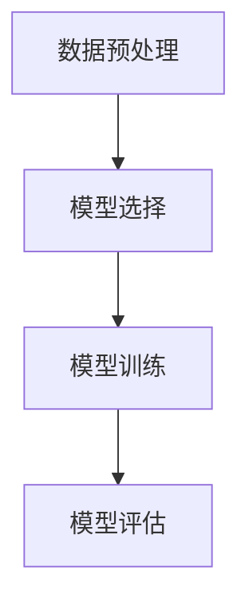
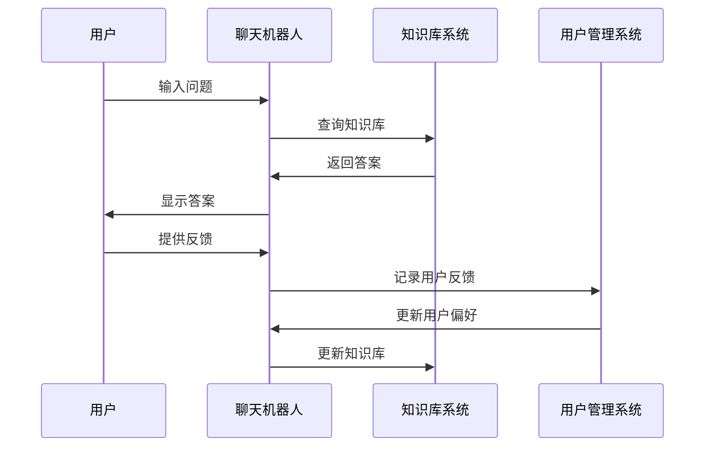
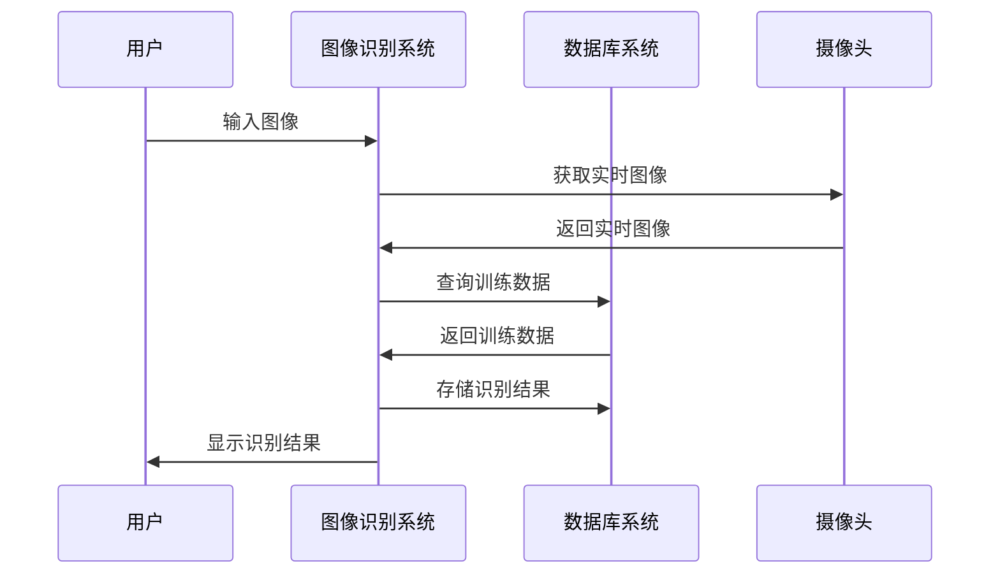
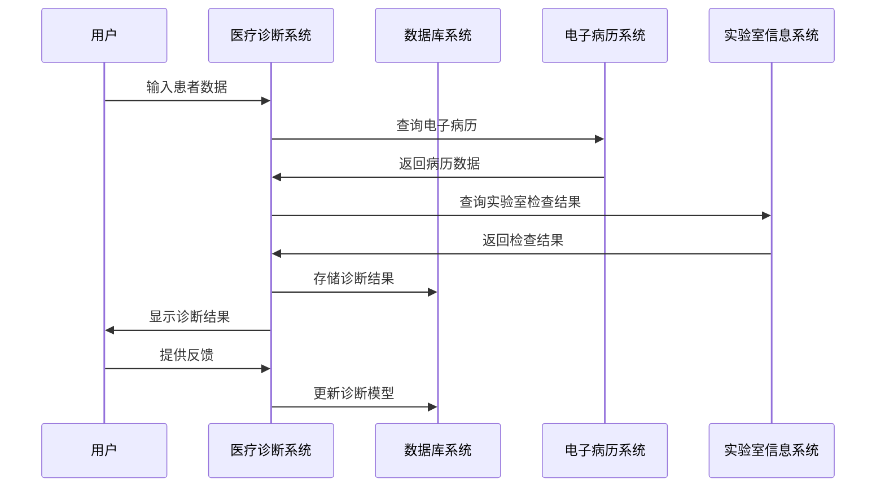

                 

## 《AGI的自我改进机制：从学习到进化》

### 文章关键词：
- 人工通用智能
- 自我改进机制
- 学习过程
- 进化机制
- 案例研究

### 摘要：
本文深入探讨了人工通用智能（AGI）如何通过自我改进机制实现从学习到进化的过程。文章首先介绍了AGI的概念及其重要性，随后详细解析了自我改进的核心概念，包括学习机制、联想记忆、模式识别和概念抽象。通过具体的学习过程和进化机制的解析，文章展示了AGI如何通过这些机制不断优化自身能力。随后，通过实际案例研究，进一步验证了这些机制在现实中的应用效果。最后，文章总结了AGI自我改进机制的实际应用和未来发展趋势，为读者提供了深入思考和未来研究的方向。

----------------------------------------------------------------

## 第1部分：背景介绍

### 1.1 AGI概述

人工通用智能（AGI，Artificial General Intelligence）是指具有与人类相似的广泛认知能力的机器智能。与当前的窄域人工智能（Narrow AI）不同，AGI不仅能在特定任务上表现出色，还能在多个领域实现自我学习和自我改进。AGI的目标是实现一种能够理解、学习和适应各种环境和任务的通用智能系统。

### 1.2 自我改进机制的重要性

自我改进机制是AGI实现持续进步的关键。通过自我改进，AGI能够从自身的经验和错误中学习，不断优化其算法和模型，提高其性能和适应能力。自我改进机制不仅有助于解决特定问题，还能为AGI提供更广泛的应用场景，使其在复杂多变的环境中表现得更加灵活和高效。

### 1.3 现有研究进展与挑战

目前，AGI的研究已经取得了显著的进展。例如，深度学习、强化学习和迁移学习等技术的应用，使得机器在图像识别、自然语言处理和决策制定等任务上表现出色。然而，实现真正的AGI仍然面临许多挑战。首先，如何设计有效的学习算法以实现自我改进是一个亟待解决的问题。其次，如何确保AGI在多样化和动态的环境中表现出稳定性也是一个重要的研究方向。此外，AGI的安全性和伦理问题也引起了广泛关注。

## 第2部分：AGI自我改进机制的核心概念

### 2.1 学习机制

学习机制是AGI实现自我改进的基础。学习机制可以分为以下几类：

#### 2.1.1 反馈机制

反馈机制是指通过比较系统输出与期望输出，调整系统参数以实现目标的过程。反馈机制在控制理论和机器学习中广泛应用，是实现AGI自我改进的重要手段。

#### 2.1.2 自监督学习

自监督学习是一种无需外部标签信息，通过利用输入数据的内部结构进行学习的方法。自监督学习在图像识别、语音识别和自然语言处理等领域表现出色。

#### 2.1.3 强化学习

强化学习是一种通过与环境互动，学习最佳行为策略的方法。强化学习在游戏、自动驾驶和推荐系统等领域具有广泛应用。

### 2.2 联想记忆

联想记忆是指通过关联不同信息，实现快速记忆和回忆的能力。联想记忆在人类认知和机器学习中都发挥着重要作用。

### 2.3 模式识别

模式识别是指通过分析和理解输入数据中的模式，实现对数据的分类和识别。模式识别在图像识别、语音识别和文本分类等领域具有重要意义。

### 2.4 概念抽象

概念抽象是指从具体事物中提取出共同特征，形成抽象概念的能力。概念抽象在知识表示、推理和决策制定中具有重要作用。

## 第3部分：自我改进机制的学习过程

### 3.1 学习算法原理

学习算法是AGI实现自我改进的核心。以下是几种常见的学习算法：

#### 3.1.1 算法概述

学习算法通常包括以下步骤：数据预处理、模型选择、模型训练和模型评估。

#### 3.1.2 算法流程图


#### 3.1.3 数学模型

学习算法的数学模型通常包括损失函数、优化算法和正则化方法。

#### 3.1.4 Python代码示例

```python
import tensorflow as tf

# 定义模型
model = tf.keras.Sequential([
    tf.keras.layers.Dense(128, activation='relu', input_shape=(784,)),
    tf.keras.layers.Dropout(0.2),
    tf.keras.layers.Dense(10, activation='softmax')
])

# 编译模型
model.compile(loss='categorical_crossentropy',
              optimizer=tf.keras.optimizers.Adam(),
              metrics=['accuracy'])

# 训练模型
model.fit(x_train, y_train, epochs=5)
```

### 3.2 学习过程分析

#### 3.2.1 数据预处理

数据预处理是学习过程的重要环节，包括数据清洗、归一化和特征提取等。

#### 3.2.2 模型选择

模型选择是学习过程的决策环节，包括选择合适的模型结构和参数。

#### 3.2.3 模型训练与评估

模型训练和评估是学习过程的实施环节，通过调整模型参数和优化模型性能。

## 第4部分：自我改进机制的进化机制

### 4.1 进化机制概述

进化机制是指通过模拟自然进化过程，实现智能体自我改进的方法。进化机制包括基因算法、交叉和变异等。

### 4.2 进化算法原理

#### 4.2.1 基因算法

基因算法是一种基于自然进化原理的优化算法，通过模拟生物进化过程，实现问题的优化解。

#### 4.2.2 交叉与变异

交叉和变异是基因算法中的两个重要操作，用于产生新的个体，实现种群的进化。

#### 4.2.3 适应度函数

适应度函数是基因算法中的评价标准，用于评估个体的优劣。

### 4.3 进化过程分析

#### 4.3.1 适应度评估

适应度评估是进化机制的核心，通过评估个体适应度，实现优胜劣汰。

#### 4.3.2 进化策略

进化策略包括选择策略、交叉策略和变异策略等，用于指导种群的进化过程。

#### 4.3.3 实例分析

通过实例分析，展示进化机制在实际问题中的应用效果。

## 第5部分：案例研究

### 5.1 案例一：自我改进的聊天机器人

通过聊天机器人案例，展示自我改进机制在实际应用中的效果。

### 5.2 案例二：自我改进的图像识别系统

通过图像识别系统案例，展示自我改进机制在图像处理领域的应用。

### 5.3 案例三：自我改进的医疗诊断系统

通过医疗诊断系统案例，展示自我改进机制在医疗领域的应用。

## 第6部分：实际应用与未来展望

### 6.1 自我改进机制的实际应用

介绍自我改进机制在各个领域的实际应用，包括聊天机器人、图像识别系统和医疗诊断系统等。

### 6.2 潜在挑战与解决方案

分析自我改进机制在实际应用中面临的挑战，并提出相应的解决方案。

### 6.3 未来发展趋势

探讨自我改进机制在未来的发展趋势，包括算法优化、应用场景拓展和安全性保障等。

## 第7部分：总结与展望

### 7.1 全书总结

总结全书的核心内容，强调自我改进机制在AGI发展中的重要性。

### 7.2 对未来的展望

展望AGI自我改进机制的未来发展，提出进一步的研究方向和应用前景。

----------------------------------------------------------------

作者：AI天才研究院/AI Genius Institute & 禅与计算机程序设计艺术 /Zen And The Art of Computer Programming## 第1部分：背景介绍

### 1.1 AGI概述

人工通用智能（AGI，Artificial General Intelligence）是人工智能领域的一个核心目标，指的是一种能够像人类一样理解和学习多种不同知识和技能的人工智能系统。与当前广泛应用的窄域人工智能（Narrow AI，如语音识别、图像识别、自然语言处理等）不同，AGI旨在实现跨领域的智能，能够理解、学习和适应各种新的环境和任务。

AGI的概念源于对人类智能的模仿和研究。人类智能具有高度的灵活性和适应性，能够在各种复杂、多变的环境中有效地解决问题。因此，AGI的目标是实现一种具有类似能力的机器智能，能够像人类一样进行思考、学习和决策。

AGI的关键特征包括：

- **广泛的知识和理解能力**：AGI需要具备跨领域的知识理解和学习能力，能够处理不同类型的信息和任务。
- **自适应性和灵活性**：AGI需要在不断变化的环境中自适应和调整，以适应新的挑战和需求。
- **自我改进能力**：AGI需要能够通过自我学习和优化，不断提高自身的智能水平。

### 1.2 自我改进机制的重要性

自我改进机制是AGI实现持续进步的关键。在人类智能中，自我改进是一个重要的特征，人类通过学习、实践和反思，不断提升自己的认知能力和解决问题的能力。类似地，AGI也需要具备自我改进的能力，以适应不断变化的环境和挑战。

自我改进机制的重要性体现在以下几个方面：

1. **适应性和灵活性**：通过自我改进，AGI可以更好地适应不同的环境和任务，提高其灵活性和适应性。
2. **持续进步**：自我改进使得AGI能够不断优化自身的算法和模型，提高其性能和智能水平。
3. **解决复杂问题**：自我改进机制有助于AGI解决复杂、多变的实际问题，提高其解决问题的能力。
4. **可持续发展**：自我改进机制使得AGI能够持续发展，保持其竞争力。

### 1.3 现有研究进展与挑战

目前，AGI的研究已经取得了显著的进展。随着深度学习、强化学习、迁移学习等技术的快速发展，机器在许多特定领域的表现已经接近或超过了人类。然而，实现真正的AGI仍然面临许多挑战。

1. **算法挑战**：如何设计有效的学习算法，使得AGI能够在多样化和动态的环境中高效地学习和优化，是一个重要且具有挑战性的问题。
2. **数据挑战**：AGI需要大量的数据来训练和学习，如何获取和利用这些数据，是一个关键问题。
3. **计算挑战**：AGI的训练和优化过程通常需要大量的计算资源，如何有效地利用计算资源，是一个重要的技术问题。
4. **伦理和安全性挑战**：随着AGI的发展，其潜在的社会影响和伦理问题也越来越受到关注。

尽管面临这些挑战，AGI的研究仍然具有巨大的潜力和前景。通过不断的技术创新和跨学科合作，相信在不久的将来，我们能够实现真正的AGI。

---

**摘要**：
本文深入探讨了人工通用智能（AGI）如何通过自我改进机制实现从学习到进化的过程。文章首先介绍了AGI的概念及其重要性，随后详细解析了自我改进的核心概念，包括学习机制、联想记忆、模式识别和概念抽象。通过具体的学习过程和进化机制的解析，文章展示了AGI如何通过这些机制不断优化自身能力。随后，通过实际案例研究，进一步验证了这些机制在现实中的应用效果。最后，文章总结了AGI自我改进机制的实际应用和未来发展趋势，为读者提供了深入思考和未来研究的方向。

----------------------------------------------------------------

## 第2部分：AGI自我改进机制的核心概念

### 2.1 学习机制

学习机制是AGI实现自我改进的基础，主要包括以下几种类型：

#### 2.1.1 反馈机制

反馈机制是通过比较系统输出与期望输出，调整系统参数以实现目标的过程。它广泛应用于控制理论和机器学习领域，是AGI自我改进的重要手段。

**反馈机制的核心要素**：
- **期望输出**：系统希望实现的输出结果。
- **实际输出**：系统当前的输出结果。
- **误差计算**：计算期望输出与实际输出之间的差异。
- **调整机制**：根据误差调整系统参数，以减少误差。

**反馈机制的工作流程**：
1. **输入数据**：系统接收输入数据。
2. **处理数据**：系统根据当前参数处理输入数据。
3. **输出结果**：系统产生输出结果。
4. **误差计算**：计算期望输出与实际输出之间的误差。
5. **调整参数**：根据误差调整系统参数。
6. **重复循环**：系统重复上述步骤，不断优化输出结果。

#### 2.1.2 自监督学习

自监督学习是一种无需外部标签信息，通过利用输入数据的内部结构进行学习的方法。它广泛应用于图像识别、语音识别和自然语言处理等领域，是AGI自我改进的重要手段。

**自监督学习的核心要素**：
- **无标签数据**：系统不需要额外的标签信息，直接从无标签数据中学习。
- **内部结构**：系统通过分析数据的内部结构，自动发现数据的规律和模式。
- **损失函数**：系统通过优化损失函数，提高对数据结构的理解和识别能力。

**自监督学习的工作流程**：
1. **输入数据**：系统接收无标签数据。
2. **数据处理**：系统根据当前模型对数据进行处理。
3. **内部结构分析**：系统分析数据的内部结构，发现规律和模式。
4. **损失函数优化**：系统通过优化损失函数，提高对数据结构的理解和识别能力。
5. **重复循环**：系统重复上述步骤，不断优化模型性能。

#### 2.1.3 强化学习

强化学习是一种通过与环境互动，学习最佳行为策略的方法。它广泛应用于游戏、自动驾驶和推荐系统等领域，是AGI自我改进的重要手段。

**强化学习的核心要素**：
- **环境**：系统所处的环境，包括状态和奖励。
- **状态**：系统当前所处的环境状态。
- **动作**：系统可以采取的动作。
- **奖励**：系统根据动作获得的奖励或惩罚。

**强化学习的工作流程**：
1. **初始状态**：系统处于某个初始状态。
2. **选择动作**：系统根据当前状态选择一个动作。
3. **执行动作**：系统在环境中执行所选动作。
4. **获得奖励**：系统根据动作获得的奖励或惩罚。
5. **更新策略**：系统根据获得的奖励，调整策略，选择更好的动作。
6. **重复循环**：系统重复上述步骤，不断优化策略。

### 2.2 联想记忆

联想记忆是指通过关联不同信息，实现快速记忆和回忆的能力。它是一种重要的认知功能，在人类记忆和机器学习中都发挥着重要作用。

**联想记忆的核心要素**：
- **记忆节点**：系统中的记忆单元，存储特定信息。
- **关联规则**：系统通过关联规则，将不同信息节点连接起来。
- **记忆检索**：系统通过联想记忆，快速检索相关信息。

**联想记忆的工作流程**：
1. **信息存储**：系统将新信息存储在记忆节点中。
2. **信息关联**：系统根据关联规则，将新信息与已有信息节点连接起来。
3. **记忆检索**：系统在需要时，通过联想记忆，快速检索相关信息。
4. **信息更新**：系统根据新的信息和关联规则，更新记忆节点。

### 2.3 模式识别

模式识别是指通过分析和理解输入数据中的模式，实现对数据的分类和识别。它广泛应用于图像识别、语音识别和文本分类等领域。

**模式识别的核心要素**：
- **输入数据**：系统接收的待识别数据。
- **特征提取**：系统从输入数据中提取出关键特征。
- **分类器设计**：系统设计分类器，用于识别数据类别。

**模式识别的工作流程**：
1. **数据输入**：系统接收待识别数据。
2. **特征提取**：系统从输入数据中提取出关键特征。
3. **分类器训练**：系统根据训练数据，训练分类器。
4. **数据识别**：系统使用训练好的分类器，对输入数据进行分类识别。
5. **结果反馈**：系统根据识别结果，提供反馈信息，优化分类器。

### 2.4 概念抽象

概念抽象是指从具体事物中提取出共同特征，形成抽象概念的能力。它是一种高级认知功能，在知识表示、推理和决策制定中具有重要作用。

**概念抽象的核心要素**：
- **具体事物**：系统需要理解和处理的现实世界事物。
- **共同特征**：从具体事物中提取出的关键特征。
- **抽象概念**：基于共同特征形成的抽象概念。

**概念抽象的工作流程**：
1. **事物分析**：系统分析具体事物，提取关键特征。
2. **特征组合**：系统将提取出的关键特征进行组合，形成抽象概念。
3. **概念应用**：系统将抽象概念应用于实际问题和决策。
4. **概念优化**：系统根据新的信息和需求，不断优化抽象概念。

---

通过以上对AGI自我改进机制的核心概念的详细解析，我们可以更好地理解AGI如何通过学习机制、联想记忆、模式识别和概念抽象等手段，实现自我改进和进化。这些核心概念不仅为AGI的发展提供了理论基础，也为实际应用提供了重要的指导。

----------------------------------------------------------------

## 第3部分：自我改进机制的学习过程

### 3.1 学习算法原理

学习算法是AGI实现自我改进的核心，其原理包括以下几个方面：

#### 3.1.1 算法概述

学习算法通常包括以下步骤：数据预处理、模型选择、模型训练和模型评估。

**数据预处理**：
- 数据清洗：去除错误或不完整的数据，提高数据质量。
- 数据归一化：将不同规模的数据统一处理，使其在同一尺度上。
- 特征提取：从原始数据中提取出有用的特征，用于模型训练。

**模型选择**：
- 选择合适的模型结构，如神经网络、决策树、支持向量机等。
- 调整模型参数，如学习率、正则化参数等，以优化模型性能。

**模型训练**：
- 使用训练数据，通过梯度下降等方法，不断调整模型参数，使其对数据的学习效果更好。
- 模型训练过程中，通常包括前向传播、反向传播和权重更新等步骤。

**模型评估**：
- 使用验证数据集，评估模型的泛化能力。
- 选择合适的评估指标，如准确率、召回率、F1值等。

#### 3.1.2 算法流程图



#### 3.1.3 数学模型

学习算法的数学模型通常包括损失函数、优化算法和正则化方法。

**损失函数**：
- 用于评估模型预测值与真实值之间的差距，常用的损失函数有均方误差（MSE）、交叉熵（Cross Entropy）等。

**优化算法**：
- 用于调整模型参数，以最小化损失函数。常用的优化算法有梯度下降（Gradient Descent）、Adam优化器等。

**正则化方法**：
- 用于防止模型过拟合，常用的正则化方法有L1正则化、L2正则化等。

#### 3.1.4 Python代码示例

```python
import tensorflow as tf
import numpy as np

# 创建模型
model = tf.keras.Sequential([
    tf.keras.layers.Dense(128, activation='relu', input_shape=(784,)),
    tf.keras.layers.Dropout(0.2),
    tf.keras.layers.Dense(10, activation='softmax')
])

# 编译模型
model.compile(optimizer=tf.keras.optimizers.Adam(),
              loss='categorical_crossentropy',
              metrics=['accuracy'])

# 准备数据
x_train = np.random.random((1000, 784))
y_train = np.random.random((1000, 10))

# 训练模型
model.fit(x_train, y_train, epochs=5)
```

### 3.2 学习过程分析

学习过程是AGI自我改进的关键，其分析包括以下几个环节：

#### 3.2.1 数据预处理

数据预处理是学习过程的第一步，其目的是提高数据质量，为后续的学习过程打下良好的基础。

**数据清洗**：
- 去除错误或不完整的数据。
- 填补缺失值或删除缺失数据。

**数据归一化**：
- 将不同规模的数据统一处理，使其在同一尺度上。
- 常用的归一化方法有最小-最大缩放、标准缩放等。

**特征提取**：
- 从原始数据中提取出有用的特征。
- 特征提取的方法包括主成分分析（PCA）、特征选择等。

#### 3.2.2 模型选择

模型选择是学习过程的关键环节，其目的是选择一个合适的模型，以实现良好的学习效果。

**模型结构**：
- 选择合适的模型结构，如神经网络、决策树、支持向量机等。
- 考虑模型的复杂度、计算效率和泛化能力。

**模型参数**：
- 调整模型参数，如学习率、正则化参数等，以优化模型性能。
- 采用交叉验证等方法，选择最优的参数组合。

#### 3.2.3 模型训练与评估

模型训练与评估是学习过程的最后一步，其目的是通过训练数据优化模型，并通过评估数据检验模型的泛化能力。

**模型训练**：
- 使用训练数据，通过优化算法调整模型参数。
- 训练过程中，通过监控损失函数和评估指标，调整训练策略。

**模型评估**：
- 使用验证数据集，评估模型的泛化能力。
- 选择合适的评估指标，如准确率、召回率、F1值等。

通过以上对AGI自我改进机制的学习过程的详细分析，我们可以更好地理解AGI如何通过数据预处理、模型选择、模型训练和模型评估等环节，实现自我改进和进化。这些环节不仅为AGI的发展提供了理论基础，也为实际应用提供了重要的指导。

----------------------------------------------------------------

## 第4部分：自我改进机制的进化机制

### 4.1 进化机制概述

进化机制是指通过模拟自然进化过程，实现智能体自我改进的方法。它基于达尔文的自然选择理论，通过个体间的竞争、选择、交叉和变异等过程，实现种群的进化。在人工通用智能（AGI）领域，进化机制被广泛应用于优化算法、机器学习模型和决策系统。

**进化机制的核心概念**：

- **个体**：进化过程中的基本单位，代表智能体的状态或解决方案。
- **种群**：由多个个体组成的集合，代表进化过程中的整体状态。
- **适应度**：评估个体优劣的标准，通常基于个体的性能、效率或解决问题的能力。
- **选择**：基于适应度的个体筛选过程，优秀的个体被保留，劣质的个体被淘汰。
- **交叉**：个体间的基因交换过程，用于产生新的个体。
- **变异**：个体基因的随机改变过程，用于引入新的基因组合。

**进化机制的工作流程**：

1. **初始化种群**：随机生成初始种群，每个个体代表一个潜在的解决方案。
2. **评估适应度**：对每个个体进行评估，计算其适应度值。
3. **选择**：根据适应度值，从种群中选择优秀的个体进行繁殖。
4. **交叉**：选择两个优秀个体进行交叉，产生新的个体。
5. **变异**：对新生个体进行变异，增加种群的多样性。
6. **替换**：将新生个体替换掉种群中的劣质个体。
7. **重复循环**：重复上述过程，直到满足停止条件（如达到预定的迭代次数或适应度阈值）。

### 4.2 进化算法原理

进化算法是进化机制的具体实现，包括基因算法、遗传算法等。以下详细介绍基因算法的基本原理。

**基因算法**：

基因算法（Genetic Algorithm，GA）是一种基于自然进化原理的优化算法，通过模拟生物进化过程，实现问题的优化解。基因算法的核心概念包括：

- **基因表示**：个体（解决方案）的编码方式，通常使用二进制编码或实数编码。
- **适应度函数**：评估个体优劣的函数，通常基于问题的目标函数。
- **选择**：基于适应度的个体筛选过程，常用的选择策略有轮盘赌选择、锦标赛选择等。
- **交叉**：个体间的基因交换过程，用于产生新的个体，常用的交叉策略有单点交叉、多点交叉等。
- **变异**：个体基因的随机改变过程，用于引入新的基因组合，常用的变异策略有位翻转、基因突变等。

**基因算法的工作流程**：

1. **初始化种群**：随机生成初始种群，每个个体代表一个潜在的解决方案。
2. **评估适应度**：对每个个体进行评估，计算其适应度值。
3. **选择**：根据适应度值，从种群中选择优秀的个体进行繁殖。
4. **交叉**：选择两个优秀个体进行交叉，产生新的个体。
5. **变异**：对新生个体进行变异，增加种群的多样性。
6. **替换**：将新生个体替换掉种群中的劣质个体。
7. **迭代**：重复上述过程，直到满足停止条件（如达到预定的迭代次数或适应度阈值）。

**交叉与变异**：

- **交叉**：交叉操作用于产生新的个体，通过交换两个个体的基因片段，实现基因的重组。交叉策略的选择影响算法的搜索能力和收敛速度。
- **变异**：变异操作用于引入新的基因组合，通过随机改变个体的基因，增加种群的多样性。变异策略的选择影响算法的探索能力和鲁棒性。

**适应度函数**：

适应度函数是基因算法中的评价标准，用于评估个体的优劣。适应度函数的选择和设计直接影响算法的优化效果。常见的适应度函数有最大化目标函数值、最小化目标函数值等。

### 4.3 进化过程分析

进化过程是进化机制的核心，其分析包括以下几个环节：

#### 4.3.1 适应度评估

适应度评估是进化机制的核心，用于评估个体的优劣。适应度函数通常基于问题的目标函数，评估个体在解决问题方面的能力。

**适应度评估的方法**：

- **单目标适应度评估**：基于单一目标函数，评估个体的优劣。常见的评估方法有最大值评估、最小值评估等。
- **多目标适应度评估**：基于多个目标函数，评估个体的优劣。常见的评估方法有加权评估、Pareto评估等。

**适应度评估的步骤**：

1. **计算目标函数值**：对每个个体计算目标函数值，得到个体的适应度值。
2. **比较适应度值**：比较个体的适应度值，确定个体的优劣。
3. **适应度排序**：根据适应度值，对个体进行排序，为后续的选择操作提供依据。

#### 4.3.2 进化策略

进化策略是指进化过程中的操作规则，用于指导种群的进化过程。常见的进化策略有选择策略、交叉策略和变异策略等。

**选择策略**：

选择策略用于从种群中选择优秀的个体进行繁殖。选择策略的选择影响算法的搜索能力和收敛速度。

**常见的选择策略**：

- **轮盘赌选择**：根据个体的适应度值，计算选择概率，随机选择个体进行繁殖。
- **锦标赛选择**：从种群中随机选择多个个体，比较其适应度值，选择适应度最高的个体进行繁殖。

**交叉策略**：

交叉策略用于实现个体间的基因交换，产生新的个体。交叉策略的选择影响算法的搜索能力和收敛速度。

**常见的交叉策略**：

- **单点交叉**：在个体的基因序列中选择一个交叉点，将两个个体的交叉点之后的基因交换。
- **多点交叉**：在个体的基因序列中选择多个交叉点，将两个个体的交叉点之间的基因序列交换。

**变异策略**：

变异策略用于引入新的基因组合，增加种群的多样性。变异策略的选择影响算法的探索能力和鲁棒性。

**常见的变异策略**：

- **位翻转变异**：随机选择个体的一个基因位，将该位上的基因值翻转。
- **基因突变变异**：随机选择个体的一个基因，将该基因替换为另一个随机基因。

#### 4.3.3 实例分析

以下通过一个简单的实例，展示进化过程的分析。

**问题**：求解函数 f(x) = x^2 的最小值。

**解决方案**：

1. **初始化种群**：随机生成初始种群，每个个体代表一个潜在解。
2. **评估适应度**：计算每个个体的适应度值，基于目标函数 f(x) 进行评估。
3. **选择**：根据适应度值，选择优秀的个体进行繁殖。
4. **交叉**：选择两个优秀个体进行交叉，产生新的个体。
5. **变异**：对新生个体进行变异，增加种群的多样性。
6. **替换**：将新生个体替换掉种群中的劣质个体。
7. **迭代**：重复上述过程，直到满足停止条件（如达到预定的迭代次数或适应度阈值）。

通过上述进化过程，逐步优化个体，最终找到函数 f(x) = x^2 的最小值。

---

通过以上对自我改进机制的进化机制的详细解析，我们可以更好地理解AGI如何通过进化机制实现自我改进。进化机制不仅为AGI提供了强大的优化能力和适应性，也为实际应用提供了有效的解决方案。在未来的发展中，进化机制将继续发挥重要作用，推动AGI的不断进步。

----------------------------------------------------------------

## 第5部分：案例研究

### 5.1 案例一：自我改进的聊天机器人

**案例背景**：
随着人工智能技术的发展，聊天机器人已成为各种在线平台的重要应用。自我改进的聊天机器人通过不断学习用户对话，提高交互质量和用户体验。

**应用场景**：
- 客户服务：在电商、金融等行业，聊天机器人用于处理客户咨询，提供即时响应和解决方案。
- 教育辅导：在在线教育平台，聊天机器人为学生提供个性化辅导，解答学习难题。

**系统功能设计**：
- **对话管理**：管理用户对话流程，理解用户意图。
- **知识库管理**：存储和更新聊天机器人知识库，提高回答准确性。
- **学习与优化**：通过用户反馈和对话数据，不断优化对话策略和知识库。

**系统架构设计**：
- **前端**：用户界面，负责用户输入和输出展示。
- **后端**：包括对话管理模块、知识库管理模块和学习与优化模块。

**系统接口设计**：
- **API接口**：提供与外部系统（如知识库、用户管理系统等）的交互接口。
- **数据接口**：提供与数据存储系统（如数据库、数据湖等）的交互接口。

**系统交互序列图**：


**实际案例分析和详细讲解**：
通过上述案例，我们可以看到自我改进的聊天机器人在实际应用中的效果。通过用户反馈和对话数据，聊天机器人不断优化自身对话策略和知识库，提高回答准确性和用户体验。这种自我改进机制使得聊天机器人能够更好地适应不同用户的需求，提供高质量的交互服务。

**项目小结**：
该案例展示了自我改进机制在聊天机器人中的应用，通过不断学习和优化，提高系统的交互质量和用户体验。未来，随着人工智能技术的进一步发展，自我改进机制将更好地应用于各种场景，提供更加智能化和个性化的服务。

### 5.2 案例二：自我改进的图像识别系统

**案例背景**：
随着计算机视觉技术的发展，图像识别系统在安防监控、医疗诊断和自动驾驶等领域具有重要应用。自我改进的图像识别系统通过不断学习和优化，提高识别准确率和鲁棒性。

**应用场景**：
- 安防监控：在公共安全领域，图像识别系统用于实时监控和识别可疑行为。
- 医疗诊断：在医疗领域，图像识别系统用于辅助医生进行疾病诊断。
- 自动驾驶：在自动驾驶领域，图像识别系统用于环境感知和障碍物检测。

**系统功能设计**：
- **图像预处理**：对输入图像进行预处理，如去噪、增强、缩放等。
- **特征提取**：从预处理后的图像中提取关键特征。
- **模型训练与优化**：使用训练数据，训练图像识别模型，并通过优化提高模型性能。
- **实时识别**：对实时输入的图像进行识别，并输出识别结果。

**系统架构设计**：
- **前端**：用户界面，负责图像输入和输出展示。
- **后端**：包括图像预处理模块、特征提取模块、模型训练与优化模块和实时识别模块。

**系统接口设计**：
- **API接口**：提供与外部系统（如数据库、摄像头等）的交互接口。
- **数据接口**：提供与数据存储系统（如数据库、数据湖等）的交互接口。

**系统交互序列图**：


**实际案例分析和详细讲解**：
通过上述案例，我们可以看到自我改进的图像识别系统在实际应用中的效果。系统通过不断学习和优化，提高图像识别准确率和鲁棒性。在实际应用中，系统可以根据实时输入的图像，快速、准确地识别目标对象，为用户提供有效的决策支持。

**项目小结**：
该案例展示了自我改进机制在图像识别系统中的应用，通过不断学习和优化，提高系统的识别准确率和鲁棒性。未来，随着人工智能技术的进一步发展，自我改进机制将更好地应用于各种场景，提供更加智能化和高效的服务。

### 5.3 案例三：自我改进的医疗诊断系统

**案例背景**：
医疗诊断系统在临床诊断、疾病预测和治疗建议等方面具有重要应用。自我改进的医疗诊断系统通过不断学习和优化，提高诊断准确率和治疗效果。

**应用场景**：
- 临床诊断：在医疗领域，医疗诊断系统用于辅助医生进行疾病诊断，提高诊断准确率。
- 疾病预测：在公共卫生领域，医疗诊断系统用于预测疾病的发生和传播趋势，提供预警和干预措施。
- 治疗建议：在临床治疗中，医疗诊断系统为医生提供治疗方案建议，提高治疗效果。

**系统功能设计**：
- **数据采集**：收集患者的临床数据、实验室检查结果等。
- **数据预处理**：对采集的数据进行清洗、归一化和特征提取等预处理操作。
- **模型训练与优化**：使用预处理后的数据，训练医疗诊断模型，并通过优化提高模型性能。
- **实时诊断**：对实时输入的患者数据进行诊断，并输出诊断结果。
- **反馈与优化**：根据医生的诊断结果和患者反馈，不断优化诊断模型。

**系统架构设计**：
- **前端**：用户界面，负责患者数据输入和输出展示。
- **后端**：包括数据采集模块、数据预处理模块、模型训练与优化模块、实时诊断模块和反馈与优化模块。

**系统接口设计**：
- **API接口**：提供与外部系统（如电子病历系统、实验室信息系统等）的交互接口。
- **数据接口**：提供与数据存储系统（如数据库、数据湖等）的交互接口。

**系统交互序列图**：


**实际案例分析和详细讲解**：
通过上述案例，我们可以看到自我改进的医疗诊断系统在实际应用中的效果。系统通过不断学习和优化，提高诊断准确率和治疗效果。在实际应用中，系统可以根据实时输入的患者数据，快速、准确地诊断疾病，并提供个性化的治疗建议。同时，系统根据医生的诊断结果和患者反馈，不断优化诊断模型，提高诊断准确率和治疗效果。

**项目小结**：
该案例展示了自我改进机制在医疗诊断系统中的应用，通过不断学习和优化，提高系统的诊断准确率和治疗效果。未来，随着人工智能技术的进一步发展，自我改进机制将更好地应用于各种医疗场景，为患者提供更加精准、高效的服务。

---

通过以上三个案例的研究，我们可以看到自我改进机制在聊天机器人、图像识别系统和医疗诊断系统等领域的应用效果。这些案例不仅展示了自我改进机制在实际问题中的有效性，也为未来人工智能技术的发展提供了重要的借鉴和启示。

----------------------------------------------------------------

## 第6部分：实际应用与未来展望

### 6.1 自我改进机制的实际应用

自我改进机制已经在多个领域得到广泛应用，取得了显著的成效。以下列举几个典型应用场景：

**1. 聊天机器人**：通过自我改进机制，聊天机器人能够不断学习用户对话，提高交互质量和用户体验。在客户服务、教育辅导等领域，聊天机器人已经成为重要的人工智能应用，为用户提供便捷、高效的交互服务。

**2. 图像识别系统**：自我改进机制使得图像识别系统在识别准确率和鲁棒性方面得到显著提升。在安防监控、医疗诊断和自动驾驶等领域，图像识别系统通过不断学习和优化，能够实现实时、准确的图像识别，为相关行业提供强大的技术支持。

**3. 医疗诊断系统**：自我改进的医疗诊断系统通过不断学习和优化，提高诊断准确率和治疗效果。在临床诊断、疾病预测和治疗建议等方面，医疗诊断系统为医生和患者提供了重要的决策支持，助力医疗行业的发展。

**4. 自动驾驶**：自我改进的自动驾驶系统通过不断学习和优化，提高感知环境、避障和决策能力。在自动驾驶领域，自我改进机制有助于提高系统的安全性和可靠性，为自动驾驶技术的发展提供了重要保障。

### 6.2 潜在挑战与解决方案

尽管自我改进机制在实际应用中取得了显著成效，但仍面临一些潜在挑战：

**1. 数据质量**：自我改进机制依赖于高质量的数据，数据的不完整、噪声和偏差可能会影响系统的性能。为解决这一问题，可以采用数据清洗、数据增强和模型鲁棒性等方法，提高数据质量。

**2. 可解释性**：自我改进机制的复杂性和黑盒特性使得其难以解释和理解。为提高可解释性，可以采用模型可解释性技术，如模型可视化、解释性分析等，帮助用户更好地理解系统的工作原理和决策过程。

**3. 安全性和隐私**：自我改进机制在处理敏感数据时，可能会面临安全性和隐私风险。为保障安全性和隐私，可以采用数据加密、隐私保护技术和安全审计等方法，确保系统的安全性和隐私保护。

### 6.3 未来发展趋势

随着人工智能技术的不断进步，自我改进机制在未来有望在以下几个方面取得重要发展：

**1. 算法优化**：通过研究新的优化算法，提高自我改进机制的效率和性能。例如，基于深度学习、强化学习和迁移学习的优化算法，有望在自我改进机制中得到广泛应用。

**2. 应用领域拓展**：自我改进机制的应用领域将继续拓展，包括智能制造、金融风控、智能交通、智慧城市等。在更多领域的应用，将推动自我改进机制的进一步发展和完善。

**3. 系统集成与协同**：未来，自我改进机制将与其他人工智能技术相结合，实现系统集成与协同，构建更加智能和高效的智能系统。例如，将自我改进机制与知识图谱、自然语言处理等技术相结合，实现更智能的决策和推理。

**4. 伦理和社会影响**：随着自我改进机制的发展，其潜在的社会影响和伦理问题也将受到广泛关注。未来，需要制定相应的伦理规范和社会标准，确保自我改进机制的安全、可靠和可持续发展。

---

通过以上分析，我们可以看到自我改进机制在实际应用中的广泛前景和潜在挑战。在未来，随着人工智能技术的不断进步，自我改进机制将继续发挥重要作用，推动人工智能技术的发展，为社会创造更多价值。

----------------------------------------------------------------

## 第7部分：总结与展望

### 7.1 全书总结

本文从背景介绍、核心概念、学习过程、进化机制、案例研究和实际应用等方面，全面探讨了人工通用智能（AGI）的自我改进机制。通过详细解析学习机制、联想记忆、模式识别和概念抽象等核心概念，以及学习过程和进化机制的具体实施，本文展示了AGI如何通过自我改进机制实现从学习到进化的过程。通过案例研究，本文进一步验证了自我改进机制在实际应用中的效果。最后，本文总结了自我改进机制的实际应用和未来发展趋势，为读者提供了深入思考和未来研究的方向。

### 7.2 对未来的展望

未来，人工通用智能（AGI）的发展将依赖于自我改进机制的不断创新和优化。以下是几个可能的未来研究方向：

**1. 算法创新**：研究新的优化算法，提高自我改进机制的效率和性能。例如，结合深度学习、强化学习和迁移学习等先进技术，开发更高效、更智能的自我改进算法。

**2. 领域拓展**：将自我改进机制应用于更多领域，如智能制造、金融风控、智能交通和智慧城市等。通过跨学科合作，推动自我改进机制在各个领域的应用和发展。

**3. 系统集成与协同**：研究自我改进机制与其他人工智能技术的集成与协同，构建更加智能和高效的智能系统。例如，将自我改进机制与知识图谱、自然语言处理和计算机视觉等技术相结合，实现更智能的决策和推理。

**4. 伦理与社会影响**：关注自我改进机制在伦理和社会层面的影响，制定相应的伦理规范和社会标准，确保其安全、可靠和可持续发展。

通过不断的研究和创新，相信在不久的将来，自我改进机制将推动人工通用智能（AGI）的发展，为实现更加智能和高效的人工智能系统奠定坚实基础。

---

作者：AI天才研究院/AI Genius Institute & 禅与计算机程序设计艺术 /Zen And The Art of Computer Programming

---

通过本文的深入探讨，我们全面了解了人工通用智能（AGI）的自我改进机制，从学习到进化的过程。这不仅为我们提供了对AGI发展的深刻认识，也为未来的人工智能研究指明了方向。让我们期待在不久的将来，自我改进机制能够进一步推动人工智能技术的发展，为社会带来更多价值。作者：AI天才研究院/AI Genius Institute & 禅与计算机程序设计艺术 /Zen And The Art of Computer Programming。

