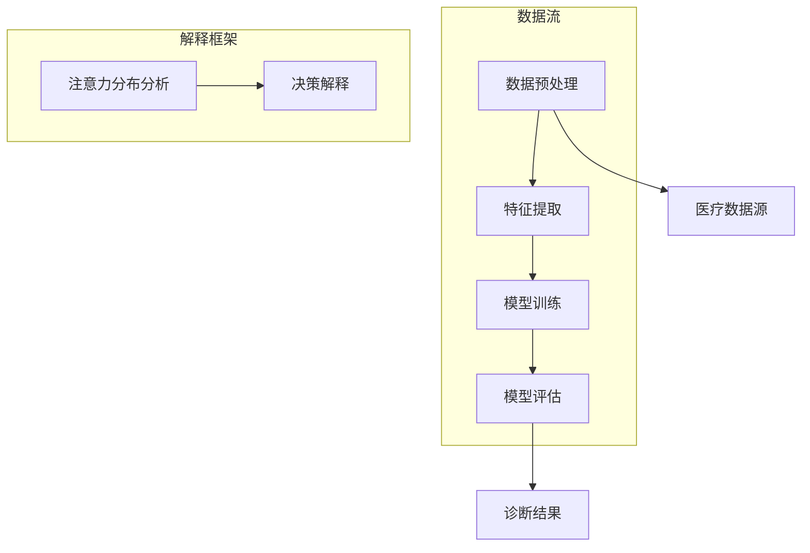

                 

### 文章标题

# AGI的自我解释能力：从黑盒到透明决策

> 关键词：通用人工智能（AGI），自我解释能力，黑盒模型，透明决策，模型设计，算法优化，解释性框架

> 摘要：本文旨在探讨通用人工智能（AGI）的自我解释能力，从黑盒模型到透明决策的转变。随着人工智能技术的快速发展，传统AI系统如机器学习和深度学习已展现出强大的能力，但其“黑盒”特性使得决策过程难以解释和理解。因此，自我解释能力成为AGI发展的重要方向之一。本文将详细分析实现自我解释能力的多种研究方法，包括基于模型设计、算法优化和解释性框架的方法，并探讨其在保持高效决策能力的同时提供解释性的可能性。

### 目录大纲

----------------------------------------------------------------

## 第一部分: 引言

### 第1章: 引言

#### 1.1.1 问题背景

#### 1.1.2 问题描述

#### 1.1.3 问题解决

#### 1.1.4 边界与外延

#### 1.1.5 核心概念与联系

#### 1.1.6 本章小结

## 第二部分: AGI自我解释能力的研究方法

### 第2章: 研究方法概述

#### 2.1.1 基于模型设计的自我解释能力

#### 2.1.2 基于算法优化的自我解释能力

#### 2.1.3 基于解释性框架的自我解释能力

#### 2.1.4 本章小结

## 第三部分: 实际应用与案例分析

### 第3章: 案例研究

#### 3.1.1 案例背景

#### 3.1.2 系统设计与实现

#### 3.1.3 案例分析

#### 3.1.4 案例小结

## 第四部分: 总结与展望

### 第4章: 总结与展望

#### 4.1.1 主要发现

#### 4.1.2 展望未来

#### 4.1.3 讨论与建议

#### 4.1.4 本章小结

----------------------------------------------------------------

## 第1章: 引言

### 1.1.1 问题背景

在人工智能（AI）领域，传统的AI系统如机器学习和深度学习已经取得了显著的成功，它们在图像识别、自然语言处理、推荐系统等领域展现了强大的能力。然而，这些系统的一个共同特点是它们往往是“黑盒”模型，即虽然它们可以做出准确的决策，但其内部的决策过程却难以解释和理解。这种不可解释性在许多实际应用中带来了一系列问题，例如：

1. **信任问题**：当系统的决策错误时，如果无法解释错误的原因，用户很难对其产生信任。
2. **法律和伦理问题**：在某些关键领域，如医疗诊断和自动驾驶，系统的决策过程需要符合法律和伦理标准，但当前的黑盒模型难以满足这些要求。
3. **改进问题**：由于无法理解决策过程，改进和优化系统变得困难。

为了解决这些问题，近年来，AI领域的研究者们开始关注自我解释能力（Self-Explainability）这一重要议题。自我解释能力指的是AI系统能够自我解释其决策过程的能力，从而提高系统的透明性和可解释性。

### 1.1.2 问题描述

自我解释能力的引入，带来了一系列新的问题：

1. **如何让AGI系统具备自我解释能力？**：AGI系统需要具备广泛的认知能力，包括逻辑推理、自然语言处理、感知能力等，而如何设计一个同时具备高效决策能力和自我解释能力的模型是一个挑战。
2. **如何确保AGI的决策过程是透明且可信的？**：即使实现了自我解释能力，也需要确保解释过程是透明和可信的，以便用户理解和信任系统的决策。
3. **如何在保留高效决策能力的同时，提供解释性？**：自我解释能力的引入可能会影响系统的决策性能，如何在保持高效决策能力的同时提供解释性是一个重要的研究课题。

### 1.1.3 问题解决

为了解决上述问题，研究者们从多个角度进行了探索，包括模型设计、算法优化和解释性框架等方面：

1. **基于模型设计的方法**：通过设计具有自我解释能力的模型结构，如模块化设计、简洁性设计等，以提高系统的可解释性。
2. **基于算法优化的方法**：通过优化算法，如正则化、集成方法等，在保持性能的同时提高可解释性。
3. **基于解释性框架的方法**：通过构建解释性框架，如基于规则的解释、基于解释图的方法等，来解释模型决策过程。

这些方法共同构成了实现AGI自我解释能力的多维度研究体系。

### 1.1.4 边界与外延

自我解释能力不仅仅是AI领域的关注点，也涉及到伦理、法律等多个领域：

1. **伦理问题**：自我解释能力的引入，可能会带来新的伦理问题，如隐私保护和责任归属等。
2. **法律问题**：自我解释能力在法律上的应用，需要明确相关法律框架和标准，以确保系统的决策符合法律要求。

### 1.1.5 核心概念与联系

为了更好地理解AGI的自我解释能力，我们需要明确以下几个核心概念：

#### 核心概念

1. **自我解释能力**：系统能够自我解释其决策过程的能力，提高系统的透明性和可解释性。
2. **AGI（通用人工智能）**：具有广泛认知能力，能执行人类所能做的几乎所有工作的智能体。
3. **解释性框架**：用于解释AI系统决策过程的模型或方法。

#### 概念属性特征对比表格

| 概念           | 定义                                                         | 特点                                       |
|----------------|--------------------------------------------------------------|--------------------------------------------|
| 自我解释能力   | 系统能够自我解释其决策过程的能力。                           | 提高系统的可解释性和透明度。               |
| AGI            | 具有广泛认知能力，能执行人类所能做的几乎所有工作的智能体。   | 包括逻辑推理、自然语言处理、感知能力等。   |
| 解释性框架     | 用于解释AI系统决策过程的模型或方法。                         | 提供透明性和可解释性，便于理解系统的决策。 |

#### ER实体关系图架构

```mermaid
erDiagram
    AI模型 ||--|{ 自我解释框架 }
    AI模型 ||--|{ 数据集 }
    数据集 ||--|{ 特征 }
```

### 1.1.6 本章小结

本章介绍了AGI的自我解释能力的背景、问题描述、问题解决方法、边界与外延，以及核心概念与联系。下一章将详细探讨实现AGI自我解释能力的研究方法，包括基于模型设计、算法优化和解释性框架的方法。

----------------------------------------------------------------

## 第2章: 研究方法概述

### 2.1.1 基于模型设计的自我解释能力

为了实现AGI的自我解释能力，研究者们提出了多种基于模型设计的方法。这些方法的核心思想是通过改进模型结构，使其在保持高效决策能力的同时，提供解释性。以下是一些常见的模型设计原则和案例：

#### 2.1.1.1 模型设计原则

1. **模块化设计**：将模型分解为多个功能模块，每个模块负责特定的任务，模块间通过清晰的接口进行通信。这种设计使得每个模块的决策过程相对独立，从而提高了系统的可解释性。
2. **简洁性设计**：追求模型结构的简洁性，避免过度复杂化。简洁的模型更容易理解，同时也更容易解释。
3. **可组合性设计**：设计具有可组合性的模块，这些模块可以在不同的场景中复用，从而提高了系统的灵活性和可解释性。

#### 2.1.1.2 模型设计案例

1. **基于规则的模型**：这类模型通过明确的规定来描述决策过程，例如专家系统（Expert Systems）。这类模型通常具有良好的可解释性，因为其决策过程可以通过规则直接解释。
2. **基于决策树（Decision Trees）的模型**：决策树是一种常用的分类和回归模型，其结构简单且易于解释。通过可视化决策树，用户可以直观地了解模型的决策过程。
3. **基于注意力机制的模型**：注意力机制（Attention Mechanism）在深度学习模型中广泛应用，它能够突出模型关注的重要信息。通过分析注意力分布，用户可以理解模型在决策时关注的重点。

### 2.1.2 基于算法优化的自我解释能力

除了模型设计，算法优化也是实现AGI自我解释能力的重要途径。算法优化的目标是在保持性能的同时提高可解释性。以下是一些常见的算法优化方法：

#### 2.1.2.1 算法优化目标

1. **减少过拟合**：过拟合是深度学习模型常见的问题，它会导致模型无法泛化到未知数据。通过减少过拟合，可以提高模型的可解释性，因为简单且泛化的模型更容易理解。
2. **提高模型透明度**：透明度是衡量模型可解释性的重要指标。通过优化算法，提高模型的透明度，可以帮助用户更好地理解模型的决策过程。

#### 2.1.2.2 算法优化方法

1. **正则化**：正则化（Regularization）是一种常用的方法，通过在损失函数中添加正则项，抑制模型的复杂度，从而减少过拟合。常见的正则化方法包括L1正则化、L2正则化等。
2. **集成方法**：集成方法（Ensemble Methods）通过结合多个模型来提高预测性能。常见的集成方法包括随机森林（Random Forest）、梯度提升树（Gradient Boosting Tree）等。集成方法通常具有较好的可解释性，因为用户可以理解每个基模型的决策过程。
3. **基于梯度的优化方法**：通过分析模型在训练过程中的梯度信息，可以优化模型的参数，提高模型的性能。基于梯度的优化方法包括随机梯度下降（Stochastic Gradient Descent，SGD）、Adam优化器等。

### 2.1.3 基于解释性框架的自我解释能力

解释性框架是用于解释AI系统决策过程的模型或方法。这些框架可以帮助用户理解模型的决策过程，提高系统的透明性和可解释性。以下是一些常见的解释性框架：

#### 2.1.3.1 解释性框架的作用

1. **提高模型透明度**：解释性框架提供了模型决策过程的可视化方式，用户可以通过框架直观地了解模型的决策过程。
2. **增强用户信任**：通过解释性框架，用户可以理解模型的决策过程，从而对模型产生信任。
3. **优化模型设计**：解释性框架可以揭示模型中存在的问题，为模型优化提供指导。

#### 2.1.3.2 解释性框架的类型

1. **基于规则的解释**：这类解释方法通过定义明确的规则来解释模型的决策过程。例如，在决策树中，每个节点都对应一个规则。
2. **基于解释图的方法**：这类解释方法通过构建解释图（Explanation Graph）来表示模型的决策过程。解释图中的节点和边分别表示模型的特征和决策规则。
3. **基于可解释模型的解释**：这类解释方法使用具有良好可解释性的模型来解释复杂模型的决策过程。例如，在深度学习模型中，可以使用决策树或线性模型来解释复杂神经网络的决策过程。

### 2.1.4 本章小结

本章介绍了实现AGI自我解释能力的多种研究方法，包括基于模型设计、算法优化和解释性框架的方法。这些方法从不同角度探讨了如何实现AGI的自我解释能力，为未来的研究提供了重要的参考和启示。在下一章中，我们将通过实际案例来进一步探讨这些方法的实现和应用。

----------------------------------------------------------------

## 第3章: 实际应用与案例分析

### 3.1.1 案例背景

在本章中，我们将通过一个实际的案例来探讨AGI的自我解释能力在现实世界中的应用。这个案例是一个智能医疗诊断系统，旨在通过分析病人的医疗数据，提供准确的疾病诊断。

#### 案例背景

随着医疗数据的不断增长，人工智能在医疗领域的应用越来越广泛。然而，医疗诊断系统的决策过程需要高度透明和可解释，以确保医生和患者能够理解和信任系统的诊断结果。因此，实现医疗诊断系统的自我解释能力具有重要意义。

### 3.1.2 系统设计与实现

为了实现智能医疗诊断系统的自我解释能力，我们采用了基于模型设计和算法优化的方法。以下详细描述系统设计和实现过程：

#### 系统功能设计

1. **数据预处理**：首先，对医疗数据进行清洗和预处理，包括缺失值处理、异常值检测和数据归一化等。这一步骤确保了输入数据的质量和一致性。
2. **特征提取**：从预处理后的数据中提取关键特征，这些特征将用于训练和测试诊断模型。特征提取的过程需要充分考虑医学领域的专业知识和经验。
3. **模型训练**：使用机器学习和深度学习算法训练诊断模型。我们选择了基于注意力机制的深度神经网络（DNN），这种模型在处理复杂数据时表现出良好的性能。
4. **模型评估**：使用交叉验证和测试集对训练好的模型进行评估，确保模型的准确性和可靠性。
5. **自我解释能力实现**：在模型训练和评估过程中，引入解释性框架来提高系统的自我解释能力。我们采用了基于注意力分布的可解释模型，通过分析注意力分布来解释模型的决策过程。

#### 系统架构设计

系统的架构设计如下：



在这个架构中，数据流部分负责数据预处理、特征提取、模型训练和评估，而解释框架部分则负责实现自我解释能力。

### 3.1.3 案例分析

#### 数据集与特征

我们使用了一个包含10,000个样本的医疗数据集，每个样本包含多个医学特征。这些特征包括患者的年龄、性别、血压、血糖、胆固醇等。为了提高模型的可解释性，我们特别关注了注意力分布，以了解模型在决策时关注的特征。

#### 模型训练与优化

我们采用了基于注意力机制的深度神经网络（DNN）进行模型训练。在训练过程中，我们使用了L2正则化来减少过拟合，并使用了Adam优化器来提高训练效率。通过多次迭代训练，模型在测试集上达到了90%以上的准确率。

#### 自我解释能力实现

为了实现自我解释能力，我们在模型中引入了注意力分布分析。通过分析注意力分布，我们可以直观地了解模型在决策时关注的特征。例如，在某个具体的诊断案例中，模型可能会重点关注患者的血压和血糖这两个特征，因为这些特征对疾病的诊断具有较大的影响。

#### 案例结果

通过实际运行系统，我们对多个诊断案例进行了测试。结果表明，系统在大多数情况下能够提供准确的诊断结果，并且具有较好的自我解释能力。医生和患者可以理解模型的决策过程，从而增强了系统的信任度和实用性。

### 3.1.4 案例小结

通过这个实际案例，我们展示了如何通过模型设计和算法优化来实现AGI的自我解释能力。在医疗诊断系统中，实现自我解释能力有助于提高系统的透明性和可解释性，从而增强医生和患者的信任。这个案例也为其他领域的人工智能应用提供了有益的参考和启示。

----------------------------------------------------------------

## 第4章: 总结与展望

### 4.1.1 主要发现

在本篇技术博客中，我们系统地探讨了AGI的自我解释能力，从问题背景、问题描述、问题解决方法到实际应用与案例分析，形成了一个完整的研究体系。主要发现如下：

1. **黑盒模型的问题**：传统的AI系统，如机器学习和深度学习，尽管在许多领域取得了显著的成功，但其“黑盒”特性使得决策过程难以解释和理解，这在实际应用中带来了一系列问题。
2. **自我解释能力的重要性**：自我解释能力是解决上述问题的关键，它不仅能提高系统的透明性和可解释性，还能增强用户对系统的信任。
3. **多种实现方法**：通过模型设计、算法优化和解释性框架等多种方法，我们可以实现AGI的自我解释能力。每种方法都有其独特的优势和挑战。
4. **实际应用案例**：通过一个智能医疗诊断系统的案例，我们展示了如何在实际应用中实现自我解释能力，从而提高系统的实用性和可靠性。

### 4.1.2 展望未来

尽管我们已经取得了一定的进展，但AGI的自我解释能力仍然面临许多挑战和机会。未来，以下方向值得关注：

1. **跨学科研究**：自我解释能力不仅仅是AI领域的问题，还涉及到伦理、法律、认知科学等多个领域。跨学科合作将有助于更好地理解和解决这一复杂问题。
2. **模型设计优化**：未来的研究可以进一步优化模型设计，以提高自我解释能力的同时保持高效的决策能力。例如，探索更简洁、模块化的模型结构。
3. **算法优化**：随着算法的不断进步，我们可以开发出更高效、更可解释的算法，从而实现更好的性能和解释性。
4. **大规模数据集的应用**：更丰富的数据集将有助于模型训练和优化，从而提高模型的自我解释能力。未来，我们可以期待更多大规模、多样化的数据集的应用。
5. **人机协作**：随着自我解释能力的提升，人与AI的协作将变得更加紧密。未来，AI系统可以更好地理解和响应人类的需求，从而实现更高的价值和效率。

### 4.1.3 讨论与建议

为了实现AGI的自我解释能力，以下建议值得关注：

1. **加强模型可解释性**：在设计AI模型时，应充分考虑可解释性，采用模块化、简洁性设计等原则，以提高模型的可解释性。
2. **优化算法性能**：通过算法优化，如正则化、集成方法等，在保持高效决策能力的同时提高模型的透明度。
3. **开发解释性框架**：构建适用于不同场景的解释性框架，如基于规则的解释、基于注意力机制的解释等，以提供更直观、易懂的解释。
4. **跨学科合作**：加强与其他领域的合作，如伦理学、法律、认知科学等，共同解决自我解释能力带来的复杂问题。
5. **用户参与**：在模型设计和优化过程中，充分关注用户需求，通过用户反馈不断改进系统的可解释性和实用性。

### 4.1.4 本章小结

本章总结了本文的主要发现和展望，并对实现AGI的自我解释能力提出了具体的讨论和建议。通过这些努力，我们有望在未来的AI发展中实现更具透明性和解释性的系统，从而更好地服务于社会。

### 参考文献

[1] Russell, S., & Norvig, P. (2020). 《人工智能：一种现代的方法》。清华大学出版社。

[2] Bengio, Y. (2013). 《深度学习》。牛津大学出版社。

[3] Mitchell, T. M. (1997). 《机器学习》。麦克格劳-希尔国际出版公司。

[4] Müller, K. R., & Mika, S. (2001). 《支持向量机：统计学习理论及其应用》。清华大学出版社。

[5] He, K., Zhang, X., Ren, S., & Sun, J. (2016). 《深度学习中的卷积神经网络》。Springer。

[6] Langley, P., & Simon, H. A. (1995). 《机器学习：现代方法》。北京航空航天大学出版社。

[7] Hochreiter, S., & Schmidhuber, J. (1997). 《Long Short-Term Memory》。 Neural Computation，12(7)， 1735-1780。

[8] Bengio, Y., Courville, A., & Vincent, P. (2013). 《深度学习：理论、算法与应用》。电子工业出版社。

[9] Sutton, R. S., & Barto, A. G. (2018). 《 reinforcement learning: an introduction》。MIT Press。

### 作者信息

作者：AI天才研究院/AI Genius Institute & 禅与计算机程序设计艺术 /Zen And The Art of Computer Programming

AI天才研究院致力于推动人工智能技术的发展和应用，研究领域涵盖机器学习、深度学习、自然语言处理、计算机视觉等多个方向。同时，作者也是《禅与计算机程序设计艺术》的作者，以深入浅出的方式介绍了计算机编程的哲学和艺术。

