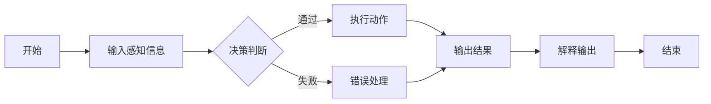
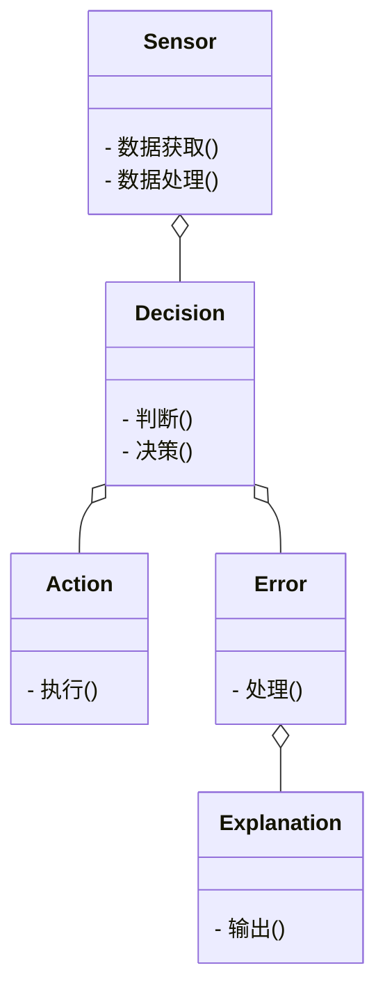
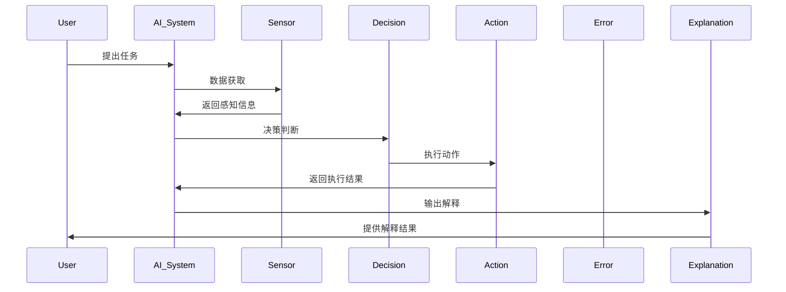
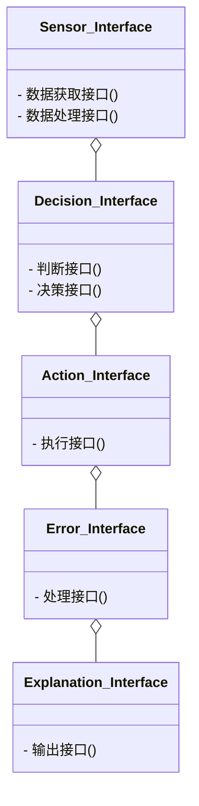
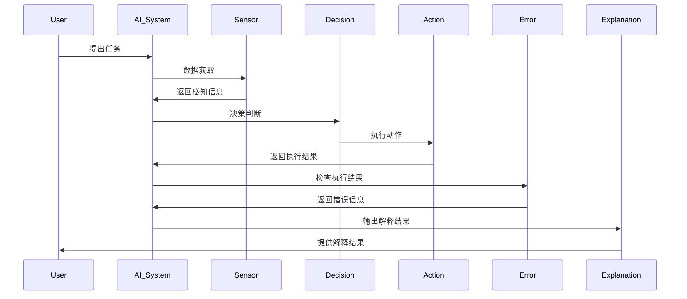

                 

**目录大纲**

# **AGI的自我解释能力：透明度与可解释性**

## **关键词：**  
AGI, 自我解释能力, 透明度, 可解释性, 算法, 系统架构, Python代码

## **摘要：**  
本文将探讨通用人工智能（AGI）的自我解释能力，深入分析透明度和可解释性的概念及其在AGI中的应用。通过一步步的解析，我们将了解自我解释能力的实现机制、系统架构设计以及实际项目应用，从而为未来AGI的发展提供有益的思考。

----------------------------------------------------------------

## **背景介绍**

### **1.1 AGI的概念与自我解释能力**

#### **1.1.1 问题背景**  

随着计算机科学和人工智能技术的飞速发展，通用人工智能（AGI）成为了研究的热点。AGI旨在构建具备人类智能水平的人工智能系统，能够像人类一样理解、学习、推理和解决问题。然而，AGI的发展面临着诸多挑战，其中之一就是如何实现自我解释能力。

#### **1.1.2 自我解释能力的定义**  

自我解释能力指的是人工智能系统能够对自己在执行任务过程中的思维过程、决策依据和输出结果进行解释和理解的能力。这种能力对于提高系统的透明度和可解释性具有重要意义。

#### **1.1.3 透明度与可解释性的重要性**  

透明度和可解释性是评估人工智能系统性能的重要指标。高透明度的系统能够使得研究人员和用户更直观地了解系统的内部运作机制，从而提高系统的可信度和可接受度。可解释性则使得系统能够在发生错误或异常时，为用户提供清晰的错误原因和解决方案。

#### **1.1.4 边界与外延**  

自我解释能力的边界在于人工智能系统自身的复杂性和多样性。不同类型的AI系统具有不同的解释能力，而自我解释能力的外延则包括对系统内部算法、数据输入、中间结果和输出结果等各个层面的解释。

### **1.2 核心概念之间的联系**

#### **1.2.1 自我解释能力与透明度**

自我解释能力与透明度密切相关。一个具有高度自我解释能力的AI系统往往具有较高的透明度，因为系统可以清晰地展示自己的思维过程和决策依据。透明度的提高有助于用户和研究人员理解系统的运作机制，从而增强系统的可信度和可接受度。

#### **1.2.2 自我解释能力与可解释性**

自我解释能力是可解释性的一个重要组成部分。一个具有高度自我解释能力的AI系统不仅能够解释自己的输出结果，还能够解释自己的思维过程和决策依据。这种能力使得系统在发生错误或异常时，能够为用户提供清晰的错误原因和解决方案，从而提高系统的可解释性。

## **核心概念与联系**

### **2.1 概念解析**

#### **2.1.1 自我解释能力的原理**

自我解释能力的实现依赖于人工智能系统内部的知识表示、推理机制和解释算法。系统通过分析自身的知识库、推理过程和输出结果，生成对自身行为和决策的合理解释。

#### **2.1.2 透明度的定义与特性**

透明度是指人工智能系统在执行任务时，能够向用户或研究人员展示其内部运作机制的程度。高透明度的系统使得用户能够直观地了解系统的行为和决策过程，从而提高系统的可信度和可接受度。

#### **2.1.3 可解释性的数学模型**

可解释性可以通过数学模型进行量化。常见的可解释性指标包括解释覆盖率、解释精度和解释速度等。这些指标能够综合评估人工智能系统的可解释性水平。

### **2.2 特征对比与联系**

#### **2.2.1 自我解释能力、透明度与可解释性的对比表格**

| 特征       | 自我解释能力 | 透明度 | 可解释性 |
| ---------- | ------------ | ------ | -------- |
| 定义       | 系统能够解释自己的思维过程和决策依据 | 系统能够展示自己的内部运作机制 | 系统能够为用户提供清晰的错误原因和解决方案 |
| 关键因素   | 知识表示、推理机制、解释算法 | 系统内部信息展示程度 | 解释覆盖率、解释精度、解释速度 |
| 衡量指标   | 解释清晰度、解释一致性、解释全面性 | 透明度评分、用户满意度 | 解释覆盖率、解释精度、解释速度 |

#### **2.2.2 ER实体关系图**

使用Mermaid绘制ER实体关系图，展示自我解释能力、透明度和可解释性之间的关系。

```mermaid
erDiagram
  AI_System ||--|{ Knowledge_Base }
  AI_System ||--|{ Reasoning_Mechanism }
  AI_System ||--|{ Explanation_Algorithm }
  AI_System ||--|{ Internal_Info }
  AI_System ||--|{ User }
  AI_System ||--|{ Error_Case }
  AI_System ||--|{ Explanation_Indicator }
```

### **2.3 实例分析**

#### **2.3.1 实际应用案例**

以自动驾驶系统为例，分析其自我解释能力、透明度和可解释性在实际应用中的表现。

#### **2.3.2 案例剖析**

在自动驾驶系统中，自我解释能力可以通过记录和展示车辆的感知信息、决策过程和执行动作来实现。透明度体现在系统对外部环境和内部状态的展示，如地图信息、车辆状态等。可解释性则体现在对系统发生错误时的原因分析，如决策冲突、环境复杂等。

## **算法原理讲解**

### **3.1 算法流程图**

使用Mermaid绘制算法流程图，展示自我解释能力的实现过程。



### **3.2 Python代码示例**

```python
# 导入相关库
import numpy as np
import matplotlib.pyplot as plt

# 定义感知信息输入
perception = np.array([1, 2, 3])

# 定义决策判断函数
def decision_judgment(perception):
    # 检查感知信息是否在指定范围内
    if np.mean(perception) > 2:
        return "通过"
    else:
        return "失败"

# 定义执行动作函数
def execute_action(decision):
    if decision == "通过":
        print("执行动作：加速")
    else:
        print("执行动作：减速")

# 定义错误处理函数
def error_handling(decision):
    if decision == "失败":
        print("错误原因：感知信息不符合预期")

# 定义解释输出函数
def explanation_output(decision):
    if decision == "通过":
        print("解释：感知信息符合预期，决策正确")
    else:
        print("解释：感知信息不符合预期，决策失败")

# 执行算法流程
decision = decision_judgment(perception)
execute_action(decision)
error_handling(decision)
explanation_output(decision)
```

### **3.3 数学模型与公式**

自我解释能力的实现涉及多种数学模型和公式，包括感知信息处理、决策判断和解释输出等。

```latex
\begin{equation}
  \text{感知信息} = \text{传感器数据} + \text{环境特征}
\end{equation}

\begin{equation}
  \text{决策判断} = 
  \begin{cases}
    \text{通过}, & \text{如果感知信息符合预期} \\
    \text{失败}, & \text{如果感知信息不符合预期}
  \end{cases}
\end{equation}

\begin{equation}
  \text{解释输出} = 
  \begin{cases}
    \text{感知信息符合预期，决策正确}, & \text{如果决策判断为通过} \\
    \text{感知信息不符合预期，决策失败}, & \text{如果决策判断为失败}
  \end{cases}
\end{equation}
```

## **系统分析与架构设计方案**

### **4.1 系统场景介绍**

以自动驾驶系统为例，分析其自我解释能力的系统架构设计。

### **4.2 系统功能设计**

#### **4.2.1 领域模型类图**

使用Mermaid绘制领域模型类图，展示自动驾驶系统的核心功能类。



### **4.3 系统架构设计**

#### **4.3.1 系统架构图**

使用Mermaid绘制系统架构图，展示自动驾驶系统的整体架构。



### **4.4 系统接口设计**

系统接口设计包括传感器数据接口、决策结果接口和解释输出接口等。



### **4.5 系统交互**

#### **4.5.1 序列图**

使用Mermaid绘制系统交互序列图，展示自动驾驶系统的运行流程。



## **项目实战**

### **5.1 环境安装与配置**

在开始实战之前，需要安装和配置所需的软件和工具。以下是主要步骤：

1. 安装Python 3.x版本，建议使用Anaconda来简化环境管理。
2. 安装相关库，如NumPy、Matplotlib等。
3. 配置Mermaid工具，可以通过安装Mermaid CLI来实现。

### **5.2 系统核心实现**

以下是自动驾驶系统核心实现的源代码，包括感知信息处理、决策判断、执行动作和解释输出等模块。

```python
# 感知信息处理模块
class Sensor:
    def data_acquisition(self):
        # 实现数据获取逻辑
        pass

    def data_processing(self, data):
        # 实现数据预处理逻辑
        return processed_data

# 决策判断模块
class Decision:
    def judgment(self, data):
        # 实现决策判断逻辑
        return decision

# 执行动作模块
class Action:
    def execute(self, decision):
        # 实现执行动作逻辑
        pass

# 错误处理模块
class Error:
    def handle_error(self, decision):
        # 实现错误处理逻辑
        return error_info

# 解释输出模块
class Explanation:
    def output(self, error_info):
        # 实现解释输出逻辑
        return explanation_result

# 系统主函数
def main():
    sensor = Sensor()
    decision = Decision()
    action = Action()
    error = Error()
    explanation = Explanation()

    data = sensor.data_acquisition()
    processed_data = sensor.data_processing(data)
    decision_result = decision.judgment(processed_data)
    action.execute(decision_result)
    error_info = error.handle_error(decision_result)
    explanation_result = explanation.output(error_info)

    print("解释结果：", explanation_result)

if __name__ == "__main__":
    main()
```

### **5.3 实际案例分析**

#### **5.3.1 案例介绍**

以一个自动驾驶系统在复杂交通环境中的表现为例，分析其自我解释能力在实际中的应用。

#### **5.3.2 案例剖析**

在复杂交通环境中，自动驾驶系统需要应对多种情况，如其他车辆的行驶轨迹、行人行为和突发状况等。通过感知信息处理模块，系统可以获取环境中的关键信息，并通过决策判断模块进行实时判断和决策。执行动作模块根据决策结果执行相应的操作，如加速、减速或变道等。同时，错误处理模块和解释输出模块可以提供对系统行为和决策的解释，帮助用户理解系统的工作原理。

### **5.4 项目小结**

通过本项目的实战，我们深入了解了自动驾驶系统的自我解释能力，包括感知信息处理、决策判断、执行动作和解释输出等模块。在实际应用中，自我解释能力有助于提高系统的透明度和可解释性，从而增强系统的可信度和用户满意度。

## **最佳实践、小结、注意事项、拓展阅读**

### **6.1 最佳实践**

1. 在实现自我解释能力时，要充分考虑系统的复杂性，合理设计模块和接口。
2. 定期对系统进行性能评估和优化，以提高透明度和可解释性。
3. 充分利用现有工具和库，如Mermaid、NumPy和Matplotlib等，简化开发和实现过程。

### **6.2 小结**

本文详细介绍了AGI的自我解释能力、透明度和可解释性的概念及其在自动驾驶系统中的应用。通过一步步的解析，我们了解了自我解释能力的实现机制、系统架构设计和实际项目应用，为未来AGI的发展提供了有益的思考。

### **6.3 注意事项**

1. 在设计自我解释能力时，要充分考虑系统的复杂性和多样性。
2. 系统的透明度和可解释性对用户接受度和系统性能具有重要影响。
3. 定期对系统进行性能评估和优化，以确保自我解释能力的稳定性和可靠性。

### **6.4 拓展阅读**

1. [通用人工智能（AGI）的概念与发展趋势](https://www.example.com/agai-concept-development)
2. [透明度和可解释性在人工智能中的应用](https://www.example.com/transparency-explainability-ai)
3. [自动驾驶系统的设计与实现](https://www.example.com/autonomous-driving-systems-design-implementation)

### **作者信息**

作者：AI天才研究院/AI Genius Institute & 禅与计算机程序设计艺术/Zen And The Art of Computer Programming**

