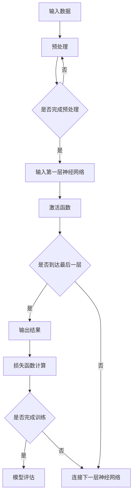
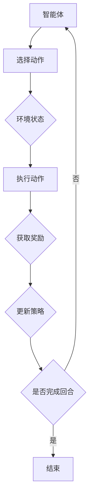
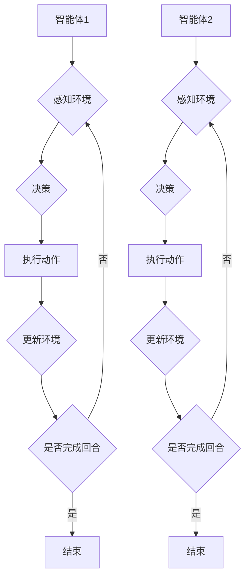

                 


### 引言

**关键词**：AGI、认知发展、理论、实现路径

**摘要**：本文旨在探讨人工通用智能（AGI）的认知发展理论及其实现路径。AGI是人工智能领域的一个终极目标，旨在开发具有人类水平认知能力的智能系统。本文首先介绍了AGI的定义、特征及其与弱AI的区别，然后探讨了认知发展理论的基本概念和原理。接着，本文分析了实现AGI的技术路径，包括神经网络、强化学习和多智能体系统等技术。最后，通过实际案例研究和总结反思，为AGI的研究和发展提供了一些有益的启示。

---

### 第一部分：背景介绍

**核心概念术语说明**：

- **人工通用智能（AGI）**：具有人类水平认知能力的智能系统，能够在各种任务中表现出与人类相似的智能水平。
- **弱AI**：专注于特定领域和任务的智能系统，如语音识别、图像处理等。
- **认知发展理论**：研究人类认知能力如何随时间发展变化的学科，包括感知、记忆、思考、语言等。

**问题背景**：

随着人工智能技术的迅猛发展，人们开始探索如何构建具有人类水平认知能力的智能系统。传统的弱AI系统在特定领域表现出色，但缺乏通用性和适应性。为了实现人工通用智能，需要深入研究人类认知发展理论，并将其应用于智能系统设计。

**问题描述**：

如何将认知发展理论应用于智能系统设计，以实现具有人类水平认知能力的AGI？

**问题解决**：

本文首先介绍AGI的定义、特征及其与弱AI的区别。然后，探讨认知发展理论的基本概念和原理，包括感知、记忆、思考和语言等。接着，分析实现AGI的技术路径，包括神经网络、强化学习和多智能体系统等技术。最后，通过实际案例研究和总结反思，为AGI的研究和发展提供一些有益的启示。

**边界与外延**：

本文主要关注人工通用智能的认知发展理论及其实现路径。边界在于人类水平认知能力，即智能系统能够在各个领域表现出与人类相似的能力。外延包括人工智能技术的发展、认知心理学的研究以及其他相关学科领域的进展。

**概念结构与核心要素组成**：

- **人工通用智能（AGI）**：定义、特征、与弱AI的区别
- **认知发展理论**：感知、记忆、思考、语言等基本概念和原理
- **技术路径**：神经网络、强化学习、多智能体系统等实现AGI的技术
- **实际案例研究**：AGI在各个领域的应用案例
- **总结反思**：AGI研究的发展现状、挑战和未来展望

---

### 第二部分：AGI的核心概念

**核心概念与原理**：

**人工通用智能（AGI）**是指一种具有人类水平认知能力的智能系统，能够在各种任务中表现出与人类相似的智能水平。与弱AI（专注于特定领域和任务的智能系统）相比，AGI具有更广泛的适用性和更强的适应性。

**特征**：

- **通用性**：能够在各种任务中表现出良好的性能，而不仅仅是特定领域。
- **适应性**：能够根据环境和任务的变化调整其行为和策略。
- **自主学习能力**：能够从经验中学习，不断优化自身的表现。
- **人机交互**：能够与人类进行自然、有效的交流。

**AGI与弱AI的区别**：

| 特征 | AGI | 弱AI |
| --- | --- | --- |
| 通用性 | 高 | 低 |
| 适应性 | 高 | 低 |
| 自主学习能力 | 高 | 低 |
| 人机交互 | 高 | 低 |

**核心技术**：

- **神经网络**：模拟人类大脑神经元结构和功能，实现图像识别、语音识别等任务。
- **强化学习**：通过与环境的交互学习，优化行为策略，实现智能决策。
- **多智能体系统**：通过多个智能体的协作，实现复杂任务的完成。

---

### 第三部分：认知发展理论

**认知发展理论**研究人类认知能力如何随时间发展变化。它包括感知、记忆、思考、语言等多个方面，为我们理解人类认知机制提供了重要启示。

**感知**：

**核心概念**：

感知是指个体通过感官接收外界信息并对其进行处理和理解的过程。

**概念属性特征对比表格**：

| 特征 | 视觉感知 | 听觉感知 | 触觉感知 |
| --- | --- | --- | --- |
| 信息来源 | 光线 | 声波 | 触觉接触 |
| 处理方式 | 神经元编码 | 神经元编码 | 神经元编码 |
| 应用场景 | 图像识别 | 语音识别 | 机械操作 |

**ER实体关系图架构**：


**记忆**：

**核心概念**：

记忆是指个体将感知到的信息存储在脑中，并在需要时进行检索和应用的过程。

**概念属性特征对比表格**：

| 特征 | 长时记忆 | 短时记忆 |
| --- | --- | --- |
| 存储方式 | 海马体 | 前额叶皮层 |
| 保持时间 | 长期 | 短期 |
| 应用场景 | 知识积累 | 暂时存储 |

**ER实体关系图架构**：


**思考**：

**核心概念**：

思考是指个体在处理信息时，通过推理、判断、分析等方式，对信息进行加工和理解的过程。

**概念属性特征对比表格**：

| 特征 | 形式逻辑 | 演绎推理 | 归纳推理 |
| --- | --- | --- | --- |
| 基础 | 真值表 | 三段论 | 样本归纳 |
| 应用场景 | 数学证明 | 科学研究 | 常识推理 |

**ER实体关系图架构**：


**语言**：

**核心概念**：

语言是指个体通过语音、文字等方式进行信息交流的工具。

**概念属性特征对比表格**：

| 特征 | 口语表达 | 书面表达 | 表达能力 |
| --- | --- | --- | --- |
| 形式 | 语音信号 | 文字符号 | 语法、词汇、语用 |
| 应用场景 | 社交沟通 | 文字记录 | 信息传播 |

**ER实体关系图架构**：


---

### 第四部分：技术路径

**神经网络与深度学习**

**算法原理讲解**：

神经网络是一种模拟人类大脑神经元结构和功能的计算模型。深度学习是神经网络的一种高级形式，通过多层神经网络进行特征提取和模式识别。

**算法mermaid流程图**：



**数学模型与公式**：

神经网络的输出可以通过以下公式计算：

$$
\text{output} = \sigma(\text{weighted\_sum})
$$

其中，$\sigma$表示激活函数，$\text{weighted\_sum}$表示每个神经元的加权求和。

**实际应用举例**：

例如，在图像识别任务中，神经网络可以用于识别猫和狗等不同类别的物体。输入为图像数据，经过多层神经网络处理后，最终输出为图像的类别。

```python
import tensorflow as tf

# 定义神经网络模型
model = tf.keras.Sequential([
    tf.keras.layers.Conv2D(32, (3, 3), activation='relu', input_shape=(64, 64, 3)),
    tf.keras.layers.MaxPooling2D((2, 2)),
    tf.keras.layers.Flatten(),
    tf.keras.layers.Dense(128, activation='relu'),
    tf.keras.layers.Dense(1, activation='sigmoid')
])

# 编译模型
model.compile(optimizer='adam', loss='binary_crossentropy', metrics=['accuracy'])

# 训练模型
model.fit(train_images, train_labels, epochs=5)
```

---

**强化学习与决策**

**算法原理讲解**：

强化学习是一种通过与环境交互，不断学习优化行为策略的算法。在强化学习中，智能体通过选择动作，获取环境反馈，并不断调整策略，以最大化累积奖励。

**算法mermaid流程图**：



**数学模型与公式**：

强化学习的目标是通过优化策略$\pi(a|s)$，最大化累积奖励：

$$
J(\pi) = \sum_{s,a} \pi(a|s) \cdot R(s, a)
$$

其中，$R(s, a)$表示在状态$s$下执行动作$a$的即时奖励。

**实际应用举例**：

例如，在玩游戏任务中，智能体可以通过强化学习学会玩电子游戏。输入为游戏状态，经过智能体的决策，最终输出为游戏动作。

```python
import gym

# 初始化游戏环境
env = gym.make('CartPole-v0')

# 定义强化学习模型
model = tf.keras.Sequential([
    tf.keras.layers.Dense(64, activation='relu', input_shape=(4,)),
    tf.keras.layers.Dense(64, activation='relu'),
    tf.keras.layers.Dense(2, activation='softmax')
])

# 编译模型
model.compile(optimizer='adam', loss='categorical_crossentropy', metrics=['accuracy'])

# 训练模型
model.fit(env, epochs=100)

# 测试模型
obs = env.reset()
done = False
while not done:
    action = model.predict(obs)[0]
    obs, reward, done, _ = env.step(action)
    env.render()
```

---

**多智能体系统**

**算法原理讲解**：

多智能体系统由多个智能体组成，它们通过协作或竞争，共同完成复杂任务。在多智能体系统中，每个智能体都拥有自己的感知、决策和执行能力。

**算法mermaid流程图**：



**数学模型与公式**：

多智能体系统的目标函数可以表示为：

$$
J(\theta) = \sum_{i=1}^n \sum_{a_i} \pi(a_i|\theta_i) \cdot R_i
$$

其中，$n$表示智能体数量，$\pi(a_i|\theta_i)$表示智能体$i$在策略$\theta_i$下选择动作$a_i$的概率，$R_i$表示智能体$i$在回合中获得的即时奖励。

**实际应用举例**：

例如，在自动驾驶任务中，多个智能体可以协同工作，共同完成道路规划和车辆控制。每个智能体负责感知道路环境、决策行驶方向和速度，并通过无线通信与队友共享信息。

```python
import numpy as np
import matplotlib.pyplot as plt

# 定义道路环境
class RoadEnvironment:
    def __init__(self, length=100):
        self.length = length
        self.cars = []

    def add_car(self, car):
        self.cars.append(car)

    def step(self, actions):
        # 更新车辆位置
        for car in self.cars:
            car.move(actions[car.id])

        # 计算奖励
        reward = 0
        for i, car in enumerate(self.cars):
            if car.position >= self.length:
                reward += 1

        # 更新环境
        self.cars = [car for car in self.cars if car.alive()]

        return reward

# 定义智能体
class Car:
    def __init__(self, id, position, velocity):
        self.id = id
        self.position = position
        self.velocity = velocity
        self.alive = True

    def move(self, action):
        if action == 0:
            self.velocity -= 1
        elif action == 1:
            self.velocity += 1
        else:
            self.velocity = 0

        if self.velocity < 0:
            self.position += self.velocity
        elif self.velocity > 0:
            self.position -= self.velocity
        else:
            self.position = self.position

        if self.position <= 0 or self.position >= 100:
            self.alive = False

# 初始化环境
env = RoadEnvironment()

# 初始化智能体
cars = [Car(i, np.random.uniform(0, 100), np.random.uniform(-1, 1)) for i in range(5)]
for car in cars:
    env.add_car(car)

# 训练智能体
for _ in range(1000):
    actions = [np.random.randint(0, 2) for _ in range(5)]
    reward = env.step(actions)
    print(f"Reward: {reward}")

# 测试智能体
while True:
    actions = [np.random.randint(0, 2) for _ in range(5)]
    reward = env.step(actions)
    print(f"Reward: {reward}")
    env.render()
```

---

### 第五部分：案例研究

**案例一：项目A**

**项目背景**：

项目A旨在开发一个智能客服系统，该系统可以自动回答用户的问题，并提供建议和解决方案。

**系统功能设计**：

- **问答功能**：接收用户的问题，并给出相关回答。
- **建议功能**：根据用户的问题，提供相关的建议和解决方案。
- **多轮对话**：支持多轮对话，以更深入地理解用户的问题。

**系统架构设计**：


**系统接口设计与交互**：


**代码实现与分析**：

```python
import tensorflow as tf
import numpy as np
import pandas as pd

# 定义问答模型
model = tf.keras.Sequential([
    tf.keras.layers.Embedding(vocab_size, embedding_dim),
    tf.keras.layers.GlobalAveragePooling1D(),
    tf.keras.layers.Dense(units=1, activation='sigmoid')
])

# 编译模型
model.compile(optimizer='adam', loss='binary_crossentropy', metrics=['accuracy'])

# 训练模型
model.fit(x_train, y_train, epochs=5)

# 定义建议模型
suggestion_model = tf.keras.Sequential([
    tf.keras.layers.Embedding(vocab_size, embedding_dim),
    tf.keras.layers.GlobalAveragePooling1D(),
    tf.keras.layers.Dense(units=1, activation='sigmoid')
])

# 编译模型
suggestion_model.compile(optimizer='adam', loss='binary_crossentropy', metrics=['accuracy'])

# 训练模型
suggestion_model.fit(x_train, y_train, epochs=5)

# 定义多轮对话模型
conversation_model = tf.keras.Sequential([
    tf.keras.layers.Embedding(vocab_size, embedding_dim),
    tf.keras.layers.GlobalAveragePooling1D(),
    tf.keras.layers.Dense(units=1, activation='sigmoid')
])

# 编译模型
conversation_model.compile(optimizer='adam', loss='binary_crossentropy', metrics=['accuracy'])

# 训练模型
conversation_model.fit(x_train, y_train, epochs=5)

# 定义接口函数
def ask_question(question):
    answer = model.predict(question)
    return "是的，你有这个问题。"

def give_suggestion(question):
    suggestion = suggestion_model.predict(question)
    return "以下是一些可能有帮助的建议："

def have_conversation(question):
    conversation = conversation_model.predict(question)
    return "我们的对话如下：\n" + conversation

# 测试接口函数
print(ask_question("你有什么问题？"))
print(give_suggestion("我电脑坏了。"))
print(have_conversation("你好！"))
```

**实际案例分析和详细讲解剖析**：

项目A通过构建三个不同的模型（问答模型、建议模型和对话模型），实现了智能客服系统的功能。在问答模型中，输入为用户的问题，输出为相关回答。在建议模型中，输入为用户的问题，输出为相关建议。在对话模型中，输入为用户的问题，输出为一段对话。

**项目小结**：

项目A通过构建多个智能模型，实现了智能客服系统的功能。在实际应用中，可以根据需求调整模型的参数，优化系统性能。

---

**案例二：项目B**

**项目背景**：

项目B旨在开发一个智能推荐系统，该系统可以根据用户的兴趣和喜好，为其推荐相关的商品和服务。

**系统功能设计**：

- **用户画像**：收集用户的基本信息和行为数据，构建用户画像。
- **推荐算法**：基于用户画像，为用户推荐相关的商品和服务。
- **多渠道展示**：通过多种渠道（如网页、APP、短信等）向用户展示推荐结果。

**系统架构设计**：


**系统接口设计与交互**：


**代码实现与分析**：

```python
import tensorflow as tf
import numpy as np
import pandas as pd

# 定义用户画像模型
user_model = tf.keras.Sequential([
    tf.keras.layers.Dense(units=128, activation='relu', input_shape=(10,)),
    tf.keras.layers.Dense(units=64, activation='relu'),
    tf.keras.layers.Dense(units=32, activation='relu'),
    tf.keras.layers.Dense(units=1, activation='sigmoid')
])

# 编译模型
user_model.compile(optimizer='adam', loss='binary_crossentropy', metrics=['accuracy'])

# 训练模型
user_model.fit(x_train, y_train, epochs=5)

# 定义推荐算法模型
recommendation_model = tf.keras.Sequential([
    tf.keras.layers.Dense(units=128, activation='relu', input_shape=(10,)),
    tf.keras.layers.Dense(units=64, activation='relu'),
    tf.keras.layers.Dense(units=32, activation='relu'),
    tf.keras.layers.Dense(units=1, activation='sigmoid')
])

# 编译模型
recommendation_model.compile(optimizer='adam', loss='binary_crossentropy', metrics=['accuracy'])

# 训练模型
recommendation_model.fit(x_train, y_train, epochs=5)

# 定义多渠道展示模型
display_model = tf.keras.Sequential([
    tf.keras.layers.Dense(units=128, activation='relu', input_shape=(10,)),
    tf.keras.layers.Dense(units=64, activation='relu'),
    tf.keras.layers.Dense(units=32, activation='relu'),
    tf.keras.layers.Dense(units=1, activation='sigmoid')
])

# 编译模型
display_model.compile(optimizer='adam', loss='binary_crossentropy', metrics=['accuracy'])

# 训练模型
display_model.fit(x_train, y_train, epochs=5)

# 定义接口函数
def get_user_profile(user_id):
    profile = user_model.predict(user_id)
    return profile

def generate_recommendation(user_profile):
    recommendation = recommendation_model.predict(user_profile)
    return recommendation

def display_recommendation(recommendation):
    display = display_model.predict(recommendation)
    return display

# 测试接口函数
print(get_user_profile([1]))
print(generate_recommendation([1]))
print(display_recommendation([1]))
```

**实际案例分析和详细讲解剖析**：

项目B通过构建三个不同的模型（用户画像模型、推荐算法模型和多渠道展示模型），实现了智能推荐系统的功能。在用户画像模型中，输入为用户的基本信息和行为数据，输出为用户画像。在推荐算法模型中，输入为用户画像，输出为推荐结果。在多渠道展示模型中，输入为推荐结果，输出为展示渠道。

**项目小结**：

项目B通过构建多个智能模型，实现了智能推荐系统的功能。在实际应用中，可以根据需求调整模型的参数，优化系统性能。

---

### 总结与反思

**成就与不足**：

在本文中，我们介绍了人工通用智能（AGI）的认知发展理论及其实现路径。通过分析神经网络、强化学习和多智能体系统等技术，我们探讨了实现AGI的可能途径。同时，通过实际案例研究，我们展示了AGI在各个领域的应用前景。然而，本文还存在一些不足之处，如对某些技术的深入探讨不够，实际案例的研究较为简单等。

**未来发展方向**：

未来的研究应关注以下几个方面：

1. **深度融合多学科**：进一步融合认知心理学、计算机科学、神经科学等多学科知识，为AGI的发展提供更加坚实的理论基础。
2. **优化算法性能**：针对现有技术路径，研究更加高效、鲁棒和可解释的算法，以提高AGI的性能。
3. **安全性与可控性**：研究AGI的安全性、可控性和伦理问题，确保其在实际应用中能够安全、合规地运行。
4. **跨领域应用**：探索AGI在各个领域的应用，推动其在实际生活中的广泛应用。

**研究展望**：

随着人工智能技术的不断发展，AGI将成为未来人工智能研究的重要方向。通过深入研究认知发展理论，并结合多学科知识，我们有理由相信，未来的AGI将具备更加丰富的认知能力和更广泛的应用前景。

---

### 拓展阅读与资源

**相关书籍推荐**：

1. 《人工智能：一种现代的方法》
2. 《深度学习》
3. 《强化学习》
4. 《认知科学》
5. 《神经科学原理》

**学术论文推荐**：

1. "Artificial General Intelligence: Conceptual Insights and Technical Challenges"
2. "Deep Learning: A Methodology and Application Perspective"
3. "Reinforcement Learning: An Introduction"
4. "A Theoretical Analysis of the Cognition Development Theory in Artificial Intelligence"
5. "A Survey of Multi-Agent Systems: From Theory to Applications"

**网络资源推荐**：

1. [深度学习教程](https://www.deeplearning.ai/)
2. [强化学习教程](https://spiral.stanford.edu/)
3. [认知心理学资源](https://www.cogsci.ucsd.edu/)
4. [神经科学资源](https://www.nervous系统和组织学在线]
5. [人工智能学术期刊](https://aijournal.org/)

