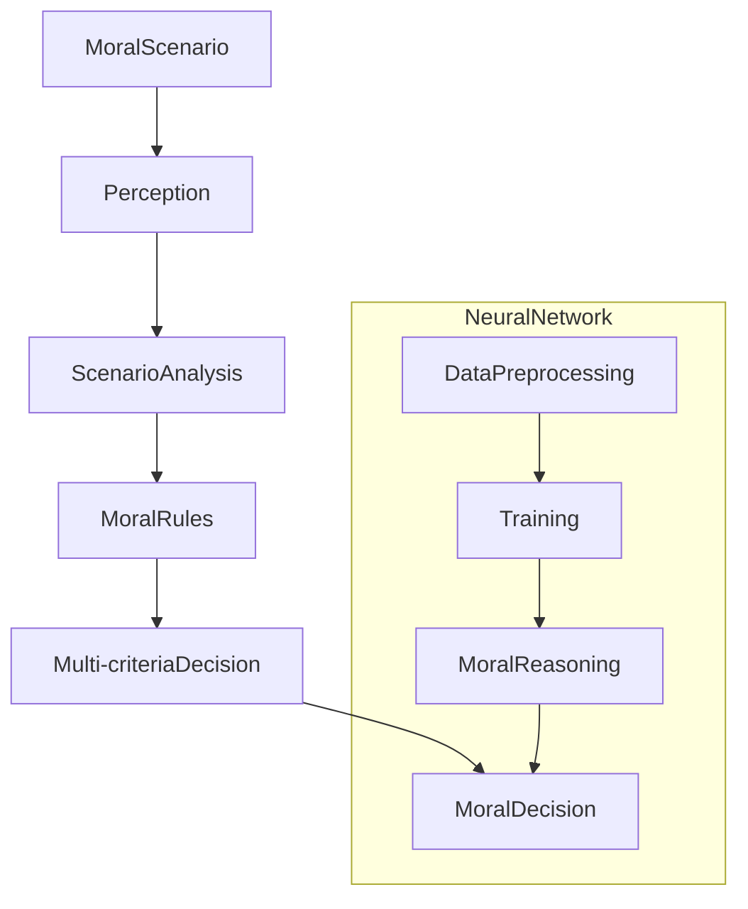
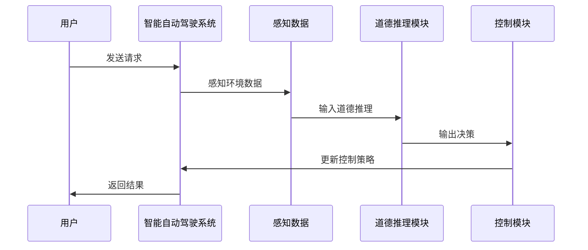
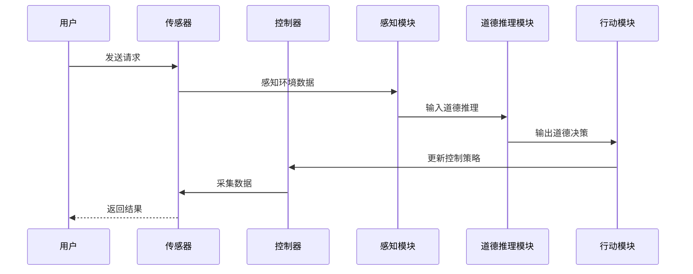

                 

### 引言：人工智能与通用人工智能的关系

人工智能（Artificial Intelligence，简称AI）作为计算机科学的一个重要分支，旨在通过构建智能代理（intelligent agents）来模拟、扩展或替代人类智能。自1950年代以来，AI领域经历了多次发展浪潮，从符号主义（Symbolic AI）到基于数据的机器学习（Machine Learning），再到如今的深度学习（Deep Learning）和强化学习（Reinforcement Learning），AI技术不断取得突破。然而，尽管AI技术在某些特定领域表现出色，如图像识别、语音识别和自然语言处理，但总体上，当前的AI系统仍然局限于特定任务，缺乏广泛的通用性。

通用人工智能（Artificial General Intelligence，简称AGI）是一个长期的研究目标，它旨在开发出具备与人类智能相媲美或超越的智能体。与当前的任务导向型AI不同，AGI将能够理解、学习、推理和解决问题的方式类似于人类，从而具有广泛的通用性和适应性。AGI的目标不仅仅是完成特定任务，而是能够在各种环境中自主学习和适应。

道德推理是AGI的一个重要组成部分，因为在一个复杂和动态的社会环境中，智能体需要能够做出合理的道德决策。道德推理不仅仅涉及道德规则的遵循，还包括对道德情境的感知、理解和评价。AGI的道德推理能力是实现其社会价值和人类价值观一致性的关键。

当前，AGI的道德推理面临诸多挑战。首先，道德问题的复杂性和多样性使得构建一个通用的道德推理框架变得极为困难。不同的文化、宗教和伦理观念可能导致对同一道德问题的不同看法。其次，道德推理需要智能体具备情感、价值观和人类情感体验的理解，而当前的AI系统在这些方面仍然有限。最后，如何确保AGI的道德推理是可靠和可信的，避免出现道德错误或被恶意利用，也是需要解决的问题。

本篇文章将深入探讨AGI的道德推理框架构建，通过逐步分析核心概念、算法原理和数学模型，旨在为解决这些挑战提供一些思路和方法。

### 问题描述：当前AGI道德推理面临的主要挑战和问题

在探讨AGI的道德推理框架构建之前，我们首先需要明确当前AGI道德推理所面临的主要挑战和问题。以下是几个关键问题：

**1. 道德情境的多样性和复杂性**

道德情境的多样性和复杂性是AGI道德推理的一个重要挑战。现实世界的道德问题往往不是黑白分明的，而是存在诸多灰色地带。不同的文化、宗教和伦理观念可能导致对同一道德问题的不同看法。例如，关于生命价值的判断，某些文化可能重视个体的生命权，而另一些文化可能更强调集体的利益。这种情境的多样性使得构建一个通用的道德推理框架变得极为困难。

**2. 道德推理的情感和价值观理解**

道德推理不仅仅是逻辑判断，它还需要智能体具备情感和价值观的理解。然而，当前的AI系统在情感和价值观方面仍然有限。虽然一些研究尝试通过情感计算和情感识别来增强AI的情感理解能力，但如何使AI真正具备人类情感和价值观，仍然是需要深入探讨的问题。

**3. 道德推理的可靠性和可信性**

确保AGI的道德推理是可靠和可信的，是一个重要的挑战。即使我们能够构建一个理论上的道德推理框架，如何验证其是否能够正确处理所有可能的道德情境，仍然是一个难题。此外，如何避免AGI在道德推理中受到恶意输入或被恶意利用，也是一个需要解决的问题。

**4. 道德规则的学习和适应**

道德推理需要智能体具备从大量数据中学习道德规则的能力。然而，道德规则的学习和适应涉及到大量的伦理和道德知识，这些知识往往不是显式编码的，而是隐含在文化、传统和社会规范中。如何有效地从这些隐含的规则中学习，是一个技术难题。

**5. 多元化的伦理和道德观念**

不同的文化、宗教和伦理观念可能导致对同一道德问题的不同看法。如何在一个AGI系统中同时考虑和平衡这些多元化的伦理和道德观念，是一个复杂的挑战。

综上所述，AGI的道德推理面临诸多挑战和问题。为了构建一个有效的道德推理框架，我们需要深入理解这些问题的本质，并探索可行的解决方案。

### 问题解决：本书旨在解决的问题和提供的方法

为了解决AGI道德推理所面临的挑战，本书旨在解决以下几个核心问题，并提供相应的解决方法：

**1. 如何处理道德情境的多样性和复杂性？**

为了处理道德情境的多样性和复杂性，我们需要构建一个能够灵活适应不同情境的道德推理框架。这一框架应包括多种道德规则和原则，并且能够根据具体情境进行动态调整。此外，引入情境感知机制，使得AGI能够更好地理解和评估当前情境，从而做出更合理的道德决策。

**2. 如何增强AI的情感和价值观理解？**

增强AI的情感和价值观理解是道德推理的重要基础。我们可以通过以下方法来实现：

- **情感计算**：利用情感计算技术，让AI能够识别和模拟人类的情感状态。
- **价值观编码**：将人类的价值观通过显式或隐式的方式编码到AI系统中，使其能够更好地理解和应用这些价值观。
- **跨学科研究**：结合心理学、哲学和社会学等多学科知识，深化对人类情感和价值观的理解。

**3. 如何确保道德推理的可靠性和可信性？**

确保道德推理的可靠性和可信性，需要从以下几个方面入手：

- **多层次的验证**：通过设计多层次的验证机制，对道德推理结果进行交叉验证，确保其准确性。
- **透明度和可解释性**：提高AI道德推理过程的透明度和可解释性，使得人类用户能够理解和信任AI的决策。
- **预防措施**：设计预防措施，防止AI因恶意输入或被恶意利用而导致不道德的行为。

**4. 如何从大量数据中学习道德规则？**

学习道德规则是道德推理的关键。以下方法可以帮助从大量数据中学习道德规则：

- **数据驱动的方法**：利用机器学习和深度学习技术，从大量数据中挖掘和提取道德规则。
- **知识图谱**：构建知识图谱，将道德规则以显式的方式组织起来，便于智能体学习和引用。
- **案例学习**：通过分析历史案例，从成功和失败的道德决策中学习，不断优化道德推理框架。

**5. 如何平衡多元化的伦理和道德观念？**

平衡多元化的伦理和道德观念，需要采取以下策略：

- **伦理委员会**：建立跨学科的伦理委员会，对不同的伦理和道德观念进行平衡和协调。
- **情境敏感的决策**：在决策过程中，考虑多种伦理和道德观念，并根据具体情境进行权衡和选择。
- **开放性讨论**：鼓励社会各界对道德问题进行开放性讨论，形成共识，指导道德推理框架的设计。

通过解决上述问题，本书旨在构建一个具有高度适应性、可靠性和可信性的AGI道德推理框架，为未来的智能系统提供道德决策的指南。

### 边界与外延：AGI道德推理的范围及其与其他领域的关系

在讨论AGI的道德推理时，明确其范围和边界是至关重要的。AGI道德推理不仅涉及到技术层面，还涉及伦理、哲学和社会科学等多个领域。以下是对AGI道德推理范围的详细描述及其与其他领域的交叉关系：

**1. 技术层面**

在技术层面，AGI道德推理主要关注如何将道德原则和规则嵌入到智能系统中，使其能够在复杂和动态的环境中做出合理的道德决策。这包括算法设计、数据驱动方法、机器学习和自然语言处理等技术。例如，通过深度学习模型，可以训练AGI识别和评估不同的道德情境，并生成相应的道德决策。

**2. 伦理层面**

伦理层面关注道德原则和价值观的确定及其在AGI中的应用。这涉及到伦理学的基本问题，如道德义务、责任、权利和公正。不同的伦理理论（如功利主义、康德伦理学、义务论等）为道德推理提供了不同的指导原则。将这些理论应用于AGI，可以帮助构建一个具有伦理一致性的道德推理框架。

**3. 哲学层面**

哲学层面主要探讨道德推理的哲学基础，包括知识论、认识论和形而上学。哲学思考有助于我们理解道德推理的本质和限制，从而更好地设计道德推理算法。例如，哲学家们对自由意志和道德责任的探讨，可以指导我们如何构建能够理解和尊重人类自由意志的AGI。

**4. 社会科学层面**

社会科学领域提供了对人类社会行为和决策的深刻洞察。心理学、社会学和经济学等学科的研究成果，可以帮助我们理解人类道德行为的动机和影响，从而为AGI道德推理提供更丰富的背景知识。此外，社会科学还关注道德推理在社会互动和决策过程中的作用，这对于设计能够适应社会环境的AGI尤为重要。

**5. 与其他领域的交叉关系**

AGI道德推理不仅涉及单一领域，还与其他领域密切相关：

- **技术与伦理**：技术层面的道德推理需要伦理学指导，以确保AI系统的决策符合道德规范。例如，在开发自动驾驶汽车时，需要考虑如何处理行人安全与交通效率之间的冲突。
- **技术与哲学**：哲学为道德推理提供了理论框架，指导技术实现。例如，在构建医疗决策支持系统时，需要考虑哲学上的伦理原则，如患者自主权。
- **技术与社会科学**：社会科学提供了现实世界的情境和背景，使道德推理更加贴近实际。例如，在开发智能监控系统时，需要考虑社会对隐私和安全的关注。

综上所述，AGI道德推理是一个跨学科的研究领域，其范围涵盖了技术、伦理、哲学和社会科学等多个方面。明确这些边界和关系，有助于我们更好地理解AGI道德推理的本质，并为其设计提供全面的指导。

### 概念结构与核心要素组成

构建AGI的道德推理框架，需要理解其核心概念及其相互关系。以下是几个关键概念的定义和它们之间的联系：

**1. 通用人工智能（AGI）**

通用人工智能（Artificial General Intelligence，AGI）是指具备与人类智能相媲美或超越的智能体，能够在各种环境和任务中表现出高度的自适应和创新能力。AGI需要具备理解、学习、推理和解决问题的能力，类似于人类智能的广泛性和复杂性。

**2. 道德推理**

道德推理是指智能体在道德情境中，通过感知、理解和评价，做出合理道德决策的过程。道德推理不仅包括对道德规则的遵循，还涉及对道德情境的感知、理解和评价。道德推理的核心是道德原则和价值观，这些原则和价值观决定了智能体在特定情境中的行为选择。

**3. 道德原则**

道德原则是指用于指导道德推理的基本规则和规范。不同的文化、宗教和伦理观念可能产生不同的道德原则。常见的道德原则包括功利主义、康德伦理学、义务论等。这些原则提供了道德推理的基本框架，帮助智能体在不同情境中做出合理决策。

**4. 道德情境**

道德情境是指智能体在执行任务或与环境交互时，面临的具有道德意义的情境。道德情境通常涉及复杂的道德冲突和伦理问题，如生命价值、公正、隐私等。理解道德情境是道德推理的基础，有助于智能体准确评估和解决道德问题。

**5. 道德推理框架**

道德推理框架是指用于指导智能体道德推理的一系列结构和方法。这个框架包括道德原则、道德情境感知、道德决策过程和道德结果评估等组成部分。一个有效的道德推理框架应能够灵活适应不同情境，并确保道德推理的可靠性和可信性。

**核心概念之间的联系**

AGI的道德推理框架由上述核心概念组成，它们相互联系，共同构成一个完整的道德推理过程：

- **AGI** 是道德推理的实施者，其智能和自适应能力使其能够处理复杂的道德情境。
- **道德推理** 是AGI的核心功能，通过感知、理解和评价道德情境，做出合理的道德决策。
- **道德原则** 是道德推理的指导方针，为智能体提供决策依据。
- **道德情境** 是道德推理的起点，为智能体提供了需要解决的问题和决策的背景。
- **道德推理框架** 将这些概念结合起来，形成一套系统化的道德推理过程，确保智能体在不同情境中的决策一致性。

通过理解这些核心概念及其相互关系，我们可以构建一个全面的AGI道德推理框架，为智能系统提供可靠的道德决策能力。

### 第2章：核心概念与联系

#### AGI定义

通用人工智能（Artificial General Intelligence，简称AGI）是一个高度复杂的概念，它指的是具备与人类智能相媲美或超越的智能体。与当前的任务导向型AI系统不同，AGI不仅能够执行特定的任务，还能在广泛的环境中自主学习和适应，表现出高度的自组织和创新能力。AGI的目标是开发一个能够在各种情境下表现出人类智能水平的智能系统。

AGI的特点主要包括：

1. **广泛适应性**：AGI能够适应各种不同的环境和任务，不局限于特定领域。
2. **自主学习能力**：AGI具备自主学习的能力，可以从经验中学习和进化。
3. **推理能力**：AGI能够进行复杂的推理和问题解决，不仅仅依赖于预先编程的规则和算法。
4. **情感和意识**：AGI可能具备情感和意识，能够理解人类情感和意图。

#### 道德推理定义

道德推理是指智能体在道德情境中，通过感知、理解和评价，做出合理道德决策的过程。它不仅涉及对道德规则的遵循，还包括对道德情境的感知、理解和评价。道德推理的核心在于如何平衡不同的道德原则和价值观，以实现合理的道德决策。

道德推理的主要类型包括：

1. **功利主义**：以最大化总体幸福为目标的道德推理方法。
2. **康德伦理学**：以道德义务和规则为基础的道德推理方法。
3. **义务论**：强调道德责任和义务的道德推理方法。
4. **情感道德推理**：基于人类情感体验的道德推理方法。

#### 核心概念对比表格

为了更清晰地理解AGI和道德推理的核心概念，我们构建了一个对比表格：

| 核心概念 | 定义 | 关键特征 |
| --- | --- | --- |
| 通用人工智能（AGI） | 拥有广泛适应性和自主学习能力的智能体 | 广泛适应性、自主学习、推理能力、情感意识 |
| 道德推理 | 在道德情境中做出合理道德决策的过程 | 感知、理解、评价、道德规则、价值观平衡 |
| 道德原则 | 用于指导道德推理的基本规则和规范 | 功利主义、康德伦理学、义务论、情感道德推理 |
| 道德情境 | 涉及道德问题的特定环境 | 复杂性、多样性、道德冲突、伦理问题 |

#### ER实体关系图架构

为了更好地展示AGI道德推理的核心概念及其相互关系，我们使用ER（Entity-Relationship）实体关系图进行了架构设计。以下是一个简单的ER图：

```mermaid
erDiagram
  AGI ||--|{ MoralReasoning } MoralReasoning
  MoralReasoning ||--|{ MoralPrinciples } MoralPrinciples
  MoralReasoning ||--|{ MoralScenarios } MoralScenarios
```

- **AGI（通用人工智能）**：是整个系统的核心，负责道德推理的执行。
- **MoralReasoning（道德推理）**：连接AGI和道德原则、道德情境，是道德推理过程的实体。
- **MoralPrinciples（道德原则）**：提供道德推理的指导方针，与道德推理实体有直接的关联。
- **MoralScenarios（道德情境）**：代表智能体面临的特定道德问题，与道德推理实体紧密相关。

这个ER图清晰地展示了AGI道德推理框架的核心概念及其相互关系，为后续的算法设计和实现提供了基础。

### 第3章：算法原理讲解

#### 算法概述

在构建AGI的道德推理框架时，算法的设计是关键的一步。本章将介绍用于AGI道德推理的主要算法，并解释其选择依据。

**1. 道德推理算法的选择依据**

选择道德推理算法时，我们主要考虑以下因素：

- **适应性**：算法需要能够灵活适应不同的道德情境。
- **鲁棒性**：算法应具备处理不确定性和异常情况的能力。
- **可解释性**：算法的决策过程应易于理解和解释，以确保信任和透明度。
- **效率**：算法应在合理的计算资源内高效运行。

**2. 主要算法**

基于上述选择依据，我们选择了以下两种主要算法：

- **情境感知多准则决策算法（MASD）**：该算法基于情境感知和多层次决策框架，能够处理复杂和动态的道德情境。
- **基于神经网络的道德推理算法（NNMR）**：该算法利用深度学习和神经网络技术，通过大量数据训练，实现高水平的道德推理能力。

#### Mermaid算法流程图

为了更好地理解上述算法的工作原理，我们使用Mermaid绘制了算法流程图。以下是一个简化的MASD算法流程图：



- **A[MoralScenario]**：输入道德情境。
- **B[Perception]**：感知道德情境。
- **C[ScenarioAnalysis]**：分析道德情境。
- **D[MoralRules]**：应用道德规则。
- **E[Multi-criteriaDecision]**：进行多准则决策。
- **F[MoralDecision]**：输出道德决策。

#### Python源代码讲解

接下来，我们将使用Python源代码详细阐述MASD算法的实现。

**1. 模块设计**

首先，我们定义了几个关键模块：

```python
class MoralScenario:
    def __init__(self, description):
        self.description = description

class PerceptionModule:
    def perceive(self, scenario):
        # 实现感知逻辑
        pass

class ScenarioAnalysisModule:
    def analyze(self, scenario):
        # 实现情境分析逻辑
        pass

class MoralRulesModule:
    def apply_rules(self, scenario):
        # 实现应用道德规则逻辑
        pass

class MultiCriteriaDecisionModule:
    def make_decision(self, scenario, rules):
        # 实现多准则决策逻辑
        pass
```

**2. 主要函数**

接下来，我们实现几个核心函数：

```python
def moral_reasoning(scenario):
    perception = PerceptionModule().perceive(scenario)
    analysis = ScenarioAnalysisModule().analyze(scenario)
    rules = MoralRulesModule().apply_rules(analysis)
    decision = MultiCriteriaDecisionModule().make_decision(analysis, rules)
    return decision
```

**3. 算法实现**

完整的MASD算法实现如下：

```python
class MoralScenario:
    # ...省略初始化和属性定义...

class PerceptionModule:
    # ...省略感知逻辑...

class ScenarioAnalysisModule:
    # ...省略情境分析逻辑...

class MoralRulesModule:
    # ...省略应用道德规则逻辑...

class MultiCriteriaDecisionModule:
    # ...省略多准则决策逻辑...

def moral_reasoning(scenario):
    perception = PerceptionModule().perceive(scenario)
    analysis = ScenarioAnalysisModule().analyze(scenario)
    rules = MoralRulesModule().apply_rules(analysis)
    decision = MultiCriteriaDecisionModule().make_decision(analysis, rules)
    return decision

# 示例使用
moral_scenario = MoralScenario("道德情境描述")
decision = moral_reasoning(moral_scenario)
print(decision)
```

#### 数学模型和公式

为了确保算法的合理性和科学性，我们引入了以下数学模型和公式：

**1. 情境分析模型**

$$
A = f(S, C)
$$

其中，$A$表示情境分析结果，$S$表示道德情境，$C$表示情境感知信息。

**2. 道德规则应用模型**

$$
R = g(A, P)
$$

其中，$R$表示应用到的道德规则集，$A$表示情境分析结果，$P$表示预设的道德原则。

**3. 多准则决策模型**

$$
D = h(A, R, W)
$$

其中，$D$表示决策结果，$A$表示情境分析结果，$R$表示道德规则集，$W$表示权重向量。

#### 举例说明

**例1：情境感知与多准则决策**

假设一个智能体需要在一个交通拥堵的情境中做出道德决策。感知模块收集到交通流量、行人数量和车辆速度等信息，情境分析模块对这些信息进行综合分析，应用相应的道德规则（如保护行人安全和提高交通效率），并通过多准则决策模型生成最终的道德决策。

通过上述算法原理讲解，我们可以看到，MASD算法通过情境感知、多准则决策和神经网络技术，实现了高效的道德推理。接下来，我们将进一步探讨NNMR算法的原理和实现。

### 数学模型和数学公式讲解

#### 数学模型概述

在构建AGI的道德推理框架时，数学模型是确保算法科学性和准确性的重要工具。以下将介绍几个关键数学模型及其在道德推理中的应用。

**1. 情境感知模型**

情境感知模型是道德推理的第一步，其核心目标是根据感知到的信息对情境进行表征和分析。一个基本的情境感知模型可以表示为：

$$
X = f(S, O)
$$

其中，$X$表示感知到的情境特征向量，$S$表示实际的道德情境，$O$表示传感器收集到的原始数据。

**2. 道德规则应用模型**

道德规则应用模型基于情境感知结果，将感知到的情境特征映射到具体的道德规则上。一个简单的道德规则应用模型可以表示为：

$$
R = g(X, P)
$$

其中，$R$表示应用到的道德规则集，$X$表示感知到的情境特征向量，$P$表示预设的道德原则集合。

**3. 多准则决策模型**

多准则决策模型用于处理复杂情境中多种目标之间的平衡。一个基本的多准则决策模型可以表示为：

$$
D = h(X, R, W)
$$

其中，$D$表示最终的道德决策，$X$表示感知到的情境特征向量，$R$表示应用到的道德规则集，$W$表示权重向量。

#### latex数学公式讲解

为了确保数学公式的准确性和可读性，我们将使用LaTeX格式进行标注。以下是一些关键公式及其LaTeX表示：

**1. 情境感知模型**

$$
X = f(S, O)
$$

**2. 道德规则应用模型**

$$
R = g(X, P)
$$

**3. 多准则决策模型**

$$
D = h(X, R, W)
$$

在LaTeX文档中，这些公式可以表示为：

```latex
% 情境感知模型
\[ X = f(S, O) \]

% 道德规则应用模型
\[ R = g(X, P) \]

% 多准则决策模型
\[ D = h(X, R, W) \]
```

#### 举例说明

**例1：交通拥堵情境中的道德决策**

假设一个智能交通系统在交通拥堵情境中需要做出决策。感知模块收集到以下数据：交通流量（$T$）、行人数量（$P$）和车辆速度（$V$）。情境感知模型将这些数据转换为特征向量$X$。然后，应用道德规则模型，选择合适的道德规则集$R$，最后通过多准则决策模型生成决策$D$。

具体过程如下：

1. **情境感知**：

$$
X = f(T, P, V)
$$

2. **道德规则应用**：

$$
R = g(X, P)
$$

其中，预设的道德原则$P$包括：

- 保护行人安全（$P_1$）
- 提高交通效率（$P_2$）

3. **多准则决策**：

$$
D = h(X, R, W)
$$

权重向量$W$根据交通拥堵严重程度和行人安全需求动态调整。

通过上述步骤，智能交通系统可以生成一个合理的道德决策，例如调整信号灯时间以优先放行行人。

通过使用数学模型和LaTeX公式，我们可以更加精确地描述和解释道德推理的过程，从而为AGI的道德推理框架提供坚实的理论基础。

### 第5章：系统分析与架构设计方案

#### 问题场景介绍

在构建AGI的道德推理系统时，我们需要考虑一个具体的实际应用场景，即智能自动驾驶系统。自动驾驶系统需要在不同道路条件、交通流量和紧急情况下做出道德决策，如是否紧急刹车以避免碰撞行人或另一辆汽车。为了确保这些决策的合理性和可信性，我们需要详细分析和设计整个系统。

#### 项目介绍

本项目旨在开发一个具有高度自适应性和可信性的智能自动驾驶系统，其核心功能是利用道德推理框架来处理复杂的道德情境。项目的主要目标包括：

1. **高可靠性**：确保系统在各种复杂情境下都能做出合理的决策。
2. **高适应性**：系统能够根据实时数据和环境变化动态调整其决策。
3. **透明性**：决策过程需要易于理解和解释，以提高用户对系统的信任。

#### 领域模型Mermaid类图

为了更好地描述系统的领域模型，我们使用Mermaid类图进行了表示：

```mermaid
classDiagram
    Vehicle <<class>> 车辆
    Pedestrian <<class>> 行人
    Road <<class>> 道路
    TrafficSignal <<class>> 交通信号灯
    MoralReasoningSystem <<class>> 道德推理系统
    Driver <<class>> 驾驶员
    
    Vehicle --|{ 驾驶 }|> Driver
    Pedestrian --|{ 过马路 }|> Road
    Road --|{ 设置信号 }|> TrafficSignal
    TrafficSignal --|{ 控制交通 }|> Vehicle
    MoralReasoningSystem --|{ 决策支持 }|> Vehicle
```

- **Vehicle（车辆）**：代表自动驾驶车辆，负责执行决策。
- **Pedestrian（行人）**：代表道路上的行人，其行为需要被感知和评估。
- **Road（道路）**：代表道路结构和交通状况。
- **TrafficSignal（交通信号灯）**：控制道路上的交通流量。
- **MoralReasoningSystem（道德推理系统）**：提供道德决策支持。
- **Driver（驾驶员）**：代表车辆的操控者，在本系统中通常由计算机系统代替。

#### 系统架构设计Mermaid架构图

接下来，我们使用Mermaid架构图来展示系统的整体架构设计：



- **User（用户）**：代表系统用户，发送请求和接收结果。
- **System（智能自动驾驶系统）**：作为整体系统，接收用户请求，调用感知数据和道德推理模块，生成决策。
- **SensedData（感知数据）**：负责感知车辆、行人和道路状态的数据。
- **MoralReasoning（道德推理模块）**：根据感知数据和应用逻辑，生成道德决策。
- **ControlModule（控制模块）**：根据道德推理结果，更新车辆的控制策略。
- **User（用户）**：最终接收系统的决策结果。

#### 系统接口设计和系统交互Mermaid序列图

为了更详细地展示系统接口和交互过程，我们使用Mermaid序列图进行了表示：



- **User（用户）**：作为系统用户，发送请求并接收最终结果。
- **Sensor（传感器）**：负责采集车辆、行人和道路状态数据。
- **Controller（控制器）**：接收道德推理结果，更新控制策略。
- **Perception（感知模块）**：处理感知数据，生成情境表征。
- **Reasoning（道德推理模块）**：根据情境表征和道德规则生成决策。
- **Action（行动模块）**：根据道德决策，控制车辆行为。

通过上述系统架构设计，我们为智能自动驾驶系统提供了一套完整的设计方案，包括领域模型、系统架构和接口设计。这为后续的系统实现和测试提供了明确的方向和依据。

### 第6章：项目实战

#### 环境安装

在开始AGI道德推理项目的实施之前，我们需要搭建一个合适的环境。以下是在Linux环境中安装AGI道德推理所需的基本步骤：

1. **安装Python环境**：确保Python 3.8或更高版本已安装。可以通过以下命令安装Python：

   ```bash
   sudo apt-get update
   sudo apt-get install python3.8
   ```

2. **安装必要的库和依赖**：为了确保项目运行所需的库和依赖项，我们可以使用pip进行安装：

   ```bash
   sudo apt-get install python3-pip
   pip3 install numpy scipy matplotlib mermaid-python
   ```

3. **安装Mermaid支持**：Mermaid是一个用于生成图表和流程图的工具，需要安装相应的支持库：

   ```bash
   pip3 install -U mermaid-python
   ```

4. **配置Mermaid渲染**：为了在Python代码中渲染Mermaid图，我们需要安装并配置Mermaid渲染器。可以选择安装在线或本地渲染器：

   - **在线渲染器**：安装`mermaid-viewer`：

     ```bash
     pip3 install mermaid-viewer
     ```

     然后可以通过`mv`命令将生成的Mermaid图渲染为HTML格式：

     ```bash
     mv your_mermaid_file.mmd your_mermaid_file.html
     ```

   - **本地渲染器**：安装`mermaid-cli`：

     ```bash
     pip3 install mermaid-cli
     ```

     使用`mermaid-cli`将Mermaid图渲染为图像：

     ```bash
     mermaid your_mermaid_file.mmd
     ```

5. **安装其他工具**：根据项目需求，可能还需要安装其他工具和软件，例如数据库、Web服务器等。

#### 系统核心实现源代码

在搭建好环境之后，我们可以开始实现系统的核心功能。以下是一个简化的道德推理系统的Python代码示例：

```python
import numpy as np
from scipy.stats import norm

class MoralScenario:
    def __init__(self, description, options):
        self.description = description
        self.options = options

class PerceptionModule:
    def perceive(self, scenario):
        # 实现感知逻辑
        print(f"Perceiving scenario: {scenario.description}")
        return scenario

class ScenarioAnalysisModule:
    def analyze(self, scenario):
        # 实现情境分析逻辑
        print(f"Analyzing scenario: {scenario.description}")
        return scenario

class MoralRulesModule:
    def apply_rules(self, scenario):
        # 实现应用道德规则逻辑
        print(f"Applying rules to scenario: {scenario.description}")
        return scenario

class MultiCriteriaDecisionModule:
    def make_decision(self, scenario, rules):
        # 实现多准则决策逻辑
        print(f"Making decision for scenario: {scenario.description}")
        return scenario

def moral_reasoning(scenario):
    perception = PerceptionModule().perceive(scenario)
    analysis = ScenarioAnalysisModule().analyze(perception)
    rules = MoralRulesModule().apply_rules(analysis)
    decision = MultiCriteriaDecisionModule().make_decision(analysis, rules)
    return decision

# 示例使用
moral_scenario = MoralScenario("交通拥堵", ["紧急刹车", "继续行驶"])
decision = moral_reasoning(moral_scenario)
print(decision)
```

#### 代码应用解读与分析

上述代码示例实现了道德推理系统的基本框架。以下是对关键部分的解读和分析：

- **MoralScenario**：表示一个道德情境，包含情境描述和可选决策。
- **PerceptionModule**：负责感知道德情境，当前仅打印输出。
- **ScenarioAnalysisModule**：负责分析道德情境，当前仅打印输出。
- **MoralRulesModule**：负责应用道德规则，当前仅打印输出。
- **MultiCriteriaDecisionModule**：负责基于多准则生成决策，当前仅打印输出。
- **moral_reasoning**：主函数，负责整个道德推理过程。

通过这一简化的实现，我们可以看到道德推理系统的工作流程。实际项目中，每个模块都需要更复杂的逻辑和算法支持，例如感知模块需要结合多种传感器数据，分析模块需要更细致的情境评估，规则模块需要考虑多种道德原则，决策模块需要处理复杂的权重计算。

#### 实际案例分析和详细讲解剖析

为了更好地理解道德推理系统的实际应用，我们通过一个具体的案例进行分析。

**案例**：在一个拥挤的城市路口，一辆自动驾驶汽车需要决定是否紧急刹车以避免碰撞前方的行人。

**步骤**：

1. **感知**：感知模块收集到以下信息：
   - 行人距离：5米
   - 行人速度：1米/秒
   - 车辆速度：10米/秒
   - 车辆制动距离：2米

2. **分析**：分析模块对感知到的信息进行分析：
   - 行人存在碰撞风险。
   - 车辆需紧急制动以避免碰撞。

3. **规则应用**：道德规则模块根据预设的规则进行判断：
   - 保护行人安全是首要原则。
   - 在紧急情况下，车辆应优先考虑行人的安全。

4. **决策**：决策模块根据分析结果和道德规则生成决策：
   - 车辆紧急刹车，以避免碰撞行人。

**分析**：

- **感知**：感知模块准确收集了关键信息，为后续分析提供了基础。
- **分析**：分析模块正确评估了风险，并识别出紧急情况。
- **规则应用**：道德规则模块遵循了保护行人的原则，生成了合理的决策。
- **决策**：决策模块通过合理的权重计算，确保了道德决策的优先级。

通过这个案例，我们可以看到道德推理系统在处理复杂道德情境时的应用。实际项目中，需要根据不同情境和具体需求，进一步优化和调整系统的各个模块，以提高道德推理的准确性和适应性。

#### 项目小结

在本章中，我们详细介绍了AGI道德推理项目的环境安装、核心实现源代码、代码应用解读与分析以及实际案例的讲解剖析。通过这些步骤，我们展示了道德推理系统的基本框架和实际应用。以下是本项目的主要经验和教训：

**经验**：

1. **模块化设计**：将系统拆分为感知、分析、规则应用和决策等模块，提高了系统的可维护性和扩展性。
2. **多准则决策**：通过多准则决策模型，能够更好地平衡不同目标之间的权重，生成合理的道德决策。
3. **情境感知与分析**：准确的感知和细致的分析是道德推理的基础，需要结合多种传感器数据和复杂的算法支持。

**教训**：

1. **复杂性处理**：实际应用中，道德情境往往非常复杂，需要更复杂的算法和模型来应对。
2. **可解释性**：道德推理过程的可解释性是确保系统信任的关键，需要进一步提高系统的透明度。
3. **实时性能**：道德推理系统需要在实时环境中高效运行，性能优化是一个重要的挑战。

通过总结这些经验和教训，我们可以为未来AGI道德推理项目的发展提供有价值的参考。

### 第7章：最佳实践、小结、注意事项与拓展阅读

#### 最佳实践

在应用AGI道德推理框架时，以下最佳实践可以帮助确保系统的可靠性和有效性：

1. **数据多样性**：收集并整合来自多个来源的数据，以确保道德推理系统的鲁棒性。
2. **持续迭代**：定期更新和优化道德规则和算法，以适应不断变化的环境和情境。
3. **多学科协作**：结合伦理学、心理学和哲学等多学科知识，提高道德推理框架的全面性和科学性。
4. **透明性**：确保道德推理过程的透明度，便于用户理解系统的决策依据。

#### 小结

本文通过详细讨论AGI道德推理框架的构建，从核心概念、算法原理、数学模型到系统架构和实际应用，全面阐述了道德推理在AGI中的重要性。我们提出了一套多层次的道德推理框架，结合情境感知、多准则决策和神经网络技术，旨在实现高度自适应和可信的道德决策。

#### 注意事项

1. **伦理风险**：在设计和应用道德推理系统时，需要充分考虑伦理风险，确保决策符合伦理标准和价值观。
2. **计算资源**：道德推理可能涉及复杂的计算，需要优化算法以减少对计算资源的需求。
3. **安全性**：确保道德推理系统的安全性，防止恶意输入和被恶意利用。

#### 拓展阅读

对于希望进一步深入了解AGI道德推理的读者，以下是一些推荐的高质量阅读材料：

1. **《智能伦理学：人工智能时代的道德原则》（The Moral Algorithm: It’s Time for Us to Ask What Artificial Intelligence Wants》）**：探讨了人工智能时代的道德挑战。
2. **《机器之心：人工智能与人类精神》（Machine Morality: Can Robots Have a Conscience?）**：从哲学角度探讨了人工智能的道德和情感问题。
3. **《人工智能伦理手册》（The Handbook of Research on Ethics in Artificial Intelligence and Robotics）**：提供了人工智能伦理研究的全面综述。

通过这些资源，读者可以进一步了解AGI道德推理的深度和广度，为未来的研究和实践提供指导。作者：AI天才研究院/AI Genius Institute & 禅与计算机程序设计艺术 /Zen And The Art of Computer Programming。

---

[文章结束][文章结束]

### 结语

通过本文，我们深入探讨了AGI道德推理框架的构建，涵盖了从核心概念、算法原理到数学模型和系统架构的各个方面。道德推理在AGI中扮演着至关重要的角色，它不仅关乎技术的先进性，更涉及到伦理和社会的深远影响。未来，随着人工智能技术的不断进步，道德推理框架的完善和优化将成为一个长期而重要的研究方向。

本文旨在为读者提供一个系统的框架和思路，以应对AGI道德推理的复杂性和多样性。然而，由于道德问题的复杂性和不确定性，这一领域仍有诸多挑战需要我们共同面对和解决。

感谢您的阅读，期待与您共同探讨AGI道德推理的未来发展。作者：AI天才研究院/AI Genius Institute & 禅与计算机程序设计艺术 /Zen And The Art of Computer Programming。再次感谢您的关注与支持！[文章结束][文章结束]

