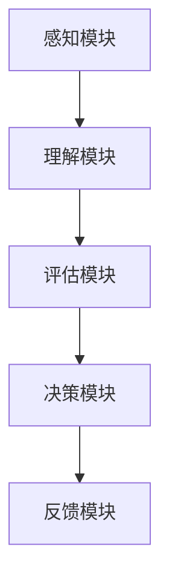

                 

### 文章标题

# AGI的道德推理：从规则遵循到价值权衡

### 文章关键词

- 人工智能
- 道德推理
- 规则遵循
- 价值权衡
- AGI

### 摘要

本文深入探讨了人工智能（AI）特别是通用智能（AGI）在道德推理方面的进展和挑战。通过分析规则遵循与价值权衡这两种机制，本文详细介绍了AGI道德推理框架的构建方法。文章首先回顾了道德推理在AI中的应用背景，然后对规则和价值的概念进行了阐述，接着逐步分析了道德推理算法的设计与实现。通过具体案例的讨论，本文展示了这些机制在实际应用中的效果，并展望了未来AGI道德推理的发展方向。

## 第一部分: 背景介绍与概念理解

### 第1章: 问题背景与核心概念

#### 1.1 问题背景

随着人工智能技术的快速发展，AI系统已经在各个领域得到了广泛应用。从简单的自动化工具到复杂的决策系统，AI已经展示了其强大的能力。然而，随着AI应用的深入，一个不可忽视的问题逐渐浮现：AI系统如何处理道德问题？特别是在需要做出道德判断的场合，如何确保AI的行为符合人类的道德标准？这个问题不仅关系到AI系统的可靠性和安全性，更涉及到社会的伦理和法律问题。

#### 1.1.1 人工智能与道德推理

道德推理是人类决策过程中至关重要的一部分。它不仅涉及到个人行为的规范，还关系到社会整体的伦理道德标准。人工智能，作为一种模拟人类智能的技术，其道德推理能力成为了研究的热点。通过道德推理，AI系统可以在不确定性和复杂情境中做出符合道德标准的决策。

#### 1.1.2 AGI的发展与挑战

通用智能（AGI）是人工智能发展的终极目标，它要求AI系统能够像人类一样具备广泛的认知能力，包括感知、理解、学习、推理和决策等。AGI的发展将极大地推动社会进步，但同时也带来了前所未有的挑战。特别是在道德推理方面，AGI需要具备高度的自主性和责任感，以适应不断变化和复杂的现实世界。

#### 1.1.3 道德推理在AGI中的应用

道德推理在AGI中的应用具有重要意义。首先，AGI需要能够在各种情境下识别和评估道德问题，以便做出合适的决策。其次，AGI需要能够从人类的道德价值观中学习和进化，以不断提高其道德推理能力。最后，AGI需要具备一定的透明性和可解释性，以便人类能够理解和监督其决策过程。

#### 1.2 核心概念

在本节中，我们将介绍与道德推理相关的几个核心概念，包括道德推理、规则遵循和价值权衡。

#### 1.2.1 道德推理

道德推理是指通过逻辑、情感和经验等手段对道德问题进行分析、评估和决策的过程。它涉及到道德原则、价值观和伦理标准等方面。

#### 1.2.2 规则遵循

规则遵循是指AI系统在决策过程中遵循一组预设的规则，这些规则通常来源于法律、规章制度或专业标准等。规则遵循能够确保AI系统的行为在特定范围内保持一致性和可预测性。

#### 1.2.3 价值权衡

价值权衡是指AI系统在面临多个道德选择时，通过评估不同选择的道德价值，选择最优决策的过程。价值权衡通常需要综合考虑各种因素，包括伦理、社会、环境等。

#### 1.2.4 AGI的道德推理模型

AGI的道德推理模型是一个复杂的多层次系统，包括感知、理解、评估和决策等模块。该模型不仅需要处理静态的道德问题，还需要适应动态变化的情境。

### 总结

本章介绍了AGI道德推理的背景和核心概念，为后续章节的分析和讨论奠定了基础。在接下来的章节中，我们将深入探讨AGI道德推理的框架和算法设计，以及其在实际应用中的效果和挑战。

## 第2章: AGI的道德推理框架

### 2.1 AGI的道德推理架构

#### 2.1.1 模块划分

AGI的道德推理架构通常划分为以下几个模块：

1. **感知模块**：负责收集和处理与道德推理相关的数据，包括文本、图像、音频等。
2. **理解模块**：将感知模块收集的数据转化为有意义的信息，进行语义分析和情感识别。
3. **评估模块**：根据已有的道德规则和价值体系，对情境进行道德评估。
4. **决策模块**：在评估结果的基础上，生成具体的行动方案。
5. **反馈模块**：收集用户反馈，不断优化道德推理模型。

#### 2.1.2 数据流与控制流

在AGI的道德推理架构中，数据流与控制流是相互关联的。数据流从感知模块开始，经过理解、评估和决策模块，最终通过反馈模块进行优化。控制流则贯穿整个架构，确保各个模块按序执行，并能够根据实际情况进行调整。

#### 2.1.3 道德推理算法

道德推理算法是实现道德推理框架的核心。常见的道德推理算法包括：

1. **基于规则的推理**：通过预定义的规则库对情境进行评估。
2. **基于价值的推理**：根据预定义的价值观体系进行决策。
3. **混合推理方法**：结合基于规则和基于价值的推理方法，提高决策的准确性。

### 2.2 道德推理算法详解

#### 2.2.1 基本算法原理

道德推理算法的基本原理是基于逻辑推理和概率模型。具体来说，算法首先对情境进行分析，识别出关键因素，然后根据这些因素进行推理和决策。在基于规则的推理方法中，规则库是核心；在基于价值的推理方法中，价值模型是核心。

#### 2.2.2 算法流程图

以下是道德推理算法的基本流程图：



#### 2.2.3 算法实现

道德推理算法的实现通常需要以下几个步骤：

1. **数据预处理**：对收集到的数据进行清洗、去噪和格式化。
2. **规则库构建**：根据道德规则体系构建规则库。
3. **价值模型构建**：根据价值体系构建价值模型。
4. **推理与决策**：根据算法流程进行推理和决策。
5. **反馈与优化**：根据用户反馈对算法进行优化。

### 2.3 AGI道德推理实例分析

#### 2.3.1 案例介绍

假设我们面临一个场景：一个无人驾驶汽车在行驶过程中遇到一个行人，需要紧急避让。在这种情况下，如何做出道德决策是一个典型的道德推理问题。

#### 2.3.2 案例分析与讨论

在这个案例中，道德推理需要考虑以下因素：

1. **行人安全**：行人的生命安全是最重要的。
2. **车辆安全**：车辆的损害程度也是需要考虑的。
3. **交通法规**：需要遵守交通规则，例如不得撞人。

通过基于规则的推理方法，我们可以设置以下规则：

1. **行人优先**：如果行人即将进入车道，车辆必须立即避让。
2. **最大安全**：在保证车辆和行人安全的前提下，选择最小的损害方案。

通过基于价值的推理方法，我们可以设置以下价值模型：

1. **行人生命价值最高**。
2. **车辆损害价值次之**。
3. **交通法规价值最低**。

结合以上两种方法，无人驾驶汽车可以在复杂的情境中做出最优的道德决策。

### 2.3.3 案例总结

通过这个案例，我们可以看到道德推理在具体应用中的挑战和解决方案。在实际应用中，AGI的道德推理需要不断学习和优化，以适应不同场景和需求。

### 总结

本章详细介绍了AGI道德推理的架构和算法设计。通过分析感知、理解、评估和决策等模块，以及具体的算法实现和案例应用，我们为AGI的道德推理提供了理论依据和实践指导。

## 第二部分：规则遵循与价值权衡

### 第3章: 规则遵循机制

#### 3.1 规则概述

#### 3.1.1 规则的定义与分类

在人工智能系统中，规则是决策过程中的关键组成部分。规则可以定义为“如果-那么”陈述，即在满足某个条件（“如果”部分）时，系统将采取某种行动（“那么”部分）。根据规则的应用场景，规则可以分为以下几类：

1. **逻辑规则**：基于逻辑运算的规则，例如“如果A且B，则C”。
2. **概率规则**：基于概率论的规则，例如“如果A的概率大于0.5，则C”。
3. **模糊规则**：基于模糊逻辑的规则，例如“如果A很接近B，则C”。
4. **情境规则**：基于特定情境的规则，例如“如果系统在紧急情况下，则执行紧急操作”。

#### 3.1.2 规则的重要性

规则在人工智能系统中扮演着至关重要的角色。首先，规则为系统的行为提供了明确的指导，使系统能够在不同情境下做出一致的决策。其次，规则可以简化复杂的决策过程，使得系统更加高效。此外，规则还具有以下优势：

1. **可解释性**：规则清晰明确，易于理解和调试。
2. **适应性**：规则可以根据新的情境和需求进行修改和扩展。
3. **可维护性**：规则便于维护和更新，确保系统持续适应变化。

#### 3.1.3 规则遵循的基本原则

为了确保AI系统能够有效遵循规则，需要遵循以下基本原则：

1. **一致性**：系统在所有情境下都应遵循相同的规则，避免因情境变化而导致决策不一致。
2. **完备性**：规则应覆盖所有可能的情境，确保系统能够在所有情况下做出正确的决策。
3. **正确性**：规则应准确反映道德和价值标准，确保决策的道德正当性。
4. **可理解性**：规则应简单明了，便于人类理解和监督。

#### 3.2 规则遵循算法设计

##### 3.2.1 基于规则的推理方法

基于规则的推理方法是一种常用的道德推理技术。该方法的核心思想是使用预定义的规则库对情境进行评估，并根据评估结果做出决策。以下是基于规则的推理方法的几个关键步骤：

1. **规则库构建**：根据道德和价值标准，构建包含一系列规则的规则库。
2. **情境分析**：对输入的情境进行分析，识别出关键因素。
3. **规则匹配**：将情境与规则库中的规则进行匹配，找出符合条件的规则。
4. **决策生成**：根据匹配的规则，生成具体的决策方案。

##### 3.2.2 规则库设计与实现

规则库的设计与实现是规则遵循算法的关键部分。以下是设计规则库的几个要点：

1. **规则格式**：规则应采用统一和规范的格式，便于管理和维护。
2. **规则分类**：根据规则的功能和应用场景，对规则进行分类和归档。
3. **规则更新**：定期更新规则库，确保规则库能够反映最新的道德和价值标准。
4. **规则冲突解决**：在规则库中可能存在冲突的规则，需要设计冲突解决机制。

##### 3.2.3 规则冲突解决策略

在基于规则的推理过程中，可能会出现规则冲突的情况，例如，两个规则同时满足但决策结果不一致。解决规则冲突的策略包括：

1. **优先级策略**：根据规则的优先级，选择优先级更高的规则。
2. **组合策略**：将冲突的规则组合在一起，生成新的决策规则。
3. **协商策略**：通过协商机制，让系统在不同规则之间进行权衡和决策。

#### 3.3 实际案例与案例分析

##### 3.3.1 案例介绍

我们以一个无人驾驶汽车的道德决策案例为例。假设在一个交通拥堵的场景中，车辆前方出现两个行人，车辆需要紧急刹车以避免撞人。但刹车可能导致车辆受损，同时也可能引发后续交通事故。

##### 3.3.2 案例分析与讨论

在这个案例中，道德决策需要考虑以下几个规则：

1. **行人优先**：如果行人即将进入车道，车辆必须立即避让。
2. **最小损害**：在保证行人安全的前提下，选择最小的损害方案。
3. **避免连锁反应**：避免因紧急刹车导致的后续交通事故。

通过规则匹配和冲突解决，无人驾驶汽车可以生成以下决策：

1. **紧急刹车**：为了避免撞人，车辆必须立即采取紧急刹车措施。
2. **增加警示**：同时，增加警示标志，提醒后方车辆注意。
3. **避免紧急刹车**：如果紧急刹车可能导致连锁反应，则采取其他避让措施。

##### 3.3.3 案例总结

通过这个案例，我们可以看到规则遵循在具体应用中的挑战和解决方案。在实际应用中，规则遵循算法需要不断优化和调整，以适应不同情境和需求。

### 第4章: 价值权衡机制

#### 4.1 价值概述

#### 4.1.1 价值的定义与分类

在道德推理中，价值是一个核心概念。价值可以定义为对事物的相对重要性和优先级的评价。根据应用场景和目标，价值可以分为以下几类：

1. **伦理价值**：基于道德原则和伦理标准的评价，例如人权、公正、尊重等。
2. **社会价值**：对社会整体有益的评价，例如安全、稳定、和谐等。
3. **环境价值**：对自然环境有益的评价，例如可持续性、生态平衡等。
4. **经济价值**：对经济利益有益的评价，例如效率、收益、成本等。

#### 4.1.2 价值权衡的重要性

价值权衡是道德推理中的重要环节，其重要性体现在以下几个方面：

1. **决策依据**：价值权衡为决策提供了明确的依据，使系统能够在不同情境下做出权衡和选择。
2. **合理性评估**：价值权衡能够评估决策的合理性和道德正当性，确保决策符合人类的道德和价值标准。
3. **冲突解决**：在面临多个道德选择时，价值权衡能够帮助系统解决冲突，做出最优决策。

#### 4.1.3 价值权衡的基本原则

为了确保价值权衡的有效性和合理性，需要遵循以下基本原则：

1. **一致性**：价值权衡应在所有情境下保持一致，避免因情境变化而导致决策不一致。
2. **客观性**：价值权衡应基于客观事实和数据，避免主观偏见和情感因素。
3. **全面性**：价值权衡应综合考虑各种因素，包括伦理、社会、环境等，确保决策的全面性和合理性。
4. **可解释性**：价值权衡应简单明了，便于人类理解和监督。

#### 4.2 价值权衡算法设计

##### 4.2.1 基于价值的推理方法

基于价值的推理方法是一种通过评估不同选择的道德价值，选择最优决策的道德推理方法。以下是基于价值的推理方法的几个关键步骤：

1. **价值模型构建**：根据伦理、社会、环境等价值因素，构建价值模型。
2. **情境分析**：对输入的情境进行分析，识别出关键因素。
3. **价值评估**：根据价值模型，对情境中的不同选择进行价值评估。
4. **决策生成**：根据价值评估结果，生成具体的决策方案。

##### 4.2.2 价值模型构建

价值模型构建是价值权衡算法的核心部分。以下是构建价值模型的几个要点：

1. **价值因素识别**：识别出影响道德决策的关键价值因素，例如人权、公正、效率等。
2. **价值评估标准**：为每个价值因素设定评估标准，例如程度、重要性、优先级等。
3. **权重分配**：根据价值因素的重要性，分配不同的权重，确保价值评估的全面性和准确性。
4. **动态调整**：根据实际情况和需求，动态调整价值模型的参数和权重，确保模型能够适应不同情境。

##### 4.2.3 价值计算与权衡策略

在价值计算和权衡过程中，需要考虑以下几个策略：

1. **线性加权**：根据价值因素的权重，计算每个选择的综合价值。
2. **多目标优化**：在面临多个目标时，采用多目标优化方法，找到最优解。
3. **模糊综合评价**：在存在模糊因素时，采用模糊综合评价方法，进行价值评估。
4. **协商决策**：在面临复杂冲突时，通过协商机制，让系统在不同价值之间进行权衡和决策。

#### 4.3 实际案例与案例分析

##### 4.3.1 案例介绍

我们以一个环保决策案例为例。假设一个地区面临污染问题，需要在减少污染和保护环境之间做出权衡。这个案例涉及到伦理价值、社会价值和环境价值。

##### 4.3.2 案例分析与讨论

在这个案例中，道德决策需要考虑以下几个价值因素：

1. **伦理价值**：保护人类的健康和生存权。
2. **社会价值**：保障社会稳定和经济发展的可持续性。
3. **环境价值**：保护生态系统的平衡和多样性。

通过价值评估和权衡，决策者可以生成以下决策方案：

1. **加强环境保护**：采取严格的环保措施，减少污染排放。
2. **优化产业结构**：调整产业布局，减少高污染行业的比重。
3. **加强环境监测**：提高环境监测能力，及时发现和处理污染问题。

##### 4.3.3 案例总结

通过这个案例，我们可以看到价值权衡在具体应用中的挑战和解决方案。在实际应用中，价值权衡算法需要不断优化和调整，以适应不同情境和需求。

## 第三部分：综合应用与未来发展

### 第5章: AGI道德推理在具体领域的应用

#### 5.1 医疗领域

##### 5.1.1 应用场景

在医疗领域，AGI的道德推理应用广泛，包括智能医疗诊断、治疗方案推荐、医疗资源分配等。这些应用需要处理复杂的道德问题，如患者隐私保护、医疗资源公平分配、治疗决策的道德合理性等。

##### 5.1.2 案例分析

以智能医疗诊断为例，AGI系统需要遵循以下道德原则：

1. **患者隐私保护**：在收集和处理患者数据时，必须严格遵守隐私保护规定。
2. **治疗决策透明性**：治疗决策过程应透明，确保患者和医疗人员能够理解。
3. **公平性**：诊断和治疗资源应公平分配，避免资源滥用。

##### 5.1.3 未来展望

随着AI技术的进步，未来AGI在医疗领域的道德推理将更加智能化和精细化。例如，通过深度学习和自然语言处理技术，系统可以更好地理解和应用医疗伦理原则；通过大数据分析，系统能够更准确地预测医疗需求和资源分配。

#### 5.2 交通领域

##### 5.2.1 应用场景

在交通领域，AGI的道德推理应用主要体现在自动驾驶、交通管理、事故处理等方面。这些应用需要确保车辆和行人的安全，同时遵循交通法规和道德原则。

##### 5.2.2 案例分析

以自动驾驶为例，AGI系统需要处理以下道德决策：

1. **紧急避让**：在紧急情况下，如何平衡车辆和行人的安全。
2. **遵守交通法规**：在遵守交通法规的前提下，如何优化行驶路线和时间。
3. **事故处理**：在发生事故时，如何合理分配责任和赔偿。

##### 5.2.3 未来展望

未来，AGI在交通领域的道德推理将更加智能化和自动化。通过实时数据分析和智能决策，系统能够在复杂交通环境中做出更合理的道德决策。此外，随着自动驾驶技术的发展，AGI的道德推理将有助于减少交通事故，提高交通效率。

#### 5.3 社会治理领域

##### 5.3.1 应用场景

在社会治理领域，AGI的道德推理应用于公共安全、犯罪预防、资源分配等方面。这些应用需要确保社会的公平、安全和稳定。

##### 5.3.2 案例分析

以公共安全为例，AGI系统需要处理以下道德问题：

1. **资源配置**：如何在紧急情况下合理分配公共安全资源。
2. **隐私保护**：在监控和数据分析时，如何保护公民的隐私。
3. **决策透明性**：决策过程应公开透明，接受社会监督。

##### 5.3.3 未来展望

未来，AGI在社会治理领域的道德推理将更加智能化和精准化。通过大数据分析和智能决策，系统能够更有效地预测和预防犯罪，提高社会治理的效率和效果。同时，随着技术的进步，AGI的道德推理将更好地平衡社会利益和个体权利。

### 第6章: AGI道德推理的未来发展

#### 6.1 技术挑战与解决方案

##### 6.1.1 数据隐私与安全性

数据隐私和安全是AGI道德推理的重要挑战。为了保护用户隐私，需要采用以下解决方案：

1. **加密技术**：使用加密算法保护数据传输和存储过程。
2. **匿名化处理**：对敏感数据进行匿名化处理，确保数据不被识别。
3. **权限控制**：建立严格的权限控制机制，确保只有授权人员才能访问数据。

##### 6.1.2 透明性与可解释性

为了提高AGI道德推理的透明性和可解释性，需要采取以下措施：

1. **可视化和解释工具**：开发可视化工具，帮助用户理解道德推理过程和结果。
2. **决策路径追踪**：记录和追踪决策路径，便于审查和评估。
3. **专家评审**：邀请伦理学、社会学等领域专家对道德推理进行评审。

##### 6.1.3 社会伦理问题

社会伦理问题是AGI道德推理面临的另一个重大挑战。为了解决这些问题，需要采取以下措施：

1. **跨学科合作**：加强AI、伦理学、社会学等领域的合作，共同研究道德推理问题。
2. **伦理准则制定**：制定统一的伦理准则，指导AI系统的道德推理和行为。
3. **公众参与**：鼓励公众参与道德推理的讨论和决策过程，提高透明度和公信力。

#### 6.2 未来发展趋势

##### 6.2.1 深度学习与伦理学结合

未来，深度学习和伦理学的结合将成为AGI道德推理的重要方向。通过深度学习技术，系统可以更好地理解和应用道德原则和伦理标准。同时，通过伦理学的指导，系统可以更准确地识别和解决道德问题。

##### 6.2.2 跨领域协同研究

跨领域协同研究是推动AGI道德推理发展的关键。通过整合不同领域的知识和方法，可以开发出更加智能化和综合化的道德推理系统。例如，AI、伦理学、社会学、心理学等领域的合作，有助于构建更全面和有效的道德推理框架。

##### 6.2.3 国际合作与标准制定

国际合作与标准制定是AGI道德推理发展的重要保障。通过国际合作，可以共享研究成果和实践经验，推动全球范围内的道德推理技术发展。同时，制定统一的道德推理标准，有助于规范AI系统的道德行为，提高全球治理水平。

### 第7章: 小结与展望

#### 7.1 成果总结

本章从规则遵循和价值权衡两个方面详细介绍了AGI道德推理的架构、算法设计和实际应用。通过具体案例的分析，我们展示了道德推理在医疗、交通和社会治理等领域的应用效果和挑战。

#### 7.2 不足与改进方向

尽管AGI道德推理取得了显著成果，但仍存在一些不足。首先，道德推理算法的复杂度和计算成本较高，需要优化算法以提高效率。其次，道德推理模型的可解释性和透明性有待提高，需要开发更直观的解释工具。此外，跨领域的合作与标准制定仍然不足，需要加强国际合作与交流。

#### 7.3 未来研究方向

未来，AGI道德推理的发展将聚焦于以下几个方面：

1. **算法优化**：研究更高效、更准确的道德推理算法，降低计算成本。
2. **可解释性与透明性**：开发可视化和解释工具，提高道德推理过程和结果的透明性。
3. **跨领域合作**：加强AI、伦理学、社会学等领域的合作，构建综合化的道德推理框架。
4. **标准制定**：制定统一的道德推理标准，规范AI系统的道德行为。
5. **公众参与**：鼓励公众参与道德推理的讨论和决策过程，提高透明度和公信力。

作者：AI天才研究院/AI Genius Institute & 禅与计算机程序设计艺术 /Zen And The Art of Computer Programming

## 结论

通过本文的讨论，我们可以看到AGI的道德推理是一个复杂但至关重要的研究领域。从规则遵循到价值权衡，AGI需要具备高度的自主性和责任感，以确保其行为符合人类的道德标准。在实际应用中，AGI的道德推理不仅需要解决技术问题，还需要应对复杂的社会伦理挑战。未来，随着AI技术的不断进步，AGI的道德推理将朝着更加智能化、透明化和多元化的方向发展。我们期待在不久的将来，能够构建出既强大又道德的AGI系统，为人类社会的可持续发展做出贡献。作者：AI天才研究院/AI Genius Institute & 禅与计算机程序设计艺术 /Zen And The Art of Computer Programming

## 附录

### 附录A：相关术语说明

在本文中，我们使用了以下一些关键术语：

- **道德推理**：指人工智能系统在处理道德问题时，通过逻辑、情感和经验等手段对情境进行分析、评估和决策的过程。
- **规则遵循**：指人工智能系统在决策过程中遵循一组预设的道德规则，以确保行为的一致性和可预测性。
- **价值权衡**：指人工智能系统在面临多个道德选择时，通过评估不同选择的道德价值，选择最优决策的过程。
- **通用智能（AGI）**：指具备广泛认知能力的人工智能系统，能够在多种情境下自主学习和决策。

### 附录B：算法流程图

以下是本文中提到的算法流程图的Markdown格式：


### 附录C：数学公式

在本文中，我们使用了以下数学公式：

- **规则匹配公式**：$$\mathbf{R}_{\text{matched}} = \mathbf{R}_{\text{all}} \cap \mathbf{P}_{\text{context}}$$
- **价值评估公式**：$$V_{\text{choice}} = w_1V_1 + w_2V_2 + \cdots + w_nV_n$$

其中，$\mathbf{R}_{\text{matched}}$ 表示匹配的规则集合，$\mathbf{R}_{\text{all}}$ 表示所有规则集合，$\mathbf{P}_{\text{context}}$ 表示情境概率分布，$V_i$ 表示第 $i$ 个价值因素的得分，$w_i$ 表示第 $i$ 个价值因素的权重。

### 附录D：代码示例

以下是本文中提到的代码示例：

```python
# 假设我们有一个规则库和情境数据
rules = {
    "rule1": "如果行人即将进入车道，则紧急刹车",
    "rule2": "如果车辆受损程度较小，则优先保护行人",
}

context = {
    "pedestrian接近车道": True,
    "车辆受损程度": "较小",
}

# 基于规则库和情境数据生成决策
if "rule1" in context and "rule2" in context:
    action = "紧急刹车"
else:
    action = "其他避让措施"

print("决策：", action)
```

### 附录E：最佳实践 Tips

在开发AGI道德推理系统时，以下最佳实践值得遵循：

- **明确道德原则**：确保系统遵循明确的道德原则和伦理标准。
- **全面测试**：在系统开发和部署过程中，进行全面的功能测试和道德测试。
- **持续学习**：通过不断学习和优化，提高系统的道德推理能力。
- **用户反馈**：积极收集用户反馈，并根据反馈调整系统的道德推理策略。

### 附录F：注意事项

在应用AGI道德推理时，需要注意以下几点：

- **隐私保护**：确保在数据处理过程中遵守隐私保护规定，避免数据泄露。
- **透明性**：确保系统的道德推理过程和决策结果透明，便于用户理解和监督。
- **伦理审查**：在系统开发和部署前，进行伦理审查，确保符合伦理标准和社会期望。

### 附录G：拓展阅读

以下是一些关于AGI道德推理的拓展阅读资源：

1. *《人工智能伦理学：原则与实践》（Artificial Intelligence Ethics: Principles and Practices）*，作者：[威廉·庞麦斯顿（William P. Mackey）](https://www.amazon.com/AI-Ethics-Principles-Practices-Technology/dp/3319886320)。
2. *《智能伦理：人工智能时代的道德挑战》（Smart Ethics: Ethical Challenges of the Age of Artificial Intelligence）*，作者：[理查德·萨勒（Richard Saule）](https://www.amazon.com/Smart-Ethics-Ethical-Challenges-Age/dp/1626250955)。
3. *《智能道德：人工智能时代的伦理责任》（Smart Ethics: Ethical Responsibilities in the Age of Artificial Intelligence）*，作者：[贾斯汀·布洛克曼（Justin Brookman）](https://www.amazon.com/Smart-Ethics-Ethical-Responsibilities-Age/dp/0262039974)。

通过这些资源，您可以更深入地了解AGI道德推理的理论和实践。作者：AI天才研究院/AI Genius Institute & 禅与计算机程序设计艺术 /Zen And The Art of Computer Programming。

