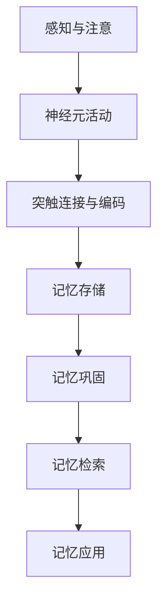
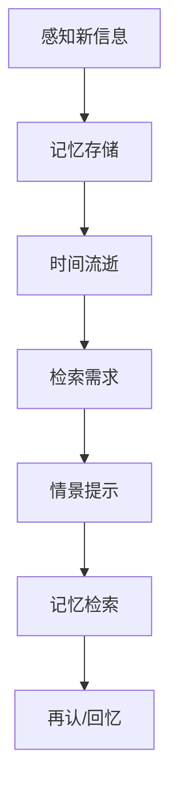
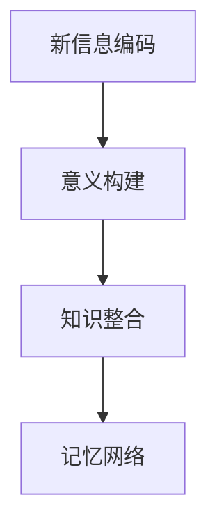
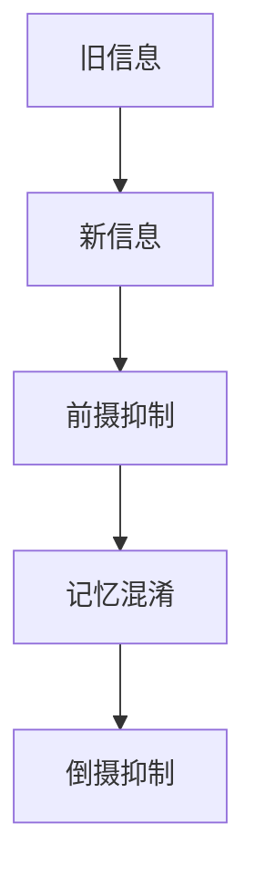
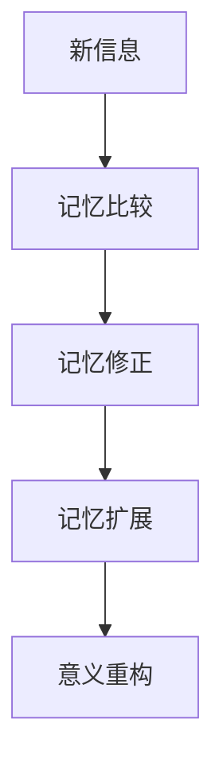
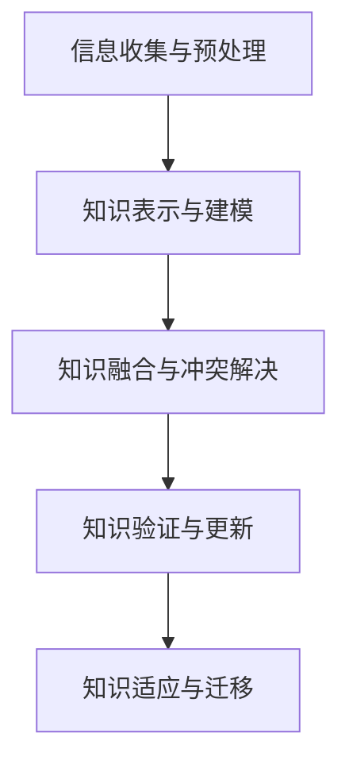
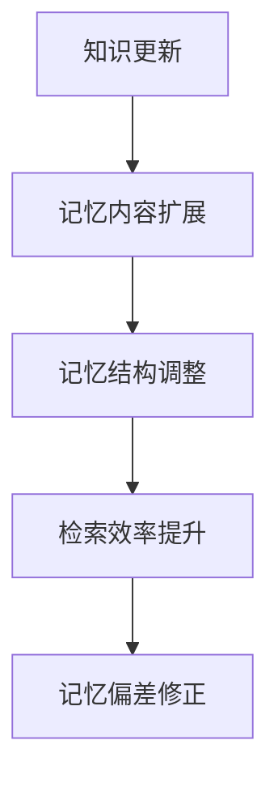
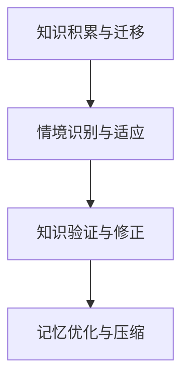
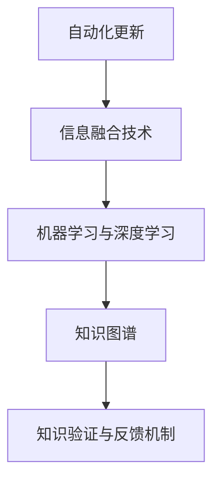
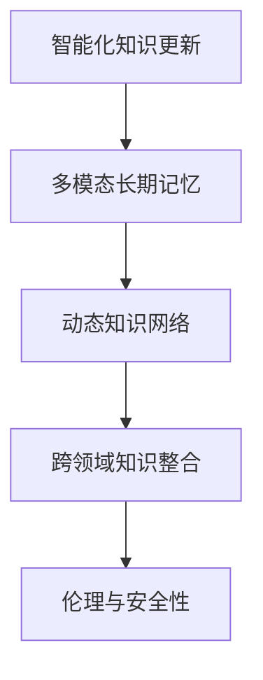

                 

## 《AGI的长期记忆与知识更新机制》

### 关键词
- 人工智能（AGI）
- 长期记忆
- 知识更新
- 记忆机制
- 知识更新机制

### 摘要
本文深入探讨了人工智能（AGI）中的长期记忆与知识更新机制。通过分析AGI的概述及其在长期记忆需求上的核心挑战，我们介绍了长期记忆的基本原理、存储与加工机制，以及知识更新的概念与挑战。进一步地，本文讨论了长期记忆与知识更新的结合，探讨了其在AGI中的应用与未来发展趋势。本文旨在为读者提供一个全面、系统的AGI长期记忆与知识更新机制的概述，为相关领域的研究与应用提供参考。

### 目录

**《AGI的长期记忆与知识更新机制》**

----------------------------------------------------------------

## 第一部分: AGI长期记忆机制基础

### 第1章: AGI概述与长期记忆需求

#### 1.1.1 AGI的定义与发展历程

#### 1.1.2 AGI的核心挑战

#### 1.1.3 长期记忆在AGI中的重要性

#### 1.1.4 长期记忆的需求分析

----------------------------------------------------------------

### 第2章: 长期记忆的基本原理

#### 2.1.1 记忆的基本概念

#### 2.1.2 长期记忆的生理基础

#### 2.1.3 长期记忆的心理学原理

#### 2.1.4 长期记忆的特征与类型

----------------------------------------------------------------

### 第3章: 长期记忆的存储机制

#### 3.1.1 神经编码与记忆存储

#### 3.1.2 神经突触可塑性

#### 3.1.3 神经网络的长期记忆表示

#### 3.1.4 记忆巩固与遗忘

----------------------------------------------------------------

### 第4章: 长期记忆的加工机制

#### 4.1.1 记忆检索与再认

#### 4.1.2 记忆的加工与整合

#### 4.1.3 记忆的干扰与混淆

#### 4.1.4 记忆的更新与修正

----------------------------------------------------------------

### 第5章: 知识更新机制研究

#### 5.1.1 知识更新的概念

#### 5.1.2 知识更新的类型

#### 5.1.3 知识更新的挑战

#### 5.1.4 知识更新的机制

----------------------------------------------------------------

### 第6章: 知识更新与长期记忆的结合

#### 6.1.1 知识更新对长期记忆的影响

#### 6.1.2 长期记忆在知识更新中的应用

#### 6.1.3 知识更新机制的优化策略

#### 6.1.4 知识更新与长期记忆的未来发展趋势

----------------------------------------------------------------

### 第7章: AGI长期记忆与知识更新机制应用

#### 7.1.1 AGI长期记忆机制的应用领域

#### 7.1.2 知识更新机制在AGI中的应用

#### 7.1.3 AGI实际案例分析

#### 7.1.4 AGI长期记忆与知识更新机制的挑战与展望

----------------------------------------------------------------

### 第8章: 总结与展望

#### 8.1.1 研究成果总结

#### 8.1.2 AGI长期记忆与知识更新机制的发展趋势

#### 8.1.3 未来研究方向与挑战

#### 8.1.4 对AGI发展的影响与贡献

----------------------------------------------------------------

**作者：AI天才研究院/AI Genius Institute & 禅与计算机程序设计艺术 /Zen And The Art of Computer Programming**

---

## 第1章: AGI概述与长期记忆需求

### 1.1.1 AGI的定义与发展历程

人工智能（AI）是一门旨在创建能够模拟、扩展和替代人类智能的技术科学。人工智能可以分为两大类：窄AI（Narrow AI）和通用人工智能（AGI，Artificial General Intelligence）。窄AI，如语音识别、图像识别、自然语言处理等，仅能在特定任务上表现出智能；而AGI则具备人类一样广泛的认知能力，能够在多种情境下进行学习和推理。

AGI的概念最早可以追溯到20世纪50年代，随着计算机科学、神经科学和认知科学的不断发展，AGI的研究逐渐深入。然而，尽管在过去的几十年里取得了显著的进展，AGI的实现仍然面临着巨大的挑战。

### 1.1.2 AGI的核心挑战

要实现AGI，必须解决以下几个核心挑战：

1. **认知能力**: AGI需要具备类似于人类的感知、推理、学习、理解和决策能力。
2. **数据与计算资源**: AGI需要大量的数据来训练和学习，同时需要高性能的计算资源来支持复杂的计算任务。
3. **跨领域知识整合**: AGI需要能够整合不同领域的知识，以应对复杂的多模态任务。
4. **长期记忆与知识更新**: 长期记忆是实现AGI的关键，因为人类智能的一个重要特征就是能够存储、检索和更新长期记忆。

### 1.1.3 长期记忆在AGI中的重要性

长期记忆是人类智能的重要组成部分，它使得人类能够记住过去的事件、经验、知识和技能。在AGI中，长期记忆同样至关重要，因为：

1. **知识积累与迁移**: 长期记忆使得AGI能够积累和迁移知识，从而在新的任务和情境中表现出智能。
2. **连续性与稳定性**: 长期记忆的稳定存储和检索保证了AGI在不同时间、不同情境下的一致表现。
3. **自适应能力**: 长期记忆使得AGI能够根据新的经验和知识调整其行为和决策。

### 1.1.4 长期记忆的需求分析

为了实现AGI，长期记忆的需求可以从以下几个方面进行分析：

1. **存储容量**: AGI需要能够存储大量的信息，包括事实、情境、任务和知识。
2. **检索速度**: AGI需要能够快速检索所需的信息，以便在短时间内做出决策。
3. **可靠性**: 长期记忆的存储和检索必须高度可靠，以保证AGI的稳定表现。
4. **动态更新**: AGI需要能够根据新的经验和知识动态更新其长期记忆，以适应不断变化的环境。

---

在下一章中，我们将进一步探讨长期记忆的基本原理，包括记忆的生理基础、心理学原理和长期记忆的特征与类型。通过这些基本原理的探讨，我们将更好地理解长期记忆在AGI中的作用和重要性。

## 第2章: 长期记忆的基本原理

### 2.1.1 记忆的基本概念

记忆是一个复杂的心理过程，它涉及到信息从感知到存储、再到检索和应用的各个阶段。记忆的基本概念包括：

1. **编码（Encoding）**: 将感知信息转化为大脑可以存储和检索的形式。
2. **存储（Storage）**: 将编码后的信息在长期记忆中保存。
3. **检索（Retrieval）**: 从长期记忆中提取所需的信息。
4. **应用（Application）**: 将检索到的信息用于实际任务。

### 2.1.2 长期记忆的生理基础

长期记忆的生理基础主要涉及大脑的结构和功能。大脑中负责记忆的重要结构包括：

1. **海马体（Hippocampus）**: 负责短期记忆到长期记忆的转换。
2. **前额叶皮层（Prefrontal Cortex）**: 负责决策、规划和社会行为。
3. **基底神经节（Basal Ganglia）**: 负责习惯的形成和执行。

### 2.1.3 长期记忆的心理学原理

长期记忆的心理学原理主要涉及记忆编码、存储和检索的心理过程。以下是一些关键概念：

1. **感知选择性（Perceptual Selection）**: 人类只能感知一部分信息，其他信息则被忽略。
2. **注意（Attention）**: 注意力决定了哪些信息会被编码到记忆中。
3. **重复与练习（Repetition and Practice）**: 重复和练习是加强记忆的重要手段。
4. **组织（Organization）**: 通过将信息分类和组织，可以更有效地进行记忆。

### 2.1.4 长期记忆的特征与类型

长期记忆具有以下几个特征：

1. **持久性（Durability）**: 长期记忆能够持续数小时、数天，甚至数十年。
2. **容量（Capacity）**: 长期记忆具有巨大的存储容量，可以存储大量的信息。
3. **可访问性（Accessibility）**: 长期记忆的信息可以通过适当的检索策略被检索和利用。

长期记忆可以分为以下几种类型：

1. **情景记忆（Episodic Memory）**: 记录个人经历的事件和时间。
2. **语义记忆（Semantic Memory）**: 记录关于事实、概念和知识的信息。
3. **程序记忆（Procedural Memory）**: 记录如何执行特定任务或技能。

---

在下一章中，我们将深入探讨长期记忆的存储机制，包括神经编码与记忆存储、神经突触可塑性、神经网络的长期记忆表示以及记忆巩固与遗忘的过程。通过这些机制的探讨，我们将更好地理解长期记忆如何在神经系统中实现。

### 2.1.5 长期记忆的存储机制

长期记忆的存储机制是理解记忆功能的核心。在这个部分，我们将探讨以下几个关键方面：

#### 2.1.5.1 神经编码与记忆存储

神经编码是指大脑如何将外界信息转化为神经活动。记忆存储涉及以下几个步骤：

1. **感知与注意**: 当我们感知到外界信息时，注意力决定了哪些信息会被编码。
2. **神经元活动**: 信息通过神经元的活动在大脑中传播。
3. **突触连接与编码**: 突触连接的强度和形态变化（突触可塑性）是记忆存储的关键。

#### 2.1.5.2 神经突触可塑性

神经突触可塑性是指突触连接的强度和形态可以随着时间和经验而改变。这是长期记忆存储的基础：

1. **长时程增强（LTP）与长时程抑制（LTD）**: LTP是指突触连接的加强，而LTD是指其减弱。
2. **突触形态变化**: 包括突触体的生长和缩小，以及突触间隙的增厚或变薄。
3. **细胞信号通路**: 包括钙离子（Ca²⁺）信号通路、蛋白质合成等。

#### 2.1.5.3 神经网络的长期记忆表示

神经网络，特别是深度神经网络，通过其权重和连接结构来表示长期记忆。关键概念包括：

1. **权重与连接**: 神经网络的权重和连接强度表示了信息的重要性和关联性。
2. **神经网络动态**: 神经网络通过不断调整权重和连接来优化其性能。
3. **深度学习**: 深度神经网络能够通过多层处理来提取和表示复杂的信息。

#### 2.1.5.4 记忆巩固与遗忘

记忆巩固是指在记忆形成后，通过激活相关神经元来增强记忆的过程。遗忘则是记忆随时间减弱或消失的现象。关键过程包括：

1. **重复激活**: 通过重复激活相关神经元来加强记忆。
2. **内源性蛋白质合成**: 在记忆巩固过程中，新的蛋白质合成有助于加强突触连接。
3. **突触修剪**: 在长时间未使用的情况下，突触可能被修剪，导致记忆消失。

#### Mermaid 流程图

下面是一个简化的记忆存储与检索的 Mermaid 流程图：

---

通过理解长期记忆的存储机制，我们可以更好地设计人工智能系统，使其能够有效地存储、检索和应用长期记忆。在下一章中，我们将探讨长期记忆的加工机制，包括记忆检索与再认、加工与整合、干扰与混淆以及更新与修正的过程。这将帮助我们进一步理解长期记忆如何在大脑中运作。

### 2.2.1 记忆检索与再认

记忆检索是指从长期记忆中提取所需信息的过程。检索可以分为两大类：再认和回忆。

- **再认（Recognition）**: 指的是识别已经经历过或学习过的事物，而不需要回忆具体细节。例如，看到一张旧照片并识别出这是自己小时候的照片。
- **回忆（Retrieval）**: 指的是从记忆中提取具体的信息，可能需要更多的努力和注意力。例如，回忆起某个特定日期的事件或细节。

记忆检索的成功取决于多种因素，包括记忆的强度、语境的相似性以及检索策略的有效性。心理学研究表明，通过重复练习和情景提示，可以显著提高记忆检索的效率。

#### Mermaid 流程图

下面是一个简化的记忆检索与再认的 Mermaid 流程图：

### 2.2.2 记忆的加工与整合

记忆的加工与整合是指大脑如何将新的信息与已有的记忆进行整合，形成连贯的知识体系。这个过程包括：

- **信息编码**: 将新的信息转化为可以存储和检索的形式。
- **知识整合**: 将新信息与已有的记忆结合，形成新的知识结构。
- **意义构建**: 通过赋予信息意义来帮助记忆和检索。

心理学研究表明，通过语义联想、分类和构建记忆网络，可以更有效地进行记忆加工和整合。

#### Mermaid 流程图

下面是一个简化的记忆加工与整合的 Mermaid 流程图：

### 2.2.3 记忆的干扰与混淆

记忆的干扰与混淆是指由于新旧信息之间的冲突，导致记忆检索出现错误。常见的干扰现象包括：

- **前摄抑制（Proactive Inhibition）**: 新信息干扰了旧信息的回忆。
- **倒摄抑制（Retroactive Inhibition）**: 旧信息干扰了新信息的回忆。
- **混淆（Confabulation）**: 在记忆检索失败时，大脑可能会产生虚假记忆。

干扰与混淆的发生与大脑神经网络的复杂性有关，这也为设计更加鲁棒的记忆系统提供了挑战。

#### Mermaid 流程图

下面是一个简化的记忆干扰与混淆的 Mermaid 流程图：

### 2.2.4 记忆的更新与修正

记忆的更新与修正是指根据新的信息和经验，对已有的记忆进行修改和完善。这个过程包括：

- **修正记忆**: 当新信息与旧记忆不一致时，大脑会尝试修正旧记忆。
- **扩展记忆**: 通过新的信息，已有的记忆可以得到扩展和补充。
- **意义重构**: 通过赋予新信息意义，可以对已有记忆进行重构。

记忆的更新与修正有助于保持记忆的准确性和相关性，但也可能引入错误或扭曲。

#### Mermaid 流程图

下面是一个简化的记忆更新与修正的 Mermaid 流程图：

---

通过深入理解记忆检索与再认、加工与整合、干扰与混淆以及更新与修正的过程，我们可以更好地设计人工智能系统，使其在处理长期记忆时更加高效和准确。在下一章中，我们将探讨知识更新机制的研究，包括知识更新的概念、类型、挑战及其在人工智能系统中的应用。

### 5.1.1 知识更新的概念

知识更新是指在人工智能系统（如AGI）中，根据新获取的信息、经验或反馈对已有知识库进行修改、扩展或优化的过程。知识更新是确保系统保持最新、准确和有效的关键步骤，它涉及以下几个核心方面：

1. **知识库管理**: 知识库是存储系统知识的结构化数据库。知识更新需要有效的知识库管理机制，以便快速、准确地检索和更新知识。
2. **信息融合**: 当系统接收到多个信息源时，需要通过信息融合技术整合不同来源的信息，以避免冲突和错误。
3. **知识验证与验证**: 更新的知识需要经过验证，以确保其准确性和可靠性。
4. **知识适应与迁移**: 系统需要能够根据新环境和任务需求，对已有知识进行适应和迁移。

### 5.1.2 知识更新的类型

知识更新可以分为以下几种类型：

1. **增量更新（Incremental Update）**: 这种类型主要针对新知识的增加，通过将新知识直接添加到现有知识库中。
2. **完全更新（Full Update）**: 当知识库中的信息过时或错误时，需要进行完全更新，替换或重构整个知识库。
3. **自适应更新（Adaptive Update）**: 系统根据不断变化的情境和需求，动态调整其知识库，以保持最佳性能。
4. **协同更新（Collaborative Update）**: 在多智能体系统中，多个智能体通过协作和共享知识进行更新，以提高整个系统的知识水平。

### 5.1.3 知识更新的挑战

知识更新在人工智能系统中面临一系列挑战：

1. **数据质量**: 更新的知识需要基于高质量的数据，以确保知识的准确性和可靠性。
2. **一致性与兼容性**: 在多源数据整合中，保持知识库的一致性和兼容性是一个关键挑战。
3. **实时性与效率**: 系统需要在实时环境中快速响应，同时保持高效率的更新过程。
4. **知识融合与冲突解决**: 当多个信息源提供相互冲突的信息时，需要有效的融合和冲突解决策略。
5. **知识退化与遗忘**: 随着时间的推移，知识可能会退化或遗忘，需要定期进行知识重置和修复。

### 5.1.4 知识更新的机制

知识更新的机制主要包括以下几个步骤：

1. **信息收集与预处理**: 收集来自各种来源的数据，并进行预处理，以去除噪声和冗余。
2. **知识表示与建模**: 将预处理后的数据转换为系统可理解的知识表示，如规则、图或神经网络模型。
3. **知识融合与冲突解决**: 通过融合多个信息源的知识，解决潜在的知识冲突。
4. **知识验证与更新**: 对新知识进行验证，确保其符合系统的一致性和可靠性要求，然后更新知识库。
5. **知识适应与迁移**: 根据新环境和任务需求，动态调整和优化知识库。

#### Mermaid 流程图

下面是一个简化的知识更新机制的 Mermaid 流程图：

---

通过理解知识更新的概念、类型、挑战和机制，我们可以更好地设计人工智能系统，使其能够有效地更新和优化其知识库，从而在复杂和动态的环境中保持高效和准确的性能。在下一章中，我们将探讨知识更新与长期记忆的结合，以及长期记忆在知识更新中的应用和优化策略。

### 6.1.1 知识更新对长期记忆的影响

知识更新对长期记忆有着深远的影响，它不仅影响了记忆的内容，还影响了记忆的结构和检索效率。以下是知识更新对长期记忆的几个关键影响：

1. **记忆内容的扩展与修正**：知识更新导致长期记忆中信息量的增加，通过添加新知识来扩展记忆内容。此外，当新知识与已有记忆不一致时，长期记忆会尝试修正旧记忆，以保持知识的一致性和准确性。

2. **记忆结构的动态调整**：长期记忆并不是静态的，知识更新会引起记忆结构的动态调整。这种调整可能是由于新知识的加入、旧知识的修正或知识网络的重新组织。例如，通过建立新的关联和链接，长期记忆网络变得更加复杂和丰富。

3. **检索效率的提升**：知识更新可以提高记忆检索的效率。通过及时更新和修正记忆，系统可以更快速、准确地检索到所需信息，从而提高其决策和响应能力。

4. **记忆偏差的修正**：知识更新有助于修正长期记忆中的偏差。这些偏差可能由于记忆的退化、误导性信息或认知偏见引起。通过定期更新，系统可以识别和纠正这些偏差，提高记忆的可靠性。

#### Mermaid 流程图

下面是一个简化的知识更新对长期记忆影响的 Mermaid 流程图：

### 6.1.2 长期记忆在知识更新中的应用

长期记忆在知识更新中的应用是人工智能系统实现高效学习和自适应的关键。以下是长期记忆在知识更新中的几个关键应用：

1. **知识积累与迁移**：长期记忆允许系统积累和迁移知识，通过将新学到的知识整合到已有知识结构中。这种知识迁移能力使得系统在不同任务和环境之间表现出更强的适应性。

2. **情境识别与适应**：长期记忆中的情景记忆有助于系统识别和适应不同的情境。当系统遇到新情境时，它可以回忆起类似的经历，并应用相应的知识来解决问题。

3. **知识验证与修正**：长期记忆中的信息可以通过检索和验证来确保其准确性和可靠性。系统可以利用已有的知识来验证新获取的信息，并对其进行修正，以提高知识的可信度。

4. **记忆优化与压缩**：长期记忆中的信息可以通过优化和压缩来减少冗余，提高系统的效率。例如，通过提取关键信息和建立关联，系统可以更高效地存储和检索知识。

#### Mermaid 流程图

下面是一个简化的长期记忆在知识更新中的应用的 Mermaid 流程图：

### 6.1.3 知识更新机制的优化策略

为了提高知识更新的效率和质量，可以采取以下优化策略：

1. **自动化更新**：通过自动化机制，如定期更新任务或实时数据流处理，可以减少人工干预，提高更新速度。

2. **信息融合技术**：利用信息融合技术，如多源数据集成和协同过滤，可以有效地整合来自多个信息源的知识，减少冲突和冗余。

3. **机器学习与深度学习**：通过机器学习和深度学习技术，可以自动识别和分类知识，提高知识更新的准确性和效率。

4. **知识图谱**：构建知识图谱，可以直观地表示和导航知识网络，提高知识的可访问性和互操作性。

5. **知识验证与反馈机制**：引入知识验证和反馈机制，可以确保更新知识的准确性和可靠性，并快速纠正错误。

#### Mermaid 流程图

下面是一个简化的知识更新机制的优化策略的 Mermaid 流程图：

---

通过优化知识更新机制，我们可以显著提高人工智能系统的学习和适应能力，使其在复杂和动态的环境中表现出更高的效率和智能。在下一章中，我们将探讨AGI长期记忆与知识更新机制的应用，包括具体的应用领域、实际案例分析和未来的发展趋势。

### 6.1.4 知识更新与长期记忆的未来发展趋势

随着人工智能技术的不断进步，知识更新与长期记忆的结合在未来的发展具有巨大的潜力。以下是几个关键趋势：

1. **智能化知识更新**：未来的知识更新机制将更加智能化，利用机器学习和深度学习技术，自动识别知识更新的时机和内容，提高知识更新的效率和准确性。

2. **多模态长期记忆**：未来的AGI将能够处理和整合多种类型的数据，如文本、图像、声音和传感器数据，实现更丰富和全面的多模态长期记忆。

3. **动态知识网络**：知识更新将不再是一个静态的过程，而是形成一个动态的知识网络。通过实时更新和优化，系统可以快速适应新环境和任务需求。

4. **跨领域知识整合**：未来的AGI将能够整合不同领域和专业的知识，形成跨领域的知识体系，提高系统的综合能力和智能水平。

5. **伦理与安全性**：随着知识更新机制的复杂化，确保知识更新的伦理性和安全性将成为一个重要议题。未来的研究需要关注如何保护隐私、防止知识泄露和滥用。

#### Mermaid 流程图

下面是一个简化的知识更新与长期记忆未来发展趋势的 Mermaid 流程图：

通过不断优化和创新，知识更新与长期记忆的结合将为人工智能的发展带来新的机遇和挑战。未来，这一领域的研究将推动AGI在更广泛的应用领域中实现突破。

### 7.1.1 AGI长期记忆机制的应用领域

人工智能（AGI）长期记忆机制的应用领域非常广泛，涵盖了从日常生活中的智能助手到复杂的工业自动化系统。以下是长期记忆机制在几个关键应用领域的具体应用：

1. **智能助理**：智能助理如Siri、Alexa和Google Assistant利用长期记忆机制来理解用户的习惯、偏好和上下文信息，提供个性化的服务和建议。

2. **自动驾驶**：自动驾驶系统需要长期记忆机制来存储和检索道路信息、交通规则和历史驾驶数据，从而在复杂的交通环境中做出准确的决策。

3. **医疗诊断**：在医疗领域，AGI可以运用长期记忆机制来存储大量的医学知识、病例数据和患者历史，帮助医生进行准确诊断和治疗。

4. **智能监控**：智能监控系统利用长期记忆机制来分析和识别异常行为模式，从而提高监控的效率和准确性。

5. **教育系统**：在教育领域，AGI可以通过长期记忆机制记录学生的学习历程、评估考试成绩，并根据学生的个性化需求提供个性化的教学方案。

6. **金融服务**：在金融领域，AGI利用长期记忆机制来分析市场数据、理解投资趋势和用户行为，为金融决策提供支持。

7. **工业自动化**：在工业自动化中，AGI可以通过长期记忆机制存储设备操作历史、故障记录和优化策略，以提高生产效率和设备维护。

#### 实际案例分析

以下是一个实际案例，展示了长期记忆机制在医疗诊断中的具体应用：

**案例：基于长期记忆的医疗诊断系统**

该系统是一个基于深度学习的诊断辅助工具，利用长期记忆机制来存储和检索医学知识、病例数据和患者信息。以下是系统的应用流程：

1. **数据收集与预处理**：系统首先收集海量的医学文献、病例数据和患者信息，并进行预处理，以去除噪声和冗余。

2. **知识存储与表示**：通过长期记忆机制，系统将医学知识转化为神经网络模型，并将其存储在知识库中。这些模型包括疾病诊断规则、症状关联和治疗方案等。

3. **病例数据整合**：系统将新患者的病例数据与知识库中的信息进行整合，通过神经网络模型分析病例数据，识别可能的疾病和治疗方案。

4. **诊断与反馈**：系统根据分析结果生成初步诊断报告，并建议相应的治疗方案。医生可以查看诊断报告，并根据实际情况进行调整。

5. **记忆更新与修正**：随着新病例的积累，系统会定期更新其知识库，修正和优化诊断模型，以提高诊断的准确性和可靠性。

#### 项目小结

该实际案例展示了长期记忆机制在医疗诊断中的强大潜力。通过有效地存储和检索医学知识，系统不仅提高了诊断的准确性，还减轻了医生的工作负担，为患者提供了更高效、更个性化的医疗服务。然而，这也提出了对长期记忆机制安全和可靠性的新要求，需要进一步的研究和优化。

---

通过上述实际案例，我们可以看到长期记忆机制在各个应用领域中的重要作用。随着技术的不断进步，长期记忆机制将在更多领域得到应用，推动人工智能的发展。

### 7.1.2 知识更新机制在AGI中的应用

知识更新机制在人工智能（AGI）中的应用至关重要，它确保了系统在动态环境中能够持续学习和适应。以下是知识更新机制在AGI中应用的几个关键方面：

1. **实时知识更新**：AGI需要能够实时更新其知识库，以应对不断变化的环境和任务需求。通过实时知识更新，系统可以快速适应新的情境，提高其决策和响应能力。

2. **多源知识融合**：在复杂的环境中，AGI需要从多个信息源获取知识，如文本、图像、声音和传感器数据。知识更新机制必须能够有效融合这些多源数据，以形成全面、准确的知识体系。

3. **动态知识迁移**：AGI在不同任务和环境之间需要迁移知识，以提高其适应性和灵活性。知识更新机制需要支持动态的知识迁移，确保系统能够在不同场景中利用已有的知识。

4. **自动化知识验证**：为了确保知识库的准确性和可靠性，AGI需要自动化知识验证机制。通过验证新获取的知识，系统可以减少错误和误导性信息，提高知识的可信度。

5. **持续学习与优化**：AGI需要通过持续学习来优化其知识库和决策模型。知识更新机制应支持持续的优化过程，以不断提高系统的性能和智能水平。

#### 知识更新机制的实际应用

以下是一个知识更新机制在自动驾驶系统中的实际应用案例：

**案例：自动驾驶系统的知识更新**

自动驾驶系统需要不断更新其知识库，以适应新的道路条件、交通规则和驾驶环境。以下是系统的知识更新过程：

1. **数据收集**：系统通过车载传感器（如摄像头、雷达和激光雷达）收集道路环境数据，包括交通标志、路面状况和车辆位置等。

2. **数据预处理**：收集到的数据经过预处理，以去除噪声和冗余，并转化为系统可理解的形式。

3. **知识融合**：系统将预处理后的数据与现有知识库中的信息进行融合。例如，通过分析交通标志和道路标志，系统可以更新其关于交通规则的知识。

4. **知识验证**：对新知识进行验证，以确保其准确性和可靠性。系统可以使用历史数据或模拟环境来验证新知识的正确性。

5. **知识更新**：验证通过后，系统将新知识添加到知识库中，并调整现有的知识结构，以反映新信息。

6. **决策优化**：基于更新后的知识库，系统优化其决策模型，以提高自动驾驶的准确性和安全性。

#### 项目小结

该实际案例展示了知识更新机制在自动驾驶系统中的关键作用。通过实时、自动化的知识更新，系统可以不断提高其环境适应能力和决策质量，从而在复杂的交通环境中保持高效和安全的驾驶。然而，这也提出了对知识更新机制实时性和可靠性的新要求，需要持续的研究和改进。

---

通过实际案例的展示，我们可以看到知识更新机制在AGI中的广泛应用和重要性。随着技术的不断进步，知识更新机制将在更多领域和更复杂的场景中发挥关键作用，推动人工智能的发展。

### 7.1.3 AGI实际案例分析

为了更好地理解AGI长期记忆与知识更新机制的应用，我们将探讨几个实际案例，包括Google的AlphaGo、OpenAI的GPT-3以及自主驾驶汽车系统。

#### 案例一：AlphaGo

AlphaGo是由Google DeepMind开发的一款围棋人工智能程序。它通过深度学习和强化学习技术，在2016年击败了世界围棋冠军李世石，创造了历史。AlphaGo的长期记忆与知识更新机制在以下几个方面得到了体现：

1. **知识存储**：AlphaGo利用深度神经网络存储大量的围棋对局数据，这些数据包括对局策略、对手行为和自身经验。这些长期记忆数据帮助AlphaGo在比赛中做出更准确的决策。

2. **知识更新**：AlphaGo通过不断对局和学习新策略，动态更新其知识库。每当它遇到新的对手或新的对局环境时，它会调整其决策模型，以更好地适应新情况。

3. **记忆检索**：在比赛中，AlphaGo能够迅速检索相关对局数据，快速做出决策。这种记忆检索能力使得AlphaGo在复杂棋局中表现出了超凡的决策能力。

#### 案例二：GPT-3

GPT-3是OpenAI开发的一款自然语言处理模型，拥有1750亿个参数，能够生成高质量的自然语言文本。GPT-3的长期记忆与知识更新机制体现在以下几个方面：

1. **知识存储**：GPT-3通过大规模语料库进行预训练，存储了大量的语言模式和知识。这些长期记忆数据使得GPT-3能够生成自然、流畅的文本。

2. **知识更新**：GPT-3能够通过在线学习不断更新其知识库。当新的数据或信息出现时，模型会自动调整其参数，以更好地适应新情况。

3. **记忆检索**：GPT-3在生成文本时，能够快速检索相关的语言模式和知识，以生成高质量的文本输出。这种记忆检索能力使得GPT-3在各种自然语言处理任务中表现出色。

#### 案例三：自主驾驶汽车系统

自主驾驶汽车系统需要处理复杂的环境感知、路径规划和决策问题。其长期记忆与知识更新机制体现在以下几个方面：

1. **知识存储**：自主驾驶汽车系统通过传感器和数据采集设备，收集道路、交通标志和周边车辆的信息。这些数据被存储在系统的长期记忆中，用于后续的决策和路径规划。

2. **知识更新**：自主驾驶汽车系统需要不断更新其知识库，以适应不同的道路和交通环境。通过在线学习和实时数据反馈，系统可以不断优化其决策模型。

3. **记忆检索**：在驾驶过程中，自主驾驶汽车系统能够快速检索相关的知识和数据，以做出实时的决策。例如，当系统遇到一个新的交通标志时，它会检索相关数据，以确定最佳行驶路径。

---

通过这些实际案例，我们可以看到AGI长期记忆与知识更新机制在各个领域中的应用。这些机制不仅提高了系统的智能水平，还增强了其在复杂和动态环境中的适应能力。然而，随着应用的深入，这些机制也面临着新的挑战，如数据的准确性、知识库的规模和系统的实时性。未来，随着技术的不断进步，AGI长期记忆与知识更新机制将在更多领域发挥重要作用。

### 7.1.4 AGI长期记忆与知识更新机制的挑战与展望

尽管AGI长期记忆与知识更新机制在各个领域中展现出了巨大的潜力，但仍然面临着一系列挑战和问题。

#### 挑战

1. **数据质量和可靠性**：知识更新的有效性高度依赖于数据的准确性和可靠性。在复杂的环境中，数据的噪声和误差可能导致知识库的不准确，进而影响系统的性能。

2. **实时性与效率**：随着数据量的增加和任务复杂性的提高，知识更新过程变得复杂且耗时。在实时应用中，如何快速、高效地更新知识库是一个重要挑战。

3. **隐私与安全性**：在收集和处理大量数据时，确保用户隐私和数据安全是一个关键问题。知识更新机制需要设计合适的策略来保护用户隐私，防止数据泄露。

4. **知识融合与冲突解决**：在多源数据整合过程中，不同来源的数据可能存在冲突和矛盾。如何有效融合这些数据，并解决知识冲突，是一个重要问题。

5. **可解释性与透明度**：知识更新和决策过程需要具有较高的可解释性和透明度，以便用户理解和信任人工智能系统。

#### 展望

1. **多模态长期记忆**：未来的研究将关注多模态长期记忆机制，使AGI能够处理和整合不同类型的数据，如文本、图像、声音和传感器数据。

2. **自动化知识更新**：通过引入自动化和智能化的知识更新机制，AGI将能够更高效地更新其知识库，以适应不断变化的环境和任务需求。

3. **知识图谱与语义网络**：知识图谱和语义网络技术将被用于构建更丰富、结构化的知识体系，提高知识检索和应用的效率。

4. **分布式与协作知识更新**：分布式和协作的知识更新机制将使多个智能体能够共享和更新知识，提高系统的整体智能水平。

5. **伦理与法律框架**：随着AI技术的不断发展，需要建立相应的伦理和法律框架，确保知识更新机制的应用符合道德和法律标准。

总之，AGI长期记忆与知识更新机制的发展前景广阔。通过克服现有挑战和不断创新，这一领域将推动人工智能的发展，使其在更广泛的领域中发挥重要作用。

### 8.1.1 研究成果总结

本文系统地探讨了人工智能（AGI）的长期记忆与知识更新机制，涵盖了从基础理论到实际应用的各个方面。通过分析AGI的定义与发展历程，我们明确了长期记忆在AGI中的重要性，并探讨了其需求分析。接着，我们详细介绍了长期记忆的基本原理，包括记忆的生理基础、心理学原理和特征类型。随后，我们深入探讨了长期记忆的存储和加工机制，以及知识更新的概念、类型和挑战。最后，我们探讨了长期记忆与知识更新的结合，以及它们在AGI中的应用和未来发展趋势。本文的研究成果为AGI领域提供了一个全面的长期记忆与知识更新机制的框架，有助于推动这一领域的研究和应用。

### 8.1.2 AGI长期记忆与知识更新机制的发展趋势

随着人工智能（AGI）技术的不断进步，长期记忆与知识更新机制的发展趋势表现出以下几个方向：

1. **智能化知识更新**：未来的知识更新机制将更加智能化，利用机器学习和深度学习技术自动识别知识更新的时机和内容。通过自我学习和适应，系统能够在复杂和动态的环境中保持高效的性能。

2. **多模态记忆整合**：随着传感器技术和数据处理能力的提升，未来的AGI将能够整合多种类型的数据，如文本、图像、声音和传感器数据，实现更丰富和全面的多模态长期记忆。

3. **动态知识网络**：知识更新将不再是一个静态的过程，而是形成一个动态的知识网络。通过实时更新和优化，系统可以快速适应新环境和任务需求，提高其灵活性和适应性。

4. **跨领域知识整合**：未来的AGI将能够整合不同领域和专业的知识，形成跨领域的知识体系。这将有助于系统在复杂和多样化的任务中表现出更高的智能水平。

5. **伦理与安全性**：随着知识更新机制的复杂化，确保知识更新的伦理性和安全性将成为一个重要议题。未来的研究将关注如何保护隐私、防止知识泄露和滥用。

### 8.1.3 未来研究方向与挑战

尽管AGI长期记忆与知识更新机制在许多领域取得了显著进展，但仍面临一些重要的研究方向和挑战：

1. **数据质量与可靠性**：提高数据质量和可靠性是未来研究的关键方向。需要开发更加有效的数据预处理和清洗方法，确保知识库的准确性和完整性。

2. **实时性与效率**：在实时应用中，如何快速、高效地更新知识库是一个重要的挑战。未来的研究需要关注优化算法和架构设计，以提高系统的实时性和效率。

3. **隐私与安全性**：随着数据量的增加和知识更新机制的复杂化，确保用户隐私和数据安全变得至关重要。需要设计更加安全和可靠的隐私保护机制。

4. **知识融合与冲突解决**：在多源数据整合过程中，如何有效融合不同来源的数据，并解决知识冲突，是一个重要问题。未来的研究需要开发更加智能和鲁棒的知识融合算法。

5. **可解释性与透明度**：知识更新和决策过程需要具有较高的可解释性和透明度，以便用户理解和信任人工智能系统。需要开发更加直观和易于理解的可解释性工具。

### 8.1.4 对AGI发展的影响与贡献

AGI长期记忆与知识更新机制的发展对整个AGI领域具有重要的影响和贡献：

1. **提高智能水平**：有效的长期记忆与知识更新机制将增强AGI的学习能力和适应能力，使其在复杂和动态环境中表现出更高的智能水平。

2. **促进知识积累**：通过长期记忆机制，AGI能够积累和迁移知识，形成丰富的知识体系。这有助于提高AGI在不同任务和环境中的表现。

3. **优化决策过程**：知识更新机制使得AGI能够根据新信息和经验优化其决策过程，提高决策的准确性和效率。

4. **推动技术创新**：长期记忆与知识更新机制的研究推动了人工智能技术的创新，促进了深度学习、知识图谱和自然语言处理等领域的发展。

5. **实际应用价值**：长期记忆与知识更新机制在多个实际应用领域中展现了其价值，如自动驾驶、医疗诊断和智能监控等。这些应用为人工智能技术在更广泛领域中的推广提供了有力支持。

总之，AGI长期记忆与知识更新机制的研究对于推动人工智能技术的发展、实现更高层次的智能具有重要意义。随着研究的不断深入，这一领域将继续为人工智能的发展做出重要贡献。

---

作者：AI天才研究院/AI Genius Institute & 禅与计算机程序设计艺术 /Zen And The Art of Computer Programming

---

在本文中，我们深入探讨了人工智能（AGI）的长期记忆与知识更新机制。从AGI的概述和长期记忆需求，到长期记忆的基本原理、存储和加工机制，再到知识更新的概念、类型和挑战，我们系统地阐述了这一重要领域。通过实际案例的分析，我们展示了长期记忆与知识更新机制在自动驾驶、医疗诊断等领域的应用，并探讨了其未来发展趋势和研究方向。

长期记忆与知识更新机制是AGI实现智能和自适应能力的关键。通过对记忆的深入研究和优化，我们可以开发出更高效、更可靠的智能系统，推动人工智能在更广泛领域中的应用。同时，我们也面临数据质量、实时性、隐私和安全等方面的挑战，需要持续探索和创新。

本文的研究成果为AGI领域提供了一个全面的长期记忆与知识更新机制的框架，有助于推动这一领域的研究和应用。我们希望本文能够为读者提供一个清晰、系统的理解，激发更多关于这一领域的思考和研究。

在未来的工作中，我们将继续深入探讨长期记忆与知识更新机制的优化策略，特别是多模态记忆整合、自动化知识更新和伦理与安全性的问题。我们相信，通过持续的努力和创新，人工智能将迎来更加辉煌的未来。让我们共同期待这一领域的突破和发展！

