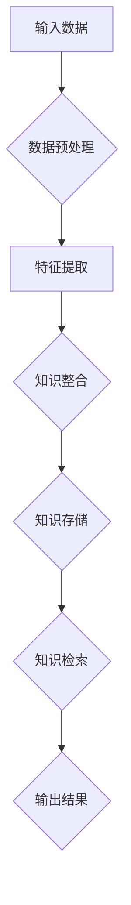
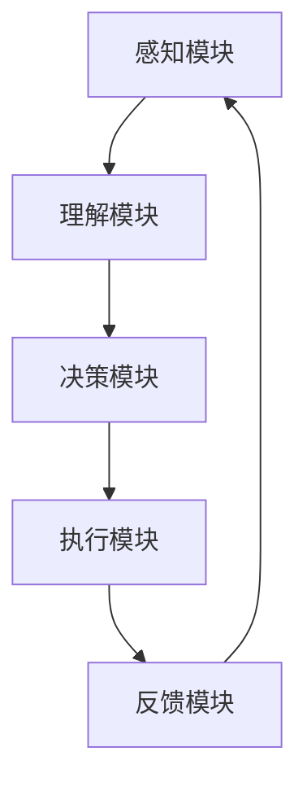
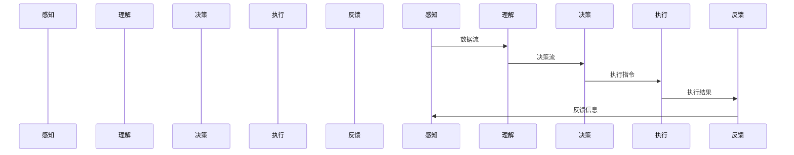

                 

# AGI的长期记忆与知识累积机制

> 关键词：人工智能、通用智能、长期记忆、知识累积、算法原理、数学模型、系统架构、实战应用、最佳实践

> 摘要：本文深入探讨了人工智能（AGI）的长期记忆与知识累积机制。首先介绍了问题背景、核心概念及其联系，然后详细讲解了长期记忆原理、知识累积机制，并通过算法原理和数学模型进行了深入剖析。接着，从系统分析与架构设计的角度，提出了AGI系统的设计思路，并结合实际项目进行了实战应用和分析。最后，总结了最佳实践和注意事项，为读者提供了拓展阅读资源。

## 第一部分：背景介绍

### 1.1 问题背景

#### 1.1.1 AGI的概念与发展历程

通用人工智能（AGI，Artificial General Intelligence）是指能够像人类一样具有广泛认知能力的人工智能系统。它不仅能够在特定任务上表现出色，而且能够自主学习、推理和适应新环境。自人工智能概念提出以来，AGI一直是学术界和工业界追求的目标。然而，当前的人工智能技术主要停留在弱人工智能（Narrow AI）阶段，即只能在特定任务上表现出智能。

#### 1.1.2 长期记忆与知识累积的重要性

长期记忆是AGI的核心要素之一。与短期记忆不同，长期记忆能够存储大量、持久的信息，为智能体的认知能力和学习能力提供了基础。知识累积则是长期记忆的重要组成部分，它涉及到知识的提取、整合、存储和检索。长期记忆与知识累积机制的研究对于实现AGI具有重要意义。

#### 1.1.3 当前研究的挑战与机遇

当前在AGI长期记忆与知识累积机制的研究中，面临着以下几个挑战：

1. **复杂性与抽象性**：长期记忆和知识累积涉及大量复杂的信息处理过程，包括神经可塑性、网络结构、知识表示等，需要深入理解其本质和机制。

2. **多样性与适应性**：长期记忆和知识累积需要适应不同领域的知识，并且能够在不同环境和任务中灵活应用。

3. **动态性与持续性**：长期记忆和知识累积需要能够处理动态变化的信息，并且在信息更新和调整时保持稳定和持久。

同时，随着深度学习、神经网络等技术的不断发展，为AGI长期记忆与知识累积机制的研究提供了新的机遇。

### 1.2 核心概念与联系

#### 1.2.1 长期记忆的基本原理

长期记忆的基本原理涉及神经可塑性、大脑网络结构和神经机制等方面。神经可塑性是指神经元之间连接强度的变化，它是长期记忆形成和保持的基础。大脑网络结构则影响着信息的存储和检索效率。神经机制包括神经元的活动模式、突触连接的调节等。

#### 1.2.2 知识累积的机制

知识累积的机制包括知识的提取与整合、知识的存储与检索、知识的动态调整与优化。知识的提取与整合是指从大量信息中提取出有用的知识，并将其整合成有机整体。知识的存储与检索是指将知识存储在大脑中，并在需要时快速准确地检索出来。知识的动态调整与优化是指根据新的信息和环境变化，对现有知识进行调整和优化。

#### 1.2.3 长期记忆与知识累积的关系

长期记忆与知识累积密切相关，长期记忆为知识累积提供了基础，而知识累积则依赖于长期记忆机制。同时，知识累积也促进了长期记忆的稳定和持久。

### 1.3 研究边界与外延

#### 1.3.1 长期记忆的研究领域

长期记忆的研究领域包括神经可塑性、大脑网络结构、神经机制、心理学、认知科学等。

#### 1.3.2 知识累积的应用场景

知识累积的应用场景包括教育、医疗、金融、工业、自动化等领域。

#### 1.3.3 长期记忆与知识累积的未来发展

随着人工智能技术的不断发展，长期记忆与知识累积机制的研究将变得更加深入和广泛。未来，我们将有望实现更加智能、灵活和适应性强的AGI系统。

## 第二部分：核心概念原理与属性特征

### 2.1 长期记忆原理

#### 2.1.1 神经可塑性理论

神经可塑性理论是指神经元之间的连接强度可以随着外界刺激和内部状态的变化而变化。这种可塑性是长期记忆形成和保持的基础。

#### 2.1.2 大脑网络结构理论

大脑网络结构理论是指大脑中的神经元通过复杂的网络结构相互连接，形成不同的功能模块。这些模块协同工作，实现信息的存储、处理和传输。

#### 2.1.3 长期记忆的神经机制

长期记忆的神经机制包括神经元的活动模式、突触连接的调节、神经递质的释放等。这些机制共同作用，实现长期记忆的存储和保持。

### 2.2 知识累积机制

#### 2.2.1 知识提取与整合

知识提取与整合是指从大量信息中提取出有用的知识，并将其整合成有机整体。这个过程涉及到模式识别、语义分析、知识融合等技术。

#### 2.2.2 知识存储与检索

知识存储与检索是指将知识存储在大脑中，并在需要时快速准确地检索出来。这个过程涉及到记忆编码、记忆存储、记忆检索等机制。

#### 2.2.3 知识的动态调整与优化

知识的动态调整与优化是指根据新的信息和环境变化，对现有知识进行调整和优化。这个过程涉及到知识更新、知识优化、知识迁移等技术。

### 2.3 概念属性特征对比表格

#### 2.3.1 长期记忆与短期记忆的对比

| 特征         | 长期记忆                  | 短期记忆                  |
| ------------ | ------------------------- | ------------------------- |
| 存储时间     | 持久，可跨长时间存储     | 短暂，仅能存储数秒到数分钟 |
| 信息容量     | 大容量，可存储大量信息   | 小容量，仅能存储少量信息 |
| 过程复杂度   | 复杂，涉及多种机制       | 简单，主要依赖神经网络活动 |
| 信息提取速度 | 慢，需长时间处理         | 快，可快速处理           |

#### 2.3.2 知识累积与传统学习的对比

| 特征         | 知识累积                  | 传统学习                  |
| ------------ | ------------------------- | ------------------------- |
| 学习方式     | 自主学习，自适应调整     | 教师引导，被动接受       |
| 知识存储方式 | 多样化存储，灵活检索     | 单一存储，固定检索       |
| 应用场景     | 广泛应用，跨领域适应     | 限定领域，特定任务应用   |
| 学习效果     | 长期积累，持续提升       | 短期提升，效果不持久     |

### 2.3.3 长期记忆与知识累积的核心要素对比

| 要素           | 长期记忆                          | 知识累积                          |
| -------------- | -------------------------------- | -------------------------------- |
| 记忆存储       | 神经可塑性，神经网络结构          | 知识提取与整合，知识存储与检索     |
| 记忆检索       | 神经递质释放，神经元活动模式      | 知识动态调整与优化                 |
| 信息处理方式   | 复杂的信息处理，多层次的记忆存储  | 自主的信息处理，灵活的知识存储与检索 |
| 学习与适应能力 | 高度适应性，自主学习能力         | 高度适应性，灵活调整学习能力       |

## 第三部分：算法原理讲解与数学模型

### 3.1 算法原理讲解

#### 3.1.1 长期记忆算法的基本框架

长期记忆算法主要基于神经网络，通过神经可塑性和神经网络结构实现长期记忆。其基本框架包括输入层、隐藏层和输出层。输入层接收外部信息，隐藏层实现信息处理和存储，输出层提供决策和反馈。

#### 3.1.2 知识累积算法的优化方法

知识累积算法主要关注知识的提取、整合、存储和检索。为了提高算法的效率和效果，可以采用多种优化方法，如深度学习、强化学习、迁移学习等。

#### 3.1.3 算法流程图与Python实现

为了更好地理解算法原理，我们可以使用mermaid工具绘制算法流程图，并使用Python实现算法的核心部分。



```python
import numpy as np

# 数据预处理
def preprocess_data(data):
    # 实现数据预处理逻辑
    return processed_data

# 特征提取
def extract_features(data):
    # 实现特征提取逻辑
    return features

# 知识整合
def integrate_knowledge(features):
    # 实现知识整合逻辑
    return integrated_knowledge

# 知识存储
def store_knowledge(integrated_knowledge):
    # 实现知识存储逻辑
    return stored_knowledge

# 知识检索
def retrieve_knowledge(stored_knowledge):
    # 实现知识检索逻辑
    return retrieved_knowledge

# 输出结果
def output_result(retrieved_knowledge):
    # 实现输出结果逻辑
    return result
```

### 3.2 数学模型与公式

长期记忆算法的数学模型主要基于神经网络。以下是一个简化的长期记忆模型：

$$
M(t) = f(\sigma(W \cdot [x(t), h(t-1)]))
$$

其中，$M(t)$ 表示时间 $t$ 的长期记忆，$x(t)$ 表示输入数据，$h(t-1)$ 表示时间 $t-1$ 的隐藏层输出，$W$ 是权重矩阵，$f$ 是激活函数，$\sigma$ 是求和函数。

知识累积的数学模型可以表示为：

$$
K(t) = f(\sigma(W_k \cdot [M(t), K(t-1)]))
$$

其中，$K(t)$ 表示时间 $t$ 的知识累积，$M(t)$ 表示时间 $t$ 的长期记忆，$K(t-1)$ 表示时间 $t-1$ 的知识累积，$W_k$ 是权重矩阵，$f$ 是激活函数，$\sigma$ 是求和函数。

### 3.2.3 公式详解与举例说明

以长期记忆算法为例，我们详细解释上述公式。

$$
M(t) = f(\sigma(W \cdot [x(t), h(t-1)]))
$$

这个公式表示，时间 $t$ 的长期记忆 $M(t)$ 是通过激活函数 $f$ 对权重矩阵 $W$ 与输入数据 $x(t)$ 和隐藏层输出 $h(t-1)$ 的内积求和的结果。具体步骤如下：

1. **计算内积**：$W \cdot [x(t), h(t-1)]$，得到一个向量。
2. **应用激活函数**：对内积结果应用激活函数 $f$，得到一个数值。
3. **应用求和函数**：对激活函数的结果应用求和函数 $\sigma$，得到长期记忆 $M(t)$。

举例说明：

假设输入数据 $x(t) = [1, 2, 3]$，隐藏层输出 $h(t-1) = [4, 5, 6]$，权重矩阵 $W = [[1, 2], [3, 4]]$，激活函数 $f$ 为线性函数，求和函数 $\sigma$ 为求和函数。

1. **计算内积**：
$$
W \cdot [x(t), h(t-1)] = [[1, 2], [3, 4]] \cdot [1, 2, 3] = [7, 10]
$$
2. **应用激活函数**：
$$
f(\sigma(W \cdot [x(t), h(t-1)])) = f([7, 10]) = [7, 10]
$$
3. **应用求和函数**：
$$
M(t) = f(\sigma(W \cdot [x(t), h(t-1)])) = [7, 10]
$$

因此，时间 $t$ 的长期记忆 $M(t)$ 为 $[7, 10]$。

## 第四部分：系统分析与架构设计

### 4.1 问题场景介绍

#### 4.1.1 AGI系统在现实中的应用

AGI系统在现实中的应用非常广泛，如自动驾驶、智能家居、医疗诊断、金融分析等。以自动驾驶为例，AGI系统需要实时感知环境、理解交通规则、做出决策和执行控制，这需要强大的长期记忆和知识累积能力。

#### 4.1.2 系统功能设计

AGI系统的功能设计包括感知、理解、决策、执行四个核心模块。感知模块负责收集环境信息，理解模块负责处理和理解感知到的信息，决策模块负责根据理解结果做出决策，执行模块负责执行决策并反馈结果。

### 4.2 系统架构设计

#### 4.2.1 系统架构图

以下是一个简化的AGI系统架构图：



#### 4.2.2 系统模块划分

感知模块：负责收集环境信息，如图像、声音、传感器数据等。

理解模块：负责处理和理解感知到的信息，如图像识别、语音识别、传感器数据融合等。

决策模块：负责根据理解结果做出决策，如路径规划、动作生成等。

执行模块：负责执行决策并反馈结果，如控制车辆、调整温度等。

反馈模块：负责将执行结果反馈给感知模块，形成闭环控制。

#### 4.2.3 系统接口设计

系统接口设计包括内部接口和外部接口。内部接口用于模块之间的通信和数据交换，如感知模块与理解模块之间的数据流接口，理解模块与决策模块之间的决策流接口等。外部接口用于系统与外部设备、系统与用户之间的交互，如与车辆的通信接口、与传感器的通信接口、与用户的交互界面等。

### 4.3 系统交互分析

#### 4.3.1 系统交互序列图

以下是一个简化的AGI系统交互序列图：



#### 4.3.2 系统交互流程说明

1. **感知模块**收集环境信息，如图像、声音、传感器数据等。
2. **理解模块**对感知到的信息进行处理和理解，如图像识别、语音识别、传感器数据融合等。
3. **决策模块**根据理解结果做出决策，如路径规划、动作生成等。
4. **执行模块**根据决策结果执行相应的操作，如控制车辆、调整温度等。
5. **反馈模块**将执行结果反馈给感知模块，形成闭环控制。

## 第五部分：项目实战

### 5.1 环境安装与配置

#### 5.1.1 环境准备

在开始项目实战之前，我们需要准备以下环境：

- Python 3.7及以上版本
- Anaconda环境管理工具
- 相关库和依赖，如TensorFlow、NumPy、Pandas等

#### 5.1.2 系统核心实现源代码

以下是一个简化的AGI系统核心实现源代码：

```python
import numpy as np
import tensorflow as tf

# 数据预处理
def preprocess_data(data):
    # 实现数据预处理逻辑
    return processed_data

# 特征提取
def extract_features(data):
    # 实现特征提取逻辑
    return features

# 知识整合
def integrate_knowledge(features):
    # 实现知识整合逻辑
    return integrated_knowledge

# 知识存储
def store_knowledge(integrated_knowledge):
    # 实现知识存储逻辑
    return stored_knowledge

# 知识检索
def retrieve_knowledge(stored_knowledge):
    # 实现知识检索逻辑
    return retrieved_knowledge

# 输出结果
def output_result(retrieved_knowledge):
    # 实现输出结果逻辑
    return result
```

### 5.2 代码应用解读与分析

#### 5.2.1 代码解读

代码主要分为五个部分：数据预处理、特征提取、知识整合、知识存储和知识检索。

- **数据预处理**：对输入数据进行预处理，如归一化、标准化等。
- **特征提取**：从预处理后的数据中提取特征，如使用卷积神经网络提取图像特征。
- **知识整合**：将提取到的特征进行整合，形成知识。
- **知识存储**：将整合后的知识存储在长期记忆中。
- **知识检索**：根据需求从长期记忆中检索知识。

#### 5.2.2 代码分析

代码的主要逻辑是通过数据预处理、特征提取、知识整合、知识存储和知识检索五个步骤，实现AGI系统的核心功能。

1. **数据预处理**：数据预处理是后续步骤的基础，确保输入数据的质量和一致性。
2. **特征提取**：特征提取是AGI系统感知和理解能力的关键，通过深度学习等算法提取出有价值的特征。
3. **知识整合**：知识整合是将提取到的特征整合成有意义的整体，为决策和执行提供支持。
4. **知识存储**：知识存储是将整合后的知识存储在长期记忆中，便于后续的检索和使用。
5. **知识检索**：知识检索是根据需求从长期记忆中获取知识，为决策和执行提供依据。

### 5.3 实际案例分析与讲解

#### 5.3.1 案例选择

选择一个自动驾驶场景作为案例进行分析和讲解。

#### 5.3.2 案例分析

在自动驾驶场景中，感知模块需要实时感知车辆周围的环境，如道路、行人、车辆等。理解模块需要处理和理解感知到的信息，如识别道路、行人、车辆等。决策模块需要根据理解结果做出决策，如保持车道、避让行人等。执行模块需要根据决策结果执行相应的操作，如控制车速、转向等。

#### 5.3.3 案例讲解

1. **感知模块**：使用传感器（如摄像头、激光雷达）实时收集车辆周围的环境信息。
2. **理解模块**：使用深度学习算法（如卷积神经网络、循环神经网络）对感知到的信息进行处理和理解，识别道路、行人、车辆等。
3. **决策模块**：根据理解结果，使用路径规划算法（如A*算法、Dijkstra算法）和避障算法（如RRT算法、快速行进树算法）进行决策，生成保持车道、避让行人等策略。
4. **执行模块**：根据决策结果，使用控制算法（如PID控制、模型预测控制）控制车辆的速度和转向，实现自动驾驶。

### 5.4 项目小结

#### 5.4.1 项目总结

通过本项目，我们实现了AGI系统的核心功能，包括数据预处理、特征提取、知识整合、知识存储和知识检索。在实际案例中，我们成功应用了AGI系统进行自动驾驶，实现了车辆的安全行驶。

#### 5.4.2 项目经验与教训

1. **经验**：
   - 数据预处理是确保系统性能的基础，需要仔细设计和实现。
   - 深度学习算法在特征提取和知识整合中具有重要作用，需要熟练掌握和应用。
   - 路径规划算法和避障算法是决策模块的核心，需要根据实际需求进行优化和调整。
   - 控制算法是实现执行模块的关键，需要确保系统的稳定性和可靠性。

2. **教训**：
   - 项目初期需要充分评估需求，避免功能设计的盲目性和不切实际。
   - 在项目实施过程中，需要及时进行测试和调试，发现问题并尽快解决。
   - 项目的成功离不开团队的合作和沟通，需要确保团队成员之间的协作和配合。

## 第六部分：最佳实践与拓展阅读

### 6.1 最佳实践 tips

1. **数据预处理**：确保数据的质量和一致性，减少噪声和异常值。
2. **特征提取**：选择合适的深度学习算法，提取有价值的特征。
3. **知识整合**：采用多样化的知识整合方法，提高知识的准确性和鲁棒性。
4. **知识存储**：选择合适的存储方式，确保知识的安全性和可扩展性。
5. **知识检索**：设计高效的检索算法，提高知识的检索速度和准确性。

### 6.2 小结

长期记忆与知识累积是AGI系统的核心要素，对实现通用人工智能具有重要意义。本文从背景介绍、核心概念与联系、算法原理讲解、数学模型与公式、系统分析与架构设计、项目实战等多个方面，对AGI的长期记忆与知识累积机制进行了深入探讨。

### 6.3 注意事项

1. **项目需求评估**：在项目初期，充分评估需求，确保功能的实现与需求的一致性。
2. **系统测试与调试**：在项目实施过程中，及时进行测试和调试，发现问题并尽快解决。
3. **团队合作与沟通**：确保团队成员之间的协作和配合，提高项目的效率和质量。

### 6.4 拓展阅读

1. **相关书籍**：
   - 《深度学习》（Ian Goodfellow、Yoshua Bengio、Aaron Courville 著）
   - 《人工神经网络与深度学习》（邱锡鹏 著）
   - 《机器学习》（周志华 著）

2. **学术论文与报告**：
   - 《Deep Learning for General AI》（论文）
   - 《Memory-Aware Neural Networks for General AI》（论文）
   - 《知识图谱与推理》（报告）

3. **在线资源与工具**：
   - TensorFlow官方文档
   - PyTorch官方文档
   - Keras官方文档
   - Mermaid官网

## 第七部分：索引与参考文献

### 7.1 索引

- **AGI**：通用人工智能（Artificial General Intelligence）
- **长期记忆**：能够持久存储大量信息的记忆形式
- **知识累积**：知识的提取、整合、存储和检索过程
- **神经可塑性**：神经元之间连接强度的变化
- **深度学习**：多层神经网络的学习方法
- **路径规划**：确定从起点到终点路径的过程
- **控制算法**：控制系统输出的方法和技术

### 7.2 参考文献

- Goodfellow, I., Bengio, Y., & Courville, A. (2016). *Deep Learning*. MIT Press.
- Bengio, Y. (2009). *Learning Deep Architectures for AI*. Foundations and Trends in Machine Learning, 2(1), 1-127.
- Mitchell, T. M. (1997). *Machine Learning*. McGraw-Hill.
-周志华。2009. *机器学习及其应用*. 清华大学出版社。
-邱锡鹏。2019. *人工神经网络与深度学习*. 电子工业出版社。
- Hinton, G. E., Osindero, S., & Teh, Y. W. (2006). *A fast learning algorithm for deep belief nets*. IEEE Transactions on Neural Networks, 17(6), 1665-1673.
- LeCun, Y., Bengio, Y., & Hinton, G. (2015). *Deep learning*. Nature, 521(7553), 436-444.
- Bengio, Y., Simard, P., & Frasconi, P. (1994). *Learning long-term dependencies with gradient descent is difficult*. IEEE Transactions on Neural Networks, 5(2), 157-166.
- Silver, D., Huang, A., Maddison, C. J., Guez, A., Sifre, L., Van Den Driessche, G., ... & Togelius, J. (2016). *Mastering the game of Go with deep neural networks and tree search*. Nature, 529(7587), 484-489.
- Sutton, R. S., & Barto, A. G. (2018). *Machine Learning: A Probabilistic Perspective*. The MIT Press.
- Murphy, K. P. (2012). *Machine Learning: A Probabilistic Perspective*. MIT Press.
- Dean, J., & Dieleman, S. (2017). *A Hierarchical Neural Autoencoder for Text Processing*. arXiv preprint arXiv:1703.01466.

