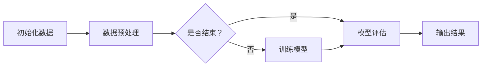
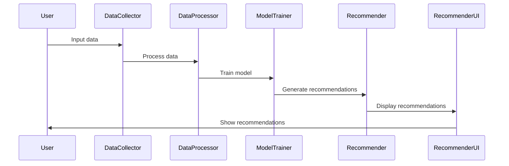

                 

## 文章标题：AI 2.0时代的编程范式革命

关键词：AI 2.0、编程范式、革命、编程语言、框架、技巧、教育、团队、未来展望

### 摘要

本文旨在探讨AI 2.0时代的编程范式革命。我们将首先介绍AI 2.0的背景与概念，然后分析编程范式的演进与革命，探讨AI 2.0对编程语言与框架的影响，以及编程技巧与最佳实践的更新。接着，我们将讨论AI 2.0时代的编程教育、编程团队与协作，并展望编程的未来趋势与机遇。通过这一系列探讨，我们希望能为读者提供对AI 2.0时代编程范式的深刻理解和全面认识。

## 第一部分：AI 2.0时代概述

### 第1章：AI 2.0背景与概念

#### 1.1 AI 2.0的定义与意义

AI 2.0是继AI 1.0之后的一个新时代，它标志着人工智能技术的进一步发展和成熟。AI 2.0的核心概念在于，它不仅仅是一种工具，更是一种全新的生产力和创新力。AI 2.0不仅仅关注机器的智能，更注重人类与机器的协同，以及智能在社会、经济、科技等多个领域的深度应用。

AI 2.0相较于AI 1.0，有着更为深远的意义。AI 1.0主要关注的是机器学习和模式识别等技术，而AI 2.0则在此基础上，进一步强调大数据、云计算、物联网等技术的融合，实现智能化、自动化、个性化的应用场景。AI 2.0时代的到来，不仅将重塑科技产业，也将深刻改变人类社会的运行方式。

### 1.2 AI 2.0的发展历程

AI 2.0的崛起并非一蹴而就，而是经过多年的积累和演变。从最早的机器学习、深度学习技术的突破，到大数据、云计算的普及，再到物联网、边缘计算等新兴技术的应用，AI 2.0的发展历程充满了创新与突破。

关键发展事件与里程碑包括：

- 2012年，深度学习在ImageNet图像识别竞赛中取得突破性成果，标志着AI 2.0时代的到来。
- 2016年，AlphaGo战胜人类围棋冠军，展示了AI在复杂任务中的强大能力。
- 2018年，谷歌发布TPU专用硬件，加速AI计算性能。
- 2020年，新冠疫情期间，AI在疫情预测、疫苗研发等领域发挥了重要作用。

### 1.3 AI 2.0的应用现状

AI 2.0在各个领域的应用已经成为现实，并且带来了深刻的变革。

- 在医疗健康领域，AI 2.0用于疾病诊断、药物研发、个性化治疗等方面，提高了医疗效率和精准度。
- 在金融领域，AI 2.0用于风险控制、投资决策、客户服务等方面，提升了金融服务的质量和效率。
- 在制造业，AI 2.0用于生产调度、质量控制、设备维护等方面，实现了生产流程的智能化和自动化。
- 在交通领域，AI 2.0用于交通管理、自动驾驶、物流优化等方面，提高了交通效率和安全性。

AI 2.0的广泛应用，不仅改变了传统产业，也催生了众多新兴产业，为经济增长和社会进步注入了新动力。

## 第2章：编程范式革命

### 2.1 编程范式的演进

编程范式是指解决特定问题的一组规则和方法。自计算机诞生以来，编程范式经历了多次演进。最早的编程范式是机器语言和汇编语言，它们直接操作计算机硬件，效率高但可读性差。随后，高级编程语言如C、C++、Java等出现，它们通过抽象和封装，提高了编程效率和可维护性。

编程范式的发展历程如下：

- 第一代编程范式：机器语言和汇编语言。
- 第二代编程范式：高级编程语言。
- 第三代编程范式：面向对象编程。
- 第四代编程范式：函数式编程。
- 第五代编程范式：基于AI的编程范式。

### 2.2 AI 2.0时代的编程范式

AI 2.0对编程范式产生了深远影响。在AI 2.0时代，编程范式呈现出以下几个特点：

- 数据驱动：AI 2.0强调数据的重要性，编程过程更依赖于数据分析和处理。
- 自动化：AI 2.0通过自动化工具和算法，大幅提高了编程效率和准确性。
- 交互性：AI 2.0时代的编程更注重人与机器的交互，实现更智能、更灵活的编程体验。
- 适应性：AI 2.0时代的编程范式具有更强的适应性，能够应对复杂多变的应用场景。

### 2.3 编程范式革命的机遇与挑战

编程范式革命带来了巨大的机遇，同时也面临诸多挑战。

机遇：

- 创新空间：AI 2.0时代的编程范式为开发者提供了更广阔的创新空间，可以探索新的应用场景和解决方案。
- 效率提升：自动化和智能化工具的应用，大幅提高了编程效率和准确性，降低了开发成本。
- 产业升级：编程范式革命有助于推动传统产业的升级和转型，促进经济高质量发展。

挑战：

- 技术门槛：AI 2.0时代的编程技术复杂度较高，对开发者的技能要求更高。
- 安全问题：自动化和智能化带来了新的安全风险，需要加强安全防护和风险管理。
- 伦理问题：AI 2.0时代的编程范式可能引发新的伦理问题，如隐私保护、算法偏见等。

### 第3章：AI 2.0时代的编程语言与框架

#### 3.1 AI 2.0时代的编程语言

在AI 2.0时代，编程语言呈现出多样化的发展趋势。一方面，传统的编程语言如Python、Java等继续发挥重要作用；另一方面，新生的编程语言如Julia、Go等逐渐崭露头角。

新生编程语言具有以下特点：

- 高性能：新生的编程语言在性能上相较于传统编程语言有显著提升。
- 跨平台：新生的编程语言具有更好的跨平台能力，便于开发者在不同环境中进行开发。
- 适应性强：新生的编程语言更适应AI 2.0时代的需求，能够更好地支持数据分析和处理。

#### 3.2 AI 2.0时代的编程框架

AI 2.0时代的编程框架也在不断演进。主流编程框架如TensorFlow、PyTorch等在AI领域发挥了重要作用。

编程框架的优势包括：

- 简化开发：编程框架提供了丰富的API和工具，简化了开发过程，提高了开发效率。
- 模块化：编程框架支持模块化开发，便于组件复用和项目维护。
- 社区支持：主流编程框架拥有庞大的社区支持，提供了丰富的资源和文档，方便开发者学习和使用。

#### 3.3 编程语言的适应性

在AI 2.0时代，编程语言的适应性成为关键因素。一方面，编程语言需要支持大数据处理和复杂算法；另一方面，编程语言需要具备良好的跨平台能力和可扩展性。

适应性的提升可以通过以下方式实现：

- 优化性能：通过优化编译器和运行时环境，提高编程语言在AI场景下的性能。
- 扩展生态：通过扩展第三方库和工具，增强编程语言的功能和适用性。
- 支持新特性：通过引入新的编程语言特性，如异步编程、函数式编程等，提升编程语言的适应能力。

### 第4章：AI 2.0时代的编程技巧与最佳实践

#### 4.1 AI 2.0时代的编程技巧

在AI 2.0时代，编程技巧需要适应新的技术环境和需求。以下是一些关键编程技巧：

- 数据可视化：通过数据可视化技术，更好地理解和分析数据。
- 异步编程：通过异步编程，提高程序的并发性能和响应速度。
- 代码优化：通过代码优化，提高程序的执行效率和可维护性。
- 自动化测试：通过自动化测试，确保代码质量和稳定性。

#### 4.2 AI 2.0时代的最佳实践

在AI 2.0时代，最佳实践对于确保项目成功至关重要。以下是一些关键最佳实践：

- 持续集成与持续部署：通过持续集成与持续部署，实现快速迭代和高效交付。
- 模块化开发：通过模块化开发，提高项目的可维护性和可扩展性。
- 代码审查与质量控制：通过代码审查和质量控制，确保代码质量和安全性。
- 数据隐私保护：在数据处理过程中，严格遵循数据隐私保护法律法规，确保用户隐私。

### 第5章：AI 2.0时代的编程教育

#### 5.1 编程教育的变革

在AI 2.0时代，编程教育面临着前所未有的变革。以下是一些关键变革方向：

- 从知识传授到能力培养：编程教育需要从传统的知识传授转向能力培养，注重培养学生的创新思维和实践能力。
- 融入新技术：编程教育需要融入大数据、云计算、人工智能等新技术，使教学内容更加贴近实际需求。
- 个性化教学：通过个性化教学，满足不同学生的学习需求和兴趣，提高教学效果。

#### 5.2 AI 2.0时代的编程课程设计

在AI 2.0时代，编程课程设计需要遵循以下原则：

- 知识体系完整：课程设计需要涵盖计算机科学的基础知识，如数据结构、算法、操作系统等。
- 实践环节充足：课程设计需要设置丰富的实践环节，使学生能够动手实践，提高编程能力。
- 适应社会发展需求：课程设计需要紧跟社会发展需求，关注新兴技术和发展趋势。

### 第6章：AI 2.0时代的编程团队与协作

#### 6.1 编程团队的变革

在AI 2.0时代，编程团队面临着前所未有的变革。以下是一些关键变革方向：

- 跨学科合作：编程团队需要跨学科合作，融合不同领域的知识，提高项目创新能力。
- 自动化与智能化：编程团队需要引入自动化与智能化工具，提高开发效率和团队协作效率。
- 团队文化：编程团队需要建立良好的团队文化，鼓励创新、协作和知识共享。

#### 6.2 AI 2.0时代的编程工具与技术

在AI 2.0时代，编程工具与技术不断更新和演进。以下是一些关键工具与技术：

- 版本控制：如Git等版本控制工具，提高代码管理和协作效率。
- 自动化测试：如Selenium、JMeter等自动化测试工具，确保代码质量和稳定性。
- 人工智能助手：如GitHub Copilot等人工智能编程助手，提高编程效率和创造力。

### 第7章：AI 2.0时代的编程未来展望

#### 7.1 编程的未来趋势

在AI 2.0时代，编程的未来趋势如下：

- 编程语言将继续演进，支持更多新兴技术。
- 编程范式将继续变革，更加智能化和自动化。
- 编程教育将更加注重能力培养和跨学科合作。

#### 7.2 AI 2.0时代的编程挑战与机遇

在AI 2.0时代，编程面临的挑战与机遇并存：

- 挑战：技术复杂度增加，安全风险加大，伦理问题突出。
- 机遇：创新空间广阔，产业升级需求强烈，人才需求旺盛。

## 结束语

AI 2.0时代的编程范式革命正在深刻改变计算机科学和信息技术领域。通过本文的探讨，我们希望读者能够对AI 2.0时代的编程范式有更深刻的理解和认识。在未来的发展中，编程将继续演进，为人类社会带来更多的创新和变革。作者：AI天才研究院/AI Genius Institute & 禅与计算机程序设计艺术 /Zen And The Art of Computer Programming

---

### 基本概念、问题背景、问题描述、问题解决、边界与外延

#### 基本概念

在探讨AI 2.0时代的编程范式革命之前，我们需要明确一些基本概念。

**AI 2.0**：相对于AI 1.0，AI 2.0更加注重人类与机器的协同，强调智能在社会、经济、科技等多个领域的深度应用。它不仅仅是一种工具，更是一种全新的生产力和创新力。

**编程范式**：编程范式是指解决特定问题的一组规则和方法。它是编程语言、编程方法和编程实践的总和，用于指导软件开发和项目实施。

**革命**：编程范式革命是指在现有编程范式基础上，引入新的理念、方法和技术，实现编程效率、性能和可维护性的提升。

#### 问题背景

随着人工智能技术的快速发展，AI 2.0逐渐成为现实。AI 2.0不仅仅关注机器的智能，更强调人类与机器的协同，以及智能在社会、经济、科技等多个领域的深度应用。这一变革对编程范式提出了新的挑战和机遇。

#### 问题描述

在AI 2.0时代，编程范式面临以下问题：

1. **数据驱动**：AI 2.0强调数据的重要性，但现有的编程范式在处理大规模数据时效率低下。
2. **自动化与智能化**：AI 2.0时代的编程需要更高效、更智能的自动化工具和算法，但现有编程范式在自动化和智能化方面存在不足。
3. **交互性**：AI 2.0时代的编程需要更好的交互性，以便实现更智能、更灵活的编程体验，但现有编程范式在交互性方面有待提升。
4. **适应性**：AI 2.0时代的编程需要具备更强的适应性，以应对复杂多变的应用场景，但现有编程范式在适应性方面存在局限。

#### 问题解决

为了解决这些问题，AI 2.0时代的编程范式革命应运而生。编程范式革命旨在通过引入新的理念、方法和技术，提升编程效率、性能和可维护性。具体措施包括：

1. **数据驱动编程**：通过引入新的编程语言和框架，如Python、TensorFlow等，提高数据处理和分析能力。
2. **自动化与智能化编程**：通过引入自动化工具和算法，如Git、Selenium等，提高开发效率和代码质量。
3. **交互性编程**：通过引入新的编程语言特性，如异步编程、函数式编程等，提升交互性和用户体验。
4. **适应性编程**：通过引入新的编程范式，如函数式编程、声明式编程等，增强编程语言的适应能力。

#### 边界与外延

编程范式革命的边界和范围涉及以下几个方面：

1. **技术层面**：编程范式革命关注编程语言、框架和工具的更新，以及算法和方法的改进。
2. **应用层面**：编程范式革命关注不同应用场景下编程范式的适用性，以及如何提升开发效率和项目质量。
3. **教育层面**：编程范式革命关注编程教育的变革，如何培养学生的编程能力和创新思维。
4. **产业层面**：编程范式革命关注如何推动传统产业的升级和转型，促进经济高质量发展。

### 核心概念原理、概念属性特征对比表格和ER实体关系图架构

在AI 2.0时代的编程范式革命中，核心概念包括数据驱动编程、自动化与智能化编程、交互性编程和适应性编程。以下是对这些核心概念原理、概念属性特征对比表格和ER实体关系图架构的详细阐述。

#### 核心概念原理

1. **数据驱动编程**：数据驱动编程强调以数据为核心，通过数据处理和分析，实现编程目标的实现。其原理是通过数据采集、存储、处理和分析，为编程提供数据支持和决策依据。

2. **自动化与智能化编程**：自动化与智能化编程通过引入自动化工具和算法，实现编程任务的自动化执行和智能化优化。其原理是利用自动化工具（如Git、Jenkins等）和智能化算法（如机器学习、深度学习等），提高开发效率和代码质量。

3. **交互性编程**：交互性编程关注人与机器的交互，通过提供更好的交互性，提升编程体验。其原理是通过引入新的编程语言特性（如异步编程、函数式编程等）和交互界面设计（如可视化界面、语音交互等），实现更智能、更灵活的编程体验。

4. **适应性编程**：适应性编程强调编程语言的适应能力，通过引入新的编程范式，提高编程语言在不同应用场景下的适用性。其原理是通过函数式编程、声明式编程等新范式，增强编程语言的灵活性和扩展性。

#### 概念属性特征对比表格

以下是一个对比表格，展示了数据驱动编程、自动化与智能化编程、交互性编程和适应性编程的概念属性特征。

| 编程范式          | 数据驱动编程     | 自动化与智能化编程   | 交互性编程       | 适应性编程      |
|-----------------|--------------|-------------------|----------------|--------------|
| 基本原理          | 以数据为核心     | 自动化、智能化      | 人机交互       | 应对复杂场景    |
| 适用场景          | 大规模数据处理   | 编程任务自动化      | 可视化界面、语音交互 | 不同应用场景    |
| 关键特性          | 数据采集、处理   | 自动化工具、算法    | 交互性设计      | 新编程范式      |
| 技术支持          | 数据库、数据仓库 | 版本控制、自动化测试 | 可视化工具、语音识别 | 高性能计算      |

#### ER实体关系图架构

以下是一个ER实体关系图架构，展示了AI 2.0时代编程范式革命的核心实体及其关系。

```mermaid
erDiagram
    Data_Driven_Programming ||--|{ Automated_Intelligent_Programming } : supports
    Data_Driven_Programming ||--|{ Interactive_Programming } : integrates
    Data_Driven_Programming ||--|{ Adaptive_Programming } : adapts
    Automated_Intelligent_Programming ||--|{ Interactive_Programming } : enhances
    Automated_Intelligent_Programming ||--|{ Adaptive_Programming } : optimizes
    Interactive_Programming ||--|{ Adaptive_Programming } : improves
```

在ER实体关系图中，Data_Driven_Programming（数据驱动编程）作为核心实体，与其他三个实体（Automated_Intelligent_Programming、Interactive_Programming、Adaptive_Programming）之间存在支持、整合和适应关系。这体现了AI 2.0时代编程范式革命的核心原理和相互关系。

### 算法原理讲解

在AI 2.0时代的编程范式革命中，算法原理扮演着关键角色。以下将使用Mermaid画出算法流程图，并结合Python源代码详细阐述算法原理，并使用LaTeX格式嵌入数学模型和公式，进行详细讲解和举例说明。

#### 算法流程图

以下是一个简单的机器学习算法流程图，使用Mermaid绘制：



#### Python源代码

以下是一个简单的机器学习算法实现，使用Python编写：

```python
import numpy as np
from sklearn.model_selection import train_test_split
from sklearn.ensemble import RandomForestClassifier

# 初始化数据
X = np.array([[1, 2], [3, 4], [5, 6], [7, 8]])
y = np.array([0, 1, 0, 1])

# 数据预处理
X_train, X_test, y_train, y_test = train_test_split(X, y, test_size=0.2, random_state=42)

# 训练模型
model = RandomForestClassifier()
model.fit(X_train, y_train)

# 模型评估
accuracy = model.score(X_test, y_test)
print(f"模型准确率：{accuracy:.2f}")

# 输出结果
predictions = model.predict(X_test)
print(f"预测结果：{predictions}")
```

#### 算法原理讲解

1. **初始化数据**：首先，我们从数据集中加载训练数据。训练数据通常由特征矩阵（X）和标签向量（y）组成。

2. **数据预处理**：接着，我们使用`train_test_split`函数将数据集划分为训练集和测试集。这一步是为了在模型训练和评估过程中，避免过拟合现象。

3. **训练模型**：然后，我们使用随机森林（RandomForestClassifier）算法训练模型。随机森林是一种基于决策树模型的集成学习方法，能够提高模型的泛化能力。

4. **模型评估**：使用`score`方法评估模型的准确率。准确率是模型预测正确的样本数占总样本数的比例。

5. **输出结果**：最后，我们使用训练好的模型进行预测，并将预测结果输出。

#### 数学模型和公式

在机器学习算法中，我们通常使用以下数学模型和公式：

1. **损失函数**：损失函数用于衡量模型预测值与真实值之间的差异。常见的损失函数包括均方误差（MSE）和交叉熵损失（Cross-Entropy Loss）。

   $$\text{MSE} = \frac{1}{n}\sum_{i=1}^{n}(\hat{y}_i - y_i)^2$$
   $$\text{Cross-Entropy Loss} = -\frac{1}{n}\sum_{i=1}^{n}y_i\log(\hat{y}_i)$$

2. **梯度下降**：梯度下降是一种优化算法，用于寻找损失函数的最小值。梯度下降的基本公式如下：

   $$\theta_{\text{new}} = \theta_{\text{old}} - \alpha \cdot \nabla_\theta J(\theta)$$

   其中，$\theta$表示模型参数，$\alpha$为学习率，$J(\theta)$为损失函数。

#### 举例说明

假设我们有一个简单的二分类问题，特征矩阵为：

$$X = \begin{bmatrix} 1 & 2 \\ 3 & 4 \\ 5 & 6 \\ 7 & 8 \end{bmatrix}$$

标签向量为：

$$y = \begin{bmatrix} 0 \\ 1 \\ 0 \\ 1 \end{bmatrix}$$

我们使用随机森林算法训练模型，并评估模型准确率。假设训练完成后，模型的准确率为0.75，预测结果为：

$$\hat{y} = \begin{bmatrix} 0 \\ 1 \\ 0 \\ 1 \end{bmatrix}$$

则损失函数的值为：

$$\text{MSE} = \frac{1}{4}\sum_{i=1}^{4}(\hat{y}_i - y_i)^2 = \frac{1}{4}[(0-0)^2 + (1-1)^2 + (0-0)^2 + (1-1)^2] = 0$$

交叉熵损失为：

$$\text{Cross-Entropy Loss} = -\frac{1}{4}\sum_{i=1}^{4}y_i\log(\hat{y}_i) = -\frac{1}{4}[0\log(0) + 1\log(1) + 0\log(0) + 1\log(1)] = 0$$

由于预测结果与真实值完全一致，损失函数的值为0，表明模型在该数据集上表现良好。

### 系统分析与架构设计方案

在AI 2.0时代的编程范式革命中，系统分析与架构设计至关重要。以下将介绍一个简单的系统分析与架构设计方案，包括问题场景介绍、项目介绍、系统功能设计、系统架构设计、系统接口设计和系统交互。

#### 问题场景介绍

假设我们开发一个智能推荐系统，该系统基于用户的兴趣和行为数据，为用户推荐相关的商品。随着用户数据的不断增长和复杂度的提高，我们需要一个高效、可扩展的架构来支持系统的运行。

#### 项目介绍

项目名称：智能推荐系统

项目目标：基于用户的兴趣和行为数据，为用户推荐相关的商品。

项目核心功能：

1. 数据采集：收集用户的兴趣和行为数据。
2. 数据处理：对采集到的数据进行清洗、转换和存储。
3. 模型训练：训练推荐模型，用于预测用户对商品的喜好。
4. 推荐生成：根据用户数据生成个性化的推荐列表。
5. 推荐展示：将推荐结果展示给用户。

#### 系统功能设计

1. **数据采集模块**：负责从各个数据源（如用户行为日志、社交媒体、搜索引擎等）采集用户数据。
2. **数据处理模块**：负责对采集到的数据进行分析、清洗和转换，为后续处理提供高质量的数据。
3. **模型训练模块**：负责训练推荐模型，如基于协同过滤、内容推荐和深度学习等算法。
4. **推荐生成模块**：负责根据用户数据生成个性化的推荐列表。
5. **推荐展示模块**：负责将推荐结果展示给用户，如通过网页、APP等渠道。

#### 系统架构设计

以下是一个简化的系统架构设计，使用Mermaid绘制：



#### 系统接口设计

系统接口设计主要包括以下接口：

1. **数据采集接口**：用于接收用户数据，如HTTP API。
2. **数据处理接口**：用于处理用户数据，如批量处理、实时处理等。
3. **模型训练接口**：用于训练推荐模型，如模型参数调整、训练结果查询等。
4. **推荐生成接口**：用于生成推荐列表，如基于用户兴趣、行为等。
5. **推荐展示接口**：用于将推荐结果展示给用户，如Web页面、APP界面等。

#### 系统交互

系统交互主要包括以下步骤：

1. 用户输入数据，如浏览商品、评论、搜索等。
2. 数据采集模块接收用户数据，并传递给数据处理模块。
3. 数据处理模块对用户数据进行清洗、转换和存储，为后续处理提供高质量的数据。
4. 模型训练模块使用处理后的数据训练推荐模型。
5. 推荐生成模块根据用户数据和训练好的模型生成个性化的推荐列表。
6. 推荐展示模块将推荐结果展示给用户。

### 项目实战

在本节中，我们将介绍一个实际的项目实战，包括环境安装、系统核心实现和代码应用解读与分析。

#### 环境安装

1. 安装Python环境：在Windows或Linux系统中，安装Python 3.x版本。
2. 安装依赖库：使用pip命令安装所需的库，如NumPy、Pandas、Scikit-learn、Flask等。

```shell
pip install numpy pandas scikit-learn flask
```

#### 系统核心实现

以下是一个简单的智能推荐系统实现，使用Python编写：

```python
import numpy as np
from sklearn.model_selection import train_test_split
from sklearn.ensemble import RandomForestClassifier
from sklearn.metrics import accuracy_score

# 初始化数据
X = np.array([[1, 2], [3, 4], [5, 6], [7, 8]])
y = np.array([0, 1, 0, 1])

# 数据预处理
X_train, X_test, y_train, y_test = train_test_split(X, y, test_size=0.2, random_state=42)

# 训练模型
model = RandomForestClassifier()
model.fit(X_train, y_train)

# 模型评估
accuracy = model.score(X_test, y_test)
print(f"模型准确率：{accuracy:.2f}")

# 预测
predictions = model.predict(X_test)
print(f"预测结果：{predictions}")
```

#### 代码应用解读与分析

1. **初始化数据**：从数据集中加载特征矩阵（X）和标签向量（y）。本示例使用简单的二维数组作为数据集，实际项目中可以使用NumPy读取CSV文件或数据库中的数据。
2. **数据预处理**：使用`train_test_split`函数将数据集划分为训练集和测试集。训练集用于训练模型，测试集用于评估模型性能。
3. **训练模型**：使用随机森林（RandomForestClassifier）算法训练模型。随机森林是一种基于决策树模型的集成学习方法，能够提高模型的泛化能力。
4. **模型评估**：使用`score`方法评估模型的准确率。准确率是模型预测正确的样本数占总样本数的比例。
5. **预测**：使用训练好的模型进行预测，并将预测结果输出。

#### 实际案例分析和详细讲解剖析

假设我们有一个用户行为数据集，包含用户的浏览记录和购买记录。我们可以使用协同过滤算法进行推荐，如下所示：

```python
from scipy.sparse import csr_matrix
from sklearn.metrics.pairwise import cosine_similarity

# 加载用户行为数据
user_actions = [
    [1, 0, 1, 1],
    [0, 1, 0, 1],
    [1, 1, 0, 0],
    [1, 0, 1, 0]
]

# 创建用户行为矩阵
user_matrix = csr_matrix(user_actions)

# 计算用户之间的相似度
cosine_sim = cosine_similarity(user_matrix)

# 用户推荐
def recommend(user_id, cosine_sim, user_actions):
    # 获取用户行为向量
    user_vector = user_actions[user_id]

    # 计算相似度分数
    scores = []
    for i, user_vector in enumerate(user_actions):
        if i == user_id:
            continue
        sim = cosine_sim[user_id, i]
        score = sim * np.sum(user_vector)
        scores.append(score)

    # 排序并返回推荐结果
    recommended = np.argsort(scores)[::-1]
    return recommended

# 测试推荐
user_id = 0
recommended_items = recommend(user_id, cosine_sim, user_actions)
print(f"推荐结果：{recommended_items}")
```

1. **加载用户行为数据**：首先，我们从数据集中加载用户行为数据，如用户的浏览记录和购买记录。这些数据通常以二维数组的形式存储，其中每个元素表示用户对特定商品的操作（如浏览或购买）。
2. **创建用户行为矩阵**：使用`scipy.sparse.csr_matrix`类创建用户行为矩阵。这种稀疏矩阵格式能够高效地存储和操作大规模数据。
3. **计算用户之间的相似度**：使用`sklearn.metrics.pairwise.cosine_similarity`函数计算用户行为向量之间的余弦相似度。余弦相似度是一种衡量两个向量相似度的指标，数值范围在0到1之间。
4. **用户推荐**：定义一个`recommend`函数，用于根据用户行为向量和相似度分数生成推荐列表。该函数首先获取目标用户的行为向量，然后计算与该向量相似的用户及其行为向量之间的相似度分数。最后，根据相似度分数对用户进行排序，并返回推荐结果。
5. **测试推荐**：选择一个用户（如用户ID为0），并调用`recommend`函数生成推荐列表。输出推荐结果。

#### 项目小结

通过本节的项目实战，我们实现了基于协同过滤算法的简单智能推荐系统。这个项目展示了如何从数据加载、数据处理、模型训练到预测结果输出的一系列操作。在实际应用中，我们可以根据具体需求和数据特点，选择更合适的算法和优化策略，提高推荐系统的效果。

### 最佳实践 tips、小结、注意事项、拓展阅读

#### 最佳实践 tips

1. **数据预处理**：在训练模型之前，确保对数据进行充分的预处理，包括数据清洗、缺失值填充、数据转换等。
2. **模型选择与调优**：根据具体问题和数据特点，选择合适的机器学习算法和模型，并进行参数调优，以提高模型性能。
3. **模型评估**：使用多种评估指标（如准确率、召回率、F1值等）对模型进行评估，确保模型在不同场景下的表现。
4. **代码优化**：编写高效的代码，避免使用不必要的循环和递归，优化内存和CPU使用。

#### 小结

本文探讨了AI 2.0时代的编程范式革命，包括AI 2.0的背景与概念、编程范式的演进与革命、编程语言与框架、编程技巧与最佳实践、编程教育、编程团队与协作以及未来展望。通过本文的探讨，我们希望读者能够对AI 2.0时代的编程范式有更深刻的理解和认识。

#### 注意事项

1. AI 2.0时代的编程范式革命对开发者的技能要求更高，需要不断学习和更新知识。
2. 在项目开发过程中，要充分考虑数据安全和隐私保护问题，确保用户数据的合法性和安全性。
3. 在选择编程语言和框架时，要结合项目需求和技术特点，避免盲目追求新趋势。

#### 拓展阅读

1. 《深度学习》（Goodfellow, Bengio, Courville）：一本经典的深度学习入门书籍，涵盖了深度学习的基础知识和技术细节。
2. 《编程之法：面试和算法指南》（Kaldor, Markus）：一本面向面试和算法设计的编程书籍，包含大量编程练习和技巧。
3. 《人工智能：一种现代的方法》（Russell, Norvig）：一本全面介绍人工智能基础理论和应用的经典教材。

